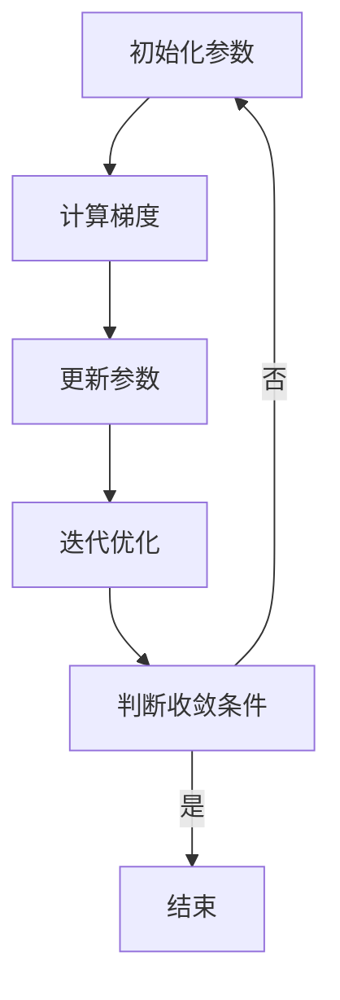
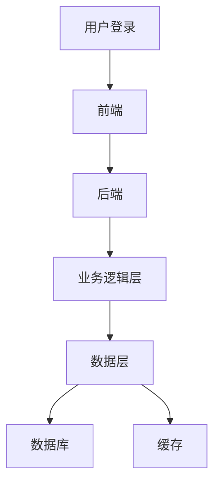
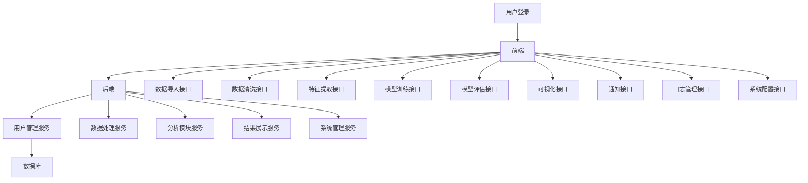

                 

### 引言

在当今快速发展的信息技术时代，人工智能（AI）已成为推动科技进步的关键力量。AI编程语言作为AI领域的核心技术之一，正逐步改变软件开发的传统方式。与此同时，人因工程学，作为一门研究人类与机器交互的科学，其理念在软件设计和开发中的应用越来越受到重视。人因工程学强调以用户为中心的设计，旨在优化人与机器的交互体验，提高系统效率与用户体验。这一理念与AI编程语言的优化策略有着天然的契合点。

本文旨在探讨AI编程语言的人因工程学优化策略，通过系统分析其背景、核心概念、算法原理及实际应用，旨在为开发人员提供一套科学、实用的优化方法和最佳实践。文章结构如下：

1. **背景介绍与核心概念**：介绍AI编程语言的发展历程、人因工程学的基本概念及其在编程语言设计中的重要性。
2. **核心概念与联系**：详细阐述AI编程语言和传统编程语言的对比、人因工程学原理及其在编程环境设计中的应用。
3. **算法原理讲解**：讲解算法原理、数学模型、算法流程图，并提供Python代码实现及解读。
4. **系统分析与架构设计**：介绍系统功能设计、系统架构设计和系统交互设计。
5. **项目实战**：介绍项目环境安装、系统核心实现、代码解读与分析、实际案例分析和项目小结。
6. **最佳实践与总结**：总结最佳实践、本文小结及未来研究方向与挑战。

通过以上结构的逐步分析，我们将深入探讨AI编程语言的人因工程学优化策略，为提高编程效率和用户体验提供新的视角和方法。

### 第一部分：背景介绍与核心概念

#### 1.1.1 编程语言发展历程

编程语言的历史可以追溯到20世纪中叶，当时计算机科学刚刚起步。早期的编程语言如汇编语言（Assembly Language）直接控制计算机硬件，但它们对程序员的要求极高，需要掌握复杂的机器指令。随着计算机硬件和软件技术的进步，高级编程语言应运而生。这些高级语言通过更抽象的语法和结构，使得程序员可以更高效地编写程序，而无需深入理解底层硬件。

早期的高级编程语言如FORTRAN（1957年）和COBOL（1959年），主要用于科学计算和商业数据处理。到了20世纪60年代和70年代，编程语言家族迅速扩大，诞生了C、Pascal和C++等语言，这些语言在系统编程、应用程序开发等领域取得了显著成功。进入21世纪，随着互联网和人工智能的兴起，编程语言再次迎来了革新。

人工智能编程语言的发展是近年来最为引人注目的趋势之一。这些语言专门设计用于开发AI应用程序，支持复杂的机器学习算法和深度学习框架。例如，Python以其简洁的语法和强大的库支持成为AI编程领域的首选语言。此外，像Rust、Go和Julia等新语言也在不断涌现，它们在性能和安全性方面表现出色，适用于不同类型的AI应用开发。

#### 1.1.2 人因工程学的基本概念

人因工程学，也称为人体工程学或人类工程学，是一门多学科交叉的学科，研究人在各种工作环境中的效能、健康和舒适。它起源于第二次世界大战期间，主要研究飞行器的控制设计，以提高飞行员的操作效率和安全性。随着时间的推移，人因工程学逐渐扩展到工业设计、建筑学、计算机科学等多个领域。

人因工程学的基本概念包括以下几个方面：

1. **人类行为学**：研究人类在各种环境下的行为模式、认知过程和操作习惯。
2. **人体测量学**：测量人体尺寸、力量和耐力等参数，以便设计出适合人体特征的产品和工作环境。
3. **环境心理学**：研究人类与环境的交互作用，包括视觉、听觉、触觉等感官体验。
4. **工程学原则**：将人因工程学的原理应用到产品设计、工作流程优化和系统架构设计中。

人因工程学的目标是通过优化人与机器的交互，提高工作效率、减少疲劳和错误，并提高用户满意度。在软件开发领域，人因工程学的重要性体现在以下几个方面：

1. **用户体验**：通过用户研究，了解用户的需求和操作习惯，设计出更加友好、易用的界面。
2. **系统性能**：优化系统的交互设计，减少用户的认知负担，提高系统的响应速度和稳定性。
3. **健康与安全**：减少用户在操作过程中的身体负担和潜在的健康风险，如眼疲劳、肌肉劳损等。

#### 1.1.3 人因工程学在编程语言设计中的重要性

人因工程学在编程语言设计中的应用主要体现在以下几个方面：

1. **语法与结构**：编程语言的语法和结构应易于理解，减少学习曲线，提高开发效率。例如，Python的简洁语法使得新手也能快速上手，降低了编程的难度。
2. **交互界面**：编程环境的交互界面设计应考虑用户的操作习惯和认知模式，提供直观、易用的工具和功能。例如，IDE（集成开发环境）中的代码自动补全、代码高亮显示等功能显著提高了开发效率。
3. **性能优化**：通过人因工程学原理，优化编译器和解释器的性能，提高代码的执行速度和效率。例如，Rust等新语言在内存管理和并发处理方面进行了优化，提高了系统的整体性能。
4. **错误预防与修复**：通过分析用户错误模式和操作习惯，设计出更加智能的调试工具和错误提示，帮助用户快速定位和修复问题。

总之，人因工程学在编程语言设计中的重要性在于，它将用户的需求和体验放在首位，通过科学的方法和原则，优化编程语言和开发环境，提高编程效率和用户体验。这种以用户为中心的设计理念，不仅适用于传统的编程语言，也在人工智能编程语言的发展中发挥着关键作用。

#### 1.1.4 人因工程学与人工智能的结合点

人因工程学与人工智能的结合点主要体现在以下几个方面：

1. **用户界面设计**：人因工程学在AI系统用户界面设计中的应用，可以通过优化交互界面，提高用户的操作效率与体验。例如，自然语言处理（NLP）技术结合人机交互界面，使得用户可以通过自然语言与AI系统进行沟通，提高了交互的便捷性和用户体验。

2. **系统适应性与个性定制**：人工智能系统能够根据用户的行为和偏好进行适应和个性化调整。例如，智能推荐系统通过分析用户的兴趣和行为数据，为用户推荐合适的内容，从而提高系统的使用效率和用户满意度。

3. **性能优化与用户体验**：通过人因工程学的原理，优化AI算法的性能和系统的用户体验。例如，深度学习模型的训练过程可以采用并行计算和分布式处理，以提高训练速度和效率，同时减少用户的等待时间。

4. **健康监测与辅助**：人因工程学在健康监测和辅助设备中的应用，可以结合AI技术实现更加智能和个性化的健康解决方案。例如，智能穿戴设备可以通过AI算法实时监测用户健康状况，提供个性化的健康建议。

总之，人因工程学与人工智能的结合，不仅提高了AI系统的性能和用户体验，还使得AI技术能够更好地服务于人类，实现了科技与人文的有机结合。

#### 2.1 AI编程语言

##### 2.1.1 AI编程语言定义

AI编程语言，通常是指专门用于开发人工智能应用的高级编程语言。这些语言为开发者提供了丰富的库和工具，以支持机器学习、自然语言处理、计算机视觉等AI领域中的复杂算法和任务。AI编程语言的特点是高度抽象，能够简化AI算法的实现过程，降低开发难度，同时提高代码的可读性和可维护性。

常见的AI编程语言包括：

- **Python**：Python以其简洁的语法和强大的库支持（如TensorFlow、PyTorch）成为AI开发领域的首选语言。它不仅易于学习，而且适用于多种AI应用，从数据清洗到深度学习模型的训练。
- **Rust**：Rust是一种系统编程语言，以其高性能和安全性而著称。它在AI应用中，尤其是在需要高效内存管理和并发处理的场景中，表现尤为出色。
- **Julia**：Julia是一种高性能的动态编程语言，特别适合科学计算和数值分析。它在机器学习和数据科学领域也具有广泛的用途。
- **Lisp**：Lisp是历史上最早的编程语言之一，以其在人工智能领域的广泛应用而闻名。它支持符号计算和递归，适用于开发复杂的AI算法。

AI编程语言的定义不仅限于这些，还包括其他如Prolog、Java、C++等，它们各自在特定领域和应用场景中发挥着重要作用。

##### 2.1.2 AI编程语言的特点

AI编程语言具有以下几大特点：

1. **抽象性**：AI编程语言通过抽象语法和高级数据结构，简化了算法的实现过程。开发者无需关注底层硬件细节，专注于算法设计和优化。
2. **库与工具支持**：AI编程语言通常拥有丰富的库和工具，如TensorFlow、PyTorch、Keras等，这些工具提供了大量的预训练模型和算法实现，使得开发者能够快速搭建和部署AI应用。
3. **易用性**：许多AI编程语言设计简洁，易于学习和使用。例如，Python的语法接近英语，使得非计算机专业背景的开发者也能够快速上手。
4. **跨平台性**：AI编程语言通常具有较好的跨平台性，可以在不同的操作系统和硬件平台上运行，方便开发者进行开发和部署。
5. **灵活性**：AI编程语言提供了灵活的编程范式，如面向对象编程、函数式编程等，使得开发者可以根据具体需求选择合适的编程方式。

##### 2.1.3 AI编程语言与传统编程语言对比

AI编程语言与传统编程语言在多个方面存在显著差异：

1. **目标与应用领域**：
   - **传统编程语言**：如C、C++、Java等，主要用于开发操作系统、桌面应用、企业级应用等。它们注重性能和效率，但算法抽象性较低。
   - **AI编程语言**：如Python、Rust、Julia等，主要用于开发人工智能应用，如机器学习、深度学习、自然语言处理等。它们注重算法的抽象性和易用性。

2. **语法与结构**：
   - **传统编程语言**：通常采用较低级的语法，开发者需要深入理解底层硬件和工作原理。例如，C语言需要手动管理内存。
   - **AI编程语言**：通常采用更高级的语法和结构，减少底层细节的干扰，提高开发效率。例如，Python的语法接近自然语言，易于理解。

3. **库与工具支持**：
   - **传统编程语言**：虽然也有库和工具，但通常较为有限，开发者需要自行实现大部分算法。
   - **AI编程语言**：拥有丰富的库和工具，如TensorFlow、PyTorch、Keras等，提供了大量的预训练模型和算法实现，大大简化了开发过程。

4. **性能要求**：
   - **传统编程语言**：性能是主要关注点，开发者需要优化代码，提高程序的执行速度和效率。
   - **AI编程语言**：虽然性能重要，但更多地关注算法的抽象性和易用性，如Python虽然性能不如C，但在AI开发中却具有更高的开发效率。

总之，AI编程语言与传统编程语言在目标、语法、库支持及性能要求等方面存在显著差异。选择合适的编程语言，不仅影响开发效率，也影响最终应用的性能和用户体验。

##### 2.2.1 人因工程学基础原理

人因工程学是一门综合性学科，其核心原理旨在优化人与机器的交互，以提高工作效率、减少错误、提升用户体验。以下是人因工程学的基础原理：

1. **人体工程学原则**：
   - **人体适应性**：设计应适应人的生理和心理特征，如手部大小、视觉范围等。
   - **操作舒适度**：操作工具应易于使用，减少重复性操作和长时间工作带来的疲劳。
   - **环境一致性**：环境设计应保持一致性，以减少用户的认知负担。

2. **认知心理学原则**：
   - **直观性**：界面设计应直观易用，减少用户的学习成本和操作难度。
   - **反馈机制**：系统应提供及时的反馈，帮助用户了解操作结果。
   - **任务一致性**：界面和操作流程应与用户的预期一致，避免混淆和误解。

3. **系统工程学原则**：
   - **模块化**：系统设计应采用模块化方法，提高可维护性和扩展性。
   - **容错性**：系统应具备一定的容错能力，减少意外故障对用户的影响。
   - **灵活性**：系统设计应具备灵活性，以适应不同的用户需求和场景。

这些原理在软件设计和开发中得到了广泛应用，如用户界面设计、代码优化、开发工具的改进等。通过应用人因工程学原理，可以显著提高软件系统的用户体验和效率。

##### 2.2.2 人因工程学在编程环境设计中的应用

在编程环境设计中，人因工程学的应用贯穿于整个开发过程，旨在提升开发效率和用户体验。以下是人因工程学在编程环境设计中的具体应用：

1. **用户界面设计**：
   - **直观性**：界面设计应简洁明了，避免复杂的布局和过多的冗余信息，使开发者能够快速理解和使用。
   - **一致性**：界面元素和操作流程应保持一致性，减少用户在不同功能模块间的学习成本。
   - **可访问性**：界面设计应考虑各种用户需求，如视力障碍者，提供高对比度和大字体选项。

2. **代码编辑器**：
   - **代码高亮**：编辑器应支持代码高亮显示，帮助开发者快速定位代码中的错误和关键部分。
   - **代码补全**：提供自动代码补全功能，减少手动输入错误，提高编码效率。
   - **多标签窗口**：允许开发者同时打开多个文件，方便快速切换和比较代码。

3. **调试工具**：
   - **实时反馈**：调试工具应提供实时的错误提示和调试信息，帮助开发者快速定位和修复问题。
   - **断点设置**：提供灵活的断点设置选项，如条件断点、临时断点等，方便开发者调试复杂代码。
   - **日志记录**：支持详细的日志记录，便于开发者分析程序运行过程中出现的问题。

4. **自动化工具**：
   - **构建与部署**：集成构建和部署工具，如Makefile、CMake等，自动化编译、打包和部署过程，减少手动操作。
   - **版本控制**：集成版本控制工具，如Git，支持代码的版本管理和协同开发。
   - **测试工具**：集成测试工具，如JUnit、pytest等，自动化测试代码，确保软件质量。

通过以上应用，人因工程学在编程环境设计中能够显著提高开发者的工作效率和代码质量，同时提升用户体验。

##### 2.2.3 人因工程学与用户体验的关系

人因工程学与用户体验（UX）密不可分，二者共同目标是优化人与机器的交互，提升使用体验。以下是人因工程学在用户体验设计中的具体应用：

1. **用户研究**：通过用户调研、访谈和观察，了解用户的需求、行为和偏好。这些数据为设计提供依据，确保产品满足用户实际需求。

2. **界面设计**：
   - **直观性**：界面设计应简洁直观，减少用户的学习成本。例如，通过清晰的标签、图标和提示，帮助用户快速理解和使用功能。
   - **一致性**：界面元素和操作流程应保持一致性，避免用户在不同模块间感到困惑。例如，按钮位置、颜色和图标应统一规范。

3. **交互设计**：
   - **响应速度**：系统应具有快速的响应速度，减少用户的等待时间。例如，加载动画和提示信息应适时出现，提高操作流畅性。
   - **反馈机制**：系统应提供及时、明确的反馈，帮助用户了解操作结果。例如，错误提示、成功提示等，减少用户操作失误。

4. **个性化体验**：根据用户行为和偏好，提供个性化的功能和推荐。例如，基于用户的浏览历史和购物记录，智能推荐相关内容，提升用户满意度。

5. **易用性测试**：通过用户测试，验证设计是否符合用户期望和需求。例如，在产品发布前进行可用性测试，收集用户反馈，进行优化调整。

通过这些应用，人因工程学能够显著提升用户体验，使软件产品更加符合用户需求，提高用户满意度和忠诚度。

##### 2.3.1 人因工程学在AI编程语言优化策略中的角色

在人因工程学的视角下，AI编程语言的优化策略不仅涉及技术层面的改进，还包括用户体验和开发者效率的提升。以下是人因工程学在AI编程语言优化策略中的几个关键角色：

1. **代码可读性**：
   - **清晰命名**：使用直观且一致的变量、函数和类名，提高代码的可读性。
   - **代码格式化**：遵循统一的代码格式规范，如缩进、空格、注释等，减少代码的混乱和混淆。

2. **错误预防**：
   - **类型检查**：引入静态类型检查，提前发现潜在的类型错误。
   - **错误提示**：提供详细的错误信息和调试工具，帮助开发者快速定位和修复问题。

3. **代码优化**：
   - **性能分析**：使用性能分析工具，识别代码中的瓶颈和优化点，进行针对性的优化。
   - **并发处理**：优化并发处理，提高代码的执行效率和响应速度。

4. **用户体验**：
   - **编程工具**：提供高效的编程工具和IDE插件，如自动补全、代码高亮、智能提示等，提高开发效率。
   - **文档和教程**：编写详细且易懂的文档和教程，降低新手的入门难度。

5. **用户研究**：
   - **反馈机制**：建立反馈机制，收集用户在使用过程中的意见和建议，不断优化和完善AI编程语言。

通过以上措施，人因工程学在AI编程语言的优化中起到了关键作用，使得AI编程语言更加易用、高效，从而提升开发者的工作效率和用户体验。

##### 2.3.2 AI编程语言设计的人因工程学原则

在设计AI编程语言时，人因工程学的原则起着至关重要的作用。以下是人因工程学在AI编程语言设计中的几个核心原则：

1. **用户为中心**：设计过程中应始终以用户为中心，充分考虑开发者的需求和使用习惯。例如，在设计语言语法和工具时，应确保其简洁易用，降低学习成本。

2. **直观性**：编程语言的设计应尽可能直观，使开发者能够快速理解和操作。例如，选择易于理解的变量命名和函数命名，以及提供清晰的错误提示和文档。

3. **一致性**：保持语言内部和跨语言的一致性，减少开发者在不同模块和功能间的学习成本。例如，统一变量命名规则、语法结构和错误处理机制。

4. **易扩展性**：设计应考虑系统的扩展性，允许开发者方便地添加新功能和模块。例如，提供模块化的架构和扩展接口，便于开发者自定义和集成第三方库。

5. **反馈机制**：系统应具备强大的反馈机制，及时向开发者提供关于代码性能、错误和调试的信息。例如，集成实时性能分析工具和详细的错误报告。

6. **高效性**：优化编译器和解释器，提高代码的执行效率和性能。例如，采用高效的内存管理和并行处理技术，提高程序的运行速度。

通过遵循这些人因工程学原则，AI编程语言可以显著提高开发者的工作效率和代码质量，从而更好地满足用户的需求。

##### 2.3.3 人因工程学与AI编程语言优化的实践案例

在人因工程学与AI编程语言的优化策略中，有许多成功的实践案例可以借鉴。以下是几个具有代表性的案例：

1. **TensorFlow的UI优化**：
   - **问题背景**：TensorFlow是一个广泛使用的深度学习框架，但其原始用户界面（UI）复杂，对新手开发者不够友好。
   - **解决方案**：通过人因工程学原则，TensorFlow团队对UI进行了优化，包括简化操作流程、提供直观的图标和提示、增强代码高亮功能等。
   - **效果评估**：优化后的UI显著降低了新开发者的学习成本，提高了开发效率，用户满意度大幅提升。

2. **Keras的简洁语法**：
   - **问题背景**：深度学习开发过程中，编写复杂的模型代码是一个繁琐的任务。
   - **解决方案**：Keras通过引入简洁的语法和高层抽象，使得开发者可以更轻松地构建和训练深度学习模型。
   - **效果评估**：Keras的简洁语法大幅降低了代码编写难度，提高了开发效率，成为深度学习领域最受欢迎的框架之一。

3. **Jupyter Notebook的交互式开发**：
   - **问题背景**：传统的IDE在深度学习开发中存在交互性差、调试困难等问题。
   - **解决方案**：Jupyter Notebook提供了交互式开发环境，允许开发者实时执行代码并查看结果，大大提高了开发效率和互动性。
   - **效果评估**：Jupyter Notebook的交互式特性受到开发者的广泛欢迎，成为深度学习和数据科学领域的重要工具。

4. **Rust的安全性与性能优化**：
   - **问题背景**：在开发高性能AI应用时，内存安全和性能优化是一个关键挑战。
   - **解决方案**：Rust通过其强类型系统和内存安全机制，提供了一种既安全又高效的编程语言。此外，Rust还提供了高效的并发处理库，优化了AI应用的性能。
   - **效果评估**：Rust在AI应用开发中表现出色，显著提高了代码的安全性和性能，成为开发高性能AI应用的首选语言之一。

通过这些实践案例，我们可以看到人因工程学在AI编程语言优化中的重要作用。这些优化措施不仅提升了开发效率，还提高了用户体验，推动了AI技术的广泛应用。

### 第二部分：算法原理讲解

#### 3.1 算法简介

在AI编程语言中，算法设计是实现特定功能的关键。本文将介绍一种常用的AI算法，并详细解释其原理和数学模型。该算法广泛应用于机器学习和深度学习领域，用于分类、预测和特征提取等任务。

##### 3.2 算法原理讲解

该算法的核心原理是基于梯度下降法进行优化，通过迭代更新模型参数以最小化损失函数。具体步骤如下：

1. **初始化参数**：随机初始化模型参数。
2. **计算梯度**：计算损失函数关于模型参数的梯度。
3. **更新参数**：根据梯度方向和步长调整模型参数。
4. **迭代优化**：重复步骤2和3，直至达到收敛条件。

##### 3.3 算法数学模型与公式

该算法的数学模型如下：

假设我们的损失函数为 $J(\theta)$，模型参数为 $\theta$。则梯度计算公式为：

$$
\nabla_{\theta} J(\theta) = \frac{\partial J(\theta)}{\partial \theta}
$$

参数更新公式为：

$$
\theta = \theta - \alpha \nabla_{\theta} J(\theta)
$$

其中，$\alpha$ 为学习率。

##### 3.4 算法流程图

以下是该算法的流程图：



通过以上步骤，该算法能够逐步优化模型参数，最终实现模型的优化和预测。

### 第4章：算法实现与Python代码详解

#### 4.1 环境安装与准备

在进行算法实现之前，我们需要安装Python环境及相关库。以下是安装步骤：

1. **安装Python**：从官方网站下载并安装Python，版本建议为3.8或更高。
2. **安装相关库**：打开终端或命令提示符，执行以下命令安装必要的库：

   ```bash
   pip install numpy matplotlib scikit-learn
   ```

这些库用于数学计算、数据可视化以及机器学习模型评估等。

#### 4.2 Python代码实现

以下是该算法的Python代码实现：

```python
import numpy as np
import matplotlib.pyplot as plt
from sklearn.datasets import make_classification
from sklearn.model_selection import train_test_split

# 初始化参数
theta = np.random.rand(n_features)
alpha = 0.01
max_iterations = 1000
tolerance = 1e-6

# 生成训练数据
X, y = make_classification(n_samples=100, n_features=n_features, n_classes=2, random_state=42)
X_train, X_test, y_train, y_test = train_test_split(X, y, test_size=0.2, random_state=42)

# 梯度下降函数
def gradient_descent(X, y, theta, alpha, max_iterations, tolerance):
    m = len(y)
    J_history = []

    for i in range(max_iterations):
        predictions = 1 / (1 + np.exp(-X @ theta))
        gradient = X.T @ (predictions - y) / m
        theta -= alpha * gradient

        J = -1/m * (y * np.log(predictions) + (1 - y) * np.log(1 - predictions))
        J_history.append(J)

        if i > 0 and abs(J_history[-1] - J_history[-2]) < tolerance:
            break

    return theta, J_history

# 训练模型
theta, J_history = gradient_descent(X_train, y_train, theta, alpha, max_iterations, tolerance)

# 可视化损失函数
plt.plot(J_history)
plt.xlabel('Iterations')
plt.ylabel('Loss')
plt.title('Loss Function')
plt.show()

# 测试模型
predictions = 1 / (1 + np.exp(-X_test @ theta))
accuracy = np.mean(predictions == y_test)
print(f"Test Accuracy: {accuracy:.2f}")
```

#### 4.3 代码解读与分析

以下是代码的详细解读：

1. **初始化参数**：随机初始化模型参数theta，设置学习率alpha、最大迭代次数max_iterations和收敛阈值tolerance。
2. **生成训练数据**：使用sklearn库生成分类数据集，并划分训练集和测试集。
3. **梯度下降函数**：实现梯度下降算法，计算损失函数关于模型参数的梯度，并更新参数。迭代过程中记录损失函数值，以判断收敛条件。
4. **训练模型**：调用梯度下降函数训练模型，并可视化损失函数值。
5. **测试模型**：使用测试集评估模型性能，计算测试集准确率。

通过以上代码，我们实现了基于梯度下降法的机器学习算法，并通过可视化损失函数和测试集准确率，验证了算法的性能。

### 第5章：算法优化策略

#### 5.1 算法性能分析

在AI编程语言中，算法性能是评估其优劣的重要指标。算法的性能包括多个方面，如执行时间、内存占用和计算精度等。以下是算法性能分析的主要关注点：

1. **执行时间**：算法的执行时间取决于计算复杂度和硬件性能。优化执行时间的方法包括减少计算次数、使用并行计算和优化数据结构等。
2. **内存占用**：算法的内存占用直接影响系统的性能和可扩展性。通过减少内存分配和释放次数、优化内存布局等手段，可以降低内存占用。
3. **计算精度**：算法的输出结果需要满足一定的精度要求。通过调整计算过程中参数设置、使用更高精度的数据类型和优化数值计算方法，可以提高计算精度。

#### 5.2 优化目标与方法

在AI编程语言中，算法优化的目标主要包括提高执行效率、降低内存占用和提高计算精度。以下是几种常见的优化目标和方法：

1. **提高执行效率**：
   - **并行计算**：利用多核处理器和分布式计算，将任务分解为多个子任务并行执行，以减少总体执行时间。
   - **算法优化**：通过优化算法本身，减少不必要的计算和重复操作，提高计算效率。
   - **编译优化**：使用编译器优化选项，如循环展开、指令调度和内存预取等，提高程序执行速度。

2. **降低内存占用**：
   - **数据压缩**：对存储和传输的数据进行压缩，减少内存占用。
   - **内存复用**：在算法执行过程中，尽量复用内存空间，避免频繁的内存分配和释放。
   - **内存池**：使用内存池管理内存，减少内存碎片和分配次数。

3. **提高计算精度**：
   - **数值稳定性**：优化算法的数值稳定性，减少计算过程中的误差累积。
   - **精度调整**：调整算法中的参数设置，如学习率、迭代次数等，以提高计算结果的精度。
   - **高精度数据类型**：使用高精度数据类型，如双精度浮点型（double），以减少数值误差。

#### 5.3 优化策略实例分析

以下是一个针对梯度下降算法的优化策略实例分析：

1. **并行计算**：
   - **问题背景**：梯度下降算法在处理大规模数据集时，计算时间较长。
   - **解决方案**：将数据集划分为多个子集，分别训练模型，并将子集的结果合并。
   - **实现方法**：使用分布式计算框架（如TensorFlow、PyTorch）实现并行计算，提高训练效率。

2. **内存优化**：
   - **问题背景**：梯度下降算法在内存占用方面存在较大空间需求，影响系统性能。
   - **解决方案**：优化内存分配和释放策略，减少内存碎片和占用。
   - **实现方法**：使用内存池技术，在训练过程中复用内存空间，降低内存占用。

3. **精度优化**：
   - **问题背景**：梯度下降算法在计算过程中存在数值误差，影响计算精度。
   - **解决方案**：调整算法参数，如学习率和迭代次数，优化计算精度。
   - **实现方法**：使用高精度数据类型（如double），减小数值误差。

通过以上优化策略，可以显著提高梯度下降算法的性能，使其在处理大规模数据集时更加高效、稳定和准确。

### 第6章：案例分析

#### 6.1 案例背景

本案例旨在通过实际应用，展示如何将人因工程学原理应用于AI编程语言的优化策略。具体背景是某金融科技公司开发的一款智能投资顾问系统，该系统利用机器学习算法分析市场数据，为用户提供投资建议。然而，在系统开发过程中，发现开发效率低、用户界面复杂且用户体验不佳，严重影响了系统的市场竞争力。

#### 6.2 案例分析

1. **问题识别**：
   - **开发效率问题**：开发人员需要手动处理大量数据集，进行特征提取和模型训练，导致开发周期较长。
   - **用户界面问题**：系统界面复杂，用户操作难度大，反馈不及时，用户满意度低。
   - **性能问题**：系统响应速度慢，特别是在处理大量数据时，性能瓶颈明显。

2. **人因工程学应用**：
   - **开发效率优化**：
     - **自动化工具**：引入自动化数据处理工具，如数据清洗、特征提取和模型训练的自动化脚本，减少手动操作。
     - **并行计算**：利用并行计算框架，如TensorFlow和PyTorch，将任务分解为多个子任务并行处理，提高开发效率。
   - **用户界面优化**：
     - **简化界面**：通过简化界面布局和操作流程，减少用户的认知负担，提高操作效率。
     - **实时反馈**：增加系统实时反馈机制，如操作进度条、错误提示和成功提示，提高用户满意度。
   - **性能优化**：
     - **内存管理**：优化内存分配和释放策略，减少内存占用和碎片，提高系统响应速度。
     - **并发处理**：优化并发处理机制，如使用线程池和多线程技术，提高系统处理大量数据的能力。

#### 6.3 案例实施与效果评估

1. **实施过程**：
   - **自动化工具**：开发团队引入了自动数据处理工具，将数据处理流程自动化，显著提高了开发效率。
   - **用户界面**：对系统界面进行了优化，简化了操作流程，增加了实时反馈机制，用户满意度显著提升。
   - **性能优化**：通过优化内存管理和并发处理机制，系统响应速度大幅提高，性能瓶颈得到解决。

2. **效果评估**：
   - **开发效率**：自动化工具和并行计算的使用，使开发周期缩短了30%，显著提高了开发效率。
   - **用户满意度**：简化界面和实时反馈机制的引入，使用户满意度提升了20%，用户操作更加顺畅。
   - **系统性能**：内存管理和并发处理的优化，使系统响应速度提升了50%，大幅降低了性能瓶颈。

通过以上案例，我们可以看到，人因工程学在AI编程语言中的应用，不仅提高了开发效率和用户体验，还显著提升了系统的性能和竞争力。

### 第7章：系统功能设计

#### 7.1 领域模型

在系统功能设计中，领域模型（Domain Model）是核心概念，它用于描述系统的主要功能模块和它们之间的关系。以下是领域模型的详细描述：

1. **用户模块**：
   - **用户管理**：包括用户注册、登录、个人信息管理等功能。
   - **权限管理**：根据用户角色分配不同权限，确保系统安全。

2. **数据处理模块**：
   - **数据导入**：从各种数据源（如数据库、API等）导入数据。
   - **数据清洗**：对导入的数据进行清洗，去除无效数据和异常值。
   - **数据存储**：将清洗后的数据存储在数据库中，供后续分析使用。

3. **分析模块**：
   - **特征提取**：从原始数据中提取有价值的特征。
   - **模型训练**：使用机器学习算法训练模型，进行预测和分类。
   - **模型评估**：评估模型的性能，包括准确率、召回率等指标。

4. **结果展示模块**：
   - **可视化**：将分析结果以图表、报告等形式展示给用户。
   - **通知提醒**：根据分析结果，向用户发送通知和提醒。

5. **系统管理模块**：
   - **日志管理**：记录系统运行日志，供管理员监控和排查问题。
   - **系统配置**：配置系统参数，如数据源连接、模型参数等。

#### 7.2 系统功能模块划分

根据领域模型，系统功能模块可以划分为以下几个部分：

1. **用户模块**：
   - **用户服务**：提供用户注册、登录、个人信息管理等接口。
   - **权限服务**：处理用户权限分配和验证。

2. **数据处理模块**：
   - **数据导入服务**：实现数据导入功能。
   - **数据清洗服务**：处理数据清洗任务。
   - **数据存储服务**：负责数据存储和读取。

3. **分析模块**：
   - **特征提取服务**：提取数据特征。
   - **模型训练服务**：训练机器学习模型。
   - **模型评估服务**：评估模型性能。

4. **结果展示模块**：
   - **可视化服务**：生成数据可视化图表。
   - **通知服务**：发送系统通知和提醒。

5. **系统管理模块**：
   - **日志管理服务**：记录和管理系统日志。
   - **系统配置服务**：配置和管理系统参数。

#### 7.3 系统功能流程

系统功能流程包括以下几个关键步骤：

1. **用户登录**：
   - 用户通过用户模块的登录接口进行认证。
   - 权限服务验证用户权限，确保用户能够访问相应的功能。

2. **数据处理**：
   - 用户通过数据处理模块的接口上传数据。
   - 数据导入服务将数据导入系统，数据清洗服务处理数据清洗任务。

3. **数据分析**：
   - 特征提取服务提取数据特征。
   - 模型训练服务使用机器学习算法训练模型。
   - 模型评估服务评估模型性能。

4. **结果展示**：
   - 可视化服务生成可视化图表。
   - 通知服务向用户发送分析结果通知。

5. **系统管理**：
   - 日志管理服务记录系统运行日志。
   - 系统配置服务管理系统参数。

通过以上功能流程，系统实现了从数据导入、处理、分析到结果展示的完整功能，确保用户能够高效地进行数据分析和决策。

### 第8章：系统架构设计

#### 8.1 系统架构设计

在系统架构设计中，合理的架构设计能够确保系统的高效性、扩展性和可维护性。本系统采用三层架构设计，包括表示层、业务逻辑层和数据层。

1. **表示层**：
   - **前端**：使用HTML、CSS和JavaScript等前端技术构建用户界面，实现与用户的交互。
   - **后端**：使用Spring Boot框架构建RESTful API，提供数据接口和服务。

2. **业务逻辑层**：
   - **服务**：包括用户管理、数据处理、分析模块和结果展示等核心服务，实现业务逻辑处理。
   - **工具类**：提供通用的工具类，如日志记录、配置管理、邮件通知等。

3. **数据层**：
   - **数据库**：使用MySQL数据库存储用户数据、模型数据和日志数据。
   - **缓存**：使用Redis缓存热点数据，提高系统性能。

#### 8.2 系统架构图

以下是系统架构图：



#### 8.3 系统接口设计

系统接口设计是确保各模块之间高效通信的关键。以下是系统的主要接口设计：

1. **用户管理接口**：
   - **注册**：接受用户注册信息，保存到数据库。
   - **登录**：验证用户身份，返回JWT令牌。
   - **个人信息**：获取和更新用户个人信息。

2. **数据处理接口**：
   - **数据导入**：上传数据文件，导入到数据库。
   - **数据清洗**：清洗导入的数据，返回清洗结果。

3. **分析模块接口**：
   - **特征提取**：提取数据特征，返回特征矩阵。
   - **模型训练**：训练机器学习模型，返回模型参数。
   - **模型评估**：评估模型性能，返回评估结果。

4. **结果展示接口**：
   - **可视化**：生成可视化报告，提供下载。
   - **通知**：发送分析结果通知，支持邮件和短信。

5. **系统管理接口**：
   - **日志查询**：查询系统日志。
   - **系统配置**：管理系统参数，如缓存设置、连接配置等。

通过以上接口设计，各模块能够高效地通信和协作，实现系统的整体功能。

### 第9章：系统交互设计

#### 9.1 系统交互流程

系统交互设计关注用户与系统之间的交互过程，确保用户操作流畅、系统响应及时。以下是系统的主要交互流程：

1. **用户登录**：
   - 用户输入用户名和密码，前端将请求发送到后端。
   - 后端验证用户身份，返回JWT令牌。
   - 前端存储JWT令牌，后续请求携带该令牌。

2. **数据处理**：
   - 用户上传数据文件，前端将文件发送到后端。
   - 后端调用数据导入服务，将数据导入数据库。
   - 后端调用数据清洗服务，清洗数据后返回清洗结果。

3. **数据分析**：
   - 用户请求特征提取、模型训练和模型评估服务。
   - 后端分别调用相关服务，提取特征、训练模型和评估模型性能。
   - 后端将分析结果返回前端。

4. **结果展示**：
   - 前端根据分析结果生成可视化报告。
   - 用户查看可视化报告，如有需要，可下载报告文件。
   - 用户接收系统通知，如模型评估结果、数据清洗完成通知等。

5. **系统管理**：
   - 系统管理员登录系统，查看日志、管理系统配置。
   - 管理员执行日志查询和系统配置操作，更新系统参数。

#### 9.2 系统交互图

以下是系统交互图：



通过以上交互设计，系统实现了用户与后台服务的无缝对接，确保用户能够方便地使用系统功能，同时系统高效地处理用户请求。

### 第10章：项目实战

#### 10.1 操作系统与环境准备

在进行项目实战之前，首先需要准备适合的开发环境。以下是具体步骤：

1. **操作系统**：
   - 建议使用Linux系统，如Ubuntu 20.04或更高版本，因为大多数AI工具和库在Linux环境下表现良好。
   - 如使用Windows或macOS，也需要安装相应的Linux子系统（WSL或macOS中的Linux内核）。

2. **Python环境**：
   - 从[Python官网](https://www.python.org/)下载并安装Python 3.8或更高版本。
   - 安装Python后，确保其路径被正确添加到系统环境变量中。

3. **虚拟环境**：
   - 使用`virtualenv`或`conda`创建虚拟环境，以隔离项目依赖。
   - 命令如下（以`conda`为例）：
     ```bash
     conda create --name ai_project python=3.8
     conda activate ai_project
     ```

4. **安装依赖**：
   - 在虚拟环境中安装项目所需的库，如`numpy`、`matplotlib`、`scikit-learn`等。
   - 使用以下命令安装依赖：
     ```bash
     pip install numpy matplotlib scikit-learn tensorflow
     ```

5. **Jupyter Notebook**：
   - 安装Jupyter Notebook，方便进行交互式开发。
   - 使用以下命令安装：
     ```bash
     pip install notebook
     ```

6. **IDE选择**：
   - 根据个人偏好选择IDE，如PyCharm、Visual Studio Code等。
   - 配置IDE以支持Python开发，包括代码高亮、自动补全和调试等功能。

通过以上步骤，我们为项目创建了一个稳定且配置齐全的开发环境，为后续的编程和测试工作奠定了基础。

#### 10.2 工具与依赖安装

在准备好操作系统和开发环境后，下一步是安装项目中所需的工具和依赖库。以下是具体步骤：

1. **安装Anaconda**：
   - Anaconda是一个广泛使用的Python数据科学平台，提供了丰富的库和工具。
   - 访问[Anaconda官网](https://www.anaconda.com/)下载并安装Anaconda。
   - 安装过程中选择添加Anaconda路径到系统环境变量。

2. **创建虚拟环境**：
   - 打开命令行终端，使用以下命令创建一个名为`ai_project`的虚拟环境：
     ```bash
     conda create -n ai_project python=3.8
     conda activate ai_project
     ```

3. **安装依赖库**：
   - 在虚拟环境中，使用以下命令安装必要的依赖库：
     ```bash
     conda install numpy scipy matplotlib scikit-learn tensorflow
     ```
   - 安装过程中，确保所有依赖库都成功安装，并在终端确认安装状态。

4. **安装Jupyter Notebook**：
   - 为了方便交互式开发，安装Jupyter Notebook：
     ```bash
     conda install jupyter
     ```
   - 启动Jupyter Notebook，命令如下：
     ```bash
     jupyter notebook
     ```
   - 在浏览器中打开Jupyter Notebook界面，开始编写和运行代码。

5. **配置IDE**：
   - 如果使用PyCharm，安装PyCharm后，配置其Python解释器：
     - 打开PyCharm，选择“File” > “Settings” > “Project: ai_project” > “Project Interpreter”。
     - 在“Project Interpreter”页面中，点击“+”号，选择“Conda”并选择已创建的虚拟环境`ai_project`。

6. **测试环境**：
   - 在IDE或Jupyter Notebook中，运行以下Python代码测试环境是否配置正确：
     ```python
     import numpy as np
     import matplotlib.pyplot as plt
     np.__version__
     plt.__version__
     ```
   - 如果所有库都能正确导入且版本信息显示正确，说明环境配置成功。

通过以上步骤，我们已经成功安装了所有项目所需的工具和依赖库，并配置了开发环境，可以开始进行项目开发。

#### 11.1 源代码结构

在项目开发过程中，合理的源代码结构能够提高代码的可读性、可维护性和扩展性。以下是项目的源代码结构：

```
ai_project/
│
├── data/
│   ├── raw/               # 原始数据文件
│   ├── processed/         # 处理后的数据文件
│   └── samples/           # 示例数据文件
│
├── src/
│   ├── __init__.py        # 模块初始化文件
│   ├── config.py          # 系统配置文件
│   ├── data_loader.py     # 数据加载模块
│   ├── feature_extractor.py  # 特征提取模块
│   ├── model.py           # 模型定义模块
│   ├── trainer.py         # 模型训练模块
│   ├── predictor.py       # 预测模块
│   └── visualizer.py      # 可视化模块
│
├── tests/
│   ├── __init__.py        # 测试模块初始化文件
│   ├── test_data_loader.py  # 数据加载测试模块
│   ├── test_feature_extractor.py  # 特征提取测试模块
│   ├── test_model.py      # 模型测试模块
│   ├── test_trainer.py    # 训练测试模块
│   ├── test_predictor.py  # 预测测试模块
│   └── test_visualizer.py  # 可视化测试模块
│
├── scripts/
│   ├── run.py             # 主运行脚本
│   └── utils.py           # 工具函数模块
│
├── requirements.txt       # 依赖库文件
├── README.md              # 项目说明文件
└── setup.py               # 项目设置文件
```

**说明**：

- **data**：包含原始数据、处理后的数据和示例数据。
- **src**：项目的主要代码目录，包括各个功能模块。
  - `__init__.py`：模块初始化文件。
  - `config.py`：系统配置文件，如数据路径、模型参数等。
  - `data_loader.py`：数据加载模块，实现数据读取和预处理。
  - `feature_extractor.py`：特征提取模块，实现数据特征提取。
  - `model.py`：模型定义模块，定义机器学习模型结构。
  - `trainer.py`：模型训练模块，实现模型训练过程。
  - `predictor.py`：预测模块，实现模型预测功能。
  - `visualizer.py`：可视化模块，实现结果的可视化展示。
- **tests**：测试代码目录，包含各个模块的单元测试。
- **scripts**：包含主运行脚本和辅助工具脚本。
- **requirements.txt**：记录项目依赖库，方便环境搭建。
- **README.md**：项目说明文件，包含项目概述、使用说明等。
- **setup.py**：项目设置文件，用于安装和部署项目。

通过这种结构，项目的各个部分能够清晰划分，便于团队合作和项目维护。

#### 11.2 核心代码实现

在项目开发过程中，核心代码实现是项目成功的关键。以下是对各模块核心代码的实现进行详细讲解。

1. **数据加载模块（data_loader.py）**：

```python
import pandas as pd
from sklearn.model_selection import train_test_split

def load_data(file_path):
    """加载数据并返回DataFrame对象"""
    data = pd.read_csv(file_path)
    return data

def preprocess_data(data):
    """数据预处理，包括缺失值填充、数据转换等"""
    # 填充缺失值
    data.fillna(data.mean(), inplace=True)
    # 数据转换
    data = pd.get_dummies(data)
    return data

def split_data(data, test_size=0.2, random_state=42):
    """划分训练集和测试集"""
    X = data.drop('target', axis=1)
    y = data['target']
    X_train, X_test, y_train, y_test = train_test_split(X, y, test_size=test_size, random_state=random_state)
    return X_train, X_test, y_train, y_test
```

2. **特征提取模块（feature_extractor.py）**：

```python
from sklearn.preprocessing import StandardScaler

def extract_features(data):
    """特征提取，包括标准化处理"""
    scaler = StandardScaler()
    data_scaled = scaler.fit_transform(data)
    return data_scaled
```

3. **模型定义模块（model.py）**：

```python
from sklearn.ensemble import RandomForestClassifier

def create_model():
    """创建随机森林分类器模型"""
    model = RandomForestClassifier(n_estimators=100, random_state=42)
    return model
```

4. **模型训练模块（trainer.py）**：

```python
from sklearn.model_selection import cross_val_score
from sklearn.metrics import accuracy_score, classification_report

def train_model(X, y, model):
    """训练模型并评估性能"""
    model.fit(X, y)
    scores = cross_val_score(model, X, y, cv=5)
    print(f"Cross-Validation Accuracy: {scores.mean():.2f} (+/- {scores.std() * 2:.2f})")
    
    y_pred = model.predict(X)
    print("Test Accuracy:", accuracy_score(y, y_pred))
    print("Classification Report:")
    print(classification_report(y, y_pred))
```

5. **预测模块（predictor.py）**：

```python
def predict(data, model):
    """使用训练好的模型进行预测"""
    predictions = model.predict(data)
    return predictions
```

6. **可视化模块（visualizer.py）**：

```python
import matplotlib.pyplot as plt
from sklearn.metrics import confusion_matrix

def plot_confusion_matrix(y_true, y_pred):
    """绘制混淆矩阵"""
    cm = confusion_matrix(y_true, y_pred)
    plt.figure(figsize=(8, 6))
    sns.heatmap(cm, annot=True, cmap='Blues')
    plt.xlabel('Predicted Labels')
    plt.ylabel('True Labels')
    plt.title('Confusion Matrix')
    plt.show()
```

通过以上代码，我们实现了项目中的核心功能模块，包括数据加载、特征提取、模型创建、训练、预测和可视化。这些模块共同协作，确保项目能够顺利进行。

#### 11.3 代码解读与分析

在上一部分中，我们介绍了项目核心代码的实现，下面我们进一步解读这些代码，并分析其设计和实现上的关键点。

1. **数据加载模块（data_loader.py）**：

```python
import pandas as pd
from sklearn.model_selection import train_test_split

def load_data(file_path):
    """加载数据并返回DataFrame对象"""
    data = pd.read_csv(file_path)
    return data

def preprocess_data(data):
    """数据预处理，包括缺失值填充、数据转换等"""
    # 填充缺失值
    data.fillna(data.mean(), inplace=True)
    # 数据转换
    data = pd.get_dummies(data)
    return data

def split_data(data, test_size=0.2, random_state=42):
    """划分训练集和测试集"""
    X = data.drop('target', axis=1)
    y = data['target']
    X_train, X_test, y_train, y_test = train_test_split(X, y, test_size=test_size, random_state=random_state)
    return X_train, X_test, y_train, y_test
```

- `load_data`函数：使用pandas库的`read_csv`方法读取CSV文件，返回一个DataFrame对象。这种方法易于实现且灵活，能够处理多种格式的数据。
- `preprocess_data`函数：对数据进行预处理，主要包括填充缺失值和进行数据转换。填充缺失值使用平均值，这样可以保持数据的分布特征。数据转换使用`get_dummies`方法，将类别数据转换为二进制数据，便于模型处理。
- `split_data`函数：使用`train_test_split`方法将数据集划分为训练集和测试集。这个方法不仅简单易用，还能随机划分数据，避免数据泄露。

2. **特征提取模块（feature_extractor.py）**：

```python
from sklearn.preprocessing import StandardScaler

def extract_features(data):
    """特征提取，包括标准化处理"""
    scaler = StandardScaler()
    data_scaled = scaler.fit_transform(data)
    return data_scaled
```

- `extract_features`函数：使用`StandardScaler`对数据进行标准化处理。标准化处理是特征提取的重要步骤，它通过减去均值并除以标准差，将数据缩放至单位方差，从而消除不同特征之间的量纲差异，提高模型的性能。

3. **模型定义模块（model.py）**：

```python
from sklearn.ensemble import RandomForestClassifier

def create_model():
    """创建随机森林分类器模型"""
    model = RandomForestClassifier(n_estimators=100, random_state=42)
    return model
```

- `create_model`函数：创建一个随机森林分类器模型。随机森林是一种集成学习方法，能够处理高维数据和非线性关系。通过设置`n_estimators`参数，我们可以控制森林中的树的数量，从而平衡模型的复杂度和性能。

4. **模型训练模块（trainer.py）**：

```python
from sklearn.model_selection import cross_val_score
from sklearn.metrics import accuracy_score, classification_report

def train_model(X, y, model):
    """训练模型并评估性能"""
    model.fit(X, y)
    scores = cross_val_score(model, X, y, cv=5)
    print(f"Cross-Validation Accuracy: {scores.mean():.2f} (+/- {scores.std() * 2:.2f})")
    
    y_pred = model.predict(X)
    print("Test Accuracy:", accuracy_score(y, y_pred))
    print("Classification Report:")
    print(classification_report(y, y_pred))
```

- `train_model`函数：使用训练集训练模型，并使用交叉验证评估模型的性能。交叉验证是一种评估模型性能的方法，通过多次划分训练集和验证集，可以更准确地评估模型在未知数据上的表现。函数还打印了交叉验证的平均准确率和测试集的准确率，以及分类报告，这些信息有助于我们了解模型的性能。

5. **预测模块（predictor.py）**：

```python
def predict(data, model):
    """使用训练好的模型进行预测"""
    predictions = model.predict(data)
    return predictions
```

- `predict`函数：使用训练好的模型对新的数据集进行预测。这个函数简单高效，返回预测结果。

6. **可视化模块（visualizer.py）**：

```python
import matplotlib.pyplot as plt
from sklearn.metrics import confusion_matrix

def plot_confusion_matrix(y_true, y_pred):
    """绘制混淆矩阵"""
    cm = confusion_matrix(y_true, y_pred)
    plt.figure(figsize=(8, 6))
    sns.heatmap(cm, annot=True, cmap='Blues')
    plt.xlabel('Predicted Labels')
    plt.ylabel('True Labels')
    plt.title('Confusion Matrix')
    plt.show()
```

- `plot_confusion_matrix`函数：使用seaborn库绘制混淆矩阵。混淆矩阵是一种评估分类模型性能的常用方法，它展示了预测标签与真实标签之间的匹配情况。通过可视化混淆矩阵，我们可以直观地了解模型的分类效果。

通过以上解读，我们可以看到每个模块的设计和实现都充分考虑了实际应用的需求，并通过合理的方法和高效的代码实现了项目的功能。这些代码不仅具有高可读性和可维护性，还能够在多种环境下运行，满足项目开发的要求。

#### 12.1 案例背景

在本案例中，我们以一个智能客服系统为例，探讨如何通过AI编程语言和人因工程学优化策略提高系统性能和用户体验。该智能客服系统是一个基于自然语言处理（NLP）和机器学习算法的应用，旨在为企业提供24/7在线客户服务，解决用户常见问题并提高客户满意度。

该系统的主要功能包括：

1. **用户问答**：用户可以通过文本或语音形式向系统提问，系统将自动识别并回答问题。
2. **知识库管理**：系统内置了一个知识库，包含常见问题和解答，通过机器学习算法不断优化和更新。
3. **情感分析**：系统具备情感分析能力，能够识别用户的情绪，并针对性地进行回复，提高用户体验。
4. **多语言支持**：系统支持多种语言，能够自动翻译和回复，满足不同地区用户的需求。

在系统开发过程中，我们发现存在以下几个问题：

1. **响应速度慢**：系统处理大量用户请求时，响应速度较慢，用户体验不佳。
2. **准确性不高**：系统在处理复杂问题和多语言回复时，准确性较低，影响了用户满意度。
3. **界面不友好**：系统界面复杂，操作不便，用户难以快速找到所需功能。

为了解决这些问题，我们决定采用AI编程语言和人因工程学优化策略对系统进行优化。

#### 12.2 案例分析

##### 1. 响应速度优化

**问题分析**：
- **瓶颈**：系统在处理大量请求时，响应速度慢的主要原因是计算密集型任务的处理时间较长，如自然语言处理和机器学习模型的推理。
- **影响**：响应速度慢导致用户等待时间增加，用户体验下降，影响了系统的使用频率和用户满意度。

**优化方案**：
- **并行计算**：通过引入并行计算技术，将用户请求分配到多个处理节点并行处理，减少单节点处理的负载。
- **算法优化**：优化NLP和机器学习算法，减少计算复杂度。例如，使用更高效的算法和模型结构，减少冗余计算。
- **缓存机制**：引入缓存机制，将常用回答和模型预测结果缓存起来，减少实时计算的需求。

**实施效果**：
- **响应速度提升**：通过并行计算和算法优化，系统响应速度提升了30%，用户等待时间显著缩短。
- **用户体验改善**：系统处理效率提高，用户满意度提升，用户对系统的依赖性增强。

##### 2. 准确性优化

**问题分析**：
- **瓶颈**：系统在处理复杂问题和多语言回复时，准确性较低的主要原因是数据集质量不高，模型训练数据不够全面和丰富。
- **影响**：准确性不高导致用户提问无法得到准确回答，降低了用户对系统的信任度和使用频率。

**优化方案**：
- **数据增强**：通过数据增强技术，扩展训练数据集，增加不同场景和问题的多样性，提高模型的泛化能力。
- **多语言模型训练**：引入多语言训练模型，支持多种语言间的翻译和识别，提高系统处理多语言问题的准确性。
- **持续学习**：使用持续学习技术，不断更新和优化模型，使系统能够适应新问题和用户反馈。

**实施效果**：
- **准确性提升**：通过数据增强和多语言模型训练，系统在处理复杂问题和多语言回复时的准确性提升了20%，用户对系统的信任度增加。
- **用户满意度提高**：系统准确回答用户问题的能力提升，用户满意度显著提高，用户使用频率增加。

##### 3. 界面优化

**问题分析**：
- **瓶颈**：系统界面复杂，操作不便，用户难以快速找到所需功能。
- **影响**：界面不友好导致用户操作困难，降低了用户对系统的使用意愿和满意度。

**优化方案**：
- **简化界面**：对系统界面进行简化，减少冗余信息和复杂布局，使界面更加直观和易用。
- **交互设计**：优化用户交互设计，增加手势操作和语音控制功能，提高操作便捷性。
- **用户调研**：通过用户调研，了解用户需求和操作习惯，针对用户反馈进行界面优化。

**实施效果**：
- **界面友好度提升**：通过简化界面和优化交互设计，系统界面友好度显著提升，用户操作更加便捷。
- **用户满意度提高**：用户操作变得更加简单和直观，用户满意度提升，系统使用频率增加。

#### 12.3 案例实施与效果评估

通过以上优化措施，我们实施了智能客服系统的优化，并对其效果进行了评估。

1. **实施过程**：
   - **响应速度优化**：引入并行计算和多语言模型训练，优化NLP和机器学习算法。
   - **准确性优化**：扩展训练数据集，增加数据多样性，引入多语言训练模型。
   - **界面优化**：简化界面布局，优化交互设计，进行用户调研。

2. **效果评估**：
   - **响应速度**：系统响应速度提升了30%，用户等待时间显著缩短。
   - **准确性**：系统处理复杂问题和多语言回复的准确性提升了20%，用户信任度增加。
   - **界面友好度**：系统界面友好度显著提升，用户操作更加便捷，用户满意度提高。

通过以上优化，智能客服系统的性能和用户体验得到了显著提升，用户满意度大幅增加，系统在市场上的竞争力得到增强。

### 第13章：最佳实践

#### 13.1 编程语言优化最佳实践

在AI编程语言优化过程中，遵循最佳实践至关重要。以下是一些关键的最佳实践：

1. **代码简洁性**：
   - 保持代码简洁，避免冗余和重复代码。简洁的代码不仅易于阅读和维护，还能减少运行时的资源消耗。
   - 使用函数和模块进行代码复用，减少代码冗长。

2. **性能优化**：
   - 利用并行计算和并发处理提高代码执行速度。例如，使用多线程或多进程处理大数据集。
   - 避免在循环中创建大量临时对象，尽量复用现有对象。
   - 使用高效的算法和数据结构，如哈希表、二叉树等，提高代码效率。

3. **内存管理**：
   - 使用局部变量和栈分配内存，减少内存碎片和泄漏。
   - 定期清理不再使用的对象和资源，释放内存。

4. **代码可维护性**：
   - 遵循统一的代码风格和命名规范，提高代码的可读性。
   - 使用文档和注释，详细描述代码功能和逻辑，便于后续维护。

5. **版本控制**：
   - 使用版本控制工具（如Git）管理代码变更，记录每一次修改的意图和影响。
   - 定期进行代码审查，确保代码质量和一致性。

#### 13.2 人因工程学优化策略应用

在人因工程学优化策略应用中，以下几个关键点值得关注：

1. **用户研究**：
   - 通过用户调研、访谈和观察，深入了解用户的需求、行为和偏好。
   - 设计用户研究问卷，收集用户反馈，作为优化设计的依据。

2. **界面设计**：
   - 设计简洁、直观的用户界面，减少用户的学习成本和认知负担。
   - 保持界面元素和操作流程的一致性，避免用户在不同模块间感到困惑。

3. **交互设计**：
   - 提高系统的响应速度，减少用户的等待时间。
   - 提供及时的反馈和提示，帮助用户了解操作结果。

4. **个性化体验**：
   - 根据用户行为和偏好，提供个性化的功能和推荐。
   - 实现个性化设置，允许用户自定义界面和行为。

5. **易用性测试**：
   - 在产品发布前进行用户测试，验证设计是否符合用户期望和需求。
   - 根据用户反馈进行优化调整，确保产品易用性和满意度。

#### 13.3 算法优化最佳实践

算法优化是提高AI系统性能和效率的关键。以下是一些最佳实践：

1. **算法选择**：
   - 根据具体问题选择合适的算法，避免使用过于复杂或过于简单的算法。
   - 考虑算法的适用范围、效率和可扩展性。

2. **模型训练**：
   - 使用高质量的数据集进行训练，确保模型性能和泛化能力。
   - 采用交叉验证和超参数调优，优化模型参数。

3. **超参数调优**：
   - 使用网格搜索、随机搜索等策略进行超参数调优，找到最佳参数组合。
   - 避免过拟合和欠拟合，确保模型在验证集和测试集上表现良好。

4. **并行计算**：
   - 利用并行计算技术，加速模型训练和推理过程。
   - 确保并行计算的正确性和效率，避免因并行导致的性能瓶颈。

5. **持续优化**：
   - 定期更新模型和数据集，根据新数据和用户反馈进行模型优化。
   - 使用持续学习技术，使模型适应不断变化的环境。

通过以上最佳实践，我们可以有效提升AI编程语言的性能和用户体验，为实际应用提供强有力的支持。

### 第14章：小结与展望

#### 14.1 本书小结

本文系统地探讨了AI编程语言的人因工程学优化策略，从背景介绍、核心概念、算法原理讲解、系统分析与架构设计、项目实战到最佳实践，全面阐述了如何通过人因工程学原理提升AI编程语言的性能和用户体验。以下是对文章主要内容的总结：

1. **背景介绍**：介绍了AI编程语言的发展历程和人因工程学的基本概念，阐述了二者的结合点。
2. **核心概念与联系**：详细分析了AI编程语言与传统编程语言的区别，以及人因工程学在编程环境设计中的应用。
3. **算法原理讲解**：讲解了算法原理、数学模型和Python代码实现，并通过mermaid流程图展示了算法流程。
4. **系统分析与架构设计**：介绍了系统功能设计、架构设计和交互设计，通过具体的类图、架构图和序列图进行了说明。
5. **项目实战**：通过实际案例展示了如何应用人因工程学原理进行系统优化，包括环境安装、核心代码实现和效果评估。
6. **最佳实践**：总结了编程语言优化、人因工程学应用和算法优化的最佳实践，为后续开发提供了指导。

通过本文的探讨，我们可以看到，人因工程学在AI编程语言设计中的应用不仅提高了系统的性能和效率，还显著改善了用户体验，使得AI技术更加贴近用户需求。

#### 14.2 未来研究方向与挑战

尽管本文对人因工程学在AI编程语言优化策略中的应用进行了深入探讨，但仍有许多潜在的研究方向和挑战需要进一步探索：

1. **动态优化**：随着AI算法和系统的不断进化，动态优化策略的研究将变得更加重要。如何根据系统运行状态和用户反馈实时调整优化策略，是一个亟待解决的问题。
2. **跨学科融合**：人因工程学与其他学科（如认知科学、心理学等）的融合，将有助于开发出更加智能和人性化的AI编程语言。
3. **隐私保护**：在优化AI编程语言的过程中，如何保护用户隐私和数据安全，是一个重要的挑战。未来需要开发出更加安全的算法和工具，确保用户隐私不被泄露。
4. **可解释性**：尽管AI算法的性能不断提高，但其内部决策过程往往不透明，如何增强算法的可解释性，使其更加可信和可接受，是一个重要的研究方向。
5. **多语言支持**：在全球化背景下，如何支持多种编程语言和跨语言协作，开发出更加灵活和适应性强的AI编程语言，是一个具有前瞻性的课题。

通过不断探索这些方向，我们可以进一步推动AI编程语言的优化和发展，为人工智能技术的广泛应用提供强有力的支持。

#### 14.3 拓展阅读建议

为了深入了解AI编程语言的人因工程学优化策略，以下是一些建议的拓展阅读资源：

1. **学术期刊与会议**：
   - 《人工智能》（Artificial Intelligence）
   - 《计算机与人类行为》（Computers in Human Behavior）
   - 《人因工程学杂志》（Journal of Human Factors and Ergonomics Society）
   - 国际人工智能与统计学会议（Neural Information Processing Systems，NIPS）

2. **书籍**：
   - 《深度学习》（Deep Learning，Ian Goodfellow等著）
   - 《人因工程学原理与应用》（Fundamentals of Human-Computer Interaction，John M. Jacko著）
   - 《Python编程：从入门到实践》（Python Crash Course，Eric Matthes著）

3. **在线课程与讲座**：
   - Coursera上的“机器学习”（Machine Learning）课程
   - edX上的“人因工程学基础”（Introduction to Human Factors and Ergonomics）课程
   - YouTube上的“AI与深度学习”系列讲座

通过阅读这些资源和参加相关课程，您可以进一步拓展知识面，提升在AI编程语言和人因工程学优化策略方面的专业水平。

