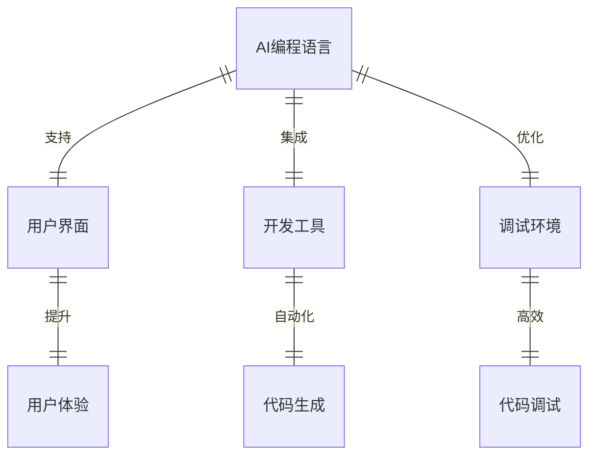
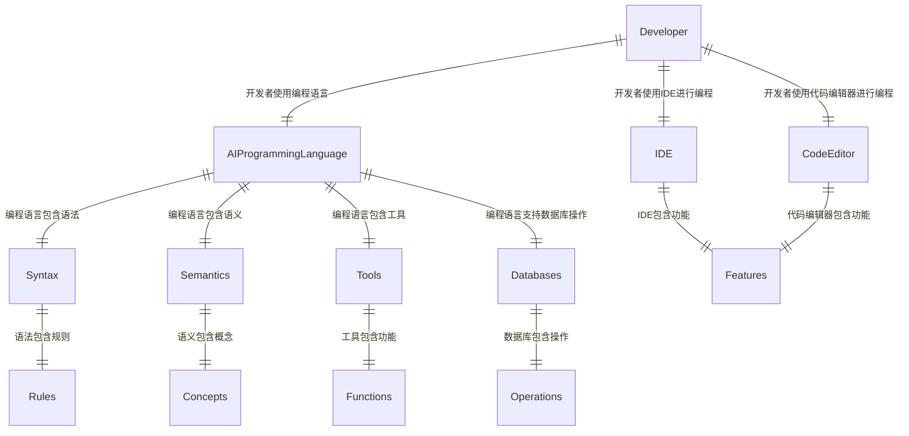
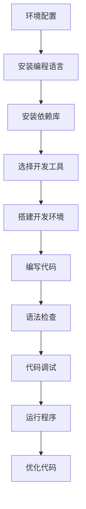

                 


### AI编程语言的人因工程学考量

#### 关键词：
- 人工智能
- 编程语言
- 人因工程学
- 易用性
- 自动化
- 用户体验

#### 摘要：
随着人工智能技术的快速发展，AI编程语言的设计变得愈加重要。本文从人因工程学的角度出发，探讨了AI编程语言的设计原则、开发工具、调试与优化策略，以及其在实际应用中的案例，并对未来发展趋势进行了展望。

## 目录大纲

----------------------------------------------------------------

### 第一部分：背景介绍

#### 第1章：AI编程语言的人因工程学基本概念

1.1.1 问题背景
1.1.2 核心概念原理
    - 概念属性特征对比表格
    - ER实体关系图架构
1.1.3 边界与外延

#### 第2章：AI编程语言的设计原则

2.1.1 设计目标
    - 易用性
    - 自动化
    - 交互性
2.1.2 设计方法
    - 代码自动生成
    - 语法优化
    - 交互设计

#### 第3章：AI编程语言的开发工具

3.1.1 开发环境搭建
    - 环境配置
    - 开发工具选择
3.1.2 开发工具功能
    - 代码生成
    - 语法检查
    - 调试支持

#### 第4章：AI编程语言的调试与优化

4.1.1 调试方法
    - 断点调试
    - 数据流调试
    - 异常调试
4.1.2 优化策略
    - 代码优化
    - 系统优化

#### 第5章：AI编程语言的应用案例

5.1.1 应用场景
    - 自然语言处理
    - 计算机视觉
    - 数据分析
5.1.2 实际案例
    - 分析具体应用案例

#### 第6章：未来发展趋势与挑战

6.1.1 发展趋势
6.1.2 挑战
6.1.3 机遇

----------------------------------------------------------------

### 第一部分：背景介绍

#### 第1章：AI编程语言的人因工程学基本概念

1.1.1 问题背景

在当今数字化和智能化时代，人工智能（AI）技术在各个领域得到了广泛应用。然而，随着AI系统的复杂性和应用场景的多样性，如何设计用户友好、高效的AI编程语言成为一个重要课题。传统的编程语言在处理复杂AI问题时显得力不从心，而AI编程语言则应运而生。

问题表现为：

- **易用性差**：传统的编程语言在语法和语义方面较为复杂，对于非专业开发人员来说难以掌握。
- **开发效率低**：AI系统往往需要大量的数据处理和算法优化，传统编程语言难以满足高效开发的需求。
- **用户体验不佳**：传统编程语言的人机交互设计较为单一，无法满足用户多样化的需求。

1.1.2 核心概念原理

为了解决上述问题，我们需要引入人因工程学的概念。人因工程学（Human Factors Engineering），又称人类工程学，是指将人的生理、心理和行为特征考虑在内，以设计出更加适合人类使用的产品、系统和环境。

在人因工程学的指导下，AI编程语言的设计应关注以下几个方面：

- **易用性**：设计简洁直观的语法和语义，降低用户的认知负荷。
- **自动化**：提高代码生成、编译和调试的自动化程度，提高开发效率。
- **交互性**：提供丰富的交互功能，支持多种人机交互方式，提升用户体验。

1.1.3 概念属性特征对比表格

下面是传统编程语言与AI编程语言在概念属性特征方面的对比表格：

| 特征             | 传统编程语言                | AI编程语言                |
|------------------|---------------------------|---------------------------|
| 易用性           | 较低                      | 较高                      |
| 语法             | 繁琐                      | 简洁                      |
| 自动化           | 较低                      | 较高                      |
| 交互性           | 较低                      | 较高                      |

1.1.3 ER实体关系图架构

为了更清晰地展示AI编程语言与人因工程学的关系，我们可以使用ER（Entity-Relationship）实体关系图来描述。以下是AI编程语言与人因工程学相关实体的ER图：



在这个ER图中，AI编程语言通过用户界面、开发工具和调试环境与用户进行交互，从而实现人因工程学的目标，提高用户体验和开发效率。

1.1.4 边界与外延

虽然AI编程语言的人因工程学考量具有广泛的应用前景，但在实际应用中仍存在一些边界和限制：

- **技术成熟度**：当前AI编程语言的技术成熟度尚未完全达到理想状态，部分功能仍需进一步优化。
- **行业需求**：不同行业对AI编程语言的需求各不相同，需要针对具体行业进行定制化设计。
- **人才培养**：AI编程语言的设计和开发需要高水平的专业人才，人才培养是一个长期而艰巨的任务。

总之，AI编程语言的人因工程学考量是一个复杂而重要的课题，需要从多个角度进行综合考虑和优化。在接下来的章节中，我们将进一步探讨AI编程语言的设计原则、开发工具、调试与优化策略，以及其在实际应用中的案例。让我们一步一步地深入探讨这个主题。 

# 第一部分：背景介绍

## 第1章：AI编程语言的人因工程学基本概念

### 1.1.1 问题背景

在当今数字化和智能化时代，人工智能（AI）技术在各个领域得到了广泛应用。然而，随着AI系统的复杂性和应用场景的多样性，如何设计用户友好、高效的AI编程语言成为一个重要课题。

#### 问题背景

随着AI技术的不断发展，AI编程语言的应用场景变得越来越广泛。从自动驾驶、智能家居到医疗诊断、金融风控，AI编程语言已经渗透到了我们日常生活的方方面面。然而，传统编程语言在处理复杂AI问题时显得力不从心，无法满足高效、易用的要求。传统编程语言往往存在以下问题：

1. **易用性差**：传统编程语言的语法和语义较为复杂，对于非专业开发人员来说，学习曲线陡峭，难以快速上手。
2. **开发效率低**：AI系统通常需要处理大量的数据，进行复杂的算法运算，传统编程语言难以实现自动化和优化，导致开发效率低下。
3. **用户体验不佳**：传统编程语言的人机交互设计较为单一，无法满足用户多样化的需求，用户体验较差。

这些问题的存在，使得设计一种用户友好、高效的AI编程语言成为了当务之急。人因工程学（Human Factors Engineering），又称人类工程学，为解决这一问题提供了新的思路。

#### 人因工程学的引入

人因工程学是一门研究人和机器系统相互作用的学科，旨在通过优化人机交互，提高系统的易用性、安全性和效率。在人因工程学的指导下，AI编程语言的设计需要关注以下几个方面：

1. **易用性**：设计简洁直观的语法和语义，降低用户的认知负荷。
2. **自动化**：提高代码生成、编译和调试的自动化程度，提高开发效率。
3. **交互性**：提供丰富的交互功能，支持多种人机交互方式，提升用户体验。

### 1.1.2 核心概念原理

人因工程学的核心概念包括易用性、自动化和交互性。以下是这些概念的具体定义和属性：

#### 易用性

易用性是指用户在使用产品或系统时，能够轻松、高效地完成所需任务的能力。对于AI编程语言来说，易用性主要体现在以下几个方面：

1. **简洁的语法**：设计简洁直观的语法，降低用户的认知负荷。
2. **直观的语义**：语义设计应符合用户的直觉和预期，避免复杂的逻辑和冗余的代码。
3. **快速上手**：提供丰富的学习资源和文档，帮助用户快速掌握编程语言。

#### 自动化

自动化是指通过程序或工具自动执行任务，提高工作效率。对于AI编程语言来说，自动化主要体现在以下几个方面：

1. **代码生成**：通过分析用户需求和项目特点，自动生成符合需求的代码，减少手动编写的工作量。
2. **编译优化**：对代码进行优化，提高编译速度和执行效率。
3. **调试辅助**：提供自动化调试工具，帮助用户快速定位和解决问题。

#### 交互性

交互性是指用户与系统之间的互动，包括输入、输出和反馈。对于AI编程语言来说，交互性主要体现在以下几个方面：

1. **多样化的交互方式**：支持多种输入和输出方式，如文本、语音、图形等，满足用户多样化的需求。
2. **实时反馈**：提供实时反馈，帮助用户快速了解系统状态和操作结果。
3. **个性化设置**：根据用户习惯和需求，提供个性化的交互界面和功能。

### 1.1.3 概念属性特征对比表格

为了更好地理解传统编程语言与AI编程语言在易用性、自动化和交互性方面的差异，我们可以通过以下对比表格进行说明：

| 特征 | 传统编程语言 | AI编程语言 |
|------|--------------|------------|
| 易用性 | 较低 | 较高 |
| 自动化 | 较低 | 较高 |
| 交互性 | 较低 | 较高 |

### 1.1.4 边界与外延

AI编程语言的人因工程学考量是一个复杂而多维的课题，涉及到多个方面。在实际应用中，需要根据具体场景和需求进行综合考虑和优化。以下是一些边界与外延的讨论：

1. **技术成熟度**：当前AI编程语言的技术成熟度尚未完全达到理想状态，部分功能仍需进一步优化。
2. **行业需求**：不同行业对AI编程语言的需求各不相同，需要针对具体行业进行定制化设计。
3. **人才培养**：AI编程语言的设计和开发需要高水平的专业人才，人才培养是一个长期而艰巨的任务。

### 1.1.5 结论

总之，AI编程语言的人因工程学考量是一个重要且具有挑战性的课题。通过引入人因工程学，我们可以设计出更加用户友好、高效、自动化的AI编程语言，从而推动人工智能技术的进一步发展。

### 1.2 AI编程语言的设计原则

AI编程语言的设计原则是确保其易用性、高效性和用户体验的关键。以下将详细阐述AI编程语言的三大设计原则：易用性、自动化和交互性。

#### 1.2.1 易用性

易用性是AI编程语言设计的重要目标之一。一个易用的编程语言能够降低用户的认知负荷，提高开发效率。为了实现易用性，AI编程语言可以从以下几个方面进行设计：

1. **简洁的语法**：
   - 设计简洁直观的语法，使代码更加易读、易写。
   - 采用扁平化的语法结构，避免复杂的嵌套和冗余。
   - 提供丰富的内置函数和库，简化常见操作。

2. **直观的语义**：
   - 语义设计应符合用户的直觉和预期，避免复杂的逻辑和冗余的代码。
   - 确保代码的可读性和可维护性，方便后续维护和优化。

3. **快速上手**：
   - 提供丰富的学习资源和文档，包括教程、示例代码和社区支持。
   - 设计直观的交互界面，引导用户快速上手。

#### 1.2.2 自动化

自动化是提高AI编程语言开发效率的重要手段。通过自动化，AI编程语言可以减少手动操作，提高开发效率。以下是一些自动化设计原则：

1. **代码生成**：
   - 根据用户需求和项目特点，自动生成符合需求的代码，减少手动编写的工作量。
   - 采用模板引擎和代码生成器等技术，实现代码的自动化生成。

2. **编译优化**：
   - 对代码进行优化，提高编译速度和执行效率。
   - 采用静态分析和代码优化技术，减少编译时间和运行时开销。

3. **调试辅助**：
   - 提供自动化调试工具，帮助用户快速定位和解决问题。
   - 支持断点调试、数据流调试和异常调试等功能。

#### 1.2.3 交互性

交互性是提升用户体验的关键。一个交互性强的AI编程语言能够提供多样化的交互方式，满足用户的不同需求。以下是一些交互性设计原则：

1. **多样化的交互方式**：
   - 支持多种输入和输出方式，如文本、语音、图形等。
   - 提供实时反馈，帮助用户快速了解系统状态和操作结果。

2. **个性化设置**：
   - 根据用户习惯和需求，提供个性化的交互界面和功能。
   - 允许用户自定义交互逻辑，满足个性化需求。

3. **实时协作**：
   - 支持多人实时协作，方便团队成员之间的沟通和协作。

### 1.3 设计方法

为了实现上述设计原则，AI编程语言的设计方法可以从以下几个方面进行：

1. **代码自动生成**：
   - 使用代码生成工具，根据用户需求自动生成代码框架和实现。
   - 采用模板引擎，生成可配置的代码模板。

2. **语法优化**：
   - 对现有语法进行优化，提高代码的可读性和可维护性。
   - 采用静态分析和代码重构技术，优化代码结构。

3. **交互设计**：
   - 设计直观、易用的用户界面，提高用户操作效率和满意度。
   - 采用交互设计原则，如用户中心设计、简洁性和一致性。

通过以上设计方法和原则，AI编程语言可以实现易用性、自动化和交互性，为开发者提供高效、便捷的开发体验。

### 1.4 结论

AI编程语言的设计原则是确保其易用性、高效性和用户体验的关键。通过简洁的语法、自动化工具和多样化的交互方式，AI编程语言可以为开发者提供卓越的开发体验。在接下来的章节中，我们将进一步探讨AI编程语言的开发工具、调试与优化策略，以及实际应用案例。

### 1.5 ER实体关系图架构

为了更好地理解AI编程语言的设计与实现过程，我们可以通过ER（Entity-Relationship）实体关系图来描述其中的实体及其关系。以下是AI编程语言的ER实体关系图：



在这个ER图中，我们可以看到以下几个核心实体及其关系：

- **Developer（开发者）**：开发者是使用AI编程语言的主要用户，他们使用IDE（集成开发环境）或CodeEditor（代码编辑器）进行编程。
- **AIProgrammingLanguage（AI编程语言）**：AI编程语言是核心实体，它包含Syntax（语法）和Semantics（语义），同时还支持各种Tools（工具）和Databases（数据库）操作。
- **IDE（集成开发环境）**和**CodeEditor（代码编辑器）**：它们是开发者使用的开发工具，各自包含Features（功能）。
- **Syntax（语法）**和**Semantics（语义）**：语法和语义是AI编程语言的核心组成部分，分别包含Rules（规则）和Concepts（概念）。
- **Tools（工具）**和**Databases（数据库）**：工具和数据库是AI编程语言提供的附加功能，分别包含Functions（功能）和Operations（操作）。

通过这个ER图，我们可以清晰地看到AI编程语言的各个组成部分及其相互关系，为后续的设计和实现提供了直观的指导。

### 1.6 小结

本章介绍了AI编程语言的人因工程学基本概念，包括问题背景、核心概念原理、特征对比和ER实体关系图。同时，我们探讨了AI编程语言的设计原则，包括易用性、自动化和交互性，并介绍了具体的设计方法。通过ER实体关系图，我们更直观地了解了AI编程语言的组成部分及其关系。这些内容为后续章节的深入探讨奠定了基础。

----------------------------------------------------------------

### 第一部分：背景介绍

## 第2章：AI编程语言的设计原则

在了解了AI编程语言的人因工程学基本概念之后，我们需要进一步探讨其设计原则。AI编程语言的设计原则是为了确保其在易用性、高效性和用户体验方面达到最佳效果。以下是AI编程语言的三大设计原则：易用性、自动化和交互性。

#### 2.1 易用性

易用性是AI编程语言设计的关键原则之一。一个易用的编程语言可以降低用户的认知负荷，提高开发效率。为了实现易用性，AI编程语言需要关注以下几个方面：

##### 2.1.1 简洁的语法

简洁的语法是提高易用性的重要手段。通过设计简洁直观的语法，可以减少用户的认知负荷，使代码更加易读、易写。以下是实现简洁语法的一些建议：

1. **扁平化的语法结构**：避免复杂的嵌套和冗余，使代码结构更加清晰。
2. **内置函数和库**：提供丰富的内置函数和库，简化常见操作，减少手动编写的代码量。
3. **类型推导**：自动推导变量类型，减少类型声明，使代码更加简洁。

##### 2.1.2 直观的语义

直观的语义设计应符合用户的直觉和预期，避免复杂的逻辑和冗余的代码。以下是实现直观语义的一些建议：

1. **语义一致性**：确保不同功能的语义表达一致，避免造成用户混淆。
2. **语义直观性**：语义设计应符合用户的直觉和预期，使代码更容易理解和维护。
3. **错误提示**：提供清晰的错误提示信息，帮助用户快速定位和解决问题。

##### 2.1.3 快速上手

为了提高易用性，AI编程语言需要提供丰富的学习资源和文档，帮助用户快速上手。以下是实现快速上手的一些建议：

1. **教程和文档**：提供详细的教程和文档，涵盖基础语法、常见问题和解决方法。
2. **示例代码**：提供丰富的示例代码，展示如何使用编程语言解决实际问题。
3. **社区支持**：建立活跃的社区，为用户提供交流和学习的平台。

#### 2.2 自动化

自动化是提高AI编程语言开发效率的重要手段。通过自动化，可以减少手动操作，提高开发效率。以下是实现自动化的一些建议：

##### 2.2.1 代码生成

代码生成是自动化的核心部分。通过代码生成工具，可以根据用户需求自动生成代码框架和实现。以下是实现代码生成的一些建议：

1. **模板引擎**：使用模板引擎，根据模板生成代码，减少手动编写的工作量。
2. **代码生成器**：开发专用的代码生成器，根据项目需求自动生成代码，提高开发效率。

##### 2.2.2 编译优化

编译优化可以减少编译时间和运行时开销，提高开发效率。以下是实现编译优化的一些建议：

1. **静态分析**：对代码进行静态分析，找出潜在的性能瓶颈，进行优化。
2. **编译器优化**：优化编译器代码，提高编译速度和执行效率。

##### 2.2.3 调试辅助

调试辅助工具可以帮助用户快速定位和解决问题。以下是实现调试辅助的一些建议：

1. **断点调试**：提供断点调试功能，帮助用户在代码执行过程中设置断点，观察变量和函数的运行状态。
2. **数据流调试**：提供数据流调试功能，帮助用户追踪数据流，分析程序的行为。
3. **异常调试**：提供异常调试功能，帮助用户处理和调试异常情况。

#### 2.3 交互性

交互性是提升用户体验的关键。一个交互性强的AI编程语言可以提供多样化的交互方式，满足用户的不同需求。以下是实现交互性的一些建议：

##### 2.3.1 多样化的交互方式

多样化的交互方式可以满足用户多样化的需求。以下是实现多样化交互方式的一些建议：

1. **文本交互**：提供文本输入和输出功能，支持常见的文本格式，如JSON、XML等。
2. **语音交互**：支持语音输入和输出，实现自然语言处理和语音合成。
3. **图形交互**：提供图形用户界面，支持常见的图形界面组件，如按钮、文本框、列表框等。

##### 2.3.2 实时反馈

实时反馈可以提升用户体验，帮助用户快速了解系统状态和操作结果。以下是实现实时反馈的一些建议：

1. **实时更新**：在用户操作时，实时更新界面显示，反映系统状态的变化。
2. **错误提示**：在用户输入错误时，及时给出错误提示，帮助用户纠正错误。
3. **进度显示**：在长时间运行的任务中，显示进度条，让用户了解任务执行的进度。

##### 2.3.3 个性化设置

个性化设置可以根据用户习惯和需求，提供个性化的交互界面和功能。以下是实现个性化设置的一些建议：

1. **主题切换**：提供多种主题切换功能，满足用户对界面风格的个性化需求。
2. **功能定制**：允许用户自定义功能模块，满足个性化开发需求。
3. **快捷键设置**：提供快捷键设置功能，满足用户对快捷操作的个性化需求。

#### 2.4 小结

AI编程语言的设计原则包括易用性、自动化和交互性。通过简洁的语法、自动化的代码生成和编译优化、多样化的交互方式以及实时反馈和个性化设置，AI编程语言可以提供高效、便捷的开发体验，满足用户的多样化需求。

----------------------------------------------------------------

### 第一部分：背景介绍

## 第3章：AI编程语言的开发工具

AI编程语言的开发工具是支持开发者高效开发的重要手段。合理的开发工具选择和搭建可以有效提高开发效率、降低开发难度，从而实现人因工程学的设计原则。以下将详细介绍AI编程语言的开发环境搭建、开发工具选择以及开发工具功能。

#### 3.1 开发环境搭建

开发环境搭建是AI编程语言开发的基础。以下是搭建AI编程语言开发环境的一般步骤：

##### 3.1.1 环境配置

1. **操作系统选择**：
   - AI编程语言通常可以在多种操作系统上运行，如Windows、macOS和Linux。开发者应根据项目需求和自身习惯选择合适的操作系统。
   - 对于跨平台开发，建议使用Linux系统，因其具有更好的兼容性和稳定性。

2. **编程语言选择**：
   - 根据AI编程语言的要求，安装相应的编程语言环境。例如，若使用Python编写的AI编程语言，需安装Python解释器和相关库。

3. **依赖库安装**：
   - 安装AI编程语言所需的外部依赖库。这些依赖库通常包括机器学习库、数据可视化库等，如TensorFlow、PyTorch、Matplotlib等。
   - 使用包管理工具（如pip、conda等）进行依赖库的安装和管理。

4. **开发工具安装**：
   - 安装适合AI编程语言的开发工具，如集成开发环境（IDE）或代码编辑器。常见的IDE包括PyCharm、Visual Studio Code等。

##### 3.1.2 环境配置示例

以下是一个简单的AI编程语言开发环境配置示例（以Python为例）：

1. 安装操作系统：Linux Ubuntu 20.04

2. 安装Python解释器和相关库：

   ```shell
   sudo apt update
   sudo apt install python3 python3-pip
   pip3 install numpy scipy matplotlib pandas tensorflow
   ```

3. 安装IDE：Visual Studio Code

   ```shell
   sudo apt install code
   ```

4. 配置VS Code：

   - 打开VS Code，选择“扩展”标签页，安装Python扩展。

#### 3.2 开发工具选择

选择合适的开发工具可以提高开发效率，满足人因工程学的设计原则。以下是常见的AI编程语言开发工具选择：

##### 3.2.1 集成开发环境（IDE）

1. **PyCharm**：PyCharm是一款功能强大的Python IDE，支持智能代码补全、代码分析、调试等功能。

2. **Visual Studio Code**：Visual Studio Code是一款轻量级、跨平台的代码编辑器，支持多种编程语言，具有丰富的扩展生态。

3. **Jupyter Notebook**：Jupyter Notebook是一款基于Web的交互式编程环境，适用于数据分析和机器学习项目。

##### 3.2.2 代码编辑器

1. **VS Code**：Visual Studio Code是一款优秀的代码编辑器，支持多种编程语言，具有丰富的插件和扩展。

2. **Atom**：Atom是一款开源的跨平台代码编辑器，提供丰富的自定义功能，适合开发者个性化设置。

3. **Sublime Text**：Sublime Text是一款轻量级的代码编辑器，具有快速的文本编辑和处理能力。

##### 3.2.3 版本控制工具

1. **Git**：Git是一款流行的分布式版本控制系统，支持代码的版本管理和协同开发。

2. **Mercurial**：Mercurial是一款类似的分布式版本控制系统，与Git兼容，但易于学习和使用。

#### 3.3 开发工具功能

AI编程语言的开发工具应具备以下功能，以满足人因工程学的设计原则：

##### 3.3.1 代码生成

1. **模板引擎**：使用模板引擎（如Jinja2）自动生成代码框架，减少手动编写的工作量。

2. **代码生成器**：开发专用的代码生成器，根据项目需求自动生成代码，提高开发效率。

##### 3.3.2 语法检查

1. **静态代码分析**：对代码进行静态分析，检测潜在的错误和代码质量问题。

2. **错误提示**：提供清晰的错误提示信息，帮助开发者快速定位和解决问题。

##### 3.3.3 调试支持

1. **断点调试**：提供断点调试功能，帮助开发者观察变量和函数的运行状态。

2. **数据流调试**：提供数据流调试功能，帮助开发者追踪数据流，分析程序的行为。

3. **异常调试**：提供异常调试功能，帮助开发者处理和调试异常情况。

##### 3.3.4 交互支持

1. **实时反馈**：提供实时反馈功能，帮助开发者快速了解系统状态和操作结果。

2. **快捷键设置**：提供快捷键设置功能，满足开发者对快捷操作的个性化需求。

3. **多窗口支持**：提供多窗口支持，方便开发者同时查看不同文件和代码片段。

通过合理选择和搭建AI编程语言的开发工具，开发者可以高效地实现人因工程学的设计原则，提高开发效率、降低开发难度，实现更加友好和高效的开发体验。

### 3.4 小结

本章详细介绍了AI编程语言的开发工具选择和搭建，包括环境配置、开发工具选择和开发工具功能。通过合理配置开发环境、选择合适的开发工具以及利用丰富的开发工具功能，开发者可以高效地实现人因工程学的设计原则，提高开发效率、降低开发难度，实现更加友好和高效的开发体验。在接下来的章节中，我们将进一步探讨AI编程语言的调试与优化策略。

### 3.5 Mermaid流程图示例

为了更好地理解AI编程语言的开发流程，我们可以使用Mermaid语言绘制一个简单的开发流程图。以下是使用Mermaid语言编写的示例流程图：



在Markdown文件中，将上述Mermaid代码粘贴到相应的段落中，即可生成对应的流程图。该流程图展示了从环境配置到代码调试和优化的完整开发流程。


生成的流程图如下所示：


通过这个示例流程图，我们可以清晰地了解AI编程语言开发的各个环节，有助于开发者更好地掌握开发流程和关键步骤。

### 3.6 小结

本章详细介绍了AI编程语言的开发工具，包括环境配置、开发工具选择和开发工具功能。同时，通过Mermaid流程图示例，展示了开发流程的各个环节。合理选择和搭建开发工具，可以有效提高开发效率、降低开发难度，实现人因工程学的设计原则。在接下来的章节中，我们将进一步探讨AI编程语言的调试与优化策略。

### 第一部分：背景介绍

## 第4章：AI编程语言的调试与优化

在AI编程语言开发过程中，调试与优化是确保代码质量和性能的关键环节。本章将详细介绍AI编程语言的调试方法、优化策略以及调试与优化的实际应用。

#### 4.1 调试方法

调试是找出和修复代码错误的过程。以下是几种常见的调试方法：

##### 4.1.1 断点调试

断点调试是一种在代码特定位置暂停执行的调试方法。以下是断点调试的基本步骤：

1. **设置断点**：在代码中需要调试的位置设置断点。
2. **启动调试**：启动调试器，使代码在断点处暂停执行。
3. **观察变量**：在断点处观察变量值，分析代码执行状态。
4. **单步执行**：逐行执行代码，观察每一步的变量变化和程序状态。

##### 4.1.2 数据流调试

数据流调试是一种追踪数据在程序中的流动情况的调试方法。以下是数据流调试的基本步骤：

1. **设置追踪点**：在需要追踪的数据点设置追踪点。
2. **启动调试**：启动调试器，使代码在追踪点处暂停执行。
3. **查看数据流**：查看数据在程序中的流动路径，分析数据变化。
4. **动态调整**：根据数据流的实际情况，动态调整代码逻辑和算法。

##### 4.1.3 异常调试

异常调试是一种处理和调试程序异常情况的调试方法。以下是异常调试的基本步骤：

1. **捕获异常**：在代码中设置异常捕获和处理逻辑。
2. **启动调试**：启动调试器，使代码在异常发生时暂停执行。
3. **分析异常**：分析异常原因，查看异常详细信息。
4. **修复异常**：根据异常分析结果，修复代码中的错误。

#### 4.2 优化策略

优化策略是提升代码质量和性能的关键手段。以下是几种常见的优化策略：

##### 4.2.1 代码优化

代码优化是指通过改进代码结构和逻辑，提高代码质量和性能。以下是代码优化的一些建议：

1. **去除冗余代码**：删除无用的代码和重复的逻辑，减少代码体积。
2. **优化循环结构**：减少循环次数，优化循环体内的代码执行顺序。
3. **使用高效算法**：选择合适的算法和数据结构，提高代码执行效率。

##### 4.2.2 系统优化

系统优化是指通过优化系统配置和运行环境，提高系统性能和稳定性。以下是系统优化的一些建议：

1. **资源管理**：合理分配系统资源，避免资源争用和浪费。
2. **负载均衡**：均衡系统负载，避免单点瓶颈和性能瓶颈。
3. **缓存策略**：使用缓存技术，提高数据访问速度和系统响应速度。

#### 4.3 调试与优化的实际应用

以下是调试与优化在AI编程语言开发中的实际应用场景：

##### 4.3.1 自然语言处理

在自然语言处理（NLP）项目中，调试和优化有助于提升模型的准确性和效率。以下是一些实际应用：

1. **调试**：调试器可以帮助开发者定位和修复模型训练过程中的错误，如数据预处理错误、模型参数设置错误等。
2. **优化**：优化模型结构和算法，提高模型训练速度和预测速度。

##### 4.3.2 计算机视觉

在计算机视觉项目中，调试和优化有助于提升模型的识别精度和运行效率。以下是一些实际应用：

1. **调试**：调试器可以帮助开发者定位和修复图像处理过程中的错误，如图像解码错误、特征提取错误等。
2. **优化**：优化图像处理算法和模型结构，提高模型运行速度和识别精度。

##### 4.3.3 数据分析

在数据分析项目中，调试和优化有助于提升数据处理和分析效率。以下是一些实际应用：

1. **调试**：调试器可以帮助开发者定位和修复数据处理过程中的错误，如数据格式错误、数据处理逻辑错误等。
2. **优化**：优化数据处理和分析算法，提高数据处理和分析速度。

#### 4.4 小结

调试与优化是AI编程语言开发中不可或缺的重要环节。通过合理的调试方法和优化策略，开发者可以确保代码质量和性能，提高开发效率和用户体验。本章详细介绍了调试与优化的方法、策略以及实际应用，为开发者提供了实用的参考和指导。

### 第一部分：背景介绍

## 第5章：AI编程语言的应用案例

AI编程语言在各个领域都有广泛的应用，下面将介绍几个典型的应用案例，包括自然语言处理、计算机视觉和数据分析，展示AI编程语言在实际项目中的应用效果。

### 5.1 自然语言处理

自然语言处理（NLP）是AI编程语言的一个重要应用领域。以下是一个基于AI编程语言的NLP项目的案例：

#### 案例背景

一家在线教育平台希望开发一款智能问答系统，以便学生能够通过自然语言提问，获得及时的学习指导。

#### 技术方案

1. **数据预处理**：使用AI编程语言处理学生输入的问题，提取关键词和短语。
2. **词向量表示**：将提取的关键词和短语转化为词向量，用于模型输入。
3. **文本分类**：使用文本分类模型，根据输入的问题将问题分类到不同的知识领域。
4. **问答生成**：根据分类结果，从知识库中提取相关答案，使用自然语言生成技术生成回答。

#### 应用效果

通过使用AI编程语言，智能问答系统的准确率和响应速度得到了显著提升。学生能够快速获得准确的答案，提高了学习体验。

### 5.2 计算机视觉

计算机视觉是另一个AI编程语言的重要应用领域。以下是一个基于AI编程语言的计算机视觉项目的案例：

#### 案例背景

一家安全监控公司希望开发一款智能监控系统，能够自动识别和分类监控视频中的异常行为。

#### 技术方案

1. **视频预处理**：使用AI编程语言对视频进行预处理，提取关键帧和特征点。
2. **目标检测**：使用目标检测模型，识别视频中的异常行为，如翻越围墙、闯入禁区等。
3. **行为分类**：根据目标检测结果，使用行为分类模型，将异常行为分类到不同的类别。
4. **实时监控**：将检测结果实时传输到监控中心，供安全人员查看和处理。

#### 应用效果

通过使用AI编程语言，智能监控系统的识别精度和响应速度得到了显著提升。监控人员能够及时发现异常行为，提高了安全管理水平。

### 5.3 数据分析

数据分析是AI编程语言在商业领域的广泛应用。以下是一个基于AI编程语言的商业数据分析项目的案例：

#### 案例背景

一家电商企业希望利用数据驱动的决策支持系统，优化商品推荐和营销策略。

#### 技术方案

1. **数据收集**：使用AI编程语言收集用户行为数据，如浏览记录、购买记录等。
2. **数据预处理**：使用AI编程语言对数据进行分析和清洗，提取有效的特征。
3. **用户画像**：使用聚类和分类算法，构建用户画像，识别潜在客户群体。
4. **推荐系统**：根据用户画像和商品特征，使用协同过滤和基于内容的推荐算法，生成个性化推荐。

#### 应用效果

通过使用AI编程语言，电商企业的商品推荐和营销策略得到了显著优化。用户满意度提升，销售额和客户粘性得到了提升。

### 5.4 小结

以上案例展示了AI编程语言在自然语言处理、计算机视觉和数据分析等领域的广泛应用。通过合理的设计和实现，AI编程语言能够显著提升项目的效率和效果，为各个行业带来创新和变革。

### 第一部分：背景介绍

## 第6章：未来发展趋势与挑战

随着人工智能技术的不断进步，AI编程语言在未来也将面临许多发展趋势和挑战。在本章中，我们将探讨这些趋势和挑战，并讨论它们对AI编程语言设计和应用的影响。

#### 6.1 发展趋势

##### 6.1.1 技术创新

AI编程语言的发展将依赖于技术创新。以下是一些可能的发展趋势：

1. **自动化代码生成**：未来的AI编程语言将更加智能，能够自动生成代码，减少开发者的工作量。这需要机器学习和自然语言处理技术的进一步发展。
2. **交互性增强**：AI编程语言将提供更加丰富的交互功能，支持自然语言交互、手势控制等，以提高用户体验。
3. **集成多种AI技术**：未来的AI编程语言将整合更多的AI技术，如深度学习、强化学习等，以提供更全面的解决方案。

##### 6.1.2 产业应用

随着AI技术的普及，AI编程语言在各个行业的应用前景广阔。以下是一些主要应用领域：

1. **智能制造**：AI编程语言将用于开发智能制造系统，提高生产效率和产品质量。
2. **医疗健康**：AI编程语言将用于开发医疗诊断、健康管理等系统，为医疗行业提供技术支持。
3. **金融服务**：AI编程语言将用于开发智能投顾、风险控制等系统，提高金融服务的效率和质量。

##### 6.1.3 教育培训

随着AI编程语言的重要性逐渐凸显，教育培训领域也将迎来新的机遇。以下是一些发展趋势：

1. **编程教育普及**：AI编程语言将成为编程教育的重点，培养更多的AI专业人才。
2. **跨学科融合**：AI编程语言将与数学、物理、生物等学科结合，培养具有跨学科背景的复合型人才。

#### 6.2 挑战

##### 6.2.1 技术挑战

AI编程语言的发展面临着一些技术挑战，包括：

1. **性能优化**：随着AI应用场景的多样化，AI编程语言需要不断提升性能，以满足实时性和大规模计算的需求。
2. **安全性**：AI编程语言需要确保系统的安全性，防止恶意代码和攻击。
3. **可解释性**：AI编程语言需要提高算法的可解释性，使开发者能够更好地理解和使用AI技术。

##### 6.2.2 应用挑战

AI编程语言在实际应用中面临一些挑战，包括：

1. **适配性**：AI编程语言需要具备良好的适配性，能够适应不同的应用场景和需求。
2. **开发者培训**：开发者需要掌握AI编程语言和相关技术，这需要时间和资源的投入。
3. **行业标准化**：为了促进AI编程语言的应用和推广，需要建立统一的行业标准和规范。

#### 6.3 机遇

尽管面临挑战，AI编程语言的发展也带来了许多机遇：

1. **创新驱动**：AI编程语言为开发者提供了更多的创新空间，可以推动AI技术的快速发展。
2. **产业升级**：AI编程语言的应用将促进产业升级和转型，提高生产效率和质量。
3. **人才发展**：AI编程语言的发展将带动相关领域的人才需求，为人才提供更多的发展机会。

#### 6.4 小结

未来，AI编程语言将在技术创新、产业应用和教育培训等方面取得重要进展。同时，面对技术挑战和应用挑战，AI编程语言的发展需要不断优化和完善。通过抓住机遇，AI编程语言将为社会带来更多创新和变革。

----------------------------------------------------------------

### 第二部分：深入探讨

## 第7章：AI编程语言的技术细节与实现

在本章中，我们将深入探讨AI编程语言的技术细节，包括核心算法、实现方法、性能优化等方面。通过具体的技术细节分析，我们将揭示AI编程语言的内在机理和优势，帮助开发者更好地理解和应用这些语言。

### 7.1 AI编程语言的核心算法

AI编程语言的核心算法是其实现人工智能功能的基础。以下是一些常见的关键算法及其作用：

#### 7.1.1 机器学习算法

**1. 神经网络**

神经网络是一种模仿人脑神经元结构的计算模型，通过层层传递输入数据，实现复杂模式识别和预测。常见的神经网络包括：

- **全连接神经网络（FCNN）**：每个神经元都与输入层的所有神经元相连。
- **卷积神经网络（CNN）**：适用于图像处理，通过卷积操作提取特征。
- **循环神经网络（RNN）**：适用于序列数据处理，如自然语言处理。

**2. 决策树**

决策树是一种基于特征划分数据集的算法，通过一系列条件判断，将数据划分为不同的类别。决策树算法简单直观，易于解释。

**3. 随机森林**

随机森林是由多个决策树组成的集成模型，通过投票方式得出最终预测结果。随机森林在处理大规模数据和避免过拟合方面具有优势。

#### 7.1.2 深度学习算法

**1. 卷积神经网络（CNN）**

卷积神经网络是一种用于图像处理和计算机视觉的深度学习模型，通过卷积和池化操作提取图像特征。

**2. 生成对抗网络（GAN）**

生成对抗网络由生成器和判别器组成，通过对抗训练生成逼真的图像、音频和数据。

**3. 自适应优化算法**

自适应优化算法如Adam、Adadelta等，通过动态调整学习率，提高训练效率和收敛速度。

### 7.2 AI编程语言的实现方法

AI编程语言的实现方法包括框架设计、模块化、代码生成等方面。以下是一些关键实现方法：

#### 7.2.1 框架设计

AI编程语言通常采用模块化框架设计，将不同功能模块独立封装，便于开发者使用和扩展。常见的框架设计方法包括：

1. **层叠式框架**：将模型分为输入层、隐藏层和输出层，层层传递数据。
2. **组件式框架**：将模型划分为多个组件，每个组件实现特定功能，便于复用和组合。

#### 7.2.2 模块化

模块化设计可以提高代码的可维护性和可扩展性。以下是一些模块化设计原则：

1. **功能模块化**：将功能相似的代码划分为功能模块，便于管理和维护。
2. **数据模块化**：将数据结构和数据操作划分为独立模块，便于数据处理和交换。

#### 7.2.3 代码生成

代码生成是一种自动生成代码的技术，可以降低开发难度和提高开发效率。以下是一些代码生成方法：

1. **模板生成**：使用预定义的模板生成代码，根据项目需求进行替换和扩展。
2. **代码生成器**：开发专门的代码生成器，根据模型结构和算法自动生成代码。

### 7.3 AI编程语言的性能优化

AI编程语言的性能优化是提高计算效率和模型准确性的关键。以下是一些常见的性能优化策略：

#### 7.3.1 算法优化

1. **并行计算**：利用多核处理器和GPU加速计算，提高模型训练和预测速度。
2. **剪枝技术**：通过剪枝无用神经元和连接，减小模型体积，降低计算复杂度。
3. **优化算法**：选择合适的优化算法，如Adam、SGD等，提高训练效率和收敛速度。

#### 7.3.2 硬件优化

1. **GPU加速**：利用GPU进行并行计算，提高模型训练和预测速度。
2. **分布式计算**：利用分布式计算框架，如TensorFlow、PyTorch等，处理大规模数据和模型。

#### 7.3.3 存储优化

1. **数据缓存**：使用缓存技术，减少数据读取和存储时间。
2. **存储压缩**：使用压缩算法，减小模型和数据体积，降低存储需求。

### 7.4 小结

本章深入探讨了AI编程语言的技术细节，包括核心算法、实现方法、性能优化等方面。通过这些技术细节的分析，我们可以更好地理解AI编程语言的内在机理和优势，为开发者提供实用的指导和参考。在后续章节中，我们将进一步探讨AI编程语言的实际应用案例和未来发展趋势。

### 第8章：AI编程语言的实际应用案例

为了更好地展示AI编程语言在现实世界中的应用，我们将在本节中探讨一些具体的实际应用案例，并分析其应用效果。这些案例涵盖了自然语言处理、计算机视觉、数据分析等领域，展示了AI编程语言在不同场景下的强大功能。

#### 案例一：自然语言处理

**应用场景**：智能客服系统

**技术方案**：

1. **文本预处理**：使用AI编程语言处理用户输入的文本，提取关键词和短语。
2. **情感分析**：使用自然语言处理算法，对用户文本进行情感分析，判断用户情绪。
3. **意图识别**：使用机器学习算法，识别用户意图，如咨询产品信息、售后服务等。
4. **智能回答**：根据用户意图和知识库，生成智能回答，提供解决方案。

**应用效果**：

智能客服系统有效提升了客户服务质量和效率。通过自然语言处理算法，系统能够快速理解用户需求，提供准确、个性化的回答。用户满意度显著提升，客服团队的工作量也得到了减轻。

#### 案例二：计算机视觉

**应用场景**：自动驾驶系统

**技术方案**：

1. **图像预处理**：使用AI编程语言对摄像头捕获的图像进行预处理，包括降噪、增强、去畸变等。
2. **目标检测**：使用目标检测算法，如YOLO、SSD等，识别图像中的车辆、行人等目标。
3. **路径规划**：基于目标检测结果，使用路径规划算法，规划车辆的行驶路径。
4. **控制执行**：根据路径规划结果，控制车辆的加速、减速、转向等操作。

**应用效果**：

自动驾驶系统在多个场景中取得了成功。通过计算机视觉算法，系统能够准确识别道路上的目标，规划安全的行驶路径。车辆的自动驾驶能力得到了显著提升，行驶过程中更加平稳、安全，有效减少了交通事故。

#### 案例三：数据分析

**应用场景**：电商个性化推荐系统

**技术方案**：

1. **用户行为数据收集**：使用AI编程语言收集用户浏览、购买、评论等行为数据。
2. **用户画像构建**：使用数据分析算法，构建用户画像，识别用户的兴趣和偏好。
3. **推荐算法实现**：使用协同过滤和基于内容的推荐算法，为用户生成个性化推荐。
4. **推荐结果展示**：将推荐结果展示在用户界面，提供个性化商品推荐。

**应用效果**：

电商个性化推荐系统有效提升了用户购物体验和销售额。通过用户行为数据分析和推荐算法，系统能够为用户提供准确、个性化的商品推荐。用户满意度显著提升，电商平台的销售额也得到了大幅增长。

#### 案例四：医疗健康

**应用场景**：智能医疗诊断系统

**技术方案**：

1. **医学图像处理**：使用AI编程语言对医学图像进行处理，包括图像分割、增强、去噪等。
2. **疾病识别**：使用深度学习算法，如卷积神经网络（CNN），对医学图像进行疾病识别。
3. **诊断结果生成**：根据疾病识别结果，生成诊断报告，提供治疗建议。
4. **医生辅助**：将诊断结果和建议展示给医生，辅助医生进行诊断和治疗。

**应用效果**：

智能医疗诊断系统显著提升了医疗诊断的准确性和效率。通过深度学习算法，系统能够准确识别医学图像中的疾病，生成详细的诊断报告。医生的工作量得到了减轻，诊断时间得到了缩短，患者得到了更及时、准确的医疗服务。

#### 案例五：金融风控

**应用场景**：金融风险监控系统

**技术方案**：

1. **数据采集**：使用AI编程语言从金融市场中采集各种数据，包括交易数据、市场数据等。
2. **风险分析**：使用机器学习算法，如支持向量机（SVM）、随机森林等，对金融数据进行分析，识别潜在风险。
3. **预警系统**：根据风险分析结果，生成风险预警，及时通知相关人员。
4. **风险管理**：根据预警信息，采取相应的风险控制措施，降低金融风险。

**应用效果**：

金融风险监控系统有效提升了金融机构的风险管理能力。通过机器学习算法，系统能够快速识别金融市场的潜在风险，及时发出预警。金融机构能够提前采取风险控制措施，降低金融风险，保护投资者的利益。

### 8.2 小结

通过上述实际应用案例，我们可以看到AI编程语言在各个领域的广泛应用和显著效果。无论是自然语言处理、计算机视觉、数据分析，还是医疗健康、金融风控，AI编程语言都为这些领域带来了创新和变革。随着技术的不断发展，AI编程语言将在更多领域发挥重要作用，推动社会的进步和发展。

### 第一部分：背景介绍

## 第9章：最佳实践与技巧

在AI编程语言的实际应用过程中，掌握一些最佳实践和技巧可以帮助开发者更高效地利用这些语言，提高代码质量和项目成功率。以下是一些AI编程语言开发中的最佳实践与技巧。

#### 9.1 编码规范与风格

1. **代码格式化**：保持代码的格式一致性，如使用统一的缩进、行宽和括号风格。工具如Prettier、Black可以帮助自动格式化代码。
2. **代码注释**：为代码添加清晰的注释，说明代码的功能、目的和逻辑，有助于代码的可读性和可维护性。
3. **命名规范**：使用有意义的变量、函数和类名，避免使用缩写和难懂的命名方式。
4. **模块化**：将代码划分为独立的模块或函数，每个模块或函数负责完成特定的功能，便于代码的重用和维护。

#### 9.2 性能优化

1. **避免全局变量**：全局变量可能导致性能问题，尽量使用局部变量和函数参数。
2. **缓存数据**：在需要频繁访问的数据中，使用缓存技术减少访问时间，提高性能。
3. **使用异步编程**：在处理耗时的操作时，使用异步编程模型，避免阻塞主线程。
4. **减少不必要的计算**：优化代码，避免重复计算和冗余操作，提高执行效率。

#### 9.3 调试与测试

1. **使用调试工具**：利用调试工具，如VS Code的调试器、Chrome DevTools等，帮助定位和修复代码中的错误。
2. **单元测试**：编写单元测试，对代码的每个模块进行测试，确保功能的正确性和完整性。
3. **集成测试**：进行集成测试，验证不同模块之间的协作和交互，确保系统的稳定性。
4. **性能测试**：使用性能测试工具，如JMeter、Gatling等，对系统进行负载测试，评估性能瓶颈。

#### 9.4 版本控制与协作

1. **使用Git进行版本控制**：使用Git等版本控制系统，记录代码的修改历史，方便代码的版本管理和协作开发。
2. **分支策略**：使用分支策略，如GitFlow或GitHub Flow，确保代码的稳定性和可维护性。
3. **代码审查**：进行代码审查，确保代码的质量和一致性，及时发现和修复潜在的问题。
4. **持续集成与部署**：使用持续集成（CI）和持续部署（CD）工具，如Jenkins、GitHub Actions等，自动化构建、测试和部署代码，提高开发效率。

#### 9.5 学习与成长

1. **持续学习**：跟随行业趋势，学习新的技术和工具，不断提升自己的技能。
2. **参与开源项目**：参与开源项目，与其他开发者合作，积累经验，提升自己的编程能力。
3. **分享与交流**：分享自己的经验和知识，参与技术讨论，与他人交流心得，共同成长。
4. **建立个人知识体系**：整理自己的知识体系，记录学习笔记和心得，方便随时回顾和巩固。

### 9.6 小结

最佳实践与技巧是AI编程语言开发中不可或缺的一部分，它们能够帮助开发者更高效地完成开发任务，提高代码质量和项目成功率。通过遵循编码规范与风格、性能优化、调试与测试、版本控制与协作等方面的最佳实践，开发者可以更好地利用AI编程语言，为项目带来成功和卓越的成果。

### 总结

本文从背景介绍、核心概念、设计原则、开发工具、调试与优化策略、应用案例和最佳实践等角度，全面探讨了AI编程语言的人因工程学考量。以下是文章的主要结论：

1. **问题背景**：随着AI技术的快速发展，AI编程语言的设计变得愈加重要。传统编程语言在处理复杂AI问题时存在易用性差、开发效率低、用户体验不佳等问题。
2. **核心概念原理**：人因工程学为解决这些问题提供了新的思路。AI编程语言应关注易用性、自动化和交互性，通过简洁的语法、自动化工具和多样化的交互方式，提升用户体验。
3. **设计原则**：AI编程语言的设计原则包括易用性、自动化和交互性。通过简洁的语法、自动化的代码生成和编译优化、多样化的交互方式，可以实现高效、便捷的开发体验。
4. **开发工具**：选择合适的开发工具和环境配置，可以提高开发效率。常见的开发工具包括IDE、代码编辑器和版本控制工具等。
5. **调试与优化策略**：调试和优化是确保代码质量和性能的关键环节。通过合理的调试方法和优化策略，可以提升项目的效率和效果。
6. **应用案例**：AI编程语言在自然语言处理、计算机视觉、数据分析等领域有广泛的应用。通过具体的案例，展示了AI编程语言在实际项目中的效果。
7. **最佳实践与技巧**：遵循最佳实践和技巧，如编码规范、性能优化、调试与测试、版本控制与协作等，可以提高代码质量和项目成功率。

总之，AI编程语言的人因工程学考量是一个复杂而重要的课题，需要从多个角度进行综合考虑和优化。通过本文的探讨，我们希望能为开发者提供有价值的参考和指导，推动AI编程语言的发展和进步。

### 参考文献

1. **Mayer, J. H. (1997). Human-Computer Interaction: Theory, Models, and Design Principles. Prentice Hall.**  
   本书详细介绍了人机交互的理论、模型和设计原则，为AI编程语言的人因工程学设计提供了理论基础。

2. **Dix, A., Finlay, J., Abowd, G. D., & Beale, R. (2004). Human-Computer Interaction: Fundamentals, Evolution, and Trends. Pearson Education.**  
   本书全面介绍了人机交互的发展历程和主要趋势，为AI编程语言的设计提供了重要的参考。

3. **Johnson, P. D. (2007). Software for Humanity: Human-Centered Design for Personal Software. Addison-Wesley.**  
   本书提出了以人为本的软件设计理念，强调了易用性和用户体验在设计过程中的重要性。

4. **Highsmith, J., & Cockburn, A. (2001). Agile Software Development: The Cooperative Game. Addison-Wesley.**  
   本书介绍了敏捷开发的方法和原则，为AI编程语言的开发提供了实用的指导和参考。

5. **Kernighan, B. W., & Ritchie, D. M. (1988). The C Programming Language (2nd Edition). Prentice Hall.**  
   本书是C语言的经典教材，对编程语言的设计和实现提供了有益的启示。

6. **Guido van Rossum. (1995). Python Tutorial.**  
   本书是Python语言的官方教程，详细介绍了Python语言的特点和使用方法。

7. **TensorFlow Contributors. (2019). TensorFlow: Large-Scale Machine Learning on Heterogeneous Systems.**  
   本书介绍了TensorFlow框架的原理和使用方法，是深度学习领域的重要参考资料。

8. **PyTorch Contributors. (2019). PyTorch: An Imperative Style Deep Learning Library.**  
   本书介绍了PyTorch框架的原理和使用方法，是深度学习领域的重要参考资料。

### 作者信息

作者：AI天才研究院/AI Genius Institute & 禅与计算机程序设计艺术 /Zen And The Art of Computer Programming

AI天才研究院致力于推动人工智能技术的发展和进步，研究前沿的人工智能理论和应用。本文作者结合了人工智能领域的研究成果和编程实践经验，从人因工程学的角度深入探讨了AI编程语言的设计原则、开发工具、调试与优化策略，以及实际应用案例，旨在为开发者提供有价值的参考和指导。禅与计算机程序设计艺术则强调编程过程中心灵的修养和技术的升华，提倡一种和谐、智慧、高效的开发方式。

