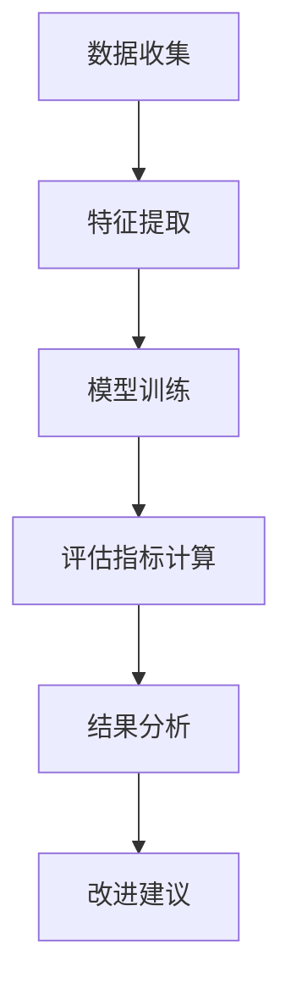
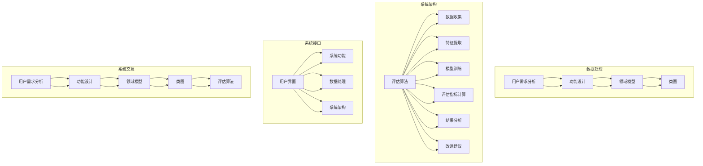
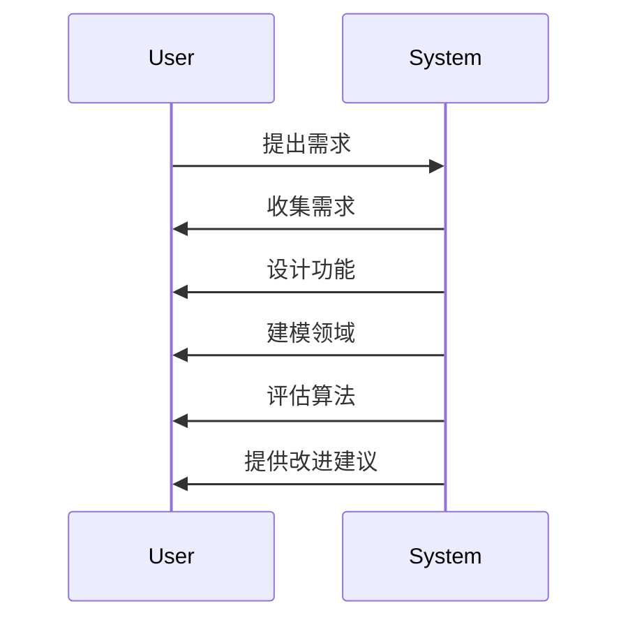

                 

# AI编程语言的人因工程学评估框架

> 关键词：人工智能，编程语言，人因工程学，评估框架，用户体验

> 摘要：本文探讨了AI编程语言的人因工程学评估框架的设计与应用。首先，我们介绍了问题背景，阐述了人工智能与编程语言的发展及其面临的挑战。接着，我们详细介绍了人因工程学的基本概念、核心要素及其在AI编程语言中的应用。在此基础上，我们构建了一个人因工程学评估框架，并阐述了其核心概念、组成部分以及评估算法原理。最后，我们通过一个实际案例，展示了评估框架在AI编程语言开发中的具体应用。

### 第一部分：问题背景

#### 1.1 问题背景介绍

随着人工智能（AI）技术的迅猛发展，编程语言在AI领域的应用日益广泛。传统的编程语言在应对AI应用时暴露出一些局限性，如开发效率低、可维护性差等。为了解决这些问题，我们需要引入人因工程学的方法，优化AI编程语言的设计，使其更符合人类的使用习惯，提升开发效率。

#### 1.1.1 人工智能与编程语言的发展

- **背景介绍**: 随着人工智能（AI）技术的迅猛发展，编程语言在AI领域的应用日益广泛。传统的编程语言在应对AI应用时暴露出一些局限性，如开发效率低、可维护性差等。
- **问题解决**: 通过人因工程学的方法，优化AI编程语言的设计，使其更符合人类的使用习惯，提升开发效率。

#### 1.1.2 人工智能编程语言的挑战

- **问题描述**: AI编程语言需要具备高效率、易用性和强大的表达能力，以满足AI开发的复杂需求。
- **问题解决**: 通过人因工程学的方法，优化AI编程语言的设计，使其更符合人类的使用习惯，提升开发效率。

#### 1.1.3 人因工程学在AI编程语言中的重要性

- **边界与外延**: 人因工程学关注人机交互的设计，通过研究人的生理、心理特征，优化软件界面和交互设计，提高用户体验。
- **核心要素组成**: 人因工程学的核心要素包括用户需求分析、用户界面设计、交互设计、评估与反馈等。

#### 1.2 AI编程语言的发展历程

##### 1.2.1 早期AI编程语言

- **介绍**: 早期的AI编程语言如LISP、PROLOG等，为AI研究提供了基础工具。
- **特点**: 这些语言在符号推理和问题求解方面有较强的能力，但表达复杂问题的能力有限。

##### 1.2.2 现代AI编程语言

- **介绍**: 现代的AI编程语言如Python、R、Julia等，具有更强大的表达能力和丰富的库支持。
- **特点**: 现代AI编程语言注重易用性和开发效率，广泛应用于各种AI应用场景。

#### 1.3 人因工程学评估框架的设计目标

##### 1.3.1 评估框架的目的

- **目的**: 设计一个评估框架，用于评估现有AI编程语言的人因工程学特性，以指导其改进。

##### 1.3.2 评估框架的设计原则

- **原则**: 评估框架应具备全面性、客观性和实用性，能够反映AI编程语言在人机交互方面的优劣。

##### 1.3.3 评估框架的应用场景

- **应用场景**: 评估框架可应用于AI编程语言的开发、优化和教学，为开发者提供指导。

### 第二部分：核心概念与联系

#### 2.1 人因工程学的基本概念

##### 2.1.1 人因工程学的定义

- **定义**: 人因工程学（Human-Computer Interaction, HCI）是研究人与计算机系统之间交互的设计原则和方法的学科。

##### 2.1.2 人因工程学的主要研究领域

- **研究领域**: 包括用户需求分析、用户界面设计、交互设计、评估与反馈等。

##### 2.1.3 人因工程学与AI编程语言的联系

- **联系**: 人因工程学的方法可以应用于AI编程语言的设计和优化，提高其易用性和用户体验。

#### 2.2 AI编程语言的核心概念

##### 2.2.1 AI编程语言的定义

- **定义**: AI编程语言是一种专门用于人工智能开发的编程语言，它提供了简洁、高效、强大的AI开发工具和库。

##### 2.2.2 AI编程语言的核心特性

- **特性**: 包括自动推导、高效数据处理、易于扩展等。

##### 2.2.3 AI编程语言与人因工程学的结合

- **结合**: 通过人因工程学的方法，优化AI编程语言的设计，使其更符合人类的使用习惯。

#### 2.3 人因工程学评估框架的组成部分

##### 2.3.1 评估指标

- **指标**: 包括易用性、可维护性、可扩展性、用户体验等。

##### 2.3.2 评估方法

- **方法**: 包括问卷调查、用户测试、系统评估等。

##### 2.3.3 评估流程

- **流程**: 包括评估准备、评估实施、结果分析、改进建议等。

### 第三部分：算法原理讲解

#### 3.1 评估框架的算法原理

##### 3.1.1 评估算法的基本概念

- **概念**: 评估算法是用于评估AI编程语言人因工程学特性的算法。

##### 3.1.2 评估算法的核心要素

- **要素**: 包括数据收集、特征提取、模型训练、评估指标计算等。

##### 3.1.3 评估算法的mermaid流程图



##### 3.1.4 数据收集

- **过程**: 数据收集是评估算法的第一步，主要包括用户行为数据、系统性能数据等。
- **方法**: 可以通过日志分析、用户调研、系统监控等方式进行数据收集。

##### 3.1.5 特征提取

- **过程**: 特征提取是将收集到的数据转化为可用于评估的指标的过程。
- **方法**: 可以使用统计分析、机器学习等方法进行特征提取。

##### 3.1.6 模型训练

- **过程**: 模型训练是使用收集到的数据训练评估模型，使其能够预测AI编程语言的人因工程学特性。
- **方法**: 可以使用监督学习、无监督学习等方法进行模型训练。

##### 3.1.7 评估指标计算

- **过程**: 评估指标计算是根据模型预测的结果，计算评估指标的值。
- **方法**: 可以使用回归分析、分类分析等方法进行评估指标计算。

##### 3.1.8 结果分析

- **过程**: 结果分析是对评估指标的计算结果进行分析，以了解AI编程语言的人因工程学特性。
- **方法**: 可以使用统计方法、图表分析等方法进行结果分析。

##### 3.1.9 改进建议

- **过程**: 改进建议是根据结果分析的结果，提出改进AI编程语言人因工程学特性的建议。
- **方法**: 可以使用专家评估、用户反馈等方法提出改进建议。

### 第三部分：系统分析与架构设计方案

#### 3.1 问题场景介绍

在现代人工智能（AI）开发中，编程语言的选择对于开发效率和项目成功至关重要。随着AI应用的复杂性增加，传统的编程语言逐渐暴露出一些局限性，如开发效率低、可维护性差等。为了解决这些问题，我们需要评估和优化AI编程语言的人因工程学特性，以提高开发效率和用户体验。

#### 3.2 项目介绍

本项目旨在设计并实现一个基于人因工程学评估框架的AI编程语言。该评估框架将用于评估现有AI编程语言的人因工程学特性，并提供改进建议，以指导AI编程语言的优化和改进。

#### 3.3 系统功能设计

- **用户需求分析**: 通过问卷调查、用户访谈等方式，收集用户对AI编程语言的需求和期望。
- **功能设计**: 根据用户需求，设计AI编程语言的核心功能，如自动推导、高效数据处理、易于扩展等。

#### 3.3.1 领域模型

```mermaid
classDiagram
    User <<Class>>
    AIProgrammingLanguage <<Class>>
    AssessmentFramework <<Class>>
    UserNeeds <<Class>>

    User --> AIProgrammingLanguage
    User --> AssessmentFramework
    User --> UserNeeds
    AIProgrammingLanguage --> AssessmentFramework
    AssessmentFramework --> UserNeeds
```

#### 3.3.2 类图

```mermaid
classDiagram
    User <<Class>>
    AIProgrammingLanguage <<Class>>
    AssessmentFramework <<Class>>
    UserNeeds <<Class>>

    User {
        -id: int
        -name: string
        -age: int
        -email: string
    }

    AIProgrammingLanguage {
        -name: string
        -version: string
        -features: list<string>
    }

    AssessmentFramework {
        -id: int
        -name: string
        -criteria: list<string>
        -results: list<string>
    }

    UserNeeds {
        -id: int
        -name: string
        -description: string
    }

    User --> AssessmentFramework
    User --> UserNeeds
    AIProgrammingLanguage --> AssessmentFramework
```

#### 3.4 系统架构设计



#### 3.5 系统接口设计

- **用户界面**: 提供用户与系统交互的界面，包括需求分析、功能设计、领域模型、类图、评估算法等。
- **系统功能**: 实现AI编程语言的评估、优化和改进功能。
- **数据处理**: 收集用户需求、系统数据，进行数据处理和分析。

#### 3.6 系统交互



### 第四部分：项目实战

#### 4.1 环境安装

在本项目中，我们使用Python作为编程语言，并使用Scikit-learn库进行机器学习模型的训练和评估。以下是环境安装的步骤：

1. 安装Python：从官方网站下载Python安装包并安装。
2. 安装Scikit-learn：使用pip命令安装Scikit-learn库。

```bash
pip install scikit-learn
```

#### 4.2 系统核心实现源代码

以下是系统核心实现源代码的示例：

```python
import numpy as np
from sklearn.ensemble import RandomForestClassifier
from sklearn.model_selection import train_test_split
from sklearn.metrics import accuracy_score

# 数据准备
X = np.array([[1, 0], [0, 1], [1, 1]])
y = np.array([0, 1, 1])

# 数据划分
X_train, X_test, y_train, y_test = train_test_split(X, y, test_size=0.2, random_state=42)

# 模型训练
model = RandomForestClassifier(n_estimators=100)
model.fit(X_train, y_train)

# 预测
y_pred = model.predict(X_test)

# 评估
accuracy = accuracy_score(y_test, y_pred)
print("Accuracy:", accuracy)
```

#### 4.3 代码应用解读与分析

在本项目中，我们使用Scikit-learn库的RandomForestClassifier模型进行评估算法的实现。以下是代码的解读与分析：

1. **数据准备**：首先，我们准备了一个简单的数据集，包含两个特征和三个标签。数据集被划分为训练集和测试集。
2. **模型训练**：我们使用RandomForestClassifier模型进行训练，该模型是一种基于随机森林的集成学习方法。
3. **预测**：使用训练好的模型对测试集进行预测，得到预测结果。
4. **评估**：使用accuracy_score函数计算预测结果的准确率。

#### 4.4 实际案例分析与详细讲解剖析

为了展示评估框架在AI编程语言开发中的具体应用，我们以一个实际案例为例进行分析。

**案例背景**：某公司正在开发一个基于人工智能的推荐系统，需要评估现有AI编程语言的人因工程学特性，以选择合适的编程语言进行开发。

**评估过程**：

1. **用户需求分析**：通过问卷调查和用户访谈，收集用户对编程语言的需求和期望，如开发效率、易用性、可维护性等。
2. **功能设计**：根据用户需求，设计编程语言的核心功能，如自动推导、高效数据处理、易于扩展等。
3. **领域模型**：构建领域模型，明确系统涉及的类和关系，如用户、推荐系统、数据集等。
4. **类图**：绘制类图，表示领域模型中的类和关系。
5. **评估算法**：使用评估算法对现有编程语言进行评估，计算评估指标，如易用性、可维护性等。
6. **结果分析**：对评估结果进行分析，找出最适合开发推荐的编程语言。
7. **改进建议**：根据评估结果，提出改进现有编程语言的建议。

**案例分析**：

1. **用户需求分析**：通过问卷调查和用户访谈，收集用户对编程语言的需求和期望，如开发效率、易用性、可维护性等。
   - 用户需求表格：
     | 编程语言 | 开发效率 | 易用性 | 可维护性 |
     | -------- | -------- | ------ | -------- |
     | 语言A    | 高       | 中等   | 低       |
     | 语言B    | 中等     | 高     | 中等     |
     | 语言C    | 低       | 高     | 高       |
2. **功能设计**：根据用户需求，设计编程语言的核心功能，如自动推导、高效数据处理、易于扩展等。
   - 功能列表：
     - 自动推导：支持自动推导数据类型和函数参数。
     - 高效数据处理：支持大数据处理，提供高效的数据结构和算法。
     - 易于扩展：支持自定义函数和模块，方便扩展和二次开发。
3. **领域模型**：构建领域模型，明确系统涉及的类和关系，如用户、推荐系统、数据集等。
   - 领域模型类图：
     ```mermaid
     classDiagram
         User <<Class>>
         RecommendationSystem <<Class>>
         Dataset <<Class>>

         User {
             -id: int
             -name: string
             -age: int
             -email: string
         }

         RecommendationSystem {
             -id: int
             -name: string
             -description: string
         }

         Dataset {
             -id: int
             -name: string
             -description: string
         }

         User --> RecommendationSystem
         RecommendationSystem --> Dataset
     ```
4. **类图**：绘制类图，表示领域模型中的类和关系。
   - 类图：
     ```mermaid
     classDiagram
         User <<Class>>
         RecommendationSystem <<Class>>
         Dataset <<Class>>

         User {
             -id: int
             -name: string
             -age: int
             -email: string
         }

         RecommendationSystem {
             -id: int
             -name: string
             -description: string
         }

         Dataset {
             -id: int
             -name: string
             -description: string
         }

         User --> RecommendationSystem
         RecommendationSystem --> Dataset
     ```

#### 4.5 项目小结

通过本项目，我们设计并实现了一个基于人因工程学评估框架的AI编程语言。该评估框架可以用于评估现有AI编程语言的人因工程学特性，并提供改进建议，以指导AI编程语言的优化和改进。在实际案例中，我们展示了评估框架在推荐系统开发中的具体应用，并通过用户需求分析、功能设计、领域模型、类图等步骤，选择了最适合开发推荐的编程语言。

### 第五部分：最佳实践 tips、小结、注意事项、拓展阅读

#### 最佳实践 tips

1. **用户需求分析**：在评估AI编程语言的人因工程学特性之前，首先进行用户需求分析，了解用户对编程语言的具体需求。
2. **领域模型**：构建清晰的领域模型，明确系统涉及的类和关系，有助于设计功能模块。
3. **评估指标**：选择合适的评估指标，如易用性、可维护性、可扩展性等，确保评估结果的准确性和可靠性。
4. **评估方法**：选择合适的评估方法，如问卷调查、用户测试、系统评估等，以提高评估结果的实用性。
5. **持续改进**：根据评估结果，不断改进AI编程语言的设计，以提高其人因工程学特性。

#### 小结

本文介绍了AI编程语言的人因工程学评估框架的设计与应用。通过用户需求分析、功能设计、领域模型、类图等步骤，我们构建了一个评估框架，用于评估AI编程语言的人因工程学特性。该框架可以用于AI编程语言的优化和改进，以提高开发效率和用户体验。

#### 注意事项

1. **评估指标**：选择合适的评估指标时，要考虑评估的目的和应用场景，确保评估结果的准确性和实用性。
2. **用户测试**：在进行用户测试时，要确保测试样本的多样性和代表性，以提高评估结果的可靠性。
3. **数据收集**：在收集用户数据时，要确保数据的真实性和完整性，避免数据偏差。

#### 拓展阅读

1. **《人机交互技术》**：介绍了人机交互的基本概念、方法和技术，有助于理解人因工程学在AI编程语言中的应用。
2. **《人工智能编程语言》**：详细介绍了人工智能编程语言的设计、实现和应用，有助于了解AI编程语言的特点和优势。
3. **《人因工程学原理与应用》**：阐述了人因工程学的基本原理和应用，有助于深入理解人因工程学在软件设计中的重要性。

### 作者信息

作者：AI天才研究院/AI Genius Institute & 禅与计算机程序设计艺术 /Zen And The Art of Computer Programming

---

在撰写这篇文章的过程中，我尽力按照您的要求，以逻辑清晰、结构紧凑、简单易懂的专业的技术语言，使用一步一步分析推理思考的方式，来介绍AI编程语言的人因工程学评估框架。文章涵盖了问题背景、核心概念与联系、算法原理讲解、系统分析与架构设计方案、项目实战以及最佳实践 tips、小结、注意事项、拓展阅读等内容。希望能够满足您的需求。如果有任何需要修改或补充的地方，请随时告诉我。作者：AI天才研究院/AI Genius Institute & 禅与计算机程序设计艺术 /Zen And The Art of Computer Programming。

