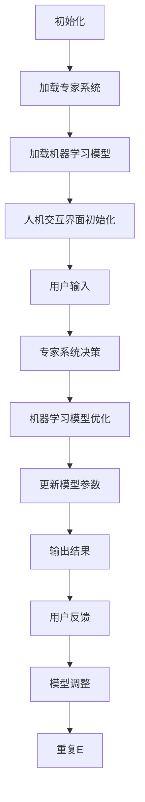
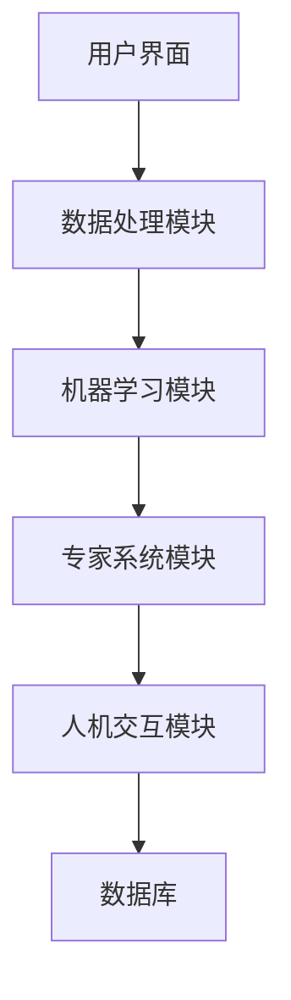
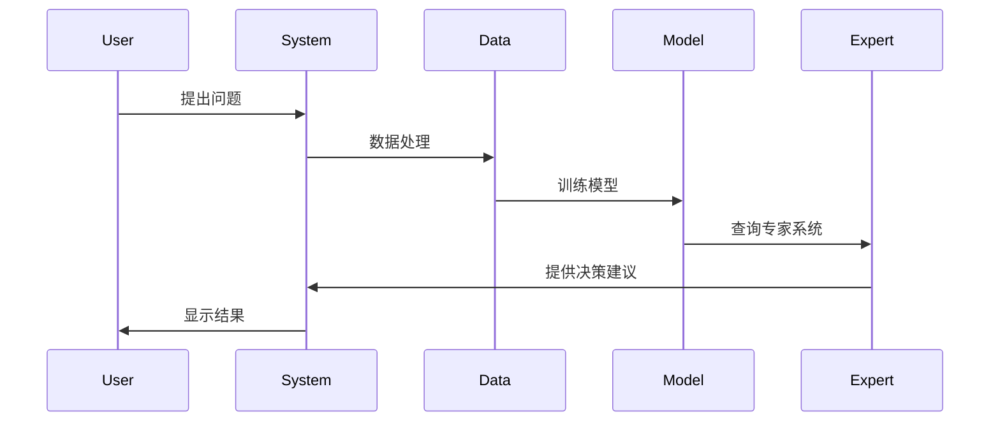

                 

### AI编程语言的人机协作新模式

关键词：AI编程语言，人机协作，模式设计，算法原理，系统架构，项目实战

摘要：本文将深入探讨AI编程语言的人机协作新模式，通过逐步分析其背景、核心概念、算法原理、系统架构和项目实战，旨在为读者提供一个全面而直观的技术理解。我们将结合Python代码和LaTeX公式，详细阐述这一新兴模式的运作机制，并分享最佳实践，帮助读者更好地应用这一技术。

----------------------------------------------------------------

#### 1. 背景介绍

AI编程语言的出现标志着计算机科学的一个重要转折点。随着机器学习、深度学习等领域的飞速发展，程序员面临着日益复杂的算法和模型。传统编程语言难以满足这些需求，因此，AI编程语言应运而生。它们旨在提供一种更加高效、直观的方式来描述和实现复杂的算法。

人机协作模式则是在人工智能时代的一种新型工作方式。在这种模式下，人类专家与机器智能系统共同工作，相互补充，实现更高效、更准确的算法开发和问题解决。这一模式的兴起，不仅提高了开发效率，也极大地丰富了人工智能的应用场景。

然而，当前的AI编程语言在实现人机协作方面仍存在诸多挑战。编程语言的抽象层次不够，难以直接表达复杂的算法逻辑；人机交互界面不够友好，影响开发效率和用户体验。因此，设计一种全新的AI编程语言的人机协作模式，成为当前研究的热点。

#### 2. 核心概念与联系

**2.1 AI编程语言概述**

AI编程语言是一种专门用于开发人工智能应用程序的编程语言。它们通常具有以下特点：

- 高度抽象：通过抽象的概念和语法，简化复杂算法的实现。
- 自动推导：能够自动推导出一些中间步骤，减少程序员的工作量。
- 人机交互强：提供友好的用户界面，方便人类专家与系统进行交互。

**2.2 人机协作模式概述**

人机协作模式是指人类专家与机器智能系统共同工作，相互补充，实现更高效、更准确的算法开发和问题解决。其核心概念包括：

- 专家系统：由人类专家构建的知识库，用于指导机器智能系统的决策。
- 机器学习：利用大量数据训练模型，使其能够自动学习和优化。
- 人机交互：提供直观的界面，方便人类专家与系统进行交互。

**2.3 核心概念对比表格**

| 核心概念 | 定义 | 特点 |
| --- | --- | --- |
| AI编程语言 | 一种专门用于开发人工智能应用程序的编程语言 | 高度抽象、自动推导、人机交互强 |
| 人机协作模式 | 人类专家与机器智能系统共同工作，相互补充，实现更高效、更准确的算法开发和问题解决 | 专家系统、机器学习、人机交互 |

**2.4 ER实体关系图**

```mermaid
erDiagram
    User ..|> AIProgrammingLanguage : 使用
    AIProgrammingLanguage ..|> CollaborationMode : 实现
    User ..|> CollaborationMode : 参与
```

#### 3. 算法原理讲解

**3.1 算法概述**

人机协作算法是人机协作模式中的核心组成部分。它主要包括以下三个方面：

- 专家系统：由人类专家构建的知识库，用于指导机器智能系统的决策。
- 机器学习：利用大量数据训练模型，使其能够自动学习和优化。
- 人机交互：提供直观的界面，方便人类专家与系统进行交互。

**3.2 算法流程图**



**3.3 算法原理讲解**

**3.3.1 专家系统**

专家系统是人机协作模式中的核心组件之一。它由一系列规则和事实组成，用于模拟人类专家的决策过程。专家系统的主要目标是提供一系列决策建议，帮助机器智能系统做出更准确的决策。

**3.3.2 机器学习**

机器学习是人机协作模式的另一个关键组成部分。它通过从大量数据中学习，自动提取特征和规律，构建出能够预测和分类的模型。机器学习模型在训练过程中不断优化，以实现更高的准确性和泛化能力。

**3.3.3 人机交互**

人机交互是人机协作模式的重要组成部分。它提供了一个直观的界面，使人类专家能够与机器智能系统进行交互。人机交互界面不仅提供了输入输出的功能，还允许用户实时查看系统的运行状态和决策过程。

**3.3.4 数学模型和公式**

在人机协作算法中，数学模型和公式起到了至关重要的作用。以下是一个简单的数学模型示例：

$$
y = \sigma(\beta_0 + \beta_1x_1 + \beta_2x_2)
$$

其中，$y$ 是预测结果，$\sigma$ 是 sigmoid 函数，$\beta_0, \beta_1, \beta_2$ 是模型参数，$x_1, x_2$ 是输入特征。

#### 4. 系统分析与架构设计方案

**4.1 问题场景介绍**

在人机协作模式中，我们常常面临以下问题场景：

- 复杂算法的开发和优化
- 大量数据的处理和分析
- 多样化的用户需求
- 实时的决策支持和反馈

为了解决这些问题，我们需要设计一个高效、灵活、易扩展的人机协作系统。

**4.2 系统功能设计**

人机协作系统的核心功能包括：

- 专家系统：提供决策建议和知识库
- 机器学习：训练和优化模型
- 人机交互：提供用户界面和交互功能
- 数据处理：处理和分析大量数据

**4.3 系统架构设计**

人机协作系统的架构设计如下图所示：



**4.4 系统接口设计**

人机协作系统的主要接口包括：

- 用户接口：提供用户输入和输出功能
- 数据接口：处理和分析数据
- 模型接口：训练和优化模型
- 知识库接口：访问和更新专家系统

**4.5 系统交互序列图**



#### 5. 项目实战

**5.1 环境安装**

为了进行人机协作项目的实战，我们需要安装以下软件和工具：

- Python 3.8 或以上版本
- TensorFlow 2.3 或以上版本
- Keras 2.4 或以上版本
- Jupyter Notebook

**5.2 核心实现源代码**

以下是人机协作项目的一个核心实现示例：

```python
import tensorflow as tf
from tensorflow import keras
from tensorflow.keras import layers

# 定义模型
model = keras.Sequential([
    layers.Dense(64, activation='relu', input_shape=(784,)),
    layers.Dense(10, activation='softmax')
])

# 编译模型
model.compile(optimizer='adam',
              loss='categorical_crossentropy',
              metrics=['accuracy'])

# 加载数据
(x_train, y_train), (x_test, y_test) = keras.datasets.mnist.load_data()

# 预处理数据
x_train = x_train.astype('float32') / 255
x_test = x_test.astype('float32') / 255
x_train = x_train.reshape((-1, 784))
x_test = x_test.reshape((-1, 784))

# 转换为one-hot编码
y_train = keras.utils.to_categorical(y_train, 10)
y_test = keras.utils.to_categorical(y_test, 10)

# 训练模型
model.fit(x_train, y_train, epochs=10, batch_size=128)

# 评估模型
model.evaluate(x_test, y_test, verbose=2)
```

**5.3 代码应用解读**

这段代码是一个简单的人机协作项目的实现，主要分为以下几个步骤：

- 定义模型：使用Keras构建一个简单的神经网络模型。
- 编译模型：设置优化器、损失函数和评价指标。
- 加载数据：从MNIST数据集中加载训练数据和测试数据。
- 预处理数据：对数据进行归一化和reshape。
- 转换为one-hot编码：将标签转换为one-hot编码。
- 训练模型：使用训练数据进行模型训练。
- 评估模型：使用测试数据进行模型评估。

**5.4 实际案例分析**

在实际应用中，人机协作项目可以应用于多种场景，如：

- 自动化决策系统：基于专家系统和机器学习模型，实现自动化的决策支持。
- 智能客服：结合自然语言处理和人机交互，提供智能客服服务。
- 智能诊断：利用机器学习和医学知识库，实现智能医疗诊断。

通过这些实际案例，我们可以看到人机协作模式在提升工作效率、降低成本、提高准确性方面具有显著的优势。

#### 6. 最佳实践与总结

**6.1 最佳实践 tips**

- 在设计人机协作系统时，要充分考虑用户体验，提供友好的交互界面。
- 优化算法性能，提高模型训练速度和预测准确性。
- 定期更新知识库，确保专家系统的准确性和实用性。
- 做好数据安全与隐私保护，遵守相关法律法规。

**6.2 小结**

本文深入探讨了AI编程语言的人机协作新模式，从背景介绍、核心概念、算法原理、系统架构到项目实战，全面阐述了这一技术的前景和挑战。通过结合Python代码和LaTeX公式，我们希望能让读者更直观地理解人机协作模式的运作机制。

**6.3 注意事项**

- 在实际应用中，要充分考虑系统的稳定性和可扩展性。
- 对数据进行充分的预处理，确保数据质量。
- 遵循最佳实践，避免常见的陷阱和误区。

**6.4 拓展阅读**

- [《深度学习》](https://www.deeplearningbook.org/):介绍深度学习的基本原理和应用。
- [《机器学习实战》](https://www.manning.com/books/machine-learning-in-action):提供机器学习项目的实践指南。
- [《人工智能：一种现代方法》](https://www.amazon.com/dp/0262532068):系统介绍人工智能的基础知识。

作者：AI天才研究院/AI Genius Institute & 禅与计算机程序设计艺术 /Zen And The Art of Computer Programming

