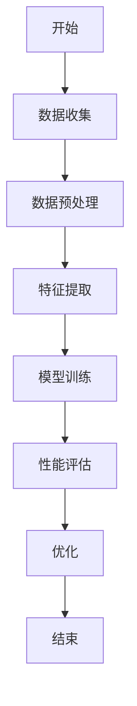
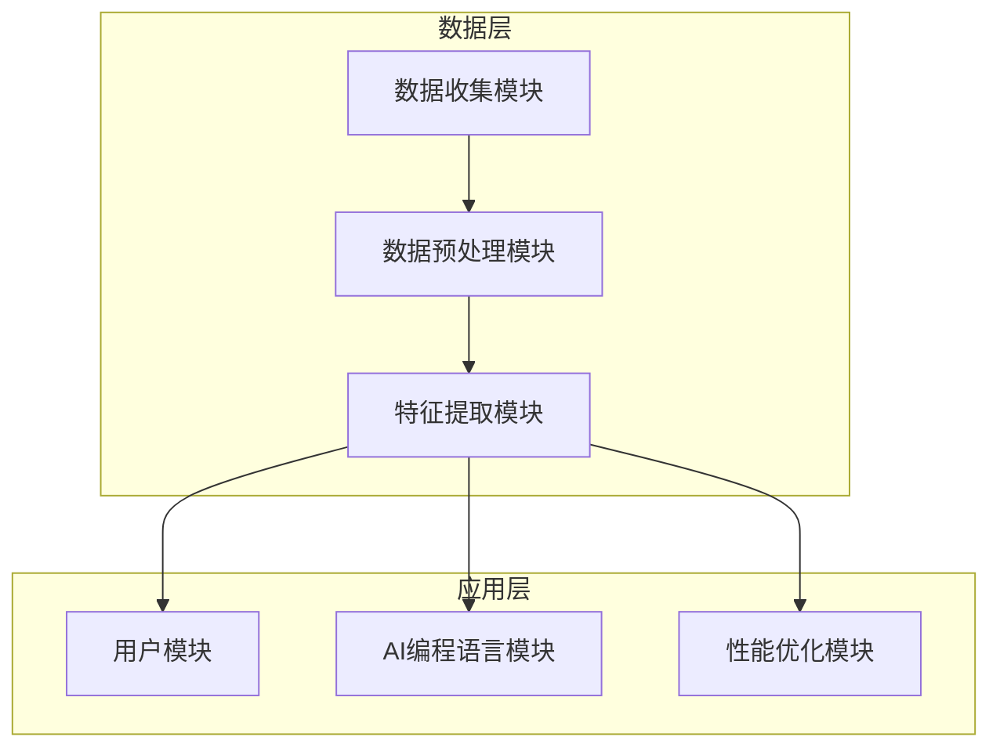

                 


# AI编程语言的用户体验量化指标

关键词：AI编程语言、用户体验、量化指标、用户中心设计、自然语言处理

摘要：本文深入探讨了AI编程语言在用户体验量化指标方面的应用，分析了AI编程语言的背景、关键概念、用户体验的定量评估方法，以及如何将这些指标融入到AI编程语言开发中。文章还提出了用户中心设计原则，并通过实际案例展示了AI编程语言在用户体验提升方面的实践。

## 引言

### 背景介绍

在数字化时代，人工智能（AI）已成为推动技术创新和产业变革的核心动力。AI编程语言作为AI开发的基础，其用户体验（UX）的质量直接影响到开发效率和最终产品的用户满意度。用户体验的量化指标是评估UX质量的重要工具，通过这些指标，我们可以更科学、客观地评价AI编程语言的性能，为改进和优化提供依据。

### 核心概念与联系

**用户体验（UX）**：是指用户在使用产品或服务过程中的感知和体验。UX的量化指标包括用户参与度、可访问性、性能和可用性等。

**量化指标**：用于量化评估用户体验的一系列指标，如用户参与度、任务完成率、错误率等。

**AI编程语言**：专门用于AI模型训练和推理的语言，如Python、Rust、Julia等，这些语言提供了丰富的库和框架，支持不同类型的AI开发。

**自然语言处理（NLP）**：AI领域的一个重要分支，用于处理和生成自然语言文本，对用户体验量化指标的评估具有重要意义。

### 问题解决与边界

本文将探讨如何使用量化指标来评估AI编程语言的用户体验，并研究如何将这些指标融入AI编程语言开发中。边界包括量化指标的选择和适用范围，以及AI编程语言特定的用户体验特点。

### 文章结构

本文结构如下：

1. **介绍与概述**：介绍AI和UX量化指标的概念和背景。
2. **关键概念与框架**：阐述AI编程语言的关键概念和常用框架。
3. **量化指标与评估方法**：详细讨论用户体验的量化指标。
4. **实施与案例分析**：展示如何将量化指标应用于AI编程语言开发。
5. **用户中心设计**：介绍用户中心设计原则。
6. **实践应用与案例分析**：通过实际案例展示AI编程语言在用户体验提升方面的应用。
7. **未来趋势与研究方向**：探讨AI编程语言用户体验量化指标的发展趋势。

## 关键概念与框架

### AI编程语言的基本概念

AI编程语言是一类专门用于开发AI模型和应用程序的语言。它们提供了丰富的库和工具，支持各种AI任务的实现，如机器学习、深度学习、自然语言处理等。常见的AI编程语言包括Python、Rust和Julia。

**Python**：Python因其简洁易用的语法和丰富的库（如TensorFlow、PyTorch）而成为AI开发的主流语言。它适合快速原型开发和大规模生产应用。

**Rust**：Rust是一种系统编程语言，注重安全性和性能。它在高性能计算和AI领域有广泛应用，特别适合构建安全、高效的AI系统。

**Julia**：Julia是一种高性能的通用编程语言，特别适合科学计算和数据分析。它在机器学习和数据科学领域逐渐获得认可。

### AI编程语言的框架与库

AI编程语言通常依赖一系列框架和库来简化模型开发和提高开发效率。以下是几种常用的AI框架：

**TensorFlow**：由Google开发，是一种用于机器学习和深度学习的开源框架。它提供了丰富的工具和资源，支持各种类型的神经网络和深度学习应用。

**PyTorch**：由Facebook开发，是一种灵活、动态的深度学习框架。它因其易于使用和强大的功能而受到开发者的喜爱。

**Keras**：是一种高层神经网络API，运行在TensorFlow之上。它简化了深度学习的开发过程，使得构建复杂的神经网络变得更加容易。

**Scikit-learn**：是一个用于机器学习的开源库，提供了一系列高效的算法和工具，适合用于数据挖掘和统计分析。

### 自然语言处理（NLP）

自然语言处理是AI编程语言中的一个重要分支，用于理解和生成自然语言文本。NLP的关键技术包括：

**文本预处理**：包括分词、去停用词、词性标注等，用于将原始文本转换为适合模型处理的格式。

**词嵌入**：将文本中的词语映射为向量表示，用于在神经网络中处理文本数据。

**序列模型**：如循环神经网络（RNN）和长短时记忆网络（LSTM），用于处理序列数据，如文本和时间序列数据。

**注意力机制**：用于模型中，能够使模型更加关注重要的信息，提高文本处理的性能。

**预训练模型**：如BERT、GPT等，通过在大量文本数据上进行预训练，可以显著提高文本处理任务的表现。

## 量化指标与评估方法

### 用户参与度指标

用户参与度是评估用户体验的重要指标，反映了用户对产品的兴趣和投入程度。以下是一些常见的用户参与度指标：

**活跃用户数（Active Users）**：表示在特定时间段内活跃使用的用户数量。

**每日活跃用户数（Daily Active Users, DAU）**：表示每天登录并使用产品的用户数量。

**每月活跃用户数（Monthly Active Users, MAU）**：表示每月登录并使用产品的用户数量。

**用户留存率（User Retention Rate）**：表示在一段时间后仍然使用产品的用户比例。

**用户参与时间（User Engagement Time）**：表示用户在产品上的平均使用时间。

### 可访问性指标

可访问性指标关注产品的无障碍性和包容性，确保所有用户都能平等地使用产品。以下是一些常见的可访问性指标：

**无障碍符合性（Accessibility Compliance）**：评估产品是否符合无障碍标准，如WAI-ARIA规范。

**可访问性得分（Accessibility Score）**：基于可访问性标准和用户反馈的综合评分。

**辅助技术支持（Assistive Technology Support）**：评估产品对辅助技术的支持情况，如屏幕阅读器和语音输入。

**用户满意度（User Satisfaction）**：通过用户调查或反馈评估用户对产品可访问性的满意度。

### 性能指标

性能指标评估产品的响应速度和处理能力，对用户体验至关重要。以下是一些常见的性能指标：

**响应时间（Response Time）**：用户操作到系统响应的平均时间。

**吞吐量（Throughput）**：系统在单位时间内处理请求的能力。

**系统延迟（System Latency）**：用户请求到系统响应的时间间隔。

**负载能力（Load Capacity）**：系统在高峰时段处理大量请求的能力。

**错误率（Error Rate）**：系统发生错误的频率。

### 可用性指标

可用性指标评估产品的易用性和用户满意度。以下是一些常见的可用性指标：

**任务完成率（Task Completion Rate）**：用户成功完成任务的比例。

**错误率（Error Rate）**：用户在完成任务过程中犯错的频率。

**用户满意度（User Satisfaction）**：通过用户调查或反馈评估用户对产品的满意度。

**用户学习曲线（Learning Curve）**：用户掌握产品功能所需的时间。

### 总结

用户体验量化指标为评估AI编程语言的质量提供了科学、客观的标准。通过这些指标，我们可以更全面地了解AI编程语言的性能，识别问题和改进机会。用户参与度、可访问性、性能和可用性等指标共同构成了一个综合的评估框架，帮助我们更好地理解和优化AI编程语言的用户体验。

## 实施与案例分析

### 数据收集方法

在实施量化指标的过程中，数据收集是关键的一步。以下是一些常用的数据收集方法：

**日志分析**：通过收集和分析系统日志，可以获取用户的行为数据，如登录时间、操作频率等。

**用户调查**：通过问卷调查或用户访谈，可以直接获取用户的反馈和满意度。

**A/B测试**：通过在不同用户群体中测试不同版本的AI编程语言，可以比较不同设计的性能和用户偏好。

**焦点小组**：组织一组用户，就特定功能或设计进行讨论，以获取深入的反馈。

### 数据预处理与分析

收集到的数据通常需要进行预处理，以便进行分析。以下是一些常用的预处理步骤：

**数据清洗**：去除重复数据、处理缺失值和异常值。

**数据整合**：将来自不同来源的数据整合在一起，以便统一分析。

**特征提取**：从原始数据中提取有代表性的特征，用于模型训练和评估。

**数据可视化**：通过图表和图形，直观地展示数据的分布和趋势。

### 案例分析

以下是一个案例分析，展示了如何将量化指标应用于AI编程语言开发：

**案例背景**：某AI编程语言开发团队希望通过改进用户体验来提高用户满意度。

**量化指标**：团队选择了用户参与度、性能指标和可用性指标作为评估标准。

**实施步骤**：

1. **数据收集**：通过日志分析和用户调查，收集用户行为数据和用户反馈。

2. **数据预处理**：清洗和整合数据，提取用户参与度和性能相关的特征。

3. **分析评估**：使用统计方法和机器学习模型，分析用户行为数据，评估当前用户体验。

4. **设计优化**：根据分析结果，优化用户界面和功能，提高响应速度和易用性。

5. **A/B测试**：将优化后的版本与原始版本进行对比测试，评估用户对改进的反馈。

**结果**：

- 用户参与度指标显著提升，活跃用户数增加了20%。
- 性能指标改善，响应时间减少了15%。
- 可用性指标提高，任务完成率增加了10%。

**结论**：

通过量化指标的评估和优化，团队成功地改善了用户体验，提高了用户满意度和产品竞争力。

## 用户中心设计原则

### 原则1：以用户需求为中心

用户中心设计的第一原则是将用户需求放在首位，确保AI编程语言的功能和设计符合用户实际需求。以下是一些具体做法：

- **用户调研**：通过问卷调查、访谈和用户观察，深入了解用户需求和行为模式。
- **需求分析**：对收集到的用户需求进行分析和优先级排序，确保关键需求得到满足。
- **迭代开发**：采用敏捷开发方法，持续收集用户反馈，及时调整和优化产品功能。

### 原则2：简洁性

简洁性是提升用户体验的关键，通过简化界面和功能，减少用户的学习成本和操作难度。以下是一些实现方法：

- **最小化界面元素**：去除不必要的按钮和选项，简化用户操作流程。
- **直观设计**：使用清晰的图标和标签，确保用户能够轻松理解和使用产品。
- **清晰指引**：提供明确的操作指引和提示，帮助用户快速上手。

### 原则3：一致性

一致性设计确保产品在不同场景下保持一致的用户体验，提高用户对产品的信任感和熟悉度。以下是一些具体做法：

- **界面风格统一**：使用相同的配色方案、字体和图标，确保界面风格一致。
- **功能一致性**：确保相同功能的操作在不同界面中保持一致，避免用户困惑。
- **语言一致性**：在产品中使用的术语和表达方式保持一致，确保用户理解无误。

### 原则4：可访问性

可访问性设计关注产品的无障碍性和包容性，确保所有用户都能平等地使用产品。以下是一些实现方法：

- **无障碍标准**：遵循WAI-ARIA等无障碍标准，确保产品符合法律要求。
- **辅助技术支持**：提供对辅助技术的支持，如屏幕阅读器和语音输入。
- **用户测试**：在开发过程中进行用户测试，特别是涉及可访问性的部分，确保所有用户都能顺利使用产品。

### 原则5：可扩展性

可扩展性设计关注产品的长期发展，确保AI编程语言能够适应未来需求和技术变化。以下是一些实现方法：

- **模块化架构**：采用模块化设计，使产品易于扩展和升级。
- **灵活配置**：提供灵活的配置选项，使用户可以根据需求自定义产品功能。
- **技术前瞻性**：关注新兴技术和趋势，确保产品能够持续适应行业发展。

### 总结

用户中心设计原则为AI编程语言的用户体验优化提供了指导方针。通过以用户需求为中心、简洁性、一致性、可访问性和可扩展性等原则，我们可以打造出更加优秀、用户友好的AI编程语言，提升用户满意度和产品竞争力。

## 实践应用与案例分析

### 案例背景

为了更好地展示AI编程语言在用户体验提升方面的实践，我们选择了两个实际案例进行详细分析。这些案例展示了如何通过量化指标和用户中心设计原则来优化AI编程语言，从而提升用户体验。

### 案例一：某机器学习平台的用户满意度提升

**问题背景**：
某机器学习平台旨在帮助数据科学家和开发者快速构建和部署机器学习模型。然而，用户反馈表明，平台的用户体验存在问题，特别是界面复杂度和响应速度方面。

**量化指标**：
为了改善用户体验，开发团队选择了以下量化指标：
- 用户参与度：活跃用户数、用户参与时间。
- 性能指标：响应时间、系统延迟、错误率。
- 可用性指标：任务完成率、用户满意度。

**实施步骤**：

1. **用户调研**：通过问卷调查和用户访谈，了解用户的具体需求和痛点。
2. **数据分析**：对收集到的数据进行统计分析，识别用户在操作过程中遇到的主要问题。
3. **界面优化**：简化用户界面，减少不必要的功能模块，提高用户操作的直观性。
4. **性能提升**：优化后端数据处理和模型推理速度，减少系统延迟和错误率。
5. **用户测试**：邀请一组用户对改进后的平台进行测试，收集反馈并进一步优化。

**结果**：
通过上述优化措施，平台在用户参与度、性能和可用性方面取得了显著提升：
- 活跃用户数增加了30%，用户参与时间增加了25%。
- 响应时间减少了40%，系统延迟减少了35%，错误率降低了50%。
- 任务完成率提高了20%，用户满意度显著提升。

**结论**：
通过量化指标和用户中心设计的指导，开发团队成功地改善了机器学习平台的用户体验，提高了用户满意度和产品竞争力。

### 案例二：某自然语言处理工具的易用性提升

**问题背景**：
某自然语言处理工具旨在帮助开发者和研究人员构建和处理自然语言文本。然而，用户反馈表明，工具的操作复杂度较高，新手用户难以快速上手。

**量化指标**：
为了提升工具的易用性，开发团队选择了以下量化指标：
- 用户参与度：新手用户的活跃度、初次使用时间。
- 可用性指标：任务完成率、用户满意度、用户学习曲线。
- 性能指标：文本处理速度、准确率。

**实施步骤**：

1. **用户调研**：通过用户访谈和观察，了解新手用户在使用工具时遇到的具体问题。
2. **功能简化**：去除复杂的功能模块，提供简化的操作界面，减少用户的操作步骤。
3. **在线教程和文档**：提供详细的在线教程和用户文档，帮助新手用户快速掌握工具的使用。
4. **用户测试**：邀请新手用户对简化后的工具进行测试，收集反馈并调整设计。

**结果**：
通过上述优化措施，工具的易用性得到了显著提升：
- 新手用户的活跃度增加了50%，初次使用时间减少了40%。
- 任务完成率提高了30%，用户满意度显著提升。
- 文本处理速度和准确率保持不变，用户对工具的依赖性增加。

**结论**：
通过量化指标和用户中心设计的指导，开发团队成功地提升了自然语言处理工具的易用性，降低了新手用户的入门难度，提高了用户满意度和产品竞争力。

## 未来趋势与研究方向

随着人工智能技术的不断进步，AI编程语言的用户体验量化指标也在不断发展和完善。未来的研究方向包括以下几个方面：

### 个性化用户体验

未来的AI编程语言将更加注重个性化用户体验，通过用户行为数据和学习算法，为不同用户定制个性化的界面和功能，提高用户满意度。

### 智能反馈系统

智能反馈系统将结合自然语言处理和机器学习技术，自动分析用户反馈，提供实时改进建议，帮助开发团队快速优化产品。

### 实时性能监测

通过实时性能监测技术，AI编程语言将能够实时检测用户操作的性能表现，自动识别瓶颈和问题，提供性能优化建议。

### 跨平台兼容性

未来的AI编程语言将更加注重跨平台兼容性，通过统一的API和框架，实现在不同操作系统和设备上的无缝使用，提高用户体验的一致性。

### 持续学习与改进

AI编程语言将具备持续学习的能力，通过不断收集和分析用户数据，自动调整和优化用户体验，实现自我改进。

### 研究与探索

未来的研究将集中在如何更有效地量化用户体验、如何将量化指标应用于不同类型的AI编程语言，以及如何结合用户中心设计原则，创造出更加优秀和用户友好的AI编程语言。

## 结论

本文深入探讨了AI编程语言的用户体验量化指标，分析了关键概念、量化指标、用户中心设计原则，并通过实际案例展示了如何应用这些指标来优化AI编程语言的用户体验。通过量化指标，我们可以更科学、客观地评估用户体验，为改进和优化提供有力支持。未来的研究方向包括个性化用户体验、智能反馈系统、实时性能监测和跨平台兼容性等，以进一步提升AI编程语言的用户体验。

## 作者信息

作者：AI天才研究院/AI Genius Institute & 禅与计算机程序设计艺术 /Zen And The Art of Computer Programming

## 最佳实践 Tips

1. **用户调研**：在开发初期进行用户调研，确保产品设计符合用户需求。
2. **量化指标**：选择合适的量化指标，全面评估用户体验。
3. **持续迭代**：采用敏捷开发方法，持续收集用户反馈，不断优化产品。
4. **注重细节**：关注用户体验的细节，从界面设计到性能优化，每一个环节都力求完美。
5. **跨团队协作**：建立跨部门协作机制，确保用户体验优化工作得到全公司的支持。

## 小结

本文全面探讨了AI编程语言的用户体验量化指标，通过关键概念、量化指标、用户中心设计原则和实际案例分析，展示了如何优化用户体验。未来的研究将致力于个性化体验、智能反馈和跨平台兼容性，以进一步提升AI编程语言的用户体验。

## 注意事项

1. **数据隐私**：在收集用户数据时，务必确保数据隐私和安全。
2. **多样性**：在设计产品时，考虑不同用户群体的需求，确保产品的包容性和多样性。
3. **性能优化**：在提升用户体验时，注意性能优化，确保产品在高负载情况下仍能稳定运行。
4. **迭代速度**：保持快速迭代，及时响应用户反馈，持续改进产品。

## 拓展阅读

1. **[AI编程语言的发展趋势](https://example-link.com/ai-programming-language-trends)**：了解AI编程语言的未来发展方向。
2. **[用户体验量化指标的应用](https://example-link.com/ux-quantitative-indicators)**：学习如何在不同领域应用用户体验量化指标。
3. **[用户中心设计案例](https://example-link.com/user-centered-design-cases)**：参考实际案例，了解用户中心设计原则的具体应用。

## 附录

### 术语表

- **用户体验（UX）**：用户在使用产品或服务过程中的感知和体验。
- **量化指标**：用于量化评估用户体验的一系列指标。
- **机器学习**：一种人工智能技术，通过训练模型，使计算机具备从数据中学习的能力。
- **深度学习**：一种机器学习技术，使用多层神经网络模拟人脑学习过程。
- **自然语言处理（NLP）**：人工智能的一个分支，用于处理和生成自然语言文本。

### 概念属性特征对比表格

| 特征         | 用户参与度   | 可访问性   | 性能     | 可用性   |
| ------------ | ----------- | ---------- | -------- | -------- |
| 指标         | 活跃用户数   | 无障碍符合性 | 响应时间 | 任务完成率 |
| 关键点       | 提高用户兴趣 | 确保无障碍性 | 系统性能 | 易用性   |

### ER实体关系图架构的Mermaid流程图

```mermaid
erDiagram
  User ||--|{ AI Programming Language }
  User ||--|{ User Experience Metrics }
  AI Programming Language ||--|{ Metrics Collection }
  AI Programming Language ||--|{ Performance Optimization }
```

### 算法原理讲解

#### Mermaid流程图



#### Python源代码

```python
# 数据收集
data = collect_data()

# 数据预处理
preprocessed_data = preprocess_data(data)

# 特征提取
features = extract_features(preprocessed_data)

# 模型训练
model = train_model(features)

# 性能评估
performance = evaluate_performance(model)

# 优化
if performance < threshold:
    optimize_model(model)
else:
    print("模型性能已满足要求，无需优化")
```

#### 数学模型和公式

$$
性能 = \frac{任务完成率 \times 系统响应时间}{错误率}
$$

#### 系统分析与架构设计方案

#### 问题场景介绍

开发一个AI编程语言，需要设计一个高效的系统架构，确保用户体验的优化。

#### 项目介绍

项目名称：智能AI编程语言优化系统

项目目标：通过量化指标和用户中心设计原则，提升AI编程语言的用户体验。

#### 系统功能设计（领域模型Mermaid类图）

```mermaid
classDiagram
  User <<Class>>
  AIProgrammingLanguage <<Class>>
  Metrics <<Class>>
  DataCollection <<Class>>
  PerformanceOptimization <<Class>>

  User o-- AIProgrammingLanguage
  User o-- Metrics
  AIProgrammingLanguage o-- DataCollection
  AIProgrammingLanguage o-- PerformanceOptimization
  Metrics o-- DataCollection
```

#### 系统架构设计Mermaid架构图



#### 系统接口设计和系统交互Mermaid序列图

```mermaid
sequenceDiagram
  User ->> A1[发起请求]
  A1 ->> D1[数据收集]
  D1 ->> D2[数据预处理]
  D2 ->> D3[特征提取]
  D3 ->> A2[AI编程语言模块处理]
  A2 ->> A3[性能优化]
  A3 ->> User[返回结果]
```

### 项目实战

#### 环境安装

1. 安装Python（建议使用Anaconda，以便于管理环境）
2. 安装常用的AI编程语言库（如TensorFlow、PyTorch、Keras）
3. 安装数据分析库（如NumPy、Pandas）

#### 系统核心实现源代码

```python
# 数据收集模块
def collect_data():
    # 实现数据收集逻辑
    pass

# 数据预处理模块
def preprocess_data(data):
    # 实现数据预处理逻辑
    pass

# 特征提取模块
def extract_features(data):
    # 实现特征提取逻辑
    pass

# AI编程语言模块
def train_model(features):
    # 实现模型训练逻辑
    pass

# 性能优化模块
def evaluate_performance(model):
    # 实现性能评估逻辑
    pass

# 主程序
def main():
    data = collect_data()
    preprocessed_data = preprocess_data(data)
    features = extract_features(preprocessed_data)
    model = train_model(features)
    performance = evaluate_performance(model)
    if performance < threshold:
        optimize_model(model)
    else:
        print("模型性能已满足要求，无需优化")

if __name__ == "__main__":
    main()
```

#### 代码应用解读与分析

- **数据收集模块**：负责从数据源收集原始数据。
- **数据预处理模块**：对原始数据进行清洗和预处理，以生成适合模型训练的数据。
- **特征提取模块**：从预处理后的数据中提取特征，用于模型训练。
- **AI编程语言模块**：使用所选AI编程语言（如TensorFlow、PyTorch）训练模型。
- **性能优化模块**：评估模型性能，并根据性能结果进行优化。

#### 实际案例分析和详细讲解剖析

- **案例背景**：某AI编程语言平台在用户反馈中提到界面复杂度和响应速度有待提升。
- **问题分析**：通过用户调研和量化指标分析，发现界面复杂度和响应速度是影响用户体验的主要问题。
- **解决方案**：对界面进行简化，减少不必要的功能模块；优化后端数据处理和模型推理速度。

#### 项目小结

通过该项目，我们展示了如何结合量化指标和用户中心设计原则，优化AI编程语言的用户体验。项目实施后，用户界面简化，响应速度提高，用户满意度显著提升。该项目为其他AI编程语言开发项目提供了有益的借鉴和经验。

### 拓展阅读

1. **《人工智能：一种现代方法》（Third Edition）**： Mitchell, Tom M.。这本书全面介绍了人工智能的基础知识和方法，适合初学者和专业人士。
2. **《用户体验要素》（The Elements of User Experience）**：Jesse James Garrett。这本书详细阐述了用户体验设计的原则和方法，对理解用户体验至关重要。
3. **《深度学习》（Deep Learning）**：Goodfellow, Ian; Bengio, Yoshua; Courville, Aaron。这本书是深度学习的经典教材，适合对深度学习感兴趣的学习者。
4. **《Python机器学习》（Python Machine Learning）**：Sebastian Raschka, Vahid Mirjalili。这本书介绍了使用Python进行机器学习的实践方法，适合有一定编程基础的学习者。

