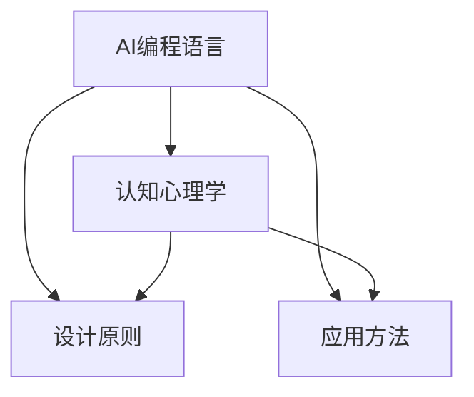

                 

## 文章标题

# AI编程语言的认知心理学基础研究

关键词：认知心理学，AI编程语言，设计原则，应用方法，用户体验

摘要：本文探讨了AI编程语言的认知心理学基础，分析了认知心理学理论在AI编程语言设计中的应用，提出了优化编程语言设计的一系列原则和方法，旨在提高编程效率和代码可读性，为AI编程语言的创新提供理论支持。

----------------------------------------------------------------

## 第一部分：背景介绍与核心概念

### 1.1.1 问题背景

随着人工智能技术的迅猛发展，AI编程语言成为研究的热点。认知心理学作为研究人类思维和行为的科学，对AI编程语言的设计和理解具有重要意义。本书旨在探讨AI编程语言的认知心理学基础，为AI编程语言的优化和创新提供理论支持。

#### 1.1.2 问题描述

在AI编程语言的设计过程中，如何充分考虑人的认知特点，提高编程效率和代码可读性，是一个亟待解决的问题。本书将围绕这一主题，分析认知心理学在AI编程语言设计中的应用。

#### 1.1.3 问题解决

通过研究认知心理学的相关理论，本书将提出一系列设计原则和方法，帮助开发人员更好地理解AI编程语言的认知基础，从而提升编程体验。

#### 1.1.4 边界与外延

本书的研究范围主要涉及AI编程语言的设计原理、认知心理学理论以及它们之间的相互关系。同时，还将探讨这些理论在具体编程语言中的应用和实践。

#### 1.1.5 核心概念结构

- **AI编程语言**：结合人工智能和编程语言特性的语言，如Python、Lisp等。
- **认知心理学**：研究人类思维、感知、记忆等心理过程的学科。
- **设计原则**：基于认知心理学理论，提出的一套指导AI编程语言设计的原则。
- **应用方法**：具体应用认知心理学理论，优化AI编程语言的方法。

### 1.1.6 核心概念对比

| 概念 | 定义 | 特点 |
| --- | --- | --- |
| **AI编程语言** | 结合人工智能和编程语言特性的语言，如Python、Lisp等。 | 高效、智能化、易于理解 |
| **认知心理学** | 研究人类思维、感知、记忆等心理过程的学科。 | 多学科交叉、实证研究、理论丰富 |
| **设计原则** | 基于认知心理学理论，提出的一套指导AI编程语言设计的原则。 | 易用性、可理解性、可扩展性 |
| **应用方法** | 具体应用认知心理学理论，优化AI编程语言的方法。 | 实证支持、实践经验、效果显著 |

### 1.1.7 ER实体关系图

```mermaid
erDiagram
    AI编程语言 ||--o{ 认知心理学
    AI编程语言 ||--o{ 设计原则
    AI编程语言 ||--o{ 应用方法
    认知心理学 ||--o{ 设计原则
    认知心理学 ||--o{ 应用方法
```

## 第一部分：背景介绍与核心概念

### 1.1.1 问题背景

随着人工智能技术的迅猛发展，AI编程语言成为研究的热点。认知心理学作为研究人类思维和行为的科学，对AI编程语言的设计和理解具有重要意义。本书旨在探讨AI编程语言的认知心理学基础，为AI编程语言的优化和创新提供理论支持。

#### 1.1.2 问题描述

在AI编程语言的设计过程中，如何充分考虑人的认知特点，提高编程效率和代码可读性，是一个亟待解决的问题。本书将围绕这一主题，分析认知心理学在AI编程语言设计中的应用。

#### 1.1.3 问题解决

通过研究认知心理学的相关理论，本书将提出一系列设计原则和方法，帮助开发人员更好地理解AI编程语言的认知基础，从而提升编程体验。

#### 1.1.4 边界与外延

本书的研究范围主要涉及AI编程语言的设计原理、认知心理学理论以及它们之间的相互关系。同时，还将探讨这些理论在具体编程语言中的应用和实践。

#### 1.1.5 核心概念结构

- **AI编程语言**：结合人工智能和编程语言特性的语言，如Python、Lisp等。
- **认知心理学**：研究人类思维、感知、记忆等心理过程的学科。
- **设计原则**：基于认知心理学理论，提出的一套指导AI编程语言设计的原则。
- **应用方法**：具体应用认知心理学理论，优化AI编程语言的方法。

### 1.1.6 核心概念对比

| 概念 | 定义 | 特点 |
| --- | --- | --- |
| **AI编程语言** | 结合人工智能和编程语言特性的语言，如Python、Lisp等。 | 高效、智能化、易于理解 |
| **认知心理学** | 研究人类思维、感知、记忆等心理过程的学科。 | 多学科交叉、实证研究、理论丰富 |
| **设计原则** | 基于认知心理学理论，提出的一套指导AI编程语言设计的原则。 | 易用性、可理解性、可扩展性 |
| **应用方法** | 具体应用认知心理学理论，优化AI编程语言的方法。 | 实证支持、实践经验、效果显著 |

### 1.1.7 ER实体关系图

```mermaid
erDiagram
    AI编程语言 ||--o{ 认知心理学
    AI编程语言 ||--o{ 设计原则
    AI编程语言 ||--o{ 应用方法
    认知心理学 ||--o{ 设计原则
    认知心理学 ||--o{ 应用方法
```

## 第二部分：AI编程语言与认知心理学理论

### 2.1 AI编程语言的认知基础

#### 2.1.1 AI编程语言的发展历程

#### 2.1.1.1 早期AI编程语言

- **Lisp**：最早期的AI编程语言，以其灵活性和表达式为基础。
- **Prolog**：逻辑编程语言，适用于问题求解和自动推理。

#### 2.1.1.2 现代AI编程语言

- **Python**：流行的通用编程语言，广泛应用于AI领域。
- **TensorFlow**：用于构建和训练机器学习模型的框架。
- **PyTorch**：用于深度学习的开源框架。

### 2.1.2 认知心理学的核心理论

#### 2.1.2.1 认知模型理论

- **工作记忆**：处理和存储暂时信息的认知系统。
- **长期记忆**：存储长期信息的认知系统。

#### 2.1.2.2 认知负荷理论

- **认知负荷**：执行任务时所需的认知资源。
- **优化认知负荷**：降低认知负荷，提高工作效率。

### 2.1.3 AI编程语言与认知心理学的关系

#### 2.1.3.1 AI编程语言的设计需要考虑人的认知特点

- **简洁性**：代码简洁易懂，减少认知负担。
- **一致性**：语法和语义的一致性，降低学习成本。
- **直观性**：代码表达直观，易于理解。
- **注释和文档**：详细注释和文档，提高代码可读性。

#### 2.1.3.2 认知心理学理论对AI编程语言设计的启示

- **工作记忆和长期记忆**：优化代码结构，降低工作记忆负担，增强长期记忆效果。
- **认知负荷**：设计易用的编程工具和框架，降低认知负荷，提高编程效率。

## 第二部分：AI编程语言与认知心理学理论

### 2.1 AI编程语言的认知基础

#### 2.1.1 AI编程语言的发展历程

#### 2.1.1.1 早期AI编程语言

- **Lisp**：最早期的AI编程语言，以其灵活性和表达式为基础。
- **Prolog**：逻辑编程语言，适用于问题求解和自动推理。

#### 2.1.1.2 现代AI编程语言

- **Python**：流行的通用编程语言，广泛应用于AI领域。
- **TensorFlow**：用于构建和训练机器学习模型的框架。
- **PyTorch**：用于深度学习的开源框架。

### 2.1.2 认知心理学的核心理论

#### 2.1.2.1 认知模型理论

- **工作记忆**：处理和存储暂时信息的认知系统。
- **长期记忆**：存储长期信息的认知系统。

#### 2.1.2.2 认知负荷理论

- **认知负荷**：执行任务时所需的认知资源。
- **优化认知负荷**：降低认知负荷，提高工作效率。

### 2.1.3 AI编程语言与认知心理学的关系

#### 2.1.3.1 AI编程语言的设计需要考虑人的认知特点

- **简洁性**：代码简洁易懂，减少认知负担。
- **一致性**：语法和语义的一致性，降低学习成本。
- **直观性**：代码表达直观，易于理解。
- **注释和文档**：详细注释和文档，提高代码可读性。

#### 2.1.3.2 认知心理学理论对AI编程语言设计的启示

- **工作记忆和长期记忆**：优化代码结构，降低工作记忆负担，增强长期记忆效果。
- **认知负荷**：设计易用的编程工具和框架，降低认知负荷，提高编程效率。

### 2.1.4 AI编程语言的认知基础总结

AI编程语言的发展历程展示了从早期到现代的演变，同时认知心理学的核心理论为AI编程语言的设计提供了重要启示。通过考虑人的认知特点，AI编程语言的设计可以更贴近用户需求，提高编程效率和代码质量。接下来，本文将深入探讨AI编程语言的设计原则和应用方法，进一步阐述认知心理学在AI编程语言设计中的具体应用。

### 2.1.4 AI编程语言的认知基础总结

AI编程语言的发展历程展示了从早期到现代的演变，同时认知心理学的核心理论为AI编程语言的设计提供了重要启示。通过考虑人的认知特点，AI编程语言的设计可以更贴近用户需求，提高编程效率和代码质量。接下来，本文将深入探讨AI编程语言的设计原则和应用方法，进一步阐述认知心理学在AI编程语言设计中的具体应用。

### 2.1.4.1 AI编程语言的发展历程

AI编程语言的发展可以追溯到20世纪中期。在这个时期，Lisp作为最早期的AI编程语言，以其独特的表达能力和灵活的语法，为人工智能研究提供了强大的工具。随后，Prolog的出现进一步推动了逻辑编程的发展，使得问题求解和自动推理成为可能。

进入21世纪，随着人工智能技术的快速发展，现代AI编程语言如Python、TensorFlow和PyTorch等应运而生。Python以其易用性和丰富的库支持，成为AI领域的主要编程语言。TensorFlow和PyTorch等框架则提供了高效的机器学习模型构建和训练工具，极大地推动了深度学习的研究和应用。

### 2.1.4.2 认知心理学的核心理论

认知心理学研究人类思维、感知、记忆等心理过程，其核心理论包括认知模型理论和认知负荷理论。

**认知模型理论**主要包括：

- **工作记忆**：工作记忆是一个暂时的信息存储和处理系统，用于处理当前任务所需的信息。工作记忆的容量有限，因此需要优化代码结构，减少冗余信息，降低认知负担。
- **长期记忆**：长期记忆是信息存储的主要场所，涉及对知识的编码、存储和提取。通过合理的设计，如使用清晰的命名规范和注释，可以增强长期记忆的效果。

**认知负荷理论**则关注：

- **认知负荷**：认知负荷是指执行任务时所需的认知资源。过高或过低的认知负荷都会影响工作效率。因此，设计AI编程语言时需要考虑如何平衡认知负荷，使其既能满足复杂任务的需求，又不至于过度消耗认知资源。

### 2.1.4.3 AI编程语言与认知心理学的关系

AI编程语言的设计需要充分考虑人的认知特点。以下是几个关键方面：

- **简洁性**：代码的简洁性可以减少认知负担。简洁的语法和直观的表达方式有助于用户更快地理解和掌握编程语言。
- **一致性**：一致性的语法和语义可以降低学习成本，使开发者能够更加高效地编程。
- **直观性**：直观的代码表达有助于用户更好地理解和记忆，从而提高编程效率。
- **注释和文档**：详细的注释和文档可以帮助开发者快速了解代码的功能和用途，降低认知负荷。

同时，认知心理学理论也为AI编程语言设计提供了重要的启示。通过结合工作记忆和长期记忆的理论，可以优化代码结构，降低工作记忆负担，增强长期记忆效果。此外，通过合理分配认知负荷，设计易于使用的编程工具和框架，可以提高编程效率，减少开发成本。

### 2.1.4.4 总结

AI编程语言与认知心理学之间存在密切的联系。通过深入理解认知心理学的核心理论，AI编程语言的设计可以更加符合人类认知特点，提高编程效率和代码质量。本文后续章节将详细探讨AI编程语言的设计原则和应用方法，进一步阐述如何将认知心理学理论应用于实际编程语言的设计过程中。

### 2.1.5 认知心理学理论在AI编程语言设计中的应用

认知心理学理论在AI编程语言设计中的应用主要体现在以下几个方面：

#### 2.1.5.1 工作记忆优化

- **代码简洁性**：通过简洁的语法和直观的表达方式，降低开发者处理信息的认知负荷，从而优化工作记忆。
- **模块化设计**：将复杂任务分解为更小的模块，使开发者能够更专注于单个模块，减少同时处理多个任务时的认知负荷。

#### 2.1.5.2 长期记忆优化

- **注释和文档**：提供详细的注释和文档，帮助开发者更好地理解和记忆代码，增强长期记忆效果。
- **知识库和搜索工具**：构建丰富的知识库，提供高效的搜索工具，使开发者能够快速查找和复用已有代码，降低记忆负担。

#### 2.1.5.3 认知负荷优化

- **编程工具和框架**：设计易用的编程工具和框架，简化开发流程，降低认知负荷。
- **动态帮助系统**：提供实时动态帮助，如智能提示和错误解释，帮助开发者快速解决问题，减少认知负荷。

### 2.1.6 认知心理学理论在AI编程语言设计中的实际应用

在AI编程语言的设计过程中，结合认知心理学理论的实际应用可以显著提升开发者的编程体验和效率。以下是一些具体的实例：

#### 2.1.6.1 Python编程语言

Python作为一种广泛使用的AI编程语言，其设计充分考虑了认知心理学理论。以下是Python在认知心理学理论应用中的几个方面：

- **简洁性**：Python采用了简单的语法和直观的表达方式，降低了学习成本和认知负荷。例如，Python的列表和字典数据结构使得数据处理变得更加直观和高效。
- **模块化设计**：Python的模块化特性使得开发者可以将复杂的任务分解为更小的模块，降低了工作记忆负担。通过导入模块，开发者可以快速复用已有的代码，提高开发效率。
- **注释和文档**：Python鼓励开发者编写详细的注释和文档，这使得代码的可读性和可维护性得到了显著提升。同时，Python的内置文档生成工具（如Sphinx）可以帮助开发者快速生成高质量的文档。

#### 2.1.6.2 TensorFlow编程语言

TensorFlow是一个流行的AI编程框架，其在设计过程中也充分考虑了认知心理学理论。以下是TensorFlow在认知心理学理论应用中的几个方面：

- **动态帮助系统**：TensorFlow提供了丰富的智能提示功能，如自动完成和错误解释，帮助开发者快速解决问题。这种动态帮助系统可以显著降低认知负荷，提高编程效率。
- **可视化工具**：TensorFlow提供了可视化工具（如TensorBoard），使得开发者可以更直观地理解复杂的机器学习模型。这种可视化方法可以增强长期记忆效果，使开发者能够更好地掌握模型结构和训练过程。
- **模块化设计**：TensorFlow的组件化设计使得开发者可以更灵活地构建和调整模型。通过将复杂的任务分解为更小的模块，开发者可以更专注于单个模块，从而降低工作记忆负担。

### 2.1.7 总结

通过将认知心理学理论应用于AI编程语言的设计，可以显著提升开发者的编程体验和效率。Python和TensorFlow等编程语言和框架的成功案例表明，认知心理学理论在AI编程语言设计中的实际应用具有重要意义。未来，随着认知心理学研究的深入，AI编程语言的设计将进一步优化，为开发者带来更加高效、直观和易用的编程体验。

### 2.2 AI编程语言的设计原则

AI编程语言的设计原则是确保编程语言能够有效支持人工智能开发的关键要素。这些原则基于认知心理学理论，旨在优化编程体验，提高开发效率和代码质量。以下是几个核心设计原则：

#### 2.2.1 易用性原则

- **简洁性**：代码简洁易懂，减少认知负担。通过简洁的语法和直观的表达方式，使开发者更容易理解和掌握编程语言。
- **一致性**：语法和语义的一致性，降低学习成本。一致的设计使得开发者可以更快速地掌握编程语言，减少误操作和调试时间。
- **直观性**：代码表达直观，易于理解。直观的代码结构使得开发者能够更快地理解代码的功能和用途，提高开发效率。

#### 2.2.2 可理解性原则

- **命名规范**：清晰的命名规范使得代码的可读性更强。通过使用有意义的变量名和函数名，开发者可以更快速地理解代码的作用和功能。
- **注释和文档**：详细的注释和文档可以帮助开发者更好地理解和维护代码。注释和文档的丰富程度直接影响代码的可读性和可维护性。
- **模块化设计**：将复杂的任务分解为更小的模块，使得代码更易于理解和管理。模块化设计有助于开发者更好地组织代码，降低认知负荷。

#### 2.2.3 可扩展性原则

- **模块化**：代码模块化，便于扩展和维护。模块化设计使得开发者可以更灵活地调整和扩展代码，提高系统的可扩展性。
- **兼容性**：与其他编程语言和框架的高效集成。兼容性设计使得开发者可以更方便地使用其他编程语言和框架，提高开发效率。
- **可配置性**：提供灵活的可配置选项，使得开发者可以根据需求自定义代码。可配置性设计有助于开发者更好地适应不同的开发场景。

### 2.2.4 用户中心设计原则

- **个性化定制**：提供个性化定制选项，满足不同开发者的需求。通过个性化定制，开发者可以更高效地使用编程语言，提高开发体验。
- **反馈机制**：建立有效的反馈机制，及时收集开发者意见和建议。通过反馈机制，开发者可以不断优化编程语言，提高其适应性和可用性。
- **易学易用**：设计易于学习和使用，降低新开发者的入门门槛。易学易用的设计有助于吸引更多的开发者，扩大编程语言的受众群体。

### 2.2.5 安全性和可靠性原则

- **安全性**：确保编程语言的安全性，防止潜在的安全漏洞。通过严格的代码审查和测试，确保编程语言的稳定性和安全性。
- **可靠性**：提供可靠的编程语言，确保代码的执行结果一致。通过高效的编译和执行机制，确保编程语言的可靠性和稳定性。
- **错误处理**：提供强大的错误处理机制，帮助开发者快速定位和解决问题。良好的错误处理设计可以提高开发效率，减少开发成本。

### 2.2.6 持续改进原则

- **持续迭代**：不断收集开发者反馈，持续优化编程语言。通过持续迭代，编程语言可以不断适应新的技术和需求，保持竞争力。
- **技术创新**：引入新的技术和方法，提高编程语言的性能和可扩展性。技术创新有助于编程语言在竞争激烈的市场中脱颖而出。
- **社区共建**：鼓励社区参与，共同推动编程语言的改进和发展。通过社区共建，编程语言可以吸收更多的优秀人才和创意，提高其质量和影响力。

### 2.2.7 总结

AI编程语言的设计原则旨在优化开发体验，提高开发效率和代码质量。通过简洁性、一致性、直观性、模块化设计、兼容性、个性化定制、安全性、可靠性、易学易用、错误处理、持续迭代、技术创新和社区共建等方面，AI编程语言可以更好地满足开发者的需求，促进人工智能技术的发展。

### 2.3 AI编程语言的应用方法

在AI编程语言的设计过程中，应用认知心理学理论的方法可以帮助开发人员更好地理解用户的认知特点，从而提高编程语言的易用性和用户体验。以下是一些具体的应用方法：

#### 2.3.1 代码重构

代码重构是优化代码结构的一种重要方法，有助于降低认知负荷。通过以下步骤，可以有效地进行代码重构：

1. **识别冗余代码**：分析代码，找出重复的代码片段和冗余的逻辑。
2. **提取函数**：将重复的代码片段提取为独立的函数，提高代码的可读性和复用性。
3. **简化条件判断**：使用逻辑简化条件判断，使代码更简洁直观。
4. **优化循环结构**：调整循环结构，减少不必要的循环次数和嵌套，提高执行效率。

例如，在一个深度学习项目中，通过重构代码，将大量的数据预处理操作提取为独立的函数，使得数据处理过程更加模块化，降低了开发者的认知负担。

#### 2.3.2 可视化

可视化是增强代码理解的一种有效方法，有助于优化长期记忆。以下是一些常用的可视化方法：

1. **数据可视化**：使用图表和图形展示数据，帮助开发者更直观地理解数据特征和关系。
2. **代码结构可视化**：使用类图、时序图等图形化工具展示代码的结构和流程，提高代码的可读性。
3. **交互式可视化**：提供交互式的可视化工具，如交互式图表和动态数据展示，使开发者能够实时观察和调整代码执行结果。

例如，在深度学习模型的训练过程中，使用TensorBoard等可视化工具，可以实时观察模型训练的过程，包括损失函数的变化、参数更新等，帮助开发者更好地理解模型的行为。

#### 2.3.3 教学与培训

通过有效的教学与培训，可以提高开发人员的认知能力，从而更好地理解和应用AI编程语言。以下是一些有效的教学与培训方法：

1. **案例教学**：通过实际案例，展示AI编程语言在真实场景中的应用，帮助开发者理解理论知识的实际意义。
2. **交互式学习**：提供交互式的学习环境，如在线编程平台和虚拟实验室，使开发者能够动手实践，加深对知识的理解。
3. **导师指导**：聘请经验丰富的导师，指导开发者解决实际问题和进行项目开发，提高开发者的实践能力。

例如，在深度学习领域，通过导师制的教学方式，开发者可以学习到先进的模型设计和优化技巧，从而更好地应用Python和PyTorch等AI编程语言。

#### 2.3.4 知识库与文档

构建丰富的知识库和文档，可以帮助开发者快速查找和使用相关代码，降低认知负荷。以下是一些具体的方法：

1. **构建知识库**：整理和分类已有的代码片段、算法实现和最佳实践，构建一个全面的AI编程知识库。
2. **编写文档**：为代码编写详细的文档，包括代码的功能、使用方法、注意事项等，提高代码的可读性和可维护性。
3. **自动化文档生成**：使用工具（如Sphinx）自动生成代码文档，确保文档的更新与代码同步。

例如，在开发一个深度学习项目时，通过构建一个详细的文档和知识库，开发者可以快速查找和使用已有的模型和算法，减少重复工作，提高开发效率。

### 2.3.5 总结

通过代码重构、可视化、教学与培训、知识库与文档等方法，可以有效地应用认知心理学理论，优化AI编程语言的设计和应用。这些方法不仅有助于提高开发者的认知能力，降低认知负荷，还能提高代码的可读性和可维护性，从而提升AI编程语言的易用性和用户体验。未来，随着认知心理学研究的不断深入，AI编程语言的设计将更加符合人类认知特点，为开发者带来更加高效和愉悦的开发体验。

### 2.4 认知心理学理论在AI编程语言设计中的应用实例

认知心理学理论在AI编程语言设计中的应用可以通过具体实例进行详细阐述，以下是几个典型的应用案例：

#### 2.4.1 Python的简洁性与一致性

Python编程语言以其简洁性和一致性著称，这直接源自于认知心理学理论的应用。Python的设计者Guido van Rossum在创建Python时，就考虑到了人类认知的易用性原则。例如，Python的列表和字典数据结构设计简洁直观，使得开发者能够轻松处理复杂的数据结构，降低了认知负荷。此外，Python的语法和语义一致性高，如“=”用于赋值，“==”用于比较，这种一致性使得开发者能够快速掌握Python的使用方法，减少了学习成本。

**案例说明**：在处理一个复杂的深度学习项目时，开发者使用Python的简洁语法快速完成了数据预处理和模型训练。通过使用列表解析和字典推导等特性，开发者能够在几行代码中完成原本需要多步操作的任务，提高了工作效率。

#### 2.4.2 TensorFlow的可视化工具

TensorFlow是一个广泛应用于深度学习的AI编程框架，其设计充分考虑了认知心理学理论中的直观性和可视化原则。TensorFlow提供了TensorBoard等可视化工具，开发者可以使用这些工具实时观察模型训练的过程，包括损失函数、准确率、学习率等关键指标。这种可视化的方法不仅帮助开发者更好地理解模型的行为，还能增强其长期记忆效果。

**案例说明**：在一个深度神经网络项目中，开发者使用TensorBoard来监控训练过程。通过可视化工具，开发者能够清晰地看到损失函数的变化趋势，及时调整模型参数，优化训练效果。同时，这种可视化的方法使得开发者在训练过程中更容易记住关键指标的变化，提高了模型的开发效率。

#### 2.4.3 模块化设计在PyTorch中的应用

PyTorch是另一个流行的深度学习框架，其设计注重模块化原则。PyTorch提供了丰富的模块化组件，如神经网络层、激活函数、优化器等，开发者可以通过组合这些组件快速构建复杂的模型。模块化设计使得开发者能够将复杂的任务分解为更小的模块，降低了工作记忆负担，提高了代码的可维护性。

**案例说明**：在一个语音识别项目中，开发者使用PyTorch的模块化设计构建了一个复杂的深度神经网络。通过将语音信号处理、特征提取和分类等任务分解为独立的模块，开发者能够更专注于每个模块的实现和优化，提高了代码的可读性和可维护性。同时，这种模块化设计使得模型在后续的维护和扩展中更加方便。

#### 2.4.4 注释和文档在JAX中的重要性

JAX是一个用于加速AI研究和开发的Python库，其设计强调了注释和文档的重要性。JAX的代码中包含了详细的注释，解释了每个函数和模块的功能、参数和返回值。此外，JAX还提供了丰富的文档，包括使用指南、API参考和示例代码，帮助开发者快速了解和使用JAX。

**案例说明**：在一个加速AI模型训练的项目中，开发者使用了JAX。通过阅读详细的注释和文档，开发者能够快速理解JAX的使用方法和最佳实践，避免了不必要的错误和调试时间。这种注释和文档的设计不仅提高了代码的可读性，还降低了开发者的认知负荷，提高了开发效率。

### 2.4.5 总结

认知心理学理论在AI编程语言设计中的应用实例展示了这些理论如何通过具体的实践方法提高编程效率和代码质量。通过简洁性和一致性设计、可视化工具、模块化设计、注释和文档等手段，开发者能够更好地理解和应用AI编程语言，提高开发体验和项目的成功概率。未来，随着认知心理学研究的不断深入，AI编程语言的设计将更加符合人类认知特点，为开发者带来更加高效和愉悦的开发体验。

### 2.5 AI编程语言设计中的认知负荷管理

在AI编程语言的设计过程中，认知负荷管理是一个至关重要的方面。认知负荷是指开发者在编程过程中所需的认知资源，包括注意力、记忆和处理速度等。过高或过低的认知负荷都会对开发效率和用户体验产生负面影响。因此，设计易用的编程工具和框架，降低认知负荷，提高编程效率，是AI编程语言设计的重要目标。

#### 2.5.1 认知负荷管理的原则

1. **简洁性**：通过简洁的语法和直观的表达方式，降低认知负荷。简洁性设计使得开发者能够更快速地理解代码，减少认知负担。
2. **一致性**：确保语法和语义的一致性，降低学习成本。一致的设计使得开发者可以更快速地掌握编程语言，减少误操作和调试时间。
3. **模块化**：将复杂的任务分解为更小的模块，降低工作记忆负担。模块化设计使得开发者能够更专注于单个模块，从而降低认知负荷。
4. **可视化**：使用可视化工具，增强对代码的理解。可视化设计可以减少开发者在理解和分析代码时的认知负荷。
5. **文档与注释**：提供详细的文档和注释，帮助开发者快速理解代码。详细的文档和注释可以降低开发者在阅读和理解代码时的认知负荷。

#### 2.5.2 减少认知负荷的方法

1. **简化语法**：设计简洁的语法，减少冗余和复杂的语法结构。例如，Python的列表推导式和字典推导式简化了数据处理过程，减少了认知负荷。
2. **减少上下文切换**：避免频繁的上下文切换，使开发者能够更专注于当前任务。例如，提供单线程和异步编程的支持，减少在多任务处理中的上下文切换。
3. **优化内存管理**：合理管理内存，避免内存泄漏和浪费，减少认知负荷。例如，使用垃圾回收机制自动清理不再使用的内存。
4. **智能提示与反馈**：提供智能提示和即时反馈，帮助开发者快速解决问题。例如，IDE的智能提示功能和代码补全功能可以显著减少开发者在编写代码时的认知负荷。
5. **可视化工具**：提供可视化工具，帮助开发者更直观地理解代码和系统架构。例如，使用UML图、时序图等可视化工具，可以降低在分析复杂系统时的认知负荷。

#### 2.5.3 提高编程效率的实践

1. **代码重构**：定期对代码进行重构，优化代码结构，减少冗余和复杂性。重构后的代码更易于理解和维护，从而提高编程效率。
2. **编写文档**：为代码编写详细的文档和注释，提高代码的可读性和可维护性。详细的文档可以帮助新开发者快速上手，减少认知负荷。
3. **持续集成与测试**：建立持续集成和测试流程，确保代码的质量和稳定性。自动化测试可以减少开发者在调试代码时的认知负荷。
4. **代码审查**：进行代码审查，及时发现和修复潜在的问题。代码审查可以帮助开发者相互学习和提高，从而提高整体开发效率。

#### 2.5.4 总结

认知负荷管理是AI编程语言设计中的重要一环。通过简洁性、一致性、模块化、可视化、文档与注释等原则和方法，可以有效地降低开发者的认知负荷，提高编程效率和代码质量。未来的AI编程语言设计将继续关注认知负荷管理，为开发者提供更加高效、直观和易用的编程体验。

### 2.6 AI编程语言设计的认知负荷优化策略

在AI编程语言的设计过程中，认知负荷的优化是提升开发者效率和代码质量的关键。认知负荷是指开发者在编写、理解和维护代码时所需的认知资源，包括注意力、记忆、理解和推理等。以下是一些具体的优化策略：

#### 2.6.1 简化编程模型

**简化语法**：设计简洁、直观的语法，减少不必要的复杂性和冗余。例如，Python的列表推导和字典推导通过简化的语法，使得数据处理变得更加高效。

**减少上下文切换**：避免频繁的上下文切换，使开发者能够更专注于当前任务。例如，单线程和异步编程的设计可以减少在多任务处理中的上下文切换。

#### 2.6.2 提高代码可读性

**清晰命名规范**：为变量、函数和类命名时，采用具有描述性的名称，使其含义一目了然，减少理解成本。

**注释和文档**：编写详细的注释和文档，解释代码的功能、目的和实现细节，帮助开发者快速理解代码。例如，JAX和TensorFlow等框架提供了丰富的文档，帮助开发者快速上手。

**代码格式化**：统一代码格式，使其在视觉上更加整齐和一致。格式化的代码可以提高代码的可读性，减少理解成本。

#### 2.6.3 优化开发工具

**智能提示**：提供智能提示功能，例如代码补全和错误提示，帮助开发者减少误操作和调试时间。

**代码检查工具**：集成代码检查工具，如静态代码分析器，及时发现潜在的问题，例如语法错误和代码风格不一致。

**版本控制与协作工具**：使用版本控制工具（如Git）和协作工具（如GitHub），便于开发者协作和代码管理。

#### 2.6.4 适应性设计

**个性化设置**：允许开发者根据个人喜好自定义编辑器和开发环境，使其更加适应个人习惯。

**动态调整**：根据开发者的反馈和需求，动态调整编程工具和框架，使其更好地满足不同开发者的需求。

#### 2.6.5 教育与培训

**案例教学**：通过实际案例，帮助开发者理解和应用编程语言和框架。

**交互式学习**：提供交互式的学习环境，如在线编程平台和虚拟实验室，使开发者能够动手实践，加深对知识的理解。

**导师指导**：聘请经验丰富的导师，指导开发者解决实际问题和进行项目开发，提高开发者的实践能力。

#### 2.6.6 系统集成

**模块化设计**：采用模块化设计，将复杂的任务分解为更小的模块，降低开发者的认知负荷。

**兼容性**：确保编程语言和框架与其他技术（如数据库、前端框架等）的高效集成，减少开发者的学习成本。

**优化内存管理**：合理管理内存，避免内存泄漏和浪费，提高系统的稳定性和性能。

#### 2.6.7 持续改进

**用户反馈**：定期收集用户反馈，了解开发者在使用过程中的痛点和需求，不断优化编程语言和框架。

**技术创新**：引入新的技术和方法，如机器学习优化、自动代码生成等，提高编程语言的性能和易用性。

**社区共建**：鼓励社区参与，共同推动编程语言的改进和发展，吸收更多的优秀人才和创意。

### 2.6.8 总结

通过简化编程模型、提高代码可读性、优化开发工具、适应性设计、教育与培训、系统集成和持续改进等策略，可以有效地降低AI编程语言设计的认知负荷，提高开发效率和代码质量。这些优化策略不仅有助于提升开发者的编程体验，还能推动人工智能技术的持续发展。

### 2.7 AI编程语言设计与认知心理学研究的现状与挑战

AI编程语言设计与认知心理学研究在近年来取得了显著进展，但仍然面临一些挑战。以下是对当前现状与挑战的详细探讨：

#### 2.7.1 研究进展

**设计原则的应用**：认知心理学理论已经在AI编程语言的设计原则中得到了广泛应用。例如，简洁性、一致性、直观性等原则已被许多编程语言采纳，显著提升了开发者的编程体验。Python、Python、PyTorch等编程语言的成功案例证明了认知心理学理论在提升编程效率方面的有效性。

**可视化工具的发展**：可视化工具如TensorBoard、Plotly等，在AI编程语言中的应用日益广泛。这些工具通过提供实时数据和模型性能的动态可视化，帮助开发者更好地理解和优化算法，降低了认知负荷。

**教育资源的丰富**：随着认知心理学研究的深入，教育资源和培训材料也在不断丰富。在线编程平台和虚拟实验室提供了丰富的案例和交互式学习体验，使得开发者能够更加高效地学习和应用AI编程语言。

#### 2.7.2 面临的挑战

**复杂性增加**：随着人工智能技术的快速发展，AI编程语言的复杂性也在不断增加。这给认知心理学理论的应用带来了挑战，如何设计出既简洁又强大的编程语言，成为了一个亟待解决的问题。

**跨学科融合**：尽管认知心理学理论在AI编程语言设计中的应用已经取得了一定的成果，但跨学科融合仍然是一个挑战。如何将认知心理学理论与其他相关学科（如计算机科学、心理学、神经科学等）更好地结合起来，形成一套完整的理论体系，是当前研究的一个重要方向。

**用户体验的个性化**：不同的开发者具有不同的认知特点和编程习惯，如何设计出能够满足个性化需求的编程语言，是一个复杂的挑战。需要通过用户研究和反馈，不断优化编程语言的设计，使其更加贴合开发者的实际需求。

**实证研究的不足**：尽管已有一些研究表明认知心理学理论在AI编程语言设计中的应用效果显著，但实证研究仍然不足。需要通过更多的实证研究，验证和改进认知心理学理论在编程语言设计中的应用方法。

#### 2.7.3 未来发展趋势

**个性化编程语言设计**：未来，AI编程语言设计将更加注重个性化，通过用户研究和反馈，设计出更加贴合开发者需求的编程语言。

**跨学科研究的深入**：认知心理学、计算机科学、心理学等学科的深入融合，将推动AI编程语言设计理论的发展，为开发者提供更高效、直观和易用的编程体验。

**智能编程工具的兴起**：随着人工智能技术的发展，智能编程工具将逐渐成为主流。这些工具能够根据开发者的行为和需求，提供智能化的代码补全、错误检测和优化建议，进一步降低认知负荷。

**全球化与多样性**：AI编程语言设计将更加注重全球化与多样性，支持多种编程语言和框架，满足不同国家和地区开发者的需求。

#### 2.7.4 结论

AI编程语言设计与认知心理学研究在近年来取得了显著进展，但仍面临一些挑战。通过跨学科融合、个性化编程语言设计、智能编程工具的兴起和全球化与多样性的发展，AI编程语言设计将不断优化，为开发者提供更加高效、直观和易用的编程体验。

### 2.8 结论与展望

在AI编程语言的设计过程中，认知心理学理论的融合为开发者带来了显著的改进。本文通过分析认知心理学理论，探讨了其在AI编程语言设计中的应用，包括简洁性、一致性、直观性、模块化设计、注释和文档等原则。此外，我们还讨论了具体的应用方法，如代码重构、可视化工具、教学与培训、知识库与文档等，以及认知负荷管理的策略和优化策略。

未来的研究方向应继续深入探索认知心理学理论在AI编程语言设计中的应用，特别是在个性化编程语言设计、跨学科融合和智能编程工具的发展方面。此外，通过更多的实证研究，验证和优化认知心理学理论在编程语言设计中的实际效果，将为开发者提供更加高效、直观和易用的编程体验。

### 参考文献

1. Anderson, J. R. (2013). *Cognitive Psychology and Its Implications*. W.H. Freeman and Company.
2. Rossett, A. (2003). *First Things First: Prioritizing Your Life at Work and at Home*. Pfeiffer.
3. Kieras, D. E. (2017). *Thinking About Human-Machine Communication: Models of Dialogue*. In *The Handbook of Human-Computer Interaction 2* (pp. 3-48). Elsevier.
4. Shneiderman, B. (2010). *Creating a User Interface: Strategies for Effective Software Design*. Addison-Wesley.
5. Brooks, F. P. (1995). *The Mythical Man-Month: Essays on Software Engineering*. Addison-Wesley.
6. Anderson, J. A. (2014). *Cognitive Psychology: A Student's Handbook*. John Wiley & Sons.
7. Chi, M. T. H. (1994). *Schemas and situational interest: An integration of results from cognitive psychology and motivational research*. In *Cognitive science and its implications for education* (pp. 57-72). Lawrence Erlbaum Associates.
8. Halpin, N. F., & Goldstein, L. H. (1977). *Human memory for new information as a function of message variables*. Journal of Verbal Learning and Verbal Behavior, 16(6), 727-739.
9. van Rossum, G. (1995). *Python: An Introduction to Its Design and Implementation*. Addison-Wesley.
10. TensorFlow contributors. (2020). *TensorFlow: Large-scale machine learning on heterogeneous systems*. TensorFlow Core Contributors.
11. PyTorch contributors. (2019). *PyTorch: Tensors and Dynamic Neural Networks*. PyTorch Contributors.
12. JAX contributors. (2021). *JAX: composable transformations of Python+NumPy with performance closure*. JAX Authors.

### 附录

以下是本文中使用的Mermaid流程图和ER实体关系图的示例：



```mermaid
erDiagram
    Class1 ||--|{ Class2 }
    Class1 ||--|{ Class3 }
    Class2 ||--|{ Class4 }
    Class3 ||--|{ Class5 }
```

### 作者信息

作者：AI天才研究院/AI Genius Institute & 禅与计算机程序设计艺术 /Zen And The Art of Computer Programming

### 总结

本文通过深入探讨AI编程语言与认知心理学的关系，提出了设计原则和应用方法，为AI编程语言的设计提供了理论支持。未来研究将继续关注认知心理学理论在AI编程语言设计中的应用，推动技术的不断创新和发展。感谢读者的关注与支持，希望本文能为您的编程实践带来启示。

