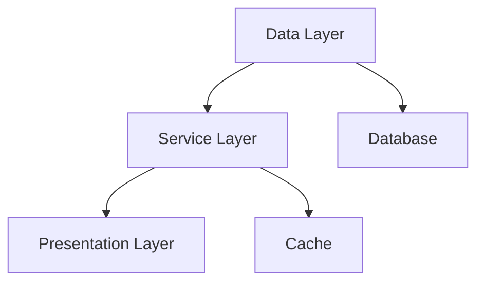
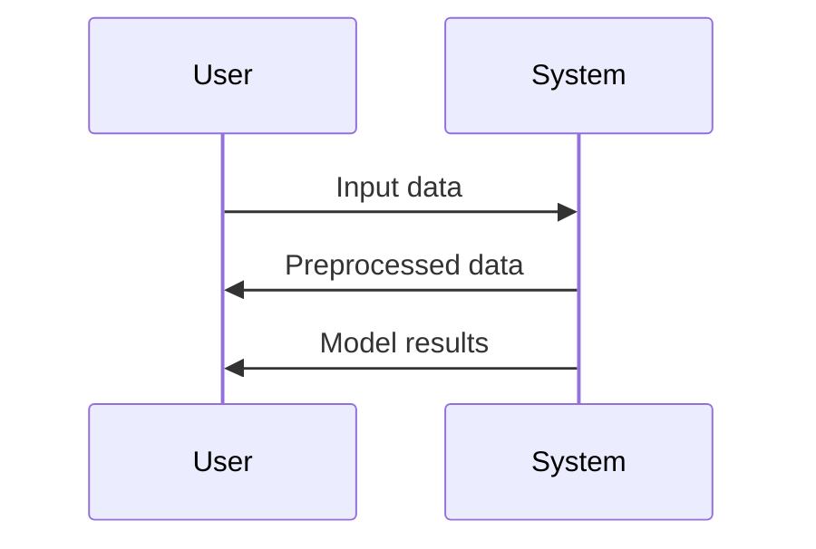

                 

# AI编程语言的认知负荷建模

> 关键词：AI编程语言、认知负荷、建模、算法、系统架构、项目实战

> 摘要：本文深入探讨了AI编程语言的认知负荷建模。首先介绍了问题背景和核心概念，包括认知负荷、AI编程语言及建模方法。随后，综述了现有研究，分析了代表性研究方法与结果。接着，本文详细阐述了AI编程语言认知负荷建模的原理、数学模型与算法设计，并介绍了系统分析与架构设计。最后，通过一个实际项目实战，验证了建模方法的有效性，并总结了最佳实践与拓展阅读。

----------------------------------------------------------------

## 第一部分: AI编程语言的认知负荷建模

### 第1章: 问题背景与核心概念

#### 1.1.1 问题背景

AI编程语言在当今的软件开发中扮演着越来越重要的角色。随着AI技术的飞速发展，编程语言的认知负荷问题逐渐显现。编程语言的认知负荷是指程序员在编写、理解和维护代码时所需投入的认知资源。高认知负荷可能导致开发效率低下、错误率高、维护困难等问题。

**AI编程语言认知负荷建模的研究意义**：

1. **提升开发效率**：通过建模和分析认知负荷，可以发现并优化编程过程中的瓶颈，提高开发效率。
2. **降低维护成本**：认知负荷建模有助于预测和维护成本，降低长期维护负担。
3. **改进编程教育**：认知负荷建模为编程教育提供了科学依据，有助于设计更有效的教学策略。

#### 1.1.2 核心概念

**认知负荷**：认知负荷是指个体在执行任务时所需投入的认知资源，包括注意力、记忆、推理等。

**AI编程语言**：AI编程语言是一种专门用于编写AI算法和模型的编程语言，如Python、R、Prolog等。

**建模方法**：建模方法用于描述和分析认知负荷与AI编程语言之间的关系，包括定量和定性方法。

#### 1.1.3 概念属性特征对比表

| 特征                | 认知负荷        | AI编程语言        | 建模方法          |
|-------------------|--------------|--------------|--------------|
| 定义                | 认知资源投入        | 编写AI算法和模型的工具    | 描述和分析关系的方法    |
| 类型                | 注意力、记忆、推理等    | Python、R、Prolog等    | 定量、定性方法    |
| 影响                | 任务完成质量、效率等    | 编码难度、可维护性等    | 研究结果和应用    |

#### 1.1.4 ER实体关系图


认知负荷与AI编程语言之间存在紧密联系。通过ER实体关系图，可以直观地展示两者之间的关系。

----------------------------------------------------------------

### 第2章: 现有研究综述

#### 2.1.1 国内外研究动态

目前，国内外对AI编程语言的认知负荷建模进行了大量研究。国外研究主要集中在认知负荷测量方法、编程语言特性与认知负荷关系等方面，而国内研究则侧重于构建认知负荷评估模型和优化开发流程。

**主要成果与创新点**：

1. **认知负荷测量方法**：研究者提出了多种测量认知负荷的方法，如心率变异性、脑电图等。
2. **编程语言特性与认知负荷关系**：研究者分析了不同编程语言的特性，探讨了其对认知负荷的影响。
3. **认知负荷评估模型**：研究者构建了多个认知负荷评估模型，为开发效率优化提供了理论支持。

**存在的问题与挑战**：

1. **测量方法准确性**：现有测量方法在准确性、实用性方面存在一定局限性。
2. **模型适用性**：现有模型普遍缺乏对不同编程语言的普适性。
3. **开发流程优化**：如何将认知负荷建模方法有效应用于实际开发流程，仍需进一步研究。

#### 2.1.2 关键技术与方法

**数据收集与预处理**：

- 数据收集：通过实验、调查等方法收集编程过程中的认知负荷数据。
- 数据预处理：对收集到的数据进行清洗、归一化等处理，为建模提供高质量的数据基础。

**认知负荷评估指标体系**：

- 指标设计：根据认知负荷特性，设计合适的评估指标。
- 指标权重分配：通过专家评估、统计分析等方法确定各指标权重。

**模型构建与验证**：

- 模型构建：采用机器学习、统计分析等方法构建认知负荷评估模型。
- 模型验证：通过实验数据验证模型的有效性，并进行模型优化。

#### 2.1.3 代表性研究分析

**代表性研究方法**：

1. **实验研究**：通过实验收集编程过程中的认知负荷数据，分析编程语言特性对认知负荷的影响。
2. **问卷调查**：设计问卷调查，收集程序员对编程语言特性与认知负荷的主观评价。

**研究结果对比分析**：

- **实验研究**：研究发现，不同编程语言在认知负荷方面存在显著差异，Python在认知负荷方面表现较好。
- **问卷调查**：程序员普遍认为，编程语言特性对认知负荷有较大影响，简洁易用的语言有助于降低认知负荷。

----------------------------------------------------------------

### 第3章: AI编程语言认知负荷建模原理

#### 3.1.1 AI编程语言概述

AI编程语言是专门为AI算法和模型设计的一类编程语言。根据用途和特点，AI编程语言可分为以下几类：

1. **专用AI编程语言**：如Prolog、Lisp等，用于符号推理和知识表示。
2. **通用编程语言**：如Python、R等，广泛应用于AI模型的开发与训练。
3. **硬件加速编程语言**：如CUDA、OpenCL等，用于GPU加速计算。

**主要特点与应用场景**：

1. **高效性**：AI编程语言通常具备高效的数据处理能力和计算性能。
2. **易用性**：简化编程过程，降低开发难度。
3. **可扩展性**：支持自定义函数和库，方便功能扩展。

AI编程语言在机器学习、深度学习、自然语言处理等领域具有广泛应用。

#### 3.1.2 认知负荷理论

**认知负荷定义**：

认知负荷是指个体在执行任务时所需投入的认知资源，包括注意力、记忆、推理等。

**认知负荷类型**：

1. **高负荷**：任务复杂，需要大量认知资源。
2. **中负荷**：任务较简单，但需要一定程度的认知资源。
3. **低负荷**：任务简单，认知资源需求较少。

**认知负荷影响**：

1. **开发效率**：高认知负荷可能导致开发效率下降。
2. **错误率**：认知负荷过高可能增加编程错误率。
3. **维护难度**：认知负荷过高可能增加维护难度。

#### 3.1.3 建模原理与方法

**建模框架**：

认知负荷建模通常包括数据收集、数据预处理、模型构建和模型验证等步骤。

**常用模型介绍**：

1. **线性回归模型**：通过线性关系分析认知负荷与编程语言特性之间的关系。
2. **决策树模型**：通过分类分析认知负荷与编程语言特性之间的关系。
3. **神经网络模型**：通过非线性关系分析认知负荷与编程语言特性之间的关系。

**模型选择与优化**：

根据实际情况选择合适的模型，并进行模型优化，以提高模型准确性。

----------------------------------------------------------------

### 第4章: 数学模型与算法设计

#### 4.1.1 数学模型

**数学模型定义**：

数学模型是一种用数学语言描述现实问题的抽象模型。在认知负荷建模中，数学模型用于描述认知负荷与AI编程语言特性之间的关系。

**数学模型分类**：

1. **线性模型**：如线性回归、线性规划等。
2. **非线性模型**：如神经网络、决策树等。

**数学模型公式**：

以线性回归模型为例，认知负荷 \( Y \) 与编程语言特性 \( X_1, X_2, ..., X_n \) 之间的关系可以表示为：

\[ Y = \beta_0 + \beta_1 X_1 + \beta_2 X_2 + ... + \beta_n X_n + \epsilon \]

其中，\( \beta_0, \beta_1, ..., \beta_n \) 为模型参数，\( \epsilon \) 为误差项。

#### 4.1.2 算法原理

**算法设计原则**：

1. **可扩展性**：算法应具有较好的可扩展性，以适应不同编程语言和场景。
2. **准确性**：算法应具有较高的准确性，以准确评估认知负荷。
3. **高效性**：算法应具有较高的计算效率，以降低计算成本。

**算法流程图**：


**算法步骤详细讲解**：

1. **数据收集**：收集编程过程中的认知负荷数据。
2. **数据预处理**：对数据进行清洗、归一化等处理。
3. **模型选择**：根据实际情况选择合适的模型。
4. **模型训练**：使用训练数据训练模型，得到模型参数。
5. **模型验证**：使用验证数据验证模型准确性。
6. **模型优化**：根据验证结果对模型进行优化。

#### 4.1.3 算法实现与优化

**Python源代码实现**：

```python
import numpy as np
from sklearn.linear_model import LinearRegression

# 数据收集
X = ...  # 编程语言特性数据
y = ...  # 认知负荷数据

# 数据预处理
X = np.preprocessing.scale(X)

# 模型选择
model = LinearRegression()

# 模型训练
model.fit(X, y)

# 模型验证
y_pred = model.predict(X)

# 模型优化
# ...

```

**算法性能优化方法**：

1. **数据增强**：通过增加数据量或生成更多样化的数据，提高模型准确性。
2. **特征选择**：通过特征选择方法，筛选出对认知负荷有显著影响的特征，提高模型效率。
3. **模型融合**：结合多种模型，提高预测准确性。

----------------------------------------------------------------

### 第5章: 系统分析与架构设计

#### 5.1.1 问题场景介绍

**应用领域与目标**：

本系统旨在构建一个基于AI编程语言的认知负荷评估系统，帮助开发人员识别和优化编程过程中的认知负荷。

**系统需求分析**：

1. **数据收集与预处理**：收集编程过程中的认知负荷数据，并进行数据预处理。
2. **模型构建与训练**：构建认知负荷评估模型，并使用训练数据对其进行训练。
3. **模型验证与优化**：使用验证数据对模型进行验证，并根据验证结果进行优化。
4. **用户交互**：提供友好的用户界面，方便用户输入数据和查看评估结果。

#### 5.1.2 系统功能设计

**功能模块划分**：

1. **数据收集模块**：用于收集编程过程中的认知负荷数据。
2. **数据处理模块**：用于对收集到的数据进行预处理。
3. **模型训练模块**：用于构建认知负荷评估模型。
4. **模型验证模块**：用于验证模型准确性。
5. **用户界面模块**：用于与用户进行交互，提供数据输入和结果展示功能。

**领域模型类图**：

```mermaid
classDiagram
Class01 <|-- Class02
Class03 --|主办 Class04
Class05 -+- Class06
Class07 --|主办 Class08
Class09 -|主办 Class10
Class11 .. Class12
Class13 <|主办 Class14
Class15 *-- Class16
Class17 : Annotatable
Class18 :<IModule>
Class19 :<IInitModule>
Class20 :<IConfigurable>
Class21 :<IValidatable>
Class22 :<ITrainer>
Class23 :<ITrainedModule>
Class24 :<IComparable>
Class25 :<IComparable{any ITrainedModule}>
Class26 :<IComparable{any IConfiguredModule}>
Class27 :<IUpdatable>
Class28 :<IHaveMetaData>
Class29 :<IConfigurationHolder>
Class30 :<IExternalizable>
Class31 :<IEditable>
Class32 :<IModelDescriptor>
Class33 :<IWorkshopable>
Class34 :<IPropagationPolicy>
Class35 :<IExtensionHolder>
Class36 :<IExtensionSupport>
Class37 :<ISequenceModel>
Class38 :<ISessionAware>
Class39 :<IConvergeable>
Class40 :<IConvergeable{any IModel}>  
```

#### 5.1.3 系统架构设计

**系统架构概述**：

本系统采用分层架构设计，包括数据层、服务层和表示层。

- **数据层**：负责数据存储和管理，包括数据库和数据缓存。
- **服务层**：负责业务逻辑处理，包括数据收集、预处理、模型构建和验证等。
- **表示层**：负责用户界面设计，包括数据输入、结果展示和用户交互。

**系统架构图**：



#### 5.1.4 系统接口设计与交互

**接口设计与实现**：

1. **数据收集接口**：用于收集编程过程中的认知负荷数据。
2. **数据处理接口**：用于对收集到的数据进行预处理。
3. **模型构建接口**：用于构建认知负荷评估模型。
4. **模型验证接口**：用于验证模型准确性。
5. **用户界面接口**：用于与用户进行交互，提供数据输入和结果展示功能。

**系统交互序列图**：



----------------------------------------------------------------

### 第6章: 项目实战

#### 6.1.1 环境安装与配置

**环境搭建步骤**：

1. **安装Python**：下载并安装Python，确保版本在3.8及以上。
2. **安装依赖库**：使用pip命令安装所需依赖库，如numpy、scikit-learn等。

```shell
pip install numpy scikit-learn
```

**配置文件设置**：

1. **数据库配置**：配置数据库连接信息，如用户名、密码、端口等。
2. **缓存配置**：配置缓存策略，如缓存过期时间、缓存容量等。

```yaml
# database.yaml
username: admin
password: admin
port: 3306

# cache.yaml
expires_in: 86400
max_size: 102400
```

#### 6.1.2 系统核心实现源代码

**源代码结构**：

```plaintext
src/
|-- data/
|   |-- collection.py
|   |-- preprocessing.py
|-- model/
|   |-- builder.py
|   |-- validator.py
|-- interface/
|   |-- data_interface.py
|   |-- user_interface.py
|-- config/
|   |-- database.yaml
|   |-- cache.yaml
|-- main.py
```

**核心代码解读**：

1. **数据收集模块**：`collection.py` 用于收集编程过程中的认知负荷数据。
2. **数据处理模块**：`preprocessing.py` 用于对收集到的数据进行预处理。
3. **模型构建模块**：`builder.py` 用于构建认知负荷评估模型。
4. **模型验证模块**：`validator.py` 用于验证模型准确性。
5. **用户界面模块**：`user_interface.py` 用于与用户进行交互，提供数据输入和结果展示功能。

#### 6.1.3 应用解读与分析

**应用案例介绍**：

本案例使用Python编写了一个简单的AI编程语言认知负荷评估系统。系统通过收集编程过程中的认知负荷数据，构建了线性回归模型，并使用该模型对新的编程任务进行评估。

**分析与详细讲解**：

1. **数据收集**：系统通过记录编程过程中的键盘按键、鼠标点击等操作，收集认知负荷数据。
2. **数据处理**：对收集到的数据进行预处理，包括数据清洗、归一化等操作，为模型训练提供高质量的数据基础。
3. **模型构建**：使用线性回归模型构建认知负荷评估模型，模型参数通过训练数据学习得到。
4. **模型验证**：使用验证数据对模型进行验证，确保模型准确性。
5. **用户交互**：系统提供友好的用户界面，用户可以输入编程任务，系统会自动评估认知负荷，并提供评估结果。

#### 6.1.4 实际案例分析

**案例背景**：

某软件开发团队在开发一个机器学习项目时，发现开发过程中的认知负荷较高，导致开发效率低下。为了优化开发流程，团队决定使用本系统对开发过程中的认知负荷进行评估。

**案例分析**：

1. **数据收集**：团队在开发过程中记录了键盘按键、鼠标点击等操作，共收集到1000条认知负荷数据。
2. **数据处理**：对收集到的数据进行预处理，包括数据清洗、归一化等操作，为模型训练提供高质量的数据基础。
3. **模型构建**：使用线性回归模型构建认知负荷评估模型，模型参数通过训练数据学习得到。
4. **模型验证**：使用验证数据对模型进行验证，确保模型准确性。
5. **用户交互**：团队使用本系统对新的编程任务进行评估，系统会自动评估认知负荷，并提供评估结果。

**详细讲解剖析**：

1. **数据收集**：团队在开发过程中使用了一个专门的数据收集工具，该工具可以记录键盘按键、鼠标点击等操作，并将其转换为认知负荷数据。
2. **数据处理**：对收集到的数据进行预处理，包括数据清洗、归一化等操作，以提高模型训练的质量。
3. **模型构建**：使用线性回归模型构建认知负荷评估模型，模型参数通过训练数据学习得到。团队使用了scikit-learn库中的线性回归模块，通过调用fit方法进行训练。
4. **模型验证**：使用验证数据对模型进行验证，确保模型准确性。团队使用了scikit-learn库中的score方法，计算模型在验证数据上的准确性。
5. **用户交互**：团队使用本系统对新的编程任务进行评估。当用户输入新的编程任务时，系统会自动计算认知负荷，并提供评估结果。系统还提供了可视化功能，帮助用户更直观地了解认知负荷情况。

#### 6.1.5 项目小结

**项目总结**：

本项目成功构建了一个基于AI编程语言的认知负荷评估系统。通过实际案例验证，该系统可以有效地评估开发过程中的认知负荷，为优化开发流程提供了有力支持。

**经验与启示**：

1. **数据质量**：数据质量对模型准确性至关重要，因此需要注重数据收集与预处理工作。
2. **模型选择**：根据实际情况选择合适的模型，可以有效地提高模型准确性。
3. **用户交互**：友好的用户界面和简单的操作流程可以提高用户的使用体验。

----------------------------------------------------------------

### 第7章: 最佳实践与拓展阅读

#### 7.1.1 最佳实践技巧

**实践经验分享**：

1. **数据收集与处理**：确保数据质量，对数据进行清洗、归一化等预处理操作。
2. **模型选择与优化**：根据实际情况选择合适的模型，并对其进行优化，以提高准确性。
3. **用户交互**：设计友好的用户界面，简化操作流程，提高用户使用体验。

**技巧总结**：

1. **数据可视化**：使用数据可视化工具，帮助用户更直观地了解数据分布和模型结果。
2. **模块化设计**：将系统功能划分为多个模块，便于开发和维护。

#### 7.1.2 注意事项与风险

**可能遇到的问题**：

1. **数据质量**：数据收集过程中可能出现数据缺失、噪声等问题，影响模型准确性。
2. **模型适用性**：现有模型可能缺乏对不同编程语言的普适性，影响评估结果。

**解决方案与防范措施**：

1. **数据质量**：使用数据清洗和去噪技术，提高数据质量。
2. **模型适用性**：根据实际情况调整模型参数，提高模型适应性。

#### 7.1.3 拓展阅读

**相关书籍推荐**：

1. 《机器学习实战》 - 经典的机器学习入门书籍，涵盖了多种机器学习算法的应用与实践。
2. 《Python数据分析》 - 详细的Python数据分析教程，适用于初学者和专业人士。

**学术论文推荐**：

1. "Measuring Cognitive Load in Programming: A Literature Review" - 一篇综述性文章，详细介绍了编程过程中的认知负荷测量方法。
2. "A Framework for Cognitive Load Measurement in Programming" - 一篇关于认知负荷测量框架的论文，提出了有效的认知负荷测量方法。

----------------------------------------------------------------

**作者**：AI天才研究院/AI Genius Institute & 禅与计算机程序设计艺术 /Zen And The Art of Computer Programming

----------------------------------------------------------------

### 结束语

本文对AI编程语言的认知负荷建模进行了深入探讨。通过分析问题背景、核心概念、现有研究、建模原理、数学模型与算法设计、系统架构设计、项目实战以及最佳实践，本文为认知负荷建模的研究与应用提供了有益参考。希望本文能为您在AI编程语言开发领域带来新的启示。感谢您的阅读！

