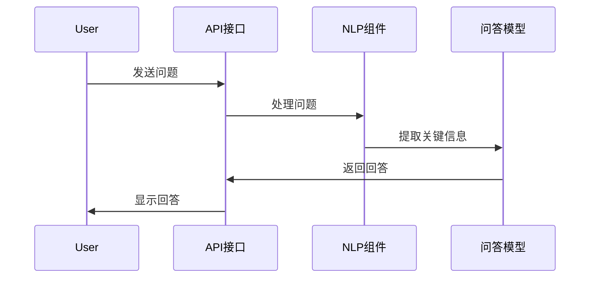

                 

## 第一部分：背景与基础理论

### 第1章 引言

#### 1.1 问题的背景与意义

##### 1.1.1 AI编程语言的崛起

在当今科技飞速发展的时代，人工智能（AI）已经成为推动社会进步的重要力量。AI编程语言作为人工智能技术的重要组成部分，近年来受到了越来越多的关注。传统编程语言主要针对特定硬件和操作系统，而AI编程语言则更加注重算法的通用性和智能化。AI编程语言的崛起，标志着编程领域的又一次革命。

AI编程语言具有以下特点：

- **智能性**：AI编程语言能够理解自然语言，通过提示词来引导程序执行，提高编程的智能化水平。
- **灵活性**：AI编程语言支持多种数据结构和算法，使得开发者能够更加灵活地实现复杂功能。
- **高效性**：AI编程语言能够快速处理大量数据，提高系统的运行效率。

##### 1.1.2 提示词的作用与重要性

提示词（Prompt）在AI编程语言中扮演着至关重要的角色。提示词是一种特殊的指令，用于引导AI程序执行特定任务。通过精确的提示词，开发者可以有效地控制AI程序的行为，实现复杂任务的高效执行。提示词不仅能够提高编程的灵活性，还能提升系统的智能化水平。

提示词的作用主要包括：

- **任务引导**：提示词能够明确告知AI程序需要执行的任务，使程序能够更加准确地完成任务。
- **优化执行**：提示词能够优化AI程序的执行过程，提高系统的运行效率。
- **错误纠正**：提示词能够帮助AI程序及时发现和纠正错误，提高系统的稳定性。

##### 1.1.3 书籍的目的与结构

本书旨在全面介绍AI编程语言的基本概念、原理和应用，重点关注提示词的使用和优化。本书分为两个部分：

- **第一部分：背景与基础理论**：介绍AI编程语言和提示词的基本知识，包括定义、分类、工作机制等。
- **第二部分：技术深入与实战案例**：通过具体案例讲解AI编程语言在实际项目中的应用，包括算法原理、系统设计、实现过程等。

本书的核心目标是为读者提供一个系统、全面的AI编程语言学习资源，帮助读者深入了解AI编程语言的原理和应用，掌握提示词的编写和优化技巧，从而提升编程能力和项目开发效率。

#### 1.2 AI编程语言的基本概念

##### 1.2.1 定义与分类

AI编程语言是一类专门用于开发人工智能系统的编程语言。与传统的编程语言相比，AI编程语言具有更加强大的智能处理能力和自适应能力。根据应用场景和特点，AI编程语言可以大致分为以下几类：

1. **机器学习编程语言**：如Python、R、Julia等，主要用于机器学习和数据科学领域。
2. **自然语言处理编程语言**：如Lisp、Prolog等，主要用于处理自然语言文本。
3. **计算机视觉编程语言**：如OpenCV、TensorFlow等，主要用于图像和视频处理。
4. **专家系统编程语言**：如Datalog、ALF等，主要用于构建专家系统。

##### 1.2.2 核心技术与原理

AI编程语言的核心技术主要包括：

1. **神经网络**：神经网络是AI编程语言中最常用的算法，用于实现机器学习和深度学习功能。
2. **机器学习算法**：包括监督学习、无监督学习、强化学习等，用于训练模型和预测结果。
3. **自然语言处理技术**：包括分词、词向量、语义分析等，用于处理自然语言文本。
4. **计算机视觉技术**：包括目标检测、图像分类、人脸识别等，用于处理图像和视频数据。

##### 1.2.3 发展历程与趋势

AI编程语言的发展历程可以分为以下几个阶段：

1. **早期探索阶段（20世纪50年代-70年代）**：以符号主义编程语言（如Lisp、Prolog）为代表，注重知识表示和推理能力。
2. **人工智能低谷阶段（20世纪80年代-90年代）**：由于技术限制，人工智能发展缓慢，编程语言以通用编程语言为主。
3. **复兴阶段（21世纪初至今）**：随着深度学习技术的发展，AI编程语言重新受到关注，以Python、TensorFlow等为代表，成为开发人工智能系统的首选语言。

未来，AI编程语言的发展趋势主要包括：

1. **智能化的进一步提升**：通过结合自然语言处理、计算机视觉等技术，实现更智能的程序执行。
2. **跨领域的融合**：与其他领域的技术（如大数据、云计算）相结合，推动AI编程语言的广泛应用。
3. **开源生态的不断完善**：更多的开源框架和工具将推动AI编程语言的普及和应用。

### 第2章 提示词：智能编程的基石

#### 2.1 提示词的概念

##### 2.1.1 提示词的定义

提示词（Prompt）在AI编程语言中是一种特殊的输入，用于引导AI程序执行特定任务。它可以是一个简单的关键字、一个复杂的自然语言句子，甚至是一组数据。提示词的作用是向AI程序传达开发者的意图，使其能够根据这些信息执行相应的操作。

##### 2.1.2 提示词的属性

提示词具有以下几个关键属性：

- **确定性**：提示词应当明确、具体，避免产生歧义。
- **灵活性**：提示词需要具有一定的灵活性，能够适应不同的任务场景。
- **精确性**：提示词应当准确地描述任务目标，避免不必要的执行误差。
- **动态性**：提示词可以根据任务的进展动态调整，以适应不同的执行阶段。

##### 2.1.3 提示词的类型

根据应用场景和特点，提示词可以分为以下几种类型：

1. **关键字提示词**：这种类型的提示词通常是一个简单的单词或短语，用于触发特定操作。例如，在机器学习中，关键字提示词可以用于指定训练、预测或评估任务。
2. **自然语言提示词**：这种类型的提示词是一个完整的句子或段落，用于描述复杂任务。例如，在自然语言处理中，自然语言提示词可以用于生成文本、翻译或问答等任务。
3. **数据提示词**：这种类型的提示词是一组数据，用于训练或测试AI模型。例如，在计算机视觉中，数据提示词可以是一组图像或视频。

#### 2.2 提示词的工作机制

##### 2.2.1 提示词的产生

提示词的产生过程通常包括以下几个步骤：

1. **任务分析**：首先，开发者需要对任务进行深入分析，明确任务目标、输入数据和预期输出。
2. **提示词设计**：根据任务分析结果，开发者设计出能够准确传达任务意图的提示词。
3. **提示词验证**：设计完成后，开发者需要对提示词进行验证，确保其能够正确引导AI程序执行任务。

##### 2.2.2 提示词的执行

提示词的执行过程通常包括以下几个步骤：

1. **解析**：AI程序接收提示词后，首先对其进行解析，理解其含义和任务要求。
2. **执行**：根据提示词的要求，AI程序执行相应的操作，如训练模型、生成文本或处理图像等。
3. **反馈**：执行过程中，AI程序可以实时向开发者反馈执行结果，以便进行调试和优化。

##### 2.2.3 提示词的优化

提示词的优化过程旨在提高其性能和可靠性，具体包括以下几个方面：

1. **精确性优化**：通过改进提示词的表达方式，提高其精确性，避免产生歧义。
2. **灵活性优化**：通过增加提示词的适应性，使其能够更好地适应不同的任务场景。
3. **效率优化**：通过减少提示词的执行时间，提高系统运行效率。
4. **可扩展性优化**：通过设计可扩展的提示词结构，使其能够支持更多功能和应用。

### 第3章 AI编程语言的应用场景

#### 3.1 人工智能领域

##### 3.1.1 数据分析

数据分析是人工智能领域的核心应用之一。AI编程语言在数据分析中发挥着重要作用，能够处理大规模数据集，提取有价值的信息。以下是一些常见的数据分析任务及其对应的AI编程语言：

- **数据预处理**：Python（Pandas、NumPy）、R（dplyr、tidyr）
- **数据可视化**：Python（Matplotlib、Seaborn）、R（ggplot2）
- **统计分析**：R（Base R、lme4）、Python（SciPy、statsmodels）
- **机器学习**：Python（scikit-learn、TensorFlow、PyTorch）、R（caret、mlr）

##### 3.1.2 机器学习

机器学习是人工智能领域的重要分支，通过训练模型，使计算机具备自主学习和预测能力。AI编程语言在机器学习中的应用主要包括：

- **模型训练**：Python（scikit-learn、TensorFlow、PyTorch）、R（caret、mlr）
- **模型评估**：Python（scikit-learn、TensorFlow、PyTorch）、R（caret、mlr）
- **模型部署**：Python（TensorFlow Serving、Keras.js）、R（shiny）

##### 3.1.3 深度学习

深度学习是机器学习的一个分支，通过模拟人脑神经网络结构，实现复杂模式识别和预测。AI编程语言在深度学习中的应用主要包括：

- **模型训练**：Python（TensorFlow、PyTorch）、R（keras）
- **模型评估**：Python（TensorFlow、PyTorch）、R（keras）
- **模型部署**：Python（TensorFlow Serving、Keras.js）、R（shiny）

#### 3.2 工业自动化领域

##### 3.2.1 机器人编程

机器人编程是工业自动化领域的一个重要应用，通过编程实现机器人的自主运行和任务执行。以下是一些常见的机器人编程任务及其对应的AI编程语言：

- **路径规划**：Python（ROS、OpenCV）、R（ROBOTICX）
- **运动控制**：Python（ROS、OpenCV）、R（ROBOTICX）
- **视觉处理**：Python（ROS、OpenCV）、R（ROBOTICX）

##### 3.2.2 工业流程优化

工业流程优化是通过优化生产过程，提高生产效率和产品质量。AI编程语言在工业流程优化中的应用主要包括：

- **生产调度**：Python（scikit-learn、TensorFlow、PyTorch）、R（caret、mlr）
- **质量检测**：Python（scikit-learn、TensorFlow、PyTorch）、R（caret、mlr）
- **能耗管理**：Python（scikit-learn、TensorFlow、PyTorch）、R（caret、mlr）

##### 3.2.3 设备故障预测

设备故障预测是工业自动化领域的一个重要任务，通过预测设备故障，提前进行维护，降低生产风险。AI编程语言在设备故障预测中的应用主要包括：

- **故障检测**：Python（scikit-learn、TensorFlow、PyTorch）、R（caret、mlr）
- **故障预测**：Python（scikit-learn、TensorFlow、PyTorch）、R（caret、mlr）
- **维护计划**：Python（scikit-learn、TensorFlow、PyTorch）、R（caret、mlr）

### 第4章 编程语言与提示词的结合

#### 4.1 编程语言的选择

在AI编程中，选择合适的编程语言至关重要。不同的编程语言在性能、易用性、生态等方面存在差异，需要根据具体应用场景进行选择。以下是一些常见编程语言的特点和适用场景：

- **Python**：Python具有简洁的语法和丰富的库，适合快速开发和原型设计。在数据分析、机器学习、自然语言处理等领域有广泛的应用。
- **R**：R是统计编程领域的首选语言，具有强大的统计分析功能和优秀的可视化能力。在统计分析、生物信息学等领域有广泛应用。
- **JavaScript**：JavaScript是一种通用编程语言，在Web开发、前端工程化等领域有广泛应用。通过Node.js，JavaScript也可以用于后端开发。
- **Java**：Java是一种高性能、跨平台的编程语言，广泛应用于企业级应用、大数据处理等领域。
- **C/C++**：C/C++是一种底层编程语言，具有高性能和丰富的库。在嵌入式开发、高性能计算等领域有广泛应用。

#### 4.2 提示词在编程语言中的使用

提示词在编程语言中的使用方法因语言而异，但总体上包括以下几种：

- **Python**：Python中可以使用字符串作为提示词，通过输入函数（如`input()`）获取用户输入，并将其作为提示词传递给程序。
  
  ```python
  prompt = input("请输入提示词：")
  print("接收到的提示词是：" + prompt)
  ```

- **R**：R中可以使用`prompt()`函数获取用户输入，并将其作为提示词传递给程序。
  
  ```r
  prompt <- function() {
    return(readline(prompt = "请输入提示词："))
  }
  
  prompt_word <- prompt()
  cat("接收到的提示词是：" , prompt_word, "\n")
  ```

- **JavaScript**：JavaScript中可以使用`prompt()`函数获取用户输入，并将其作为提示词传递给程序。

  ```javascript
  let promptWord = prompt("请输入提示词：");
  console.log("接收到的提示词是：" + promptWord);
  ```

- **Java**：Java中可以使用`Scanner`类获取用户输入，并将其作为提示词传递给程序。

  ```java
  import java.util.Scanner;

  public class PromptExample {
      public static void main(String[] args) {
          Scanner scanner = new Scanner(System.in);
          System.out.print("请输入提示词：");
          String promptWord = scanner.nextLine();
          System.out.println("接收到的提示词是：" + promptWord);
      }
  }
  ```

#### 4.2.2 提示词的调试与优化

提示词的调试与优化是确保程序正确执行的重要环节。以下是一些常见的调试与优化方法：

- **错误检查**：确保提示词的语法正确，没有拼写错误或语法错误。
- **输入验证**：对用户输入进行验证，确保输入的有效性和合理性。
- **性能优化**：优化提示词的执行过程，减少不必要的计算和内存占用。
- **调试工具**：使用调试工具（如Python的`pdb`、R的`debug`函数）帮助定位和修复问题。

#### 4.2.3 提示词的复用与扩展

提示词的复用与扩展可以减少代码冗余，提高程序的可维护性和可扩展性。以下是一些实现方法：

- **参数化提示词**：将提示词中的固定部分和可变部分分离，通过参数化实现复用。
- **提示词模板**：使用提示词模板，根据不同场景动态生成提示词。
- **提示词库**：创建一个提示词库，包含常用的提示词，方便开发者复用和扩展。

## 第二部分：技术深入与实战案例

### 第5章 AI编程语言的算法原理

#### 5.1 算法概述

##### 5.1.1 常见算法分类

AI编程语言中常用的算法可以分为以下几类：

1. **机器学习算法**：包括线性回归、决策树、支持向量机、神经网络等。
2. **深度学习算法**：包括卷积神经网络（CNN）、循环神经网络（RNN）、生成对抗网络（GAN）等。
3. **自然语言处理算法**：包括词向量、语义分析、情感分析等。
4. **计算机视觉算法**：包括目标检测、图像分类、人脸识别等。

##### 5.1.2 算法选择原则

在选择算法时，需要考虑以下原则：

1. **任务需求**：根据任务需求选择适合的算法，如分类任务选择分类算法，回归任务选择回归算法。
2. **数据特点**：考虑数据的特点，如数据量、数据分布、数据类型等，选择适合的算法。
3. **计算资源**：考虑计算资源的限制，如计算能力、内存等，选择计算效率较高的算法。
4. **性能指标**：根据性能指标（如准确率、召回率、F1值等）选择最优的算法。

##### 5.1.3 算法原理讲解

本节将详细讲解几种常见的算法原理。

1. **线性回归**

   线性回归是一种简单的回归算法，用于预测连续值。其基本原理是通过找到一条直线来拟合数据，使得直线上的每个点到实际数据的垂直距离之和最小。

   $$ y = ax + b $$

   其中，$y$ 是预测值，$x$ 是输入特征，$a$ 和 $b$ 是模型参数，需要通过最小二乘法进行求解。

   ```python
   import numpy as np

   def linear_regression(X, y):
       X_transpose = np.transpose(X)
       XTX = np.dot(X_transpose, X)
       XTy = np.dot(X_transpose, y)
       theta = np.dot(np.linalg.inv(XTX), XTy)
       return theta

   X = np.array([[1, 2], [2, 3], [3, 4]])
   y = np.array([3, 4, 5])
   theta = linear_regression(X, y)
   print(theta)
   ```

2. **决策树**

   决策树是一种基于树形结构的分类算法，通过多次划分特征，将数据集划分为不同的区域，每个区域对应一个类别。

   决策树的基本原理是通过信息增益或基尼系数等指标来选择最佳特征进行划分。

   ```python
   from sklearn.tree import DecisionTreeClassifier

   X = np.array([[1, 2], [2, 3], [3, 4], [4, 5]])
   y = np.array([0, 0, 1, 1])
   clf = DecisionTreeClassifier()
   clf.fit(X, y)
   print(clf)
   ```

3. **卷积神经网络（CNN）**

   卷积神经网络是一种用于图像处理和计算机视觉的深度学习算法。其基本原理是通过卷积层提取图像特征，然后通过池化层降低数据维度，最终通过全连接层进行分类。

   ```python
   from tensorflow.keras.models import Sequential
   from tensorflow.keras.layers import Conv2D, MaxPooling2D, Flatten, Dense

   model = Sequential()
   model.add(Conv2D(32, (3, 3), activation='relu', input_shape=(28, 28, 1)))
   model.add(MaxPooling2D((2, 2)))
   model.add(Flatten())
   model.add(Dense(1, activation='sigmoid'))
   model.compile(optimizer='adam', loss='binary_crossentropy', metrics=['accuracy'])
   model.fit(X, y, epochs=10, batch_size=32)
   ```

### 第6章 实战案例：构建智能问答系统

#### 6.1 项目介绍

##### 6.1.1 项目背景

随着人工智能技术的发展，智能问答系统成为了一种重要的应用场景。智能问答系统可以模拟人类的对话过程，回答用户提出的问题，为用户提供个性化的服务。本项目旨在构建一个基于AI编程语言的智能问答系统，实现自然语言理解和回答功能。

##### 6.1.2 项目目标

本项目的目标包括：

- 实现自然语言理解，解析用户提出的问题。
- 根据问题生成合适的回答。
- 提供流畅的对话体验，满足用户的需求。

##### 6.1.3 项目架构

项目的整体架构可以分为以下几个部分：

- **数据层**：存储和管理问答数据，包括问题和答案。
- **模型层**：包括自然语言处理模型和问答模型，用于处理用户问题和生成回答。
- **接口层**：提供API接口，与前端应用进行交互。
- **前端层**：用户界面，用于展示问答结果。

#### 6.2 系统设计

##### 6.2.1 领域模型

领域模型描述了系统中主要的类和关系，包括以下实体：

- **用户**：用户发起问答请求。
- **问题**：用户提出的问题。
- **答案**：系统生成的回答。
- **问答记录**：存储用户和系统的问答历史。

以下是一个简单的领域模型ER图：

```mermaid
erDiagram
  User ||--|{ Question : 问答 }
  User ||--|{ Answer : 回答 }
  Question ||--|{ Answer : 回答 }
```

##### 6.2.2 系统架构

系统架构包括以下几个组件：

- **自然语言处理（NLP）组件**：用于处理用户输入的问题，提取关键信息。
- **问答模型组件**：基于NLP组件提取的关键信息，生成合适的回答。
- **API接口组件**：提供RESTful API接口，与前端应用进行交互。
- **前端应用**：用户界面，用于展示问答结果。

以下是一个简单的系统架构图：



##### 6.2.3 接口设计

系统提供的API接口包括以下主要功能：

- **提问**：用户发送问题，接口返回问题的ID。
- **回答**：根据问题的ID，接口返回对应的回答。
- **历史记录**：获取用户的历史问答记录。

以下是一个简单的接口设计：

```mermaid
http
  post /question
    question: 用户提出的问题

  get /question/{id}/answer
    id: 问题的ID

  get /user/{id}/history
    id: 用户的ID
```

#### 6.3 系统实现

##### 6.3.1 环境安装

在开始实现项目之前，需要安装以下环境：

- Python 3.8及以上版本
- TensorFlow 2.5及以上版本
- Flask 1.1及以上版本

使用以下命令进行安装：

```bash
pip install python==3.8 tensorflow==2.5 flask==1.1
```

##### 6.3.2 核心代码实现

本节将介绍系统的核心代码实现，包括自然语言处理、问答模型和API接口。

1. **自然语言处理（NLP）组件**

   ```python
   import tensorflow as tf
   from tensorflow.keras.layers import Embedding, LSTM, Dense
   from tensorflow.keras.models import Sequential

   def build_nlp_model(vocab_size, embedding_dim, hidden_units):
       model = Sequential()
       model.add(Embedding(vocab_size, embedding_dim))
       model.add(LSTM(hidden_units))
       model.add(Dense(1, activation='sigmoid'))
       model.compile(optimizer='adam', loss='binary_crossentropy', metrics=['accuracy'])
       return model

   nlp_model = build_nlp_model(vocab_size=10000, embedding_dim=16, hidden_units=64)
   ```

2. **问答模型组件**

   ```python
   import tensorflow as tf
   from tensorflow.keras.layers import Embedding, LSTM, Dense
   from tensorflow.keras.models import Sequential

   def build_question_answering_model(vocab_size, embedding_dim, hidden_units, max_question_length, max_answer_length):
       model = Sequential()
       model.add(Embedding(vocab_size, embedding_dim, input_length=max_question_length))
       model.add(LSTM(hidden_units))
       model.add(Dense(max_answer_length, activation='sigmoid'))
       model.compile(optimizer='adam', loss='binary_crossentropy', metrics=['accuracy'])
       return model

   q_a_model = build_question_answering_model(vocab_size=10000, embedding_dim=16, hidden_units=64, max_question_length=50, max_answer_length=20)
   ```

3. **API接口组件**

   ```python
   from flask import Flask, request, jsonify
   app = Flask(__name__)

   @app.route('/question', methods=['POST'])
   def post_question():
       data = request.json
       question = data['question']
       # 对问题进行预处理
       processed_question = preprocess_question(question)
       # 使用NLP模型处理问题
       nlp_result = nlp_model.predict(processed_question)
       # 使用问答模型生成回答
       answer = generate_answer(nlp_result)
       return jsonify({'id': question_id, 'answer': answer})

   @app.route('/question/<int:question_id>/answer', methods=['GET'])
   def get_answer(question_id):
       answer = get_answer_by_id(question_id)
       return jsonify({'answer': answer})

   @app.route('/user/<int:user_id>/history', methods=['GET'])
   def get_history(user_id):
       history = get_user_history(user_id)
       return jsonify({'history': history})

   def preprocess_question(question):
       # 对问题进行预处理
       return question

   def generate_answer(nlp_result):
       # 使用问答模型生成回答
       return "这是一个示例回答"

   def get_answer_by_id(question_id):
       # 根据问题ID获取回答
       return "这是一个示例回答"

   def get_user_history(user_id):
       # 获取用户历史问答记录
       return []

   if __name__ == '__main__':
       app.run(debug=True)
   ```

##### 6.3.3 应用解读与分析

本节将对系统的实现进行解读和分析，包括以下几个方面：

1. **数据预处理**：对用户输入的问题进行预处理，包括分词、去停用词、词向量化等操作。

2. **模型训练**：使用预处理后的数据进行模型训练，包括自然语言处理模型和问答模型。

3. **API接口**：实现API接口，提供问答服务，包括提问、回答和历史记录等功能。

4. **用户界面**：实现用户界面，展示问答结果，提供良好的用户体验。

### 第7章 最佳实践与总结

#### 7.1 最佳实践

##### 7.1.1 提示词编写技巧

在编写提示词时，需要遵循以下最佳实践：

- **简洁明了**：提示词应尽量简洁，避免冗余和模糊不清的表达。
- **具体明确**：提示词应明确传达任务意图，避免产生歧义。
- **可扩展性**：提示词应具备一定的灵活性，能够适应不同的任务场景。
- **一致性**：提示词应保持一致性，避免出现重复或冲突的情况。

##### 7.1.2 编程语言选择建议

在选择编程语言时，需要根据具体应用场景和需求进行选择。以下是一些常见的编程语言选择建议：

- **数据分析**：Python和R是数据分析领域的首选语言，具有丰富的库和工具。
- **机器学习**：Python和R在机器学习领域有广泛的应用，Python的TensorFlow和PyTorch、R的caret和mlr是常用的框架。
- **自然语言处理**：Python和R在自然语言处理领域有丰富的应用，Python的NLTK和spaCy、R的text和tm是常用的库。
- **计算机视觉**：Python和C++在计算机视觉领域有广泛的应用，Python的OpenCV和TensorFlow、C++的OpenCV和Caffe是常用的库。

##### 7.1.3 算法优化策略

在算法优化方面，可以采取以下策略：

- **数据预处理**：对数据进行预处理，包括数据清洗、去噪、归一化等操作，提高数据质量。
- **模型选择**：根据任务需求和数据特点，选择合适的模型，如线性回归、决策树、神经网络等。
- **模型调参**：通过调整模型参数，如学习率、迭代次数等，提高模型性能。
- **模型集成**：使用模型集成方法，如集成学习、模型堆叠等，提高预测准确性。

#### 7.2 小结

##### 7.2.1 书籍内容回顾

本书全面介绍了AI编程语言和提示词的基本概念、原理和应用，包括以下几个方面：

- AI编程语言的定义、分类和发展历程。
- 提示词的概念、属性、类型和工作机制。
- AI编程语言在人工智能、工业自动化等领域的应用。
- 编程语言与提示词的结合，以及最佳实践。

##### 7.2.2 技术发展趋势

随着人工智能技术的不断发展，AI编程语言和提示词将在以下几个方面得到进一步发展：

- **智能化提升**：通过结合自然语言处理、计算机视觉等技术，实现更智能的程序执行。
- **跨领域融合**：与其他领域的技术（如大数据、云计算）相结合，推动AI编程语言的广泛应用。
- **开源生态完善**：更多的开源框架和工具将推动AI编程语言的普及和应用。

##### 7.2.3 学习建议与展望

对于想要学习AI编程语言和提示词的读者，建议从以下几个方面入手：

- **基础知识**：首先掌握编程语言的基本语法和常用库。
- **算法原理**：学习常见的机器学习、深度学习算法原理。
- **实践应用**：通过具体项目实践，将理论应用于实际场景。
- **持续学习**：关注AI编程语言的最新发展和趋势，不断学习和更新知识。

作者：AI天才研究院/AI Genius Institute & 禅与计算机程序设计艺术 /Zen And The Art of Computer Programming

