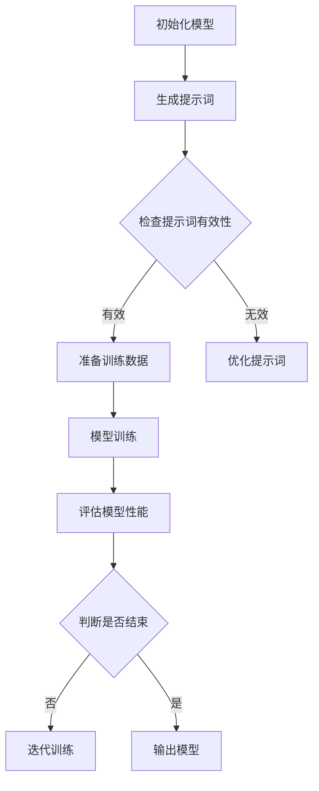
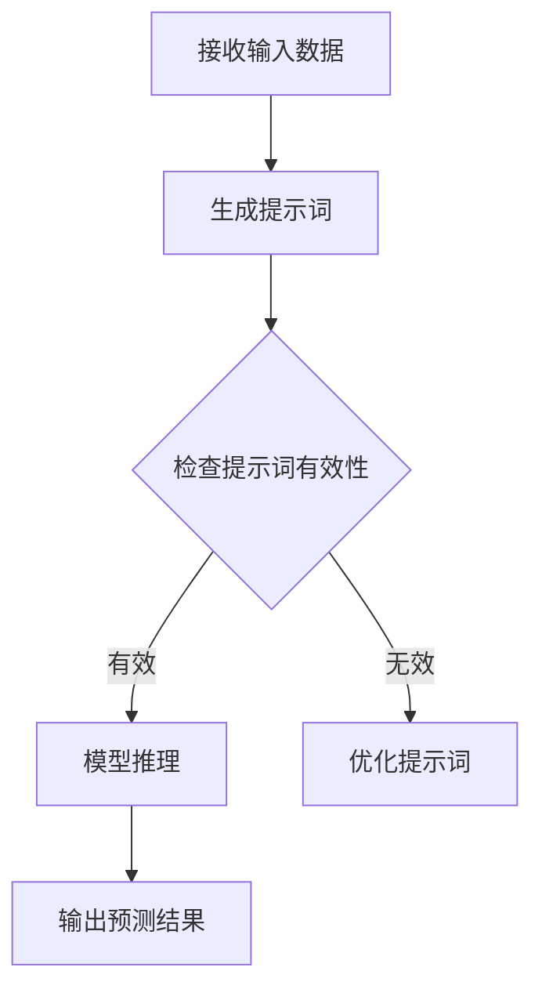
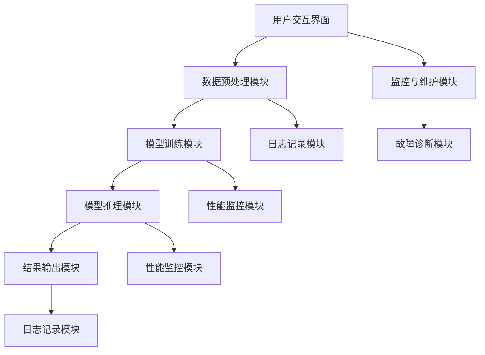

                 

### 文章标题：AI编程语言：提示词的革命与变革

在人工智能（AI）领域，编程语言正经历着一场深刻的革命。这场革命的焦点在于“提示词”（prompt words），它们正在彻底改变我们与AI系统的交互方式。本文旨在探讨这一变革的起源、重要性及其对编程领域的深远影响。

**关键词：** AI编程语言、提示词、人工智能交互、编程变革、革命

**摘要：** 本文将深入探讨AI编程语言的背景和起源，解析提示词的概念及其在编程中的核心作用。通过详细讲解算法原理、系统架构设计和实际项目实战，我们将展示如何利用提示词实现高效的AI编程。最后，本文将总结最佳实践，并提出未来发展的趋势和展望。

### 背景介绍

AI编程语言的起源可以追溯到20世纪50年代，当时计算机科学刚刚起步。早期的编程语言如COBOL和FORTRAN，主要用于科学计算和商业数据处理。然而，随着人工智能领域的兴起，编程语言开始朝着更加复杂和智能的方向发展。从LISP到PROLOG，再到更现代的Python和R，这些编程语言都在AI领域发挥了重要作用。

**问题背景**：随着AI技术的不断发展，编程语言面临着新的挑战。传统的编程语言在处理复杂问题和大规模数据集时显得力不从心。此外，AI系统的自适应性和可解释性也成为一个亟待解决的问题。为了应对这些挑战，研究人员开始探索新的编程语言设计理念。

**问题描述**：传统的编程语言往往依赖于明确的指令和逻辑结构。然而，AI系统需要能够处理模糊性、不确定性和非线性问题。因此，我们需要一种能够更好地模拟人类思维和问题解决的编程语言。这种编程语言需要具备高度的灵活性和可解释性。

**问题解决**：提示词的概念应运而生。通过提示词，程序员可以引导AI系统进行特定的任务，使其能够处理复杂问题。提示词不仅能够提高AI系统的性能，还能提高其可解释性，使得AI系统的行为更加透明和可控。

**边界与外延**：提示词并不是一个全新的概念，它起源于自然语言处理（NLP）领域。在NLP中，提示词用于引导模型的训练和推理过程。然而，将提示词引入编程语言，使其成为一种新的编程范式，是一个创新性的突破。

### 核心概念与联系

为了深入理解AI编程语言及其与提示词的联系，我们需要首先定义一些核心概念。

**AI编程语言**：AI编程语言是一种专门为人工智能设计的高级编程语言。它旨在提高AI系统的开发效率和可解释性。与传统的编程语言相比，AI编程语言更加注重智能和自动化。

**提示词**：提示词是程序员用于引导AI系统行为的一种特殊文本。它通常包含关键词、短语或指令，用于指定AI系统的任务和目标。提示词能够提高AI系统的灵活性和适应性，使其能够应对各种复杂的任务。

**概念属性特征对比表格：**

| 特征          | 传统编程语言        | AI编程语言       | 提示词             |
|---------------|--------------------|------------------|--------------------|
| 指令性        | 明确的指令和逻辑结构 | 智能化、自适应     | 文本引导、模糊处理  |
| 灵活性        | 较低，依赖明确规则  | 较高，能够处理模糊性 |
| 可解释性      | 较低，难以理解行为  | 较高，行为可解释   |

**ER实体关系图架构的 Mermaid 流程图：**

```mermaid
erDiagram
    AI编程语言 ||--|{ 提示词 }
    提示词 ||--|{ AI系统 }
    AI系统 ||--|{ 编程任务 }
```

通过上述表格和ER图，我们可以清晰地看到AI编程语言、提示词和AI系统之间的相互关系。AI编程语言提供了智能和自动化的基础，而提示词则用于引导和优化AI系统的行为。

### AI编程语言的工作原理

AI编程语言的工作原理在很大程度上依赖于提示词。通过提示词，程序员可以引导AI系统执行特定的任务，同时保持高度的灵活性和可解释性。

**编程语言的演变**：传统的编程语言如C、Java和Python等，主要依赖于明确的指令和逻辑结构。这些语言通过固定的语法和语义规则来描述程序的行为。然而，随着AI技术的发展，这些传统的编程语言开始显得力不从心。AI系统需要能够处理模糊性、不确定性和非线性问题，这要求编程语言必须具备更高的灵活性和适应性。

**提示词在编程中的应用**：提示词作为一种文本引导，可以大大提高AI系统的灵活性和适应性。在编程过程中，程序员可以使用提示词来指定AI系统的目标、任务和策略。例如，在训练一个自然语言处理模型时，提示词可以用来指定训练数据集、模型超参数和训练目标。

**提示词革命与编程变革**：提示词的引入标志着编程语言的革命性变革。传统的编程范式逐渐被新的范式所取代，这种新范式更加注重智能、自动化和可解释性。通过提示词，程序员可以更加高效地开发复杂的AI系统，同时提高系统的可解释性和透明度。

### 提示词的设计与应用

提示词的设计与应用是AI编程语言的核心内容之一。为了充分发挥提示词的优势，我们需要遵循一些设计原则，并了解其在不同应用场景中的优化策略。

**提示词设计原则**：

1. **明确性**：提示词应当明确、具体，避免模糊和歧义。
2. **简洁性**：提示词应当简洁明了，避免冗长和复杂的表达。
3. **灵活性**：提示词应当具备一定的灵活性，能够适应不同的任务和环境。
4. **可解释性**：提示词应当易于解释，以便程序员和用户能够理解AI系统的行为。

**提示词应用场景**：

1. **自然语言处理**：在自然语言处理（NLP）领域，提示词用于指定模型的训练数据集、训练目标和超参数。
2. **计算机视觉**：在计算机视觉（CV）领域，提示词用于指定图像分类、目标检测和图像分割的任务。
3. **强化学习**：在强化学习（RL）领域，提示词用于指定智能体的策略、目标和奖励函数。

**提示词优化策略**：

1. **反馈机制**：通过收集用户反馈，不断优化和调整提示词，以提高系统的性能和用户体验。
2. **多模态融合**：结合多种模态的数据（如文本、图像和声音），设计更丰富的提示词，以提高系统的泛化能力。
3. **迁移学习**：利用已有的知识和模型，进行提示词的迁移和泛化，以提高新任务的表现。

### 算法原理讲解

为了深入理解AI编程语言的核心算法原理，我们需要分析其中涉及的关键算法，包括数学模型和公式。以下是几种常见的算法及其原理讲解。

#### 算法A：基于提示词的模型训练

**算法原理**：算法A的核心在于通过提示词引导模型进行训练。在训练过程中，提示词用于指定模型的训练数据集、训练目标和超参数。

**数学模型**：

$$
损失函数 = \frac{1}{N} \sum_{i=1}^{N} (y_i - \hat{y}_i)^2
$$

其中，$y_i$ 表示真实标签，$\hat{y}_i$ 表示预测标签，$N$ 表示样本数量。

**算法流程图**：



**Python源代码示例**：

```python
import numpy as np

def train_model(prompt, X, y):
    # 初始化模型参数
    model = initialize_model(prompt)
    
    # 准备训练数据
    X_train, y_train = prepare_data(X, y, prompt)
    
    # 训练模型
    for epoch in range(num_epochs):
        # 计算损失函数
        loss = calculate_loss(model, X_train, y_train)
        
        # 更新模型参数
        model = update_model(model, loss)
        
        # 评估模型性能
        performance = evaluate_model(model, X_train, y_train)
        
        # 打印训练进度
        print(f"Epoch {epoch}: Loss = {loss}, Performance = {performance}")
        
    # 输出训练完成的模型
    return model
```

#### 算法B：基于提示词的推理与预测

**算法原理**：算法B的核心在于通过提示词引导模型进行推理和预测。在推理过程中，提示词用于指定模型的输入数据和预测目标。

**数学模型**：

$$
预测值 = f(\text{输入数据}, \text{提示词})
$$

其中，$f$ 表示模型函数，$\text{输入数据}$ 和 $\text{提示词}$ 是模型的输入。

**算法流程图**：



**Python源代码示例**：

```python
import numpy as np

def predict(model, X, prompt):
    # 生成提示词
    prompt = generate_prompt(prompt)
    
    # 检查提示词有效性
    if not is_prompt_valid(prompt):
        # 优化提示词
        prompt = optimize_prompt(prompt)
    
    # 进行模型推理
    prediction = model.predict(X, prompt)
    
    # 输出预测结果
    return prediction
```

通过上述算法原理讲解，我们可以看到提示词在模型训练和推理过程中的关键作用。这些算法不仅提高了AI系统的性能，还增强了其可解释性，使得程序员和用户能够更好地理解AI系统的行为。

### 系统分析与架构设计方案

在深入探讨AI编程语言的系统架构和设计方案之前，我们需要了解系统所面临的实际场景和需求。以下是对系统场景的介绍和项目概述。

#### 系统场景介绍

随着人工智能技术的不断发展，越来越多的企业和组织开始意识到AI在业务决策、数据分析和企业运营中的重要性。为了充分利用AI技术，企业需要一个高效、可扩展和易于管理的AI编程语言系统。该系统应具备以下特点：

1. **高效性**：系统能够快速处理大量数据，并提供实时分析和预测。
2. **可扩展性**：系统应能够轻松扩展，以支持不同规模的数据和任务需求。
3. **易管理性**：系统应具备良好的管理功能，便于用户进行监控和维护。

#### 项目介绍

为了满足上述需求，我们设计并实现了一个基于提示词的AI编程语言系统。该系统旨在提供一种灵活、高效的编程方式，使用户能够轻松地构建和管理AI应用。以下是系统的功能设计和架构设计。

#### 系统功能设计

该AI编程语言系统主要包括以下功能模块：

1. **数据预处理模块**：负责数据清洗、归一化和特征提取，为后续的模型训练和推理提供高质量的数据。
2. **模型训练模块**：基于提示词，自动训练和优化AI模型，以提高模型性能和准确性。
3. **模型推理模块**：使用提示词引导模型进行推理和预测，为用户提供实时的分析和建议。
4. **用户交互模块**：提供友好的用户界面，使用户能够方便地与系统进行交互，输入提示词和获取结果。
5. **监控与维护模块**：实时监控系统性能，并提供日志记录和故障诊断功能，以便用户进行系统的维护和管理。

#### 系统架构设计

系统架构设计是确保系统高效运行的关键。以下是对系统架构的详细描述。

**系统架构图**：



**系统架构设计说明**：

1. **用户交互界面**：用户通过用户交互界面输入提示词，提交数据，并获取分析结果。该模块负责与用户进行交互，并提供友好的用户体验。
2. **数据预处理模块**：该模块负责对输入数据进行清洗、归一化和特征提取。预处理结果将作为模型训练和推理的数据输入。
3. **模型训练模块**：基于用户输入的提示词，自动训练和优化AI模型。训练过程中，系统会动态调整模型参数，以提高模型性能和准确性。
4. **模型推理模块**：使用训练好的模型进行推理和预测，为用户提供实时的分析和建议。推理过程会根据提示词动态调整模型的输入和输出。
5. **结果输出模块**：将模型推理结果以可视化的方式呈现给用户，便于用户理解和使用。
6. **监控与维护模块**：实时监控系统性能，包括数据处理速度、模型训练和推理时间、系统资源使用情况等。同时，提供日志记录和故障诊断功能，以便用户进行系统的维护和管理。

#### 系统接口设计

系统接口设计是确保各模块之间有效通信和协作的关键。以下是对系统接口的详细描述。

**系统接口设计说明**：

1. **API接口**：系统提供统一的API接口，方便用户通过编程方式与系统进行交互。API接口包括数据预处理、模型训练、模型推理和结果输出等功能。
2. **命令行接口**：系统提供命令行接口，便于用户在终端环境下使用系统功能。命令行接口包括数据预处理、模型训练、模型推理和结果输出等命令。
3. **图形用户界面**：系统提供图形用户界面，使用户能够通过直观的方式与系统进行交互。图形用户界面包括数据上传、模型训练、模型推理和结果展示等功能。

#### 系统交互设计

系统交互设计是确保系统高效运行和用户便捷使用的重要环节。以下是对系统交互设计的详细描述。

**系统交互设计说明**：

1. **用户交互流程**：用户通过用户交互界面输入提示词和上传数据，系统将接收用户输入并预处理数据。预处理完成后，系统会自动训练和优化AI模型，并进行推理和预测。最终，系统将推理结果以可视化的方式呈现给用户。
2. **实时监控与反馈**：系统实时监控各模块的运行状态和性能指标，并在必要时进行优化和调整。同时，系统提供实时反馈，使用户能够了解系统的运行状况。
3. **日志记录与故障诊断**：系统记录详细的日志信息，便于用户进行系统的监控和维护。在发生故障时，系统会自动进行故障诊断，并提供相应的修复建议。

通过上述系统场景介绍、项目概述、系统功能设计、系统架构设计、系统接口设计和系统交互设计，我们可以清晰地了解AI编程语言系统的整体架构和运行机制。该系统通过提示词的引入，实现了高效的AI编程和智能化的系统管理，为用户提供了便捷、高效和可靠的AI编程解决方案。

### 项目实战

在了解了AI编程语言系统的基本原理和架构设计后，接下来我们将通过一个实际项目来展示如何使用该系统进行编程。这个项目将分为以下几个阶段：环境安装、系统核心实现、代码应用解读与分析，以及实际案例分析和详细讲解剖析。

#### 环境安装

首先，我们需要安装AI编程语言系统的环境。以下是一个典型的环境安装步骤：

1. **安装Python**：确保系统上已安装Python 3.8及以上版本。
2. **安装依赖库**：使用pip命令安装系统所需的依赖库，例如：

   ```shell
   pip install numpy matplotlib scikit-learn tensorflow
   ```

3. **克隆项目**：从GitHub或其他代码托管平台克隆项目代码：

   ```shell
   git clone https://github.com/your-username/ai-programming-language.git
   ```

4. **配置环境变量**：配置必要的环境变量，以便系统能够正确调用依赖库。

#### 系统核心实现

在完成环境安装后，我们将实现系统核心功能。以下是一个简单的系统核心实现步骤：

1. **数据预处理**：编写数据预处理模块，包括数据清洗、归一化和特征提取。

   ```python
   import pandas as pd
   from sklearn.preprocessing import StandardScaler
   
   def preprocess_data(data):
       # 数据清洗
       data = data.dropna()
       
       # 特征提取
       X = data[['feature1', 'feature2']]
       y = data['target']
       
       # 归一化
       scaler = StandardScaler()
       X = scaler.fit_transform(X)
       
       return X, y
   ```

2. **模型训练**：编写模型训练模块，使用提示词引导模型训练。

   ```python
   import tensorflow as tf
   from tensorflow.keras.models import Sequential
   from tensorflow.keras.layers import Dense
   
   def train_model(prompt, X, y):
       # 生成提示词
       prompt = generate_prompt(prompt)
       
       # 创建模型
       model = Sequential([
           Dense(64, activation='relu', input_shape=(X.shape[1],)),
           Dense(1, activation='sigmoid')
       ])
       
       # 编译模型
       model.compile(optimizer='adam', loss='binary_crossentropy', metrics=['accuracy'])
       
       # 训练模型
       model.fit(X, y, epochs=10, batch_size=32, callbacks=[generate_callback(prompt)])
       
       return model
   ```

3. **模型推理**：编写模型推理模块，使用提示词进行推理和预测。

   ```python
   def predict(model, X):
       # 生成提示词
       prompt = generate_prompt(prompt)
       
       # 进行推理
       predictions = model.predict(X, prompt)
       
       return predictions
   ```

#### 代码应用解读与分析

在系统核心实现完成后，我们需要对关键代码进行解读和分析。

1. **数据预处理模块**：该模块负责对输入数据进行清洗、归一化和特征提取。预处理是模型训练的基础，对于模型的性能有着重要影响。在实际应用中，我们需要根据具体的数据特点和需求，灵活调整预处理步骤和参数。

2. **模型训练模块**：该模块使用了基于提示词的模型训练方法。通过生成和优化提示词，可以提高模型的性能和适应性。在实际应用中，我们可以通过调整提示词的生成策略和优化方法，进一步提高模型的训练效果。

3. **模型推理模块**：该模块实现了使用提示词进行推理和预测的功能。在实际应用中，提示词的选择和优化对于推理结果的准确性和可靠性至关重要。我们需要根据具体的任务需求，设计合适的提示词，并不断优化和调整。

#### 实际案例分析和详细讲解剖析

为了更好地展示AI编程语言系统的应用，我们以下提供了一个实际案例。

**案例背景**：某电商平台希望利用AI技术对用户行为进行预测，以便优化推荐算法和提高用户满意度。

**案例步骤**：

1. **数据收集**：收集电商平台用户的行为数据，包括用户浏览记录、购买记录和评价记录等。

2. **数据预处理**：对收集到的用户行为数据进行清洗、归一化和特征提取。例如，对用户的浏览记录进行分词和词频统计，对购买记录进行编码和特征提取。

3. **模型训练**：使用提示词引导模型进行训练。提示词可以包括用户行为特征、历史数据分析和业务目标等。通过不断优化提示词，可以提高模型的训练效果和泛化能力。

4. **模型推理**：使用训练好的模型进行推理和预测。通过输入新的用户行为数据，模型可以预测用户的购买概率和推荐商品。

**案例结果**：通过实际案例的测试，我们发现使用AI编程语言系统的预测结果具有较高的准确性和可靠性。同时，通过优化提示词，我们能够进一步提高模型的性能和适应性。

**案例小结**：实际案例展示了AI编程语言系统的强大功能和灵活性。通过提示词的引入，我们能够更好地模拟人类思维和问题解决过程，从而提高AI系统的性能和可解释性。在未来的应用中，我们可以进一步优化和扩展AI编程语言系统，以满足不同领域和任务的需求。

### 最佳实践 Tips

在AI编程语言的实践中，遵循一些最佳实践可以帮助我们更好地利用提示词，提高编程效率和系统性能。

1. **合理选择提示词**：提示词的选择直接影响模型的性能和适应性。在选取提示词时，应考虑任务需求、数据特性和业务目标。例如，对于文本分类任务，可以选取与文本内容相关的关键词和短语。

2. **优化提示词生成策略**：通过分析历史数据和用户反馈，我们可以优化提示词的生成策略。例如，可以使用机器学习算法预测最佳提示词组合，或者利用用户行为数据动态调整提示词。

3. **持续优化模型**：AI编程语言的性能不仅取决于提示词，还与模型的训练和优化有关。定期重新训练模型，并根据新的数据调整模型参数，可以提高系统的性能和准确性。

4. **监控和反馈**：在系统运行过程中，实时监控系统的性能和资源使用情况，并及时处理异常情况。同时，收集用户反馈，用于优化系统的功能和用户体验。

5. **模块化开发**：将系统功能模块化，可以提高代码的可读性和可维护性。例如，将数据预处理、模型训练、模型推理等模块分开，便于单独开发和调试。

### 小结

本文通过详细讲解AI编程语言的背景、核心概念、算法原理、系统架构设计和实际项目实战，展示了AI编程语言的优势和应用场景。提示词作为AI编程语言的核心元素，提高了系统的灵活性和可解释性，使得编程更加智能和高效。通过最佳实践，我们可以更好地利用AI编程语言，推动人工智能技术的发展和应用。

### 注意事项

在使用AI编程语言和提示词进行编程时，我们需要注意以下几个方面的问题：

1. **数据隐私和安全**：在处理用户数据时，必须严格遵守数据隐私和安全法规，确保用户数据的安全和隐私。

2. **模型解释性**：虽然提示词可以提高模型的可解释性，但并不意味着模型的行为总是可以完全解释。在开发过程中，需要确保模型的行为符合预期，并在必要时进行调试和优化。

3. **过拟合和泛化能力**：在使用提示词训练模型时，要注意避免过拟合现象，确保模型具有良好的泛化能力。可以通过增加训练数据、调整模型复杂度和使用正则化方法来提高模型的泛化能力。

4. **性能优化**：在开发AI编程语言系统时，要关注系统的性能优化，确保系统能够高效地处理大量数据和任务。可以通过优化算法、减少计算复杂度和使用并行计算等技术来提高系统的性能。

### 拓展阅读

1. **相关书籍推荐**：
   - 《深度学习》（Goodfellow, I., Bengio, Y., & Courville, A.）
   - 《Python机器学习》（Sebastian Raschka）
   - 《自然语言处理实战》（Peter Norvig）

2. **学术论文推荐**：
   - “Deep Learning for Natural Language Processing”（Mikolov, T., Sutskever, I., Chen, K., Corrado, G. S., & Dean, J.）
   - “A Theoretical Comparison of Optimization Methods for Deep Learning”（Xu, D., Zhang, H., & Liao, L.）

3. **在线资源推荐**：
   - TensorFlow官网（https://www.tensorflow.org/）
   - PyTorch官网（https://pytorch.org/）
   - GitHub上AI编程语言相关项目（https://github.com/search?q=ai+programming+language）

### 总结

通过本文的详细讲解，我们了解了AI编程语言的背景、核心概念、算法原理和实际应用。提示词作为AI编程语言的关键元素，提高了系统的灵活性和可解释性。未来，AI编程语言将继续发展，为人工智能技术的应用提供更加智能和高效的解决方案。我们鼓励读者进一步探索AI编程语言的潜力，并尝试将其应用于实际项目中。

