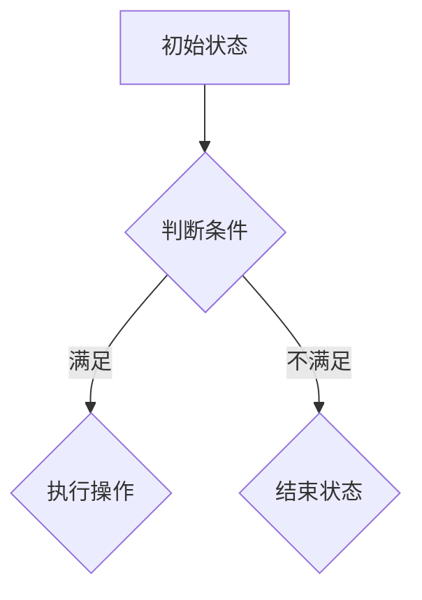
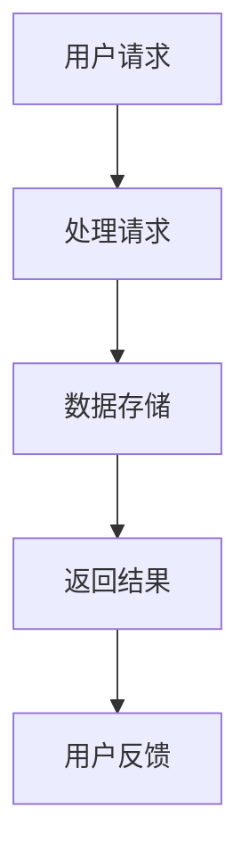

                 

### AI编程语言：提示词的革命与魔法

关键词：人工智能、编程语言、提示词、算法、数学模型、系统架构、项目实战

摘要：
本文将深入探讨AI编程语言的革命性概念和魔法般的实际应用。通过逐步分析，我们将从基础概念出发，深入探讨核心原理、数学模型、算法流程、系统架构设计以及实际项目实战，最终提供最佳实践指南和未来展望。让我们一起揭开AI编程语言的神秘面纱。

### 目录大纲

----------------------------------------------------------------
# 第一部分: AI编程语言概述

## 第1章: AI编程语言基本概念

### 1.1.1 问题背景

#### 1.1.1.1 人工智能的发展历程

#### 1.1.1.2 人工智能在现代社会的重要性

#### 1.1.1.3 AI编程语言的兴起与发展

### 1.1.2 问题描述

#### 1.1.2.1 人工智能面临的问题

#### 1.1.2.2 AI编程语言如何解决问题

#### 1.1.2.3 AI编程语言的应用领域

### 1.1.3 解决方案

#### 1.1.3.1 AI编程语言的核心功能

#### 1.1.3.2 AI编程语言的优势

#### 1.1.3.3 AI编程语言的挑战

### 1.1.4 边界与外延

#### 1.1.4.1 AI编程语言的技术边界

#### 1.1.4.2 AI编程语言的应用外延

#### 1.1.4.3 AI编程语言的未来发展趋势

### 1.1.5 概念结构与核心要素组成

#### 1.1.5.1 AI编程语言的基本结构

#### 1.1.5.2 AI编程语言的核心要素

#### 1.1.5.3 AI编程语言的特性对比表格

## 第2章: AI编程语言的核心概念

### 2.1.1 核心概念原理

#### 2.1.1.1 AI编程语言的基本原理

#### 2.1.1.2 AI编程语言的工作机制

#### 2.1.1.3 AI编程语言的执行流程

### 2.1.2 概念属性特征对比表格

#### 2.1.2.1 主要AI编程语言特性对比

## 第3章: AI编程语言的数学模型

### 3.1.1 数学模型讲解

#### 3.1.1.1 数学模型的基本概念

#### 3.1.1.2 数学模型在AI编程语言中的应用

#### 3.1.1.3 数学模型的公式解释

### 3.1.2 举例说明

#### 3.1.2.1 简单的数学模型应用案例

#### 3.1.2.2 复杂的数学模型应用案例

## 第4章: AI编程语言的算法原理与流程图

### 4.1.1 算法原理讲解

#### 4.1.1.1 常见AI算法原理介绍

#### 4.1.1.2 算法原理在AI编程语言中的应用

#### 4.1.1.3 算法原理的解释和例子

### 4.1.2 算法流程图

## 第5章: AI编程语言的系统架构设计

### 5.1.1 问题场景介绍

#### 5.1.1.1 人工智能应用场景

#### 5.1.1.2 系统功能设计

#### 5.1.1.3 系统架构设计

### 5.1.2 系统接口设计

#### 5.1.2.1 系统接口设计原则

#### 5.1.2.2 系统接口设计实例

### 5.1.3 系统交互

## 第6章: AI编程语言项目实战

### 6.1.1 环境安装

#### 6.1.1.1 系统环境配置

#### 6.1.1.2 开发环境安装

### 6.1.2 系统核心实现

#### 6.1.2.1 核心代码实现

#### 6.1.2.2 代码应用解读与分析

### 6.1.3 实际案例分析与讲解

#### 6.1.3.1 案例背景

#### 6.1.3.2 案例分析

#### 6.1.3.3 案例讲解

## 第7章: AI编程语言最佳实践与拓展

### 7.1.1 最佳实践 Tips

#### 7.1.1.1 编程技巧

#### 7.1.1.2 性能优化

### 7.1.2 小结

#### 7.1.2.1 全书内容总结

#### 7.1.2.2 关键知识点回顾

### 7.1.3 注意事项

#### 7.1.3.1 使用AI编程语言的注意事项

#### 7.1.3.2 避免常见错误

### 7.1.4 拓展阅读

#### 7.1.4.1 相关书籍推荐

#### 7.1.4.2 学术论文推荐

#### 7.1.4.3 实践项目推荐

----------------------------------------------------------------
---

### 第一部分: AI编程语言概述

#### 1.1.1 问题背景

##### 1.1.1.1 人工智能的发展历程

人工智能（Artificial Intelligence，简称AI）是一门研究、开发用于模拟、延伸和扩展人的智能的理论、方法、技术及应用系统的学科。人工智能的研究始于20世纪50年代，经历了几个发展阶段：

1. **早期探索（1950-1969年）**：以符号主义为代表，尝试通过编程实现一些简单的推理系统，如ELIZA聊天机器人。

2. **泡沫期（1970-1980年）**：由于早期系统未能达到预期效果，人工智能研究进入低谷。

3. **复兴期（1980-1990年）**：专家系统等符号主义方法得到广泛应用，但仍然面临瓶颈。

4. **现代化（1990年至今）**：随着计算能力的提升和大数据、深度学习的兴起，人工智能进入新一轮发展高峰。

##### 1.1.1.2 人工智能在现代社会的重要性

人工智能在现代社会中扮演着越来越重要的角色，主要表现在以下几个方面：

1. **经济领域**：人工智能能够提高生产效率，降低成本，推动经济结构升级。

2. **医疗健康**：通过医疗影像分析、疾病预测等，人工智能有助于提高医疗服务的质量和效率。

3. **交通出行**：自动驾驶技术可以减少交通事故，提高交通流量，改善出行体验。

4. **金融科技**：智能投顾、信用评估等应用，使得金融决策更加精准和高效。

5. **教育**：个性化学习、智能辅导等，有助于提升教育质量和学习效果。

##### 1.1.1.3 AI编程语言的兴起与发展

随着人工智能的快速发展，传统的编程语言逐渐暴露出一些局限性，例如：

1. **复杂性问题**：人工智能系统通常需要处理大量复杂的数据和算法，传统编程语言难以胜任。

2. **表达能力**：传统编程语言在表达人工智能算法时存在局限性，难以达到高效和简洁。

3. **易用性**：传统编程语言的学习曲线较陡峭，不适合快速开发和应用。

因此，AI编程语言应运而生，这些语言专注于人工智能领域的特定需求，具有以下特点：

1. **高效性**：优化了算法实现，提高了运行效率。

2. **易用性**：提供了简洁的语法和丰富的库，降低了开发难度。

3. **可扩展性**：易于与其他语言和工具集成，支持各种人工智能应用场景。

AI编程语言的兴起标志着人工智能编程的一个新阶段，为开发者提供了更加强大的工具和平台。

### 1.1.2 问题描述

##### 1.1.2.1 人工智能面临的问题

人工智能的发展虽然取得了显著进展，但仍面临一些挑战：

1. **数据质量**：高质量的数据是训练人工智能模型的关键，但数据质量往往难以保证。

2. **算法透明性**：一些复杂的人工智能算法缺乏透明性，难以解释和理解。

3. **计算资源**：深度学习等人工智能算法对计算资源的需求极高，限制了其应用范围。

4. **安全性**：人工智能系统在安全性方面存在隐患，例如被恶意攻击或产生偏见。

##### 1.1.2.2 AI编程语言如何解决问题

AI编程语言通过以下方式解决人工智能面临的问题：

1. **优化算法实现**：AI编程语言提供了一系列优化算法实现的技术，如自动微分、并行计算等，提高了运行效率。

2. **提升算法透明性**：一些AI编程语言引入了可视化工具，使得算法的运行过程更加透明。

3. **高效利用计算资源**：AI编程语言支持分布式计算，可以高效利用现有计算资源。

4. **增强安全性**：AI编程语言提供了一系列安全措施，如数据加密、模型认证等，提高了系统的安全性。

##### 1.1.2.3 AI编程语言的应用领域

AI编程语言在多个领域有着广泛的应用：

1. **自然语言处理**：如语言模型、机器翻译、情感分析等。

2. **计算机视觉**：如图像分类、目标检测、图像生成等。

3. **推荐系统**：如个性化推荐、协同过滤等。

4. **游戏AI**：如棋类游戏、实时策略游戏等。

5. **无人驾驶**：如自动驾驶汽车、无人机等。

6. **医疗健康**：如疾病预测、医学影像分析等。

### 1.1.3 解决方案

##### 1.1.3.1 AI编程语言的核心功能

AI编程语言的核心功能主要包括：

1. **数据处理**：提供丰富的数据预处理和特征提取工具，支持多种数据格式。

2. **算法实现**：内置丰富的机器学习算法库，支持深度学习、强化学习等。

3. **优化工具**：提供自动微分、模型压缩、并行计算等优化工具。

4. **可视化**：提供可视化工具，便于理解算法运行过程。

5. **接口支持**：支持与其他编程语言和工具的集成，便于扩展和应用。

##### 1.1.3.2 AI编程语言的优势

AI编程语言具有以下优势：

1. **高效性**：通过优化算法实现和计算资源利用，提高了运行效率。

2. **易用性**：简洁的语法和丰富的库，降低了开发难度。

3. **可扩展性**：易于与其他语言和工具集成，支持多种应用场景。

4. **跨平台**：支持多种操作系统和硬件平台，便于部署和应用。

##### 1.1.3.3 AI编程语言的挑战

AI编程语言面临以下挑战：

1. **性能优化**：针对特定应用场景，如何进行有效的性能优化。

2. **可解释性**：提高算法的可解释性，使其更加透明和可信。

3. **安全性**：确保人工智能系统的安全性和隐私保护。

4. **资源消耗**：如何在有限的计算资源下，高效地训练和部署模型。

### 1.1.4 边界与外延

##### 1.1.4.1 AI编程语言的技术边界

AI编程语言在技术边界上具有以下特点：

1. **专用性**：专注于人工智能领域的特定需求，提供针对性的解决方案。

2. **灵活性**：支持多种编程范式和算法实现，满足不同开发者的需求。

3. **扩展性**：易于与其他语言和工具集成，支持跨平台和跨领域应用。

##### 1.1.4.2 AI编程语言的应用外延

AI编程语言的应用外延非常广泛，涵盖了多个领域：

1. **科学研究**：如机器学习、深度学习、强化学习等。

2. **工业应用**：如智能制造、自动化控制、数据分析等。

3. **金融科技**：如量化交易、风险评估、智能投顾等。

4. **医疗健康**：如疾病预测、医学影像分析、基因测序等。

5. **教育**：如个性化学习、智能辅导、在线教育等。

##### 1.1.4.3 AI编程语言的未来发展趋势

AI编程语言的未来发展趋势包括：

1. **开源生态**：进一步丰富和优化开源库和工具，提高开发者的生产力。

2. **跨学科融合**：与其他领域（如生物学、物理学、经济学等）的融合，推动人工智能应用的多样化。

3. **智能化工具**：开发更加智能化的开发工具，如代码生成、自动调试等。

4. **可持续性**：关注人工智能的环境影响和社会责任，推动绿色人工智能的发展。

### 1.1.5 概念结构与核心要素组成

##### 1.1.5.1 AI编程语言的基本结构

AI编程语言的基本结构包括以下几个方面：

1. **语法**：定义了编程语言的语法规则，如变量定义、函数调用等。

2. **库和框架**：提供了一系列预编译的代码库和框架，用于快速开发和实现人工智能算法。

3. **解释器和编译器**：将编程语言转换为计算机可以理解的机器代码。

4. **工具链**：包括集成开发环境（IDE）、调试器、性能分析工具等，为开发者提供便捷的开发体验。

##### 1.1.5.2 AI编程语言的核心要素

AI编程语言的核心要素包括：

1. **数据结构**：用于存储和处理数据，如矩阵、张量等。

2. **算法库**：包含多种机器学习算法和深度学习算法，如线性回归、神经网络、决策树等。

3. **优化工具**：用于优化算法性能，如自动微分、模型压缩等。

4. **可视化工具**：用于可视化算法运行过程和结果，如热力图、图像可视化等。

##### 1.1.5.3 AI编程语言的特性对比表格

以下是几种常见AI编程语言的特性对比表格：

| 语言     | 语法简洁性 | 数据处理能力 | 算法库丰富性 | 优化工具 | 可视化支持 | 应用领域           |
|----------|------------|---------------|--------------|----------|------------|--------------------|
| TensorFlow| 高         | 高           | 高           | 高       | 有         | 自然语言处理、计算机视觉 |
| PyTorch  | 高         | 高           | 高           | 高       | 有         | 自然语言处理、计算机视觉 |
| Scikit-learn | 中         | 中           | 中           | 中       | 有         | 数据分析、机器学习     |
| Keras    | 高         | 中           | 高           | 中       | 有         | 深度学习           |

### 1.1.6 总结

本章节对AI编程语言进行了全面概述，从问题背景、问题描述、解决方案、边界与外延、概念结构与核心要素组成等方面进行了详细分析。通过对AI编程语言的理解，读者可以更好地把握人工智能领域的发展趋势，为后续章节的学习打下基础。

---

在接下来的章节中，我们将深入探讨AI编程语言的核心概念、数学模型、算法原理、系统架构设计、项目实战以及最佳实践与拓展等内容。让我们继续前行，揭开AI编程语言的神秘面纱。在下一章节中，我们将详细探讨AI编程语言的核心概念，了解其基本原理、工作机制和执行流程。敬请期待！

