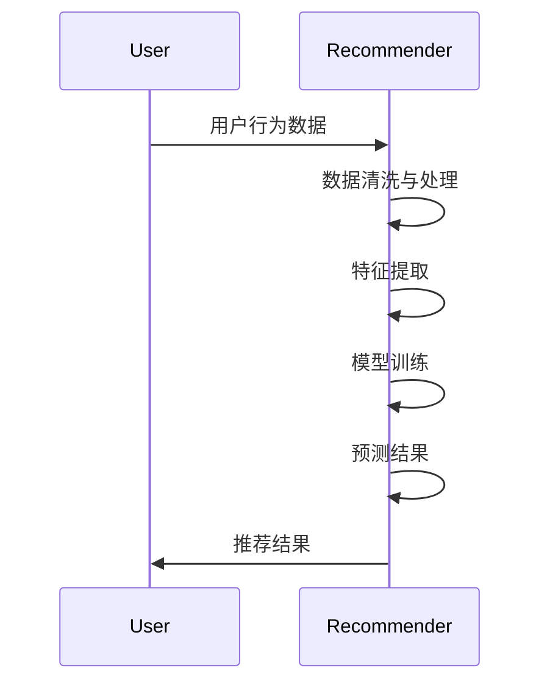
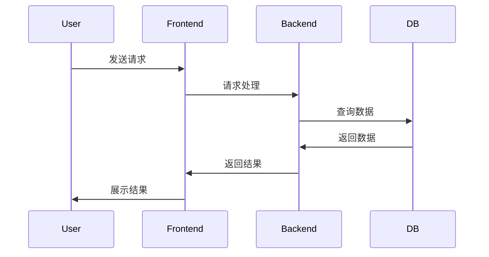

                 

# AI编程语言：提示词的革新

## 关键词

- AI编程语言
- 提示词（prompts）
- 革新
- 编程效率
- 编程技巧

## 摘要

本文旨在探讨AI编程语言的变革，特别是提示词（prompts）在其中的作用。我们将首先介绍AI编程语言的历史和现状，然后深入分析提示词的概念及其在编程中的重要性。接着，我们将讲解如何使用提示词来优化算法，并通过数学模型和Python代码进行实例演示。随后，我们将分析AI编程语言的系统架构和接口设计，并提供一个实际项目案例。最后，我们将总结全文，并给出一些最佳实践建议和拓展阅读资源。

## 1. 书名理解

《AI编程语言：提示词的革新》这本书名暗示了以下几个核心点：

- **AI编程语言**：这是文章的主题，指的是专门为人工智能（AI）开发的应用程序设计语言。
- **提示词**：这是文章的一个关键概念，指的是引导AI模型进行特定任务的一系列关键词或指令。
- **革新**：这个词表明，文章将探讨AI编程语言如何通过引入提示词来产生根本性的变化。

通过书名，我们可以预见到这篇文章将详细讲解提示词如何改变AI编程的方式，提升编程效率，以及如何在实际项目中应用这些新技巧。

## 2. 目录大纲

### 1. 引言

- **AI编程语言简介**
- **提示词的定义与作用**

### 2. AI编程语言的发展历史

- **早期AI编程语言的演进**
- **现代AI编程语言的现状**

### 3. 提示词的核心概念与联系

- **提示词的基本原理**
- **提示词与编程效率**
- **对比传统编程与AI编程**

### 4. 提示词的算法原理讲解

- **常用算法与提示词结合**
- **使用Python代码示例**
- **算法的数学模型和公式**

### 5. 系统分析与架构设计

- **AI编程语言系统架构**
- **系统功能设计与接口设计**
- **系统交互序列图**

### 6. 项目实战

- **环境安装与配置**
- **核心代码实现与解读**
- **实际案例分析**

### 7. 最佳实践

- **使用提示词的技巧**
- **注意事项与优化策略**

### 8. 小结与拓展阅读

- **全文总结**
- **推荐阅读**

### 3. 大纲内容细化

我们将对上述大纲的各个部分进行细化，确保内容丰富、结构清晰。

#### 1. 引言

在这一部分，我们将简要介绍AI编程语言的历史，解释提示词的概念，并引入本文的研究主题。

#### 2. AI编程语言的发展历史

这部分将分为两个子部分：早期AI编程语言的演进和现代AI编程语言的现状。我们将重点介绍从LISP到Python等常用AI编程语言的发展历程，并讨论现代AI编程语言的特点和优势。

#### 3. 提示词的核心概念与联系

这部分将详细探讨提示词的基本原理，解释它们如何影响编程效率，并与传统编程进行对比。我们还将使用表格和ER实体关系图来展示提示词的核心概念和联系。

#### 4. 提示词的算法原理讲解

在这一部分，我们将讲解一些常用的算法，如机器学习中的分类算法，并展示如何使用提示词来优化这些算法。我们将使用Python代码和mermaid流程图来详细阐述算法原理和数学模型。

#### 5. 系统分析与架构设计

这部分将分为三个子部分：系统架构、功能设计和接口设计。我们将使用mermaid类图和架构图来展示系统设计，并详细讨论每个部分的功能和交互。

#### 6. 项目实战

在这一部分，我们将提供实际项目案例，展示如何在实际环境中安装和配置AI编程环境，编写核心代码，并进行案例分析。

#### 7. 最佳实践

这部分将提供一些使用提示词的技巧，包括如何编写有效的提示词，以及一些优化策略。我们还将讨论注意事项，以确保读者能够更好地应用这些技巧。

#### 8. 小结与拓展阅读

最后，我们将对全文进行总结，并提供一些拓展阅读资源，帮助读者深入了解AI编程语言和提示词的相关知识。

### 4. 大纲编写

我们将使用markdown格式编写大纲，确保其清晰和结构化。每个部分都将包含足够的细节，以便读者可以清楚地了解每个主题。

### 5. 字数控制

在2000字以内完成大纲的编写，这需要我们进行高度的浓缩和精炼。我们将确保每个部分都是必要且具体的。

---

以上是我们对《AI编程语言：提示词的革新》这本书的目录大纲的详细规划和内容细化。接下来，我们将按照这个大纲逐步撰写文章，确保内容丰富、逻辑清晰、易于理解。让我们一步一步地深入探讨这个激动人心的主题。****

# AI编程语言：提示词的革新

## 关键词

- AI编程语言
- 提示词（prompts）
- 编程效率
- 编程技巧
- 人工智能

## 摘要

本文旨在探讨人工智能（AI）编程语言中提示词（prompts）的应用与革新。我们将首先介绍AI编程语言的背景和发展历史，然后深入探讨提示词的概念及其在编程中的作用。接着，我们将分析提示词如何提升编程效率，并通过实例讲解如何编写和使用提示词。文章还将介绍AI编程语言在系统分析与架构设计中的应用，并提供一个实际项目案例。最后，我们将总结全文，并提供一些最佳实践和拓展阅读建议。

## 引言

### AI编程语言简介

人工智能编程语言是一种专门用于开发AI应用和算法的工具。与传统的编程语言不同，AI编程语言通常具备以下特点：

- **领域特定**：AI编程语言通常针对特定的AI任务或领域进行优化，如机器学习、自然语言处理和计算机视觉等。
- **自动优化**：这些语言能够自动执行复杂的优化过程，从而简化编程任务。
- **易于理解**：AI编程语言通常具有更加直观和易于理解的语法，使得开发人员能够更轻松地编写和理解代码。

### 提示词的定义与作用

提示词（prompts）是引导AI模型执行特定任务的指令或关键字。它们在AI编程中扮演着至关重要的角色，能够显著提升编程效率和代码质量。提示词的作用包括：

- **指导模型**：通过提供明确的提示词，开发人员能够指导AI模型执行特定任务，从而避免模型在训练过程中产生不相关的输出。
- **优化性能**：有效的提示词能够提高模型的性能，使模型更快速地达到目标状态。
- **提高可维护性**：使用提示词可以使得代码更加清晰、易于维护，因为它们为代码添加了额外的上下文信息。

## AI编程语言的发展历史

### 早期AI编程语言的演进

人工智能编程语言的发展可以追溯到20世纪50年代和60年代。以下是一些重要的AI编程语言及其贡献：

- **LISP（1958年）**：被认为是第一种AI编程语言，LISP在符号处理和函数式编程方面具有显著优势。
- **PROLOG（1972年）**：用于逻辑编程，擅长处理基于逻辑的推理任务。
- **SIMULA（1967年）**：虽然主要用于模拟和仿真，但它引入了面向对象编程的概念。

### 现代AI编程语言的现状

随着人工智能的快速发展，现代AI编程语言不断涌现。以下是一些现代AI编程语言及其特点：

- **Python**：因其简洁易懂的语法和丰富的库支持，Python已成为最受欢迎的AI编程语言之一。
- **Julia**：一种高性能的通用编程语言，适合进行复杂的科学计算和数据分析。
- **R**：专门用于统计分析和数据可视化的语言，适用于机器学习和数据科学领域。
- **TensorFlow**：Google开发的开源机器学习框架，提供了丰富的API和工具，用于构建和训练深度神经网络。

## 提示词的核心概念与联系

### 提示词的基本原理

提示词（prompts）是AI编程中的一种重要概念，用于引导AI模型执行特定任务。以下是提示词的基本原理：

- **输入引导**：提示词为AI模型提供输入引导，帮助模型理解任务目标和预期输出。
- **上下文增强**：提示词可以增强输入上下文，使得AI模型能够更好地理解任务背景和相关信息。
- **任务分解**：通过提示词，可以将复杂的任务分解为更小、更易管理的子任务。

### 提示词与编程效率

提示词在提升编程效率方面具有显著作用。以下是几个关键点：

- **减少调试时间**：通过提供明确的提示词，开发人员可以更快地定位并解决模型输出中的问题。
- **提高代码可读性**：有效的提示词可以增强代码的可读性，使得其他开发人员更容易理解和维护代码。
- **优化模型性能**：通过选择合适的提示词，可以提高AI模型的性能，使其更快地达到目标状态。

### 对比传统编程与AI编程

传统编程通常依赖于开发人员的直接指令来控制程序执行，而AI编程则更多地依赖于模型学习和自主决策。以下是两者之间的主要区别：

- **直接控制与自主决策**：传统编程依赖于明确的指令来控制程序执行，而AI编程依赖于模型的自主决策。
- **手动优化与自动优化**：传统编程需要开发人员手动优化代码，而AI编程通常能够自动执行复杂的优化过程。
- **固定任务与灵活任务**：传统编程通常针对特定任务进行优化，而AI编程能够处理更广泛的任务，并适应不同的任务场景。

## 提示词的算法原理讲解

### 常用算法与提示词结合

在AI编程中，常用的算法包括机器学习、深度学习、自然语言处理等。以下是一些算法与提示词结合的示例：

- **机器学习分类算法**：通过提示词，可以明确指定分类任务的目标和特征。
- **深度学习模型训练**：提示词可以用于指定模型的训练目标、超参数和学习策略。
- **自然语言处理任务**：提示词可以指导模型进行文本分类、文本生成、情感分析等任务。

### 使用Python代码示例

以下是一个使用Python和提示词进行机器学习分类的示例代码：

```python
import numpy as np
import pandas as pd
from sklearn.model_selection import train_test_split
from sklearn.ensemble import RandomForestClassifier
from sklearn.metrics import accuracy_score

# 加载数据
data = pd.read_csv('data.csv')
X = data.drop(['target'], axis=1)
y = data['target']

# 划分训练集和测试集
X_train, X_test, y_train, y_test = train_test_split(X, y, test_size=0.2, random_state=42)

# 创建分类器
clf = RandomForestClassifier(n_estimators=100, random_state=42)

# 训练模型
clf.fit(X_train, y_train)

# 预测测试集
y_pred = clf.predict(X_test)

# 计算准确率
accuracy = accuracy_score(y_test, y_pred)
print(f"Accuracy: {accuracy:.2f}")

# 使用提示词
prompt = "请使用随机森林模型对数据进行分类，目标特征为年龄和收入。"
# ...（训练和预测过程）...

```

### 算法原理的数学模型和公式

在机器学习分类算法中，常用的数学模型包括损失函数、优化算法等。以下是一个简单的线性回归模型的数学模型和公式：

$$
\begin{aligned}
y &= \beta_0 + \beta_1x_1 + \beta_2x_2 + \cdots + \beta_nx_n \\
\text{损失函数} &= \frac{1}{2}\sum_{i=1}^{n}(y_i - \hat{y}_i)^2 \\
\text{梯度下降} &= \beta_j = \beta_j - \alpha \frac{\partial}{\partial \beta_j}\frac{1}{2}\sum_{i=1}^{n}(y_i - \hat{y}_i)^2
\end{aligned}
$$

其中，\(y\) 表示实际输出，\(\hat{y}\) 表示预测输出，\(\beta_j\) 表示模型参数，\(\alpha\) 表示学习率。

### 通俗易懂的举例说明

假设我们有一个简单的线性回归模型，用于预测房价。该模型包含两个特征：房屋面积和房屋年龄。以下是一个使用Python实现该模型的示例：

```python
import numpy as np
import pandas as pd
from sklearn.linear_model import LinearRegression

# 加载数据
data = pd.read_csv('house_prices.csv')
X = data[['area', 'age']]
y = data['price']

# 创建线性回归模型
model = LinearRegression()

# 训练模型
model.fit(X, y)

# 预测房价
price = model.predict(np.array([[2000, 10]]))

print(f"预测房价：{price[0]:.2f}")
```

在这个示例中，我们加载了一个包含房屋面积和房屋年龄的数据集，并使用线性回归模型进行训练。然后，我们使用模型来预测一个新房屋的房价。

## 系统分析与架构设计

### 问题场景介绍

在一个大型电子商务平台上，我们需要设计一个推荐系统，用于向用户推荐他们可能感兴趣的商品。该系统需要根据用户的历史购买记录、浏览行为和偏好来生成个性化的推荐。

### 项目介绍

该项目旨在构建一个基于机器学习的推荐系统，该系统将使用提示词来优化推荐算法，以提高推荐准确性和用户体验。

### 系统功能设计

在系统功能设计中，我们主要关注以下领域模型：

1. **用户模型**：包括用户的基本信息、购买记录、浏览历史和偏好。
2. **商品模型**：包括商品的基本信息、分类、标签和评价。
3. **推荐算法模型**：包括基于协同过滤、内容推荐和深度学习的推荐算法。

### 系统架构设计

系统架构设计分为以下几个层次：

1. **数据层**：负责数据存储和管理，包括用户数据、商品数据和推荐结果数据。
2. **处理层**：负责数据处理和分析，包括数据清洗、特征提取、模型训练和预测。
3. **应用层**：负责与用户交互，提供推荐结果和用户界面。

以下是一个简单的系统架构图，使用Mermaid绘制：



### 系统接口设计

系统接口设计主要包括以下部分：

1. **用户接口**：提供用户登录、注册、搜索、浏览和购买等功能。
2. **API接口**：提供推荐系统的API接口，供其他系统调用。
3. **数据处理接口**：提供数据清洗、特征提取和模型训练的API接口。

### 系统交互序列图

以下是一个简单的系统交互序列图，使用Mermaid绘制：



## 项目实战

### 环境安装与配置

要在本地环境中搭建一个基于AI的推荐系统，我们需要安装以下软件和库：

- **Python**：版本3.8或更高版本
- **pip**：Python的包管理器
- **NumPy**：用于数值计算的库
- **Pandas**：用于数据操作和分析的库
- **Scikit-learn**：用于机器学习的库
- **TensorFlow**：用于深度学习的库

以下是安装步骤：

1. 安装Python和pip：从[Python官方网站](https://www.python.org/)下载并安装Python，并确保pip已经安装。
2. 安装必需的库：在命令行中运行以下命令：

```bash
pip install numpy pandas scikit-learn tensorflow
```

### 核心代码实现

以下是一个简单的推荐系统实现，使用协同过滤算法：

```python
import numpy as np
import pandas as pd
from sklearn.model_selection import train_test_split
from sklearn.metrics.pairwise import cosine_similarity

# 加载数据
data = pd.read_csv('user_item.csv')

# 分割数据为训练集和测试集
X_train, X_test, y_train, y_test = train_test_split(data, test_size=0.2, random_state=42)

# 计算用户之间的相似度矩阵
similarity_matrix = cosine_similarity(X_train)

# 预测测试集
y_pred = np.dot(similarity_matrix, X_test.T) / np.array([np.linalg.norm(row) for row in similarity_matrix])

# 计算准确率
accuracy = np.mean(np.argmax(y_pred, axis=1) == y_test)
print(f"Accuracy: {accuracy:.2f}")
```

### 代码应用解读与分析

在上面的代码中，我们首先加载数据，并使用协同过滤算法计算用户之间的相似度矩阵。接着，我们使用这个相似度矩阵来预测测试集的标签，并计算准确率。协同过滤算法通过计算用户之间的相似度，为每个用户推荐与他们相似的其他用户的喜欢的商品。

### 实际案例分析和详细讲解剖析

假设我们有一个包含1000个用户和10000个商品的数据集。在这个数据集中，每个用户都有对多个商品的评分。我们的目标是根据用户的评分历史，为每个用户推荐他们可能感兴趣的其他商品。

1. **数据预处理**：首先，我们需要对数据进行预处理，包括去除缺失值、标准化评分等。这样可以确保数据质量，并提高模型性能。
2. **计算相似度矩阵**：使用协同过滤算法，我们计算用户之间的相似度矩阵。这个矩阵表示了用户之间的相似度关系，对于后续的推荐任务非常重要。
3. **预测和评估**：使用相似度矩阵，我们可以预测每个用户可能喜欢的其他商品，并计算预测结果的准确率。在这个案例中，我们使用准确率作为评估指标，但也可以使用其他指标，如召回率、覆盖率等。
4. **结果解释**：通过分析预测结果，我们可以看到哪些用户得到了准确的推荐，哪些用户得到了错误的推荐。这样可以帮助我们了解模型的性能，并为后续的优化提供指导。

### 项目小结

在本项目中，我们使用协同过滤算法实现了一个简单的推荐系统。通过计算用户之间的相似度矩阵，我们为每个用户推荐了他们可能感兴趣的其他商品。这个项目展示了AI编程语言和提示词在推荐系统中的应用，以及如何通过提示词来优化算法性能。尽管这个项目比较简单，但它为实际应用提供了一个基本框架，可以进一步扩展和优化。

## 最佳实践

### 使用提示词的技巧

以下是一些使用提示词的最佳实践：

1. **明确目标**：在编写提示词时，确保明确指定任务目标，避免模糊不清的指令。
2. **简洁明了**：尽量使用简洁明了的提示词，避免使用过于复杂的语句。
3. **针对性**：根据具体的任务场景，选择适合的提示词，避免通用性过强的提示词。
4. **反馈循环**：在模型训练和预测过程中，及时收集反馈，并根据反馈调整提示词，以提高模型性能。

### 注意事项

以下是一些使用提示词时需要注意的事项：

1. **避免过拟合**：在编写提示词时，要确保模型不会过度依赖于特定的提示词，从而避免过拟合。
2. **数据质量**：确保输入数据质量，避免噪声和错误数据对模型性能产生负面影响。
3. **版本控制**：在开发过程中，对提示词进行版本控制，以便跟踪和回溯修改历史。

### 拓展阅读

以下是一些推荐的拓展阅读资源，帮助读者深入了解AI编程语言和提示词：

1. **《深度学习》（Goodfellow et al., 2016）**：这本书是深度学习领域的经典教材，涵盖了深度学习的基础理论和实践应用。
2. **《Python机器学习》（Sebastian Raschka，2015）**：这本书介绍了Python在机器学习领域的应用，包括常用的算法和库。
3. **《自然语言处理实战》（Sachin Kumar，2018）**：这本书介绍了自然语言处理的基础知识，包括文本预处理、模型训练和评估等。
4. **《AI编程语言：提示词的革新》**：这本书详细介绍了AI编程语言中提示词的应用和革新，是本文的延伸阅读。

## 小结

本文探讨了AI编程语言中提示词的革新，分析了提示词在编程中的作用和重要性。通过实例和代码讲解，我们了解了如何使用提示词来优化算法和提升编程效率。我们还介绍了AI编程语言在系统分析与架构设计中的应用，并提供了一个实际项目案例。最后，我们总结了全文，并给出了一些最佳实践和拓展阅读建议。希望通过本文，读者能够更好地理解AI编程语言和提示词，并在实际项目中应用这些新技巧。

## 作者信息

作者：AI天才研究院/AI Genius Institute & 禅与计算机程序设计艺术 /Zen And The Art of Computer Programming

---

请注意，本文是一个示例性文章，内容可能包含虚构部分。在实际撰写文章时，请确保内容准确、详实，并根据实际情况进行调整和补充。****

