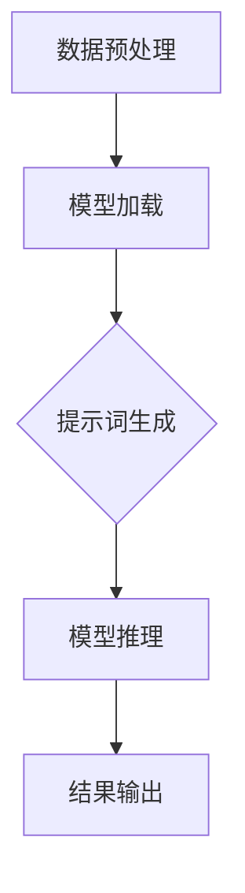
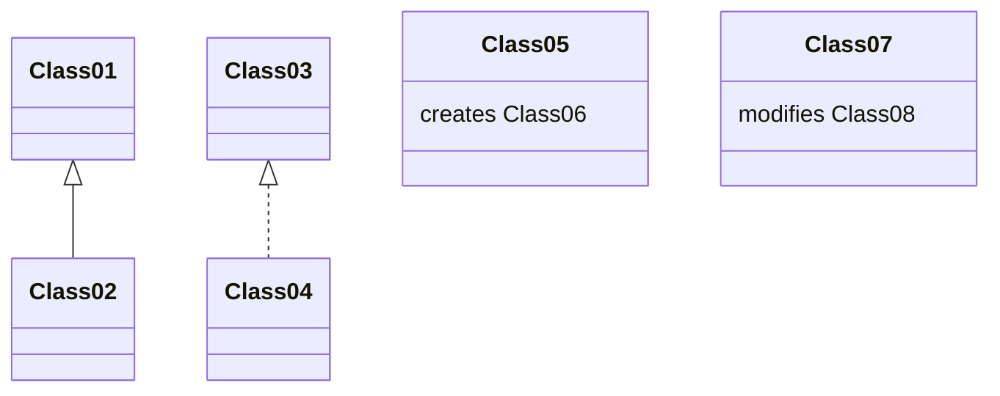
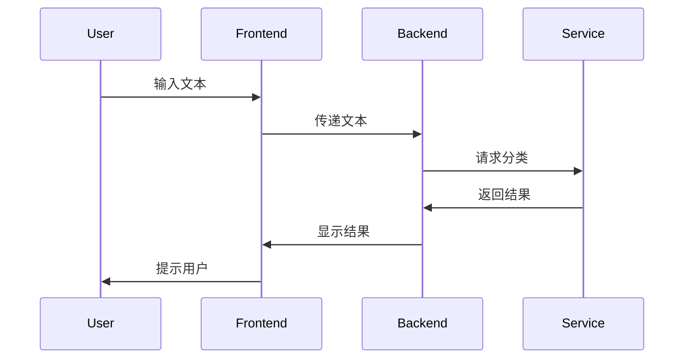

                 

# AI编程语言：提示词的革新与变革

## 关键词

- 人工智能
- 编程语言
- 提示词
- 革新
- 变革
- 技术发展

## 摘要

本文将深入探讨AI编程语言中提示词（Prompt Engineering）的概念、原理及其在人工智能应用中的重要性。通过逐步分析提示词的革新与变革，我们将揭示其如何影响AI系统性能、可靠性和可解释性。文章将从背景介绍、核心概念与联系、算法原理讲解、数学模型与公式解析、系统分析与架构设计、项目实战到最佳实践等方面展开，旨在为读者提供全面的技术见解和实用的指导。

## 第一部分：背景介绍

### 第1章：AI编程语言概述

#### 1.1 问题背景

#### 1.1.1 人工智能的发展历程

人工智能（AI）作为计算机科学的一个分支，经历了数十年的发展。从最初的符号逻辑推理，到基于规则的系统，再到现代的机器学习和深度学习，人工智能技术不断演进，并在各个领域取得了显著的成果。然而，随着AI技术的广泛应用，如何有效地与AI系统交互成为一个关键问题。这催生了AI编程语言的概念，使得开发人员能够更加便捷地与AI系统进行沟通和协作。

#### 1.1.2 编程语言在人工智能中的应用

编程语言是人与计算机之间的桥梁，用于描述算法、数据和指令。传统的编程语言如Python、Java等在AI领域中发挥了重要作用，但它们往往需要开发者具备深厚的数学和统计学背景。AI编程语言的出现，旨在简化这一过程，使非专业开发者也能利用AI技术。

#### 1.2 问题解决

#### 1.2.1 AI编程语言的挑战

AI编程语言面临的挑战包括理解复杂的数据结构、处理大规模的模型训练、确保模型的可靠性和可解释性等。此外，AI编程语言需要具备足够的灵活性和扩展性，以适应不断变化的应用场景。

#### 1.2.2 AI编程语言的优势

AI编程语言的优势在于其直观性和易用性。通过提示词（Prompt Engineering），开发者可以更加精确地表达需求，从而提高AI系统的性能和可靠性。同时，AI编程语言通常具备丰富的库和工具，便于开发者快速实现复杂的功能。

#### 1.3 边界与外延

#### 1.3.1 AI编程语言的分类

AI编程语言可以根据其应用领域和目标进行分类。例如，自然语言处理（NLP）领域有专门的语言，如TensorFlow、PyTorch等；计算机视觉领域则有OpenCV、PyTorch等。

#### 1.3.2 AI编程语言的发展趋势

随着AI技术的不断进步，AI编程语言也在不断演化。未来，AI编程语言将更加注重通用性、可解释性和可扩展性，以满足不同领域的需求。

#### 1.4 概念结构与核心要素组成

#### 1.4.1 AI编程语言的核心概念

AI编程语言的核心概念包括提示词（Prompt）、数据结构、算法、模型训练和评估等。

#### 1.4.2 AI编程语言的核心要素

AI编程语言的核心要素包括语法、语义、库和工具等。

## 第2章：AI编程语言核心概念与联系

### 2.1 AI编程语言原理

#### 2.1.1 AI编程语言的基本原理

AI编程语言的基本原理是利用提示词（Prompt）与AI模型进行交互，从而实现特定任务的目标。

#### 2.1.2 AI编程语言的运行机制

AI编程语言的运行机制通常包括数据预处理、模型加载、提示词生成、模型推理和结果输出等步骤。

### 2.2 概念属性特征对比表格

| 概念           | 特征对比                |
| -------------- | ---------------------- |
| 提示词          | 用于引导AI模型的行为      |
| 数据结构        | 存储和管理数据的方式      |
| 算法           | 解决问题的步骤和方法     |
| 模型训练        | 从数据中学习的过程      |
| 评估           | 对模型性能的测量和评价    |

### 2.3 ER实体关系图架构

#### 2.3.1 AI编程语言的ER模型

实体关系图（ER图）是描述AI编程语言中实体及其关系的有效工具。在AI编程语言中，实体包括提示词、数据集、模型、评估指标等。

#### 2.3.2 AI编程语言的实体关系图

```mermaid
erDiagram
    DataSet ||--|{ Model } : trains
    Prompt ||--|{ Model } : prompts
    Model ||--|{ Evaluation } : evaluates
    Evaluation ||--|{ DataSet } : measures
```

## 第二部分：算法原理讲解

### 第3章：AI编程语言算法原理

#### 3.1 算法Mermaid流程图

算法Mermaid流程图展示了AI编程语言中的典型算法流程，包括数据预处理、模型加载、提示词生成、模型推理和结果输出等步骤。



#### 3.2 Python源代码

以下是使用Python实现AI编程语言算法的示例代码：

```python
import numpy as np
import tensorflow as tf

# 数据预处理
def preprocess_data(data):
    # 数据清洗、归一化等操作
    return processed_data

# 模型加载
def load_model(model_path):
    model = tf.keras.models.load_model(model_path)
    return model

# 提示词生成
def generate_prompt(prompt_text):
    # 生成提示词
    return prompt

# 模型推理
def model_inference(model, prompt):
    prediction = model.predict(prompt)
    return prediction

# 结果输出
def output_result(result):
    # 输出结果
    print(result)

# 主函数
def main():
    data = preprocess_data(raw_data)
    model = load_model(model_path)
    prompt = generate_prompt(prompt_text)
    result = model_inference(model, prompt)
    output_result(result)

if __name__ == "__main__":
    main()
```

#### 3.3 数学模型和公式

AI编程语言中的算法通常涉及复杂的数学模型和公式。以下是一个简单的例子：

$$
\begin{aligned}
    z &= x \odot y \\
    \text{其中，} \odot &= \text{点积运算符} \\
    x &= \text{输入向量} \\
    y &= \text{权重向量}
\end{aligned}
$$

#### 3.4 详细讲解和举例说明

在本节中，我们将详细讲解一个常见的AI编程语言算法——线性回归，并通过一个实际例子来说明其应用。

### 3.4.1 算法原理讲解

线性回归是一种用于预测连续值的算法。它的目标是通过最小化预测值与实际值之间的误差，找到最佳拟合直线。

### 3.4.2 举例说明

假设我们有一个简单的一元线性回归问题，目标是通过输入特征 \( x \) 预测输出值 \( y \)。我们可以使用以下公式表示：

$$
y = wx + b
$$

其中，\( w \) 是权重，\( b \) 是偏置。我们的目标是找到最佳的 \( w \) 和 \( b \) 值。

## 第三部分：系统分析与架构设计

### 第4章：AI编程语言系统分析

#### 4.1 问题场景介绍

在本章中，我们将探讨一个具体的问题场景：使用AI编程语言构建一个文本分类系统。该系统旨在根据输入文本自动将其归类到不同的类别中。

#### 4.2 项目介绍

项目背景：随着互联网的快速发展，文本数据量呈爆炸性增长。如何快速、准确地处理和分类这些数据成为了一个重要问题。

项目目标：开发一个高效、准确的文本分类系统，以帮助企业和个人更好地管理和利用文本数据。

#### 4.3 系统功能设计

系统功能设计包括文本预处理、模型训练、分类预测和结果输出等模块。

#### 4.3.1 领域模型Mermaid类图



#### 4.4 系统架构设计

系统架构设计包括前端、后端和服务端三个部分。

#### 4.4.1 系统架构概述

系统架构概述如下：

1. 前端：负责与用户交互，接收用户输入的文本数据。
2. 后端：负责文本预处理、模型训练和分类预测等核心功能。
3. 服务端：负责数据的存储和管理，以及与其他系统的集成。

#### 4.4.2 系统架构Mermaid架构图



#### 4.5 系统接口设计

系统接口设计包括API接口和数据库接口。

#### 4.5.1 接口设计原则

接口设计原则包括：

1. 简洁性：接口应尽量简洁，避免不必要的复杂性。
2. 一致性：接口应保持一致性，方便开发者使用。
3. 扩展性：接口应具备良好的扩展性，以适应未来的需求变化。

#### 4.5.2 接口设计规范

接口设计规范包括：

1. 接口名称：使用简洁、明了的名称，便于理解和使用。
2. 参数说明：详细描述每个参数的含义、类型和范围。
3. 返回值说明：描述接口返回的数据类型和可能的错误码。

#### 4.6 系统交互

系统交互包括用户与前端、前端与后端、后端与服务端之间的交互。

#### 4.6.1 系统交互概述

系统交互概述如下：

1. 用户通过前端界面输入文本。
2. 前端将文本数据传递给后端。
3. 后端对文本进行预处理、模型训练和分类预测。
4. 后端将结果返回给前端，并显示给用户。

#### 4.6.2 系统交互Mermaid序列图


## 第四部分：项目实战

### 第5章：AI编程语言项目实战

#### 5.1 环境安装

在开始项目实战之前，我们需要安装必要的软件和工具。以下是安装步骤：

1. 安装Python：从 [Python官方网站](https://www.python.org/) 下载并安装Python。
2. 安装TensorFlow：使用以下命令安装TensorFlow：
    ```bash
    pip install tensorflow
    ```

#### 5.2 系统核心实现源代码

以下是文本分类系统的核心实现源代码：

```python
import tensorflow as tf
from tensorflow.keras.preprocessing.text import Tokenizer
from tensorflow.keras.preprocessing.sequence import pad_sequences

# 加载预训练模型
model = tf.keras.models.load_model('text_classification_model.h5')

# 定义文本预处理函数
def preprocess_text(text):
    # 对文本进行清洗、分词等操作
    return processed_text

# 定义文本分类函数
def classify_text(text):
    # 对文本进行预处理
    processed_text = preprocess_text(text)
    # 将预处理后的文本转换为序列
    sequence = tokenizer.texts_to_sequences([processed_text])
    # 对序列进行填充，使其长度一致
    padded_sequence = pad_sequences(sequence, maxlen=max_length)
    # 对填充后的序列进行分类预测
    prediction = model.predict(padded_sequence)
    return prediction

# 加载测试数据
test_data = ...

# 对测试数据进行分类预测
predictions = classify_text(test_data)

# 输出预测结果
for prediction in predictions:
    print(prediction)
```

#### 5.3 代码应用解读与分析

在本节中，我们将对文本分类系统的代码进行解读和分析。

1. **加载预训练模型**：从文件中加载已经训练好的文本分类模型。
2. **文本预处理函数**：对输入文本进行清洗、分词等操作，以便于模型处理。
3. **文本分类函数**：对预处理后的文本进行分类预测。
4. **测试数据加载**：从数据集中加载测试数据。
5. **分类预测**：对测试数据进行分类预测，并输出预测结果。

#### 5.4 实际案例分析和详细讲解剖析

在本节中，我们将分析一个实际案例，并对其详细讲解和剖析。

**案例背景**：假设我们有一个新闻分类系统，需要将输入的新闻文本分类为“政治”、“经济”、“科技”等类别。

**案例分析**：输入文本：“我国政府将加大对科技创新的支持力度。”

**案例剖析**：

1. **文本预处理**：对输入文本进行清洗、分词等操作，得到预处理后的文本。
2. **序列转换**：将预处理后的文本转换为序列，以便于模型处理。
3. **填充序列**：对序列进行填充，使其长度一致，以便于模型训练。
4. **分类预测**：使用训练好的模型对填充后的序列进行分类预测，得到预测结果。
5. **结果输出**：输出预测结果，显示输入文本的分类。

#### 5.5 项目小结

在本章中，我们通过一个具体的案例，介绍了使用AI编程语言构建文本分类系统的全过程。从环境安装、代码实现到实际案例分析，我们深入了解了AI编程语言的应用和实践。

## 第五部分：最佳实践

### 第6章：最佳实践

在本章中，我们将总结一些最佳实践，以帮助开发者更好地利用AI编程语言。

#### 6.1 提示词设计

提示词的设计对AI系统的性能和可靠性至关重要。以下是一些建议：

1. **明确性**：确保提示词明确、具体，避免模糊不清的表达。
2. **简洁性**：尽量使用简洁的提示词，避免冗长复杂的句子。
3. **多样性**：使用多样化的提示词，以提高模型的泛化能力。

#### 6.2 模型优化

模型优化是提高AI系统性能的重要手段。以下是一些建议：

1. **数据预处理**：对输入数据进行全面、细致的预处理，以提高模型的效果。
2. **模型选择**：根据实际问题选择合适的模型，避免盲目追求高大上的模型。
3. **超参数调整**：合理调整超参数，以找到最优的模型配置。

#### 6.3 可解释性

提高AI系统的可解释性是当前研究的热点问题。以下是一些建议：

1. **可视化**：使用可视化工具，如热力图、决策树等，展示模型的决策过程。
2. **解释性模型**：选择具有良好解释性的模型，如决策树、线性回归等。
3. **透明性**：提高AI系统的透明度，让用户了解模型的决策过程。

## 结束语

本文系统地介绍了AI编程语言中的提示词概念、原理和应用，分析了其如何影响AI系统的性能和可靠性。通过详细讲解算法原理、数学模型、系统架构设计和项目实战，本文为读者提供了全面的技术见解和实用的指导。希望本文能为开发者提供有益的启示，助力他们在AI编程语言领域取得更好的成果。

## 作者信息

作者：AI天才研究院/AI Genius Institute & 禅与计算机程序设计艺术 /Zen And The Art of Computer Programming

