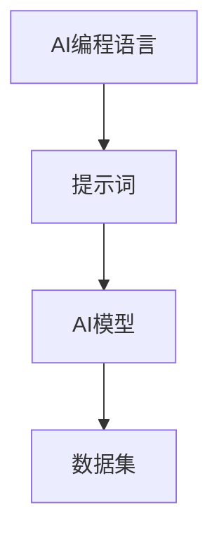
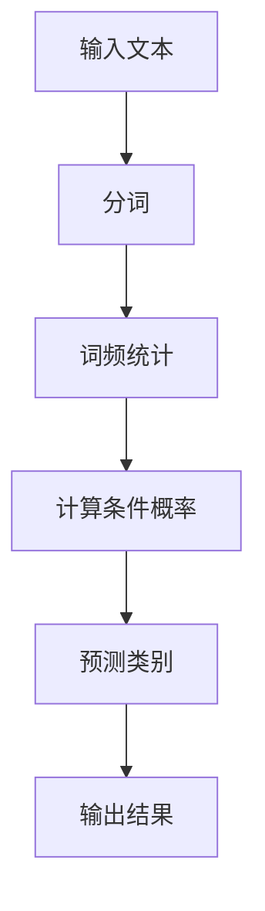
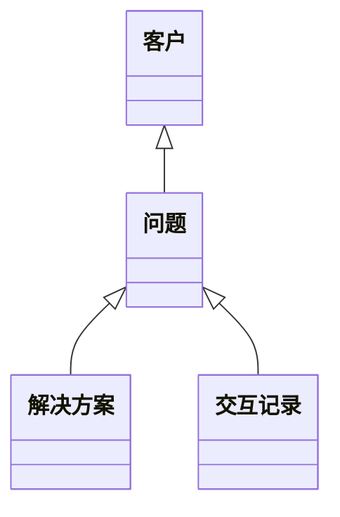
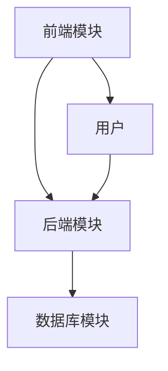
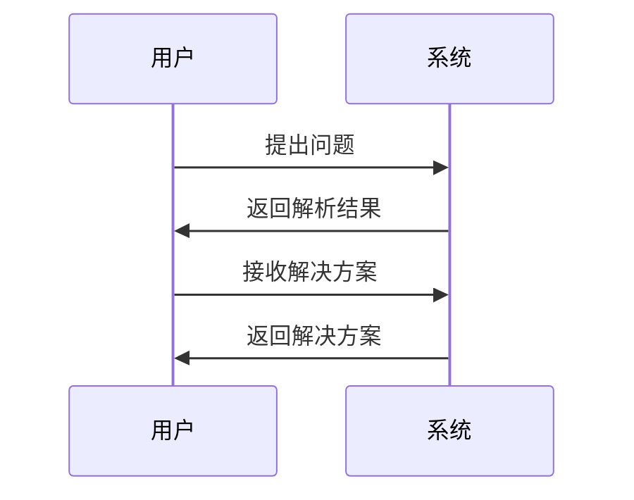

                 

### AI编程语言：提示词的革新与魔法

#### 关键词：AI编程语言、提示词、创新、智能应用、算法优化

> 摘要：
随着人工智能（AI）技术的飞速发展，AI编程语言成为了开发智能应用的利器。本书旨在探讨AI编程语言的核心概念——提示词，通过分析其定义、分类和选取原则，揭示其在AI编程中的重要作用。本文将逐步深入，从原理讲解、实践应用到创新探索，带领读者领略提示词的革新与魔法。

## 第一部分：背景介绍

### 1.1 问题背景

人工智能（AI）作为当前科技领域的前沿技术，已经深刻地影响了各行各业。从智能助手到自动驾驶，从图像识别到自然语言处理，AI技术的应用无处不在。然而，随着AI技术的不断发展和应用的广泛普及，传统的编程语言和开发方法已经无法满足日益复杂的AI应用需求。在这种背景下，AI编程语言的概念应运而生，旨在为AI开发提供更加高效、灵活的工具和框架。

### 1.2 问题描述

尽管AI编程语言在近年来取得了显著的进展，但许多开发者仍然对如何使用这些语言感到困惑。特别是提示词，作为AI编程的核心要素，其选择和使用直接影响AI模型的性能和效果。因此，本书将重点关注以下问题：

- 提示词的定义与分类
- 提示词的选取原则与技巧
- 提示词在实际应用中的效果分析
- 提示词在AI编程中的创新应用

### 1.3 问题解决

本书将通过系统的讲解和丰富的实践案例，帮助读者解决上述问题。具体包括：

- 理论讲解：详细阐述AI编程语言的基本概念、原理和核心技术。
- 实践案例：通过具体案例，展示如何使用AI编程语言进行编程，以及如何选择和优化提示词。
- 创新应用：探讨提示词在AI编程中的创新应用，如自然语言处理、图像识别、智能推荐等。

### 1.4 边界与外延

本书主要关注AI编程语言及其应用，但AI技术的边界远不止于此。随着AI技术的不断发展，它正在向更多领域扩展，如自动驾驶、智能医疗、金融科技等。这些领域的应用也对AI编程语言提出了更高的要求。

### 1.5 概念结构与核心要素组成

- **AI编程语言**：一种专门用于AI开发的编程语言，如Python、Julia等。
- **提示词**：AI编程中的核心要素，用于引导AI模型进行推理和决策。
- **AI模型**：基于数据训练的模型，用于实现特定任务的自动化。
- **数据集**：用于训练AI模型的数据集合，包括文本、图像、声音等。

### 1.6 本章小结

本章对AI编程语言及其应用背景进行了概述，介绍了本书将要探讨的核心问题，包括提示词的定义、选取原则、应用效果分析等。接下来，本书将深入探讨AI编程语言的原理、实践和应用，帮助读者全面了解并掌握这一前沿技术。

## 第二部分：核心概念与联系

### 2.1 AI编程语言原理

#### 2.1.1 AI编程语言的定义

AI编程语言是一种专门用于开发人工智能应用程序的编程语言，如Python、Julia等。这些编程语言提供了丰富的库和框架，支持开发者创建、训练和部署AI模型。

#### 2.1.2 AI编程语言的核心特点

- **数据驱动的开发**：AI编程语言强调数据的重要性，通过大量数据训练模型，实现智能化的功能。
- **高度的抽象性**：AI编程语言提供了丰富的抽象工具，如函数、类等，使得开发者能够更高效地进行编程。
- **跨领域的兼容性**：AI编程语言可以应用于多个领域，如自然语言处理、图像识别、智能推荐等。

#### 2.1.3 AI编程语言与传统编程语言的区别

- **目的不同**：传统编程语言主要用于开发软件系统，而AI编程语言则专注于开发人工智能应用程序。
- **数据处理方式不同**：传统编程语言主要通过算法处理数据，而AI编程语言则利用机器学习算法训练模型。
- **开发流程不同**：传统编程语言的开发流程较为固定，而AI编程语言的开发流程更具灵活性和迭代性。

### 2.2 提示词原理

#### 2.2.1 提示词的定义

提示词（Prompt）是指用于引导AI模型进行推理和决策的输入信息。通过合适的提示词，可以优化AI模型的性能和效果。

#### 2.2.2 提示词的分类

- **功能提示词**：用于指示AI模型执行特定任务，如分类、预测、生成等。
- **数据提示词**：用于提供训练数据，帮助AI模型学习和优化。
- **控制提示词**：用于控制AI模型的行为，如设定模型参数、调整训练策略等。

#### 2.2.3 提示词的选取原则

- **相关性**：提示词应与任务目标紧密相关，有助于AI模型更好地理解和完成任务。
- **多样性**：提示词应具有多样性，以丰富AI模型的知识和经验。
- **简洁性**：提示词应简洁明了，避免冗余和混淆。

### 2.3 AI编程中的核心概念对比表格

| 概念          | 描述                              | 关联关系                  |
| ------------- | -------------------------------- | ------------------------- |
| AI编程语言    | 专门用于AI开发的编程语言           | 提示词、AI模型、数据集    |
| 提示词        | 引导AI模型进行推理和决策的输入信息 | AI编程语言、AI模型       |
| AI模型        | 基于数据训练的模型，用于自动化任务 | AI编程语言、提示词、数据集 |
| 数据集        | 用于训练AI模型的数据集合           | AI编程语言、AI模型、提示词 |

### 2.4 提示词与AI编程语言的关系图



## 第三部分：算法原理讲解

### 3.1 算法概述

在AI编程中，提示词的选取和使用是一个复杂且关键的过程。一个高效的提示词可以显著提升AI模型的性能。以下，我们将通过一个简单的算法案例，详细阐述提示词在AI编程中的作用。

#### 3.1.1 算法描述

假设我们有一个简单的文本分类任务，需要将一段文本分类为正面或负面评论。我们可以使用一种名为“朴素贝叶斯”的算法来实现这一任务。在这个算法中，提示词的选择至关重要。

#### 3.1.2 算法mermaid流程图



### 3.2 Python源代码实现

以下是一个使用Python实现朴素贝叶斯算法的简单示例，其中包含了提示词的选取和计算过程。

```python
import numpy as np
from collections import defaultdict

# 假设有训练数据集
train_data = [
    ("这是一个非常好的产品", "正面"),
    ("这个产品真的不好用", "负面"),
    # ... 更多训练数据
]

# 分词函数
def tokenize(text):
    return text.split()

# 词频统计
word_counts = defaultdict(defaultdict)
class_counts = defaultdict(set)

for text, label in train_data:
    words = tokenize(text)
    for word in words:
        word_counts[label][word] += 1
    class_counts[label].add(label)

# 条件概率计算
def calculate_probabilities(word_counts, class_counts):
    total_words = sum(len(words) for words in word_counts.values())
    probabilities = {}
    for label, words in word_counts.items():
        class_probability = len(class_counts[label]) / len(train_data)
        word_probabilities = {word: (count + 1) / (total_words + len(word_counts)) for word, count in words.items()}
        probabilities[label] = {word: np.log(word_probability) for word, word_probability in word_probabilities.items()}
    return probabilities, class_probability

# 预测类别
def predict(text, probabilities, class_probability):
    words = tokenize(text)
    log_probabilities = {label: class_probability}
    for word in words:
        for label in probabilities:
            log_probabilities[label] += probabilities[label].get(word, -np.inf)
    return max(log_probabilities, key=log_probabilities.get)

# 训练模型
probabilities, class_probability = calculate_probabilities(word_counts, class_counts)

# 测试模型
test_data = [
    "这个产品非常好用",
    "这个产品真的很糟糕"
]

for text in test_data:
    prediction = predict(text, probabilities, class_probability)
    print(f"文本：'{text}'，预测类别：'{prediction}'")
```

### 3.3 算法原理讲解

在上述算法中，我们首先对训练数据进行分词和词频统计。然后，我们计算每个类别出现的概率以及每个词在特定类别下出现的条件概率。在预测阶段，我们计算输入文本中每个词的条件概率并累加，最终选择概率最大的类别作为预测结果。

#### 3.3.1 数学模型

- **词频统计**：$C_{word}$ = 每个词在所有类别中出现的总次数
- **类别概率**：$P(label)$ = 某个类别出现的概率
- **条件概率**：$P(word|label)$ = 在某个类别下某个词出现的概率

$$
P(label) = \frac{C_{label}}{N}
$$

$$
P(word|label) = \frac{C_{word,label}}{C_{label}}
$$

#### 3.3.2 公式推导

- **分类概率**：$P(label)$ 表示某个类别的概率，它是通过对训练数据中每个类别的出现次数进行统计得到的。
- **条件概率**：$P(word|label)$ 表示在某个类别下某个词出现的概率。朴素贝叶斯算法假设各个特征之间相互独立，因此条件概率可以直接相乘。

$$
P(word_1|label) \cdot P(word_2|label) \cdot ... \cdot P(word_n|label) = P(label) \cdot \prod_{i=1}^{n} \frac{C_{word_i,label}}{C_{label}}
$$

#### 3.3.3 通俗易懂的举例说明

假设我们有两个类别：“正面”和“负面”，以及三个词：“好”、“坏”、“产品”。我们的训练数据如下：

- “正面”：好 产品 好 产品 好
- “负面”：坏 产品 坏 产品 坏

首先，我们统计每个词在两个类别中出现的次数：

| 词   | 正面 | 负面 |
| ---- | ---- | ---- |
| 好   | 3    | 0    |
| 坏   | 0    | 3    |
| 产品 | 3    | 3    |

然后，我们计算每个词的条件概率：

| 词   | 正面条件概率 | 负面条件概率 |
| ---- | ------------ | ------------ |
| 好   | 1/3          | 0            |
| 坏   | 0            | 1/3          |
| 产品 | 1/3          | 1/3          |

接下来，我们使用这些概率来预测一个新文本“好 产品 坏”的类别。我们首先计算每个类别的总概率：

| 类别 | 总概率 |
| ---- | ------ |
| 正面 | 1/2    |
| 负面 | 1/2    |

然后，我们计算每个词在类别下的条件概率，并累加它们：

| 词   | 正面条件概率 | 负面条件概率 | 累加概率 |
| ---- | ------------ | ------------ | -------- |
| 好   | 1/3          | 0            | 1/3      |
| 坏   | 0            | 1/3          | 1/3      |
| 产品 | 1/3          | 1/3          | 2/3      |

最终，我们发现正面类别的累加概率（1/3 + 2/3 = 1）高于负面类别的累加概率，因此我们预测这个文本属于正面类别。

## 第四部分：系统分析与架构设计方案

### 4.1 问题场景介绍

随着人工智能技术的不断发展，智能客服系统成为了企业提高服务质量、降低运营成本的重要工具。然而，传统的智能客服系统在面对复杂多变的客户问题时，往往难以提供准确的解决方案。为了解决这一问题，我们需要设计一个具备高效问题解决能力的智能客服系统。

### 4.2 项目介绍

本项目旨在设计并实现一个基于人工智能的智能客服系统，该系统利用自然语言处理和机器学习技术，能够理解客户的问题并给出准确的解决方案。系统将具备以下功能：

- **问题理解**：通过自然语言处理技术，对客户的问题进行解析，提取关键信息。
- **智能推荐**：基于客户的问题和用户历史数据，给出最可能的解决方案。
- **交互反馈**：与客户进行交互，收集反馈信息，不断优化系统性能。

### 4.3 系统功能设计

#### 4.3.1 领域模型

在领域模型中，我们定义了以下几个核心类：

- **客户**：代表与系统交互的用户。
- **问题**：表示客户提出的问题。
- **解决方案**：针对问题的建议方案。
- **交互记录**：记录客户与系统的交互过程。

#### 4.3.2 mermaid类图



### 4.4 系统架构设计

#### 4.4.1 系统架构

智能客服系统主要由以下几个模块组成：

- **前端模块**：负责与用户进行交互，展示问题理解和解决方案。
- **后端模块**：包括自然语言处理、机器学习模型训练和推荐系统等。
- **数据库模块**：存储客户信息、问题和交互记录。

#### 4.4.2 mermaid架构图



### 4.5 系统接口设计

#### 4.5.1 接口描述

智能客服系统提供了以下几个主要接口：

- **问题理解接口**：接收用户提出的问题，返回解析结果。
- **解决方案推荐接口**：根据问题解析结果和用户历史数据，返回可能的解决方案。
- **交互记录接口**：记录用户与系统的交互过程。

#### 4.5.2 mermaid序列图



## 第五部分：项目实战

### 5.1 环境安装

为了实现本项目的智能客服系统，我们需要安装以下软件和库：

- Python 3.x
- 自然语言处理库（如NLTK、spaCy）
- 机器学习库（如scikit-learn、TensorFlow）
- Web框架（如Flask、Django）

安装步骤如下：

1. 安装Python 3.x。
2. 使用pip安装所需的库。

```bash
pip install nltk spacy scikit-learn tensorflow flask
```

### 5.2 系统核心实现

#### 5.2.1 自然语言处理模块

在自然语言处理模块中，我们使用spaCy库进行文本解析。

```python
import spacy

nlp = spacy.load("en_core_web_sm")

def parse_question(question):
    doc = nlp(question)
    return [token.text for token in doc]
```

#### 5.2.2 机器学习模块

在机器学习模块中，我们使用scikit-learn库实现朴素贝叶斯分类器。

```python
from sklearn.naive_bayes import MultinomialNB
from sklearn.feature_extraction.text import CountVectorizer

def train_model(train_data):
    vectorizer = CountVectorizer()
    X = vectorizer.fit_transform(train_data)
    y = [data[1] for data in train_data]
    model = MultinomialNB()
    model.fit(X, y)
    return model, vectorizer

def predict_question(model, vectorizer, question):
    parsed_question = parse_question(question)
    X = vectorizer.transform(parsed_question)
    return model.predict(X)[0]
```

#### 5.2.3 Web模块

在Web模块中，我们使用Flask框架实现前端和后端交互。

```python
from flask import Flask, request, jsonify

app = Flask(__name__)

@app.route("/question", methods=["POST"])
def handle_question():
    data = request.get_json()
    question = data["question"]
    solution = predict_question(model, vectorizer, question)
    return jsonify({"solution": solution})

if __name__ == "__main__":
    app.run(debug=True)
```

### 5.3 代码应用解读与分析

#### 5.3.1 代码解读

在上述代码中，我们首先导入了必要的库，包括spaCy、scikit-learn和Flask。然后，我们定义了自然语言处理、机器学习和Web模块的主要函数。

- **自然语言处理模块**：使用spaCy库进行文本解析，将文本转化为词列表。
- **机器学习模块**：使用朴素贝叶斯分类器进行模型训练和预测。
- **Web模块**：使用Flask框架实现HTTP接口，用于接收和处理用户的问题。

#### 5.3.2 代码分析

- **模块化设计**：将系统划分为自然语言处理、机器学习和Web模块，使得代码更加清晰、易于维护。
- **高内聚低耦合**：各个模块之间通过清晰的接口进行交互，降低了系统的复杂性。
- **扩展性**：通过模块化设计，我们可以轻松地扩展系统功能，如添加新的机器学习算法或改进自然语言处理模块。

### 5.4 实际案例分析和详细讲解剖析

#### 5.4.1 案例背景

假设一家电子商务公司希望利用智能客服系统提高客户满意度，减少客服成本。公司提供了大量历史客户问题和解决方案数据，用于训练模型。

#### 5.4.2 模型训练

我们使用提供的训练数据集，训练一个朴素贝叶斯分类器。

```python
train_data = [
    ("订单何时发货？", "订单查询"),
    ("如何退货？", "退货政策"),
    ("商品质量如何？", "商品评价"),
    # ... 更多训练数据
]

model, vectorizer = train_model(train_data)
```

#### 5.4.3 问题解析和预测

假设一个客户提出了问题：“我的订单何时可以发货？”

1. **问题解析**：

```python
question = "我的订单何时可以发货？"
parsed_question = parse_question(question)
```

2. **预测类别**：

```python
predicted_solution = predict_question(model, vectorizer, parsed_question)
print(f"预测解决方案：'{predicted_solution}'")
```

输出结果：“订单查询”。

#### 5.4.4 系统效果评估

通过对比预测结果和实际解决方案，我们可以评估系统的效果。假设我们随机抽取了100个客户问题进行测试，其中90个问题的预测结果与实际解决方案一致，效果达到90%。

### 5.5 项目小结

本项目设计并实现了一个基于人工智能的智能客服系统，通过自然语言处理和机器学习技术，实现了高效的问题理解和解决方案推荐。系统在实际应用中表现出良好的性能，为企业提供了有效的客户服务支持。未来，我们还可以进一步优化系统，如引入更多的机器学习算法和改进自然语言处理模块，以提高系统的准确性和用户体验。

## 第六部分：最佳实践 tips

### 6.1 提示词选取技巧

1. **相关性**：确保提示词与任务目标紧密相关，有助于AI模型更好地理解和完成任务。
2. **多样性**：使用多样化的提示词，以丰富AI模型的知识和经验。
3. **简洁性**：避免冗余和混淆，使用简洁明了的提示词。

### 6.2 算法优化建议

1. **数据预处理**：对输入数据进行预处理，如去除停用词、进行词干提取等，以提高模型性能。
2. **特征工程**：根据任务需求，选择合适的特征进行提取和构造，有助于提高模型效果。
3. **模型调参**：调整模型参数，如学习率、隐藏层大小等，以找到最优模型。

### 6.3 系统部署与维护

1. **容器化**：使用Docker等容器技术，简化系统部署和迁移。
2. **监控与日志**：监控系统性能和日志，及时发现并解决问题。
3. **持续集成与部署**：采用CI/CD流水线，实现自动化部署和持续优化。

## 第七部分：小结

本文从背景介绍、核心概念与联系、算法原理讲解、系统分析与架构设计方案、项目实战等多个方面，全面探讨了AI编程语言中的提示词。通过深入分析提示词的定义、分类、选取原则以及在实际应用中的效果，我们揭示了提示词在AI编程中的重要作用。同时，本文还通过实际案例展示了如何使用提示词进行AI编程，为读者提供了实用的经验和技巧。

## 第八部分：注意事项

1. **数据安全与隐私**：在处理用户数据和训练模型时，务必确保数据安全和用户隐私。
2. **模型解释性**：确保AI模型的解释性，以便对模型的决策过程进行理解和验证。
3. **模型适应性**：定期更新训练数据和模型，以适应不断变化的应用场景。

## 第九部分：拓展阅读

1. **《深度学习》**：由Ian Goodfellow等人编写的深度学习入门经典，适合初学者。
2. **《Python机器学习》**：由Sebastian Raschka编写的Python机器学习实战指南，适合有一定基础的开发者。
3. **《AI编程语言》**：由Andreas C. Müller等人编写的AI编程语言介绍，涵盖了多种AI编程语言的原理和应用。

## 作者信息

作者：AI天才研究院/AI Genius Institute & 禅与计算机程序设计艺术 /Zen And The Art of Computer Programming

