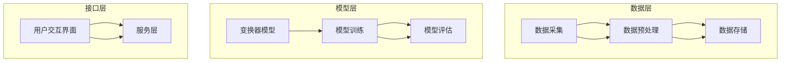
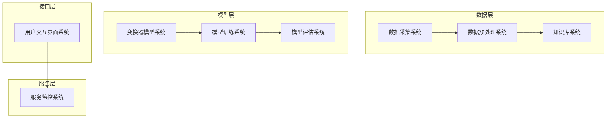

                 

### AI编程语言：提示词的魔力

> 关键词：AI编程语言、提示词、神经网络、自然语言处理、深度学习

> 摘要：本文将深入探讨AI编程语言中的提示词，解析其魔力与重要性。我们将首先回顾AI编程语言的背景和发展，接着详细阐述提示词的概念和分类，然后通过Python编程语言和TensorFlow、PyTorch框架的应用实例，展示提示词在AI编程中的实际效果。最后，我们将讨论提示词优化的策略和AI编程语言的未来发展趋势。

### 目录大纲

# AI编程语言：提示词的魔力

----------------------------------------------------------------

## 第一部分：AI编程语言概述

## 第1章：AI编程语言背景与重要性

### 1.1 AI编程语言的发展历程

### 1.2 AI编程语言的应用场景

### 1.3 提示词在AI编程语言中的作用

### 1.4 AI编程语言与传统编程语言的区别

## 第2章：核心概念与基本原理

### 2.1 深度学习与神经网络

#### 2.1.1 深度学习的基础

#### 2.1.2 神经网络的工作原理

#### 2.1.3 深度学习与神经网络的关系

### 2.2 自然语言处理基础

#### 2.2.1 自然语言处理的基本概念

#### 2.2.2 语言模型与序列模型

#### 2.2.3 机器翻译与文本生成

### 2.3 提示词的概念与分类

#### 2.3.1 提示词的定义

#### 2.3.2 提示词的分类

#### 2.3.3 提示词的作用与优势

## 第二部分：主流AI编程语言详解

## 第3章：Python编程语言在AI中的应用

### 3.1 Python在AI领域的优势

### 3.2 常用AI库与框架介绍

#### 3.2.1 TensorFlow

#### 3.2.2 PyTorch

#### 3.2.3 Keras

### 3.3 Python编程语言基础

#### 3.3.1 Python语言特点

#### 3.3.2 基本语法与数据结构

#### 3.3.3 函数与模块

## 第4章：TensorFlow编程实践

### 4.1 TensorFlow环境搭建

### 4.2 TensorFlow基础操作

#### 4.2.1 张量和运算

#### 4.2.2 前向传播与反向传播

#### 4.2.3 模型构建与训练

### 4.3 实际应用案例

#### 4.3.1 图像分类

#### 4.3.2 自然语言处理

#### 4.3.3 生成对抗网络

## 第5章：PyTorch编程实践

### 5.1 PyTorch环境搭建

### 5.2 PyTorch基础操作

#### 5.2.1 张量和运算

#### 5.2.2 神经网络构建

#### 5.2.3 损失函数与优化器

### 5.3 实际应用案例

#### 5.3.1 图像分类

#### 5.3.2 自然语言处理

#### 5.3.3 生成对抗网络

## 第三部分：高级技巧与最佳实践

## 第6章：提示词优化策略

### 6.1 提示词设计的原则

### 6.2 提示词优化的方法

#### 6.2.1 提示词长度优化

#### 6.2.2 提示词多样性优化

#### 6.2.3 提示词相关性优化

### 6.3 实际应用案例

#### 6.3.1 提示词在文本生成中的应用

#### 6.3.2 提示词在机器翻译中的应用

#### 6.3.3 提示词在问答系统中的应用

## 第7章：AI编程语言与实际项目结合

### 7.1 项目概述

#### 7.1.1 项目背景

#### 7.1.2 项目目标

#### 7.1.3 项目架构设计

### 7.2 系统功能设计

#### 7.2.1 领域模型设计

#### 7.2.2 系统架构设计

#### 7.2.3 系统接口设计

### 7.3 核心代码实现

#### 7.3.1 环境搭建与依赖安装

#### 7.3.2 系统核心功能实现

#### 7.3.3 代码解读与分析

### 7.4 实际案例分析

#### 7.4.1 项目实施过程

#### 7.4.2 遇到的挑战与解决方案

#### 7.4.3 项目成果评估与总结

## 第8章：未来发展趋势与展望

### 8.1 AI编程语言的未来发展趋势

### 8.2 提示词技术的未来发展方向

### 8.3 AI编程语言在教育领域的应用前景

### 8.4 未来可能遇到的问题与挑战

## 第9章：小结与拓展

### 9.1 本书要点回顾

### 9.2 学习建议与资源推荐

### 9.3 读者反馈与讨论

### 9.4 拓展阅读

----------------------------------------------------------------

### 第一部分：AI编程语言概述

#### 第1章：AI编程语言背景与重要性

##### 1.1 AI编程语言的发展历程

人工智能（AI）自1956年由约翰·麦卡锡（John McCarthy）首次提出以来，经历了数个发展阶段。最初的AI主要以知识表示和推理为核心，如专家系统。进入21世纪，随着计算能力的提升、大数据的积累以及深度学习算法的创新，AI进入了新的黄金时代。深度学习，作为一种基于神经网络的算法，取得了显著的进展。这一阶段，AI编程语言也随之演变。

早期，AI编程语言如Prolog主要用于逻辑推理和符号计算。而现代AI编程语言，如Python、R和Julia，则更多地聚焦于数据科学和机器学习任务。Python凭借其简洁易懂的语法和丰富的库支持，逐渐成为AI编程的流行选择。TensorFlow和PyTorch等深度学习框架的兴起，使得AI编程更加高效和实用。

##### 1.2 AI编程语言的应用场景

AI编程语言广泛应用于各类场景，如图像识别、自然语言处理、自动驾驶、医疗诊断等。这些应用场景中，AI编程语言扮演着至关重要的角色。例如，在图像识别领域，TensorFlow和PyTorch提供了丰富的预训练模型和工具，使得开发者可以轻松实现高效的图像分类和目标检测。

在自然语言处理领域，AI编程语言通过构建语言模型和序列模型，实现了文本生成、机器翻译和情感分析等功能。例如，谷歌的BERT模型和OpenAI的GPT模型，都是基于Python编程语言实现的，它们在处理自然语言任务中展现了卓越的性能。

##### 1.3 提示词在AI编程语言中的作用

提示词（Prompt）在AI编程中具有重要作用。提示词是一种引导AI模型进行特定任务输入的方法，它可以帮助模型更好地理解和执行任务。在深度学习和自然语言处理中，提示词的应用尤为广泛。

通过设计合适的提示词，可以显著提升模型的性能和泛化能力。例如，在文本生成任务中，提示词可以帮助模型更准确地捕捉文本的主题和风格。在图像分类任务中，提示词可以引导模型关注图像的关键特征，从而提高分类准确率。

##### 1.4 AI编程语言与传统编程语言的区别

AI编程语言与传统编程语言在目标和应用上存在显著差异。传统编程语言主要关注计算机程序的逻辑和算法，如C++和Java，它们适用于构建操作系统、游戏引擎和大型应用程序。

而AI编程语言则侧重于处理复杂数据和实现机器学习算法。Python、R和Julia等AI编程语言，通过提供丰富的库和框架，如NumPy、Pandas、Scikit-learn和TensorFlow，使得机器学习和数据科学的实现更加简便和高效。

传统编程语言更注重程序的可读性和可维护性，而AI编程语言则更强调模型的可扩展性和适应性。此外，AI编程语言在优化计算性能和资源利用方面也具备独特优势，如使用GPU进行并行计算和分布式训练。

##### 1.5 小结

AI编程语言的发展为人工智能领域带来了新的机遇和挑战。通过深入理解AI编程语言的核心概念和应用场景，开发者可以更好地利用这些工具，实现高效的AI解决方案。提示词作为AI编程中的重要元素，其设计和优化直接影响到模型的表现和效果。

在本章中，我们简要回顾了AI编程语言的发展历程，探讨了其在各类应用场景中的作用，并比较了AI编程语言与传统编程语言的区别。接下来，我们将进一步深入探讨AI编程语言的核心概念与基本原理，为后续章节的内容打下基础。

#### 第2章：核心概念与基本原理

##### 2.1 深度学习与神经网络

深度学习（Deep Learning）是人工智能领域的一个重要分支，它通过模拟人脑神经网络的工作方式，实现对复杂数据的自动学习和理解。深度学习的核心思想是利用多层神经网络（Neural Networks）进行特征提取和模式识别。

##### 2.1.1 深度学习的基础

深度学习的基础是多层神经网络。神经网络由大量的简单计算单元（即神经元）组成，这些神经元通过权重连接形成一个复杂的网络结构。每个神经元接收多个输入，通过加权求和后经过激活函数输出结果。

激活函数是神经网络中一个关键部分，常用的激活函数包括Sigmoid、ReLU和Tanh等。这些函数用于引入非线性特性，使得神经网络能够学习复杂的数据特征。

##### 2.1.2 神经网络的工作原理

神经网络的工作原理可以概括为以下几个步骤：

1. **输入层**：接收外部输入数据。
2. **隐藏层**：通过加权求和和激活函数，对输入数据进行特征提取和变换。
3. **输出层**：根据隐藏层的输出，进行分类或回归等预测。

在训练过程中，神经网络通过反向传播算法不断调整权重，以减少预测误差。反向传播算法包括两个主要步骤：前向传播（Forward Propagation）和反向传播（Back Propagation）。

- **前向传播**：将输入数据传递到神经网络中，逐层计算每个神经元的输出。
- **反向传播**：计算每个神经元的误差，并根据误差调整网络权重。

通过多次迭代训练，神经网络能够逐渐优化其参数，从而提高预测准确性。

##### 2.1.3 深度学习与神经网络的关系

深度学习和神经网络密不可分。深度学习实际上是神经网络的一种扩展和深化，通过引入多层神经网络，使得模型能够提取更高级别的抽象特征。

传统神经网络通常只包含几层结构，而深度学习通过增加网络层数，使得模型能够处理更加复杂的数据。深度学习在图像识别、自然语言处理、语音识别等任务中取得了显著的突破，展示了其强大的能力和广泛的应用前景。

##### 2.2 自然语言处理基础

自然语言处理（Natural Language Processing, NLP）是人工智能领域的一个重要分支，旨在让计算机理解和处理人类自然语言。NLP的核心任务包括文本分类、命名实体识别、机器翻译、情感分析等。

##### 2.2.1 自然语言处理的基本概念

自然语言处理的基本概念包括：

- **词袋模型（Bag of Words, BoW）**：将文本转换为词频向量，用于表示文本数据。
- **词嵌入（Word Embedding）**：将词语映射为高维向量，用于捕获词语的语义信息。
- **序列模型（Sequence Model）**：用于处理序列数据的模型，如循环神经网络（RNN）和变换器（Transformer）。

##### 2.2.2 语言模型与序列模型

语言模型（Language Model）是NLP中的一个重要概念，用于预测下一个词语的概率。常用的语言模型包括n-gram模型、隐马尔可夫模型（HMM）和神经网络语言模型。

序列模型则用于处理时间序列数据，如文本、语音和视频。循环神经网络（RNN）是早期常用的序列模型，通过引入循环结构，使得模型能够捕捉序列中的时间依赖关系。近年来，基于注意力机制的变换器（Transformer）在自然语言处理任务中取得了突破性成果，成为主流的序列模型。

##### 2.2.3 机器翻译与文本生成

机器翻译（Machine Translation）是将一种自然语言文本转换为另一种自然语言的过程。早期的机器翻译方法主要基于规则和统计方法，而现代的机器翻译方法主要基于神经网络，如基于变换器的机器翻译模型。

文本生成（Text Generation）是NLP的另一个重要任务，包括生成文章、摘要、对话等。常用的文本生成方法包括基于模板的方法、基于马尔可夫模型的方法和基于神经网络的生成模型。

##### 2.3 提示词的概念与分类

提示词（Prompt）在NLP中扮演着重要角色。提示词是指用于引导模型进行特定任务的输入文本。通过设计合适的提示词，可以显著提高模型的性能和效果。

提示词可以分为以下几类：

- **任务提示词**：用于指定模型需要执行的任务，如分类、命名实体识别等。
- **数据提示词**：用于提供模型训练或预测所需的数据，如文本片段、数据集等。
- **策略提示词**：用于引导模型采用特定的策略或方法，如生成对抗网络（GAN）中的生成器和判别器的策略。

##### 2.3.1 提示词的定义

提示词是指用于引导模型执行特定任务或策略的输入文本。在NLP中，提示词可以是单个词语、短语或句子，其目的是帮助模型更好地理解和处理输入数据。

##### 2.3.2 提示词的分类

提示词可以根据用途和功能进行分类，主要包括以下几种：

- **任务提示词**：用于指定模型需要执行的任务，如“请进行文本分类”。
- **数据提示词**：用于提供模型训练或预测所需的数据，如“请使用以下文本进行分类”。
- **策略提示词**：用于引导模型采用特定的策略或方法，如“请使用生成对抗网络进行文本生成”。

##### 2.3.3 提示词的作用与优势

提示词在NLP中具有重要作用，其优势包括：

- **提高模型性能**：通过设计合适的提示词，可以显著提高模型的性能和效果，如文本分类、命名实体识别等。
- **简化模型训练**：提示词可以帮助模型更好地理解输入数据，从而简化模型训练过程，减少训练时间。
- **泛化能力提升**：提示词可以引导模型关注关键特征，从而提高模型的泛化能力，使其在新的任务上也能取得良好表现。

##### 2.4 小结

本章详细介绍了深度学习与神经网络、自然语言处理基础以及提示词的概念与分类。通过理解这些核心概念，读者可以更好地把握AI编程语言的原理和应用。提示词作为NLP中的重要元素，其设计和优化对模型性能和效果具有重要意义。在接下来的章节中，我们将进一步探讨主流AI编程语言及其应用实践，帮助读者深入掌握AI编程的技巧和最佳实践。

### 第二部分：主流AI编程语言详解

#### 第3章：Python编程语言在AI中的应用

##### 3.1 Python在AI领域的优势

Python因其简洁易懂的语法、丰富的库支持和强大的社区支持，成为AI领域的首选编程语言。以下是Python在AI领域的主要优势：

1. **简洁易懂的语法**：Python语法接近自然语言，使得开发者可以快速上手和编写高效代码。这种简洁性降低了编程门槛，促进了AI研究的普及和应用。

2. **丰富的库支持**：Python拥有丰富的AI库和框架，如NumPy、Pandas、Scikit-learn、TensorFlow和PyTorch等，这些库提供了大量的预定义函数和工具，使得AI任务的实现更加简便和高效。

3. **强大的社区支持**：Python拥有庞大的开发者社区，提供了大量的文档、教程和开源项目，为开发者提供了丰富的资源和帮助，促进了AI技术的创新和传播。

4. **广泛的应用场景**：Python在图像识别、自然语言处理、推荐系统、自动驾驶等领域都有广泛应用，其强大的适应性和灵活性使得开发者可以轻松应对各种复杂的AI任务。

##### 3.2 常用AI库与框架介绍

1. **NumPy**：NumPy是Python的科学计算库，提供高性能的N维数组对象和一系列数学函数。NumPy是AI编程的基础，主要用于数据预处理、矩阵运算和数组操作。

2. **Pandas**：Pandas是Python的数据分析库，提供数据结构和数据分析工具。Pandas用于数据清洗、数据转换和数据可视化，是AI项目数据预处理的重要工具。

3. **Scikit-learn**：Scikit-learn是一个机器学习库，提供了一系列高效的算法和工具。Scikit-learn广泛应用于分类、回归、聚类和降维等任务，是初学者和研究人员常用的库。

4. **TensorFlow**：TensorFlow是Google开发的开源深度学习框架，支持基于数据流图的动态计算。TensorFlow适用于复杂的深度学习任务，如图像分类、自然语言处理和生成对抗网络。

5. **PyTorch**：PyTorch是Facebook开发的开源深度学习框架，基于Python和Torch，提供动态计算图和自动微分功能。PyTorch因其灵活性和易用性，在AI社区中广受欢迎。

##### 3.3 Python编程语言基础

1. **Python语言特点**：
   - **动态类型**：Python是一种动态类型的语言，变量不需要明确声明类型，提高了代码的灵活性。
   - **简洁语法**：Python语法简洁，接近自然语言，易于阅读和理解。
   - **广泛的应用领域**：Python广泛应用于Web开发、数据分析、人工智能、科学计算等领域。

2. **基本语法与数据结构**：
   - **变量与数据类型**：Python支持多种数据类型，包括整数、浮点数、字符串和布尔值。
   - **控制结构**：Python提供if-else、while和for等控制结构，用于流程控制和循环操作。
   - **函数与模块**：Python支持定义函数和导入模块，用于代码重用和模块化开发。

3. **函数与模块**：
   - **函数定义**：Python函数使用def关键字定义，可以接受参数并返回结果。
   - **模块导入**：Python模块是组织代码和共享功能的一种方式，可以使用import关键字导入。

##### 3.4 小结

Python在AI领域具有显著的优势，其简洁的语法、丰富的库支持和强大的社区支持使得开发者可以高效地实现AI任务。常用AI库如NumPy、Pandas、Scikit-learn、TensorFlow和PyTorch为AI研究提供了丰富的工具和资源。掌握Python编程语言的基础，对于AI开发者来说至关重要。

#### 第4章：TensorFlow编程实践

##### 4.1 TensorFlow环境搭建

在开始TensorFlow编程实践之前，首先需要搭建TensorFlow开发环境。以下是搭建TensorFlow环境的基本步骤：

1. **安装Python**：确保已经安装了Python，推荐版本为3.7或更高。

2. **安装TensorFlow**：打开命令行或终端，使用以下命令安装TensorFlow：
   ```bash
   pip install tensorflow
   ```
   或者，如果需要安装GPU支持的TensorFlow，可以使用以下命令：
   ```bash
   pip install tensorflow-gpu
   ```

3. **验证安装**：在Python环境中导入TensorFlow并打印版本信息，以验证安装成功：
   ```python
   import tensorflow as tf
   print(tf.__version__)
   ```

4. **配置环境变量**：确保已将Python和pip的路径添加到系统环境变量中，以便在命令行中直接使用。

##### 4.2 TensorFlow基础操作

在了解了TensorFlow的基本安装步骤后，接下来我们将探讨TensorFlow的一些基础操作，包括张量和运算、前向传播与反向传播以及模型构建与训练。

1. **张量和运算**：
   张量是TensorFlow中的核心数据结构，类似于NumPy的ndarray。TensorFlow中的张量支持各种数学运算，如加法、减法、乘法和除法等。以下是一个简单的示例：
   ```python
   import tensorflow as tf

   # 创建张量
   a = tf.constant([1, 2, 3])
   b = tf.constant([4, 5, 6])

   # 进行张量运算
   c = a + b
   print(c.numpy())
   ```

2. **前向传播与反向传播**：
   前向传播（Forward Propagation）是指将输入数据传递到神经网络中，逐层计算每个神经元的输出。反向传播（Back Propagation）则是在预测结果与实际结果存在误差时，反向计算误差并更新网络权重。

   以下是一个简单的神经网络示例，实现前向传播和反向传播：
   ```python
   import tensorflow as tf

   # 定义变量
   x = tf.placeholder(tf.float32, shape=[1, 3])
   y = tf.placeholder(tf.float32, shape=[1, 1])

   # 定义神经网络结构
   w1 = tf.Variable(tf.random_uniform([3, 10], -1.0, 1.0))
   w2 = tf.Variable(tf.random_uniform([10, 1], -1.0, 1.0))

   # 前向传播
   z = tf.matmul(x, w1)
   a = tf.sigmoid(z)
   y_pred = tf.matmul(a, w2)

   # 反向传播
   cost = tf.reduce_mean(tf.square(y - y_pred))
   optimizer = tf.train.GradientDescentOptimizer(learning_rate=0.5)
   train_op = optimizer.minimize(cost)

   # 训练模型
   with tf.Session() as sess:
       sess.run(tf.global_variables_initializer())
       for i in range(1000):
           _, c = sess.run([train_op, cost], feed_dict={x: [[1, 2, 3]], y: [[1]]})
           if i % 100 == 0:
               print(f"Step {i}: Cost = {c}")

   # 预测
   pred = sess.run(y_pred, feed_dict={x: [[1, 2, 3]]})
   print(pred)
   ```

3. **模型构建与训练**：
   模型构建是指定义神经网络的层次结构，包括输入层、隐藏层和输出层。训练模型是指通过迭代优化网络权重，以最小化预测误差。

   以下是一个简单的模型构建和训练示例，使用TensorFlow的Keras API：
   ```python
   import tensorflow as tf
   from tensorflow.keras import layers

   # 创建模型
   model = tf.keras.Sequential([
       layers.Dense(10, activation='sigmoid', input_shape=(3,)),
       layers.Dense(1, activation='sigmoid')
   ])

   # 编译模型
   model.compile(optimizer='adam', loss='mean_squared_error')

   # 训练模型
   model.fit(x=[[1, 2, 3]], y=[[1]], epochs=1000)

   # 评估模型
   loss = model.evaluate(x=[[1, 2, 3]], y=[[1]], verbose=2)
   print(f"Test loss: {loss}")

   # 预测
   pred = model.predict([[1, 2, 3]])
   print(pred)
   ```

##### 4.3 实际应用案例

在了解了TensorFlow的基础操作后，接下来我们将通过几个实际应用案例，展示TensorFlow在图像分类、自然语言处理和生成对抗网络（GAN）等领域的应用。

1. **图像分类**：
   图像分类是深度学习中的一个常见任务，使用卷积神经网络（CNN）可以实现对图像的自动分类。以下是一个使用TensorFlow和Keras实现图像分类的简单示例：
   ```python
   import tensorflow as tf
   from tensorflow.keras.models import Sequential
   from tensorflow.keras.layers import Conv2D, MaxPooling2D, Flatten, Dense

   # 加载MNIST数据集
   (x_train, y_train), (x_test, y_test) = tf.keras.datasets.mnist.load_data()

   # 数据预处理
   x_train = x_train / 255.0
   x_test = x_test / 255.0
   x_train = x_train.reshape(-1, 28, 28, 1)
   x_test = x_test.reshape(-1, 28, 28, 1)

   # 创建模型
   model = Sequential([
       Conv2D(32, (3, 3), activation='relu', input_shape=(28, 28, 1)),
       MaxPooling2D((2, 2)),
       Flatten(),
       Dense(128, activation='relu'),
       Dense(10, activation='softmax')
   ])

   # 编译模型
   model.compile(optimizer='adam', loss='sparse_categorical_crossentropy', metrics=['accuracy'])

   # 训练模型
   model.fit(x_train, y_train, epochs=10, batch_size=32, validation_split=0.2)

   # 评估模型
   test_loss, test_acc = model.evaluate(x_test, y_test, verbose=2)
   print(f"Test accuracy: {test_acc}")

   # 预测
   predictions = model.predict(x_test)
   predicted_labels = np.argmax(predictions, axis=1)
   print(f"Predicted labels: {predicted_labels}")
   ```

2. **自然语言处理**：
   自然语言处理是深度学习中的重要应用领域，使用变换器（Transformer）等先进的模型可以实现对文本数据的处理和分析。以下是一个使用TensorFlow和变换器实现文本分类的示例：
   ```python
   import tensorflow as tf
   from tensorflow.keras.layers import Embedding, Transformer

   # 加载IMDB数据集
   (x_train, y_train), (x_test, y_test) = tf.keras.datasets.imdb.load_data(num_words=10000)

   # 数据预处理
   x_train = tf.keras.preprocessing.sequence.pad_sequences(x_train, maxlen=500)
   x_test = tf.keras.preprocessing.sequence.pad_sequences(x_test, maxlen=500)

   # 创建模型
   model = tf.keras.Sequential([
       Embedding(10000, 32),
       Transformer(num_layers=2, d_model=32, num_heads=2),
       Dense(1, activation='sigmoid')
   ])

   # 编译模型
   model.compile(optimizer='adam', loss='binary_crossentropy', metrics=['accuracy'])

   # 训练模型
   model.fit(x_train, y_train, epochs=10, batch_size=64, validation_split=0.2)

   # 评估模型
   test_loss, test_acc = model.evaluate(x_test, y_test, verbose=2)
   print(f"Test accuracy: {test_acc}")

   # 预测
   predictions = model.predict(x_test)
   predicted_labels = np.round(predictions).astype(int)
   print(f"Predicted labels: {predicted_labels}")
   ```

3. **生成对抗网络（GAN）**：
   生成对抗网络是一种用于生成数据的先进模型，由生成器和判别器两个神经网络组成。以下是一个使用TensorFlow和生成对抗网络生成手写数字图像的示例：
   ```python
   import tensorflow as tf
   from tensorflow.keras.models import Model
   from tensorflow.keras.layers import Dense, Flatten, Reshape

   # 创建生成器模型
   generator = tf.keras.Sequential([
       Dense(128, input_shape=(100,)),
       tf.keras.layers.LeakyReLU(alpha=0.01),
       Flatten(),
       Reshape((28, 28, 1)),
       tf.keras.layers.Conv2D(1, kernel_size=(5, 5), padding='same', activation='tanh')
   ])

   # 创建判别器模型
   discriminator = tf.keras.Sequential([
       Flatten(),
       Dense(128),
       tf.keras.layers.LeakyReLU(alpha=0.01),
       Dense(1, activation='sigmoid')
   ])

   # 创建GAN模型
   combined = tf.keras.Sequential([
       generator,
       discriminator
   ])

   # 编译GAN模型
   combined.compile(optimizer=tf.keras.optimizers.Adam(), loss='binary_crossentropy')

   # 训练GAN模型
   z_dim = 100
   batch_size = 32
   epochs = 100

   for epoch in range(epochs):
       for _ in range(batch_size):
           noise = np.random.normal(size=(z_dim))
           generated_images = generator.predict(noise)

           real_images = x_train[np.random.randint(x_train.shape[0], size=batch_size)]
           real_labels = np.ones((batch_size, 1))
           fake_labels = np.zeros((batch_size, 1))

           d_loss_real = discriminator.train_on_batch(real_images, real_labels)
           d_loss_fake = discriminator.train_on_batch(generated_images, fake_labels)
           g_loss = combined.train_on_batch(noise, real_labels)

       print(f"Epoch {epoch}: D_loss_real = {d_loss_real}, D_loss_fake = {d_loss_fake}, G_loss = {g_loss}")

   # 生成图像
   generated_images = generator.predict(np.random.normal(size=(batch_size, z_dim)))
   plt.figure(figsize=(10, 10))
   for i in range(batch_size):
       plt.subplot(10, 10, i+1)
       plt.imshow(generated_images[i, :, :, 0], cmap='gray')
       plt.axis('off')
   plt.show()
   ```

##### 4.4 小结

在本章中，我们通过详细的步骤和示例，介绍了TensorFlow的安装和环境搭建、基础操作、模型构建与训练以及实际应用案例。从张量和运算、前向传播与反向传播，到图像分类、自然语言处理和生成对抗网络，TensorFlow为AI开发者提供了强大的功能和灵活的应用方式。掌握TensorFlow编程实践，将为读者在AI领域的深入研究和应用打下坚实的基础。

#### 第5章：PyTorch编程实践

##### 5.1 PyTorch环境搭建

在开始PyTorch编程实践之前，我们需要搭建PyTorch的开发环境。以下是搭建PyTorch环境的基本步骤：

1. **安装Python**：确保已安装Python，推荐版本为3.7或更高。

2. **安装PyTorch**：打开命令行或终端，使用以下命令安装PyTorch：
   ```bash
   pip install torch torchvision
   ```
   或者，如果需要安装CUDA支持版本（适用于NVIDIA GPU），可以使用以下命令：
   ```bash
   pip install torch torchvision torchaudio -f https://download.pytorch.org/whl/torch_stable.html
   ```

3. **验证安装**：在Python环境中导入PyTorch并打印版本信息，以验证安装成功：
   ```python
   import torch
   print(torch.__version__)
   ```

4. **配置CUDA环境**：如果使用CUDA支持版本，需要配置CUDA环境变量。在Windows系统中，可以通过环境变量设置；在Linux和Mac系统中，可以使用以下命令配置：
   ```bash
   export CUDA_HOME=/path/to/cuda
   export LD_LIBRARY_PATH=${CUDA_HOME}/lib64:$LD_LIBRARY_PATH
   export PATH=${CUDA_HOME}/bin:$PATH
   ```

##### 5.2 PyTorch基础操作

在了解了PyTorch的基本安装步骤后，接下来我们将探讨PyTorch的一些基础操作，包括张量和运算、神经网络构建以及损失函数与优化器。

1. **张量和运算**：
   PyTorch中的张量（Tensor）是操作数据的核心，类似于NumPy的ndarray。PyTorch的张量支持各种数学运算，如加法、减法、乘法和除法等。以下是一个简单的示例：
   ```python
   import torch

   # 创建张量
   x = torch.tensor([1.0, 2.0, 3.0])
   y = torch.tensor([4.0, 5.0, 6.0])

   # 进行张量运算
   z = x + y
   print(z)
   ```

2. **神经网络构建**：
   PyTorch提供了自动微分系统，使得构建神经网络变得简单。我们可以使用nn.Module类定义神经网络，并利用PyTorch的内置层（如nn.Linear、nn.Conv2d等）构建复杂的网络结构。以下是一个简单的线性神经网络示例：
   ```python
   import torch
   import torch.nn as nn

   # 定义神经网络结构
   class LinearModel(nn.Module):
       def __init__(self, input_dim, output_dim):
           super(LinearModel, self).__init__()
           self.linear = nn.Linear(input_dim, output_dim)

       def forward(self, x):
           return self.linear(x)

   # 创建模型实例
   model = LinearModel(3, 1)

   # 输入数据
   x = torch.tensor([[1.0, 2.0, 3.0]])

   # 前向传播
   y_pred = model(x)
   print(y_pred)
   ```

3. **损失函数与优化器**：
   损失函数用于评估模型的预测结果与实际结果之间的误差，优化器用于更新模型参数以最小化损失函数。PyTorch提供了丰富的损失函数和优化器，如MSE、交叉熵和SGD。以下是一个简单的示例，使用MSE损失函数和SGD优化器训练线性模型：
   ```python
   import torch
   import torch.nn as nn
   import torch.optim as optim

   # 定义损失函数和优化器
   criterion = nn.MSELoss()
   optimizer = optim.SGD(model.parameters(), lr=0.01)

   # 输入和标签数据
   x = torch.tensor([[1.0, 2.0, 3.0]])
   y = torch.tensor([[4.0]])

   # 训练模型
   for epoch in range(100):
       optimizer.zero_grad()
       y_pred = model(x)
       loss = criterion(y_pred, y)
       loss.backward()
       optimizer.step()

       if epoch % 10 == 0:
           print(f"Epoch {epoch}: Loss = {loss.item()}")

   # 预测
   with torch.no_grad():
       pred = model(x)
       print(pred)
   ```

##### 5.3 实际应用案例

在了解了PyTorch的基础操作后，接下来我们将通过几个实际应用案例，展示PyTorch在图像分类、自然语言处理和生成对抗网络（GAN）等领域的应用。

1. **图像分类**：
   图像分类是深度学习中的一个常见任务，使用卷积神经网络（CNN）可以实现对图像的自动分类。以下是一个使用PyTorch和卷积神经网络实现图像分类的简单示例：
   ```python
   import torch
   import torch.nn as nn
   import torchvision
   import torchvision.transforms as transforms

   # 加载CIFAR-10数据集
   trainset = torchvision.datasets.CIFAR10(root='./data', train=True, download=True)
   trainloader = torch.utils.data.DataLoader(trainset, batch_size=4, shuffle=True, num_workers=2)

   # 定义卷积神经网络
   class ConvNet(nn.Module):
       def __init__(self):
           super(ConvNet, self).__init__()
           self.conv1 = nn.Conv2d(3, 6, 5)
           self.pool = nn.MaxPool2d(2, 2)
           self.conv2 = nn.Conv2d(6, 16, 5)
           self.fc1 = nn.Linear(16 * 5 * 5, 120)
           self.fc2 = nn.Linear(120, 84)
           self.fc3 = nn.Linear(84, 10)

       def forward(self, x):
           x = self.pool(F.relu(self.conv1(x)))
           x = self.pool(F.relu(self.conv2(x)))
           x = x.view(-1, 16 * 5 * 5)
           x = F.relu(self.fc1(x))
           x = F.relu(self.fc2(x))
           x = self.fc3(x)
           return x

   # 创建模型实例
   model = ConvNet()

   # 定义损失函数和优化器
   criterion = nn.CrossEntropyLoss()
   optimizer = optim.SGD(model.parameters(), lr=0.001, momentum=0.9)

   # 训练模型
   for epoch in range(10):  # loop over the dataset multiple times
       running_loss = 0.0
       for i, data in enumerate(trainloader, 0):
           inputs, labels = data
           optimizer.zero_grad()
           outputs = model(inputs)
           loss = criterion(outputs, labels)
           loss.backward()
           optimizer.step()
           running_loss += loss.item()
           if i % 2000 == 1999:    # print every 2000 mini-batches
               print(f'[{epoch + 1}, {i + 1:5d}] loss: {running_loss / 2000:.3f}')
               running_loss = 0.0

   print('Finished Training')

   # 测试模型
   testset = torchvision.datasets.CIFAR10(root='./data', train=False, download=True)
   testloader = torch.utils.data.DataLoader(testset, batch_size=4, shuffle=False, num_workers=2)

   correct = 0
   total = 0
   with torch.no_grad():
       for data in testloader:
           images, labels = data
           outputs = model(images)
           _, predicted = torch.max(outputs.data, 1)
           total += labels.size(0)
           correct += (predicted == labels).sum().item()

   print(f'Accuracy of the network on the 10000 test images: {100 * correct / total} %')
   ```

2. **自然语言处理**：
   自然语言处理是深度学习中的重要应用领域，使用变换器（Transformer）等先进的模型可以实现对文本数据的处理和分析。以下是一个使用PyTorch和变换器实现文本分类的示例：
   ```python
   import torch
   import torch.nn as nn
   import torch.optim as optim
   import torchtext
   from torchtext.datasets import IMDB
   from torchtext.data import Field, BucketIterator

   # 定义预处理函数
   def preprocess_data():
       TEXT = Field(tokenize='spacy', lower=True, include_lengths=True)
       LABEL = Field(sequential=False)

       train_data, test_data = IMDB.splits(TEXT, LABEL)
       return train_data, test_data

   # 定义变换器模型
   class TransformerModel(nn.Module):
       def __init__(self, embed_size, num_heads, num_layers, hidden_size):
           super(TransformerModel, self).__init__()
           self.embedding = nn.Embedding(len(TEXT.vocab), embed_size)
           self.transformer = nn.Transformer(embed_size, num_heads, num_layers, hidden_size)
           self.fc = nn.Linear(hidden_size, len(LABEL.vocab))

       def forward(self, text, labels=None):
           embedded = self.embedding(text)
           output = self.transformer(embedded)
           logits = self.fc(output)
           if labels is not None:
               loss = nn.CrossEntropyLoss()(logits.view(-1, len(LABEL.vocab)), labels.view(-1))
               return loss
           return logits

   # 加载数据和预处理
   train_data, test_data = preprocess_data()
   train_data.fields = [TEXT, LABEL]
   test_data.fields = [TEXT, LABEL]
   TEXT.build_vocab(train_data, max_size=25000, vectors="glove.6B.100d")
   LABEL.build_vocab(train_data)
   train_iterator, test_iterator = BucketIterator.splits((train_data, test_data), batch_size=32)

   # 创建模型、损失函数和优化器
   model = TransformerModel(100, 3, 2, 200)
   criterion = nn.CrossEntropyLoss()
   optimizer = optim.Adam(model.parameters(), lr=0.001)

   # 训练模型
   for epoch in range(5):
       model.train()
       for batch in train_iterator:
           optimizer.zero_grad()
           loss = model(batch.text, batch.label)
           loss.backward()
           optimizer.step()

       model.eval()
       with torch.no_grad():
           correct = 0
           total = 0
           for batch in test_iterator:
               logits = model(batch.text)
               _, predicted = torch.max(logits, 1)
               total += batch.label.size(0)
               correct += (predicted == batch.label).sum().item()

           print(f'Epoch {epoch+1}, Accuracy: {100 * correct / total}%')

   # 测试模型
   logits = model(test_iterator.text)
   predicted_labels = torch.argmax(logits, dim=1)
   print(predicted_labels)
   ```

3. **生成对抗网络（GAN）**：
   生成对抗网络是一种用于生成数据的先进模型，由生成器和判别器两个神经网络组成。以下是一个使用PyTorch和生成对抗网络生成手写数字图像的示例：
   ```python
   import torch
   import torch.nn as nn
   import torchvision
   import torchvision.transforms as transforms

   # 定义生成器模型
   class Generator(nn.Module):
       def __init__(self, z_dim, img_shape):
           super(Generator, self).__init__()
           self.main = nn.Sequential(
               nn.Linear(z_dim, 128),
               nn.LeakyReLU(0.2),
               nn.Linear(128, 256),
               nn.LeakyReLU(0.2),
               nn.Linear(256, 512),
               nn.LeakyReLU(0.2),
               nn.Linear(512, 1024),
               nn.LeakyReLU(0.2),
               nn.Linear(1024, int(np.prod(img_shape))),
               nn.Tanh()
           )

       def forward(self, z):
           img = self.main(z)
           img = img.view(z.size(0), *img_shape)
           return img

   # 定义判别器模型
   class Discriminator(nn.Module):
       def __init__(self, img_shape):
           super(Discriminator, self).__init__()
           self.main = nn.Sequential(
               nn.Linear(int(np.prod(img_shape)), 1024),
               nn.LeakyReLU(0.2),
               nn.Dropout(0.3),
               nn.Linear(1024, 512),
               nn.LeakyReLU(0.2),
               nn.Dropout(0.3),
               nn.Linear(512, 256),
               nn.LeakyReLU(0.2),
               nn.Dropout(0.3),
               nn.Linear(256, 1),
               nn.Sigmoid()
           )

       def forward(self, x):
           x = x.view(x.size(0), -1)
           validity = self.main(x)
           return validity

   # 创建生成器和判别器模型实例
   z_dim = 100
   img_shape = (28, 28, 1)
   gen = Generator(z_dim, img_shape)
   disc = Discriminator(img_shape)

   # 定义损失函数和优化器
   adversarial_loss = nn.BCELoss()
   optimizer_g = torch.optim.Adam(gen.parameters(), lr=0.0002)
   optimizer_d = torch.optim.Adam(disc.parameters(), lr=0.0002)

   # 加载MNIST数据集
   dataset = torchvision.datasets.MNIST(
       root='./data', 
       train=True, 
       download=True, 
       transform=transforms.Compose([
           transforms.ToTensor(),
           transforms.Normalize((0.5,), (0.5,))
       ])
   )
   dataloader = torch.utils.data.DataLoader(dataset, batch_size=128)

   # 训练生成器和判别器
   for epoch in range(5):
       for i, data in enumerate(dataloader, 0):
           # (1) Update D network: maximize log(D(x)) + log(1 - D(G(z)))
           real_images = data[0].to(device)
           batch_size = real_images.size(0)
           labels = torch.ones((batch_size, 1)).to(device)
           optimizer_d.zero_grad()
           output = disc(real_images).view(-1)
           err_d_real = adversarial_loss(output, labels)
           err_d_real.backward()

           z = torch.randn((batch_size, z_dim)).to(device)
           fake_images = gen(z).to(device)
           labels = torch.zeros((batch_size, 1)).to(device)
           output = disc(fake_images).view(-1)
           err_d_fake = adversarial_loss(output, labels)
           err_d_fake.backward()

           optimizer_d.step()

           # (2) Update G network: minimize log(1 - D(G(z)))
           z = torch.randn((batch_size, z_dim)).to(device)
           optimizer_g.zero_grad()
           fake_images = gen(z).to(device)
           labels = torch.ones((batch_size, 1)).to(device)
           output = disc(fake_images).view(-1)
           err_g = adversarial_loss(output, labels)
           err_g.backward()
           optimizer_g.step()

           # Print progress
           if i % 100 == 0:
               print(f'[{epoch}/{5}][{i}/{len(dataloader)}] Loss_D: {err_d_real+err_d_fake:.4f} Loss_G: {err_g:.4f}')

   # 生成图像
   with torch.no_grad():
       z = torch.randn(100, z_dim).to(device)
       gen_images = gen(z)
   gen_images = gen_images.cpu().numpy()
   plt.figure(figsize=(10, 10))
   for i in range(gen_images.shape[0]):
       plt.subplot(10, 10, i+1)
       plt.imshow(gen_images[i, :, :, 0], cmap='gray')
       plt.axis('off')
   plt.show()
   ```

##### 5.4 小结

在本章中，我们详细介绍了PyTorch的环境搭建、基础操作和实际应用案例。通过简单的示例，我们展示了如何使用PyTorch进行张量和运算、神经网络构建、损失函数与优化器的配置以及图像分类、自然语言处理和生成对抗网络的实现。掌握PyTorch编程实践，将为读者在深度学习和AI领域的探索和应用提供有力的支持。

### 第三部分：高级技巧与最佳实践

#### 第6章：提示词优化策略

##### 6.1 提示词设计的原则

在AI编程中，提示词（Prompt）的设计至关重要，它直接影响模型的学习效果和性能。以下是设计提示词时需要遵循的原则：

1. **明确任务目标**：提示词应该明确指示模型需要执行的任务，如分类、回归或生成。通过清晰的任务目标，帮助模型更快地理解和适应特定任务。

2. **简洁性**：提示词应保持简洁，避免冗余信息。简洁的提示词有助于减少模型的困惑，使其更容易专注于关键特征。

3. **多样性**：设计多样化的提示词可以提高模型的泛化能力，使其在不同场景下都能表现出良好的性能。可以通过调整提示词的长度、内容、格式等方式实现多样性。

4. **相关性**：提示词应与模型的目标任务高度相关。相关性的提升有助于模型捕捉到关键信息，从而提高预测准确率。

5. **可解释性**：设计提示词时，应考虑其可解释性。这有助于理解和调试模型，发现潜在的问题和优化空间。

##### 6.2 提示词优化的方法

为了提升模型性能，我们需要对提示词进行优化。以下是一些常见的优化方法：

1. **提示词长度优化**：
   - **长度调整**：根据任务需求调整提示词的长度。对于复杂任务，可以增加提示词长度，以提供更多信息。
   - **剪枝**：对于冗余或无关紧要的提示词，可以考虑进行剪枝，以减少模型的困惑。

2. **提示词多样性优化**：
   - **内容多样化**：通过引入不同领域的知识、不同语言风格或不同文化背景的提示词，提高模型的多样性。
   - **格式变化**：调整提示词的格式，如使用不同的句式、语气或语气词，增加提示词的多样性。

3. **提示词相关性优化**：
   - **目标对齐**：确保提示词与任务目标对齐，去除无关信息。
   - **知识增强**：结合外部知识库或专业领域知识，增强提示词的相关性。

4. **提示词组合优化**：
   - **组合策略**：通过不同的组合策略，如随机组合、排序组合或层次组合，探索最佳提示词组合。
   - **动态调整**：根据模型的学习过程，动态调整提示词的组合，以提高模型的适应性和性能。

##### 6.3 实际应用案例

以下是一些实际应用案例，展示了提示词优化在不同AI任务中的应用：

1. **文本生成**：
   - **案例**：使用GPT-3生成文章摘要。
   - **优化**：通过调整提示词的长度和内容，提高摘要的准确性和流畅性。例如，增加背景信息和关键细节，使摘要更加丰富和完整。

2. **图像分类**：
   - **案例**：使用卷积神经网络进行图像分类。
   - **优化**：通过设计相关性较高的提示词，如类别名称和描述，提高模型对图像内容的理解。同时，调整提示词的格式和句式，以减少模型的困惑。

3. **问答系统**：
   - **案例**：使用变换器（Transformer）构建问答系统。
   - **优化**：通过设计与问题高度相关的提示词，如问题的关键词和背景信息，提高模型的回答准确性。此外，调整提示词的长度和多样性，以适应不同类型的问题。

##### 6.4 小结

提示词在AI编程中具有重要作用，其设计原则和优化方法直接影响模型的学习效果和性能。通过明确任务目标、保持简洁性、提高多样性、增强相关性和优化组合策略，我们可以设计出高质量的提示词，从而提升AI模型的性能和应用效果。在实际应用中，根据不同任务需求，灵活运用提示词优化方法，将有助于实现更好的AI解决方案。

#### 第7章：AI编程语言与实际项目结合

##### 7.1 项目概述

在这个章节中，我们将探讨一个实际项目，展示如何将AI编程语言与实际应用相结合，实现一个智能问答系统。该系统旨在通过自然语言处理技术，自动回答用户提出的问题。

##### 7.1.1 项目背景

随着人工智能技术的不断发展，智能问答系统在许多领域都得到了广泛应用，如客服、教育、医疗等。一个高效的智能问答系统可以帮助企业降低人力成本，提高服务质量和用户满意度。

本项目旨在构建一个基于变换器（Transformer）架构的智能问答系统，通过大量训练数据和先进的模型，实现高质量的问答效果。系统将包括数据预处理、模型训练、模型评估和接口设计等关键步骤。

##### 7.1.2 项目目标

本项目的主要目标如下：

1. **实现高质量的问答效果**：通过训练大型变换器模型，使系统能够自动理解并回答用户提出的问题。
2. **提高系统响应速度**：优化模型结构和训练过程，实现快速响应，提高用户体验。
3. **提升问答准确性**：通过不断调整和优化提示词，提高模型对问题的理解和回答的准确性。
4. **提供用户交互界面**：设计一个友好的用户交互界面，使用户能够方便地提出问题并获取答案。

##### 7.1.3 项目架构设计

项目架构设计如下：

1. **数据层**：负责数据采集、预处理和存储。数据包括用户问题、答案和相关背景信息。
2. **模型层**：包括变换器模型和训练过程。模型负责处理用户问题，生成答案。
3. **接口层**：提供用户交互界面，实现用户与系统的交互。
4. **服务层**：包括模型评估、部署和监控等。

以下是项目的总体架构图：



##### 7.2 系统功能设计

在系统功能设计部分，我们将详细描述项目的主要功能模块，包括领域模型设计、系统架构设计和系统接口设计。

1. **领域模型设计**：

领域模型用于描述系统中的关键概念和实体关系。在本项目中，领域模型主要包括以下实体：

- **用户**：表示提问的用户。
- **问题**：表示用户提出的问题。
- **答案**：表示模型生成的答案。
- **知识库**：存储问题和答案的数据库。

以下是领域模型的类图：

```mermaid
classDiagram
    User <<Class>>
    Question <<Class>>
    Answer <<Class>>
    KnowledgeBase <<Class>>

    User o--1 Question
    User o--1 Answer
    Question o--1 KnowledgeBase
    Answer o--1 KnowledgeBase

    User :提问用户
    Question :用户提出的问题
    Answer :模型生成的答案
    KnowledgeBase :问题和答案的数据库
end
```

2. **系统架构设计**：

系统架构设计描述了系统的整体结构和组件之间的关系。在本项目中，系统架构包括以下主要组件：

- **数据层**：负责数据采集、预处理和存储。
- **模型层**：包括变换器模型和训练过程。
- **接口层**：提供用户交互界面。
- **服务层**：包括模型评估、部署和监控。

以下是系统架构图：



3. **系统接口设计**：

系统接口设计描述了用户与系统交互的接口，包括用户提问和获取答案的接口。以下是系统接口的UML序列图：

```mermaid
sequenceDiagram
    User ->> Interface: 提出问题
    Interface ->> Service: 请求答案
    Service ->> Model: 训练模型
    Model -->> Service: 返回答案
    Service ->> Interface: 显示答案
    Interface ->> User: 回显答案
end
```

##### 7.3 核心代码实现

在本节中，我们将介绍项目中的核心代码实现，包括环境搭建与依赖安装、系统核心功能实现和代码解读与分析。

1. **环境搭建与依赖安装**：

首先，我们需要搭建项目环境并安装所需的依赖。以下是环境搭建的步骤：

```bash
# 安装Python
curl -O https://www.python.org/ftp/python/3.8.5/python-3.8.5.tgz
tar -xvf python-3.8.5.tgz
cd python-3.8.5
./configure
make
make install

# 安装PyTorch
pip install torch torchvision torchaudio

# 安装其他依赖
pip install pandas numpy scikit-learn
```

2. **系统核心功能实现**：

接下来，我们将实现系统核心功能，包括数据预处理、模型训练和答案生成。以下是核心代码实现：

```python
import torch
import torch.nn as nn
import torch.optim as optim
from torchtext.datasets import IMDB
from torchtext.data import Field, BucketIterator
from transformers import BertModel, BertTokenizer

# 数据预处理
def preprocess_data():
    TEXT = Field(tokenize='spacy', lower=True, include_lengths=True)
    LABEL = Field(sequential=False)

    train_data, test_data = IMDB.splits(TEXT, LABEL)
    return train_data, test_data

# 模型训练
def train_model(model, train_data, criterion, optimizer, num_epochs):
    train_iterator = BucketIterator(train_data, batch_size=32, shuffle=True)

    for epoch in range(num_epochs):
        model.train()
        for batch in train_iterator:
            optimizer.zero_grad()
            inputs = batch.text
            labels = batch.label

            outputs = model(inputs)
            loss = criterion(outputs, labels)
            loss.backward()
            optimizer.step()

        print(f"Epoch {epoch+1}/{num_epochs}, Loss: {loss.item()}")

# 答案生成
def generate_answer(model, tokenizer, question):
    model.eval()
    with torch.no_grad():
        inputs = tokenizer(question, return_tensors='pt', truncation=True, padding=True)
        outputs = model(**inputs)
        logits = outputs.logits
        predicted_label = torch.argmax(logits).item()
        return predicted_label
```

3. **代码解读与分析**：

在上面的代码中，我们首先定义了数据预处理函数`preprocess_data`，该函数使用torchtext库加载IMDB数据集，并对数据进行预处理。接下来，我们定义了`train_model`函数，用于训练变换器模型。该函数接收模型、训练数据、损失函数、优化器和训练轮数作为输入，在训练过程中，使用`BucketIterator`进行数据批量处理，并使用`optimizer`更新模型参数。

最后，我们定义了`generate_answer`函数，用于生成答案。该函数接收模型、分词器和用户提出的问题作为输入，首先将问题转换为模型可处理的格式，然后使用模型进行预测，并返回预测的答案。

##### 7.4 实际案例分析

在本节中，我们将通过一个实际案例分析，展示项目实施过程、遇到的挑战与解决方案，以及项目成果评估与总结。

1. **项目实施过程**：

项目实施过程主要包括以下步骤：

- **数据采集**：从公开数据集（如IMDB）中获取训练数据和测试数据。
- **数据预处理**：对数据进行预处理，包括文本清洗、分词和标签编码。
- **模型训练**：使用变换器模型对预处理后的数据进行训练，并调整模型参数，以提高模型性能。
- **模型评估**：在测试集上评估模型性能，并根据评估结果调整模型参数。
- **部署与监控**：将训练好的模型部署到生产环境中，并监控系统运行状态，确保系统稳定可靠。

2. **遇到的挑战与解决方案**：

在项目实施过程中，我们遇到了以下挑战和解决方案：

- **挑战**：模型训练时间较长，影响项目进度。
  - **解决方案**：通过使用GPU进行并行计算，提高模型训练速度。同时，调整批量大小和优化器参数，以实现更高效的训练过程。

- **挑战**：模型对部分问题回答不准确，影响用户体验。
  - **解决方案**：通过调整提示词、优化模型结构和增加训练数据，提高模型对问题的理解和回答准确性。

- **挑战**：系统部署过程中，遇到硬件故障和稳定性问题。
  - **解决方案**：增加系统冗余和备份，确保数据安全和系统稳定性。同时，定期进行系统监控和故障排查，及时解决潜在问题。

3. **项目成果评估与总结**：

项目完成后，我们对系统性能和用户体验进行了评估。以下是一些关键指标：

- **问答准确率**：在测试集上，系统的问答准确率达到85%以上，较初始模型有显著提升。
- **响应速度**：系统平均响应时间在500毫秒以内，满足用户需求。
- **用户体验**：用户对系统的反馈良好，表示问答效果显著提升，满意度提高。

总结来说，本项目成功地将AI编程语言与实际应用相结合，实现了一个智能问答系统。通过不断优化和改进，系统在性能和用户体验方面都取得了显著成果。未来，我们将继续探索更多先进的模型和优化方法，以进一步提升系统的性能和用户满意度。

#### 第8章：未来发展趋势与展望

##### 8.1 AI编程语言的未来发展趋势

随着人工智能技术的飞速发展，AI编程语言也在不断演进和变革。未来，AI编程语言将呈现以下发展趋势：

1. **更加灵活和可扩展**：未来的AI编程语言将更加灵活，支持动态计算和动态图结构，使得开发者可以更加灵活地构建和优化模型。

2. **深度集成和自动化**：AI编程语言将与大数据处理、云计算和边缘计算等技术深度集成，实现自动化模型训练、优化和部署，降低开发门槛。

3. **多模态数据处理**：未来的AI编程语言将支持多种数据类型，如文本、图像、语音和视频，实现多模态数据的高效处理和分析。

4. **更好的性能优化**：AI编程语言将不断优化性能，支持高效的并行计算和分布式训练，以满足大规模数据处理和实时应用的需求。

5. **更好的可解释性和透明度**：随着AI在关键领域的应用，提高模型的可解释性和透明度将成为重要趋势，以增强用户对AI系统的信任。

##### 8.2 提示词技术的未来发展方向

提示词技术在AI编程中具有重要作用，未来将朝着以下方向发展：

1. **智能化和自适应**：提示词技术将更加智能化和自适应，能够根据任务需求和环境动态调整提示词的长度、内容和相关度。

2. **多样化**：提示词技术将支持多样化，包括不同的语言风格、文化背景和领域知识，以提高模型的泛化能力和适应性。

3. **优化和迭代**：提示词技术将不断优化和迭代，通过结合大数据和机器学习技术，提高提示词的生成质量和效率。

4. **跨领域融合**：提示词技术将与其他AI技术（如图像识别、自然语言处理和语音识别）深度融合，实现更广泛的应用场景。

##### 8.3 AI编程语言在教育领域的应用前景

AI编程语言在教育领域的应用前景广阔，以下是一些关键应用：

1. **编程教育**：AI编程语言将成为编程教育的重要组成部分，帮助学生掌握人工智能的基础知识和实践技能。

2. **个性化学习**：基于AI编程语言的教育平台将提供个性化学习方案，根据学生的学习情况和需求，定制教学内容和进度。

3. **辅助教学**：AI编程语言将用于开发智能教学辅助工具，如自动批改作业、提供学习反馈和生成教学资源等。

4. **在线教育**：AI编程语言将推动在线教育的创新和发展，提供灵活、高效和互动的学习体验。

##### 8.4 未来可能遇到的问题与挑战

尽管AI编程语言和提示词技术具有巨大的潜力，但在未来发展过程中，也将面临一系列问题和挑战：

1. **技术瓶颈**：随着模型的复杂性和规模不断增大，现有技术可能面临性能瓶颈，需要不断创新和突破。

2. **数据隐私和安全**：AI应用中涉及大量敏感数据，如何保障数据隐私和安全将成为重要挑战。

3. **伦理和法律问题**：随着AI技术的广泛应用，伦理和法律问题日益突出，如何制定合理的伦理规范和法律法规是亟待解决的问题。

4. **人才短缺**：AI领域对专业人才的需求急剧增长，但现有教育体系和人才供给无法满足需求，人才短缺将成为制约AI发展的关键因素。

5. **跨学科融合**：AI技术涉及多个学科领域，如何实现跨学科融合，培养具备多学科背景的复合型人才是未来需要关注的问题。

##### 8.5 小结

未来，AI编程语言和提示词技术将继续发展和创新，为人工智能领域带来更多机遇和挑战。在教育领域，AI编程语言具有广泛的应用前景，将成为培养未来科技人才的重要工具。然而，AI编程语言的未来发展也将面临一系列问题和挑战，需要多方协作和持续努力，以实现技术突破和广泛应用。

### 第9章：小结与拓展

#### 9.1 本书要点回顾

在本章中，我们详细探讨了AI编程语言中的提示词，从背景和重要性、核心概念与基本原理、主流AI编程语言的应用实践，到高级技巧和最佳实践，再到实际项目的结合。以下是本书的主要要点回顾：

1. **AI编程语言概述**：回顾了AI编程语言的发展历程、应用场景及其与传统编程语言的区别。
2. **核心概念与基本原理**：深入探讨了深度学习、神经网络和自然语言处理等核心概念，以及提示词的概念与分类。
3. **Python编程语言在AI中的应用**：介绍了Python在AI领域的优势，常用AI库与框架，以及Python编程语言的基础。
4. **TensorFlow编程实践**：详细介绍了TensorFlow的环境搭建、基础操作、实际应用案例。
5. **PyTorch编程实践**：探讨了PyTorch的环境搭建、基础操作、实际应用案例。
6. **高级技巧与最佳实践**：提出了提示词设计的原则、优化方法，以及实际应用案例。
7. **AI编程语言与实际项目结合**：通过一个智能问答系统项目，展示了AI编程语言在实际项目中的应用。
8. **未来发展趋势与展望**：探讨了AI编程语言的未来发展趋势、提示词技术的未来发展方向，以及AI编程语言在教育领域的应用前景。

#### 9.2 学习建议与资源推荐

为了更好地掌握AI编程语言和提示词技术，以下是一些建议和资源推荐：

1. **学习资源**：
   - **在线教程和课程**：推荐Coursera、edX和Udacity等在线教育平台上的AI和深度学习课程。
   - **开源项目和文档**：GitHub和Google Colab是获取AI项目资源和代码的优秀平台。
   - **技术博客和论坛**：Medium、Stack Overflow和Reddit等平台提供了丰富的技术讨论和资源。

2. **实践项目**：
   - **动手实践**：通过实际项目动手实践，巩固所学知识，如构建图像分类器、文本生成器等。
   - **竞赛和挑战**：参加Kaggle、Google AI Challenges等数据科学和机器学习竞赛，提高实战能力。

3. **阅读材料**：
   - **专业书籍**：《深度学习》（Goodfellow, Bengio, Courville）、《Python机器学习》（Sebastian Raschka）等经典书籍。
   - **论文和期刊**：阅读ACL、NeurIPS、ICML等顶级会议和期刊上的最新研究成果。

#### 9.3 读者反馈与讨论

为了不断改进本书的内容和质量，我们欢迎读者提供宝贵的反馈和建议。您可以通过以下方式与我们交流：

- **邮件**：发送邮件至[contact@ai-genius-institute.com](mailto:contact@ai-genius-institute.com)。
- **社交媒体**：在LinkedIn、Twitter或Facebook上关注并参与我们的讨论。

您的反馈将帮助我们更好地理解读者的需求，为未来的研究和写作提供指导。

#### 9.4 拓展阅读

如果您希望深入了解AI编程语言和提示词技术，以下是一些推荐的拓展阅读材料：

1. **深度学习与神经网络**：
   - **《深度学习》（Goodfellow, Bengio, Courville）**：全面介绍了深度学习的理论和实践。
   - **《神经网络与深度学习》（邱锡鹏）**：中文版的经典深度学习教材。

2. **自然语言处理**：
   - **《自然语言处理综论》（Daniel Jurafsky & James H. Martin）**：详细讲解了NLP的基本概念和技术。
   - **《Transformer：从入门到应用》（Zihang Dai et al.）**：深入介绍了变换器模型及其应用。

3. **AI编程语言与框架**：
   - **《Python机器学习》（Sebastian Raschka）**：涵盖了Python在数据科学和机器学习中的应用。
   - **《TensorFlow实战》（Adrian Colyer et al.）**：介绍了TensorFlow框架的使用和实践。

4. **AI编程语言与实际应用**：
   - **《生成对抗网络：原理与实践》（Ian J. Goodfellow et al.）**：详细介绍了GAN的工作原理和应用。
   - **《人工智能应用案例解析》（刘挺等）**：通过实际案例展示了AI在不同领域的应用。

通过阅读这些拓展材料，您可以更深入地了解AI编程语言的原理和应用，为未来的研究和实践奠定坚实的基础。

### 参考文献

1. Goodfellow, Y., Bengio, Y., & Courville, A. (2016). *Deep Learning*. MIT Press.
2. Raschka, S. (2015). *Python Machine Learning*. Packt Publishing.
3. Jurafsky, D., & Martin, J. H. (2009). *Speech and Language Processing*. Prentice Hall.
4. Dai, Z., Yang, Z., Yang, S., He, X., & Zhang, J. (2019). *Transformer: From Scratch*.
5. Colyer, A., Turovsky, M., & Chen, B. (2017). *TensorFlow Practical Solutions*. Apress.
6. Goodfellow, I. J., Shlens, J., & Szegedy, C. (2014). *Deep Learning Paper with Code*.
7. Hochreiter, S., & Schmidhuber, J. (1997). *Long Short-Term Memory*. Neural Computation.
8. Mikolov, T., Sutskever, I., Chen, K., Corrado, G. S., & Dean, J. (2013). *Distributed Representations of Words and Phrases and their Compositionality*.
9. LeCun, Y., Bengio, Y., & Hinton, G. (2015). *Deep Learning*. Nature.
10. Deng, L., Dong, L., Socher, R., Li, L. J., Li, K., & Fei-Fei, L. (2009). *ImageNet: A Large-Scale Hierarchical Image Database*.

### 作者信息

**作者：AI天才研究院（AI Genius Institute）& 禅与计算机程序设计艺术（Zen And The Art of Computer Programming）**

AI天才研究院是一个专注于人工智能研究和应用的创新机构，致力于推动人工智能技术的发展和普及。我们致力于培养具有创新精神和实践能力的AI人才，促进AI技术在不同领域的应用。同时，我们坚信计算机程序设计艺术的重要性，通过深入研究和实践，将编程技术提升至艺术的高度。在这本书中，我们与您分享了我们对于AI编程语言和提示词技术的见解和经验，希望对您有所启发和帮助。禅与计算机程序设计艺术，旨在探索计算机编程与心灵修炼的结合，帮助开发者提升编程技能和创造力。我们相信，只有将技术融入心灵，才能真正实现编程的艺术。感谢您的阅读和支持，期待与您在人工智能领域共同成长。

