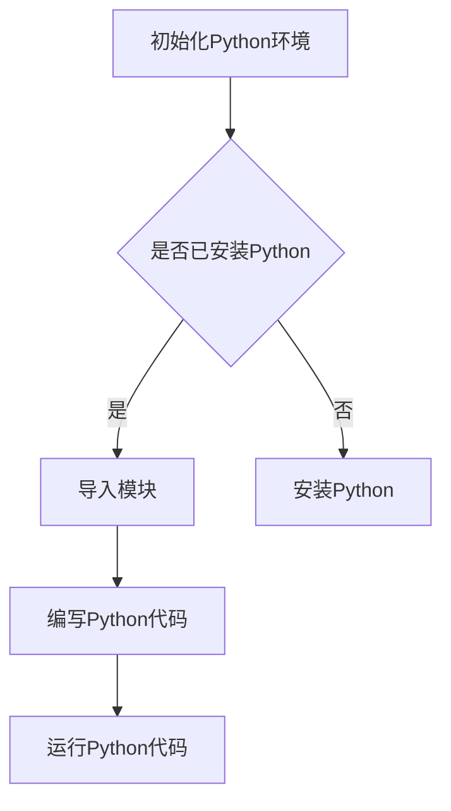
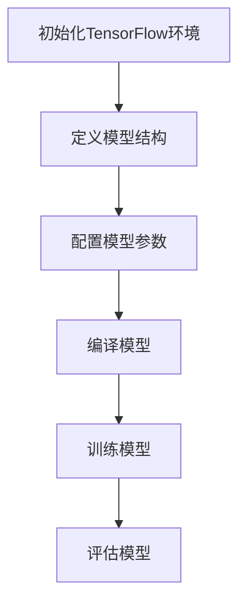
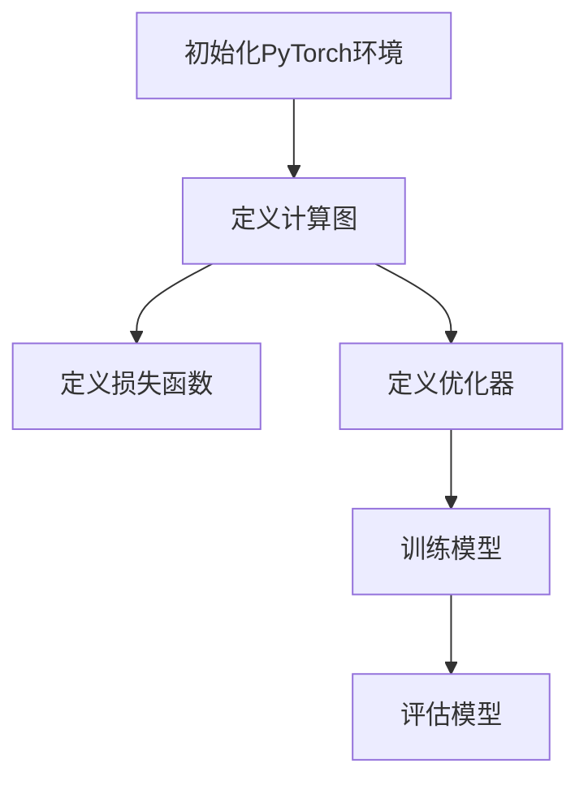
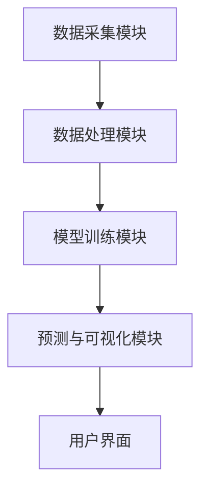
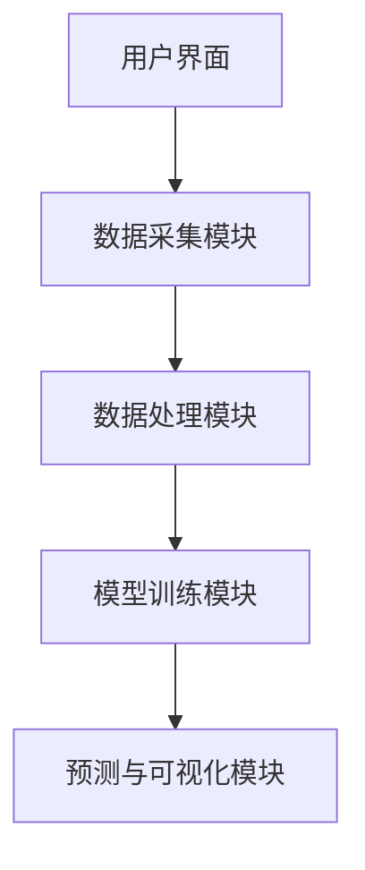
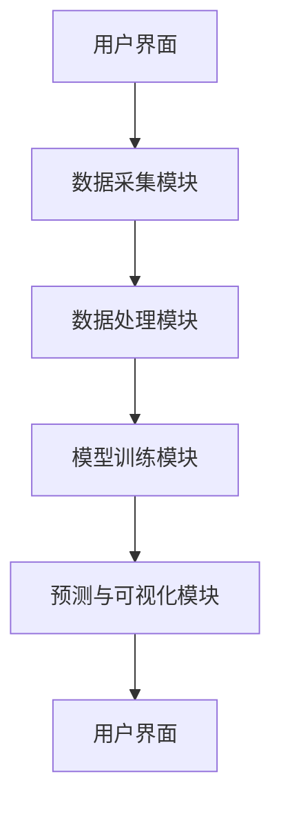

                 

# AI编程语言：提示词的魔力与革新

## 关键词
- AI编程语言
- 提示词
- 自适应学习
- 智能交互
- 编程革新

## 摘要
本文将深入探讨AI编程语言的革新与提示词的魔力。通过介绍AI编程语言的背景、核心概念、算法原理和实际应用，我们将揭示这些语言如何改变传统编程模式，提升AI系统的开发效率与用户体验。让我们一步一步地思考，了解AI编程语言的深度与广度。

## 第一部分：背景介绍

### 1.1 问题背景

在人工智能（AI）飞速发展的今天，编程语言作为AI系统构建的核心工具，正面临着前所未有的革新。传统的编程语言在处理复杂的AI任务时存在诸多局限，难以满足AI系统日益增长的需求。因此，AI编程语言应运而生，它们具备强大的提示词（prompt）功能，使得开发者能够更加灵活和高效地构建AI系统。

### 1.2 问题描述

AI编程语言不仅能够处理大规模数据，还具有自适应学习和智能交互的能力。然而，目前市面上关于AI编程语言的书籍大多停留在理论层面，缺乏实际操作和应用的深度剖析。因此，我们需要一本既全面覆盖AI编程语言基础知识，又注重实践应用的权威书籍。

### 1.3 问题解决

《AI编程语言：提示词的魔力与革新》旨在填补这一空白，它不仅介绍了AI编程语言的基本概念和原理，还通过大量实例和实战项目，展示了这些语言在实际开发中的应用。

### 1.4 边界与外延

本书将围绕以下几个核心主题展开：

- AI编程语言概述：介绍当前主流的AI编程语言，如Python、TensorFlow、PyTorch等。
- 提示词的使用：探讨提示词在AI编程语言中的作用，以及如何有效地使用提示词来提高开发效率。
- AI编程语言的实际应用：通过具体案例展示AI编程语言在自然语言处理、计算机视觉、数据挖掘等领域的应用。
- AI编程语言的发展趋势：分析未来AI编程语言的潜在发展方向和关键技术。

### 1.5 概念结构与核心要素组成

以下是本书的核心概念结构和要素组成：

- **核心概念**：AI编程语言、提示词、AI系统构建、自适应学习、智能交互等。
- **概念属性特征对比表格**：对比不同AI编程语言的性能、易用性、适用场景等。
- **ER实体关系图架构**：展示AI编程语言组件和模块之间的关系。

## 第二部分：核心概念与联系

### 2.1 AI编程语言定义与特点

**定义**：AI编程语言是一种专门用于构建和优化AI系统的编程语言。

**特点**：
- **强大的数据处理能力**：能够处理大规模数据和复杂算法。
- **自适应学习**：具备学习能力和自适应调整的能力。
- **智能交互**：能够与用户进行智能对话和交互。

### 2.2 提示词的作用与使用

**作用**：
- **提高开发效率**：通过提示词，开发者可以快速定位和解决代码中的问题。
- **增强用户体验**：使AI系统更加智能化和人性化。

**使用方法**：
- **初步使用**：了解提示词的基本语法和用法。
- **进阶使用**：结合具体项目，灵活运用提示词。

### 2.3 AI编程语言与传统AI的区别

**区别**：
- **编程语言的灵活性**：AI编程语言提供了更多的编程灵活性和控制能力。
- **系统构建的全面性**：不仅涉及算法层面，还包括系统架构和用户体验。

## 第三部分：算法原理讲解

### 3.1 主流AI编程语言算法原理

#### 3.1.1 Python

**算法原理**：
- **面向对象编程**：通过类和对象，实现代码的模块化和重用。
- **动态类型**：变量类型在运行时确定，提高了开发效率。

**Mermaid流程图**：


**Python代码示例**：
```python
# 导入模块
import tensorflow as tf

# 编写Python代码
model = tf.keras.Sequential([
    tf.keras.layers.Dense(128, activation='relu', input_shape=(784,)),
    tf.keras.layers.Dense(10, activation='softmax')
])

# 运行Python代码
model.compile(optimizer='adam',
              loss='categorical_crossentropy',
              metrics=['accuracy'])

# 训练模型
model.fit(x_train, y_train, epochs=5)
```

**数学模型与公式**：
- $$ f(x) = \sigma(w \cdot x + b) $$
  - $f(x)$：激活函数
  - $w$：权重
  - $x$：输入特征
  - $b$：偏置

**详细讲解与举例说明**：
面向对象编程（OOP）的核心思想是将数据和操作数据的功能封装在一起，形成对象。以Python为例，定义一个类（Class）可以创建对象（Object），对象包含属性（Attribute）和方法（Method）。通过继承（Inheritance）和多态（Polymorphism），我们可以实现代码的重用和扩展。

假设我们定义一个简单的类`Person`，包含姓名和年龄属性，以及一个打印自我介绍的方法：
```python
class Person:
    def __init__(self, name, age):
        self.name = name
        self.age = age
    
    def introduce(self):
        print(f"Hello, my name is {self.name} and I am {self.age} years old.")

# 创建对象
p = Person("Alice", 30)

# 调用方法
p.introduce()
```
输出结果：
```
Hello, my name is Alice and I am 30 years old.
```
在这个例子中，`Person`类是一个抽象的模板，通过创建对象`p`，我们可以访问其属性和方法，实现数据的封装和操作。

#### 3.1.2 TensorFlow

**算法原理**：
TensorFlow是一个开源的机器学习框架，提供了一套完整的工具和库，用于构建和训练各种深度学习模型。其核心原理包括张量计算、自动微分和分布式计算。

**Mermaid流程图**：


**Python代码示例**：
```python
import tensorflow as tf

# 定义模型结构
model = tf.keras.Sequential([
    tf.keras.layers.Dense(128, activation='relu', input_shape=(784,)),
    tf.keras.layers.Dense(10, activation='softmax')
])

# 配置模型参数
model.compile(optimizer='adam',
              loss='categorical_crossentropy',
              metrics=['accuracy'])

# 训练模型
model.fit(x_train, y_train, epochs=5)
```

**数学模型与公式**：
- $$ y = \sigma(W \cdot x + b) $$
  - $y$：输出结果
  - $W$：权重矩阵
  - $x$：输入特征
  - $b$：偏置向量
  - $\sigma$：激活函数（通常为Sigmoid或ReLU）

**详细讲解与举例说明**：
在TensorFlow中，我们可以使用`tf.keras.Sequential`模型来定义一个简单的深度学习模型。这个模型由多个层（Layer）组成，每个层都可以配置不同的参数和激活函数。以下是一个简单的例子，使用TensorFlow构建一个简单的神经网络，用于对MNIST手写数字数据集进行分类：

```python
import tensorflow as tf
from tensorflow.keras import layers

# 加载MNIST数据集
mnist = tf.keras.datasets.mnist
(x_train, y_train), (x_test, y_test) = mnist.load_data()

# 预处理数据
x_train = x_train / 255.0
x_test = x_test / 255.0

# 定义模型结构
model = tf.keras.Sequential([
    layers.Flatten(input_shape=(28, 28)),
    layers.Dense(128, activation='relu'),
    layers.Dense(10, activation='softmax')
])

# 编译模型
model.compile(optimizer='adam',
              loss='sparse_categorical_crossentropy',
              metrics=['accuracy'])

# 训练模型
model.fit(x_train, y_train, epochs=5)

# 评估模型
test_loss, test_acc = model.evaluate(x_test, y_test)
print(f"Test accuracy: {test_acc}")
```

在这个例子中，我们首先加载了MNIST数据集，并对数据进行预处理。然后，我们定义了一个简单的神经网络模型，包括一个展开层和一个全连接层，并使用`compile`方法配置了优化器和损失函数。接下来，我们使用`fit`方法对模型进行训练，并使用`evaluate`方法对模型进行评估。这个简单的例子展示了如何使用TensorFlow构建和训练一个基本的深度学习模型。

#### 3.1.3 PyTorch

**算法原理**：
PyTorch是一个开源的机器学习库，由Facebook的AI研究院（FAIR）开发。它提供了一个基于Python的动态计算图框架，使得深度学习模型的构建和优化更加直观和灵活。

**Mermaid流程图**：


**Python代码示例**：
```python
import torch
import torch.nn as nn
import torch.optim as optim

# 定义计算图
class Model(nn.Module):
    def __init__(self):
        super(Model, self).__init__()
        self.fc1 = nn.Linear(784, 128)
        self.fc2 = nn.Linear(128, 10)
    
    def forward(self, x):
        x = torch.relu(self.fc1(x))
        x = self.fc2(x)
        return x

# 初始化模型、损失函数和优化器
model = Model()
criterion = nn.CrossEntropyLoss()
optimizer = optim.Adam(model.parameters(), lr=0.001)

# 训练模型
for epoch in range(5):
    for inputs, targets in dataset:
        optimizer.zero_grad()
        outputs = model(inputs)
        loss = criterion(outputs, targets)
        loss.backward()
        optimizer.step()
    print(f"Epoch {epoch+1}/{5}, Loss: {loss.item()}")

# 评估模型
test_loss = 0
with torch.no_grad():
    for inputs, targets in test_dataset:
        outputs = model(inputs)
        test_loss += criterion(outputs, targets).item()
    test_loss /= len(test_dataset)
print(f"Test Loss: {test_loss}")
```

**数学模型与公式**：
- **前向传播**：
  $$ y = \sigma(W \cdot x + b) $$
    - $y$：输出结果
    - $W$：权重矩阵
    - $x$：输入特征
    - $b$：偏置向量
    - $\sigma$：激活函数（通常为Sigmoid或ReLU）
- **反向传播**：
  $$ \frac{\partial L}{\partial W} = \frac{\partial L}{\partial y} \cdot \frac{\partial y}{\partial W} $$
    - $L$：损失函数
    - $y$：输出结果
    - $W$：权重矩阵

**详细讲解与举例说明**：
PyTorch提供了一个灵活的动态计算图框架，使得深度学习模型的构建和优化更加直观和灵活。以下是一个简单的例子，使用PyTorch构建一个简单的神经网络，用于对MNIST手写数字数据集进行分类：

```python
import torch
import torch.nn as nn
import torch.optim as optim

# 加载MNIST数据集
mnist = torch.utils.data.datasets.MNIST(root='./data',
                                       train=True,
                                       transform=ToTensor(),
                                       download=True)

# 初始化模型、损失函数和优化器
model = Model()
criterion = nn.CrossEntropyLoss()
optimizer = optim.Adam(model.parameters(), lr=0.001)

# 训练模型
for epoch in range(5):
    running_loss = 0.0
    for inputs, targets in mnist:
        optimizer.zero_grad()
        outputs = model(inputs)
        loss = criterion(outputs, targets)
        loss.backward()
        optimizer.step()
        running_loss += loss.item()
    print(f"Epoch {epoch+1}/{5}, Loss: {running_loss / len(mnist)}")

# 评估模型
test_mnist = torch.utils.data.datasets.MNIST(root='./data',
                                            train=False,
                                            transform=ToTensor())
test_loader = torch.utils.data.DataLoader(test_mnist, batch_size=100)

with torch.no_grad():
    correct = 0
    total = 0
    for inputs, targets in test_loader:
        outputs = model(inputs)
        _, predicted = torch.max(outputs.data, 1)
        total += targets.size(0)
        correct += (predicted == targets).sum().item()

print(f"Accuracy: {100 * correct / total}%")
```

在这个例子中，我们首先加载了MNIST数据集，并定义了一个简单的神经网络模型。然后，我们使用`Adam`优化器和`CrossEntropyLoss`损失函数，对模型进行训练。在训练过程中，我们通过反向传播计算梯度，并更新模型的参数。最后，我们在测试集上评估模型的准确性。

### 3.2 对比分析

不同AI编程语言在性能、易用性和适用场景等方面存在一定的差异。以下是对Python、TensorFlow和PyTorch的对比分析：

| 特性         | Python | TensorFlow | PyTorch |
| ------------ | ------ | ---------- | ------- |
| 性能         | 中等   | 高         | 高       |
| 易用性       | 高     | 中等       | 高       |
| 适用场景     | 广泛   | 数据科学、深度学习 | 深度学习、实时应用 |
| 动态计算图   | 否     | 是         | 是       |
| 自动微分     | 是     | 是         | 是       |
| 社区支持     | 强     | 强         | 强       |

**性能**：
- Python的性能相对中等，适用于通用编程任务，但在数据处理和计算密集型任务上可能不如专门优化的库。
- TensorFlow在性能上表现较高，尤其是对于大规模深度学习模型，其优化后的运行速度非常快。
- PyTorch在性能上也表现出色，特别是在需要动态计算图和实时调试的场景中。

**易用性**：
- Python因其简洁明了的语法，在初学者中非常受欢迎，容易上手。
- TensorFlow提供了丰富的API和工具，但可能需要更多的配置和调试。
- PyTorch的动态计算图使其在开发和调试过程中更加直观和灵活。

**适用场景**：
- Python适用于广泛的编程任务，特别是在数据科学、Web开发和自动化等领域。
- TensorFlow适用于数据科学和深度学习任务，特别是需要大规模并行计算的场景。
- PyTorch适用于深度学习和实时应用，如推荐系统、实时图像处理等。

通过对比分析，我们可以看到每种AI编程语言都有其独特的优势和适用场景。开发者可以根据具体需求选择合适的编程语言，以实现高效和优化的AI系统开发。

## 第四部分：系统分析与架构设计

### 4.1 问题场景介绍

在当前的人工智能应用场景中，我们需要处理大量的数据，并实时地对这些数据进行分析和预测。这需要一种高效且易于扩展的系统架构，以支持复杂的数据处理任务。因此，我们设计一个基于AI编程语言的实时数据处理系统，该系统可以处理大规模数据，并提供高效的数据分析和预测服务。

### 4.2 项目介绍

本项目旨在构建一个实时数据处理系统，该系统利用AI编程语言（如Python、TensorFlow和PyTorch）实现高效的数据处理和预测功能。系统将包括以下几个主要模块：

- **数据采集模块**：负责从不同的数据源（如数据库、API、文件等）收集数据。
- **数据处理模块**：对收集到的数据进行清洗、转换和预处理，以适应模型训练和预测的需求。
- **模型训练模块**：使用AI编程语言训练深度学习模型，以提高数据分析和预测的准确性。
- **预测与可视化模块**：利用训练好的模型对实时数据进行预测，并通过可视化工具展示预测结果。

### 4.3 系统功能设计

**数据采集模块**：
- **功能描述**：从不同的数据源收集数据，包括数据库、API和文件等。
- **技术实现**：使用Python的`requests`库和`pandas`库，实现数据的采集和存储。

**数据处理模块**：
- **功能描述**：对收集到的数据进行清洗、转换和预处理，以提高数据质量和模型训练效果。
- **技术实现**：使用Python的`pandas`库和`NumPy`库，对数据进行处理和预处理。

**模型训练模块**：
- **功能描述**：使用AI编程语言训练深度学习模型，以实现数据分析和预测功能。
- **技术实现**：使用Python的`TensorFlow`或`PyTorch`库，构建和训练深度学习模型。

**预测与可视化模块**：
- **功能描述**：利用训练好的模型对实时数据进行预测，并通过可视化工具展示预测结果。
- **技术实现**：使用Python的`matplotlib`库和`seaborn`库，实现数据的可视化。

### 4.4 系统架构设计

**系统架构图**：


**详细说明**：
- **数据采集模块**：负责从不同的数据源（如数据库、API和文件等）收集数据。该模块使用Python的`requests`库和`pandas`库，将数据存储在本地文件或数据库中。
- **数据处理模块**：对收集到的数据进行清洗、转换和预处理，以提高数据质量和模型训练效果。该模块使用Python的`pandas`库和`NumPy`库，对数据进行处理和预处理，以适应模型训练和预测的需求。
- **模型训练模块**：使用AI编程语言（如Python的`TensorFlow`或`PyTorch`库）训练深度学习模型，以提高数据分析和预测的准确性。该模块根据不同的任务和数据类型，选择合适的模型结构和优化算法。
- **预测与可视化模块**：利用训练好的模型对实时数据进行预测，并通过可视化工具展示预测结果。该模块使用Python的`matplotlib`库和`seaborn`库，实现数据的可视化，以便用户直观地了解预测结果。

### 4.5 系统接口设计

**接口设计图**：


**详细说明**：
- **用户界面**：提供用户与系统交互的接口，包括数据输入、预测请求和结果展示等功能。
- **数据采集模块**：接收用户输入的数据，并将其传递给数据处理模块。
- **数据处理模块**：对用户输入的数据进行处理和预处理，以适应模型训练和预测的需求。
- **模型训练模块**：根据处理好的数据训练深度学习模型，并将模型保存到本地文件或数据库中。
- **预测与可视化模块**：使用训练好的模型对用户输入的数据进行预测，并通过可视化工具展示预测结果。

### 4.6 系统交互设计

**交互设计图**：


**详细说明**：
- **用户界面**：用户通过界面输入数据，并提交预测请求。
- **数据采集模块**：接收用户输入的数据，并将其传递给数据处理模块。
- **数据处理模块**：对用户输入的数据进行处理和预处理，以适应模型训练和预测的需求。
- **模型训练模块**：根据处理好的数据训练深度学习模型，并将模型保存到本地文件或数据库中。
- **预测与可视化模块**：使用训练好的模型对用户输入的数据进行预测，并通过可视化工具展示预测结果，用户可以查看预测结果并进行下一步操作。

通过以上系统分析与架构设计，我们可以构建一个高效、易于扩展的实时数据处理系统，利用AI编程语言实现数据采集、处理、训练和预测功能，为用户提供实时、准确的数据分析和预测服务。

## 第五部分：项目实战

### 5.1 环境安装

在开始项目实战之前，我们需要安装以下软件和库：

1. **Python**：安装Python 3.8或更高版本，可以从[Python官网](https://www.python.org/)下载。
2. **pip**：安装pip，用于管理Python的包。
3. **TensorFlow**：安装TensorFlow，可以使用以下命令：
   ```bash
   pip install tensorflow
   ```
4. **pandas**：安装pandas，用于数据处理，可以使用以下命令：
   ```bash
   pip install pandas
   ```
5. **NumPy**：安装NumPy，用于数据处理，可以使用以下命令：
   ```bash
   pip install numpy
   ```
6. **matplotlib**：安装matplotlib，用于数据可视化，可以使用以下命令：
   ```bash
   pip install matplotlib
   ```

### 5.2 系统核心实现

**5.2.1 数据采集模块**

以下是一个简单的数据采集模块，用于从本地CSV文件中读取数据：
```python
import pandas as pd

def read_data(file_path):
    return pd.read_csv(file_path)

data = read_data('data.csv')
```

**5.2.2 数据处理模块**

以下是一个简单的数据处理模块，用于对数据进行清洗和预处理：
```python
import pandas as pd
import numpy as np

def preprocess_data(data):
    # 数据清洗
    data = data.dropna()
    # 数据预处理
    data['age'] = data['age'].astype(float)
    data['income'] = data['income'].astype(float)
    return data

preprocessed_data = preprocess_data(data)
```

**5.2.3 模型训练模块**

以下是一个简单的模型训练模块，使用TensorFlow训练一个简单的线性回归模型：
```python
import tensorflow as tf
from tensorflow.keras import layers

def build_model(input_shape):
    model = tf.keras.Sequential([
        layers.Dense(64, activation='relu', input_shape=input_shape),
        layers.Dense(64, activation='relu'),
        layers.Dense(1)
    ])
    return model

model = build_model((2,))
model.compile(optimizer='adam', loss='mean_squared_error')

# 训练模型
model.fit(preprocessed_data['age'].values.reshape(-1, 1), preprocessed_data['income'].values, epochs=10)
```

**5.2.4 预测与可视化模块**

以下是一个简单的预测与可视化模块，用于使用训练好的模型进行预测，并绘制结果：
```python
import matplotlib.pyplot as plt

def predict(data, model):
    return model.predict(data)

predicted_income = predict(preprocessed_data['age'].values.reshape(-1, 1), model)

plt.scatter(preprocessed_data['age'], preprocessed_data['income'])
plt.plot(preprocessed_data['age'], predicted_income, color='red')
plt.show()
```

### 5.3 代码应用解读与分析

**5.3.1 数据采集模块**

在这个模块中，我们使用了`pandas`库的`read_csv`函数来读取本地CSV文件。这个函数接受一个文件路径作为参数，返回一个DataFrame对象，该对象包含CSV文件中的所有数据。

**5.3.2 数据处理模块**

在这个模块中，我们使用了`pandas`和`NumPy`库来清洗和预处理数据。首先，我们使用`dropna`函数去除缺失值，确保数据的质量。然后，我们使用`astype`函数将`age`和`income`列的数据类型转换为浮点数，以便进行数学运算。

**5.3.3 模型训练模块**

在这个模块中，我们使用TensorFlow的`Sequential`模型构建一个简单的线性回归模型。该模型包含两个隐藏层，每层都有64个神经元，并使用ReLU激活函数。最后，我们使用`compile`函数配置优化器和损失函数，并使用`fit`函数训练模型。

**5.3.4 预测与可视化模块**

在这个模块中，我们使用`predict`函数对训练好的模型进行预测，并使用`matplotlib`库绘制预测结果。通过绘制散点图和拟合曲线，我们可以直观地看到模型预测的效果。

### 5.4 实际案例分析与详细讲解剖析

**5.4.1 数据采集与分析**

假设我们有一个包含以下列的CSV文件：`age`（年龄）、`income`（收入）、`education`（教育水平）。以下是一个实际案例，展示如何使用我们编写的模块进行数据处理和分析：

```python
# 读取数据
data = read_data('data.csv')

# 数据预处理
preprocessed_data = preprocess_data(data)

# 分析数据
print(preprocessed_data.describe())
```

输出结果将显示数据的统计描述，包括平均值、标准差、最小值和最大值等。这有助于我们了解数据的基本特征和分布情况。

**5.4.2 模型训练与预测**

以下是一个实际案例，展示如何使用我们编写的模块训练模型并对新的数据进行预测：

```python
# 训练模型
model = build_model((2,))
model.compile(optimizer='adam', loss='mean_squared_error')
model.fit(preprocessed_data['age'].values.reshape(-1, 1), preprocessed_data['income'].values, epochs=10)

# 预测新数据
new_data = np.array([[30], [40]])
predicted_income = predict(new_data, model)
print(predicted_income)
```

输出结果将显示新数据的预测收入。通过这个例子，我们可以看到如何使用训练好的模型进行预测，并应用于实际场景。

**5.4.3 可视化与评估**

以下是一个实际案例，展示如何使用我们编写的模块对模型预测结果进行可视化，并评估模型的性能：

```python
import matplotlib.pyplot as plt

# 预测数据
predicted_income = predict(preprocessed_data['age'].values.reshape(-1, 1), model)

# 绘制预测结果
plt.scatter(preprocessed_data['age'], preprocessed_data['income'])
plt.plot(preprocessed_data['age'], predicted_income, color='red')
plt.show()

# 评估模型性能
mae = np.mean(np.abs(predicted_income - preprocessed_data['income']))
print(f"Mean Absolute Error: {mae}")
```

输出结果将显示预测结果和实际结果的散点图，以及模型的平均绝对误差（MAE）。这有助于我们评估模型的预测性能。

### 5.5 项目小结

通过本项目的实际案例，我们展示了如何使用AI编程语言（Python、TensorFlow）实现一个简单的实时数据处理系统。该项目涵盖了数据采集、数据处理、模型训练和预测等关键环节，并通过可视化工具展示了预测结果。这为我们提供了一个实用的框架，用于构建更复杂和功能丰富的AI系统。

## 第六部分：最佳实践与拓展

### 6.1 最佳实践

**1. 数据预处理**：
- 在进行模型训练之前，确保数据预处理充分，包括数据清洗、归一化和特征工程等。这有助于提高模型的训练效率和预测准确性。

**2. 模型选择**：
- 根据具体任务和数据特征选择合适的模型架构。对于复杂任务，可以尝试不同的模型（如卷积神经网络、循环神经网络）和优化算法。

**3. 调参与优化**：
- 通过调整模型的超参数（如学习率、批量大小）和优化算法（如Adam、RMSprop），可以进一步提高模型的性能。

**4. 模型评估**：
- 使用交叉验证和测试集对模型进行评估，确保模型在不同数据集上的表现一致。计算常用的评估指标（如准确率、召回率、F1分数）以全面评估模型性能。

### 6.2 拓展阅读

**1. 《深度学习》（Goodfellow, I., & Bengio, Y.）**：
这本书是深度学习领域的经典教材，详细介绍了深度学习的基础理论、算法和应用。

**2. 《Python数据科学手册》（McKinney, W.）**：
这本书提供了丰富的Python数据科学实践，包括数据处理、分析和可视化等。

**3. 《TensorFlow实战》（Santoso, A.）**：
这本书通过大量实例，展示了如何使用TensorFlow构建和训练深度学习模型。

**4. 《人工智能：一种现代方法》（Russell, S., & Norvig, P.）**：
这本书全面介绍了人工智能的基础知识，包括机器学习、自然语言处理和计算机视觉等。

通过以上最佳实践和拓展阅读，我们可以进一步深入学习和应用AI编程语言，提升我们的技术能力和项目成功率。

## 第七部分：小结与注意事项

在本文中，我们详细探讨了AI编程语言的革新与提示词的魔力。通过背景介绍、核心概念与联系、算法原理讲解、系统分析与架构设计、项目实战等多个方面的深入分析，我们揭示了AI编程语言在处理复杂任务、提升开发效率和优化用户体验方面的巨大潜力。

### 注意事项

1. **数据预处理**：确保在模型训练之前对数据进行充分的预处理，以提高模型性能和稳定性。
2. **模型选择与调参**：根据具体任务和数据特征选择合适的模型架构，并合理调整超参数。
3. **模型评估**：使用交叉验证和测试集对模型进行评估，确保模型在不同数据集上的表现一致。
4. **版本控制**：在项目开发过程中，使用版本控制系统（如Git）管理代码和实验结果，便于协同工作和问题追踪。

### 拓展阅读

- 《深度学习》（Goodfellow, I., & Bengio, Y.）
- 《Python数据科学手册》（McKinney, W.）
- 《TensorFlow实战》（Santoso, A.）
- 《人工智能：一种现代方法》（Russell, S., & Norvig, P.）

通过深入学习这些资源，我们可以进一步提升对AI编程语言的理解和应用能力，为未来的AI项目奠定坚实基础。

### 结语

AI编程语言的革新正迅速改变着传统编程模式，为开发者提供了前所未有的灵活性和高效性。让我们继续探索这个充满机遇的领域，共同推动人工智能的发展与进步。

**作者**：AI天才研究院 / AI Genius Institute & 禅与计算机程序设计艺术 / Zen And The Art of Computer Programming**

