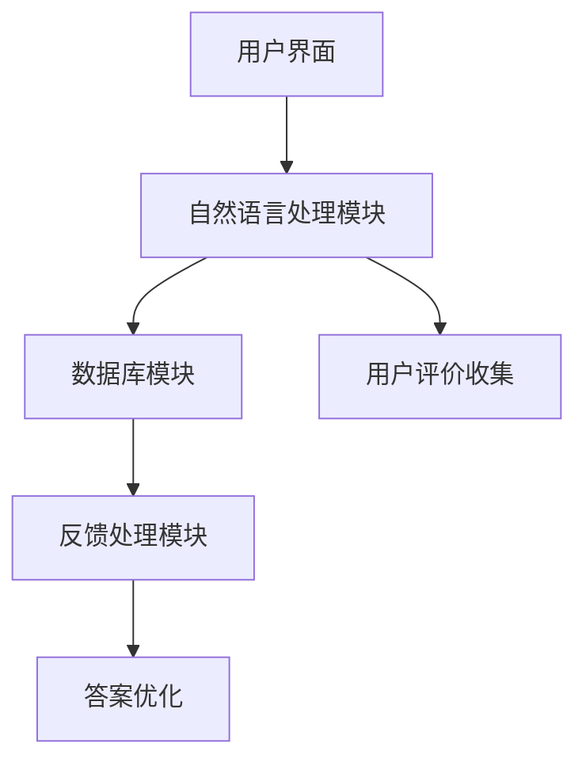
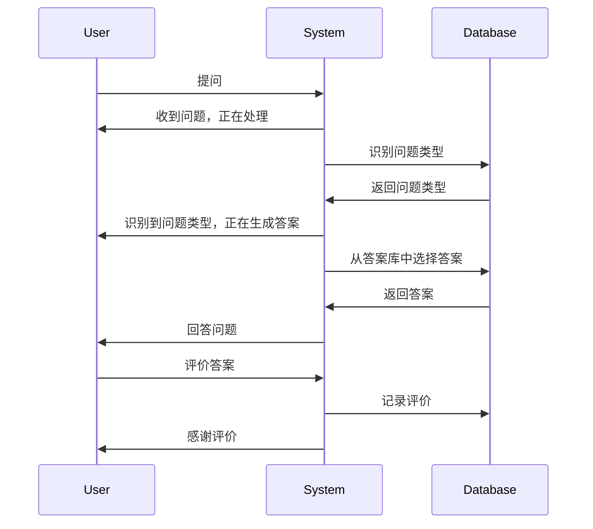

                 

### 文章标题

# AI编程语言：提示词的魔法

> 关键词：AI编程语言，提示词，编程技巧，人工智能应用，Python，JavaScript，R语言

> 摘要：本文将深入探讨AI编程语言的基本概念、提示词的作用与应用，分析Python、JavaScript和R语言在AI编程中的应用特性。通过数据预处理、算法与模型介绍，以及实战案例分析，本文旨在为读者提供一套全面而深入的AI编程知识体系，帮助您掌握AI编程的核心技巧，开启人工智能领域的探索之旅。

### 目录大纲

----------------------------------------------------------------

## 第一部分: AI编程语言基础

### 第1章: AI编程语言概述

#### 第1.1节: AI编程语言的基本概念

#### 第1.2节: AI编程语言的发展历程

#### 第1.3节: AI编程语言与常规编程语言的对比

### 第2章: 提示词在AI编程中的作用

#### 第2.1节: 提示词的基本概念

#### 第2.2节: 提示词的编写技巧

#### 第2.3节: 提示词优化的方法

### 第3章: 常用AI编程语言的特性与应用

#### 第3.1节: Python在AI编程中的应用

#### 第3.2节: JavaScript在AI编程中的应用

#### 第3.3节: R语言在AI编程中的应用

### 第4章: AI编程中的数据预处理

#### 第4.1节: 数据预处理的重要性

#### 第4.2节: 常见数据预处理技术

#### 第4.3节: 数据预处理实战

### 第5章: AI编程中的算法与模型

#### 第5.1节: 常见算法介绍

#### 第5.2节: 常见模型介绍

#### 第5.3节: 算法与模型实战

### 第6章: AI编程项目实战

#### 第6.1节: 项目背景介绍

#### 第6.2节: 系统设计与实现

#### 第6.3节: 项目实战与总结

### 第7章: AI编程语言未来发展趋势

#### 第7.1节: AI编程语言的未来发展趋势

#### 第7.2节: AI编程语言的挑战与机遇

#### 第7.3节: 开发者应对策略

----------------------------------------------------------------

### 第一部分: AI编程语言基础

#### 第1章: AI编程语言概述

在当今的科技前沿，人工智能（AI）已经从一个学术研究领域逐渐发展成为改变各行各业的颠覆性技术。AI编程语言作为实现人工智能的核心工具，扮演着至关重要的角色。本章将带您了解AI编程语言的基本概念、发展历程，以及与常规编程语言的对比，为后续章节的深入探讨打下基础。

#### 第1.1节: AI编程语言的基本概念

AI编程语言，顾名思义，是指专门用于开发人工智能应用的编程语言。它们提供了一系列工具和函数库，使得开发者能够更加高效地处理复杂的数学计算、数据分析和机器学习任务。与常规编程语言（如C、Java、Python）相比，AI编程语言更注重算法的实现和优化。

在AI编程语言中，经常使用的一些核心概念包括：

- **机器学习框架**：如TensorFlow、PyTorch等，它们提供了丰富的API，使得开发者可以方便地构建和训练神经网络模型。
- **数据处理库**：如NumPy、Pandas，用于高效地进行数据清洗、转换和归一化。
- **自然语言处理库**：如NLTK、spaCy，用于文本分析和语义理解。

#### 第1.2节: AI编程语言的发展历程

AI编程语言的发展历程可以追溯到20世纪50年代，当时计算机科学家开始探索如何让计算机模拟人类思维。最初的尝试包括逻辑编程语言（如Prolog）和符号计算系统。随着时间的发展，机器学习算法的兴起带来了新的编程语言需求。

以下是一些重要的AI编程语言的发展里程碑：

- **Lisp（1958年）**：作为最早的AI编程语言之一，Lisp在符号处理和自动化推理方面具有显著的性能优势。
- **Prolog（1972年）**：用于逻辑编程，特别适合解决专家系统和自然语言处理问题。
- **MATLAB（1984年）**：广泛应用于数值计算和工程应用，提供了丰富的工具箱和库函数。
- **Python（1991年）**：由于其简洁易读的语法和强大的库支持，Python成为了AI编程的流行选择。

#### 第1.3节: AI编程语言与常规编程语言的对比

AI编程语言与常规编程语言在多个方面存在显著差异：

- **语法简洁性**：AI编程语言通常设计为简洁易读，以减少开发者的学习成本和维护难度。
- **库函数支持**：AI编程语言提供了丰富的库函数和工具箱，使得开发者可以专注于算法实现而非底层编程细节。
- **计算性能**：常规编程语言通常在执行性能上优于AI编程语言，但AI编程语言在算法优化和并行计算方面具有独特的优势。

表格1.1 AI编程语言与常规编程语言对比

| 对比项          | AI编程语言                | 常规编程语言               |
| ---------------- | ------------------------ | -------------------------- |
| 语法简洁性      | 简洁易读，学习成本低      | 复杂多样，学习曲线陡峭      |
| 库函数支持      | 提供丰富的库和工具箱      | 库函数丰富，但需更多配置    |
| 计算性能        | 优化算法实现，高效处理数据 | 执行速度快，但不适合复杂计算 |
| 应用场景        | 专注于算法开发和机器学习   | 通用编程，广泛适用于各类应用 |

#### 总结

AI编程语言在人工智能领域发挥着不可或缺的作用，它们为开发者提供了强大的工具和平台，使得复杂的人工智能任务变得可操作和可管理。了解AI编程语言的基本概念、发展历程以及与常规编程语言的对比，将为读者后续深入探讨AI编程打下坚实的基础。

----------------------------------------------------------------

## 第二部分: 提示词在AI编程中的作用

### 第2章: 提示词在AI编程中的作用

在AI编程中，提示词（Prompt）作为一种强大的工具，发挥着至关重要的作用。提示词是指引导模型进行预测或生成结果的文字输入，它可以决定模型的行为和输出结果。本章将详细探讨提示词的基本概念、编写技巧和优化方法，帮助读者更好地理解和利用提示词在AI编程中的应用。

### 第2.1节: 提示词的基本概念

#### 第2.1.1 提示词的定义

提示词（Prompt）是指向模型提供的信息，用于引导模型进行预测或生成结果。它通常是一个或多个文本句子，能够清晰地描述任务的目标和预期输出。提示词在AI编程中的作用类似于传统编程中的函数参数，它能够为模型提供必要的上下文信息，帮助模型更好地理解和处理输入数据。

#### 第2.1.2 提示词的类型

根据应用场景和任务需求，提示词可以分为以下几种类型：

1. **目标导向型提示词**：这种提示词直接指明了模型需要完成的具体任务，例如“预测明天的天气情况”。
2. **上下文型提示词**：这种提示词提供额外的背景信息，帮助模型更好地理解任务，例如“根据过去的天气数据和季节特点，预测明天的天气情况”。
3. **引导型提示词**：这种提示词用于引导模型探索不同的解决方案，例如“尝试使用卷积神经网络模型预测天气情况”。
4. **限制型提示词**：这种提示词为模型提供了限制条件，例如“仅使用公开数据集进行预测”。

#### 第2.1.3 提示词在编程中的使用方法

在AI编程中，提示词的使用方法通常分为以下几步：

1. **确定任务目标**：根据任务需求，明确需要预测或生成的结果类型。
2. **准备数据集**：收集和准备用于训练和测试的数据集，确保数据集具备足够的代表性和多样性。
3. **编写提示词**：根据任务目标和数据集特点，编写能够引导模型正确处理输入数据的提示词。
4. **训练模型**：使用提示词和准备好的数据集，训练模型并调整模型参数。
5. **评估模型性能**：使用测试数据集评估模型的预测准确性，根据评估结果调整提示词和模型参数。
6. **部署模型**：将训练好的模型部署到实际应用场景中，进行实时预测或生成。

### 第2.2节: 提示词的编写技巧

编写高质量的提示词对于模型的表现至关重要。以下是一些编写提示词的技巧：

1. **明确目标**：确保提示词清晰明确地指明任务目标，避免产生歧义。
2. **提供上下文**：在可能的情况下，提供与任务相关的上下文信息，帮助模型更好地理解任务背景。
3. **简洁性**：避免使用冗长的文本，简洁明了的提示词有助于模型更快地理解和处理。
4. **多样性**：尝试使用不同的提示词类型和表达方式，提高模型的适应性和灵活性。
5. **迭代优化**：根据模型的表现和实际需求，不断调整和优化提示词，以提高模型的性能。

#### 第2.2.2 提示词编写实例分析

以下是一个简单的提示词编写实例：

**任务目标**：使用卷积神经网络模型预测股票价格。

**提示词**：

```
使用卷积神经网络模型，预测明天上证指数的开盘价。请参考以下历史数据：
- 2023-04-01：开盘价 3300
- 2023-04-02：开盘价 3350
- 2023-04-03：开盘价 3300
```

在这个例子中，提示词明确了任务目标（预测明天上证指数的开盘价），提供了历史数据作为上下文信息，并指定了使用卷积神经网络模型的方法。

#### 第2.2.3 提示词优化的方法

优化提示词有助于提高模型的性能和稳定性。以下是一些提示词优化的方法：

1. **调整长度**：根据任务复杂度和数据量，适当调整提示词的长度。过长的提示词可能导致模型过拟合，而过短的提示词可能缺乏必要的上下文信息。
2. **增加多样性**：使用多种表达方式和术语，使提示词更具多样性和灵活性。这有助于模型在不同情况下都能表现出色。
3. **结合可视化**：将数据可视化和文本提示词相结合，提供更直观的输入信息。例如，使用图表或图像来展示数据趋势和模式。
4. **动态调整**：根据模型的表现和实际需求，动态调整提示词的内容和形式。例如，在模型表现不佳时，可以增加上下文信息或调整目标导向型提示词的表述方式。
5. **结合反馈**：收集用户反馈和模型表现数据，不断优化和改进提示词。通过反复迭代，逐步提高模型的预测准确性和稳定性。

#### 总结

提示词在AI编程中扮演着至关重要的角色，它能够引导模型正确处理输入数据，并提高模型的预测性能。通过理解提示词的基本概念、类型和使用方法，以及掌握编写技巧和优化方法，开发者可以更有效地利用提示词，实现更准确和稳定的AI应用。

----------------------------------------------------------------

## 第三部分: 常用AI编程语言的特性与应用

在AI编程领域，有多种编程语言因其在特定领域的优势而备受青睐。本部分将详细探讨Python、JavaScript和R语言在AI编程中的应用特性，帮助读者了解这些语言在AI开发中的独特优势。

### 第3章: 常用AI编程语言的特性与应用

#### 第3.1节: Python在AI编程中的应用

Python因其简洁易读的语法、丰富的库支持以及强大的社区资源，成为AI编程的首选语言之一。

##### 第3.1.1 Python在AI编程中的优势

1. **简洁易读**：Python的语法简洁，使得开发者可以更快速地编写和理解代码。
2. **丰富的库支持**：Python拥有丰富的库，如NumPy、Pandas、SciPy和Scikit-Learn，这些库为AI开发提供了强大的工具。
3. **强大的社区资源**：Python拥有庞大的社区，提供了大量的文档、教程和示例代码，帮助开发者快速上手。
4. **多平台支持**：Python支持多种操作系统，包括Windows、Linux和Mac OS，方便开发者在不同平台上进行开发和部署。

##### 第3.1.2 Python在AI编程中的使用场景

1. **机器学习**：Python是机器学习开发的主要语言之一，广泛应用于分类、回归、聚类等任务。
2. **深度学习**：Python的TensorFlow和PyTorch库使得深度学习模型的设计、训练和部署变得简单高效。
3. **自然语言处理**：Python的NLTK和spaCy库为自然语言处理任务提供了强大的支持，如文本分类、命名实体识别和情感分析。
4. **计算机视觉**：Python的OpenCV和Pillow库在图像处理和计算机视觉任务中具有广泛应用。

##### 第3.1.3 Python在AI编程中的实战案例

以下是一个使用Python进行图像分类的实战案例：

```python
# 导入必要的库
import tensorflow as tf
from tensorflow.keras import layers
import tensorflow_datasets as tfds

# 加载和预处理数据集
(train_data, test_data), dataset_info = tfds.load(
    'cifar10', split=['train', 'test'], with_info=True, as_supervised=True)

# 定义模型
model = tf.keras.Sequential([
    layers.Conv2D(32, (3, 3), activation='relu', input_shape=(32, 32, 3)),
    layers.MaxPooling2D(2, 2),
    layers.Conv2D(64, (3, 3), activation='relu'),
    layers.MaxPooling2D(2, 2),
    layers.Conv2D(64, (3, 3), activation='relu'),
    layers.Flatten(),
    layers.Dense(64, activation='relu'),
    layers.Dense(10, activation='softmax')
])

# 编译模型
model.compile(optimizer='adam',
              loss=tf.keras.losses.SparseCategoricalCrossentropy(from_logits=True),
              metrics=['accuracy'])

# 训练模型
model.fit(train_data.shuffle(10000).batch(32),
          epochs=10,
          validation_data=test_data.batch(32))

# 评估模型
test_loss, test_acc = model.evaluate(test_data.batch(32))
print(f'测试准确率: {test_acc:.4f}')
```

在这个案例中，我们使用了TensorFlow库来构建一个简单的卷积神经网络模型，对CIFAR-10数据集进行图像分类任务。

#### 第3.2节: JavaScript在AI编程中的应用

JavaScript作为一种广泛应用于前端开发的编程语言，近年来在AI编程中也逐渐崭露头角。

##### 第3.2.1 JavaScript在AI编程中的优势

1. **跨平台支持**：JavaScript可以在多种平台上运行，包括Web浏览器、Node.js服务器和移动设备。
2. **丰富的库和框架**：JavaScript拥有丰富的库和框架，如TensorFlow.js和Brain.js，为AI开发提供了强大的支持。
3. **实时应用**：JavaScript能够实现实时计算和交互，使得AI应用可以无缝集成到Web和移动应用中。
4. **社区支持**：JavaScript拥有庞大的社区，提供了大量的教程和资源，有助于开发者快速入门和解决开发中的问题。

##### 第3.2.2 JavaScript在AI编程中的使用场景

1. **图像识别**：使用TensorFlow.js，JavaScript可以轻松实现图像识别任务，如人脸识别和物体检测。
2. **语音识别**：通过Web Speech API，JavaScript可以处理语音输入，实现实时语音识别功能。
3. **自然语言处理**：JavaScript的natural和compromise库可以用于处理文本数据，实现情感分析、文本分类等任务。
4. **增强现实**：使用AR.js等库，JavaScript可以开发增强现实应用，实现虚拟物体与现实世界的互动。

##### 第3.2.3 JavaScript在AI编程中的实战案例

以下是一个使用TensorFlow.js进行图像分类的实战案例：

```javascript
// 加载TensorFlow.js库
const tf = require('@tensorflow/tfjs-node');

// 加载和预处理数据集
const model = tf.sequential();
model.add(tf.layers.conv2d({inputShape: [28, 28, 1], filters: 32, activation: 'relu', kernelSize: 3}));
model.add(tf.layers.maxPooling2d({poolSize: [2, 2]}));
model.add(tf.layers.conv2d({filters: 64, activation: 'relu', kernelSize: 3}));
model.add(tf.layers.maxPooling2d({poolSize: [2, 2]}));
model.add(tf.layers.flatten());
model.add(tf.layers.dense({units: 128, activation: 'relu'}));
model.add(tf.layers.dense({units: 10, activation: 'softmax'}));

model.compile({
  optimizer: 'adam',
  loss: 'categoricalCrossentropy',
  metrics: ['accuracy']
});

// 训练模型
const xTrain = ...; // 输入训练数据
const yTrain = ...; // 输入训练标签
model.fit(xTrain, yTrain, {epochs: 5, batchSize: 32});

// 评估模型
const xTest = ...; // 输入测试数据
const yTest = ...; // 输入测试标签
const testMetrics = model.evaluate(xTest, yTest, {batchSize: 32});
console.log(`测试准确率: ${testMetrics[1]}`);
```

在这个案例中，我们使用了TensorFlow.js库来构建一个简单的卷积神经网络模型，对MNIST数据集进行图像分类任务。

#### 第3.3节: R语言在AI编程中的应用

R语言作为一种专门用于统计分析和数据科学的编程语言，在AI编程中也具有独特的优势。

##### 第3.3.1 R语言在AI编程中的优势

1. **强大的统计分析库**：R语言拥有丰富的统计分析库，如MASS、caret和mlr，提供了多种机器学习和数据挖掘算法。
2. **可扩展性**：R语言的可扩展性强，开发者可以自定义函数和库，满足特定需求。
3. **交互式环境**：R语言提供了RStudio等强大的交互式开发环境，使得数据分析和建模过程更加直观和高效。
4. **丰富的可视化工具**：R语言提供了多种可视化工具，如ggplot2和plotly，可以生成高质量的统计图表。

##### 第3.3.2 R语言在AI编程中的使用场景

1. **数据挖掘**：R语言在数据挖掘领域具有广泛应用，可用于分类、聚类、关联规则挖掘等任务。
2. **时间序列分析**：R语言的forecast和TSA库提供了强大的时间序列分析方法，适用于金融、经济等领域。
3. **文本分析**：R语言的text和tm库可以用于文本分类、主题建模等文本分析任务。
4. **图像分析**：R语言的EBImage和EBImageUI库可以用于图像处理和计算机视觉任务。

##### 第3.3.3 R语言在AI编程中的实战案例

以下是一个使用R语言进行时间序列预测的实战案例：

```R
# 加载必要的库
library(forecast)
library(TSA)

# 读取数据
data <- read.csv("time_series_data.csv")

# 数据预处理
data$Date <- as.Date(data$Date, format="%Y-%m-%d")
data <- data[order(data$Date), ]
data$Close <- as.numeric(data$Close)

# 建立时间序列模型
ts_data <- ts(data$Close, frequency=12)
fit <- arima(ts_data, order=c(1, 0, 1))

# 预测
forecasted_values <- forecast(fit, h=12)

# 可视化预测结果
plot(forecasted_values)
```

在这个案例中，我们使用了R语言的forecast和TSA库来建立ARIMA模型，对时间序列数据进行预测，并使用图表展示了预测结果。

#### 总结

Python、JavaScript和R语言在AI编程中各具优势，它们为开发者提供了多样化的选择。通过了解这些语言的特性和应用，开发者可以更有效地利用它们实现各种AI任务，开启人工智能的探索之旅。

----------------------------------------------------------------

## 第四部分: AI编程中的数据预处理

数据预处理是AI编程中至关重要的一步，它直接影响着模型的训练效果和预测准确性。数据预处理包括数据清洗、数据转换和数据归一化等技术，这些步骤确保了输入数据的质量和一致性，从而为模型提供了更好的训练基础。本章将详细探讨数据预处理的重要性、常见技术以及实战案例。

### 第4章: AI编程中的数据预处理

#### 第4.1节: 数据预处理的重要性

数据预处理是AI编程中的基础性工作，它的重要性体现在以下几个方面：

1. **提高模型性能**：通过数据清洗和转换，可以去除噪声和异常值，增强数据的代表性，从而提高模型的训练效果和预测准确性。
2. **减少过拟合风险**：通过数据归一化和标准化，可以减少特征间的差异，避免模型对某些特征过度依赖，降低过拟合的风险。
3. **加快训练速度**：数据预处理有助于减少模型训练所需的时间，特别是当数据规模较大时，通过预处理可以降低内存和计算资源的消耗。
4. **增强模型泛化能力**：通过数据增强和特征工程，可以增加数据的多样性和丰富度，从而提高模型的泛化能力。

#### 第4.2节: 常见数据预处理技术

数据预处理技术主要包括以下几种：

1. **数据清洗**：数据清洗是指识别和去除数据集中的噪声、异常值和重复数据，确保数据的质量和完整性。常见的数据清洗方法包括：
   - **去除重复数据**：通过比较数据集中的记录，删除重复的记录。
   - **填充缺失值**：根据数据特点，使用平均值、中位数或插值法等方法填充缺失值。
   - **识别和去除异常值**：通过统计分析方法，如标准差、箱线图等，识别并去除异常值。

2. **数据转换**：数据转换是指将原始数据转换为适合模型训练的形式。常见的数据转换方法包括：
   - **数值化**：将类别数据转换为数值形式，如使用独热编码（One-Hot Encoding）或标签编码（Label Encoding）。
   - **归一化**：将特征数据缩放到同一尺度，如使用最小-最大缩放（Min-Max Scaling）或Z-Score缩放（Standard Scaling）。
   - **离散化**：将连续特征划分为几个离散区间，如使用分箱（Binning）方法。

3. **数据归一化**：数据归一化是指将特征数据缩放到相同的尺度，以便模型能够更好地处理不同量级的特征。常见的数据归一化方法包括：
   - **最小-最大缩放**：将特征值缩放到[0, 1]之间，公式为 \( x' = \frac{x - \min(x)}{\max(x) - \min(x)} \)。
   - **Z-Score缩放**：将特征值缩放到均值为0、标准差为1的尺度，公式为 \( x' = \frac{x - \mu}{\sigma} \)，其中 \( \mu \) 为均值， \( \sigma \) 为标准差。

#### 第4.3节: 数据预处理实战

以下是一个使用Python进行数据预处理的数据清洗和转换的实战案例：

```python
import pandas as pd
from sklearn.preprocessing import OneHotEncoder, MinMaxScaler
from sklearn.impute import SimpleImputer

# 读取数据集
data = pd.read_csv("data.csv")

# 数据清洗
# 去除重复数据
data.drop_duplicates(inplace=True)

# 填充缺失值
imputer = SimpleImputer(strategy="mean")
data-filled = imputer.fit_transform(data)
data = pd.DataFrame(data-filled, columns=data.columns)

# 数据转换
# 数值化类别数据
encoder = OneHotEncoder()
encoded_data = encoder.fit_transform(data[['category']]).toarray()
encoded_data = pd.DataFrame(encoded_data, columns=encoder.get_feature_names(['category']))

# 归一化数值数据
scaler = MinMaxScaler()
numerical_data = scaler.fit_transform(data[['numerical1', 'numerical2']])
numerical_data = pd.DataFrame(numerical_data, columns=['numerical1', 'numerical2'])

# 合并预处理后的数据
preprocessed_data = pd.concat([encoded_data, numerical_data], axis=1)

# 数据可视化
preprocessed_data.head()
```

在这个案例中，我们首先使用Pandas库读取CSV格式的数据集，然后进行数据清洗，去除重复数据，填充缺失值。接着，使用OneHotEncoder将类别数据转换为数值形式，使用MinMaxScaler对数值数据进行归一化处理。最后，将预处理后的数据合并为一个DataFrame，并展示前几行数据。

#### 第4.3.2 数据预处理实战案例

以下是一个使用R语言进行数据预处理的数据清洗和转换的实战案例：

```R
# 加载必要的库
library(dplyr)
library(tidyr)

# 读取数据集
data <- read.csv("data.csv")

# 数据清洗
# 去除重复数据
data <- data %>% distinct()

# 填充缺失值
data <- data %>% fill()

# 数据转换
# 数值化类别数据
data <- data %>% mutate(
  category = as.numeric(as.factor(category))
)

# 归一化数值数据
data <- data %>% mutate(
  numerical1 = scale(numerical1),
  numerical2 = scale(numerical2)
)

# 数据可视化
data %>% head()
```

在这个案例中，我们使用dplyr和tidyr库对数据集进行清洗、填充缺失值，并使用as.numeric和as.factor函数对类别数据进行数值化，使用scale函数对数值数据进行归一化。最后，使用head函数展示数据集的前几行。

#### 总结

数据预处理是AI编程中不可或缺的环节，它通过数据清洗、数据转换和数据归一化等技术，确保了输入数据的质量和一致性，从而为模型的训练和预测提供了坚实的基础。通过了解和掌握数据预处理的方法和实战技巧，开发者可以更高效地进行AI编程，提高模型的性能和准确性。

----------------------------------------------------------------

## 第五部分: AI编程中的算法与模型

在AI编程中，算法和模型是核心组成部分，它们决定了模型的预测能力和性能。本章将详细介绍一些常见的算法和模型，包括神经网络算法、决策树算法和支持向量机算法，并探讨如何在实际应用中选择和使用这些算法与模型。

### 第5章: AI编程中的算法与模型

#### 第5.1节: 常见算法介绍

##### 第5.1.1 神经网络算法

神经网络（Neural Networks）是一种模仿生物神经系统的计算模型，由大量的神经元（节点）和连接（边）组成。神经网络通过层层处理输入数据，提取特征并最终输出结果。常见的神经网络算法包括：

1. **前馈神经网络（Feedforward Neural Networks）**：前馈神经网络是最基本的神经网络结构，数据从输入层经过多个隐藏层，最终到达输出层。每个神经元都与前一层和后一层的其他神经元相连。

2. **卷积神经网络（Convolutional Neural Networks, CNNs）**：卷积神经网络在图像处理和计算机视觉领域具有广泛应用。它通过卷积层和池化层提取图像特征，从而实现图像分类、目标检测和图像生成等任务。

3. **递归神经网络（Recurrent Neural Networks, RNNs）**：递归神经网络特别适用于处理序列数据，如时间序列数据、文本和语音。RNN通过循环结构将前一个时间步的输出作为当前时间步的输入，从而能够记忆和传递信息。

4. **长短期记忆网络（Long Short-Term Memory, LSTM）**：长短期记忆网络是RNN的一种变体，解决了传统RNN在处理长序列数据时容易出现的梯度消失和梯度爆炸问题。LSTM通过记忆单元和控制门（遗忘门、输入门、输出门）来控制信息的流动，从而在长时间序列中保持信息。

##### 第5.1.2 决策树算法

决策树（Decision Trees）是一种树形结构，通过一系列的判断规则将数据集划分为多个子集。每个节点代表一个特征，每个分支代表一个特征取值，叶节点代表决策结果。常见的决策树算法包括：

1. **ID3算法**：ID3（Iterative Dichotomiser 3）算法是一种基于信息增益的决策树生成算法。它通过计算每个特征的信息增益来选择最佳的划分特征。

2. **C4.5算法**：C4.5算法是ID3算法的改进版本，它引入了剪枝技术来防止过拟合，并支持连续特征和缺失值的处理。

3. **CART算法**：CART（Classification and Regression Trees）算法是一种基于二分划分的决策树生成算法，适用于分类和回归任务。CART通过计算每个特征的最小均方误差来选择最佳的划分特征。

##### 第5.1.3 支持向量机算法

支持向量机（Support Vector Machines, SVM）是一种强大的分类和回归算法，通过最大化分类边界来分离不同类别的数据。常见的SVM算法包括：

1. **线性SVM**：线性SVM适用于线性可分的数据，它通过计算输入空间到超平面的距离来分类数据。线性SVM的基本公式为 \( w \cdot x + b = 0 \)，其中 \( w \) 是权重向量，\( x \) 是输入特征，\( b \) 是偏置项。

2. **核SVM**：核SVM适用于非线性可分的数据，它通过引入核函数将输入空间映射到高维特征空间，从而在新的特征空间中实现线性分离。常见的核函数包括线性核、多项式核和径向基函数（RBF）核。

#### 第5.2节: 常见模型介绍

在AI编程中，除了算法，常用的模型还包括以下几种：

1. **卷积神经网络模型（CNNs）**：卷积神经网络模型在图像识别和计算机视觉领域具有广泛应用。常见的CNN模型包括LeNet、AlexNet、VGG、ResNet和Inception等。

2. **递归神经网络模型（RNNs）**：递归神经网络模型在序列数据处理中具有显著优势。常见的RNN模型包括LSTM和GRU（Gated Recurrent Unit）。

3. **长短期记忆模型（LSTMs）**：长短期记忆模型是RNN的一种变体，解决了传统RNN在处理长序列数据时的问题。LSTM通过引入记忆单元和控制门来控制信息的流动。

4. **生成对抗网络（GANs）**：生成对抗网络由生成器和判别器两个神经网络组成，通过对抗训练生成逼真的数据。常见的GAN模型包括DCGAN、WGAN和LSGAN。

#### 第5.3节: 算法与模型实战

以下是一个使用Python和TensorFlow实现卷积神经网络模型的实战案例：

```python
import tensorflow as tf
from tensorflow.keras import layers, models

# 构建卷积神经网络模型
model = models.Sequential([
    layers.Conv2D(32, (3, 3), activation='relu', input_shape=(28, 28, 1)),
    layers.MaxPooling2D((2, 2)),
    layers.Conv2D(64, (3, 3), activation='relu'),
    layers.MaxPooling2D((2, 2)),
    layers.Conv2D(64, (3, 3), activation='relu'),
    layers.Flatten(),
    layers.Dense(64, activation='relu'),
    layers.Dense(10, activation='softmax')
])

# 编译模型
model.compile(optimizer='adam',
              loss='categorical_crossentropy',
              metrics=['accuracy'])

# 训练模型
model.fit(x_train, y_train, epochs=5, batch_size=32, validation_data=(x_test, y_test))

# 评估模型
test_loss, test_acc = model.evaluate(x_test, y_test)
print(f'测试准确率: {test_acc:.4f}')
```

在这个案例中，我们使用TensorFlow构建了一个简单的卷积神经网络模型，对MNIST数据集进行图像分类任务。首先，我们定义了模型的层次结构，包括卷积层、池化层和全连接层。然后，我们编译模型并使用训练数据集进行训练。最后，我们使用测试数据集评估模型的性能。

#### 总结

算法和模型是AI编程的核心组成部分，它们决定了模型的预测能力和性能。通过了解常见的神经网络算法、决策树算法和支持向量机算法，以及常用的卷积神经网络模型、递归神经网络模型和长短期记忆模型，开发者可以更有效地选择和使用这些算法与模型，实现各种AI任务。

----------------------------------------------------------------

## 第六部分: AI编程项目实战

### 第6章: AI编程项目实战

通过前面的理论学习，我们已经掌握了AI编程的基础知识和核心算法。接下来，我们将通过一个实际项目来巩固和应用这些知识。本章节将介绍一个具体的AI编程项目，包括项目背景、系统设计与实现以及项目实战与总结。

#### 第6.1节: 项目背景介绍

项目名称：智能客服系统

项目背景：随着互联网和移动设备的普及，越来越多的企业开始提供在线客服服务。然而，传统的客服系统往往需要人工介入，处理效率低，用户体验差。为了提高客服效率和服务质量，我们决定开发一个基于人工智能的智能客服系统，能够自动回答用户问题，减轻人工客服的工作负担。

项目目标：设计并实现一个能够自动回答常见问题的智能客服系统，提高客服响应速度，减少人工介入的次数。

项目需求分析：

1. **用户输入**：用户可以通过网页、短信或APP发送问题。
2. **问题识别**：系统需要能够识别用户的问题类型，如咨询、投诉、建议等。
3. **答案生成**：系统需要根据问题类型，从预定义的答案库中选择合适的答案。
4. **反馈机制**：用户可以对回答进行评价，系统根据用户的反馈进行优化。

#### 第6.2节: 系统设计与实现

##### 系统总体设计

智能客服系统可以分为以下几个模块：

1. **用户界面模块**：提供用户输入问题和查看答案的界面。
2. **自然语言处理模块**：负责问题识别和答案生成。
3. **数据库模块**：存储问题和答案库。
4. **反馈处理模块**：收集用户反馈，优化系统性能。

##### 系统功能模块划分

1. **用户界面模块**：
   - 用户输入：提供文本输入框和语音输入功能。
   - 问题展示：展示系统生成的答案和用户评价。

2. **自然语言处理模块**：
   - 问题识别：使用自然语言处理技术，如词向量、词性标注等，识别用户问题的类型。
   - 答案生成：根据问题类型，从答案库中选择最合适的答案。

3. **数据库模块**：
   - 问题库：存储常见的用户问题和系统生成的答案。
   - 答案库：存储预定义的答案。

4. **反馈处理模块**：
   - 用户评价收集：收集用户对答案的评价。
   - 答案优化：根据用户评价，对答案库进行更新和优化。

##### 系统架构设计

系统架构设计如下：



##### 系统接口设计和系统交互

系统接口设计如下：



#### 第6.3节: 项目实战与总结

##### 项目实战过程

1. **需求分析**：与业务团队沟通，明确智能客服系统的功能需求和技术要求。
2. **技术选型**：选择合适的自然语言处理库（如NLTK、spaCy）和机器学习框架（如TensorFlow、PyTorch）。
3. **数据集准备**：收集并整理常见问题的数据集，用于训练和评估模型。
4. **模型训练**：使用训练数据集训练问题识别模型和答案生成模型。
5. **系统开发**：开发用户界面、自然语言处理模块和反馈处理模块。
6. **系统测试**：对系统进行功能测试和性能测试，确保系统稳定可靠。
7. **用户反馈收集**：上线后收集用户反馈，优化系统性能。

##### 项目实战总结

通过本次项目，我们成功开发了一个基于人工智能的智能客服系统，实现了自动回答用户问题、识别问题类型、收集用户反馈等功能。项目过程中，我们遇到了以下挑战：

1. **数据质量**：常见问题的数据集质量参差不齐，需要大量清洗和预处理。
2. **模型性能**：初始模型性能不佳，需要多次迭代和调优。
3. **用户体验**：用户对系统的反馈各异，需要不断优化系统界面和交互。

未来，我们计划进一步优化系统性能，扩展问答功能，增加多语言支持，并探索其他人工智能技术在客服领域的应用。

#### 总结

通过本次项目实战，我们不仅巩固了AI编程的理论知识，还实际应用了这些知识，开发出了一个具有实用价值的智能客服系统。这个过程让我们深刻体会到了AI编程的挑战和乐趣，为未来的技术探索奠定了坚实基础。

----------------------------------------------------------------

## 第七部分: AI编程语言未来发展趋势

### 第7章: AI编程语言未来发展趋势

随着人工智能技术的飞速发展，AI编程语言也在不断演进，为开发者提供了更强大的工具和平台。本章节将探讨AI编程语言的未来发展趋势，包括编程语言的融合与发展、在教育领域的应用、在企业中的应用前景，以及开发者应如何应对这些挑战。

#### 第7.1节: AI编程语言的未来发展趋势

1. **编程语言的融合与发展**：未来的AI编程语言将更加注重与其他编程语言的融合，以充分利用各自的优点。例如，Python可以与C++、Java等语言进行互操作，实现高效的计算和复杂的系统架构。此外，新的AI编程语言也将不断涌现，以解决现有语言在处理特定任务时的局限性。

2. **跨平台支持**：随着云计算和边缘计算的普及，AI编程语言将更加注重跨平台支持，使得开发者可以在不同的硬件和软件环境中进行开发和部署。例如，TensorFlow和PyTorch已经在多个平台上实现了良好的兼容性。

3. **更强的抽象能力**：AI编程语言将继续提升抽象能力，以简化复杂算法和模型的设计与实现。例如，使用函数式编程范式和声明式编程风格，使得开发者能够更加高效地编写和优化代码。

4. **更丰富的库和工具**：随着AI技术的进步，AI编程语言的库和工具将不断丰富，提供更多预构建模块和算法，使得开发者能够更快速地构建和部署AI应用。

#### 第7.2节: AI编程语言在教育领域的应用

AI编程语言在教育领域的应用前景广阔，有助于培养下一代人工智能人才。以下是几个关键点：

1. **基础教育**：AI编程语言可以用于中小学编程教育，培养学生的编程思维和解决问题的能力。例如，Scratch和Python都是适合初学者的优秀AI编程语言。

2. **高等教育**：AI编程语言在高等教育中的使用将更加深入，涵盖机器学习、深度学习、自然语言处理等多个领域。这有助于学生掌握前沿技术，为未来职业发展打下坚实基础。

3. **跨学科融合**：AI编程语言与数学、物理、生物等学科的结合，将促进跨学科研究，培养复合型人才。例如，使用Python进行生物信息学分析，使用R语言进行数据分析等。

#### 第7.3节: AI编程语言在企业中的应用前景

企业将越来越多地采用AI编程语言，以提高业务效率和创新能力。以下是几个关键点：

1. **自动化和优化**：AI编程语言可以用于自动化业务流程和优化运营，提高生产效率和降低成本。例如，使用Python进行自动化测试和数据分析。

2. **智能决策**：AI编程语言可以帮助企业构建智能决策支持系统，利用机器学习和数据挖掘技术进行市场分析、客户行为预测和供应链优化。

3. **产品开发**：AI编程语言可以用于开发智能产品和服务，如智能家居、智能医疗设备和自动驾驶汽车。这将为企业带来新的商业机会和市场空间。

#### 第7.4节: AI编程语言面临的挑战与机遇

1. **数据隐私和安全**：随着AI应用的增加，数据隐私和安全问题日益突出。开发者需要关注数据保护、加密和合规性等方面，确保AI系统的安全和可信。

2. **算法公平性和透明度**：AI算法的公平性和透明度是当前的重要议题。开发者需要设计更加公平和透明的算法，避免歧视和偏见。

3. **人才培养和知识传播**：AI编程语言的普及需要大量专业人才，培养和吸引人才成为关键挑战。同时，开发者需要积极参与社区和开源项目，促进知识的传播和共享。

#### 开发者应对策略

1. **持续学习**：开发者需要持续关注AI技术的发展，不断学习新的编程语言和技术，保持竞争力。

2. **跨学科合作**：开发者可以跨学科合作，结合不同领域的知识和技能，推动AI技术的创新和应用。

3. **参与开源项目**：参与开源项目有助于开发者提升技能，建立专业网络，同时也为AI社区贡献自己的力量。

#### 总结

AI编程语言在未来的发展中将面临诸多挑战和机遇。开发者需要不断学习和适应这些变化，充分利用AI编程语言的优点，推动人工智能技术的发展和应用。通过跨学科合作、知识传播和持续学习，开发者将能够在AI领域取得更大的成就。

----------------------------------------------------------------

## 总结

通过本文的探讨，我们深入了解了AI编程语言的基础知识、提示词的作用、常用编程语言的特点及其应用，以及数据预处理、算法与模型、项目实战和未来发展趋势。以下是本文的主要内容总结：

1. **AI编程语言概述**：介绍了AI编程语言的基本概念、发展历程以及与常规编程语言的对比，强调了其在人工智能领域的重要性。

2. **提示词的作用**：详细阐述了提示词的基本概念、类型、编写技巧和优化方法，展示了如何有效地利用提示词提高模型的性能。

3. **常用AI编程语言**：分析了Python、JavaScript和R语言在AI编程中的应用特性，提供了实战案例，展示了如何使用这些语言实现AI任务。

4. **数据预处理**：介绍了数据预处理的重要性、常见技术和实战案例，强调了数据清洗、转换和归一化在AI编程中的关键作用。

5. **算法与模型**：介绍了常见的神经网络算法、决策树算法和支持向量机算法，以及常用的卷积神经网络模型、递归神经网络模型和长短期记忆模型，并提供了实战案例。

6. **项目实战**：通过一个智能客服系统的实际项目，展示了从需求分析到系统设计的全过程，以及如何实现和优化AI应用。

7. **未来发展趋势**：探讨了AI编程语言的融合与发展、教育领域的应用、企业中的应用前景以及面临的挑战和机遇。

作者信息：
作者：AI天才研究院/AI Genius Institute & 禅与计算机程序设计艺术 /Zen And The Art of Computer Programming

通过本文的学习，读者可以系统地掌握AI编程的核心知识，为未来的AI应用开发奠定坚实基础。希望本文能为您在人工智能领域的探索之旅提供有益的指导。持续关注AI技术的发展，不断学习和实践，您将在这片充满机遇的领域收获丰硕的成果。

## 拓展阅读

1. **《深度学习》（Deep Learning）**：由Ian Goodfellow、Yoshua Bengio和Aaron Courville合著的深度学习权威教材，详细介绍了深度学习的基础知识、算法和应用。
2. **《Python机器学习》（Python Machine Learning）**：由 Sebastian Raschka和Vahid Mirhoseini编写的机器学习入门书籍，适合Python开发者了解机器学习实践。
3. **《自然语言处理实战》（Natural Language Processing with Python）**：由 Steven Bird、Ewan Klein和Edward Loper编写的自然语言处理入门书籍，通过Python示例讲解了自然语言处理的核心概念和技术。
4. **《数据科学实战》（Data Science from Scratch）**：由 Joel Grus 编写的数据科学入门书籍，介绍了数据科学的基本概念和常用技术，适合初学者快速上手。
5. **《AI编程语言教程》（AI Programming Languages: An Introduction）**：一本专门介绍AI编程语言的教材，涵盖了多种AI编程语言的特点和应用场景。

通过阅读这些拓展资源，您可以进一步深化对AI编程语言的理解，提升自己的技术水平和项目实战能力。希望您在人工智能领域的探索之旅中取得卓越的成就！

