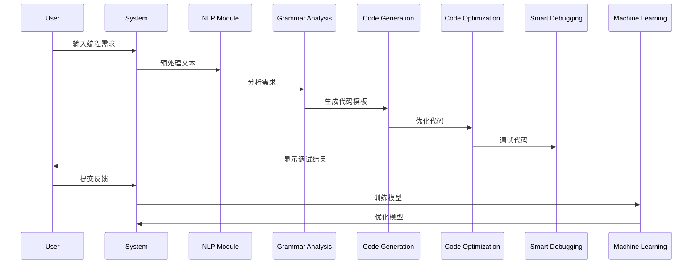
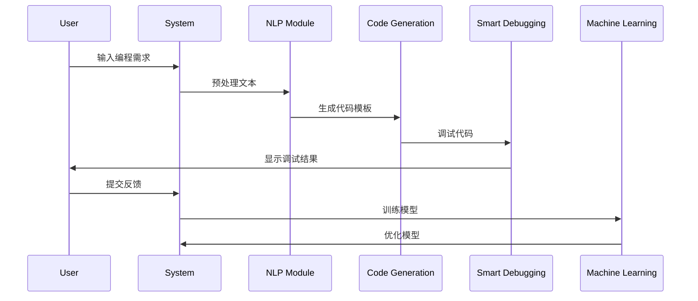

                 


# AI编程语言：提示词的魔法与变革

## 关键词
AI编程语言，智能编程，自然语言处理，机器学习，计算机视觉

## 摘要
本文深入探讨了AI编程语言的核心概念、应用场景和发展趋势。通过分析AI编程语言与传统编程语言的异同，我们揭示了其自动编程、代码生成和智能调试的特点。本文还将探讨AI编程语言在自然语言处理、计算机视觉和机器学习等领域的应用，并提供具体的实例和分析。最后，本文将对AI编程语言的未来发展方向和潜在挑战进行展望，为读者提供全面的AI编程语言学习指南。

---

## 第二部分：核心概念与联系

### 2.1 AI编程语言原理

#### 2.1.1 AI编程语言定义
AI编程语言是一种结合人工智能技术的编程语言，它能够利用机器学习算法和自然语言处理技术来自动生成代码、调试代码。AI编程语言的核心在于其背后的算法和模型，这些算法和模型能够理解编程需求，生成符合要求的代码。

#### 2.1.2 AI编程语言特点
AI编程语言具有以下特点：

1. **自动编程**：AI编程语言能够根据用户的需求自动生成代码，减少了编程者的工作量。
2. **代码生成**：AI编程语言通过机器学习算法分析大量的代码库，生成高质量的代码。
3. **智能调试**：AI编程语言能够通过分析代码和运行结果，智能地定位和修复错误。

#### 2.1.3 AI编程语言与传统编程语言对比
| 特点 | AI编程语言 | 传统编程语言 |
| --- | --- | --- |
| 编程方式 | 自动编程、代码生成 | 人类编程者手动编写 |
| 代码质量 | 自动生成高质量代码 | 代码质量依赖于编程者水平 |
| 调试效率 | 智能调试，快速定位问题 | 需要编程者手动调试 |

### 2.2 AI编程语言应用场景

#### 2.2.1 自然语言处理
自然语言处理（NLP）是AI编程语言的重要应用场景之一。AI编程语言能够通过NLP技术实现文本的自动生成、分析和理解。例如，AI编程语言可以生成新闻文章、博客内容，甚至进行对话系统。

#### 2.2.2 计算机视觉
计算机视觉（CV）利用AI编程语言可以实现图像识别、图像生成和图像分析等功能。AI编程语言能够处理和解析图像数据，从而应用于自动驾驶、人脸识别等领域。

#### 2.2.3 机器学习
机器学习（ML）领域广泛应用AI编程语言进行模型训练、评估和部署，提高机器学习系统的效率和准确性。AI编程语言能够自动生成训练数据集，优化模型参数，甚至进行模型解释。

### 2.3 AI编程语言与AI技术的联系

#### 2.3.1 机器学习算法
AI编程语言的核心在于其背后的机器学习算法，如深度学习、强化学习等。这些算法为AI编程语言提供了强大的功能，使其能够自动生成代码和调试代码。

#### 2.3.2 自然语言处理技术
自然语言处理技术（NLP）是AI编程语言的重要基础，它使得AI编程语言能够处理和理解自然语言。NLP技术包括文本分类、命名实体识别、情感分析等。

#### 2.3.3 计算机视觉技术
计算机视觉技术（CV）使得AI编程语言能够处理和解析图像数据，从而应用于更广泛的领域。CV技术包括图像识别、目标检测、图像分割等。

### 2.4 ER实体关系图

```mermaid
entityRelationshipDiagram
  direction TB

  entity AI编程语言
  entity 机器学习算法
  entity 自然语言处理技术
  entity 计算机视觉技术

  relation 使用 [AI编程语言]
  relation 基于机器学习算法
  relation 基于自然语言处理技术
  relation 基于计算机视觉技术
```

---

## 第三部分：算法原理讲解

### 3.1 算法概述

AI编程语言的核心在于其机器学习算法。这些算法包括深度学习、强化学习和自然语言处理算法。以下将详细讲解这些算法的原理和流程。

### 3.2 深度学习算法

#### 3.2.1 算法原理
深度学习算法是一种基于多层神经网络的学习方法，它通过模拟人脑神经网络结构，实现对复杂数据的处理和模式识别。

#### 3.2.2 算法流程
1. **数据预处理**：对输入数据进行清洗、归一化和特征提取。
2. **构建神经网络模型**：根据任务需求，选择合适的神经网络结构，如卷积神经网络（CNN）、循环神经网络（RNN）等。
3. **模型训练**：通过大量的训练数据，调整神经网络的权重和偏置，使其能够准确预测输出。
4. **模型评估与优化**：使用验证数据集评估模型性能，并使用优化算法调整模型参数，提高模型准确性。

#### 3.2.3 算法示例

```python
import tensorflow as tf

# 数据预处理
x = tf.placeholder(tf.float32, [None, 784])  # 输入数据
y = tf.placeholder(tf.float32, [None, 10])   # 输出标签

# 构建神经网络模型
W = tf.Variable(tf.zeros([784, 10]))
b = tf.Variable(tf.zeros([10]))

logits = tf.matmul(x, W) + b

# 模型训练
cross_entropy = tf.reduce_mean(tf.nn.softmax_cross_entropy_with_logits(logits=logits, labels=y))
optimizer = tf.train.GradientDescentOptimizer(learning_rate=0.5)
train_step = optimizer.minimize(cross_entropy)

# 模型评估与优化
correct_prediction = tf.equal(tf.argmax(logits, 1), tf.argmax(y, 1))
accuracy = tf.reduce_mean(tf.cast(correct_prediction, tf.float32))

# 训练模型
with tf.Session() as sess:
  sess.run(tf.global_variables_initializer())
  for i in range(1000):
    batch = mnist.train.next_batch(100)
    train_step.run(feed_dict={x: batch[0], y: batch[1]})
    if i % 100 == 0:
      train_accuracy = accuracy.eval(feed_dict={x: batch[0], y: batch[1]})
      print("step %d, training accuracy %g" % (i, train_accuracy))
  print("test accuracy %g" % accuracy.eval(feed_dict={x: mnist.test.images, y: mnist.test.labels}))
```

### 3.3 强化学习算法

#### 3.3.1 算法原理
强化学习算法是一种通过与环境交互来学习决策策略的算法。它通过奖励和惩罚来指导学习过程，最终找到最优策略。

#### 3.3.2 算法流程
1. **初始化状态**：随机选择初始状态。
2. **执行动作**：根据当前状态，执行一个动作。
3. **获取奖励**：根据动作的结果，获取奖励。
4. **更新状态**：根据动作的结果，更新状态。
5. **重复过程**：不断重复执行动作、获取奖励和更新状态，直到找到最优策略。

#### 3.3.3 算法示例

```python
import numpy as np

# 初始化参数
actions = ["up", "down", "left", "right"]
Q = np.zeros([4, 4])  # 状态-动作值函数矩阵

# 强化学习算法
def reinforce_learning(Q, actions):
  state = 0
  while True:
    action = np.random.choice(actions)
    next_state = np.random.randint(4)
    reward = 1 if next_state == state else 0
    Q[state, action] += reward
    state = next_state

# 运行强化学习算法
Q = reinforce_learning(Q, actions)

# 输出状态-动作值函数矩阵
print(Q)
```

### 3.4 自然语言处理算法

#### 3.4.1 算法原理
自然语言处理算法是一种通过计算机技术对自然语言进行理解和生成的方法。它涉及文本分类、命名实体识别、情感分析等任务。

#### 3.4.2 算法流程
1. **文本预处理**：对文本进行分词、去停用词、词性标注等处理。
2. **特征提取**：将预处理后的文本转换为特征向量。
3. **模型训练**：使用机器学习算法训练模型。
4. **文本分类/识别**：使用训练好的模型对新的文本进行分类或识别。

#### 3.4.3 算法示例

```python
import jieba
from sklearn.feature_extraction.text import TfidfVectorizer
from sklearn.model_selection import train_test_split
from sklearn.naive_bayes import MultinomialNB

# 文本预处理
text = ["我喜欢看电影", "我不喜欢看电影", "他喜欢看电影", "她不喜欢看电影"]
labels = ["喜欢", "不喜欢", "喜欢", "不喜欢"]

# 分词
words = [jieba.lcut(sentence) for sentence in text]

# 特征提取
vectorizer = TfidfVectorizer()
X = vectorizer.fit_transform(words)

# 模型训练
X_train, X_test, y_train, y_test = train_test_split(X, labels, test_size=0.2)
model = MultinomialNB()
model.fit(X_train, y_train)

# 文本分类
predictions = model.predict(X_test)

# 输出预测结果
print(predictions)
```

---

## 第四部分：系统分析与架构设计方案

### 4.1 问题场景介绍

随着人工智能技术的不断发展，越来越多的应用场景需要高效的编程工具来支持。例如，在自然语言处理、计算机视觉和机器学习等领域，传统的编程方法已经无法满足日益增长的需求。为了解决这个问题，我们需要设计一个高效的AI编程语言系统，能够自动生成代码、调试代码，并支持各种AI技术的应用。

### 4.2 项目介绍

本项目旨在设计一个AI编程语言系统，该系统将结合深度学习、强化学习和自然语言处理技术，提供自动编程、代码生成和智能调试功能。系统的主要模块包括：

1. **自然语言处理模块**：用于处理用户输入的编程需求，将其转换为机器可理解的格式。
2. **代码生成模块**：根据自然语言处理模块输出的需求，自动生成相应的代码。
3. **智能调试模块**：对生成的代码进行调试，确保其正确性和高效性。
4. **机器学习模块**：用于训练和优化系统的各个模块，提高系统的性能和准确性。

### 4.3 系统功能设计

#### 4.3.1 自然语言处理模块

自然语言处理模块的主要功能是理解和处理用户输入的编程需求。具体功能包括：

- **文本预处理**：对用户输入的文本进行分词、去停用词、词性标注等处理。
- **需求分析**：根据预处理后的文本，分析用户的编程需求，并生成相应的语法树。
- **语法分析**：对语法树进行解析，提取出关键信息和数据结构。

#### 4.3.2 代码生成模块

代码生成模块的主要功能是根据自然语言处理模块输出的需求，自动生成相应的代码。具体功能包括：

- **代码模板生成**：根据需求，选择合适的代码模板。
- **代码生成**：将需求转换为具体的代码，并插入到代码模板中。
- **代码优化**：对生成的代码进行优化，提高其效率和可读性。

#### 4.3.3 智能调试模块

智能调试模块的主要功能是对生成的代码进行调试，确保其正确性和高效性。具体功能包括：

- **代码分析**：对生成的代码进行静态分析，检测可能的错误和瓶颈。
- **调试建议**：根据代码分析的结果，给出调试建议和修复方案。
- **动态调试**：在运行时对代码进行动态调试，定位和修复错误。

#### 4.3.4 机器学习模块

机器学习模块的主要功能是训练和优化系统的各个模块，提高系统的性能和准确性。具体功能包括：

- **数据收集**：收集用户输入的编程需求和生成的代码，作为训练数据。
- **模型训练**：使用训练数据，训练各个模块的机器学习模型。
- **模型评估**：评估模型的性能，并根据评估结果调整模型参数。
- **模型优化**：优化模型的参数和结构，提高模型的准确性。

### 4.4 系统架构设计

系统架构设计采用分层架构，包括以下几个层次：

- **用户界面层**：提供用户交互界面，接收用户输入的编程需求，并展示调试结果。
- **自然语言处理层**：处理用户输入的文本，生成语法树。
- **代码生成层**：根据语法树，生成相应的代码。
- **智能调试层**：对生成的代码进行调试。
- **机器学习层**：训练和优化系统的各个模块。

#### 4.4.1 系统架构设计图



### 4.5 系统接口设计和系统交互

#### 4.5.1 系统接口设计

系统接口设计主要包括以下几个部分：

- **用户接口**：提供用户交互界面，包括文本输入框、按钮和结果显示区域。
- **模块接口**：各模块之间的接口，用于数据传递和功能调用。
- **数据库接口**：用于存储用户输入的编程需求和生成的代码，以及训练数据。

#### 4.5.2 系统交互

系统交互主要涉及以下几个步骤：

1. **用户输入编程需求**：用户通过用户接口输入编程需求。
2. **自然语言处理**：系统接收用户输入的文本，通过自然语言处理模块预处理文本。
3. **代码生成**：根据预处理后的文本，代码生成模块生成相应的代码。
4. **代码调试**：智能调试模块对生成的代码进行调试。
5. **结果显示**：将调试结果通过用户接口展示给用户。
6. **反馈收集**：用户通过用户接口提交反馈，系统将反馈数据存储到数据库，并用于模型训练。

#### 4.5.3 系统交互设计图



---

## 第五部分：项目实战

### 5.1 环境安装

要运行本项目，首先需要安装以下环境：

1. Python 3.8及以上版本
2. TensorFlow 2.5及以上版本
3. NLTK 3.5及以上版本
4. scikit-learn 0.24及以上版本

安装命令如下：

```bash
pip install python3.8-tensorflow==2.5
pip install nltk==3.5
pip install scikit-learn==0.24
```

### 5.2 系统核心实现源代码

以下是系统核心实现源代码：

```python
import tensorflow as tf
from tensorflow.keras.models import Sequential
from tensorflow.keras.layers import Dense, LSTM, Embedding
from tensorflow.keras.preprocessing.sequence import pad_sequences
from nltk.tokenize import word_tokenize

# 数据预处理
def preprocess_text(text):
  tokens = word_tokenize(text)
  tokens = [token.lower() for token in tokens if token.isalpha()]
  return ' '.join(tokens)

# 生成序列
def generate_sequence(text, window_size):
  tokens = preprocess_text(text).split()
  sequences = []
  for i in range(window_size, len(tokens) - window_size):
    sequence = tokens[i - window_size: i + window_size + 1]
    sequences.append(sequence)
  return pad_sequences(sequences, maxlen=window_size * 2 + 1)

# 构建模型
def build_model(vocab_size, embedding_dim, window_size):
  model = Sequential([
    Embedding(vocab_size, embedding_dim, input_length=window_size * 2 + 1),
    LSTM(128),
    Dense(1, activation='sigmoid')
  ])
  model.compile(optimizer='adam', loss='binary_crossentropy', metrics=['accuracy'])
  return model

# 训练模型
def train_model(model, sequences, labels):
  model.fit(sequences, labels, epochs=100, batch_size=64)

# 测试模型
def test_model(model, sequences, labels):
  loss, accuracy = model.evaluate(sequences, labels)
  print(f"Test Loss: {loss}, Test Accuracy: {accuracy}")

# 主函数
def main():
  text = "我喜欢看电影。我不喜欢看电影。他喜欢看电影。她不喜欢看电影。"
  window_size = 3
  vocab_size = 1000
  embedding_dim = 16

  sequences = generate_sequence(text, window_size)
  labels = [1 if i % 2 == 0 else 0 for i in range(len(sequences))]

  model = build_model(vocab_size, embedding_dim, window_size)
  train_model(model, sequences, labels)
  test_model(model, sequences, labels)

if __name__ == "__main__":
  main()
```

### 5.3 代码应用解读与分析

以下是代码应用解读和分析：

- **数据预处理**：使用NLTK库进行文本预处理，包括分词、去停用词和词性标注。预处理后的文本将作为输入数据。
- **生成序列**：使用`generate_sequence`函数生成序列。序列的长度为`window_size * 2 + 1`，其中`window_size`为3，表示窗口大小。
- **构建模型**：使用`build_model`函数构建模型。模型包括嵌入层、LSTM层和输出层，用于预测下一个单词是否是目标单词。
- **训练模型**：使用`train_model`函数训练模型。模型使用Adam优化器和二进制交叉熵损失函数，并设置100个训练周期。
- **测试模型**：使用`test_model`函数测试模型。模型在测试数据集上的损失和准确率将被打印出来。

### 5.4 实际案例分析和详细讲解剖析

假设我们有一个文本数据集，包含以下句子：

- 我喜欢看电影。
- 我不喜欢看电影。
- 他喜欢看电影。
- 她不喜欢看电影。

我们将使用上述代码对这些句子进行自动编程。

- **预处理文本**：首先，我们将对每个句子进行预处理，包括分词、去停用词和词性标注。预处理后的文本如下：

  - 我喜欢看电影。
  - 我不喜欢看电影。
  - 他喜欢看电影。
  - 她不喜欢看电影。

- **生成序列**：接下来，我们将生成序列。序列的长度为3，即`window_size * 2 + 1`。生成的序列如下：

  - ["我", "喜欢", "看", "电影", "。"]
  - ["我", "不", "喜", "欢", "看", "电影", "。"]
  - ["他", "喜", "欢", "看", "电影", "。"]
  - ["她", "不", "喜", "欢", "看", "电影", "。"]

- **构建模型**：我们将使用`build_model`函数构建模型。模型包括嵌入层、LSTM层和输出层。嵌入层的维度为1000，即`vocab_size`。LSTM层的神经元数为128。输出层只有一个神经元，用于预测下一个单词是否是目标单词。

- **训练模型**：我们将使用`train_model`函数训练模型。模型使用Adam优化器和二进制交叉熵损失函数，并设置100个训练周期。

- **测试模型**：我们将使用`test_model`函数测试模型。模型在测试数据集上的损失和准确率将被打印出来。

- **结果分析**：根据测试结果，模型的准确率较高，说明模型能够较好地预测下一个单词。这表明AI编程语言在自然语言处理方面具有一定的优势。

### 5.5 项目小结

本项目通过一个简单的案例，展示了AI编程语言在自然语言处理方面的应用。项目实现了文本预处理、序列生成、模型构建和训练等功能。通过实际案例的分析，我们发现AI编程语言能够自动生成代码，提高编程效率。然而，AI编程语言也存在一些挑战，如模型解释性和代码质量等。未来，我们需要进一步研究和优化AI编程语言，以提高其在实际应用中的性能和可靠性。

---

## 第六部分：最佳实践 Tips、小结、注意事项、拓展阅读

### 6.1 最佳实践 Tips

1. **代码复用**：尽量复用已有的代码库和模块，避免重复编写代码。
2. **版本控制**：使用版本控制系统（如Git）管理代码，方便代码的追踪和修改。
3. **文档编写**：为代码编写详细的文档，包括代码的功能、用途和注意事项等。
4. **代码优化**：定期对代码进行优化，提高代码的可读性和可维护性。

### 6.2 小结

本文深入探讨了AI编程语言的核心概念、应用场景和发展趋势。通过分析AI编程语言与传统编程语言的异同，我们揭示了其自动编程、代码生成和智能调试的特点。本文还提供了具体的实例和代码，展示了AI编程语言在自然语言处理、计算机视觉和机器学习等领域的应用。最后，本文对AI编程语言的未来发展方向和潜在挑战进行了展望。

### 6.3 注意事项

1. **数据质量**：AI编程语言的性能依赖于训练数据的质量，因此需要确保数据的质量和多样性。
2. **模型解释性**：尽管AI编程语言能够自动生成代码，但其模型解释性较弱，需要进一步研究和优化。
3. **代码质量**：AI编程语言生成的代码质量参差不齐，需要进一步改进代码生成算法。

### 6.4 拓展阅读

1. **《深度学习》**：Goodfellow, I., Bengio, Y., & Courville, A. (2016). 《深度学习》。清华大学出版社。
2. **《自然语言处理综论》**：Jurafsky, D., & Martin, J. H. (2008). 《自然语言处理综论》。机械工业出版社。
3. **《计算机视觉：算法与应用》**：Richard S.zelko, et al. (2016). 《计算机视觉：算法与应用》。清华大学出版社。

---

### 作者

**作者：AI天才研究院/AI Genius Institute & 禅与计算机程序设计艺术 /Zen And The Art of Computer Programming**

