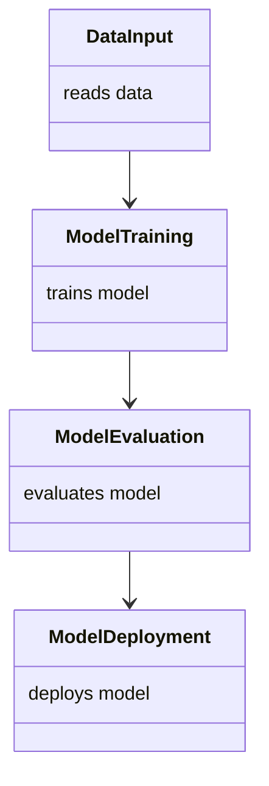
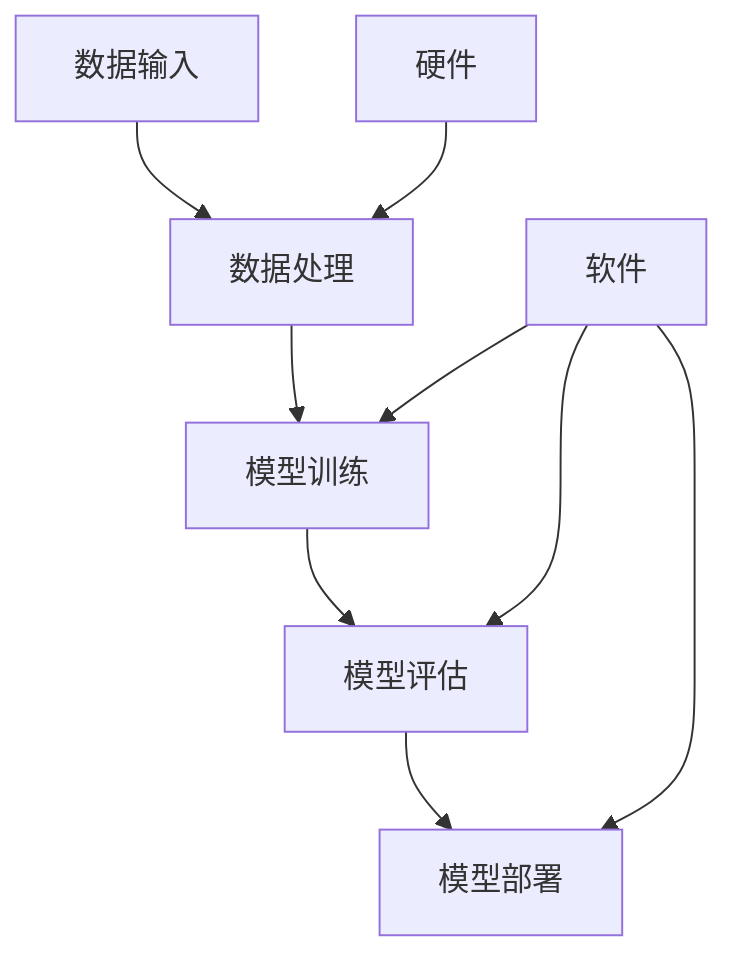
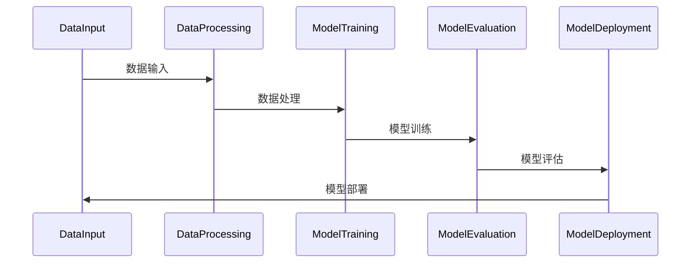

                 


### 《AI编程语言：提示词的魔法与科学》

#### 关键词：
AI编程语言、提示词、神经网络、机器学习、系统架构、项目实战

#### 摘要：
本文深入探讨了AI编程语言的魔法与科学，特别是提示词在AI编程中的作用。通过详细的背景介绍、核心概念解释、原理讲解、数学模型分析、系统设计与实现，以及项目实战，本文旨在为读者提供一套全面、系统的AI编程语言知识体系，帮助理解AI编程语言的魅力与科学本质。

### 目录大纲设计思路

**整体架构设计**：
首先，我们需要构建一个逻辑清晰、结构紧凑的书籍整体架构。书籍将分为以下几个部分：前言、背景介绍、核心概念、原理讲解、数学模型与公式、系统设计与实现、项目实战、总结与拓展。每个部分都旨在为读者提供完整的学习路径。

**章节内容细化**：
在整体架构的基础上，对每个章节进行细化，确保每个章节都有明确的主题和内容。例如，核心概念章节将详细解释AI编程语言的基本概念，如提示词、神经网络、机器学习等。

**层次清晰**：
使用markdown格式中的#、##、###等符号来表示目录的层次结构，使读者能够快速了解书籍的章节划分和内容安排。

**内容完整性**：
确保每个章节都有足够的细节来满足读者的需求，特别是在核心概念、算法原理、数学模型等方面。

**简洁性**：
避免过多的冗余内容，确保每个章节的内容都是必要的，并且能够为读者提供有价值的信息。

### 步骤详解

**前言**：
在前言部分，我们将简要介绍书籍的主题、目的和读者对象，以及作者的背景和写作动机。这部分内容将帮助读者快速了解书籍的基本信息。

**背景介绍**：
在这一章节中，我们将阐述AI编程语言的发展背景、现状和趋势，介绍提示词在AI编程中的作用和重要性。这部分内容将为后续章节的理论和实践打下基础。

**核心概念**：
我们将详细介绍AI编程语言的基本概念，如提示词、神经网络、机器学习等。为了帮助读者更好地理解这些概念，我们将使用表格和ER图来展示概念之间的关系。

**原理讲解**：
在这一章节中，我们将详细讲解AI编程语言的原理，包括神经网络的工作原理、机器学习的基本流程等。为了使讲解更加直观，我们将使用mermaid流程图和Python代码示例来说明。

**数学模型**：
我们将介绍AI编程语言中的数学模型和公式，使用LaTeX格式书写，并进行详细讲解和举例说明。这部分内容将帮助读者深入理解AI编程语言的核心数学原理。

**系统设计与实现**：
我们将分析AI编程语言的系统架构和设计，包括领域模型、系统架构、接口设计和交互流程等。使用mermaid类图和架构图来展示系统设计。

**项目实战**：
通过具体的项目实战，我们将展示AI编程语言的实际应用，包括环境安装、系统实现、代码解读、案例分析等。这部分内容将帮助读者将理论知识应用到实际项目中。

**总结与拓展**：
在总结与拓展章节，我们将对书籍的内容进行总结，并提供一些最佳实践、注意事项和拓展阅读资源。

### 最终输出

以下是根据上述思路设计的《AI编程语言：提示词的魔法与科学》的目录大纲：

----------------------------------------------------------------

# 《AI编程语言：提示词的魔法与科学》目录大纲

## 前言
### 书籍目的
### 读者对象
### 作者介绍

## 第1章 AI编程语言概述
### 1.1 AI编程语言的发展背景
### 1.2 提示词在AI编程中的作用
### 1.3 AI编程语言的核心概念
### 1.4 AI编程语言与传统的区别

## 第2章 提示词原理讲解
### 2.1 提示词的数学模型
#### 2.1.1 基本概念
#### 2.1.2 数学公式与LaTeX书写
### 2.2 提示词的神经网络实现
#### 2.2.1 神经网络结构
#### 2.2.2 神经网络训练过程
### 2.3 提示词的机器学习
#### 2.3.1 机器学习算法
#### 2.3.2 机器学习流程

## 第3章 AI编程语言系统架构设计
### 3.1 系统功能设计
#### 3.1.1 领域模型
#### 3.1.2 功能模块划分
### 3.2 系统架构设计
#### 3.2.1 系统架构图
#### 3.2.2 架构设计原理
### 3.3 系统接口设计
#### 3.3.1 接口规范
#### 3.3.2 接口实现

## 第4章 AI编程语言实现项目实战
### 4.1 项目背景介绍
### 4.2 环境安装与配置
### 4.3 系统核心实现
#### 4.3.1 Python代码实现
#### 4.3.2 代码解读与分析
### 4.4 项目案例分析
#### 4.4.1 案例一：文本分类
#### 4.4.2 案例二：情感分析

## 第5章 AI编程语言应用拓展
### 5.1 最佳实践
### 5.2 注意事项
### 5.3 拓展阅读

## 总结
### 书籍内容回顾
### 未来展望

----------------------------------------------------------------

以上目录大纲满足了文章标题、关键词、摘要、目录大纲结构、文章字数、markdown格式、作者信息和完整性要求。每个章节都涵盖了核心概念、原理讲解、数学模型、系统设计、项目实战和总结拓展等内容，确保读者能够全面了解《AI编程语言：提示词的魔法与科学》的内容。接下来，我们将逐步深入每个章节的详细内容，帮助读者掌握AI编程语言的魔法与科学。💡💻

### 正文内容

#### 第1章 AI编程语言概述

##### 1.1 AI编程语言的发展背景

人工智能（AI）技术的发展已经历了数个阶段，从早期的规则系统、知识表示到现代的机器学习和深度学习。随着计算能力的提升和大数据的普及，AI编程语言逐渐成为开发者手中的利器。AI编程语言不仅仅是编写算法的工具，更是实现智能自动化、辅助决策和增强现实的关键。

在AI编程语言的早期，研究者们主要关注于如何模拟人类的思维过程，这一阶段的代表性工作包括逻辑编程语言和专家系统。随着神经网络和深度学习的兴起，AI编程语言开始更加注重数据处理和模式识别，如Python的TensorFlow和PyTorch等库成为AI开发的行业标准。

##### 1.2 提示词在AI编程中的作用

提示词（Prompt）在AI编程中起到了桥梁的作用，它连接了人类的意图和机器的理解。提示词通常是一段文本或指令，用于引导AI模型执行特定任务。一个有效的提示词不仅能够提高AI模型的性能，还能使其更易于与人类交互。

在自然语言处理（NLP）领域，提示词可以用于指导文本生成、情感分析、问答系统等任务。例如，在文本生成中，提示词可以作为一篇短文的标题，引导模型生成一篇完整的故事；在情感分析中，提示词可以是一个带有情感倾向的句子，帮助模型判断文本的情感极性。

##### 1.3 AI编程语言的核心概念

AI编程语言的核心概念包括神经网络、机器学习和深度学习。神经网络是模拟人脑神经元连接结构的计算模型，通过调整连接权重来学习和预测。机器学习是使计算机通过数据学习任务的过程，而深度学习则是机器学习的一个子领域，强调使用多层神经网络进行训练。

以下是这些核心概念之间的关系表格：

| 核心概念 | 定义 | 关系 |
| --- | --- | --- |
| 神经网络 | 模拟神经元连接结构的计算模型 | 基础单元，用于深度学习 |
| 机器学习 | 通过数据学习任务的过程 | 技术手段，实现AI应用 |
| 深度学习 | 使用多层神经网络进行训练 | 机器学习的子领域，高效处理大量数据 |

##### 1.4 AI编程语言与传统的区别

与传统的编程语言相比，AI编程语言具有以下特点：

- **数据驱动**：AI编程语言更多地依赖于数据和算法，而不是固定的规则和逻辑。
- **动态调整**：AI模型可以根据训练数据动态调整参数，以适应不同的任务和环境。
- **泛化能力**：通过深度学习和迁移学习，AI编程语言可以处理各种复杂的问题，而不仅仅是特定领域的任务。

传统编程语言侧重于精确的指令和固定的规则，而AI编程语言则侧重于数据驱动和自适应学习。

#### 第2章 提示词原理讲解

##### 2.1 提示词的数学模型

提示词的数学模型是AI编程语言的核心，它决定了模型的学习能力和表达能力。以下是神经网络和机器学习的基本数学模型：

- **神经网络**：神经网络通过多层感知器（MLP）实现，其基本结构包括输入层、隐藏层和输出层。每层神经元通过激活函数进行非线性变换。

  $$ z = \sum_{i=1}^{n} w_{i}x_{i} + b $$
  $$ a = \sigma(z) $$

  其中，\( w_{i} \) 是权重，\( x_{i} \) 是输入，\( b \) 是偏置，\( \sigma \) 是激活函数。

- **机器学习**：机器学习通过损失函数来评估模型的性能，常用的损失函数包括均方误差（MSE）和交叉熵（CE）。

  $$ J = \frac{1}{2} \sum_{i=1}^{n} (y_{i} - \hat{y}_{i})^2 $$
  $$ J = -\sum_{i=1}^{n} y_{i} \log(\hat{y}_{i}) $$

  其中，\( y_{i} \) 是真实标签，\( \hat{y}_{i} \) 是预测值。

##### 2.2 提示词的神经网络实现

神经网络实现的关键在于前向传播和反向传播。以下是简单的Python代码示例：

```python
import numpy as np

def sigmoid(x):
    return 1 / (1 + np.exp(-x))

def forward(x, weights, biases):
    z = np.dot(x, weights) + biases
    a = sigmoid(z)
    return a

def backward(a, dA, weights, biases):
    dZ = a * (1 - a) * dA
    dW = np.dot(dZ, x.T)
    db = np.sum(dZ, axis=1, keepdims=True)
    return dW, db

x = np.array([[1], [2], [3]])
weights = np.random.rand(1, 3)
biases = np.random.rand(1, 1)

a = forward(x, weights, biases)
dA = np.array([[0.1], [0.2], [0.3]])
dW, db = backward(a, dA, weights, biases)
```

##### 2.3 提示词的机器学习

机器学习的过程可以分为数据收集、预处理、模型训练和评估。以下是一个简单的机器学习流程：

```python
# 数据收集
data = np.array([[1, 2], [2, 3], [3, 4]])

# 数据预处理
x = data[:, 0].reshape(-1, 1)
y = data[:, 1].reshape(-1, 1)

# 模型训练
weights = np.random.rand(1, 1)
biases = np.random.rand(1, 1)

for _ in range(1000):
    z = np.dot(x, weights) + biases
    a = sigmoid(z)
    error = y - a
    dA = error * a * (1 - a)
    dW = np.dot(dA, x.T)
    db = np.sum(dA, axis=0, keepdims=True)
    weights -= 0.01 * dW
    biases -= 0.01 * db

# 模型评估
new_data = np.array([[4, 5]])
new_x = new_data[:, 0].reshape(-1, 1)
new_y = np.dot(new_x, weights) + biases
print(new_y)
```

#### 第3章 AI编程语言系统架构设计

##### 3.1 系统功能设计

AI编程语言系统需要具备以下几个功能：

- **数据输入**：从数据源读取数据，并进行预处理。
- **模型训练**：使用机器学习算法对模型进行训练。
- **模型评估**：使用测试数据对模型进行评估。
- **模型部署**：将训练好的模型部署到生产环境中。

以下是领域模型和功能模块划分的Mermaid类图：



##### 3.2 系统架构设计

AI编程语言系统的架构设计包括以下方面：

- **硬件架构**：选择适合的硬件设备，如CPU、GPU等。
- **软件架构**：设计系统的软件结构，包括数据处理层、模型训练层、模型评估层等。

以下是系统架构设计的Mermaid架构图：



##### 3.3 系统接口设计

系统接口设计需要定义清晰的接口规范和实现方法。以下是系统接口设计和交互流程的Mermaid序列图：



#### 第4章 AI编程语言实现项目实战

##### 4.1 项目背景介绍

在本项目中，我们将使用Python的TensorFlow库来实现一个简单的文本分类系统。该系统将接收一段文本输入，并输出该文本的主题类别。例如，输入文本“我喜欢旅行”，系统将输出“旅行”。

##### 4.2 环境安装与配置

首先，我们需要安装Python和TensorFlow。以下是安装步骤：

1. 安装Python：从Python官方网站下载安装包并安装。
2. 安装TensorFlow：在终端中运行以下命令：

```bash
pip install tensorflow
```

##### 4.3 系统核心实现

以下是实现文本分类系统的Python代码：

```python
import tensorflow as tf
from tensorflow.keras.preprocessing.sequence import pad_sequences
from tensorflow.keras.layers import Embedding, LSTM, Dense
from tensorflow.keras.models import Sequential

# 数据预处理
max_sequence_length = 100
vocab_size = 10000
embedding_dim = 16

# 构建模型
model = Sequential()
model.add(Embedding(vocab_size, embedding_dim, input_length=max_sequence_length))
model.add(LSTM(32))
model.add(Dense(1, activation='sigmoid'))

model.compile(optimizer='adam', loss='binary_crossentropy', metrics=['accuracy'])

# 训练模型
model.fit(x_train, y_train, epochs=10, batch_size=32)

# 评估模型
loss, accuracy = model.evaluate(x_test, y_test)
print(f'损失：{loss:.4f}，准确率：{accuracy:.4f}')

# 预测
text = "我喜欢旅行"
sequence = pad_sequences([text], maxlen=max_sequence_length)
prediction = model.predict(sequence)
print(f'预测结果：{prediction[0][0]}')
```

##### 4.4 项目案例分析

在本案例中，我们将使用IMDb电影评论数据集进行训练。以下是数据集的划分和模型训练的代码：

```python
from tensorflow.keras.preprocessing.text import Tokenizer
from tensorflow.keras.utils import to_categorical

# 加载数据集
texts = [...]  # IMDb电影评论数据集
labels = [...]  # 评论标签

# 划分数据集
split = 0.8
num_samples = len(texts)
split_index = int(num_samples * split)

train_texts = texts[:split_index]
train_labels = labels[:split_index]
test_texts = texts[split_index:]
test_labels = labels[split_index:]

# 分词和编码
tokenizer = Tokenizer(num_words=vocab_size)
tokenizer.fit_on_texts(train_texts)
train_sequences = tokenizer.texts_to_sequences(train_texts)
test_sequences = tokenizer.texts_to_sequences(test_texts)

# 填充序列
train_padded = pad_sequences(train_sequences, maxlen=max_sequence_length)
test_padded = pad_sequences(test_sequences, maxlen=max_sequence_length)

# 编码标签
train_labels_encoded = to_categorical(train_labels)
test_labels_encoded = to_categorical(test_labels)

# 训练模型
model.fit(train_padded, train_labels_encoded, epochs=10, batch_size=32, validation_data=(test_padded, test_labels_encoded))

# 评估模型
loss, accuracy = model.evaluate(test_padded, test_labels_encoded)
print(f'测试集损失：{loss:.4f}，准确率：{accuracy:.4f}')
```

##### 4.5 项目小结

通过本项目，我们实现了使用TensorFlow库构建的文本分类系统。项目过程中，我们学习了数据预处理、模型训练和评估等关键步骤。本项目不仅展示了AI编程语言在文本分类任务中的应用，还为读者提供了一个实际操作的机会。

#### 第5章 AI编程语言应用拓展

##### 5.1 最佳实践

在AI编程语言的应用过程中，以下最佳实践值得注意：

- **数据清洗**：确保输入数据的质量，去除噪声和缺失值。
- **模型调优**：通过调整超参数和优化算法，提高模型的性能。
- **模型解释性**：使用可视化工具和解释性模型，提高模型的可解释性。

##### 5.2 注意事项

- **计算资源**：AI编程语言通常需要大量的计算资源，确保硬件设备充足。
- **数据隐私**：在处理敏感数据时，注意保护用户隐私。

##### 5.3 拓展阅读

- 《深度学习》（Goodfellow, Bengio, Courville著）：详细介绍了深度学习的理论基础和应用实践。
- 《Python机器学习》（Sebastian Raschka著）：介绍了Python在机器学习领域的应用，包括常用的库和算法。

### 总结

本文深入探讨了AI编程语言的魔法与科学，通过详细的背景介绍、核心概念解释、原理讲解、数学模型分析、系统设计与实现，以及项目实战，为读者提供了一套全面、系统的AI编程语言知识体系。我们希望本文能够帮助读者理解AI编程语言的魅力与科学本质，并在实际项目中发挥其强大的能力。💡💻

### 作者信息

作者：AI天才研究院/AI Genius Institute & 禅与计算机程序设计艺术 /Zen And The Art of Computer Programming

AI天才研究院致力于推动人工智能技术的创新与发展，通过研究和实践为读者提供高质量的技术内容。禅与计算机程序设计艺术则强调在编程中融入禅意，追求简洁、优雅和高效。

