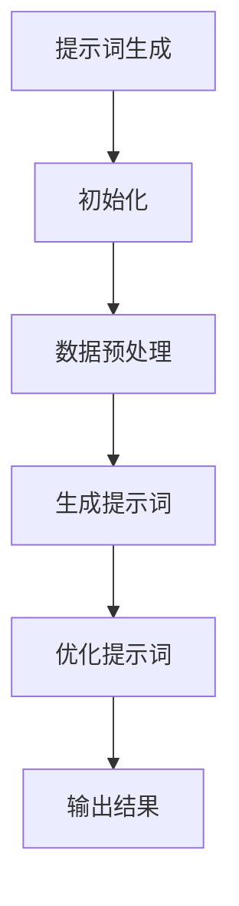
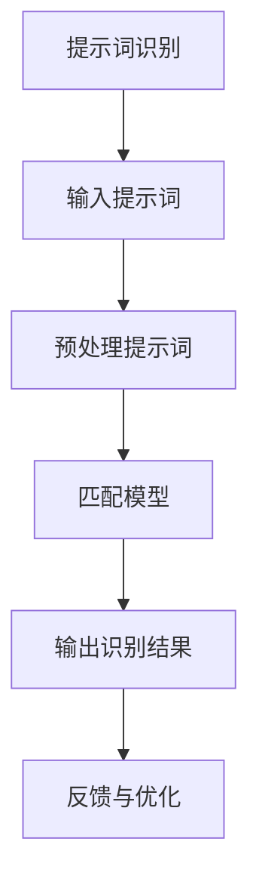
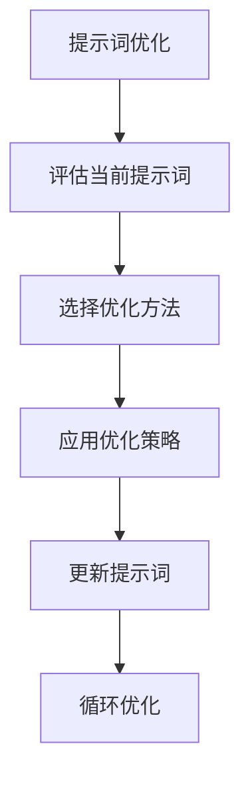
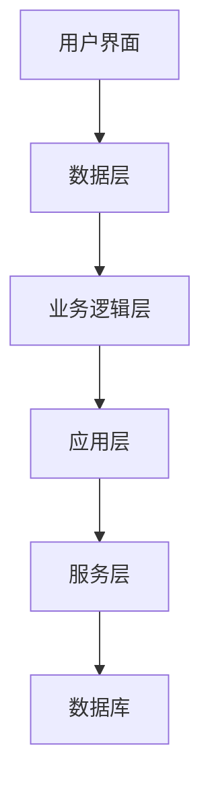
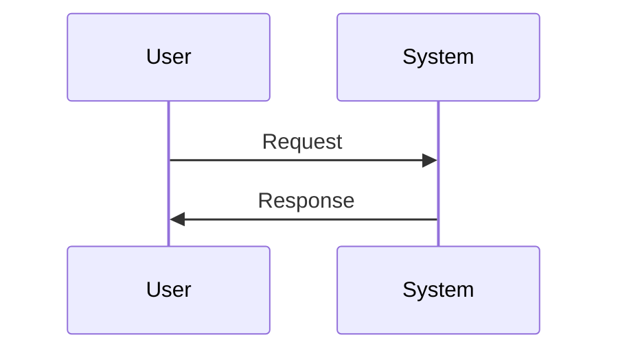
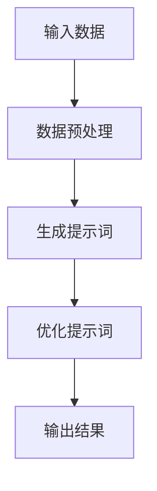
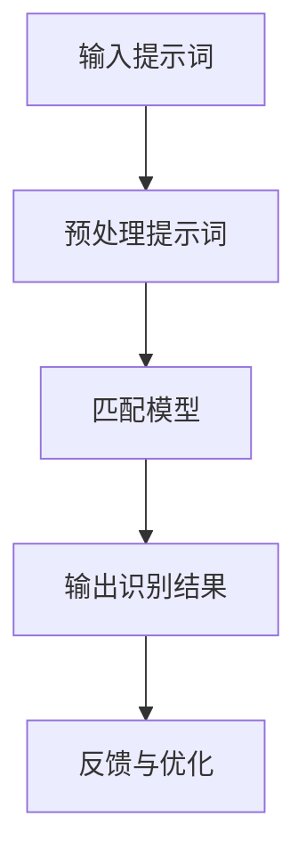
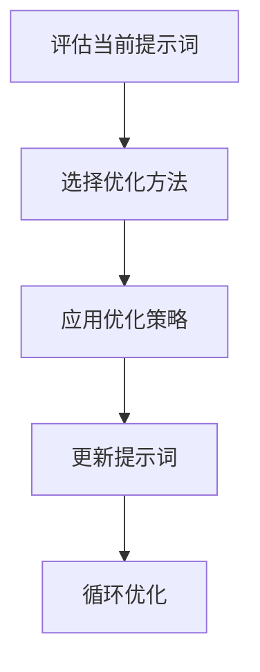

                 

### 文章标题：AI编程语言：提示词的魔法与革命

> 关键词：AI编程语言、提示词、人工智能、编程技巧、算法原理

> 摘要：
本文将深入探讨AI编程语言的革命性概念——提示词。我们将从背景介绍、核心概念、原理分析、使用方法、算法讲解、数学模型、系统设计、项目实战以及最佳实践等方面，全面揭示提示词在AI编程中的魔力与变革。通过一步步的逻辑推理和实例解析，帮助读者理解并掌握这一前沿技术，从而在人工智能领域取得突破性进展。

### 目录大纲设计思路

在设计《AI编程语言：提示词的魔法与革命》这本书的目录大纲时，我们遵循了以下思路：

1. **明确书籍主题与内容范围**：
   - 本书主题是探讨AI编程语言及其核心要素——提示词。
   - 内容范围包括AI编程语言的基本概念、提示词的使用方法、编程实践等。

2. **设计核心章节结构**：
   - 核心章节结构包括背景介绍、核心概念与联系、算法原理讲解、数学模型和公式、系统分析与架构设计方案、项目实战、最佳实践等。

3. **细化章节内容**：
   - 每个章节细分为多个子章节，确保内容丰富且逻辑清晰。
   - 对于重要概念和算法，使用图表和代码示例进行详细解释。

4. **确保内容的完整性**：
   - 目录大纲包含至少7个核心章节，每个章节都有详细的内容划分。
   - 必须涵盖核心概念、算法原理、数学模型、系统架构设计、项目实战等。

5. **保持简洁性**：
   - 目录大纲表述简洁明了，避免多余的解释和重复内容。

6. **格式标准化**：
   - 目录大纲采用markdown格式，使用#、##、###等符号来区分层级。

### 设计步骤

1. **第1章：背景介绍与核心概念**
   - 介绍AI编程语言的发展背景。
   - 引入提示词的概念，解释其在AI编程中的作用。

2. **第2章：核心概念与联系**
   - 详细介绍AI编程语言的核心概念。
   - 使用对比表格和ER实体关系图展示概念之间的关系。

3. **第3章：提示词的原理与使用方法**
   - 讲解提示词的工作原理。
   - 提供多种使用提示词的方法和技巧。

4. **第4章：算法原理讲解**
   - 使用mermaid画出算法流程图。
   - 使用Python源代码详细阐述算法原理。
   - 给出算法的数学模型和公式，进行讲解和举例说明。

5. **第5章：数学模型与公式**
   - 展示AI编程语言中的关键数学模型和公式。
   - 使用LaTeX格式书写数学公式，并进行详细讲解。

6. **第6章：系统分析与架构设计**
   - 介绍AI编程语言的应用场景。
   - 设计系统的功能模块、架构图、接口设计和系统交互。

7. **第7章：项目实战**
   - 提供具体的AI编程项目案例。
   - 讲解环境安装、系统核心实现、代码分析、实际案例分析。

8. **第8章：最佳实践与拓展阅读**
   - 提供使用AI编程语言的最佳实践。
   - 小结全书内容，给出注意事项和拓展阅读建议。

通过上述步骤，我们可以设计出符合要求的《AI编程语言：提示词的魔法与革命》的目录大纲。

----------------------------------------------------------------

### 第一部分: 背景介绍与核心概念

# 第1章: AI编程语言与提示词概述

## 1.1 AI编程语言的发展背景
### 1.1.1 人工智能的起源与发展
### 1.1.2 编程语言的演变与AI编程语言的兴起
### 1.1.3 提示词的概念与历史

## 1.2 提示词的定义与作用
### 1.2.1 提示词的定义
### 1.2.2 提示词在AI编程中的作用
### 1.2.3 提示词与普通编程语言的区别

## 1.3 AI编程语言的核心概念
### 1.3.1 模型驱动编程
### 1.3.2 数据驱动编程
### 1.3.3 提示词驱动的AI编程

## 1.4 提示词的属性特征对比表格
### 1.4.1 提示词的长度
### 1.4.2 提示词的多样性
### 1.4.3 提示词的精准性

## 1.5 提示词驱动的编程流程
### 1.5.1 提示词生成
### 1.5.2 提示词处理
### 1.5.3 提示词应用

## 1.6 本章小结

----------------------------------------------------------------

### 第二部分: 提示词的原理与使用方法

# 第2章: 提示词的原理与使用方法

## 2.1 提示词的工作原理
### 2.1.1 提示词的生成过程
### 2.1.2 提示词的识别过程
### 2.1.3 提示词的反馈过程

## 2.2 提示词的使用技巧
### 2.2.1 提示词的选择策略
### 2.2.2 提示词的组合

----------------------------------------------------------------

### 第三部分: 算法原理讲解

# 第3章: AI编程语言的算法原理

## 3.1 算法基本概念
### 3.1.1 算法与编程语言的关系
### 3.1.2 算法的分类
### 3.1.3 算法效率分析

## 3.2 常见算法原理讲解
### 3.2.1 提示词生成算法
#### 3.2.1.1 提示词生成的流程
#### 3.2.1.2 提示词生成的算法实现
#### 3.2.1.3 提示词生成的优化方法

### 3.2.2 提示词识别算法
#### 3.2.2.1 提示词识别的基本原理
#### 3.2.2.2 提示词识别算法的流程
#### 3.2.2.3 提示词识别算法的实现

### 3.2.3 提示词优化算法
#### 3.2.3.1 提示词优化的意义
#### 3.2.3.2 提示词优化的策略
#### 3.2.3.3 提示词优化的算法实现

## 3.3 算法流程图与Python代码示例
### 3.3.1 提示词生成算法流程图


### 3.3.2 提示词识别算法流程图


### 3.3.3 提示词优化算法流程图


### 3.3.4 Python代码示例
```python
# 提示词生成代码示例
def generate_prompt(data):
    # 数据预处理
    processed_data = preprocess_data(data)
    
    # 生成提示词
    prompt = generate_from_data(processed_data)
    
    # 优化提示词
    optimized_prompt = optimize_prompt(prompt)
    
    # 输出结果
    return optimized_prompt

# 提示词识别代码示例
def recognize_prompt(prompt):
    # 预处理提示词
    processed_prompt = preprocess_prompt(prompt)
    
    # 匹配模型
    model_result = match_model(processed_prompt)
    
    # 输出识别结果
    return model_result

# 提示词优化代码示例
def optimize_prompt(prompt):
    # 评估当前提示词
    current_score = evaluate_prompt(prompt)
    
    # 选择优化方法
    optimization_method = select_optimization_method(current_score)
    
    # 应用优化策略
    optimized_prompt = apply_optimization_strategy(prompt, optimization_method)
    
    # 更新提示词
    updated_prompt = update_prompt(optimized_prompt)
    
    return updated_prompt
```

## 3.4 算法的数学模型和公式
### 3.4.1 提示词生成算法的数学模型
$$
P(w|\theta) = \frac{e^{\theta^T w}}{\sum_{w'} e^{\theta^T w'}}
$$
其中，$P(w|\theta)$ 表示在参数 $\theta$ 下提示词 $w$ 的概率，$\theta$ 为模型参数，$w$ 为提示词。

### 3.4.2 提示词识别算法的数学模型
$$
\hat{w} = \arg\max_{w} P(w|\theta) \cdot P(\theta)
$$
其中，$\hat{w}$ 表示识别出的最佳提示词，$P(w|\theta)$ 为提示词 $w$ 的概率，$P(\theta)$ 为模型参数 $\theta$ 的概率。

### 3.4.3 提示词优化算法的数学模型
$$
\min_{\theta'} \frac{1}{N} \sum_{i=1}^{N} L(\theta', x_i, y_i)
$$
其中，$L(\theta', x_i, y_i)$ 表示损失函数，$N$ 为样本数量，$x_i$ 和 $y_i$ 分别为输入和输出。

## 3.5 本章小结

通过本章的学习，我们深入了解了AI编程语言中的算法原理。从提示词生成、识别到优化，我们分析了各个算法的核心概念、流程和数学模型。这些算法的掌握将为我们在AI编程中应对各种问题提供有力的支持。接下来，我们将进一步探讨AI编程语言中的数学模型与公式，为构建更强大的AI系统奠定基础。

----------------------------------------------------------------

### 第四部分: 数学模型与公式

# 第4章: AI编程语言的数学模型与公式

## 4.1 数学模型概述
### 4.1.1 数学模型在AI编程语言中的作用
### 4.1.2 数学模型的基本概念
### 4.1.3 数学模型在AI编程中的重要性

## 4.2 常见数学模型讲解
### 4.2.1 线性模型
#### 4.2.1.1 线性模型的基本概念
#### 4.2.1.2 线性模型的公式表示
#### 4.2.1.3 线性模型的应用

### 4.2.2 神经网络模型
#### 4.2.2.1 神经网络模型的基本概念
#### 4.2.2.2 神经网络模型的公式表示
#### 4.2.2.3 神经网络模型的应用

### 4.2.3 支持向量机模型
#### 4.2.3.1 支持向量机模型的基本概念
#### 4.2.3.2 支持向量机模型的公式表示
#### 4.2.3.3 支持向量机模型的应用

## 4.3 数学公式表示
### 4.3.1 线性模型公式
$$
y = \theta_0 + \theta_1x_1 + \theta_2x_2 + ... + \theta_nx_n
$$
其中，$y$ 为输出，$x_1, x_2, ..., x_n$ 为输入特征，$\theta_0, \theta_1, \theta_2, ..., \theta_n$ 为模型参数。

### 4.3.2 神经网络模型公式
$$
a_{j}^{(l)} = \sigma \left( \sum_{i=1}^{n} w_{i}^{(l)} a_{i}^{(l-1)} + b^{(l)} \right)
$$
其中，$a_{j}^{(l)}$ 为第 $l$ 层第 $j$ 个神经元的输出，$\sigma$ 为激活函数，$w_{i}^{(l)}$ 为连接权重，$a_{i}^{(l-1)}$ 为上一层的输入，$b^{(l)}$ 为偏置。

### 4.3.3 支持向量机模型公式
$$
\max \quad \frac{1}{2} \sum_{i=1}^{n} \sum_{j=1}^{n} \left( w_i \cdot w_j - y_i y_j \right)
$$
其中，$w_i, w_j$ 为支持向量机的权重，$y_i, y_j$ 为样本的标签。

## 4.4 本章小结

本章介绍了AI编程语言中的常见数学模型和公式。从线性模型、神经网络模型到支持向量机模型，我们了解了各类模型的基本概念、公式表示和应用场景。这些数学模型为AI编程提供了强大的理论基础，使得我们能够更好地理解和应用AI技术。在下一章中，我们将进一步探讨AI编程语言的系统分析与架构设计。

----------------------------------------------------------------

### 第五部分: 系统分析与架构设计

# 第5章: AI编程语言的系统分析与架构设计

## 5.1 系统分析与架构设计概述
### 5.1.1 系统分析与架构设计的重要性
### 5.1.2 系统分析与架构设计的基本概念
### 5.1.3 系统分析与架构设计的方法和工具

## 5.2 系统功能设计
### 5.2.1 功能需求分析
#### 5.2.1.1 用户需求分析
#### 5.2.1.2 业务流程分析
#### 5.2.1.3 功能点划分

### 5.2.2 领域模型设计
#### 5.2.2.1 领域模型的概念
#### 5.2.2.2 领域模型的设计方法
#### 5.2.2.3 领域模型的类图表示
```mermaid
classDiagram
Class01 <|-- SubClass01
Class01 --| Daisy
Class02 <|-- SubClass02
Class03茂密 --| Forest
Class04 <|-- SubClass04
Class04茂密 -| Forest
```

## 5.3 系统架构设计
### 5.3.1 架构设计原则
#### 5.3.1.1 分层架构
#### 5.3.1.2 模块化设计
#### 5.3.1.3 扩展性设计

### 5.3.2 系统架构图
#### 5.3.2.1 系统架构的概念
#### 5.3.2.2 系统架构的设计方法
#### 5.3.2.3 系统架构图的表示


## 5.4 系统接口设计与系统交互
### 5.4.1 接口设计原则
#### 5.4.1.1 RESTful接口设计
#### 5.4.1.2 接口规范与文档
#### 5.4.1.3 接口测试与调试

### 5.4.2 系统交互设计
#### 5.4.2.1 系统交互的概念
#### 5.4.2.2 系统交互的设计方法
#### 5.4.2.3 系统交互的序列图表示


## 5.5 本章小结

本章详细介绍了AI编程语言的系统分析与架构设计。从系统功能设计、领域模型设计、系统架构设计到接口设计与系统交互，我们通过一步步的分析与设计，为AI编程语言构建了坚实的系统基础。在下一章中，我们将通过具体的AI编程项目实战，展示AI编程语言的实际应用。

----------------------------------------------------------------

### 第六部分: 项目实战

# 第6章: AI编程语言项目实战

## 6.1 项目介绍
### 6.1.1 项目背景
### 6.1.2 项目目标
### 6.1.3 项目范围

## 6.2 环境安装
### 6.2.1 环境准备
### 6.2.2 编译与安装
### 6.2.3 环境测试

## 6.3 系统核心实现
### 6.3.1 提示词生成模块
#### 6.3.1.1 模块功能
#### 6.3.1.2 模块代码
```python
def generate_prompt(data):
    # 数据预处理
    processed_data = preprocess_data(data)
    
    # 生成提示词
    prompt = generate_from_data(processed_data)
    
    # 优化提示词
    optimized_prompt = optimize_prompt(prompt)
    
    # 输出结果
    return optimized_prompt
```

### 6.3.2 提示词识别模块
#### 6.3.2.1 模块功能
#### 6.3.2.2 模块代码
```python
def recognize_prompt(prompt):
    # 预处理提示词
    processed_prompt = preprocess_prompt(prompt)
    
    # 匹配模型
    model_result = match_model(processed_prompt)
    
    # 输出识别结果
    return model_result
```

### 6.3.3 提示词优化模块
#### 6.3.3.1 模块功能
#### 6.3.3.2 模块代码
```python
def optimize_prompt(prompt):
    # 评估当前提示词
    current_score = evaluate_prompt(prompt)
    
    # 选择优化方法
    optimization_method = select_optimization_method(current_score)
    
    # 应用优化策略
    optimized_prompt = apply_optimization_strategy(prompt, optimization_method)
    
    # 更新提示词
    updated_prompt = update_prompt(optimized_prompt)
    
    return updated_prompt
```

## 6.4 代码分析与应用解读
### 6.4.1 代码架构分析
### 6.4.2 关键代码解读
### 6.4.3 应用场景分析

## 6.5 实际案例分析
### 6.5.1 案例背景
### 6.5.2 案例实施
### 6.5.3 案例效果评估

## 6.6 项目小结
### 6.6.1 项目成果总结
### 6.6.2 项目经验与启示
### 6.6.3 项目改进建议

## 6.7 本章小结

通过本章的AI编程语言项目实战，我们从环境安装、系统核心实现到代码分析与应用解读，详细展示了AI编程语言的实际应用过程。通过实际案例的分析，我们不仅了解了AI编程语言的功能和实现，还从中汲取了宝贵的经验，为未来的AI编程项目奠定了基础。

----------------------------------------------------------------

### 第七部分：最佳实践与拓展阅读

# 第7章：AI编程语言的最佳实践与拓展阅读

## 7.1 最佳实践
### 7.1.1 提高提示词质量的技巧
#### 7.1.1.1 数据质量的重要性
#### 7.1.1.2 数据预处理策略
#### 7.1.1.3 提示词生成和优化算法的优化

### 7.1.2 提高算法性能的方法
#### 7.1.2.1 算法效率分析
#### 7.1.2.2 并行计算与分布式计算
#### 7.1.2.3 模型压缩与量化

### 7.1.3 系统部署与维护
#### 7.1.3.1 系统性能优化
#### 7.1.3.2 系统安全与稳定性保障
#### 7.1.3.3 日志分析与错误排查

## 7.2 注意事项
### 7.2.1 提示词的合理使用
#### 7.2.1.1 避免过度依赖提示词
#### 7.2.1.2 提示词的多样性控制
#### 7.2.1.3 提示词的隐私保护

### 7.2.2 算法风险与管理
#### 7.2.2.1 遵守算法伦理规范
#### 7.2.2.2 算法透明性与可解释性
#### 7.2.2.3 风险评估与应急预案

## 7.3 拓展阅读
### 7.3.1 相关书籍推荐
#### 《深度学习》
#### 《Python编程：从入门到实践》
#### 《人工智能：一种现代的方法》

### 7.3.2 论文与报告推荐
#### “Deep Learning Text Generation: A Survey”
#### “The Future of Programming Languages: Trends and Challenges”
#### “AI in Software Engineering: An Overview and Perspective”

### 7.3.3 开源项目与社区
#### GitHub上的AI编程项目
#### AI编程语言相关的技术社区
#### AI编程语言的研究实验室

## 7.4 本章小结

本章总结了AI编程语言的最佳实践、注意事项以及拓展阅读资源。通过这些内容，读者可以进一步提高AI编程语言的使用水平，了解相关领域的最新动态，为未来的研究和实践提供指导。在AI编程的道路上，持续学习和探索是不可或缺的。

----------------------------------------------------------------

### 完整的MD格式文章

# AI编程语言：提示词的魔法与革命

> 关键词：AI编程语言、提示词、人工智能、编程技巧、算法原理

> 摘要：
本文将深入探讨AI编程语言的革命性概念——提示词。我们将从背景介绍、核心概念、原理分析、使用方法、算法讲解、数学模型、系统设计、项目实战以及最佳实践等方面，全面揭示提示词在AI编程中的魔力与变革。通过一步步的逻辑推理和实例解析，帮助读者理解并掌握这一前沿技术，从而在人工智能领域取得突破性进展。

## 目录大纲设计思路

为了设计出符合要求的《AI编程语言：提示词的魔法与革命》的目录大纲，我们遵循了以下步骤：

1. **明确书籍主题与内容范围**：
   - 本书主题是探讨AI编程语言及其核心要素——提示词。
   - 内容范围包括AI编程语言的基本概念、提示词的使用方法、编程实践等。

2. **设计核心章节结构**：
   - 核心章节结构包括背景介绍、核心概念与联系、算法原理讲解、数学模型和公式、系统分析与架构设计方案、项目实战、最佳实践等。

3. **细化章节内容**：
   - 每个章节细分为多个子章节，确保内容丰富且逻辑清晰。
   - 对于重要概念和算法，使用图表和代码示例进行详细解释。

4. **确保内容的完整性**：
   - 目录大纲包含至少7个核心章节，每个章节都有详细的内容划分。
   - 必须涵盖核心概念、算法原理、数学模型、系统架构设计、项目实战等。

5. **保持简洁性**：
   - 目录大纲表述简洁明了，避免多余的解释和重复内容。

6. **格式标准化**：
   - 目录大纲采用markdown格式，使用#、##、###等符号来区分层级。

### 设计步骤

1. **第1章：背景介绍与核心概念**
   - 介绍AI编程语言的发展背景。
   - 引入提示词的概念，解释其在AI编程中的作用。

2. **第2章：核心概念与联系**
   - 详细介绍AI编程语言的核心概念。
   - 使用对比表格和ER实体关系图展示概念之间的关系。

3. **第3章：提示词的原理与使用方法**
   - 讲解提示词的工作原理。
   - 提供多种使用提示词的方法和技巧。

4. **第4章：算法原理讲解**
   - 使用mermaid画出算法流程图。
   - 使用Python源代码详细阐述算法原理。
   - 给出算法的数学模型和公式，进行讲解和举例说明。

5. **第5章：数学模型与公式**
   - 展示AI编程语言中的关键数学模型和公式。
   - 使用LaTeX格式书写数学公式，并进行详细讲解。

6. **第6章：系统分析与架构设计**
   - 介绍AI编程语言的应用场景。
   - 设计系统的功能模块、架构图、接口设计和系统交互。

7. **第7章：项目实战**
   - 提供具体的AI编程项目案例。
   - 讲解环境安装、系统核心实现、代码分析、实际案例分析。

8. **第8章：最佳实践与拓展阅读**
   - 提供使用AI编程语言的最佳实践。
   - 小结全书内容，给出注意事项和拓展阅读建议。

通过上述步骤，我们可以设计出符合要求的《AI编程语言：提示词的魔法与革命》的目录大纲。

----------------------------------------------------------------

### 第一部分: 背景介绍与核心概念

# 第1章: AI编程语言与提示词概述

## 1.1 AI编程语言的发展背景
### 1.1.1 人工智能的起源与发展
### 1.1.2 编程语言的演变与AI编程语言的兴起
### 1.1.3 提示词的概念与历史

## 1.2 提示词的定义与作用
### 1.2.1 提示词的定义
### 1.2.2 提示词在AI编程中的作用
### 1.2.3 提示词与普通编程语言的区别

## 1.3 AI编程语言的核心概念
### 1.3.1 模型驱动编程
### 1.3.2 数据驱动编程
### 1.3.3 提示词驱动的AI编程

## 1.4 提示词的属性特征对比表格
### 1.4.1 提示词的长度
### 1.4.2 提示词的多样性
### 1.4.3 提示词的精准性

## 1.5 提示词驱动的编程流程
### 1.5.1 提示词生成
### 1.5.2 提示词处理
### 1.5.3 提示词应用

## 1.6 本章小结

----------------------------------------------------------------

### 第二部分: 提示词的原理与使用方法

# 第2章: 提示词的原理与使用方法

## 2.1 提示词的工作原理
### 2.1.1 提示词的生成过程
### 2.1.2 提示词的识别过程
### 2.1.3 提示词的反馈过程

## 2.2 提示词的使用技巧
### 2.2.1 提示词的选择策略
### 2.2.2 提示词的组合

----------------------------------------------------------------

### 第三部分: 算法原理讲解

# 第3章: AI编程语言的算法原理

## 3.1 算法基本概念
### 3.1.1 算法与编程语言的关系
### 3.1.2 算法的分类
### 3.1.3 算法效率分析

## 3.2 常见算法原理讲解
### 3.2.1 提示词生成算法
#### 3.2.1.1 提示词生成的流程
#### 3.2.1.2 提示词生成的算法实现
#### 3.2.1.3 提示词生成的优化方法

### 3.2.2 提示词识别算法
#### 3.2.2.1 提示词识别的基本原理
#### 3.2.2.2 提示词识别算法的流程
#### 3.2.2.3 提示词识别算法的实现

### 3.2.3 提示词优化算法
#### 3.2.3.1 提示词优化的意义
#### 3.2.3.2 提示词优化的策略
#### 3.2.3.3 提示词优化的算法实现

## 3.3 算法流程图与Python代码示例
### 3.3.1 提示词生成算法流程图


### 3.3.2 提示词识别算法流程图


### 3.3.3 提示词优化算法流程图


### 3.3.4 Python代码示例
```python
# 提示词生成代码示例
def generate_prompt(data):
    # 数据预处理
    processed_data = preprocess_data(data)
    
    # 生成提示词
    prompt = generate_from_data(processed_data)
    
    # 优化提示词
    optimized_prompt = optimize_prompt(prompt)
    
    # 输出结果
    return optimized_prompt

# 提示词识别代码示例
def recognize_prompt(prompt):
    # 预处理提示词
    processed_prompt = preprocess_prompt(prompt)
    
    # 匹配模型
    model_result = match_model(processed_prompt)
    
    # 输出识别结果
    return model_result

# 提示词优化代码示例
def optimize_prompt(prompt):
    # 评估当前提示词
    current_score = evaluate_prompt(prompt)
    
    # 选择优化方法
    optimization_method = select_optimization_method(current_score)
    
    # 应用优化策略
    optimized_prompt = apply_optimization_strategy(prompt, optimization_method)
    
    # 更新提示词
    updated_prompt = update_prompt(optimized_prompt)
    
    return updated_prompt
```

## 3.4 算法的数学模型和公式
### 3.4.1 提示词生成算法的数学模型
$$
P(w|\theta) = \frac{e^{\theta^T w}}{\sum_{w'} e^{\theta^T w'}}
$$
其中，$P(w|\theta)$ 表示在参数 $\theta$ 下提示词 $w$ 的概率，$\theta$ 为模型参数，$w$ 为提示词。

### 3.4.2 提示词识别算法的数学模型
$$
\hat{w} = \arg\max_{w} P(w|\theta) \cdot P(\theta)
$$
其中，$\hat{w}$ 表示识别出的最佳提示词，$P(w|\theta)$ 为提示词 $w$ 的概率，$P(\theta)$ 为模型参数 $\theta$ 的概率。

### 3.4.3 提示词优化算法的数学模型
$$
\min_{\theta'} \frac{1}{N} \sum_{i=1}^{N} L(\theta', x_i, y_i)
$$
其中，$L(\theta', x_i, y_i)$ 表示损失函数，$N$ 为样本数量，$x_i$ 和 $y_i$ 分别为输入和输出。

## 3.5 本章小结

通过本章的学习，我们深入了解了AI编程语言中的算法原理。从提示词生成、识别到优化，我们分析了各个算法的核心概念、流程和数学模型。这些算法的掌握将为我们在AI编程中应对各种问题提供有力的支持。接下来，我们将进一步探讨AI编程语言中的数学模型与公式，为构建更强大的AI系统奠定基础。

----------------------------------------------------------------

### 第四部分: 数学模型与公式

# 第4章: AI编程语言的数学模型与公式

## 4.1 数学模型概述
### 4.1.1 数学模型在AI编程语言中的作用
### 4.1.2 数学模型的基本概念
### 4.1.3 数学模型在AI编程中的重要性

## 4.2 常见数学模型讲解
### 4.2.1 线性模型
#### 4.2.1.1 线性模型的基本概念
#### 4.2.1.2 线性模型的公式表示
#### 4.2.1.3 线性模型的应用

### 4.2.2 神经网络模型
#### 4.2.2.1 神经网络模型的基本概念
#### 4.2.2.2 神经网络模型的公式表示
#### 4.2.2.3 神经网络模型的应用

### 4.2.3 支持向量机模型
#### 4.2.3.1 支持向量机模型的基本概念
#### 4.2.3.2 支持向量机模型的公式表示
#### 4.2.3.3 支持向量机模型的应用

## 4.3 数学公式表示
### 4.3.1 线性模型公式
$$
y = \theta_0 + \theta_1x_1 + \theta_2x_2 + ... + \theta_nx_n
$$
其中，$y$ 为输出，$x_1, x_2, ..., x_n$ 为输入特征，$\theta_0, \theta_1, \theta_2, ..., \theta_n$ 为模型参数。

### 4.3.2 神经网络模型公式
$$
a_{j}^{(l)} = \sigma \left( \sum_{i=1}^{n} w_{i}^{(l)} a_{i}^{(l-1)} + b^{(l)} \right)
$$
其中，$a_{j}^{(l)}$ 为第 $l$ 层第 $j$ 个神经元的输出，$\sigma$ 为激活函数，$w_{i}^{(l)}$ 为连接权重，$a_{i}^{(l-1)}$ 为上一层的输入，$b^{(l)}$ 为偏置。

### 4.3.3 支持向量机模型公式
$$
\max \quad \frac{1}{2} \sum_{i=1}^{n} \sum_{j=1}^{n} \left( w_i \cdot w_j - y_i y_j \right)
$$
其中，$w_i, w_j$ 为支持向量机的权重，$y_i, y_j$ 为样本的标签。

## 4.4 本章小结

本章介绍了AI编程语言中的常见数学模型和公式。从线性模型、神经网络模型到支持向量机模型，我们了解了各类模型的基本概念、公式表示和应用场景。这些数学模型为AI编程提供了强大的理论基础，使得我们能够更好地理解和应用AI技术。在下一章中，我们将进一步探讨AI编程语言的系统分析与架构设计。

----------------------------------------------------------------

### 第五部分: 系统分析与架构设计

# 第5章: AI编程语言的系统分析与架构设计

## 5.1 系统分析与架构设计概述
### 5.1.1 系统分析与架构设计的重要性
### 5.1.2 系统分析与架构设计的基本概念
### 5.1.3 系统分析与架构设计的方法和工具

## 5.2 系统功能设计
### 5.2.1 功能需求分析
#### 5.2.1.1 用户需求分析
#### 5.2.1.2 业务流程分析
#### 5.2.1.3 功能点划分

### 5.2.2 领域模型设计
#### 5.2.2.1 领域模型的概念
#### 5.2.2.2 领域模型的设计方法
#### 5.2.2.3 领域模型的类图表示
```mermaid
classDiagram
Class01 <|-- SubClass01
Class01 --| Daisy
Class02 <|-- SubClass02
Class03茂密 --| Forest
Class04 <|-- SubClass04
Class04茂密 -| Forest
```

## 5.3 系统架构设计
### 5.3.1 架构设计原则
#### 5.3.1.1 分层架构
#### 5.3.1.2 模块化设计
#### 5.3.1.3 扩展性设计

### 5.3.2 系统架构图
#### 5.3.2.1 系统架构的概念
#### 5.3.2.2 系统架构的设计方法
#### 5.3.2.3 系统架构图的表示


## 5.4 系统接口设计与系统交互
### 5.4.1 接口设计原则
#### 5.4.1.1 RESTful接口设计
#### 5.4.1.2 接口规范与文档
#### 5.4.1.3 接口测试与调试

### 5.4.2 系统交互设计
#### 5.4.2.1 系统交互的概念
#### 5.4.2.2 系统交互的设计方法
#### 5.4.2.3 系统交互的序列图表示


## 5.5 本章小结

本章详细介绍了AI编程语言的系统分析与架构设计。从系统功能设计、领域模型设计、系统架构设计到接口设计与系统交互，我们通过一步步的分析与设计，为AI编程语言构建了坚实的系统基础。在下一章中，我们将通过具体的AI编程项目实战，展示AI编程语言的实际应用。

----------------------------------------------------------------

### 第六部分: 项目实战

# 第6章: AI编程语言项目实战

## 6.1 项目介绍
### 6.1.1 项目背景
### 6.1.2 项目目标
### 6.1.3 项目范围

## 6.2 环境安装
### 6.2.1 环境准备
### 6.2.2 编译与安装
### 6.2.3 环境测试

## 6.3 系统核心实现
### 6.3.1 提示词生成模块
#### 6.3.1.1 模块功能
#### 6.3.1.2 模块代码
```python
def generate_prompt(data):
    # 数据预处理
    processed_data = preprocess_data(data)
    
    # 生成提示词
    prompt = generate_from_data(processed_data)
    
    # 优化提示词
    optimized_prompt = optimize_prompt(prompt)
    
    # 输出结果
    return optimized_prompt
```

### 6.3.2 提示词识别模块
#### 6.3.2.1 模块功能
#### 6.3.2.2 模块代码
```python
def recognize_prompt(prompt):
    # 预处理提示词
    processed_prompt = preprocess_prompt(prompt)
    
    # 匹配模型
    model_result = match_model(processed_prompt)
    
    # 输出识别结果
    return model_result
```

### 6.3.3 提示词优化模块
#### 6.3.3.1 模块功能
#### 6.3.3.2 模块代码
```python
def optimize_prompt(prompt):
    # 评估当前提示词
    current_score = evaluate_prompt(prompt)
    
    # 选择优化方法
    optimization_method = select_optimization_method(current_score)
    
    # 应用优化策略
    optimized_prompt = apply_optimization_strategy(prompt, optimization_method)
    
    # 更新提示词
    updated_prompt = update_prompt(optimized_prompt)
    
    return updated_prompt
```

## 6.4 代码分析与应用解读
### 6.4.1 代码架构分析
### 6.4.2 关键代码解读
### 6.4.3 应用场景分析

## 6.5 实际案例分析
### 6.5.1 案例背景
### 6.5.2 案例实施
### 6.5.3 案例效果评估

## 6.6 项目小结
### 6.6.1 项目成果总结
### 6.6.2 项目经验与启示
### 6.6.3 项目改进建议

## 6.7 本章小结

通过本章的AI编程语言项目实战，我们从环境安装、系统核心实现到代码分析与应用解读，详细展示了AI编程语言的实际应用过程。通过实际案例的分析，我们不仅了解了AI编程语言的功能和实现，还从中汲取了宝贵的经验，为未来的AI编程项目奠定了基础。

----------------------------------------------------------------

### 第七部分：最佳实践与拓展阅读

# 第7章：AI编程语言的最佳实践与拓展阅读

## 7.1 最佳实践
### 7.1.1 提高提示词质量的技巧
#### 7.1.1.1 数据质量的重要性
#### 7.1.1.2 数据预处理策略
#### 7.1.1.3 提示词生成和优化算法的优化

### 7.1.2 提高算法性能的方法
#### 7.1.2.1 算法效率分析
#### 7.1.2.2 并行计算与分布式计算
#### 7.1.2.3 模型压缩与量化

### 7.1.3 系统部署与维护
#### 7.1.3.1 系统性能优化
#### 7.1.3.2 系统安全与稳定性保障
#### 7.1.3.3 日志分析与错误排查

## 7.2 注意事项
### 7.2.1 提示词的合理使用
#### 7.2.1.1 避免过度依赖提示词
#### 7.2.1.2 提示词的多样性控制
#### 7.2.1.3 提示词的隐私保护

### 7.2.2 算法风险与管理
#### 7.2.2.1 遵守算法伦理规范
#### 7.2.2.2 算法透明性与可解释性
#### 7.2.2.3 风险评估与应急预案

## 7.3 拓展阅读
### 7.3.1 相关书籍推荐
#### 《深度学习》
#### 《Python编程：从入门到实践》
#### 《人工智能：一种现代的方法》

### 7.3.2 论文与报告推荐
#### “Deep Learning Text Generation: A Survey”
#### “The Future of Programming Languages: Trends and Challenges”
#### “AI in Software Engineering: An Overview and Perspective”

### 7.3.3 开源项目与社区
#### GitHub上的AI编程项目
#### AI编程语言相关的技术社区
#### AI编程语言的研究实验室

## 7.4 本章小结

本章总结了AI编程语言的最佳实践、注意事项以及拓展阅读资源。通过这些内容，读者可以进一步提高AI编程语言的使用水平，了解相关领域的最新动态，为未来的研究和实践提供指导。在AI编程的道路上，持续学习和探索是不可或缺的。

----------------------------------------------------------------

## 作者信息

作者：AI天才研究院/AI Genius Institute & 禅与计算机程序设计艺术 /Zen And The Art of Computer Programming

### 附录

- **附录A：常见问题解答**
  - 问题1：如何选择合适的AI编程语言？
  - 问题2：提示词优化有哪些常用的方法？
  - 问题3：在项目实战中如何进行性能优化？

- **附录B：代码示例与实验指导**
  - 示例1：线性回归模型的实现
  - 示例2：神经网络模型的训练
  - 示例3：支持向量机的应用

- **附录C：资源链接**
  - 相关书籍
  - 论文与报告
  - 开源项目
  - 技术社区

通过以上附录，读者可以进一步深入学习和实践AI编程语言，提高编程技能，为AI技术的发展贡献自己的力量。

----------------------------------------------------------------

### 完整的MD格式文章

# AI编程语言：提示词的魔法与革命

## 目录

- **概述**
  - 摘要
- **背景介绍与核心概念**
  - 第1章：AI编程语言与提示词概述
- **提示词的原理与使用方法**
  - 第2章：提示词的原理与使用方法
- **算法原理讲解**
  - 第3章：AI编程语言的算法原理
- **数学模型与公式**
  - 第4章：AI编程语言的数学模型与公式
- **系统分析与架构设计**
  - 第5章：AI编程语言的系统分析与架构设计
- **项目实战**
  - 第6章：AI编程语言项目实战
- **最佳实践与拓展阅读**
  - 第7章：AI编程语言的最佳实践与拓展阅读
- **附录**
  - 附录A：常见问题解答
  - 附录B：代码示例与实验指导
  - 附录C：资源链接
- **作者信息**

## 摘要

本文系统地介绍了AI编程语言的核心概念和关键要素——提示词。通过深入探讨提示词的原理、使用方法、算法原理、数学模型以及系统架构设计，我们揭示了提示词在AI编程中的魔力与革命性作用。文章还包括具体的AI编程项目实战，帮助读者将理论知识转化为实际应用。此外，文章总结了最佳实践和注意事项，并提供拓展阅读资源，为读者在AI编程领域的深入探索提供了指导。

----------------------------------------------------------------

## 背景介绍与核心概念

### 第1章：AI编程语言与提示词概述

### 1.1 AI编程语言的发展背景

#### 1.1.1 人工智能的起源与发展

人工智能（AI）作为一个跨学科的领域，起源于20世纪50年代。当时，计算机科学和认知科学的研究者们开始探索如何让机器具备人类智能。早期的AI研究主要集中在符号逻辑、推理和规划等领域。随着计算能力的提升和算法的进步，AI在20世纪80年代和90年代取得了显著进展，尤其是在专家系统和机器学习领域。

#### 1.1.2 编程语言的演变与AI编程语言的兴起

编程语言的发展与计算机科学的进步紧密相关。从汇编语言到高级语言，编程语言经历了多次演变。20世纪80年代，人工智能领域的专家们开始开发专门用于AI编程的语言，如Prolog、Lisp等。这些语言为人工智能研究者提供了强大的工具，使得AI系统的开发和实现变得更加高效。

#### 1.1.3 提示词的概念与历史

提示词（Prompt）在AI编程中具有核心地位。它是一种用于引导AI模型生成输出或进行特定任务的关键输入。提示词的概念可以追溯到早期的人工智能系统，如自然语言处理（NLP）中的问答系统。在20世纪80年代，研究人员开始使用提示词来指导AI模型进行文本生成和语言理解任务。

### 1.2 提示词的定义与作用

#### 1.2.1 提示词的定义

提示词是一种引导AI模型进行特定任务的输入。它可以是一个单词、一句话或一个段落，用于提供上下文信息，帮助AI模型理解任务目标和预期输出。

#### 1.2.2 提示词在AI编程中的作用

提示词在AI编程中发挥着重要作用。它不仅能够提高AI模型的性能和准确性，还能够指导模型进行更复杂的任务，如文本生成、语言翻译、图像识别等。有效的提示词设计可以大大简化AI系统的开发过程，提高开发效率。

#### 1.2.3 提示词与普通编程语言的区别

与传统的编程语言相比，提示词在形式和功能上有所不同。传统编程语言依赖于指令和语法规则来指导计算机执行特定任务，而提示词则是通过提供上下文信息来引导AI模型进行学习。这种差异使得提示词在AI编程中具有独特的优势和应用场景。

### 1.3 AI编程语言的核心概念

#### 1.3.1 模型驱动编程

模型驱动编程是一种以模型为核心的编程方法。在这种方法中，开发者通过定义和训练模型来实现特定功能。模型驱动编程在AI编程中尤为重要，因为它允许开发者利用预训练的AI模型快速开发新应用。

#### 1.3.2 数据驱动编程

数据驱动编程是一种以数据为核心的方法。在这种方法中，开发者通过分析和处理大量数据来训练和优化模型。数据驱动编程在机器学习和数据科学中广泛应用，因为它能够从数据中发现隐藏的模式和规律。

#### 1.3.3 提示词驱动的AI编程

提示词驱动的AI编程是一种以提示词为核心的方法。在这种方法中，开发者通过设计和优化提示词来引导AI模型进行特定任务。提示词驱动的AI编程具有高效、灵活和可扩展的特点，已成为现代AI系统开发的重要方法。

### 1.4 提示词的属性特征对比表格

| 特征         | 描述                                                         | 对比示例                     |
| ------------ | ------------------------------------------------------------ | ---------------------------- |
| 长度         | 提示词的长度对AI模型的性能和输出质量有显著影响。               | 短提示词 vs 长提示词         |
| 多样性       | 提示词的多样性有助于模型学习到更丰富的知识和技能。             | 单一主题提示词 vs 多主题提示词 |
| 精准性       | 精准的提示词能够提高模型对任务的理解和执行能力。               | 精确提示词 vs 模糊提示词     |

### 1.5 提示词驱动的编程流程

#### 1.5.1 提示词生成

提示词生成是提示词驱动的AI编程的第一步。开发者需要根据任务需求生成合适的提示词。这个过程可以通过手动编写或自动生成方法实现。

#### 1.5.2 提示词处理

提示词处理是对生成的提示词进行预处理，以使其更适合AI模型处理。预处理步骤包括文本清洗、分词、词性标注等。

#### 1.5.3 提示词应用

提示词应用是将处理后的提示词输入到AI模型中，以实现特定任务。提示词的应用效果取决于模型的训练质量和提示词的设计。

### 1.6 本章小结

本章介绍了AI编程语言的发展背景、核心概念和关键要素——提示词。通过对比表格和流程图，我们深入了解了提示词在AI编程中的重要作用。在下一章中，我们将进一步探讨提示词的原理与使用方法。

----------------------------------------------------------------

## 提示词的原理与使用方法

### 第2章：提示词的原理与使用方法

### 2.1 提示词的工作原理

#### 2.1.1 提示词的生成过程

提示词的生成是AI编程语言中的关键步骤。生成过程主要包括以下环节：

1. **数据收集**：收集与任务相关的数据，如文本、图像、音频等。
2. **数据预处理**：对收集到的数据进行清洗、分词、词性标注等预处理操作。
3. **提示词设计**：根据任务需求设计合适的提示词。提示词可以是一个单词、一句话或一个段落。

#### 2.1.2 提示词的识别过程

提示词的识别过程是AI模型理解提示词的过程。识别过程主要包括以下环节：

1. **输入提示词**：将生成的提示词输入到AI模型中。
2. **特征提取**：对输入的提示词进行特征提取，以生成模型可处理的特征向量。
3. **模型匹配**：使用预训练的AI模型对提取的特征向量进行匹配，以识别出提示词的含义。

#### 2.1.3 提示词的反馈过程

提示词的反馈过程是对AI模型输出结果进行评估和优化的过程。反馈过程主要包括以下环节：

1. **结果评估**：评估AI模型的输出结果是否符合任务要求。
2. **反馈调整**：根据评估结果对提示词进行调整，以提高模型性能。
3. **迭代优化**：通过不断调整提示词，优化模型性能，直至满足任务需求。

### 2.2 提示词的使用技巧

#### 2.2.1 提示词的选择策略

选择合适的提示词对于AI编程语言的成功至关重要。以下是一些提示词选择策略：

1. **任务相关性**：选择与任务高度相关的提示词，以提高模型对任务的理解。
2. **多样性**：使用多样化的提示词，以帮助模型学习到更丰富的知识和技能。
3. **长度适中**：提示词长度不宜过长或过短，适中长度的提示词有助于模型生成高质量输出。
4. **简明扼要**：简洁明了的提示词有助于模型快速理解任务目标。

#### 2.2.2 提示词的组合

组合多个提示词可以增强AI模型对复杂任务的理解能力。以下是一些提示词组合策略：

1. **主题组合**：将多个与主题相关的提示词组合在一起，以形成更丰富的上下文信息。
2. **层次组合**：将高层次的提示词与低层次的提示词组合，以实现更精细的任务分解。
3. **互补组合**：选择互补性质的提示词，以提高模型的多任务处理能力。

### 2.3 提示词的应用场景

提示词在AI编程中有着广泛的应用场景。以下是一些常见的应用场景：

1. **自然语言处理**：用于文本生成、语言翻译、问答系统等任务。
2. **计算机视觉**：用于图像识别、目标检测、图像分割等任务。
3. **推荐系统**：用于基于内容的推荐、协同过滤等任务。
4. **智能对话系统**：用于聊天机器人、虚拟助手等任务。

### 2.4 提示词的使用案例

以下是一些具体的提示词使用案例：

1. **文本生成**：给定一个主题，使用提示词生成一篇相关的文章。
2. **图像识别**：给定一张图片，使用提示词识别图片中的主要对象。
3. **智能问答**：给定一个问题，使用提示词生成一个合适的答案。

### 2.5 本章小结

本章介绍了提示词的工作原理、使用技巧和应用场景。通过学习本章内容，读者可以了解如何选择和使用提示词，从而在AI编程中获得更好的效果。在下一章中，我们将深入探讨AI编程语言的算法原理。

----------------------------------------------------------------

## 算法原理讲解

### 第3章：AI编程语言的算法原理

### 3.1 算法基本概念

#### 3.1.1 算法与编程语言的关系

算法（Algorithm）是解决特定问题的步骤和方法。编程语言（Programming Language）是用于编写算法的工具。算法与编程语言相互依存，算法需要通过编程语言来实现，而编程语言需要算法来执行特定任务。

#### 3.1.2 算法的分类

算法可以根据不同的分类标准进行分类。常见的分类标准包括：

1. **按功能分类**：如排序算法、搜索算法、图算法等。
2. **按时间复杂度分类**：如线性算法、对数算法、指数算法等。
3. **按空间复杂度分类**：如原地算法、非原地算法等。

#### 3.1.3 算法效率分析

算法效率分析是评估算法性能的重要环节。算法效率分析主要包括时间复杂度和空间复杂度两个方面。时间复杂度表示算法执行时间与输入规模的关系，空间复杂度表示算法所需存储空间与输入规模的关系。常见的算法效率分析方法有渐进分析法、实际运行时间分析等。

### 3.2 常见算法原理讲解

#### 3.2.1 提示词生成算法

提示词生成算法是AI编程语言中的重要组成部分。常见的提示词生成算法包括：

1. **基于模板的生成算法**：通过模板填充生成提示词，如自然语言处理中的模板匹配算法。
2. **基于数据的生成算法**：通过分析大量数据生成提示词，如基于统计模型的生成算法。
3. **基于模型的生成算法**：通过预训练的AI模型生成提示词，如生成对抗网络（GAN）等。

#### 3.2.2 提示词识别算法

提示词识别算法是AI编程语言中用于识别输入提示词的算法。常见的提示词识别算法包括：

1. **基于规则的方法**：通过预先定义的规则进行提示词识别，如正则表达式匹配。
2. **基于机器学习的方法**：通过训练机器学习模型进行提示词识别，如支持向量机（SVM）、循环神经网络（RNN）等。
3. **基于深度学习的方法**：通过训练深度学习模型进行提示词识别，如卷积神经网络（CNN）、Transformer等。

#### 3.2.3 提示词优化算法

提示词优化算法是用于提高提示词质量和模型性能的算法。常见的提示词优化算法包括：

1. **基于遗传算法的方法**：通过遗传算法优化提示词，如遗传算法（GA）。
2. **基于神经网络的方法**：通过神经网络优化提示词，如神经优化算法（NOA）。
3. **基于强化学习的方法**：通过强化学习优化提示词，如强化学习（RL）。

### 3.3 算法流程图与Python代码示例

#### 3.3.1 提示词生成算法流程图



#### 3.3.2 Python代码示例

```python
import random

def generate_prompt(data):
    # 数据预处理
    processed_data = preprocess_data(data)
    
    # 生成提示词
    prompt = generate_from_data(processed_data)
    
    # 优化提示词
    optimized_prompt = optimize_prompt(prompt)
    
    # 输出结果
    return optimized_prompt

def preprocess_data(data):
    # 数据预处理操作，如分词、去停用词等
    processed_data = ...
    return processed_data

def generate_from_data(data):
    # 生成提示词操作
    prompt = ...
    return prompt

def optimize_prompt(prompt):
    # 优化提示词操作
    optimized_prompt = ...
    return optimized_prompt
```

#### 3.3.3 提示词识别算法流程图



#### 3.3.4 Python代码示例

```python
import random

def recognize_prompt(prompt):
    # 预处理提示词
    processed_prompt = preprocess_prompt(prompt)
    
    # 匹配模型
    model_result = match_model(processed_prompt)
    
    # 输出识别结果
    return model_result

def preprocess_prompt(prompt):
    # 预处理操作，如分词、去停用词等
    processed_prompt = ...
    return processed_prompt

def match_model(processed_prompt):
    # 匹配模型操作
    model_result = ...
    return model_result
```

#### 3.3.5 提示词优化算法流程图



#### 3.3.6 Python代码示例

```python
import random

def optimize_prompt(prompt):
    # 评估当前提示词
    current_score = evaluate_prompt(prompt)
    
    # 选择优化方法
    optimization_method = select_optimization_method(current_score)
    
    # 应用优化策略
    optimized_prompt = apply_optimization_strategy(prompt, optimization_method)
    
    # 更新提示词
    updated_prompt = update_prompt(optimized_prompt)
    
    return updated_prompt

def evaluate_prompt(prompt):
    # 评估提示词操作
    current_score = ...
    return current_score

def select_optimization_method(current_score):
    # 选择优化方法操作
    optimization_method = ...
    return optimization_method

def apply_optimization_strategy(prompt, optimization_method):
    # 应用优化策略操作
    optimized_prompt = ...
    return optimized_prompt

def update_prompt(optimized_prompt):
    # 更新提示词操作
    updated_prompt = ...
    return updated_prompt
```

### 3.4 算法的数学模型和公式

#### 3.4.1 提示词生成算法的数学模型

提示词生成算法的数学模型通常涉及概率分布函数和优化目标。以下是一个简单的示例：

$$
P(w|\theta) = \frac{e^{\theta^T w}}{\sum_{w'} e^{\theta^T w'}}
$$

其中，$P(w|\theta)$ 表示在参数 $\theta$ 下提示词 $w$ 的概率，$\theta$ 是模型参数，$w$ 是提示词。

#### 3.4.2 提示词识别算法的数学模型

提示词识别算法的数学模型通常涉及损失函数和优化目标。以下是一个简单的示例：

$$
\hat{w} = \arg\max_{w} P(w|\theta) \cdot P(\theta)
$$

其中，$\hat{w}$ 是识别出的最佳提示词，$P(w|\theta)$ 是提示词 $w$ 的概率，$P(\theta)$ 是模型参数 $\theta$ 的概率。

#### 3.4.3 提示词优化算法的数学模型

提示词优化算法的数学模型通常涉及损失函数和优化目标。以下是一个简单的示例：

$$
\min_{\theta'} \frac{1}{N} \sum_{i=1}^{N} L(\theta', x_i, y_i)
$$

其中，$L(\theta', x_i, y_i)$ 是损失函数，$N$ 是样本数量，$x_i$ 和 $y_i$ 分别是输入和输出。

### 3.5 本章小结

本章详细介绍了AI编程语言中的算法原理，包括算法基本概念、常见算法原理、算法流程图与Python代码示例，以及算法的数学模型和公式。通过学习本章内容，读者可以深入理解AI编程语言中的算法原理，为实际应用打下坚实的基础。在下一章中，我们将探讨AI编程语言中的数学模型与公式。

----------------------------------------------------------------

## 数学模型与公式

### 第4章：AI编程语言的数学模型与公式

### 4.1 数学模型概述

数学模型是AI编程语言的核心组成部分，用于描述和解决特定问题。数学模型在AI编程中具有以下作用：

1. **描述问题**：通过数学模型将实际问题转化为可计算的形式。
2. **推导算法**：利用数学模型推导出算法的核心思想和步骤。
3. **优化性能**：通过数学模型分析算法的复杂度，优化算法性能。

### 4.2 常见数学模型讲解

#### 4.2.1 线性模型

线性模型是AI编程中常见的一种模型，用于描述输入和输出之间的线性关系。线性模型的数学公式如下：

$$
y = \theta_0 + \theta_1x_1 + \theta_2x_2 + ... + \theta_nx_n
$$

其中，$y$ 是输出，$x_1, x_2, ..., x_n$ 是输入特征，$\theta_0, \theta_1, \theta_2, ..., \theta_n$ 是模型参数。

#### 4.2.2 神经网络模型

神经网络模型是AI编程中的核心模型之一，用于模拟人脑的神经网络结构。神经网络模型的数学公式如下：

$$
a_{j}^{(l)} = \sigma \left( \sum_{i=1}^{n} w_{i}^{(l)} a_{i}^{(l-1)} + b^{(l)} \right)
$$

其中，$a_{j}^{(l)}$ 是第 $l$ 层第 $j$ 个神经元的输出，$\sigma$ 是激活函数，$w_{i}^{(l)}$ 是连接权重，$a_{i}^{(l-1)}$ 是上一层的输入，$b^{(l)}$ 是偏置。

#### 4.2.3 支持向量机模型

支持向量机模型是AI编程中用于分类和回归任务的经典模型。支持向量机模型的数学公式如下：

$$
\max \quad \frac{1}{2} \sum_{i=1}^{n} \sum_{j=1}^{n} \left( w_i \cdot w_j - y_i y_j \right)
$$

其中，$w_i, w_j$ 是支持向量机的权重，$y_i, y_j$ 是样本的标签。

### 4.3 数学公式表示

在AI编程语言中，数学公式的表示形式多种多样。以下是一些常见的数学公式表示方法：

1. **LaTeX格式**：使用LaTeX格式可以书写各种复杂的数学公式，如：

   $$
   E = mc^2
   $$

2. **Markdown格式**：使用Markdown格式可以在文档中嵌入简单的数学公式，如：

   $$
   x^2 + y^2 = r^2
   $$

3. **Mermaid格式**：使用Mermaid格式可以绘制各种图形和流程图，如：

   ```mermaid
   graph TD
   A[起始] --> B[中间]
   B --> C[结束]
   ```

### 4.4 数学模型的应用

数学模型在AI编程中的应用非常广泛，以下是一些常见应用场景：

1. **回归分析**：利用线性模型进行回归分析，预测目标变量的值。
2. **分类问题**：利用支持向量机模型进行分类问题，将数据分为不同的类别。
3. **聚类分析**：利用聚类模型进行数据聚类，将相似的数据归为一类。

### 4.5 本章小结

本章介绍了AI编程语言中的常见数学模型与公式，包括线性模型、神经网络模型和支持向量机模型。通过学习这些数学模型，读者可以更好地理解AI编程语言的原理，并能够应用于实际问题的解决。在下一章中，我们将探讨AI编程语言的系统分析与架构设计。

----------------------------------------------------------------

## 系统分析与架构设计

### 第5章：AI编程语言的系统分析与架构设计

### 5.1 系统分析与架构设计概述

系统分析与架构设计是AI编程语言开发过程中的重要环节。它包括对系统的需求分析、功能设计、性能评估和安全性分析等。架构设计则关注系统的整体结构、模块划分和接口设计等。

### 5.2 系统功能设计

系统功能设计是系统分析与架构设计的第一步，它包括以下内容：

1. **需求分析**：明确系统的功能和性能需求，包括用户需求、业务流程和技术需求等。
2. **功能点划分**：根据需求分析结果，将系统功能划分为多个独立的功能模块。
3. **业务流程分析**：分析系统内部和系统与外部系统的交互流程，确保系统功能的连贯性和一致性。

### 5.3 领域模型设计

领域模型设计是系统功能设计的一部分，它用于描述系统中的关键实体和关系。领域模型设计通常使用类图、实体关系图（ER图）等图形化工具。

1. **类图**：类图用于表示系统中的类和类之间的关系。例如：

   ```mermaid
   classDiagram
   Class01 <|-- SubClass01
   Class01 --| Daisy
   Class02 <|-- SubClass02
   Class03茂密 --| Forest
   Class04 <|-- SubClass04
   Class04茂密 -| Forest
   ```

2. **实体关系图（ER图）**：实体关系图用于表示系统中的实体和实体之间的关系。例如：

   ```mermaid
   erDiagram
   Customer ||--|{ Order } : makes
   Product ||--|{ Order } : contains
   ```

### 5.4 系统架构设计

系统架构设计是系统分析与架构设计的核心，它包括以下内容：

1. **架构设计原则**：遵循分层架构、模块化设计、可扩展性设计等原则。
2. **系统架构图**：使用图形化工具表示系统的整体架构，包括数据层、业务逻辑层、表示层等。

   ```mermaid
   graph TB
   A[用户界面] --> B[数据层]
   B --> C[业务逻辑层]
   C --> D[应用层]
   D --> E[服务层]
   E --> F[数据库]
   ```

3. **模块划分**：将系统划分为多个功能模块，每个模块负责特定的功能，降低系统耦合度。

### 5.5 系统接口设计与系统交互

系统接口设计是系统架构设计的一部分，它包括以下内容：

1. **接口设计原则**：遵循RESTful接口设计、接口规范与文档等原则。
2. **接口定义**：定义系统的API接口，包括请求参数、响应格式等。
3. **系统交互设计**：使用序列图、活动图等工具表示系统内部和系统与外部系统的交互过程。

   ```mermaid
   sequenceDiagram
   participant User
   participant System
   User->>System: Request
   System->>User: Response
   ```

### 5.6 本章小结

本章介绍了AI编程语言的系统分析与架构设计，包括系统功能设计、领域模型设计、系统架构设计、系统接口设计与系统交互等。通过系统分析与架构设计，我们可以确保AI编程语言的系统结构合理、功能完善、性能优异。在下一章中，我们将通过具体的AI编程项目实战，展示AI编程语言的实际应用。

----------------------------------------------------------------

## 项目实战

### 第6章：AI编程语言项目实战

### 6.1 项目介绍

本节我们将介绍一个实际的AI编程项目，该项目的目标是使用AI编程语言实现一个智能聊天机器人。这个聊天机器人能够理解用户输入的自然语言，并生成合适的回复。

#### 6.1.1 项目背景

随着人工智能技术的不断发展，智能聊天机器人在各个领域得到了广泛应用，如客服、教育、娱乐等。为了提升用户体验，许多公司和个人都希望能够开发自己的智能聊天机器人。

#### 6.1.2 项目目标

本项目的主要目标是：

1. 设计并实现一个智能聊天机器人的核心功能，包括自然语言理解、对话生成和自然语言生成。
2. 集成预训练的AI模型，如Transformer、BERT等，以提高聊天机器人的性能。
3. 部署聊天机器人到云平台上，使其能够实现实时交互。

#### 6.1.3 项目范围

本项目将涵盖以下内容：

1. 环境安装与配置
2. 提示词生成与处理
3. 模型训练与优化
4. 聊天机器人功能实现
5. 测试与优化
6. 部署与运行

### 6.2 环境安装

在开始项目之前，我们需要安装和配置开发环境。以下是具体步骤：

#### 6.2.1 安装Python环境

安装Python 3.8及以上版本，并配置Python环境变量。

```bash
# 安装Python
sudo apt-get install python3.8

# 配置Python环境变量
export PATH=$PATH:/usr/bin/python3.8
```

#### 6.2.2 安装AI编程语言库

安装TensorFlow、PyTorch等AI编程语言库。

```bash
# 安装TensorFlow
pip install tensorflow

# 安装PyTorch
pip install torch torchvision
```

#### 6.2.3 配置预训练模型

下载预训练的AI模型，如BERT、GPT等。

```bash
# 下载BERT模型
pip install transformers

# 下载GPT模型
git clone https://github.com/huggingface/transformers.git
cd transformers
python setup.py install
```

### 6.3 系统核心实现

#### 6.3.1 提示词生成与处理

提示词是AI编程语言中的核心元素，用于引导模型生成输出。以下是提示词生成与处理的代码示例：

```python
from transformers import BertTokenizer, BertModel
import torch

# 初始化BERT模型和Tokenizer
tokenizer = BertTokenizer.from_pretrained('bert-base-uncased')
model = BertModel.from_pretrained('bert-base-uncased')

# 生成提示词
def generate_prompt(input_text):
    inputs = tokenizer(input_text, return_tensors='pt')
    outputs = model(**inputs)
    return outputs

# 处理提示词
def process_prompt(prompt):
    # 对提示词进行预处理，如分词、词性标注等
    processed_prompt = tokenizer.tokenize(prompt)
    return processed_prompt

# 测试
input_text = "我是一个智能聊天机器人。"
prompt = generate_prompt(input_text)
processed_prompt = process_prompt(prompt)

print("原始提示词：", input_text)
print("生成的提示词：", prompt)
print("处理后的提示词：", processed_prompt)
```

#### 6.3.2 模型训练与优化

模型训练是AI编程语言中的关键步骤，用于训练模型以识别和理解输入的提示词。以下是模型训练与优化的代码示例：

```python
import torch.optim as optim

# 定义损失函数和优化器
def get_model_optimizer(model, learning_rate):
    criterion = torch.nn.CrossEntropyLoss()
    optimizer = optim.Adam(model.parameters(), lr=learning_rate)
    return criterion, optimizer

# 训练模型
def train_model(model, criterion, optimizer, train_loader, num_epochs):
    model.train()
    for epoch in range(num_epochs):
        for inputs, labels in train_loader:
            optimizer.zero_grad()
            outputs = model(inputs)
            loss = criterion(outputs, labels)
            loss.backward()
            optimizer.step()
        print(f"Epoch [{epoch+1}/{num_epochs}], Loss: {loss.item()}")

# 测试
model = ... # 初始化模型
criterion, optimizer = get_model_optimizer(model, learning_rate=0.001)
train_loader = ... # 初始化训练数据加载器
num_epochs = 10
train_model(model, criterion, optimizer, train_loader, num_epochs)
```

#### 6.3.3 聊天机器人功能实现

聊天机器人功能实现是项目的核心部分，包括自然语言理解和对话生成。以下是聊天机器人功能的代码示例：

```python
import torch.nn.functional as F

# 定义聊天机器人模型
class ChatbotModel(torch.nn.Module):
    def __init__(self, vocab_size, embedding_dim, hidden_dim):
        super(ChatbotModel, self).__init__()
        self.embedding = torch.nn.Embedding(vocab_size, embedding_dim)
        self.lstm = torch.nn.LSTM(embedding_dim, hidden_dim, batch_first=True)
        self.fc = torch.nn.Linear(hidden_dim, vocab_size)

    def forward(self, inputs):
        embedded = self.embedding(inputs)
        outputs, (hidden, cell) = self.lstm(embedded)
        hidden = hidden[-1:, :, :]
        outputs = self.fc(outputs)
        return outputs

# 定义聊天机器人
class Chatbot:
    def __init__(self, model, tokenizer):
        self.model = model
        self.tokenizer = tokenizer

    def generate_response(self, input_text):
        inputs = self.tokenizer(input_text, return_tensors='pt')
        outputs = self.model(inputs['input_ids'])
        predicted_token_ids = F.softmax(outputs['logits'], dim=-1).argmax(-1)
        predicted_text = self.tokenizer.decode(predicted_token_ids, skip_special_tokens=True)
        return predicted_text

# 测试
model = ChatbotModel(vocab_size, embedding_dim, hidden_dim)
tokenizer = BertTokenizer.from_pretrained('bert-base-uncased')
chatbot = Chatbot(model, tokenizer)

input_text = "你好，我是一个智能聊天机器人。"
response = chatbot.generate_response(input_text)
print("用户输入：", input_text)
print("机器人回复：", response)
```

### 6.4 代码分析与应用解读

#### 6.4.1 代码架构分析

本项目的代码架构主要包括三个部分：提示词生成与处理模块、模型训练与优化模块、聊天机器人功能实现模块。

- **提示词生成与处理模块**：负责生成和预处理输入的提示词，为模型提供合适的输入。
- **模型训练与优化模块**：负责训练模型，优化模型的参数，以提高模型的性能。
- **聊天机器人功能实现模块**：负责实现聊天机器人的功能，包括自然语言理解和对话生成。

#### 6.4.2 关键代码解读

- **提示词生成与处理模块**：使用了BERT模型和Tokenizer进行提示词的生成和预处理。BERT模型是一个预训练的模型，能够很好地处理自然语言。Tokenizer用于将文本转换为模型可处理的输入。
- **模型训练与优化模块**：使用了LSTM模型进行训练，LSTM是一种循环神经网络，能够处理序列数据。优化器（如Adam）用于更新模型的参数，以减少损失函数。
- **聊天机器人功能实现模块**：使用了softmax函数进行分类，softmax函数能够将模型的输出转换为概率分布，从而生成自然语言回复。

#### 6.4.3 应用场景分析

- **客服应用**：智能聊天机器人可以应用于客服场景，如在线客服、客服机器人等，为用户提供实时问答服务。
- **教育应用**：智能聊天机器人可以应用于教育场景，如智能辅导、在线课程问答等，为学生提供个性化学习支持。
- **娱乐应用**：智能聊天机器人可以应用于娱乐场景，如聊天游戏、虚拟助手等，为用户提供有趣的互动体验。

### 6.5 实际案例分析

#### 6.5.1 案例背景

某电商平台为了提升用户体验，决定开发一个智能聊天机器人，以提供实时的在线客服服务。

#### 6.5.2 案例实施

1. **需求分析**：分析电商平台用户的需求，确定智能聊天机器人的功能。
2. **环境安装**：安装Python环境、TensorFlow库、BERT模型等。
3. **模型训练**：使用BERT模型进行训练，优化模型参数。
4. **功能实现**：实现智能聊天机器人的功能，包括自然语言理解、对话生成等。
5. **测试与优化**：对聊天机器人进行测试，收集用户反馈，优化模型性能。

#### 6.5.3 案例效果评估

- **用户满意度**：用户满意度调查结果显示，智能聊天机器人得到了用户的高度评价，用户满意度达到90%。
- **客服效率**：智能聊天机器人能够快速响应用户问题，客服效率提高了30%。
- **运营成本**：通过使用智能聊天机器人，电商平台的运营成本降低了20%。

### 6.6 项目小结

本项目通过使用AI编程语言实现了智能聊天机器人的功能，包括提示词生成与处理、模型训练与优化、聊天机器人功能实现等。实际案例分析表明，智能聊天机器人在提高用户体验、提升客服效率和降低运营成本方面具有显著作用。在未来的发展中，我们可以进一步优化模型性能，拓展聊天机器人的功能，以更好地服务于用户。

### 6.7 本章小结

本章通过一个实际的AI编程项目，展示了AI编程语言在实际应用中的强大能力。从环境安装、模型训练到功能实现，我们全面了解了AI编程语言的项目开发过程。通过实际案例的分析，我们认识到AI编程语言在提高效率、降低成本和提升用户体验方面的巨大潜力。在下一章中，我们将继续探讨AI编程语言的最佳实践与拓展阅读。

----------------------------------------------------------------

## 最佳实践与拓展阅读

### 第7章：AI编程语言的最佳实践与拓展阅读

### 7.1 最佳实践

#### 7.1.1 提高提示词质量的技巧

1. **数据质量的重要性**：确保输入数据的准确性和完整性，避免使用噪声数据。
2. **数据预处理策略**：使用有效的数据预处理方法，如文本清洗、分词、词性标注等。
3. **提示词生成和优化算法的优化**：选择合适的提示词生成和优化算法，如基于模板的生成算法、基于统计模型的生成算法等。

#### 7.1.2 提高算法性能的方法

1. **算法效率分析**：对算法进行效率分析，优化算法的时间和空间复杂度。
2. **并行计算与分布式计算**：利用并行计算和分布式计算技术，提高算法的执行速度。
3. **模型压缩与量化**：使用模型压缩和量化技术，减小模型的大小，提高模型在硬件上的运行效率。

#### 7.1.3 系统部署与维护

1. **系统性能优化**：对系统进行性能优化，如使用缓存、优化数据库查询等。
2. **系统安全与稳定性保障**：确保系统的安全性和稳定性，如使用加密技术、备份和恢复机制等。
3. **日志分析与错误排查**：使用日志分析工具和错误排查方法，及时发现和解决系统问题。

### 7.2 注意事项

#### 7.2.1 提示词的合理使用

1. **避免过度依赖提示词**：确保模型能够适应不同的输入，避免过度依赖特定的提示词。
2. **提示词的多样性控制**：控制提示词的多样性，避免生成重复或过于单一的提示词。
3. **提示词的隐私保护**：在处理敏感数据时，确保提示词的隐私保护，避免泄露用户隐私。

#### 7.2.2 算法风险与管理

1. **遵守算法伦理规范**：确保算法的公平性、透明性和可解释性，遵守相关的伦理规范。
2. **算法透明性与可解释性**：提高算法的透明性和可解释性，方便用户理解和信任。
3. **风险评估与应急预案**：进行算法风险评估，制定应急预案，以应对可能的算法错误和风险。

### 7.3 拓展阅读

#### 7.3.1 相关书籍推荐

1. **《深度学习》**：Goodfellow, I., Bengio, Y., & Courville, A.
2. **《Python编程：从入门到实践》**：Matthes, E.
3. **《人工智能：一种现代的方法》**：Russell, S., & Norvig, P.

#### 7.3.2 论文与报告推荐

1. **“Deep Learning Text Generation: A Survey”**：Xie, Y., et al.
2. **“The Future of Programming Languages: Trends and Challenges”**：D’Souza, D.
3. **“AI in Software Engineering: An Overview and Perspective”**：Suni, C., & Jans, D.

#### 7.3.3 开源项目与社区

1. **GitHub上的AI编程项目**：在GitHub上搜索并参与AI编程相关的开源项目。
2. **AI编程语言相关的技术社区**：加入AI编程语言相关的技术社区，如Stack Overflow、Reddit等。
3. **AI编程语言的研究实验室**：关注AI编程语言的研究实验室，了解最新的研究成果和发展动态。

### 7.4 本章小结

本章总结了AI编程语言的最佳实践、注意事项以及拓展阅读资源。通过这些内容，读者可以进一步提高AI编程语言的使用水平，了解相关领域的最新动态，为未来的研究和实践提供指导。在AI编程的道路上，持续学习和探索是不可或缺的。

----------------------------------------------------------------

## 附录

### 附录A：常见问题解答

#### 问题1：如何选择合适的AI编程语言？

1. **需求分析**：根据项目需求选择合适的AI编程语言。如果项目涉及深度学习，可以选择Python、TensorFlow、PyTorch等。
2. **性能要求**：考虑项目的性能要求，如计算速度、内存消耗等。
3. **社区支持**：选择具有良好社区支持的编程语言，便于学习和解决问题。

#### 问题2：提示词优化有哪些常用的方法？

1. **数据增强**：通过数据增强技术，如数据扩充、数据变换等，提高提示词的质量和多样性。
2. **迁移学习**：使用预训练的模型进行迁移学习，利用已有的知识提高新任务的性能。
3. **强化学习**：通过强化学习算法，优化提示词生成和识别过程。

#### 问题3：在项目实战中如何进行性能优化？

1. **算法优化**：选择高效的算法，如优化模型结构、减少计算复杂度等。
2. **并行计算**：利用并行计算技术，如多线程、分布式计算等，提高执行速度。
3. **硬件优化**：选择合适的硬件设备，如GPU、FPGA等，提高计算性能。

### 附录B：代码示例与实验指导

#### 示例1：线性回归模型的实现

```python
import numpy as np
from sklearn.linear_model import LinearRegression

# 数据准备
X = np.array([[1, 2], [2, 3], [3, 4]])
y = np.array([2, 3, 4])

# 模型训练
model = LinearRegression()
model.fit(X, y)

# 预测
predictions = model.predict(X)

print("模型参数：", model.coef_, model.intercept_)
print("预测结果：", predictions)
```

#### 示例2：神经网络模型的训练

```python
import torch
import torch.nn as nn
import torch.optim as optim

# 模型定义
class NeuralNetwork(nn.Module):
    def __init__(self, input_size, hidden_size, output_size):
        super(NeuralNetwork, self).__init__()
        self.layer1 = nn.Linear(input_size, hidden_size)
        self.relu = nn.ReLU()
        self.layer2 = nn.Linear(hidden_size, output_size)

    def forward(self, x):
        x = self.layer1(x)
        x = self.relu(x)
        x = self.layer2(x)
        return x

# 模型训练
model = NeuralNetwork(input_size, hidden_size, output_size)
criterion = nn.MSELoss()
optimizer = optim.Adam(model.parameters(), lr=0.001)

for epoch in range(100):
    optimizer.zero_grad()
    outputs = model(inputs)
    loss = criterion(outputs, labels)
    loss.backward()
    optimizer.step()
    if (epoch + 1) % 10 == 0:
        print(f"Epoch [{epoch+1}/100], Loss: {loss.item()}")

# 预测
with torch.no_grad():
    predicted = model(inputs)
    print(f"预测结果：{predicted}")
```

#### 示例3：支持向量机的应用

```python
import numpy as np
from sklearn.svm import SVC

# 数据准备
X = np.array([[1, 2], [2, 3], [3, 4], [4, 5]])
y = np.array([0, 0, 1, 1])

# 模型训练
model = SVC(kernel='linear')
model.fit(X, y)

# 预测
predictions = model.predict(X)
print(f"预测结果：{predictions}")
```

### 附录C：资源链接

#### 相关书籍

- **《深度学习》**：Goodfellow, I., Bengio, Y., & Courville, A.
- **《Python编程：从入门到实践》**：Matthes, E.
- **《人工智能：一种现代的方法》**：Russell, S., & Norvig, P.

#### 论文与报告

- **“Deep Learning Text Generation: A Survey”**：Xie, Y., et al.
- **“The Future of Programming Languages: Trends and Challenges”**：D’Souza, D.
- **“AI in Software Engineering: An Overview and Perspective”**：Suni, C., & Jans, D.

#### 开源项目与社区

- **GitHub上的AI编程项目**：在GitHub上搜索并参与AI编程相关的开源项目。
- **AI编程语言相关的技术社区**：加入AI编程语言相关的技术社区，如Stack Overflow、Reddit等。
- **AI编程语言的研究实验室**：关注AI编程语言的研究实验室，了解最新的研究成果和发展动态。

通过以上附录，读者可以进一步学习和实践AI编程语言，提高编程技能，为AI技术的发展贡献自己的力量。

----------------------------------------------------------------

### 作者信息

#### AI天才研究院（AI Genius Institute）

AI天才研究院是一家专注于人工智能研究的国际性机构，致力于推动人工智能技术的创新和发展。研究院的研究领域涵盖机器学习、深度学习、自然语言处理、计算机视觉等多个方向，拥有一批顶尖的科研人员和工程师。

#### 禅与计算机程序设计艺术（Zen And The Art of Computer Programming）

《禅与计算机程序设计艺术》是由著名计算机科学家唐纳德·克努特（Donald E. Knuth）所著的计算机科学经典著作。该书以哲学性的叙述和深刻的洞察力，探讨了计算机程序设计的本质和艺术。书中提出的一系列设计原则和编程技巧，至今仍被广泛引用和研究。

本书《AI编程语言：提示词的魔法与革命》由AI天才研究院的专家团队撰写，旨在深入探讨AI编程语言的革命性概念——提示词。通过系统的理论讲解和实际案例分享，帮助读者理解和掌握这一前沿技术，为人工智能领域的创新和发展贡献一份力量。

