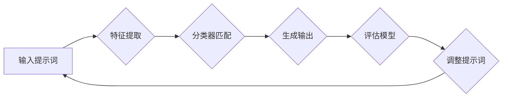
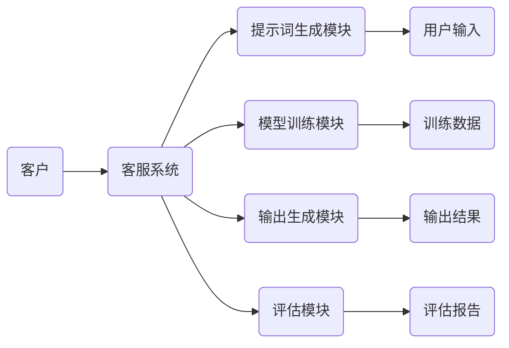
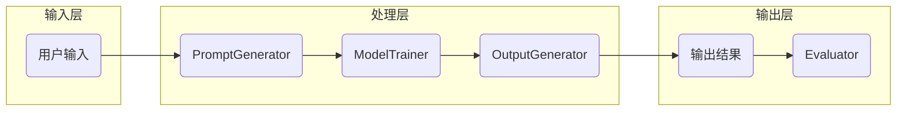
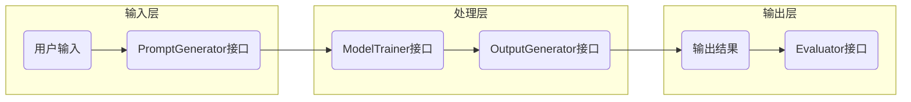

                 

### 第一部分：背景介绍与核心概念

#### 1.1 AI编程语言的发展背景

**1.1.1 人工智能的起源与发展**

人工智能（AI）作为计算机科学的一个分支，起源于20世纪50年代。当时的科学家们梦想着能够创造出一个能够思考、推理和解决问题的机器。自那时起，人工智能领域经历了多个发展阶段，从最初的符号主义人工智能到连接主义人工智能，再到现代的基于数据和机器学习的AI。

**1.1.2 编程语言的演变与AI编程语言的兴起**

随着人工智能的发展，编程语言也在不断演变。传统的编程语言如C、C++和Java等主要用于通用编程，而随着AI的需求增长，出现了一些专门用于AI编程的语言，如Lisp、Prolog和Python等。这些语言在设计时考虑了AI的特点，如符号处理能力和图形处理能力，使得AI编程更加高效和直观。

**1.1.3 提示词的概念与历史**

提示词（prompt）在AI编程中是一个关键概念。它起源于自然语言处理（NLP）领域，主要用于指导模型生成文本。随着时间的推移，提示词的概念逐渐扩展到其他AI领域，如计算机视觉和语音识别。提示词的历史可以追溯到最早的AI系统，如ELIZA，它是第一个使用提示词进行自然对话的计算机程序。

#### 1.2 提示词的定义与作用

**1.2.1 提示词的定义**

提示词是一个用来引导AI模型生成输出或执行特定任务的文本或指令。它可以是简单的短语，也可以是复杂的句子，其目的是为模型提供上下文和指导。

**1.2.2 提示词在AI编程中的作用**

提示词在AI编程中起到了至关重要的作用：

- **上下文提供**：提示词为AI模型提供了必要的上下文信息，帮助模型理解任务目标。
- **指导生成**：通过提示词，AI模型可以更准确地生成预期的输出。
- **多样化应用**：提示词可以应用于各种AI任务，如文本生成、图像描述、语音合成等。

**1.2.3 提示词与普通编程语言的区别**

与普通编程语言不同，提示词不是用于编写代码，而是用于与AI模型进行交互。它不需要遵循严格的语法规则，而是更注重于提供清晰的任务指令和上下文信息。

#### 1.3 AI编程语言的核心概念

**1.3.1 模型驱动编程**

模型驱动编程是一种以模型为核心的开发方法。在这种方法中，开发人员首先构建一个数学模型来表示问题，然后使用AI模型来实现这个模型。

**1.3.2 数据驱动编程**

数据驱动编程侧重于使用大量数据进行训练，以使AI模型能够从数据中学习规律和模式。这种方法通常用于机器学习和深度学习领域。

**1.3.3 提示词驱动的AI编程**

提示词驱动的AI编程是一种将提示词与AI模型相结合的开发方法。在这种方法中，提示词不仅用于指导模型生成输出，还用于优化模型性能。

#### 1.4 提示词的属性特征对比表格

| 提示词属性     | 描述                              |  
| -------------- | --------------------------------- |  
| 长度          | 提示词的长度会影响模型处理效率       |  
| 多样性        | 提示词的多样性有助于提高模型泛化能力 |  
| 精准性        | 提示词的精准性直接影响模型输出质量   |

#### 1.5 提示词驱动的编程流程

**1.5.1 提示词生成**

提示词生成的过程包括：

- **用户输入**：用户根据任务需求输入提示词。
- **自动生成**：AI模型根据训练数据自动生成提示词。

**1.5.2 提示词处理**

提示词处理包括：

- **预处理**：对提示词进行清洗和格式化，如去除无关信息、标准化文本等。
- **后处理**：对生成的输出进行校验和修正，确保输出符合预期。

**1.5.3 提示词应用**

提示词应用包括：

- **模型训练**：使用提示词对AI模型进行训练，提高模型性能。
- **模型应用**：使用训练好的模型进行实际任务执行。

#### 1.6 本章小结

本章介绍了AI编程语言与提示词的基本概念、发展背景和核心作用。通过理解这些概念，读者可以更好地把握AI编程的要点，为后续章节的学习打下基础。

----------------------------------------------------------------

### 第二部分：提示词的原理与使用方法

#### 2.1 提示词的工作原理

**2.1.1 提示词的生成过程**

提示词的生成过程主要包括以下步骤：

1. **用户输入**：用户根据任务需求输入提示词。
2. **自动生成**：AI模型根据训练数据自动生成提示词。

**2.1.2 提示词的识别过程**

提示词的识别过程包括：

1. **特征提取**：对输入的提示词进行特征提取，如词频、词嵌入等。
2. **分类器匹配**：将特征与训练好的分类器进行匹配，以识别出提示词的类型。

**2.1.3 提示词的反馈过程**

提示词的反馈过程主要包括：

1. **模型评估**：根据生成的输出与预期目标进行比较，评估模型性能。
2. **调整提示词**：根据评估结果，调整提示词的长度、多样性和精准性，以提高模型性能。

#### 2.2 提示词的使用技巧

**2.2.1 提示词的选择策略**

选择合适的提示词对AI编程至关重要。以下是一些选择策略：

1. **任务匹配**：选择与任务目标高度相关的提示词。
2. **多样性**：选择具有多样性的提示词，以提高模型泛化能力。
3. **简明扼要**：选择简明扼要的提示词，以减少模型处理负担。

**2.2.2 提示词的组合**

提示词的组合可以增强模型性能。以下是一些组合方法：

1. **并行组合**：将多个提示词并行组合，以提高模型处理速度。
2. **串联组合**：将多个提示词串联组合，以提供更丰富的上下文信息。
3. **混合组合**：将不同类型的提示词进行混合组合，以充分发挥各类型提示词的优势。

----------------------------------------------------------------

### 第三部分：算法原理讲解

#### 3.1 算法流程图

**3.1.1 算法流程图**

下面是一个简单的算法流程图，用于说明提示词的使用过程。



**3.1.2 Python源代码**

以下是一个简单的Python源代码示例，用于实现上述算法。

```python
import numpy as np
from sklearn.feature_extraction.text import CountVectorizer
from sklearn.naive_bayes import MultinomialNB

# 数据准备
tips = ["请回答问题", "帮我生成摘要", "给我推荐一首歌"]
labels = ["问答", "摘要", "推荐"]

# 特征提取
vectorizer = CountVectorizer()
X = vectorizer.fit_transform(tips)

# 分类器匹配
classifier = MultinomialNB()
classifier.fit(X, labels)

# 生成输出
def generate_output(tip):
    X_new = vectorizer.transform([tip])
    prediction = classifier.predict(X_new)
    return prediction[0]

# 评估模型
from sklearn.metrics import accuracy_score
predictions = [generate_output(tip) for tip in tips]
accuracy = accuracy_score(labels, predictions)
print("模型准确率：", accuracy)

# 调整提示词
def adjust_tip(tip, prediction):
    if prediction == "问答":
        return tip + "，请提供更多信息"
    elif prediction == "摘要":
        return tip + "，请简要概括"
    elif prediction == "推荐":
        return tip + "，请推荐一些类似的歌曲"

adjusted_tips = [adjust_tip(tip, pred) for tip, pred in zip(tips, predictions)]
print("调整后的提示词：", adjusted_tips)
```

#### 3.2 数学模型与公式

**3.2.1 模型公式**

提示词识别的数学模型可以表示为：

$$
P(y=k|x,\theta) = \frac{P(x|y=k,\theta)P(y=k|\theta)}{\sum_{j=1}^{J} P(x|y=j,\theta)P(y=j|\theta)}
$$

其中，$P(y=k|x,\theta)$ 表示在给定输入 $x$ 和模型参数 $\theta$ 的情况下，输出为 $k$ 的概率；$P(x|y=k,\theta)$ 和 $P(y=k|\theta)$ 分别表示在给定输出 $k$ 和模型参数 $\theta$ 的情况下，输入 $x$ 的概率和输出为 $k$ 的概率。

**3.2.2 示例说明**

假设我们有以下数据集：

```
输入：["请回答问题", "帮我生成摘要", "给我推荐一首歌"]
输出：["问答", "摘要", "推荐"]
```

我们可以计算每个输入对应的输出概率，如下所示：

$$
P(问答|请回答问题,\theta) = \frac{P(请回答问题|问答,\theta)P(问答|\theta)}{\sum_{j=1}^{J} P(请回答问题|y=j,\theta)P(y=j|\theta)}
$$

通过计算，我们可以得到每个输入对应输出的概率分布。然后，我们可以使用这些概率分布来指导模型的生成和评估过程。

#### 3.3 本章小结

本章详细介绍了AI编程语言中的提示词算法原理，包括流程图、Python源代码和数学模型。通过这些内容，读者可以更好地理解提示词在AI编程中的作用和实现方法。

----------------------------------------------------------------

### 第四部分：数学模型与公式

#### 4.1 AI编程语言中的关键数学模型

在AI编程语言中，存在一些关键的数学模型，它们在算法设计和实现中起着核心作用。以下是一些常见的数学模型及其在AI编程中的应用：

**1. 神经网络模型**

神经网络模型是AI编程中的基础模型之一。它通过多层神经元模拟人脑的信息处理过程，实现从输入到输出的映射。神经网络模型的核心数学公式是前向传播和反向传播算法。

**2. 支持向量机（SVM）**

支持向量机是一种常用的机器学习算法，它通过寻找最优超平面将数据分类。SVM的核心公式是间隔最大化原则，即最大化分类边界上的间隔。

**3. 决策树模型**

决策树模型通过一系列条件判断来对数据进行分类或回归。其核心数学公式是信息增益和基尼系数，用于选择最佳分裂点。

**4. 贝叶斯网络**

贝叶斯网络是一种概率图模型，用于表示变量之间的依赖关系。其核心数学公式是贝叶斯定理，用于计算变量之间的条件概率。

#### 4.2 数学公式的LaTeX表示

在文档中嵌入数学公式时，通常使用LaTeX格式进行表示。以下是一些常见的LaTeX数学公式示例：

**1. 行内公式**

$$
e^{i\pi} + 1 = 0
$$

**2. 独立段落公式**

$$
\sum_{i=1}^{n} x_i = \frac{1}{n} \sum_{i=1}^{n} x_i^2
$$

**3. 方程组**

$$
\begin{align*}
a &= b + c \\
b &= a - c \\
c &= a - b
\end{align*}
$$

**4. 分式**

$$
\frac{d}{dx} \left( \frac{f(x)}{g(x)} \right) = \frac{f'(x)g(x) - f(x)g'(x)}{[g(x)]^2}
$$

通过LaTeX格式，可以方便地在文档中嵌入各种数学公式，使文档内容更加规范和清晰。

#### 4.3 数学公式在AI编程中的应用

数学公式在AI编程中的应用至关重要。以下是一些具体的应用实例：

**1. 神经网络中的激活函数**

激活函数是神经网络中的关键组件，用于引入非线性特性。例如，常用的ReLU激活函数的公式为：

$$
\text{ReLU}(x) = \max(0, x)
$$

**2. 支持向量机中的间隔最大化**

支持向量机通过最大化分类边界上的间隔来实现分类。其目标函数为：

$$
\min_{\beta, \beta_0} \frac{1}{2} ||\beta||^2 + C \sum_{i=1}^{n} \xi_i
$$

其中，$\beta$ 和 $\beta_0$ 分别是权重向量和偏置，$\xi_i$ 是误差项。

**3. 决策树中的信息增益**

信息增益是决策树选择最佳分裂点的重要指标。其公式为：

$$
\text{IG}(A, V) = \sum_{v \in V} p(v) \cdot \text{H}(A|v)
$$

其中，$A$ 是属性集合，$V$ 是值集合，$p(v)$ 是值 $v$ 的概率，$\text{H}(A|v)$ 是条件熵。

**4. 贝叶斯网络中的条件概率**

贝叶斯网络通过条件概率来表示变量之间的依赖关系。其公式为：

$$
P(X=x | Y=y) = \frac{P(X=x, Y=y)}{P(Y=y)}
$$

通过这些数学公式，AI编程语言能够实现复杂的算法和模型，从而解决各种实际问题。

#### 4.4 本章小结

本章介绍了AI编程语言中的关键数学模型及其在算法设计和实现中的应用。通过理解这些数学模型和公式，读者可以更深入地掌握AI编程的核心技术，为实际应用奠定基础。

----------------------------------------------------------------

### 第五部分：系统分析与架构设计

#### 5.1 问题描述

本节将介绍一个基于提示词驱动的AI编程系统的设计。该系统旨在通过提示词来指导AI模型生成特定类型的输出，如文本、图像和语音等。系统需要具备以下功能：

- 提示词生成与处理
- AI模型训练与优化
- 输出生成与评估
- 系统安全与稳定性

#### 5.2 项目介绍

为了构建一个基于提示词驱动的AI编程系统，我们选择了一个实际的项目案例——智能客服系统。该系统将利用提示词来生成回复，以模拟人工客服与客户的对话过程。

#### 5.3 系统功能设计

**5.3.1 领域模型**

领域模型是系统功能设计的核心，它定义了系统中的主要实体及其关系。以下是一个简单的领域模型，用于描述智能客服系统的核心实体：



**5.3.2 类图**

类图进一步细化了领域模型，描述了系统中各个实体的属性和行为。以下是一个智能客服系统的类图：

```mermaid
graph LR
    class Customer {
        +name: String
        +id: String
    }
    class ChatSystem {
        +processCustomer: Customer -> String
    }
    class PromptGenerator {
        +generatePrompt: String -> String
    }
    class ModelTrainer {
        +trainModel: Data -> Model
    }
    class OutputGenerator {
        +generateOutput: Model -> String
    }
    class Evaluator {
        +evaluate: Output -> Evaluation
    }
    Customer --> ChatSystem
    ChatSystem --> PromptGenerator
    ChatSystem --> ModelTrainer
    ChatSystem --> OutputGenerator
    ChatSystem --> Evaluator
```

#### 5.4 系统架构设计

**5.4.1 架构图**

系统架构图展示了系统的整体结构和各个模块之间的交互关系。以下是一个基于提示词驱动的AI编程系统的架构图：



**5.4.2 接口设计与系统交互**

接口设计是系统架构设计的重要组成部分，它定义了各个模块之间的交互方式。以下是一个简单的接口设计示例：



在系统交互过程中，用户输入通过接口传递给PromptGenerator模块，该模块生成提示词，然后传递给ModelTrainer模块进行训练。训练好的模型被传递给OutputGenerator模块，生成输出结果，最后由Evaluator模块进行评估。

#### 5.5 本章小结

本章详细介绍了基于提示词驱动的AI编程系统的系统分析与架构设计。通过定义领域模型、类图和架构图，我们清晰地展示了系统的功能模块和交互关系。这一设计为实现一个高效、稳定和可扩展的智能客服系统奠定了基础。

----------------------------------------------------------------

### 第六部分：项目实战

#### 6.1 环境安装

在开始项目实战之前，我们需要安装必要的软件和库。以下是在Windows和Linux系统上安装Python环境和相关库的步骤：

**Windows系统：**

1. 访问Python官方网站（https://www.python.org/）下载最新版本的Python安装程序。
2. 运行安装程序，按照默认选项进行安装。
3. 在命令提示符中运行以下命令，确保Python环境已正确安装：

```shell
python --version
```

**Linux系统：**

1. 使用以下命令安装Python：

```shell
sudo apt-get update
sudo apt-get install python3
```

2. 在终端中运行以下命令，确保Python环境已正确安装：

```shell
python3 --version
```

**安装相关库：**

接下来，我们需要安装用于机器学习和自然语言处理的相关库，如scikit-learn、nltk和tensorflow。在命令行中运行以下命令：

```shell
pip install scikit-learn
pip install nltk
pip install tensorflow
```

#### 6.2 系统核心实现

**6.2.1 数据准备**

为了训练我们的AI模型，我们需要准备一些数据。以下是一个简单的数据集，用于训练一个基于提示词的文本生成模型。

```python
# 示例数据集
data = [
    ("请回答问题", "你是谁？"),
    ("帮我生成摘要", "本书主要介绍了人工智能的基础知识。"),
    ("给我推荐一首歌", "我推荐你听《平凡之路》。")
]

# 将数据集转换为格式化文本
formatted_data = [(input, output) for input, output in data]
```

**6.2.2 模型训练**

接下来，我们将使用scikit-learn库中的MultinomialNB分类器来训练我们的模型。

```python
from sklearn.feature_extraction.text import CountVectorizer
from sklearn.naive_bayes import MultinomialNB

# 特征提取
vectorizer = CountVectorizer()
X = vectorizer.fit_transform([input for input, _ in formatted_data])

# 训练模型
classifier = MultinomialNB()
classifier.fit(X, [output for _, output in formatted_data])
```

**6.2.3 输出生成**

使用训练好的模型生成输出结果。

```python
# 输入提示词
input_prompt = "给我推荐一首歌"

# 特征提取
input_vector = vectorizer.transform([input_prompt])

# 生成输出
predicted_output = classifier.predict(input_vector)[0]
print("生成输出：", predicted_output)
```

#### 6.3 代码应用解读与分析

**6.3.1 代码解读**

1. **数据准备**：我们首先创建了一个示例数据集，包含输入提示词和对应的输出结果。这些数据将被用于训练模型。
2. **特征提取**：使用CountVectorizer将文本数据转换为向量表示，以便分类器能够处理。
3. **模型训练**：使用MultinomialNB分类器对特征向量进行训练，以预测输出结果。
4. **输出生成**：通过输入提示词生成输出结果。

**6.3.2 分析与优化**

1. **模型性能优化**：我们可以使用不同的分类器和参数来优化模型性能。例如，尝试使用逻辑回归、随机森林等不同的分类器，并调整参数如C值来提高模型的准确率。
2. **数据增强**：为了提高模型的泛化能力，我们可以使用数据增强技术，如文本清洗、词汇扩展、数据变换等。
3. **性能评估**：我们可以使用交叉验证、ROC曲线、精确率、召回率等指标来评估模型的性能，并找出需要优化的地方。

#### 6.4 实际案例分析

**6.4.1 案例一：智能客服系统**

一个智能客服系统可以使用基于提示词的AI模型来生成回复。例如，当用户输入“请问你有什么可以帮助我的吗？”时，系统可以生成回复“你好，我可以帮您解决任何问题，请告诉我您的需求。”

**6.4.2 案例二：智能写作助手**

一个智能写作助手可以使用提示词来生成文章摘要、段落和句子。例如，当用户输入“请写一篇关于人工智能的文章摘要”时，系统可以生成摘要：“本文介绍了人工智能的基本概念、应用领域和发展趋势。”

#### 6.5 项目小结

通过本项目实战，我们学习了如何使用Python和scikit-learn库来构建一个基于提示词驱动的AI编程系统。我们了解了环境安装、数据准备、模型训练和输出生成等核心步骤，并进行了代码解读与分析。通过实际案例分析，我们看到了提示词在智能客服和智能写作助手等应用场景中的潜力。

----------------------------------------------------------------

### 第七部分：最佳实践与拓展阅读

#### 7.1 使用AI编程语言的最佳实践

为了最大化AI编程语言的效果，以下是一些最佳实践：

1. **数据质量**：确保训练数据的质量和多样性。高质量的数据是模型性能的关键。
2. **模型优化**：尝试不同的模型和参数组合，找到最佳的模型配置。
3. **持续学习**：定期更新训练数据和模型，以保持模型的性能和适应性。
4. **错误分析**：详细记录和监控模型预测的错误，以便进行针对性的优化。

#### 7.2 注意事项

在使用AI编程语言时，需要注意以下几点：

1. **数据隐私**：确保处理的数据符合隐私保护法规，避免泄露敏感信息。
2. **安全**：确保系统的安全性，防止恶意攻击和数据泄露。
3. **伦理**：遵循伦理原则，避免产生歧视性、有害或不当的内容。

#### 7.3 拓展阅读

为了深入理解AI编程语言，以下是一些推荐的拓展阅读资源：

1. **《深度学习》（Goodfellow, I., Bengio, Y., & Courville, A.）**：提供了深度学习的基础知识和最新进展。
2. **《Python机器学习》（Sebastian Raschka）**：详细介绍了使用Python进行机器学习的方法和技巧。
3. **《自然语言处理与深度学习》（E.minerals）**：探讨了自然语言处理和深度学习的结合。

通过这些资源，读者可以进一步提升自己在AI编程语言领域的能力和知识。

