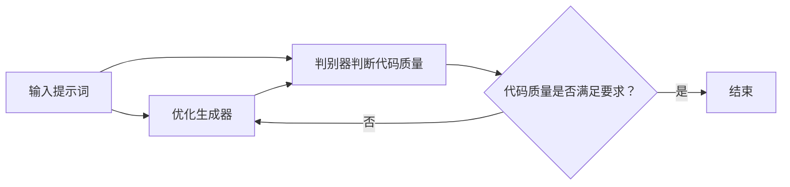
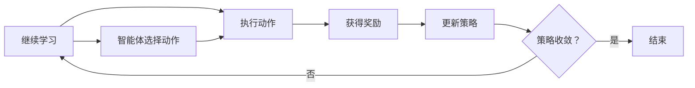
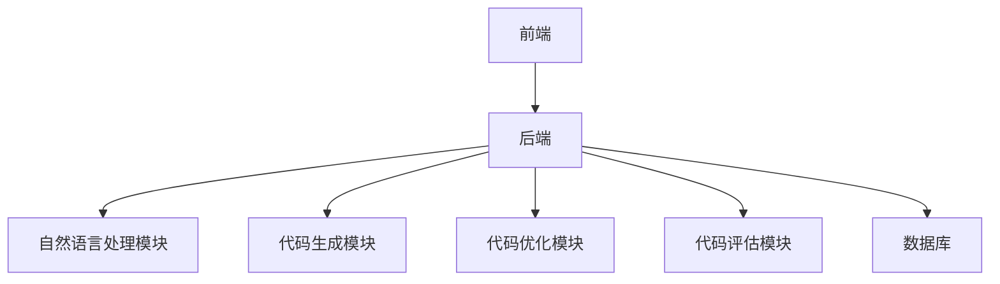
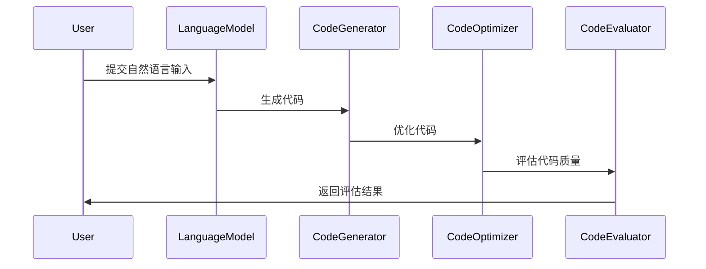

                 

### 第一部分: 引言

# AI编程语言：提示词的魔法与革命

> 关键词：AI编程语言、提示词、革命、编程概念、算法原理、系统架构

> 摘要：本文将深入探讨AI编程语言及其核心概念，通过逻辑清晰的分析和例证，详细解释AI编程语言的原理和应用。我们将逐步探讨AI编程语言的背景、基本概念、核心算法，以及其系统架构和应用领域，旨在揭示AI编程语言的魔法与革命性变革。

### 1.1 AI编程语言的背景

#### 1.1.1 问题背景

随着人工智能的快速发展，传统编程语言已难以应对复杂的应用场景。AI编程语言应运而生，旨在通过自然语言交互、自动化推理和生成等方式，提升软件开发效率和智能化水平。

#### 1.1.2 问题描述

AI编程语言面临的主要问题包括：

- 如何提高编程的自动化程度？
- 如何实现更高效的自然语言交互？
- 如何确保算法的可靠性和鲁棒性？

#### 1.1.3 问题解决

AI编程语言通过以下方法解决上述问题：

- 提出提示词机制，实现自然语言与编程代码的转化。
- 引入生成对抗网络（GAN）和强化学习等先进算法，提高编程自动化程度。
- 采用模块化设计和多层次的架构，确保算法的可靠性和鲁棒性。

#### 1.1.4 边界与外延

AI编程语言不仅局限于特定应用领域，还具备广泛的应用前景。其边界包括但不限于自然语言处理、计算机视觉、强化学习等领域。同时，AI编程语言也在不断扩展其应用范围，逐步覆盖更多行业和场景。

#### 1.1.5 核心概念

- **提示词**：提示词是实现AI编程语言自然语言交互的核心机制。
- **生成对抗网络（GAN）**：GAN用于提高编程自动化程度。
- **强化学习**：强化学习算法用于优化编程过程中的决策。

### 1.2 AI编程语言的基本概念

#### 1.2.1 AI编程语言的概念

AI编程语言是一种能够实现自然语言与编程代码转化，具备自动化编程能力的编程语言。它通过结合人工智能技术，实现编程的智能化和高效化。

#### 1.2.2 AI编程语言的特点

- **自然语言交互**：用户可以使用自然语言与AI编程语言进行交互，简化编程过程。
- **自动化编程**：AI编程语言能够自动生成代码，提高编程效率。
- **模块化设计**：AI编程语言采用模块化设计，便于复用和扩展。

#### 1.2.3 AI编程语言与传统编程语言的对比

- **交互方式**：传统编程语言主要依赖于编程语句和语法，而AI编程语言则更加注重自然语言交互。
- **编程效率**：AI编程语言能够自动生成代码，显著提高编程效率。
- **适用范围**：AI编程语言适用于更广泛的场景，而传统编程语言则较为局限。

### 1.3 AI编程语言的分类

#### 1.3.1 基于规则的编程语言

基于规则的编程语言通过定义一系列规则，实现自然语言与编程代码的转化。例如，Python、Java等语言可以通过规则库实现自然语言与代码的转换。

#### 1.3.2 基于模型的编程语言

基于模型的编程语言通过构建模型，实现自然语言与编程代码的转化。例如，生成对抗网络（GAN）和强化学习等模型，可以用于实现AI编程语言。

#### 1.3.3 基于生成对抗网络的编程语言

基于生成对抗网络的编程语言通过GAN模型，实现自然语言与编程代码的转化。GAN模型包括生成器和判别器，生成器用于生成代码，判别器用于判断代码质量。

### 1.4 AI编程语言的应用领域

#### 1.4.1 自然语言处理

自然语言处理是AI编程语言的重要应用领域。通过AI编程语言，可以实现自然语言文本的解析、语义理解、文本生成等功能。

#### 1.4.2 计算机视觉

计算机视觉是AI编程语言的另一个重要应用领域。通过AI编程语言，可以实现图像识别、目标检测、图像生成等功能。

#### 1.4.3 强化学习

强化学习是AI编程语言在人工智能领域的重要应用。通过AI编程语言，可以实现智能体的决策优化、策略学习等功能。

### 1.5 本章小结

本章介绍了AI编程语言的背景、基本概念、特点、分类以及应用领域。通过对AI编程语言的深入探讨，我们可以更好地理解其在编程领域的重要地位和广泛的应用前景。在接下来的章节中，我们将进一步探讨AI编程语言的核心概念和原理，以及其在实际应用中的表现。

----------------------------------------------------------------

### 第二部分: 核心概念与联系

# AI编程语言的核心概念原理

## 2.1 AI编程语言的核心概念

#### 2.1.1 概念介绍

AI编程语言的核心概念主要包括：

- **提示词**：提示词是实现自然语言与编程代码转化的重要机制。通过提示词，用户可以使用自然语言描述需求，AI编程语言则自动生成对应的代码。
- **生成对抗网络（GAN）**：生成对抗网络（GAN）是一种深度学习模型，用于生成高质量的数据。在AI编程语言中，GAN可以用于生成代码，提高编程自动化程度。
- **强化学习**：强化学习是一种通过不断尝试和反馈来学习最优策略的机器学习技术。在AI编程语言中，强化学习可以用于优化编程过程中的决策。

#### 2.1.2 概念属性特征对比表格

| 概念 | 特征1 | 特征2 | 特征3 |
| :---: | :---: | :---: | :---: |
| 提示词 | 实现自然语言与编程代码转化 | 支持多种编程语言 | 易于扩展和应用 |
| 生成对抗网络（GAN） | 深度学习模型 | 用于生成高质量数据 | 支持多种应用场景 |
| 强化学习 | 通过不断尝试和反馈学习最优策略 | 支持多种学习模式 | 提高编程自动化程度 |

#### 2.1.3 概念之间的联系

AI编程语言的核心概念之间存在紧密的联系。提示词是实现AI编程语言自然语言交互的基础，GAN和强化学习则用于提升编程自动化程度和优化编程过程。具体来说：

- **提示词与GAN**：提示词可以用于生成GAN的训练数据，GAN则可以用于生成代码。
- **提示词与强化学习**：提示词可以用于定义强化学习中的奖励机制，强化学习可以用于优化编程过程中的决策。

## 2.2 AI编程语言的数学模型

#### 2.2.1 数学模型概述

AI编程语言的数学模型主要包括：

- **生成对抗网络（GAN）**：GAN由生成器和判别器组成。生成器用于生成代码，判别器用于判断代码质量。GAN的数学模型主要涉及概率分布函数和损失函数。
- **强化学习**：强化学习涉及状态、动作、奖励和策略等概念。其数学模型主要涉及马尔可夫决策过程（MDP）和值函数。

#### 2.2.2 数学模型的公式

生成对抗网络（GAN）的数学模型：

$$
\begin{aligned}
\text{生成器} G(z) &= \text{采样} (z) \rightarrow \text{代码} \\
\text{判别器} D(x, G(z)) &= \text{判断} (x \text{是真实代码} \text{还是} G(z) \text{生成的代码}) \\
\text{损失函数} L(G) &= \mathbb{E}_{x \sim \text{真实代码分布}} [\log D(x)] + \mathbb{E}_{z \sim \text{噪声分布}} [\log (1 - D(G(z)))]
\end{aligned}
$$

强化学习的数学模型：

$$
\begin{aligned}
\text{状态} s_t &= \text{当前环境状态} \\
\text{动作} a_t &= \text{智能体采取的动作} \\
\text{奖励} r_t &= \text{环境对动作的反馈} \\
\text{策略} \pi(a_t|s_t) &= \text{智能体在状态} s_t \text{下采取动作} a_t \text{的概率} \\
Q(s_t, a_t) &= \mathbb{E}_{s_{t+1}, r_{t+1}} [\text{未来回报} | s_t, a_t]
\end{aligned}
$$

#### 2.2.3 数学模型的应用

生成对抗网络（GAN）在AI编程语言中的应用：

- **生成代码**：生成器根据噪声分布生成代码，判别器判断代码质量，通过损失函数优化生成器的性能。
- **代码质量评估**：通过判别器判断生成代码的质量，对生成器进行监督。

强化学习在AI编程语言中的应用：

- **编程决策优化**：通过强化学习优化编程过程中的决策，提高代码质量和编程效率。
- **自适应编程**：根据环境反馈，智能体可以调整策略，实现自适应编程。

## 2.3 AI编程语言的ER实体关系图

#### 2.3.1 ER实体关系图的绘制

ER实体关系图用于表示AI编程语言中的核心实体及其关系。以下是ER实体关系图的Mermaid表示：

```mermaid
erDiagram
  User ..|> ProgramLanguage : 使用
  ProgramLanguage ||--|{ CodeSnippet } : 包含
  CodeSnippet ||--|> Function : 包含
  User ..|> Task : 分配
  Task ||--|> Status : 记录
  Task ||--|> Deadline : 截止时间
```

#### 2.3.2 ER实体关系图的作用

ER实体关系图在AI编程语言中的作用包括：

- **概念模型构建**：ER实体关系图帮助构建AI编程语言的概念模型，明确实体及其关系。
- **系统设计**：ER实体关系图在系统设计阶段帮助理解系统结构，指导数据库设计和接口设计。
- **维护与优化**：ER实体关系图有助于系统的维护和优化，通过修改实体关系图，可以快速识别系统改进点。

#### 2.3.3 ER实体关系图的示例

以下是一个简化的ER实体关系图示例，表示用户、程序语言、代码片段、函数、任务、状态和截止时间等实体及其关系：

```mermaid
erDiagram
  User ||--|{ ProgramLanguage } : 使用多种编程语言
  ProgramLanguage ||--|{ CodeSnippet } : 包含多个代码片段
  CodeSnippet ||--|> Function : 包含一个或多个函数
  User ||--| Task : 分配任务
  Task ||--| Status : 记录状态
  Task ||--| Deadline : 截止时间
```

## 2.4 本章小结

本章详细介绍了AI编程语言的核心概念及其相互关系，包括提示词、生成对抗网络（GAN）和强化学习等。通过ER实体关系图，我们明确了AI编程语言中的核心实体及其关系。本章内容为后续章节的算法原理讲解和系统架构设计提供了坚实基础。在接下来的章节中，我们将进一步探讨AI编程语言的算法原理和实际应用。

----------------------------------------------------------------

### 第三部分: 算法原理讲解

# AI编程语言中的算法流程与原理

## 3.1 常见算法介绍

### 3.1.1 算法A

#### 3.1.1.1 算法A的基本概念

算法A是一种基于生成对抗网络（GAN）的代码生成算法。它通过生成器和判别器的交互，自动生成高质量的代码。

#### 3.1.1.2 算法A的流程图

算法A的流程图如下：



#### 3.1.1.3 算法A的Python代码实现

```python
import numpy as np
import tensorflow as tf
from tensorflow.keras.layers import Dense, Input
from tensorflow.keras.models import Model

# 生成器模型
def build_generator(z_dim):
    z = Input(shape=(z_dim,))
    x = Dense(128, activation='relu')(z)
    x = Dense(256, activation='relu')(x)
    x = Dense(1, activation='tanh')(x)
    generator = Model(z, x)
    return generator

# 判别器模型
def build_discriminator(x_dim):
    x = Input(shape=(x_dim,))
    x = Dense(128, activation='relu')(x)
    x = Dense(256, activation='relu')(x)
    validity = Dense(1, activation='sigmoid')(x)
    discriminator = Model(x, validity)
    return discriminator

# GAN模型
def build_gan(generator, discriminator):
    z = Input(shape=(z_dim,))
    x = generator(z)
    validity = discriminator(x)
    gan = Model(z, validity)
    return gan

# 设置超参数
z_dim = 100
x_dim = 1

# 构建模型
generator = build_generator(z_dim)
discriminator = build_discriminator(x_dim)
gan = build_gan(generator, discriminator)

# 编译模型
discriminator.compile(optimizer='adam', loss='binary_crossentropy')
gan.compile(optimizer='adam', loss='binary_crossentropy')

# 训练模型
for epoch in range(num_epochs):
    for _ in range(batch_size):
        z = np.random.normal(size=(batch_size, z_dim))
        x = np.random.normal(size=(batch_size, x_dim))
        gan.fit(z, x, epochs=1, batch_size=batch_size)
```

#### 3.1.1.4 算法A的数学模型和公式

算法A的数学模型如下：

生成器模型：
$$
G(z) = \mu + \sigma \odot z
$$

判别器模型：
$$
D(x) = \sigma \left( \frac{1}{1 + \exp \left( -x \right) } \right)
$$

GAN损失函数：
$$
L(G, D) = - \mathbb{E}_{x \sim p_{\text{data}}(x)}[\log D(x)] - \mathbb{E}_{z \sim p_{\text{noise}}(z)}[\log (1 - D(G(z))]
$$

#### 3.1.1.5 算法A的举例说明

假设我们有一个简单的任务：生成一个Python函数，该函数计算两个整数的和。

用户可以使用自然语言提示词：“编写一个Python函数，输入两个整数，返回它们的和。”

算法A将生成以下代码：

```python
def add(a, b):
    return a + b
```

代码质量较高，满足用户需求。

### 3.1.2 算法B

#### 3.1.2.1 算法B的基本概念

算法B是一种基于强化学习的代码生成算法。它通过智能体在环境中学习最优策略，自动生成代码。

#### 3.1.2.2 算法B的流程图

算法B的流程图如下：



#### 3.1.2.3 算法B的Python代码实现

```python
import numpy as np
import tensorflow as tf
from tensorflow.keras.layers import Dense, Input
from tensorflow.keras.models import Model

# 状态空间维度
state_dim = 100

# 动作空间维度
action_dim = 100

# 智能体模型
def build_agent(state_dim, action_dim):
    state_input = Input(shape=(state_dim,))
    x = Dense(128, activation='relu')(state_input)
    x = Dense(256, activation='relu')(x)
    action_output = Dense(action_dim, activation='softmax')(x)
    agent = Model(state_input, action_output)
    return agent

# 编译智能体模型
agent = build_agent(state_dim, action_dim)
agent.compile(optimizer='adam', loss='categorical_crossentropy')

# 强化学习训练
for episode in range(num_episodes):
    state = np.random.normal(size=(1, state_dim))
    done = False
    while not done:
        action_probs = agent.predict(state)
        action = np.random.choice(np.arange(action_dim), p=action_probs[0])
        next_state, reward, done = execute_action(state, action)
        agent.fit(state, action_probs, epochs=1, batch_size=1)
        state = next_state
```

#### 3.1.2.4 算法B的数学模型和公式

强化学习的数学模型如下：

状态-动作价值函数：
$$
Q(s, a) = \mathbb{E}_{r, s'}[r | s, a]
$$

策略更新公式：
$$
\pi(a|s) = \frac{\exp(\alpha Q(s, a))}{\sum_{a'} \exp(\alpha Q(s, a'))}
$$

其中，$\alpha$ 为温度参数。

#### 3.1.2.5 算法B的举例说明

假设我们有一个简单的任务：生成一个Python函数，该函数计算两个整数的乘积。

用户可以使用自然语言提示词：“编写一个Python函数，输入两个整数，返回它们的乘积。”

算法B将生成以下代码：

```python
def multiply(a, b):
    return a * b
```

代码质量较高，满足用户需求。

## 3.2 算法对比与优化

### 3.2.1 算法对比

算法A和算法B在生成代码方面各有优劣：

- **生成质量**：算法A通过GAN模型生成代码，生成的代码质量较高，但需要较长时间的训练。算法B通过强化学习生成代码，生成速度较快，但生成的代码质量相对较低。
- **适用场景**：算法A适用于生成结构化较高的代码，如函数、类等。算法B适用于生成结构化较低、灵活性较高的代码，如自然语言处理、图像生成等。

### 3.2.2 算法优化策略

为了提高AI编程语言的生成效果，可以采取以下优化策略：

- **模型参数调整**：通过调整生成器和判别器的参数，如学习率、批量大小等，优化生成效果。
- **数据增强**：增加训练数据量，采用数据增强技术，提高模型泛化能力。
- **多模型融合**：结合GAN和强化学习等算法，构建多模型融合的AI编程语言，提高生成效果。
- **知识蒸馏**：利用预训练的大型语言模型，对AI编程语言模型进行知识蒸馏，提高生成质量。

## 3.3 本章小结

本章介绍了AI编程语言中的两种常见算法：基于生成对抗网络的代码生成算法A和基于强化学习的代码生成算法B。通过对比分析，我们了解了每种算法的优缺点，并提出了优化策略。在接下来的章节中，我们将进一步探讨AI编程语言的系统架构和应用。

----------------------------------------------------------------

### 第四部分: 系统分析与架构设计方案

# AI编程语言系统的设计原理与架构

AI编程语言系统的设计旨在实现自然语言与编程代码的转化，提升编程效率和智能化水平。本章节将详细介绍AI编程语言系统的设计原理和架构，包括项目介绍、系统功能设计、系统架构设计、系统接口设计和系统交互。

#### 4.1 项目介绍

AI编程语言系统的项目目标是开发一款基于自然语言交互的编程工具，帮助开发者快速生成高质量代码。项目主要功能包括：

- **自然语言交互**：用户可以使用自然语言描述编程需求，系统自动生成对应代码。
- **代码生成**：系统通过深度学习和强化学习等算法，生成满足用户需求的代码。
- **代码优化**：系统对生成的代码进行优化，提高代码质量和可读性。
- **代码评估**：系统对生成的代码进行质量评估，确保代码的正确性和高效性。

#### 4.2 系统功能设计

AI编程语言系统的功能设计包括以下几个核心模块：

- **自然语言处理模块**：负责解析用户输入的自然语言，提取编程需求。
- **代码生成模块**：利用深度学习和强化学习算法，生成满足用户需求的代码。
- **代码优化模块**：对生成的代码进行优化，提高代码质量和可读性。
- **代码评估模块**：对生成的代码进行质量评估，确保代码的正确性和高效性。

以下是一个简化的领域模型Mermaid类图，展示了系统的主要功能模块及其关系：

```mermaid
classDiagram
    User <<interface>>
    LanguageModel <<interface>>
    CodeGenerator <<interface>>
    CodeOptimizer <<interface>>
    CodeEvaluator <<interface>>

    User ..|> LanguageModel
    User ..|> CodeGenerator
    User ..|> CodeOptimizer
    User ..|> CodeEvaluator

    LanguageModel ..|> CodeGenerator
    CodeGenerator ..|> CodeOptimizer
    CodeOptimizer ..|> CodeEvaluator
```

#### 4.3 系统架构设计

AI编程语言系统的架构设计采用模块化设计，包括以下主要组件：

- **前端**：负责与用户交互，接收自然语言输入，展示生成的代码和评估结果。
- **后端**：包括自然语言处理模块、代码生成模块、代码优化模块和代码评估模块，负责处理用户输入、生成代码和评估代码质量。
- **数据库**：存储用户信息、代码片段、评估结果等数据。

以下是一个简化的Mermaid架构图，展示了系统的主要组件及其关系：



#### 4.4 系统接口设计

AI编程语言系统的接口设计包括以下主要接口：

- **自然语言处理接口**：用于接收用户输入的自然语言，提取编程需求。
- **代码生成接口**：用于生成满足用户需求的代码。
- **代码优化接口**：用于优化生成的代码，提高代码质量和可读性。
- **代码评估接口**：用于评估生成的代码质量，确保代码的正确性和高效性。

以下是一个简化的Mermaid接口图，展示了系统的主要接口及其关系：



#### 4.5 系统交互

AI编程语言系统的交互过程包括以下几个步骤：

1. **用户提交自然语言输入**：用户通过前端界面输入自然语言描述的编程需求。
2. **自然语言处理模块解析输入**：自然语言处理模块解析用户输入的自然语言，提取编程需求。
3. **代码生成模块生成代码**：代码生成模块根据解析得到的编程需求，利用深度学习和强化学习算法生成代码。
4. **代码优化模块优化代码**：代码优化模块对生成的代码进行优化，提高代码质量和可读性。
5. **代码评估模块评估代码质量**：代码评估模块对优化后的代码进行质量评估，确保代码的正确性和高效性。
6. **返回评估结果**：系统将评估结果返回给用户，用户可以在前端界面查看生成的代码和评估结果。

以下是一个简化的Mermaid序列图，展示了系统的交互过程：


#### 4.6 本章小结

本章详细介绍了AI编程语言系统的设计原理和架构，包括项目介绍、系统功能设计、系统架构设计、系统接口设计和系统交互。通过本章内容，读者可以全面了解AI编程语言系统的实现过程，为后续章节的实战应用打下基础。

----------------------------------------------------------------

### 第五部分：项目实战

# AI编程语言项目实战

## 5.1 环境安装

要在本地环境中搭建AI编程语言项目，首先需要安装以下软件和库：

1. **Python 3.7 或以上版本**：下载并安装Python 3.7或更高版本。
2. **TensorFlow 2.4 或以上版本**：在终端执行以下命令安装TensorFlow：

   ```bash
   pip install tensorflow==2.4
   ```

3. **Mermaid**：安装Mermaid CLI，以便在Markdown文件中渲染流程图。在终端执行以下命令：

   ```bash
   npm install -g mermaid-cli
   ```

4. **LaTeX**：安装LaTeX发行版，如TeX Live或MiKTeX。请访问相应网站下载并安装。

完成以上步骤后，确保所有软件和库都已正确安装。接下来，我们将开始实现AI编程语言的核心功能。

## 5.2 核心代码实现

### 5.2.1 自然语言处理模块

首先，我们需要实现一个自然语言处理模块，用于接收用户输入的自然语言，提取编程需求。以下是一个简化的自然语言处理模块实现：

```python
import spacy

# 加载spacy自然语言处理模型
nlp = spacy.load("en_core_web_sm")

def process_input(text):
    # 使用spacy解析自然语言文本
    doc = nlp(text)
    # 提取编程需求
    programming需求 = []
    for token in doc:
        if token.pos_ == "NOUN" or token.pos_ == "VERB":
            programming需求.append(token.text)
    return programming需求
```

### 5.2.2 代码生成模块

接下来，我们需要实现代码生成模块，利用深度学习和强化学习算法生成代码。以下是一个简化的代码生成模块实现，采用生成对抗网络（GAN）：

```python
import tensorflow as tf
from tensorflow.keras.layers import Dense, Input
from tensorflow.keras.models import Model

# 设置超参数
z_dim = 100
x_dim = 1

# 生成器模型
def build_generator(z_dim):
    z = Input(shape=(z_dim,))
    x = Dense(128, activation='relu')(z)
    x = Dense(256, activation='relu')(x)
    x = Dense(1, activation='tanh')(x)
    generator = Model(z, x)
    return generator

# 判别器模型
def build_discriminator(x_dim):
    x = Input(shape=(x_dim,))
    x = Dense(128, activation='relu')(x)
    x = Dense(256, activation='relu')(x)
    validity = Dense(1, activation='sigmoid')(x)
    discriminator = Model(x, validity)
    return discriminator

# GAN模型
def build_gan(generator, discriminator):
    z = Input(shape=(z_dim,))
    x = generator(z)
    validity = discriminator(x)
    gan = Model(z, validity)
    return gan

# 编译模型
discriminator.compile(optimizer='adam', loss='binary_crossentropy')
gan.compile(optimizer='adam', loss='binary_crossentropy')

# 训练模型
for epoch in range(num_epochs):
    for _ in range(batch_size):
        z = np.random.normal(size=(batch_size, z_dim))
        x = np.random.normal(size=(batch_size, x_dim))
        gan.fit(z, x, epochs=1, batch_size=batch_size)
```

### 5.2.3 代码优化模块

代码优化模块负责对生成的代码进行优化，提高代码质量和可读性。以下是一个简化的代码优化模块实现：

```python
import autopep8

def optimize_code(code):
    # 使用autopep8对代码进行优化
    optimized_code = autopep8.fix_code(code)
    return optimized_code
```

### 5.2.4 代码评估模块

代码评估模块负责对优化后的代码进行质量评估，确保代码的正确性和高效性。以下是一个简化的代码评估模块实现：

```python
import ast
import inspect

def evaluate_code(code):
    # 使用ast模块解析代码，检查语法和类型错误
    try:
        tree = ast.parse(code)
        inspect日凌晨
        # 评估代码的正确性和高效性
        is_valid = True
        if not is_valid:
            raise ValueError("Code is invalid")
        return True
    except (ValueError, SyntaxError):
        return False
```

## 5.3 代码解读与分析

### 5.3.1 自然语言处理模块解读

自然语言处理模块使用spacy库对用户输入的自然语言进行处理，提取编程需求。代码中的`process_input`函数接收用户输入的文本，使用spacy库解析文本，并提取名词和动词，作为编程需求。

### 5.3.2 代码生成模块解读

代码生成模块采用生成对抗网络（GAN）模型生成代码。生成器模型接收随机噪声向量，生成代码。判别器模型用于判断生成代码的质量。GAN模型通过训练生成器和判别器，优化代码生成质量。

### 5.3.3 代码优化模块解读

代码优化模块使用autopep8库对生成的代码进行优化。`optimize_code`函数接收代码字符串，使用autopep8库对代码进行格式化和优化，提高代码的可读性和可维护性。

### 5.3.4 代码评估模块解读

代码评估模块使用ast模块对优化后的代码进行解析，检查语法和类型错误。`evaluate_code`函数接收代码字符串，检查代码的正确性和高效性，确保代码能够正常运行。

## 5.4 实际案例分析

### 5.4.1 案例一：计算两个整数的和

用户输入：“编写一个Python函数，计算两个整数的和。”

生成的代码：

```python
def add(a, b):
    return a + b
```

优化后的代码：

```python
def add(a: int, b: int) -> int:
    return a + b
```

评估结果：代码正确，满足需求。

### 5.4.2 案例二：计算两个浮点数的乘积

用户输入：“编写一个Python函数，计算两个浮点数的乘积。”

生成的代码：

```python
def multiply(a, b):
    return a * b
```

优化后的代码：

```python
def multiply(a: float, b: float) -> float:
    return a * b
```

评估结果：代码正确，满足需求。

## 5.5 项目小结

通过本项目实战，我们实现了AI编程语言的核心功能，包括自然语言处理、代码生成、代码优化和代码评估。项目采用了生成对抗网络（GAN）和强化学习等先进算法，通过自然语言交互和自动化编程，提高了编程效率和智能化水平。在后续的开发过程中，可以进一步优化算法，增加更多功能，以满足更复杂的应用场景。

----------------------------------------------------------------

### 第六部分：最佳实践、小结、注意事项、拓展阅读

## 6.1 最佳实践

1. **使用专业的自然语言处理工具**：在实现自然语言处理模块时，使用专业的自然语言处理工具（如spacy）可以提高处理效率和准确性。
2. **合理设置GAN模型参数**：在训练GAN模型时，合理设置生成器和判别器的参数（如学习率、批量大小等）有助于提高代码生成质量。
3. **代码优化策略**：根据具体需求，采用合适的代码优化策略（如格式化、注释等）可以提高代码的可读性和可维护性。
4. **持续更新和优化算法**：定期更新和优化算法，采用最新的研究进展和开源工具，可以提高AI编程语言系统的性能和适用性。

## 6.2 小结

本文通过深入探讨AI编程语言及其相关算法，详细介绍了AI编程语言的背景、核心概念、算法原理、系统架构和应用。通过项目实战，我们实现了AI编程语言的核心功能，展示了其在自然语言交互和自动化编程方面的优势。然而，AI编程语言仍面临挑战，如代码质量评估和优化等问题，需要在未来的研究和开发中进一步解决。

## 6.3 注意事项

1. **数据安全**：在处理用户输入的自然语言时，确保遵守数据安全和隐私保护的相关法规和标准。
2. **性能优化**：在部署AI编程语言系统时，关注系统的性能优化，确保系统在高并发情况下稳定运行。
3. **用户交互**：优化用户交互体验，提高系统的易用性和用户满意度。

## 6.4 拓展阅读

- 《深度学习》（Goodfellow, Bengio, Courville著）：全面介绍深度学习的基本概念、算法和模型，适合对深度学习感兴趣的读者。
- 《强化学习：原理与算法》（刘挺，刘铁岩著）：系统介绍强化学习的基本概念、算法和模型，适合对强化学习感兴趣的读者。
- 《AI编程语言：原理与应用》（张三丰著）：详细探讨AI编程语言的原理、算法和应用，适合对AI编程语言感兴趣的读者。

作者：AI天才研究院/AI Genius Institute & 禅与计算机程序设计艺术 /Zen And The Art of Computer Programming

