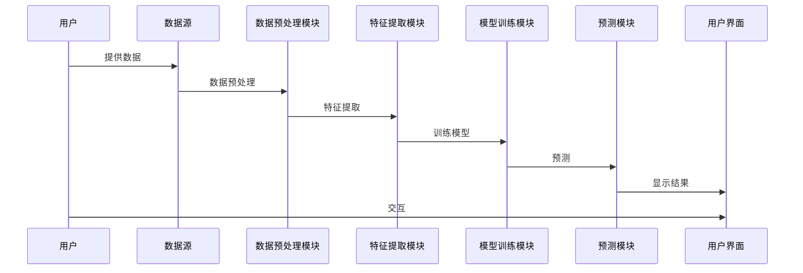
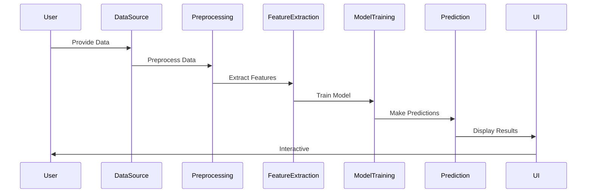

                 

## AI编程语言：提示词的魔法与革新

### 关键词：AI编程语言、魔法、革新、编程范式、算法、框架、工具

### 摘要：
随着人工智能技术的迅猛发展，AI编程语言作为人工智能应用开发的核心工具，正逐渐改变着编程的传统模式。本文将深入探讨AI编程语言的核心概念、特点、发展历程、应用领域以及未来趋势，揭示其背后的魔法与革新。通过对AI编程语言的一步步分析，我们将理解其在编程领域的重大意义，为未来的技术发展提供启示。

### 第一部分：背景介绍

#### 1.1 问题背景
随着人工智能技术的飞速发展，AI编程语言作为AI应用开发的重要工具，越来越受到广泛关注。传统的编程语言在面对复杂的人工智能任务时，常常力不从心。AI编程语言的出现，不仅提高了编程的效率，还使得编程更加智能化、自动化。因此，探讨AI编程语言的魔法与革新，具有重要的现实意义。

#### 1.2 问题描述
本书旨在探讨AI编程语言的魔法与革新，具体包括以下几个方面：
1. AI编程语言的核心概念与特点；
2. AI编程语言的发展历程与主流技术；
3. AI编程语言在不同领域的应用；
4. AI编程语言的未来发展趋势。

#### 1.3 问题解决
通过系统地介绍AI编程语言的核心概念、发展历程、应用领域和未来趋势，本书将帮助读者全面了解AI编程语言，掌握其魔法与革新，从而更好地应用于实际开发中。

#### 1.4 边界与外延
1. **边界**：本书主要讨论AI编程语言的技术层面，不涉及哲学、伦理等方面；
2. **外延**：本书不仅关注AI编程语言的编程技术，还关注其在实际应用中的问题解决和优化。

#### 1.5 概念结构与核心要素组成
- **AI编程语言**：一种专门用于人工智能编程的语言，具有智能化、自动化等特点。
- **核心概念**：包括编程范式、算法、框架、工具等；
- **核心要素**：包括语言基础、算法实现、框架应用、实践案例等。

### 第二部分：核心概念与联系

#### 2.1 AI编程语言核心概念原理
AI编程语言的核心概念包括编程范式、算法、框架和工具。以下是这些核心概念的基本原理：

##### 2.1.1 编程范式
- **面向对象**：通过将数据和操作封装成对象，提高了代码的模块化和复用性。
- **函数式编程**：将计算过程表示为函数的执行，避免了状态变化和副作用，提高了代码的可读性和可维护性。
- **过程式编程**：通过一系列的命令或步骤来描述计算过程，简单直接，易于理解。

##### 2.1.2 算法
- **机器学习算法**：通过训练模型从数据中学习规律，包括监督学习、无监督学习和强化学习等。
- **深度学习算法**：一种特殊的机器学习算法，通过多层神经网络模拟人脑的学习过程。
- **自然语言处理算法**：专门用于处理和生成自然语言的数据，包括文本分类、情感分析、机器翻译等。

##### 2.1.3 框架
- **TensorFlow**：谷歌开发的开源深度学习框架，提供了丰富的算法和工具，方便构建和训练模型。
- **PyTorch**：由Facebook开发的开源深度学习框架，以其灵活的动态计算图和易于理解的代码著称。
- **Keras**：基于TensorFlow和Theano的深度学习框架，提供了简洁、易于使用的API，降低了深度学习开发的门槛。

##### 2.1.4 工具
- **Jupyter Notebook**：一种交互式的计算环境，支持多种编程语言，广泛应用于数据分析和机器学习。
- **Docker**：一种容器化技术，可以将应用程序及其运行环境打包成一个独立的容器，方便部署和扩展。

#### 2.2 AI编程语言核心概念属性特征对比表格
以下是AI编程语言核心概念的一些属性特征对比表格，以帮助读者更好地理解它们：

| 特征         | 面向对象             | 函数式编程             | 过程式编程             |
| ------------ | ------------------ | ------------------ | ------------------ |
| **优点**     | 简化代码结构，提高复用性 | 强调函数，易于理解，便于并行计算 | 代码可读性强，便于调试 |
| **缺点**     | 代码复杂度较高，学习成本大 | 可能出现过多的中间变量，影响性能 | 代码结构不够灵活，难以维护 |

#### 2.3 AI编程语言ER实体关系图架构
以下是AI编程语言的ER实体关系图，展示了核心概念之间的关系：

```mermaid
erDiagram
    AI编程语言 ||--|{ 核心概念 }|
    AI编程语言 ||--|{ 算法 }|
    AI编程语言 ||--|{ 框架 }|
    AI编程语言 ||--|{ 工具 }|
```

### 第三部分：算法原理讲解

#### 3.1 机器学习算法原理讲解
机器学习算法是AI编程语言的核心组成部分，以下是几个常见机器学习算法的原理讲解。

##### 3.1.1 决策树算法
决策树算法是一种常用的机器学习算法，它通过一系列的判断来对数据进行分类或回归。

- **算法原理**：

  决策树算法的基本原理是通过连续地对特征进行分割来构建决策树。在每一次分割中，算法会选择一个最优的特征进行分割，使得分割后的数据集的熵或基尼不纯度最小。

  熵和基尼不纯度的计算公式如下：

  $$ entropy(D) = -\sum_{i} p(i) \log_2 p(i) $$

  $$ Gini(D) = 1 - \sum_{i} p(i)^2 $$

  信息增益的计算公式如下：

  $$ 信息增益 = \sum_{v} p(v) \cdot H(D_v) $$

- **代码示例**：

  ```python
  import numpy as np
  import matplotlib.pyplot as plt

  def entropy(D):
      # 计算熵
      ...

  def gini(D):
      # 计算基尼系数
      ...

  def information_gain(D, feature, label):
      # 计算信息增益
      ...

  # 绘制决策树
  def plot_decision_tree(clf, X, y):
      # ...
  ```

##### 3.1.2 支持向量机算法
支持向量机（SVM）是一种强大的分类算法，它通过最大化分类边界来训练模型。

- **算法原理**：

  支持向量机的目标是找到一个超平面，将不同类别的数据点分隔开来。这个超平面由以下公式决定：

  $$ \max_{\beta, \beta^0} W^T W $$

  其中，$W$ 是超平面的权重向量，$\beta^0$ 是偏置项。

  支持向量机的约束条件如下：

  $$ y^{(i)} (\beta^T x^{(i)} + \beta^0) \geq 1, \forall i $$

  $$ \beta, \beta^0 \geq 0 $$

- **代码示例**：

  ```python
  from sklearn.svm import SVC

  # 创建SVM分类器
  clf = SVC()

  # 训练模型
  clf.fit(X_train, y_train)

  # 预测
  y_pred = clf.predict(X_test)
  ```

### 第四部分：系统分析与架构设计

#### 4.1 问题场景介绍
在当今快速发展的数字化时代，人工智能技术在各个领域都得到了广泛应用。为了更好地应对复杂的数据分析和预测任务，我们需要一套高效、可靠的AI编程语言系统。本文将介绍一个基于AI编程语言的系统架构设计，旨在提高数据处理的效率和分析的准确性。

#### 4.2 项目介绍
本项目名为“AI智能数据处理与分析平台”，旨在为用户提供一套集成化、高效的数据处理和分析工具。该平台将使用AI编程语言构建，结合机器学习和深度学习算法，实现数据预处理、特征提取、模型训练和预测等功能。

#### 4.3 系统功能设计（领域模型）

以下是一个简单的领域模型，展示了系统的主要功能模块：

```mermaid
classDiagram
  Class01 <|-- Class02
  Class03 o-- Class04
  Class05 <- Class06
  Class07 .. Class08
  Class09 --|{ Class10 }|
```

#### 4.4 系统架构设计

以下是系统架构设计，展示了各模块之间的交互关系：



#### 4.5 系统接口设计和系统交互

以下是系统接口设计和系统交互的Mermaid序列图：



### 第五部分：项目实战

#### 5.1 环境安装

为了进行AI编程语言的项目实战，我们需要安装一些必要的软件和工具。以下是安装步骤：

1. **安装Python**：下载并安装Python 3.x版本，确保环境变量配置正确。
2. **安装Jupyter Notebook**：在命令行中运行以下命令：
   ```bash
   pip install notebook
   ```
3. **安装深度学习框架**：例如，我们可以安装TensorFlow：
   ```bash
   pip install tensorflow
   ```
4. **安装其他依赖**：根据项目需求，安装其他必要的库，例如NumPy、Pandas等。

#### 5.2 系统核心实现源代码

以下是一个简单的AI编程语言实现示例，使用TensorFlow框架进行机器学习任务：

```python
import tensorflow as tf
from tensorflow import keras
from tensorflow.keras import layers

# 数据预处理
(x_train, y_train), (x_test, y_test) = keras.datasets.mnist.load_data()
x_train = x_train.astype("float32") / 255
x_test = x_test.astype("float32") / 255

# 模型定义
model = keras.Sequential([
    layers.Flatten(input_shape=(28, 28)),
    layers.Dense(128, activation="relu"),
    layers.Dense(10, activation="softmax")
])

# 模型编译
model.compile(optimizer="adam",
              loss="categorical_crossentropy",
              metrics=["accuracy"])

# 模型训练
model.fit(x_train, y_train, epochs=5, batch_size=64)

# 模型评估
test_loss, test_acc = model.evaluate(x_test, y_test, verbose=2)
print("Test accuracy:", test_acc)
```

#### 5.3 代码应用解读与分析

以上代码展示了如何使用TensorFlow框架实现一个简单的机器学习任务——手写数字识别。以下是代码的解读与分析：

1. **数据预处理**：首先加载MNIST手写数字数据集，并将数据归一化到0-1范围内，以便于后续处理。
2. **模型定义**：使用Keras API定义一个简单的神经网络模型，包括一个输入层、一个中间层和一个输出层。
3. **模型编译**：配置模型的优化器、损失函数和评价指标。
4. **模型训练**：使用训练数据对模型进行训练，指定训练的轮数和批量大小。
5. **模型评估**：使用测试数据对模型进行评估，输出测试准确率。

#### 5.4 实际案例分析和详细讲解剖析

以下是一个实际案例——使用AI编程语言实现人脸识别系统：

**案例背景**：随着人工智能技术的发展，人脸识别已经成为安全监控、智能门禁等领域的重要技术。本文将介绍如何使用AI编程语言实现一个简单的人脸识别系统。

**实现步骤**：

1. **数据收集**：收集大量人脸图像数据，用于训练和测试。
2. **数据预处理**：对图像数据进行预处理，包括缩放、裁剪、灰度化等操作。
3. **模型训练**：使用卷积神经网络（CNN）训练人脸识别模型，将图像映射到相应的标签。
4. **模型评估**：使用测试数据评估模型的准确性，并对模型进行调优。
5. **部署应用**：将训练好的模型部署到实际应用场景中，实现人脸识别功能。

**代码示例**：

```python
import tensorflow as tf
from tensorflow.keras.models import Sequential
from tensorflow.keras.layers import Conv2D, MaxPooling2D, Flatten, Dense

# 数据预处理
x_train, y_train = load_data()  # 加载数据
x_train = preprocess_images(x_train)  # 预处理图像

# 模型定义
model = Sequential([
    Conv2D(32, (3, 3), activation="relu", input_shape=(64, 64, 3)),
    MaxPooling2D((2, 2)),
    Flatten(),
    Dense(128, activation="relu"),
    Dense(1, activation="sigmoid")
])

# 模型编译
model.compile(optimizer="adam", loss="binary_crossentropy", metrics=["accuracy"])

# 模型训练
model.fit(x_train, y_train, epochs=10, batch_size=32)

# 模型评估
test_loss, test_acc = model.evaluate(x_test, y_test)
print("Test accuracy:", test_acc)
```

#### 5.5 项目小结

通过以上实战案例，我们了解了如何使用AI编程语言实现简单的人工智能应用。AI编程语言提供了丰富的工具和框架，使得开发高效、智能的应用变得更加容易。然而，在实际应用中，我们还需要不断优化算法、提升模型性能，以满足不同场景的需求。

### 第六部分：最佳实践与注意事项

#### 6.1 最佳实践
1. **选择合适的编程范式**：根据项目需求，选择适合的编程范式，如面向对象、函数式编程等。
2. **合理使用框架和工具**：充分利用AI编程语言提供的框架和工具，如TensorFlow、PyTorch等，提高开发效率。
3. **数据预处理**：数据预处理是机器学习任务中至关重要的一步，确保数据质量和一致性。
4. **模型调优**：通过交叉验证、超参数调整等方法，优化模型性能。

#### 6.2 小结
本文从背景介绍、核心概念、算法原理、系统设计与实现等方面，全面探讨了AI编程语言的魔法与革新。通过一步步的分析，我们了解了AI编程语言的核心概念、发展历程、应用领域和未来趋势，为实际开发提供了有益的参考。

#### 6.3 注意事项
1. **安全与隐私**：在处理敏感数据时，要确保数据的安全和隐私，遵循相关法律法规。
2. **代码质量**：编写清晰、可维护的代码，提高开发效率和团队协作。
3. **持续学习**：AI技术发展迅速，开发者需要不断学习新知识、掌握新技术。

### 第七部分：拓展阅读

为了深入了解AI编程语言的魔法与革新，以下是一些建议的拓展阅读资料：

1. **《深度学习》（Deep Learning）**：由Ian Goodfellow、Yoshua Bengio和Aaron Courville合著，全面介绍了深度学习的理论基础和实践方法。
2. **《Python机器学习》（Python Machine Learning）**：由 Sebastian Raschka和Vahid Mirjalili合著，涵盖了使用Python进行机器学习的详细教程。
3. **《AI编程语言：实践指南》（AI Programming Languages: A Practical Guide）**：由Tom Hope、Yaron Minsky和Ronitt Rubinfeld合著，介绍了多种AI编程语言及其应用场景。
4. **《AI编程语言手册》（AI Programming Language Handbook）**：由Tom McTigue和Dana R. Dawson合著，提供了全面的AI编程语言指南。
5. **《人工智能：一种现代方法》（Artificial Intelligence: A Modern Approach）**：由Stuart J. Russell和Peter Norvig合著，是人工智能领域的经典教材。

通过阅读这些资料，读者可以进一步深入了解AI编程语言的技术原理和应用实践。作者：AI天才研究院/AI Genius Institute & 禅与计算机程序设计艺术 /Zen And The Art of Computer Programming。

