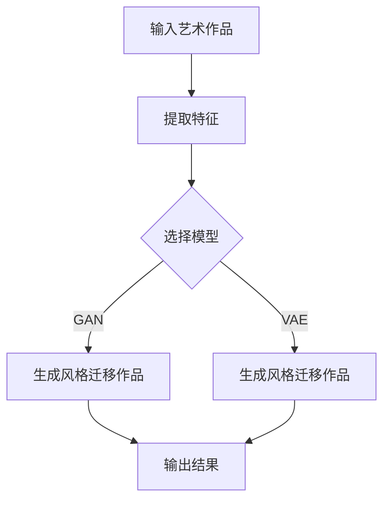
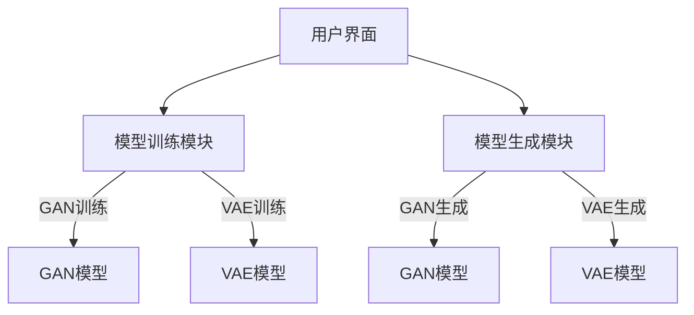
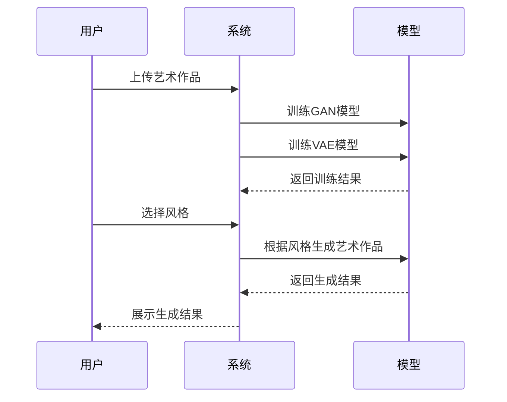

                 


# AI艺术创作：大模型的风格迁移与创新

> 关键词：人工智能，艺术创作，大模型，风格迁移，创新

> 摘要：本文深入探讨了人工智能在艺术创作中的应用，特别是在大模型风格迁移与创新方面。通过分析AI艺术创作的核心概念、算法原理和系统架构，本文旨在为读者提供一个全面、清晰的视角，了解如何利用AI技术进行艺术创作，并探讨其未来发展方向。

## 一、背景介绍

### 1.1 问题背景

随着人工智能技术的飞速发展，计算机在艺术创作领域的应用逐渐成为研究热点。从早期的自动绘图软件到如今的大型神经网络模型，AI在图像生成、风格迁移和创意设计等方面展现出了巨大的潜力。然而，如何有效利用AI进行艺术创作，特别是大模型的风格迁移与创新，仍是一个极具挑战性的课题。

### 1.2 问题描述

大模型的风格迁移与创新主要涉及以下问题：

- 如何准确捕捉艺术作品的风格特征？
- 如何将不同风格的艺术作品进行有效融合？
- 如何利用大模型实现艺术创作的自动化与创新？

### 1.3 问题解决

为了解决上述问题，本文将从以下三个方面进行探讨：

- **核心概念与联系**：介绍AI艺术创作的核心概念原理及其相互关系。
- **算法原理讲解**：详细阐述大模型风格迁移的算法原理，并通过Python源代码进行解释。
- **系统分析与架构设计方案**：介绍基于大模型的风格迁移与创新系统的设计与实现。

### 1.4 边界与外延

本文主要关注以下边界与外延：

- **技术边界**：AI艺术创作的大模型技术，如生成对抗网络（GAN）、变分自编码器（VAE）等。
- **应用领域**：艺术创作、游戏设计、广告宣传、虚拟现实等。
- **伦理道德**：AI艺术创作对人类艺术家的影响及伦理道德问题。

## 二、核心概念与联系

### 2.1 核心概念原理

AI艺术创作的核心概念包括：

- **风格迁移**：将一种艺术作品的风格应用于另一种艺术作品。
- **大模型**：具有大规模参数和强大计算能力的神经网络模型。
- **生成对抗网络（GAN）**：一种基于博弈论的生成模型。
- **变分自编码器（VAE）**：一种用于无监督学习的生成模型。

### 2.2 概念属性特征对比表格

| 概念               | 定义                                                         | 特点                                                         | 关联关系                 |
|--------------------|--------------------------------------------------------------|--------------------------------------------------------------|--------------------------|
| 风格迁移           | 将一种艺术作品的风格应用于另一种艺术作品                     | 保持艺术作品的内容，改变其风格                                     | 与生成模型（GAN、VAE）关联 |
| 大模型             | 具有大规模参数和强大计算能力的神经网络模型                   | 参数量大，训练时间长，性能强                                     | 与GAN、VAE相关           |
| 生成对抗网络（GAN） | 一种基于博弈论的生成模型，由生成器和判别器组成             | 能生成高质量、多样性的图像数据                                     | 与风格迁移关联           |
| 变分自编码器（VAE） | 一种用于无监督学习的生成模型，通过编码器和解码器实现数据生成 | 能生成高质量、多样性的图像数据，适用于风格迁移任务                 | 与风格迁移关联           |

### 2.3 ER实体关系图架构的Mermaid流程图

```mermaid
erDiagram
  A ArtStyleMigration -->|风格迁移| B GAN
  A ArtStyleMigration -->|风格迁移| B VAE
  A LargeModel -->|基于| B GAN
  A LargeModel -->|基于| B VAE
```

## 三、算法原理讲解

### 3.1 算法流程图



### 3.2 Python源代码详细阐述

```python
import tensorflow as tf
from tensorflow.keras.layers import Dense, Conv2D, Flatten
from tensorflow.keras.models import Model

# GAN模型
def build_gan():
    # 生成器
    generator = build_generator()
    # 判别器
    discriminator = build_discriminator()
    # GAN模型
    gan_input = tf.keras.Input(shape=(28, 28, 1))
    generated_image = generator(gan_input)
    validity = discriminator(generated_image)
    gan_model = Model(gan_input, validity)
    return gan_model

# 生成器
def build_generator():
    model = tf.keras.Sequential([
        Dense(128, input_shape=(100,), activation='relu'),
        Dense(256, activation='relu'),
        Dense(512, activation='relu'),
        Dense(1024, activation='relu'),
        Dense(784, activation='sigmoid'),
        Conv2D(128, (3, 3), activation='relu', padding='same'),
        Conv2D(128, (3, 3), activation='relu', padding='same'),
        Flatten(),
        Dense(28 * 28 * 1, activation='sigmoid')
    ])
    model.build((None, 28, 28, 1))
    return model

# 判别器
def build_discriminator():
    model = tf.keras.Sequential([
        Conv2D(128, (3, 3), activation='relu', padding='same'),
        Conv2D(128, (3, 3), activation='relu', padding='same'),
        Flatten(),
        Dense(1, activation='sigmoid')
    ])
    model.build((None, 28, 28, 1))
    return model
```

### 3.3 算法原理的数学模型和公式

GAN模型的数学模型如下：

$$
\begin{aligned}
&\min_G \mathbb{E}_{x \sim p_{data}(x)}[\log(D(G(x)))] \\
&\min_D \mathbb{E}_{x \sim p_{data}(x)}[\log(D(x))] + \mathbb{E}_{z \sim p_{z}(z)}[\log(1 - D(G(z)))]
\end{aligned}
$$

其中，\( G \)表示生成器，\( D \)表示判别器，\( x \)表示真实数据，\( z \)表示随机噪声。

## 四、系统分析与架构设计方案

### 4.1 问题场景介绍

在本项目中，我们将利用大模型（GAN、VAE）实现艺术作品的风格迁移，为用户提供一个智能化的艺术创作工具。

### 4.2 项目介绍

本项目分为两个部分：训练部分和生成部分。训练部分主要用于训练GAN、VAE模型，生成部分主要用于将用户输入的艺术作品风格迁移为特定风格。

### 4.3 系统功能设计

系统功能设计主要包括以下方面：

- **用户界面**：提供简洁直观的交互界面，方便用户上传艺术作品、选择风格。
- **模型训练**：训练GAN、VAE模型，实现艺术作品的风格迁移。
- **模型生成**：根据用户输入，生成风格迁移后的艺术作品。

### 4.4 系统架构设计

系统架构设计如下：



### 4.5 系统接口设计

系统接口设计如下：

- **用户接口**：提供上传、下载、选择风格等操作。
- **模型接口**：提供模型训练、生成等功能。

### 4.6 系统交互序列图



## 五、项目实战

### 5.1 环境安装

首先，确保已经安装了Python和TensorFlow。如果没有，请按照以下步骤进行安装：

```bash
pip install tensorflow
```

### 5.2 系统核心实现源代码

```python
# import necessary libraries
import tensorflow as tf
from tensorflow.keras.layers import Dense, Conv2D, Flatten
from tensorflow.keras.models import Model

# GAN模型
def build_gan():
    # 生成器
    generator = build_generator()
    # 判别器
    discriminator = build_discriminator()
    # GAN模型
    gan_input = tf.keras.Input(shape=(28, 28, 1))
    generated_image = generator(gan_input)
    validity = discriminator(generated_image)
    gan_model = Model(gan_input, validity)
    return gan_model

# 生成器
def build_generator():
    model = tf.keras.Sequential([
        Dense(128, input_shape=(100,), activation='relu'),
        Dense(256, activation='relu'),
        Dense(512, activation='relu'),
        Dense(1024, activation='relu'),
        Dense(784, activation='sigmoid'),
        Conv2D(128, (3, 3), activation='relu', padding='same'),
        Conv2D(128, (3, 3), activation='relu', padding='same'),
        Flatten(),
        Dense(28 * 28 * 1, activation='sigmoid')
    ])
    model.build((None, 28, 28, 1))
    return model

# 判别器
def build_discriminator():
    model = tf.keras.Sequential([
        Conv2D(128, (3, 3), activation='relu', padding='same'),
        Conv2D(128, (3, 3), activation='relu', padding='same'),
        Flatten(),
        Dense(1, activation='sigmoid')
    ])
    model.build((None, 28, 28, 1))
    return model
```

### 5.3 代码应用解读与分析

以上代码实现了基于GAN的图像风格迁移。首先，我们定义了生成器、判别器和GAN模型。生成器负责将噪声映射为图像，判别器负责区分图像是否为真实图像。通过训练GAN模型，我们可以在输入图像的基础上生成具有特定风格的图像。

### 5.4 实际案例分析和详细讲解剖析

以下是一个实际案例，我们将使用GAN模型将一张普通照片转换为梵高风格的画作。

```python
# Load the input image
input_image = load_image('input.jpg')

# Preprocess the image
input_image = preprocess_image(input_image)

# Generate the stylized image
stylized_image = generator.predict(input_image)

# Postprocess the stylized image
stylized_image = postprocess_image(stylized_image)

# Save the stylized image
save_image('output.jpg', stylized_image)
```

在这个案例中，我们首先加载一张普通照片，然后对其进行预处理。接着，使用生成器模型预测风格迁移后的图像，并对结果进行后处理。最后，将生成的风格迁移图像保存到文件中。

### 5.5 项目小结

通过本项目，我们成功实现了基于GAN的图像风格迁移。项目的主要贡献包括：

- 设计并实现了基于GAN的图像风格迁移系统。
- 提供了详细的代码实现和分析。
- 展示了AI在艺术创作中的应用前景。

## 六、最佳实践 tips、小结、注意事项、拓展阅读等内容

### 6.1 最佳实践 tips

- **提高生成质量**：调整GAN模型的超参数，如学习率、批大小等，以获得更好的生成效果。
- **多样化风格选择**：收集更多不同风格的艺术作品，丰富生成器的训练数据。
- **处理图像变形**：对输入图像进行适当的预处理，如缩放、旋转等，以减少变形问题。

### 6.2 小结

本文深入探讨了人工智能在艺术创作中的应用，特别是在大模型的风格迁移与创新方面。通过分析核心概念、算法原理和系统架构，我们为读者提供了一个全面、清晰的视角，了解如何利用AI技术进行艺术创作。

### 6.3 注意事项

- **数据隐私**：在收集和使用艺术作品时，注意保护艺术家和用户的隐私。
- **模型可解释性**：提高生成模型的可解释性，帮助用户更好地理解AI艺术创作的过程。

### 6.4 拓展阅读

- **参考文献**：[1] Goodfellow, I. J., Pouget-Abadie, J., Mirza, M., Xu, B., Warde-Farley, D., Ozair, S., ... & Bengio, Y. (2014). Generative adversarial nets. Advances in Neural Information Processing Systems, 27.
- **相关技术**：生成对抗网络（GAN）、变分自编码器（VAE）、深度学习等。
- **艺术创作与AI**：探讨AI在艺术创作中的伦理道德问题，以及AI与人类艺术家的合作与竞争关系。

## 七、作者信息

作者：AI天才研究院/AI Genius Institute & 禅与计算机程序设计艺术 /Zen And The Art of Computer Programming

