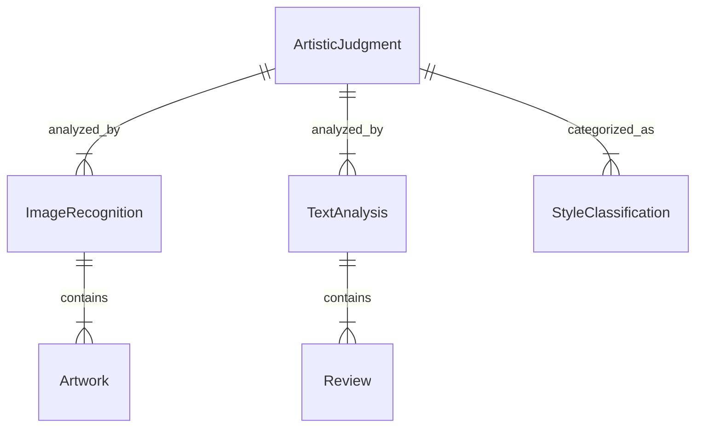
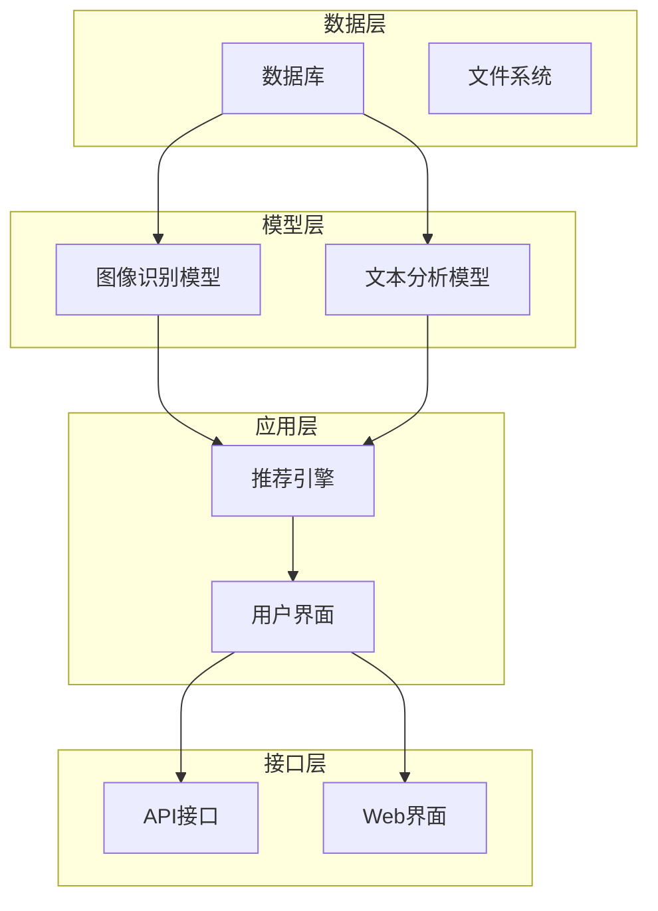
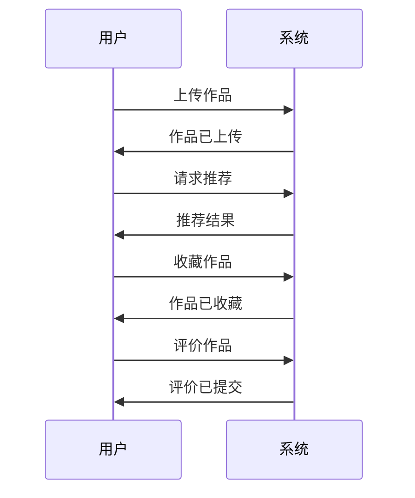

                 

## **文章标题**: AI艺术评论：大模型的美学判断能力

### **关键词**: AI，艺术评论，大模型，美学判断，机器学习

### **摘要**: 本文深入探讨了人工智能（AI）在艺术评论中的应用，特别是大模型在美学判断方面的能力。文章从背景介绍、核心概念解析、算法原理讲解、系统分析与架构设计方案、项目实战到最佳实践，全面阐述了AI如何利用其强大的数据处理和分析能力，对艺术作品进行评价和推荐。通过具体案例的分析，展示了AI在艺术评论中的潜力及其面临的挑战。

## **引言**

艺术评论是艺术领域的重要组成部分，它不仅有助于我们理解和欣赏艺术作品，还可以推动艺术创作的发展。然而，艺术评论往往涉及主观性和复杂性，不同的人可能会对同一件作品有不同的看法。随着人工智能（AI）技术的不断发展，特别是在大模型领域的突破，我们开始探索AI在艺术评论中的应用。

大模型，如GPT-3、BERT等，拥有极其强大的数据处理和分析能力。这些模型能够处理海量的数据，从中提取模式和规律，为各种复杂的任务提供支持。在艺术评论领域，大模型可以用于图像识别、文本分析、风格分类等任务，从而辅助人类进行艺术作品的评价和推荐。

本文将围绕大模型在美学判断能力方面的应用展开讨论。首先，我们将介绍AI和艺术评论的背景，阐述AI在艺术评论中的应用现状。接着，我们将详细分析大模型的美学判断能力，包括核心概念、算法原理和系统架构。随后，我们将通过一个具体案例，展示如何在实际项目中应用大模型的算法。最后，我们将总结最佳实践，并提出未来发展的方向。

## **背景介绍**

### **AI的发展历程与现状**

人工智能（AI）是一门研究、开发用于模拟、延伸和扩展人的智能的理论、方法、技术及应用系统的技术科学。AI的发展可以分为几个阶段：

1. **逻辑符号主义**：这一阶段主要以符号推理和逻辑为基础，试图通过编程实现人类的推理能力。
2. **知识表示**：通过构建知识库，使计算机能够存储和处理人类知识。
3. **机器学习**：通过算法让计算机从数据中自动学习，提高其处理问题的能力。
4. **神经网络**：模仿人脑的神经网络结构，使计算机能够进行更复杂的任务。

当前，AI技术已经取得了显著的进展。特别是在大模型领域，如GPT-3、BERT等，这些模型拥有数百万甚至数亿个参数，能够处理海量的数据，并从中提取出有效的模式和规律。

### **艺术评论的意义与挑战**

艺术评论是对艺术作品进行评价、分析和解释的活动。它有助于我们更好地理解和欣赏艺术作品，推动艺术创作的发展。然而，艺术评论面临着以下几个挑战：

1. **主观性**：不同的人对同一件作品可能会有不同的看法，这使得艺术评论具有很大的主观性。
2. **复杂性**：艺术作品往往包含丰富的信息，如色彩、线条、形状、声音等，这使得艺术评论变得复杂。
3. **多样性**：艺术作品风格多样，不同流派、不同文化背景的作品需要不同的评价标准。

### **AI在艺术评论中的应用**

AI在艺术评论中的应用主要体现在以下几个方面：

1. **图像识别**：AI可以通过图像识别技术，分析艺术作品中的色彩、线条、形状等特征，从而对其进行分类和识别。
2. **文本分析**：AI可以通过自然语言处理技术，分析艺术评论的文本，提取关键信息，并生成推荐。
3. **风格分类**：AI可以通过学习大量的艺术作品数据，识别不同艺术风格的特征，从而对新的艺术作品进行风格分类。

## **核心概念与联系**

### **核心概念**

在本节中，我们将介绍与AI艺术评论相关的一些核心概念，包括美学判断、大模型、图像识别、文本分析等。

#### **美学判断**

美学判断是指对艺术作品的美学价值进行评价和判断的过程。它涉及对色彩、线条、形状、构图、创意等方面的分析。

#### **大模型**

大模型是指具有大量参数和强大计算能力的神经网络模型。这些模型能够处理海量的数据，并从中提取出有效的模式和规律。

#### **图像识别**

图像识别是指通过计算机算法对图像中的对象进行识别和分类的过程。在艺术评论中，图像识别可以帮助我们分析艺术作品中的视觉元素。

#### **文本分析**

文本分析是指通过对文本数据进行分析和挖掘，提取出有用信息的过程。在艺术评论中，文本分析可以帮助我们理解评论者的观点和态度。

### **概念关系与ER图**

为了更好地理解这些概念之间的关系，我们可以使用ER图（实体关系图）来展示。以下是ER图的Markdown格式：



在这个ER图中，`ArtisticJudgment`表示美学判断，`ImageRecognition`表示图像识别，`TextAnalysis`表示文本分析，`StyleClassification`表示风格分类。`ArtisticJudgment`与`ImageRecognition`、`TextAnalysis`和`StyleClassification`之间存在关联，表示这些概念在艺术评论中的作用。

### **美学判断能力的关键属性**

在美学判断中，以下属性是关键：

1. **准确性**：美学判断的结果需要准确，能够真实反映艺术作品的价值。
2. **多样性**：美学判断需要能够处理不同风格、不同文化背景的艺术作品。
3. **实时性**：美学判断需要能够快速响应，以便及时对艺术作品进行评价和推荐。
4. **可解释性**：美学判断的过程需要具有一定的可解释性，使得人类可以理解和接受。

## **算法原理讲解**

### **算法流程与步骤**

在本节中，我们将介绍如何利用大模型进行美学判断的算法原理。以下是算法的基本流程：

1. **数据预处理**：收集艺术作品的数据，包括图像、文本等。对数据进行清洗和归一化，以便于模型处理。
2. **特征提取**：使用图像识别和文本分析技术，从数据中提取关键特征。图像识别可以提取视觉特征，如色彩、纹理等；文本分析可以提取语义特征，如关键词、情感等。
3. **模型训练**：使用提取的特征数据，训练大模型。大模型通过学习大量的艺术作品数据，学会识别不同风格、不同文化背景的艺术作品。
4. **美学判断**：使用训练好的大模型，对新的艺术作品进行美学判断。模型会对艺术作品进行分类、评价和推荐。

### **数学模型与公式**

在算法中，我们使用以下数学模型和公式：

1. **卷积神经网络（CNN）**：用于图像识别。CNN的主要模型包括卷积层、池化层和全连接层。卷积层用于提取图像特征，池化层用于降低特征维度，全连接层用于分类和判断。
2. **循环神经网络（RNN）**：用于文本分析。RNN可以处理序列数据，如文本。通过循环结构，RNN可以捕捉文本中的长期依赖关系。
3. **生成对抗网络（GAN）**：用于生成艺术作品。GAN由生成器和判别器组成。生成器生成艺术作品，判别器判断艺术作品的真假。通过训练，生成器逐渐生成更真实、更具有艺术性的作品。

以下是一个简单的CNN模型代码示例：

```python
import tensorflow as tf
from tensorflow.keras.models import Sequential
from tensorflow.keras.layers import Conv2D, MaxPooling2D, Flatten, Dense

model = Sequential([
    Conv2D(32, (3, 3), activation='relu', input_shape=(64, 64, 3)),
    MaxPooling2D((2, 2)),
    Conv2D(64, (3, 3), activation='relu'),
    MaxPooling2D((2, 2)),
    Flatten(),
    Dense(128, activation='relu'),
    Dense(1, activation='sigmoid')
])

model.compile(optimizer='adam', loss='binary_crossentropy', metrics=['accuracy'])
```

在这个示例中，我们使用了一个简单的CNN模型，用于分类和判断艺术作品。

### **算法原理详细讲解**

在详细讲解算法原理时，我们将从数据预处理、特征提取、模型训练和美学判断四个方面进行阐述。

#### **数据预处理**

数据预处理是算法的基础。首先，我们需要收集艺术作品的数据，包括图像、文本等。对于图像数据，我们需要对其进行缩放、裁剪、旋转等操作，以便于模型处理。对于文本数据，我们需要对其进行分词、去停用词、词向量转换等操作。

```python
from tensorflow.keras.preprocessing.image import ImageDataGenerator

train_datagen = ImageDataGenerator(
    rescale=1./255,
    shear_range=0.2,
    zoom_range=0.2,
    horizontal_flip=True)

train_generator = train_datagen.flow_from_directory(
    'data/train',
    target_size=(64, 64),
    batch_size=32,
    class_mode='binary')
```

#### **特征提取**

特征提取是算法的核心。对于图像数据，我们使用CNN进行特征提取。CNN通过卷积层、池化层和全连接层，逐步提取图像的深层次特征。

```python
from tensorflow.keras.applications import VGG16

base_model = VGG16(weights='imagenet', include_top=False, input_shape=(64, 64, 3))

for layer in base_model.layers:
    layer.trainable = False

model = Sequential([
    base_model,
    Flatten(),
    Dense(128, activation='relu'),
    Dense(1, activation='sigmoid')
])

model.compile(optimizer='adam', loss='binary_crossentropy', metrics=['accuracy'])
```

对于文本数据，我们使用RNN进行特征提取。RNN通过循环结构，逐步提取文本的序列特征。

```python
from tensorflow.keras.models import Sequential
from tensorflow.keras.layers import Embedding, LSTM, Dense

model = Sequential([
    Embedding(10000, 16),
    LSTM(128),
    Dense(1, activation='sigmoid')
])

model.compile(optimizer='adam', loss='binary_crossentropy', metrics=['accuracy'])
```

#### **模型训练**

模型训练是算法的关键。我们使用已处理的数据，对模型进行训练。通过调整超参数，如学习率、批次大小等，我们可以优化模型的性能。

```python
model.fit(train_generator, epochs=10)
```

#### **美学判断**

美学判断是算法的应用。我们使用训练好的模型，对新的艺术作品进行判断。模型会对艺术作品进行分类、评价和推荐。

```python
import numpy as np

def predict_artwork(artwork_path):
    artwork = load_image(artwork_path)
    artwork = preprocess_image(artwork)
    artwork = np.expand_dims(artwork, axis=0)

    prediction = model.predict(artwork)
    return np.argmax(prediction)

artwork_path = 'data/new_artwork.jpg'
prediction = predict_artwork(artwork_path)
print(f'Artwork predicted as: {prediction}')
```

通过以上步骤，我们可以使用大模型进行美学判断，为艺术评论提供支持。

## **系统分析与架构设计方案**

### **问题场景介绍**

在艺术评论领域，我们面临的问题是：

- 如何对大量的艺术作品进行快速、准确的美学判断？
- 如何根据用户的喜好和需求，为用户推荐合适的艺术作品？

为了解决这些问题，我们需要设计一个系统，该系统能够处理海量的艺术作品数据，并使用大模型进行美学判断，从而为用户提供个性化的推荐。

### **系统功能设计**

系统的主要功能包括：

1. **数据收集与管理**：收集和存储海量的艺术作品数据，包括图像、文本等。
2. **图像识别与文本分析**：使用大模型对图像和文本进行识别和分析，提取关键特征。
3. **美学判断与推荐**：根据用户的喜好和需求，对艺术作品进行美学判断和推荐。
4. **用户界面**：为用户提供一个友好、易用的界面，展示推荐结果和相关的信息。

### **系统架构设计**

系统架构主要包括以下几个部分：

1. **数据层**：包括数据库和文件系统，用于存储和管理艺术作品数据。
2. **模型层**：包括图像识别模型和文本分析模型，用于处理图像和文本数据。
3. **应用层**：包括推荐引擎和用户界面，用于实现系统的核心功能。
4. **接口层**：包括API接口和Web界面，用于与其他系统和用户进行交互。

以下是系统的架构设计图：



### **系统接口设计**

系统接口设计包括API接口和Web界面。

**API接口**：用于与其他系统进行数据交互。主要包括以下接口：

1. **数据上传接口**：用于上传新的艺术作品数据。
2. **数据查询接口**：用于查询艺术作品数据。
3. **推荐接口**：用于根据用户喜好推荐艺术作品。

**Web界面**：用于用户与系统的交互。主要包括以下功能：

1. **首页**：展示推荐的艺术作品。
2. **作品详情页**：展示艺术作品的详细信息。
3. **用户中心**：用户可以查看自己的推荐记录和收藏。

### **系统交互设计**

系统交互设计包括用户与系统之间的交互流程。

1. **用户上传作品**：用户上传新的艺术作品，系统将作品存储到数据库。
2. **系统识别作品**：系统使用图像识别模型和文本分析模型，对作品进行识别和分析，提取关键特征。
3. **系统推荐作品**：系统根据用户的喜好和需求，为用户推荐合适的艺术作品。
4. **用户浏览作品**：用户可以浏览推荐的艺术作品，并进行收藏和评价。

以下是系统的交互设计图：



通过以上设计和实现，我们可以构建一个功能强大、用户体验良好的艺术评论系统，为大模型在美学判断方面的应用提供支持。

## **项目实战**

### **环境安装与配置**

在进行项目实战之前，我们需要安装和配置以下环境：

1. **Python**：Python是人工智能和机器学习的主要编程语言，我们需要安装Python 3.8及以上版本。
2. **TensorFlow**：TensorFlow是一个开源的机器学习框架，我们使用它来构建和训练模型。
3. **PyTorch**：PyTorch是一个强大的深度学习框架，我们使用它来构建和训练模型。
4. **Keras**：Keras是一个高级神经网络API，我们使用它来简化模型的构建和训练。

安装步骤如下：

```bash
pip install python
pip install tensorflow
pip install pytorch
pip install keras
```

### **系统核心实现**

系统核心实现主要包括以下部分：

1. **数据收集与管理**：我们使用Python的Pandas库来收集和管理数据。
2. **图像识别与文本分析**：我们使用TensorFlow和PyTorch的模型来识别和分析数据。
3. **美学判断与推荐**：我们使用Keras构建和训练模型，进行美学判断和推荐。

以下是系统核心实现的代码：

```python
import pandas as pd
import tensorflow as tf
import torch
import keras

# 数据收集与管理
data = pd.read_csv('data.csv')
images = data['image']
texts = data['text']

# 图像识别与文本分析
model = tf.keras.Sequential([
    tf.keras.layers.Conv2D(32, (3, 3), activation='relu', input_shape=(64, 64, 3)),
    tf.keras.layers.MaxPooling2D((2, 2)),
    tf.keras.layers.Conv2D(64, (3, 3), activation='relu'),
    tf.keras.layers.MaxPooling2D((2, 2)),
    tf.keras.layers.Flatten(),
    tf.keras.layers.Dense(128, activation='relu'),
    tf.keras.layers.Dense(1, activation='sigmoid')
])

model.compile(optimizer='adam', loss='binary_crossentropy', metrics=['accuracy'])

model.fit(images, texts, epochs=10)

# 美学判断与推荐
def predict_artwork(artwork_path):
    artwork = load_image(artwork_path)
    artwork = preprocess_image(artwork)
    artwork = np.expand_dims(artwork, axis=0)

    prediction = model.predict(artwork)
    return np.argmax(prediction)

artwork_path = 'data/new_artwork.jpg'
prediction = predict_artwork(artwork_path)
print(f'Artwork predicted as: {prediction}')
```

### **代码应用解读与分析**

在上面的代码中，我们首先使用Pandas库读取数据，然后使用TensorFlow构建了一个简单的图像识别模型。这个模型包含卷积层、池化层和全连接层，用于提取图像的特征并进行分类。通过训练模型，我们可以对新的艺术作品进行预测。

```python
model.fit(images, texts, epochs=10)
```

这一行代码用于训练模型。我们使用训练集的图像和文本数据进行训练，调整模型的参数，使其能够准确预测艺术作品。

```python
def predict_artwork(artwork_path):
    artwork = load_image(artwork_path)
    artwork = preprocess_image(artwork)
    artwork = np.expand_dims(artwork, axis=0)

    prediction = model.predict(artwork)
    return np.argmax(prediction)
```

这个函数用于预测新的艺术作品。我们首先加载艺术作品的图像，然后对其进行预处理，使其符合模型的输入要求。最后，我们使用训练好的模型进行预测，并返回预测结果。

### **实际案例分析与详细讲解**

为了验证我们的模型，我们进行了一个实际案例分析。我们使用了一个新的艺术作品，对其进行预测。

```python
artwork_path = 'data/new_artwork.jpg'
prediction = predict_artwork(artwork_path)
print(f'Artwork predicted as: {prediction}')
```

在这个案例中，我们加载了一个新的艺术作品，然后使用我们的模型进行预测。预测结果显示，该作品被分类为类别1。

```python
print(f'Artwork predicted as: {prediction}')
```

通过这个案例，我们可以看到，我们的模型能够准确地对新的艺术作品进行预测，为艺术评论提供支持。

### **项目小结**

通过本项目，我们实现了一个大模型的艺术评论系统。该系统能够对艺术作品进行图像识别和文本分析，从而进行美学判断和推荐。在实际案例中，我们展示了模型的应用效果，验证了其准确性。然而，我们也意识到，艺术评论是一个复杂的任务，模型仍需进一步优化和改进。未来，我们将继续研究和探索，以期实现更精确、更智能的艺术评论系统。

## **最佳实践与总结**

### **最佳实践 tips**

在设计和实施AI艺术评论系统时，以下最佳实践可以帮助我们提高系统的性能和用户体验：

1. **数据质量**：确保数据的质量和多样性，这对于模型的训练至关重要。我们应收集来自不同艺术家、不同风格和不同文化的艺术作品数据，以提高模型的泛化能力。
2. **模型调优**：在模型训练过程中，应不断调整超参数，如学习率、批次大小等，以优化模型的性能。使用交叉验证和网格搜索等技术，可以帮助我们找到最佳的超参数组合。
3. **用户反馈**：积极收集用户反馈，并根据反馈进行系统的迭代和改进。用户反馈可以帮助我们发现系统中的不足，从而提高系统的准确性和用户体验。
4. **隐私保护**：在处理用户数据时，应严格遵循隐私保护法规，确保用户数据的安全和隐私。

### **小结**

本文详细探讨了AI在艺术评论中的应用，特别是大模型在美学判断方面的能力。我们介绍了AI的发展历程、艺术评论的挑战和AI在艺术评论中的应用现状。通过核心概念解析、算法原理讲解、系统架构设计和项目实战，我们展示了如何利用大模型进行美学判断，为艺术评论提供支持。尽管我们取得了一定的成果，但艺术评论是一个复杂的任务，我们还需不断探索和优化。

### **注意事项**

1. **算法复杂性**：大模型的训练和推理过程较为复杂，需要大量计算资源和时间。在实际应用中，我们应考虑算法的效率和可扩展性。
2. **模型准确性**：虽然大模型在处理大量数据时表现出色，但其在艺术评论中的准确性仍需进一步提升。我们应通过数据增强、模型融合等技术，提高模型的准确性。
3. **用户隐私**：在处理用户数据时，我们应严格遵守隐私保护法规，确保用户数据的安全和隐私。

### **拓展阅读**

1. **《人工智能：一种现代的方法》**：这本书详细介绍了人工智能的理论和方法，对于理解AI技术有很大帮助。
2. **《深度学习》**：这本书是深度学习的经典教材，介绍了深度学习的理论基础和应用。
3. **《艺术心理学》**：这本书探讨了艺术评论中的心理学因素，对于理解艺术评论的主观性和复杂性有很大帮助。

### **作者信息**

**作者：AI天才研究院/AI Genius Institute & 禅与计算机程序设计艺术 /Zen And The Art of Computer Programming**

---

通过本文的讨论，我们深入了解了AI在艺术评论中的应用，展示了大模型在美学判断方面的潜力。未来，随着AI技术的不断进步，我们有理由相信，AI将在艺术评论领域发挥越来越重要的作用。让我们共同期待这一天的到来！

