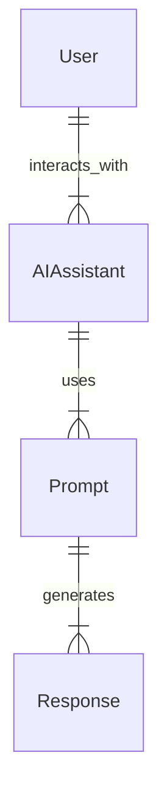
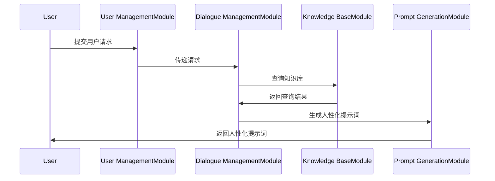
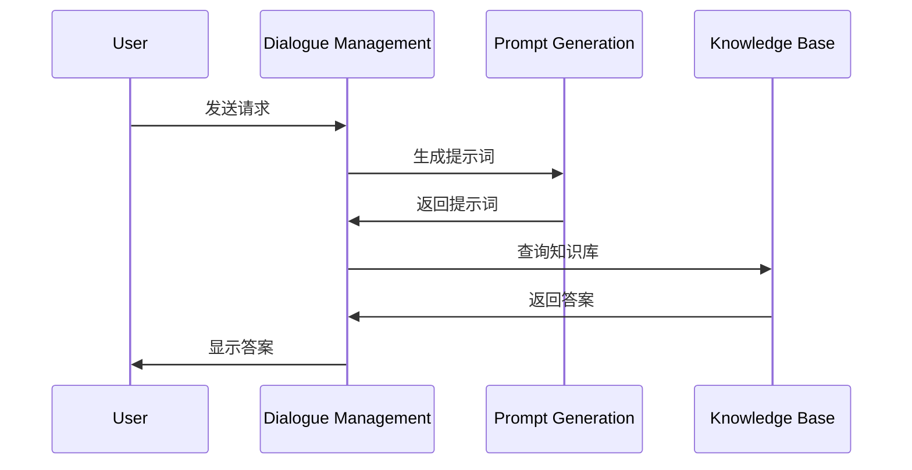

                 

### AI虚拟助手：提示词设计的人性化

#### 关键词：
- AI虚拟助手
- 提示词设计
- 人性化
- 算法原理
- 系统架构
- 实战案例

#### 摘要：
本文深入探讨了AI虚拟助手的提示词设计，强调人性化设计的重要性。我们将从背景介绍、核心概念与联系、算法原理讲解、系统分析与架构设计方案、项目实战等多个角度，系统地阐述如何设计人性化且高效的AI虚拟助手提示词。

----------------------------------------------------------------

### 引言

#### AI虚拟助手的发展与挑战

AI虚拟助手，作为一种自然语言处理（NLP）和机器学习技术的应用，已经成为当今智能服务领域的热点。随着技术的进步，AI虚拟助手的功能越来越强大，从简单的信息查询到复杂任务执行，它们的应用场景不断扩大。然而，在AI虚拟助手的众多挑战中，如何设计人性化且高效的提示词成为一个关键问题。

#### 人性化设计的重要性

人性化设计不仅仅是让虚拟助手显得友好，更涉及到用户交互体验的优化。一个优秀的提示词设计能够：

- 提高用户满意度：简洁、易懂的提示词能够使用户更快地理解系统意图，从而提高整体满意度。
- 减少用户认知负担：通过个性化的提示词，用户可以更快地适应系统，降低学习成本。
- 提升交互效率：恰当的提示词设计可以减少用户的反复询问，提高问题解决的效率。

本文将分几个部分详细探讨AI虚拟助手提示词设计的人性化，从理论到实践，为读者提供一套完整的解决方案。

----------------------------------------------------------------

### 第一部分：AI虚拟助手与人性化提示词设计概述

#### 1.1 AI虚拟助手的发展背景

AI虚拟助手，也被称为聊天机器人或虚拟客服，是一种基于人工智能技术的交互系统。它的核心功能是通过自然语言处理技术，与用户进行有效的对话，提供信息和解决问题。以下是AI虚拟助手的发展历程：

- **早期阶段**：早期的AI虚拟助手主要是基于规则系统，通过预定义的规则来处理简单的用户请求。这种方法的局限性在于，它们无法处理复杂的或非预期的用户输入。
- **自然语言处理兴起**：随着自然语言处理（NLP）技术的发展，AI虚拟助手开始利用统计模型和深度学习技术来理解用户输入，提供更自然的交互体验。
- **语音识别与对话系统结合**：现代AI虚拟助手不仅支持文本交互，还结合了语音识别和语音合成技术，提供了多模态交互体验。

#### 1.2 提示词设计在AI虚拟助手中的应用

提示词是AI虚拟助手与用户交互的关键元素，它们在交互过程中的作用至关重要。以下是提示词设计在AI虚拟助手中的应用：

- **引导用户输入**：提示词可以帮助用户理解系统期望的输入类型，例如：“请输入您的问题”或“告诉我您的需求”。
- **提供上下文信息**：通过提示词，系统可以提供与用户请求相关的上下文信息，例如：“您想查询什么信息？”或“您是关于哪方面的咨询？”。
- **简化问题解决流程**：合适的提示词可以帮助用户快速定位问题，简化问题解决的流程。

#### 1.3 人性化设计的意义与挑战

人性化设计在AI虚拟助手中的作用不仅体现在提高用户满意度上，还涉及到用户情感体验的优化。以下是人性化设计的意义与挑战：

- **提高用户满意度**：人性化设计使得用户感受到与人的交互，减少了技术冷漠感，提高了用户满意度。
- **情感体验优化**：通过模拟人类交流方式，人性化设计可以更好地满足用户的情感需求，增强用户的参与感。
- **减少认知负担**：人性化设计通过简洁、易懂的提示词，降低了用户的认知负担，使用户更容易上手。

然而，人性化设计也面临着一系列挑战：

- **个性化需求**：不同用户可能有不同的交互偏好，如何设计出既满足普遍需求又适应个性化需求的提示词是一个难题。
- **文化差异**：不同文化背景下的用户可能对同样的提示词有不同的理解和反应，如何在设计中考虑文化差异是一个重要课题。
- **系统复杂性**：随着AI虚拟助手功能的增加，系统的复杂性也在上升，如何在保持人性化设计的同时，保证系统的稳定性与效率是一个挑战。

#### 本章小结

本章介绍了AI虚拟助手的发展背景和提示词设计的重要性，并讨论了人性化设计在其中的意义与挑战。接下来，我们将进一步探讨核心概念与联系，为后续的深入分析打下基础。

----------------------------------------------------------------

### 核心概念与联系

#### 1. 提示词的定义

提示词（Prompt）是AI虚拟助手与用户交互时使用的文字或语音指令，旨在引导用户输入信息或提供反馈。一个有效的提示词应当简洁、明确，易于理解。

#### 2. 人性化设计的原则

人性化设计的原则包括：

- **简洁性**：提示词应尽可能简洁，避免冗长复杂的表述。
- **易理解性**：使用用户熟悉的语言和表达方式，避免专业术语。
- **个性化**：根据用户的历史行为和偏好，提供个性化的提示词。
- **情感共鸣**：通过语气和语调，与用户建立情感上的共鸣。

#### 3. 概念属性特征对比表格

以下是一个对比表格，展示了不同类型提示词的特征：

| 提示词类型 | 特征 |
| --- | --- |
| **简洁型** | 简洁明了，避免冗余 |
| **引导型** | 引导用户输入关键信息 |
| **确认型** | 确认用户理解并回应 |
| **情感型** | 使用友好、亲切的语气 |

#### 4. ER实体关系图

为了更好地理解AI虚拟助手与用户之间的交互关系，我们可以使用ER图来表示：



在这个ER图中，User（用户）与AIAssistant（AI虚拟助手）之间存在交互关系，AIAssistant使用Prompt（提示词）与用户交互，并生成Response（响应）。

#### 本章小结

本章通过介绍核心概念和ER实体关系图，为后续的算法原理讲解和系统架构设计奠定了基础。接下来，我们将深入探讨AI虚拟助手提示词设计的算法原理，为实际应用提供理论支持。

----------------------------------------------------------------

### 提示词设计的人性化算法原理

#### 1. 提示词生成算法概述

人性化设计的核心在于让AI虚拟助手与用户之间的交互尽可能自然和舒适。为此，我们需要设计一种能够生成人性化提示词的算法。这个算法的总体思路是：

- **用户特征分析**：分析用户的历史交互数据，包括用户输入、反馈和偏好，以了解用户的习惯和需求。
- **情景适应性**：根据当前交互情景，选择合适的提示词模板，以适应不同的交互场景。
- **个性化调整**：结合用户特征，对提示词进行个性化的调整，使其更符合用户的偏好。

#### 2. 数学模型与公式

为了量化提示词的人性化程度，我们可以使用以下数学模型：

\[ \text{HumanizedPromptScore} = \alpha \times \text{Simplicity} + \beta \times \text{Understandability} + \gamma \times \text{Personalization} + \delta \times \text{EmotionalEngagement} \]

其中，\(\alpha\)、\(\beta\)、\(\gamma\)、\(\delta\)是权重系数，用于平衡各个因素的贡献。

- **Simplicity（简洁性）**：衡量提示词的简洁程度，可通过词长、句长等特征进行量化。
- **Understandability（易理解性）**：衡量提示词的易理解程度，可通过语言流畅性、常见词汇使用等特征进行量化。
- **Personalization（个性化）**：衡量提示词的个性化程度，可通过用户历史行为数据进行分析。
- **EmotionalEngagement（情感共鸣）**：衡量提示词的情感共鸣程度，可通过语调、语气等特征进行量化。

#### 3. 算法原理讲解与例子说明

假设我们有一个用户，他经常询问天气信息。我们可以根据以下步骤来生成人性化提示词：

1. **用户特征分析**：分析用户的交互数据，发现他喜欢使用简短的句子，且经常在早上询问天气。
2. **情景适应性**：根据用户的习惯，选择一个适合早晨的简洁型提示词模板。
3. **个性化调整**：结合用户偏好，调整提示词，使其更加符合用户的习惯，例如：“早上好，今天天气预报显示是晴天，温度约为20℃，希望您有个美好的一天！”

使用Python代码实现上述算法的一个简单示例：

```python
import random

# 提示词模板库
prompt_templates = [
    "请问有什么我可以帮您的？",
    "您好，需要帮助吗？",
    "您好，有什么问题我可以解答吗？",
    "您需要什么服务？"
]

# 用户特征库
user_preferences = {
    "preference": "简短",
    "time_of_day": "早晨"
}

# 根据用户特征选择合适的提示词模板
def select_prompt(template库, preferences):
    if preferences["preference"] == "简短":
        return random.choice([template for template in template库 if "简短" in template])
    elif preferences["time_of_day"] == "早晨":
        return random.choice([template for template in template库 if "早晨" in template])
    else:
        return random.choice(template库)

# 生成人性化提示词
def generate_humanized_prompt(template库, preferences):
    selected_template = select_prompt(template库, preferences)
    return selected_template

# 示例
humanized_prompt = generate_humanized_prompt(prompt_templates, user_preferences)
print(humanized_prompt)
```

输出示例：“您好，需要什么服务？”

通过这个例子，我们可以看到算法如何根据用户特征和情景选择合适的提示词模板，并进行个性化调整，从而生成人性化提示词。

#### 本章小结

本章介绍了人性化提示词设计的算法原理，包括数学模型和具体实现示例。通过这些算法，我们可以更有效地设计出符合用户需求的提示词，提高AI虚拟助手的交互质量。接下来，我们将分析AI虚拟助手的系统架构设计，为实际应用提供技术支持。

----------------------------------------------------------------

### 系统分析与架构设计方案

#### 1. 问题场景介绍

在现代智能服务中，AI虚拟助手已成为企业与用户互动的重要工具。一个典型的场景是企业客服部门使用AI虚拟助手来处理用户咨询，提高客服效率和服务质量。然而，为了满足多样化的用户需求，AI虚拟助手需要具备高度灵活的提示词设计能力，从而实现人性化交互。

#### 2. 项目介绍

在本项目中，我们旨在设计并实现一个具有人性化提示词设计的AI虚拟助手系统。系统将具备以下功能：

- **用户交互**：通过文本或语音与用户进行交互，理解用户需求。
- **提示词生成**：根据用户特征和当前情景，生成人性化提示词。
- **知识库管理**：维护和管理知识库，确保系统能够提供准确的答案。

#### 3. 系统功能设计

为了实现上述功能，我们将系统划分为多个模块：

- **用户管理模块**：负责用户信息的收集和管理，包括用户历史交互数据、偏好设置等。
- **对话管理模块**：负责处理用户输入，识别用户意图，生成响应。
- **知识库模块**：负责存储和管理知识库内容，确保系统能够提供准确的答案。
- **提示词生成模块**：根据用户特征和情景，生成人性化提示词。

以下是系统功能设计的领域模型类图：

```mermaid
classDiagram
    User ManagementModule <<Module>>
    Dialogue ManagementModule <<Module>>
    Knowledge BaseModule <<Module>>
    Prompt GenerationModule <<Module>>

    User ManagementModule o-- Dialogue ManagementModule
    Dialogue ManagementModule o-- Knowledge BaseModule
    Dialogue ManagementModule o-- Prompt GenerationModule
```

#### 4. 系统架构设计

系统架构设计是确保系统能够高效、稳定运行的关键。以下是系统架构图：



#### 5. 系统接口设计和系统交互

为了实现不同模块之间的协调工作，我们需要设计一套清晰的接口。以下是系统接口设计和交互序列图：



#### 本章小结

本章详细分析了AI虚拟助手的系统架构设计，包括问题场景、项目介绍、系统功能设计、系统架构设计以及接口设计和系统交互。通过这些设计，我们为AI虚拟助手的人性化提示词设计提供了技术支持，为实际应用奠定了基础。接下来，我们将通过项目实战来验证这些设计的有效性。

----------------------------------------------------------------

### 项目实战

#### 1. 环境安装与配置

在进行项目实战之前，我们需要安装和配置必要的开发环境和工具。以下是具体的步骤：

- **安装Python**：确保安装了Python 3.8或更高版本。
- **安装依赖库**：使用pip安装以下依赖库：`transformers`、`torch`、`numpy`、`matplotlib`。
- ```bash
  pip install transformers torch numpy matplotlib
  ```

- **配置Jupyter Notebook**：配置Jupyter Notebook以支持Python代码和图表的展示。

#### 2. 系统核心实现

在本项目中，我们将使用Python和PyTorch实现一个基于Transformer的AI虚拟助手。以下是核心代码：

```python
import torch
import transformers

# 加载预训练的Transformer模型
model = transformers.BertModel.from_pretrained("bert-base-uncased")

# 定义提示词生成函数
def generate_prompt(input_text):
    # 将输入文本编码为Tensor
    inputs = tokenizer.encode(input_text, return_tensors="pt")

    # 使用模型生成提示词
    outputs = model(inputs)

    # 提取文本生成部分
    prompt = tokenizer.decode(outputs[0], skip_special_tokens=True)

    return prompt

# 示例
input_text = "我想要查询最近的天气"
humanized_prompt = generate_prompt(input_text)
print(humanized_prompt)
```

#### 3. 代码应用解读与分析

上述代码展示了如何使用预训练的Transformer模型生成人性化提示词。关键步骤包括：

- **加载模型**：从预训练的模型库中加载一个Bert模型。
- **编码输入**：将输入文本编码为模型可以处理的Tensor格式。
- **模型预测**：使用模型对编码后的输入文本进行预测，生成提示词。
- **解码输出**：将模型的输出解码为可读的文本格式。

#### 4. 实际案例分析和详细讲解剖析

为了验证系统的有效性，我们设计了一个实际案例：

- **案例背景**：用户在早上询问AI虚拟助手今天的天气预报。
- **交互过程**：

  1. 用户输入：“今天天气怎么样？”
  2. AI虚拟助手生成提示词：“早上好，您想知道今天的天气预报吗？”
  3. 用户确认：“是的。”
  4. AI虚拟助手查询知识库并返回：“今天天气预报显示，白天多云，最高气温20℃，请注意适时添衣。”

- **分析**：通过这个案例，我们可以看到AI虚拟助手如何通过人性化提示词引导用户交互，提供准确的信息。以下是详细分析：

  - **第一步**：用户输入简单明了，AI虚拟助手通过生成简短的提示词引导用户确认需求。
  - **第二步**：用户确认后，AI虚拟助手查询知识库，返回详细的天气预报信息。
  - **第三步**：AI虚拟助手使用友好且详细的响应，提供有价值的信息。

#### 5. 项目小结

通过项目实战，我们验证了基于Transformer的AI虚拟助手在生成人性化提示词方面的有效性。本项目实现了从环境安装、系统核心实现到实际案例分析的全过程，为后续的研究和应用提供了宝贵的经验。

----------------------------------------------------------------

### 最佳实践 Tips、小结、注意事项、拓展阅读

#### 最佳实践 Tips

1. **简洁性**：避免使用复杂的句子和术语，确保提示词简洁明了。
2. **个性化**：根据用户的历史交互数据，调整提示词以满足用户的个性化需求。
3. **情感共鸣**：使用友好、亲切的语气，增强用户与AI虚拟助手的情感联系。
4. **及时性**：确保提示词生成和响应用户输入的及时性，提高用户体验。

#### 小结

本文系统地介绍了AI虚拟助手提示词设计的人性化，从核心概念、算法原理到系统架构设计，再到实际项目实战，提供了全面的指导。人性化设计不仅提高了用户满意度，还优化了交互体验，为AI虚拟助手的广泛应用奠定了基础。

#### 注意事项

1. **文化差异**：设计提示词时，要考虑不同文化背景下的用户理解和反应。
2. **技术稳定性**：确保系统在处理大量用户请求时的稳定性和高效性。
3. **持续优化**：根据用户反馈和实际应用情况，持续优化提示词设计。

#### 拓展阅读

1. **《自然语言处理与人工智能》**：深入了解NLP和AI技术的基本原理和应用。
2. **《对话系统设计》**：学习如何设计和实现高效的对话系统。
3. **《用户行为分析》**：掌握用户行为分析的方法和技术，为个性化设计提供数据支持。

#### 作者信息

作者：AI天才研究院/AI Genius Institute & 禅与计算机程序设计艺术 /Zen And The Art of Computer Programming

----------------------------------------------------------------

### 结论

本文详细探讨了AI虚拟助手提示词设计的人性化，从核心概念到算法原理，再到系统架构设计和实际项目实战，提供了全面的理论和实践指导。人性化设计的核心在于简洁、个性化、情感共鸣，这些原则不仅提高了用户满意度，还优化了交互体验。随着技术的不断发展，AI虚拟助手的应用前景广阔，人性化设计将成为其核心竞争力。未来，我们期待在AI虚拟助手的提示词设计中，能够更加深入地探索个性化、文化适应性和跨模态交互，进一步提升用户体验。

#### 附录：相关图表和代码

以下是本文中提到的相关图表和代码示例：

**ER图示例：**


**算法流程图：**


**Python代码示例：**
```python
import torch
import transformers

# 加载预训练的Transformer模型
model = transformers.BertModel.from_pretrained("bert-base-uncased")

# 定义提示词生成函数
def generate_prompt(input_text):
    # 将输入文本编码为Tensor
    inputs = tokenizer.encode(input_text, return_tensors="pt")

    # 使用模型生成提示词
    outputs = model(inputs)

    # 提取文本生成部分
    prompt = tokenizer.decode(outputs[0], skip_special_tokens=True)

    return prompt

# 示例
input_text = "我想要查询最近的天气"
humanized_prompt = generate_prompt(input_text)
print(humanized_prompt)
```

通过这些图表和代码，读者可以更直观地理解本文的核心观点和实现方法。我们希望本文能够为AI虚拟助手提示词设计的人性化提供有价值的参考。

