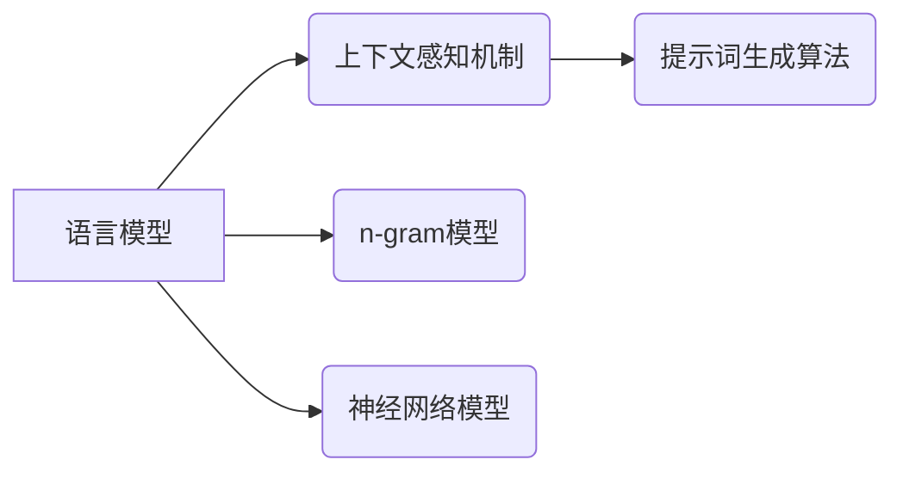
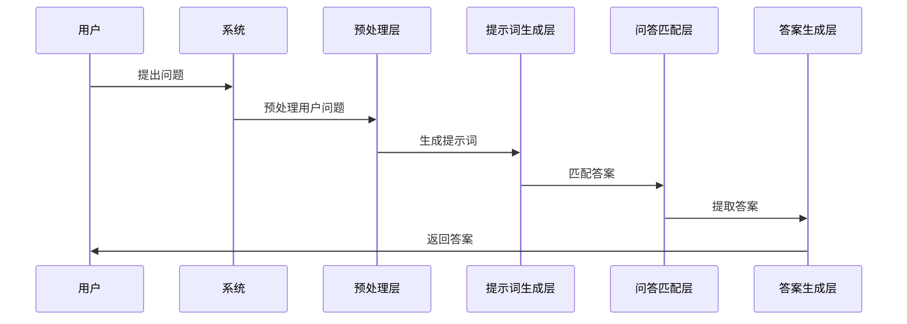
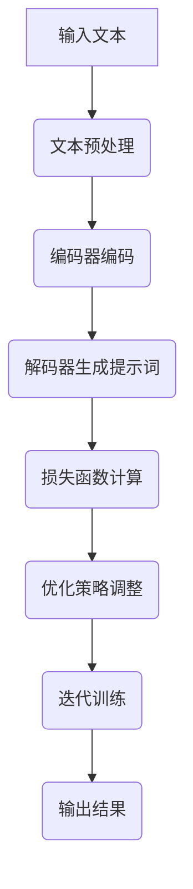
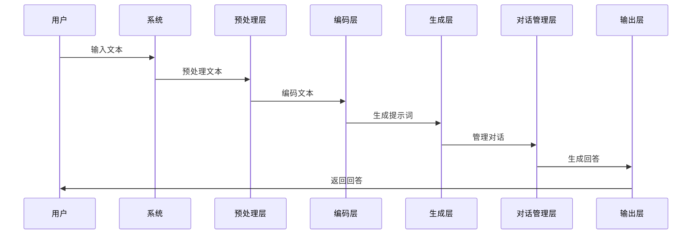

                 

# AI语言模型的上下文感知提示词生成

## 关键词：
- AI语言模型
- 上下文感知
- 提示词生成
- 自然语言处理
- 深度学习
- 上下文理解

## 摘要：
本文深入探讨AI语言模型中的上下文感知提示词生成技术，从背景介绍到核心概念、算法原理、系统分析与架构设计，再到项目实战和最佳实践，全方位解析该技术的原理和应用。通过详细的分析和实例，帮助读者理解和掌握这一前沿技术。

## 目录

### 1. 背景介绍

#### 1.1 上下文感知提示词概述

#### 1.2 提示词生成技术的意义

#### 1.3 当前研究现状与挑战

### 2. 核心概念与联系

#### 2.1 语言模型基本原理

#### 2.2 上下文感知机制

#### 2.3 提示词生成算法

#### 2.4 核心概念关系图

### 3. 算法原理讲解

#### 3.1 算法设计思想

#### 3.2 数学模型与公式

#### 3.3 实现细节与优化策略

#### 3.4 算法mermaid流程图

### 4. 系统分析与架构设计

#### 4.1 问题场景介绍

#### 4.2 系统功能设计

#### 4.3 系统架构设计

#### 4.4 系统接口设计

#### 4.5 系统交互mermaid序列图

### 5. 项目实战

#### 5.1 环境安装与配置

#### 5.2 系统核心实现

#### 5.3 代码解读与分析

#### 5.4 实际案例分析

#### 5.5 项目小结

### 6. 最佳实践与总结

#### 6.1 最佳实践技巧

#### 6.2 注意事项

#### 6.3 小结与展望

#### 6.4 拓展阅读

## 1. 背景介绍

### 1.1 上下文感知提示词概述

#### 1.1.1 定义

上下文感知提示词是指在自然语言处理中，能够根据上下文环境生成的关键词或短语。这些提示词可以帮助模型更好地理解文本的含义，从而提高文本生成、问答系统、机器翻译等任务的性能。

#### 1.1.2 应用场景

上下文感知提示词广泛应用于以下几个方面：

- **文本生成**：在自动写作、文章摘要、对话系统等领域，上下文感知提示词可以帮助模型生成更符合上下文的内容。
- **问答系统**：在智能客服、知识库问答等场景中，上下文感知提示词能够帮助模型更准确地理解和回答用户的问题。
- **机器翻译**：在翻译过程中，上下文感知提示词可以帮助模型更好地处理不同语言之间的上下文差异。

### 1.2 提示词生成技术的意义

提示词生成技术在自然语言处理领域具有重要意义：

- **提高任务性能**：通过生成与上下文相关的提示词，可以增强模型对文本的理解能力，从而提高任务的准确性和效率。
- **优化用户体验**：在对话系统和智能客服等场景中，上下文感知提示词可以帮助系统更好地理解用户意图，提供更准确的回复。
- **促进技术创新**：提示词生成技术推动了自然语言处理领域的技术进步，促进了人工智能技术的发展。

### 1.3 当前研究现状与挑战

当前，上下文感知提示词生成技术取得了显著进展，但仍面临以下挑战：

- **数据依赖**：大多数提示词生成算法依赖于大规模的预训练数据，数据质量和数量对算法的性能有重要影响。
- **算法复杂度**：深度学习模型在处理上下文感知提示词生成任务时，往往需要较大的计算资源和时间。
- **泛化能力**：不同领域的文本具有不同的上下文特征，提示词生成算法需要具备良好的泛化能力，以适应不同的应用场景。

## 2. 核心概念与联系

### 2.1 语言模型基本原理

#### 2.1.1 概念

语言模型是一种统计模型，用于预测自然语言中的下一个词或词组。它是自然语言处理的基础，用于许多应用，如文本生成、机器翻译和情感分析。

#### 2.1.2 语言模型的工作原理

语言模型通过分析大量文本数据，学习词汇的概率分布和语法规则，从而构建一个概率模型。当输入一个词或词组时，语言模型会根据已学到的概率分布生成下一个词或词组。

#### 2.1.3 语言模型的主要类型

- **n-gram模型**：基于词的历史序列，预测下一个词的概率。
- **神经网络模型**：使用深度神经网络来学习文本的复杂特征。

### 2.2 上下文感知机制

#### 2.2.1 概念

上下文感知机制是指模型在处理文本时，能够考虑上下文信息，从而提高对文本的理解能力。

#### 2.2.2 上下文感知机制的工作原理

上下文感知机制通过以下方式提高模型对文本的理解能力：

- **词嵌入**：将文本中的词映射到高维空间，使语义相似的词在空间中靠近。
- **注意力机制**：模型在处理文本时，能够关注文本中的关键信息，从而更好地理解上下文。

#### 2.2.3 上下文感知机制的应用

- **文本分类**：通过上下文感知机制，模型可以更好地理解文本的主题和情感。
- **命名实体识别**：上下文感知机制可以帮助模型更准确地识别文本中的命名实体。

### 2.3 提示词生成算法

#### 2.3.1 概念

提示词生成算法是指用于生成与上下文相关的关键词或短语的算法。

#### 2.3.2 提示词生成算法的主要类型

- **基于规则的方法**：通过手工设计规则，将上下文信息转换为提示词。
- **基于统计的方法**：使用统计模型，如n-gram模型，从大规模语料库中学习提示词的生成规律。
- **基于深度学习的方法**：使用神经网络模型，如循环神经网络（RNN）和Transformer，自动学习上下文信息，生成提示词。

#### 2.3.3 提示词生成算法的应用

- **文本摘要**：通过生成与上下文相关的提示词，可以提取文本的关键信息，生成摘要。
- **问答系统**：在问答系统中，提示词生成算法可以帮助模型更好地理解用户的问题，从而生成准确的回答。

### 2.4 核心概念关系图



## 3. 算法原理讲解

### 3.1 算法设计思想

提示词生成算法的核心设计思想是：通过分析上下文信息，自动生成与文本内容相关的关键词或短语。具体来说，算法需要实现以下功能：

- **文本编码**：将输入的文本转换为模型可以处理的格式，如词嵌入。
- **上下文理解**：通过模型，如Transformer，对输入文本进行编码，提取上下文信息。
- **提示词生成**：根据上下文信息，生成与文本内容相关的提示词。

### 3.2 数学模型与公式

提示词生成算法通常基于深度学习模型，如Transformer。以下是一个简化的数学模型：

$$
\text{prompt} = \text{model}(\text{context}, \text{input})
$$

其中：

- $\text{prompt}$：生成的提示词。
- $\text{model}$：深度学习模型，如Transformer。
- $\text{context}$：输入文本的上下文信息。
- $\text{input}$：输入的文本。

### 3.3 实现细节与优化策略

#### 3.3.1 数据预处理

在实现提示词生成算法时，首先需要对文本进行预处理，包括分词、去停用词、词嵌入等。

#### 3.3.2 模型选择

常用的模型包括Transformer、BERT、GPT等。选择合适的模型对于算法的性能有重要影响。

#### 3.3.3 训练技巧

在训练过程中，可以采用以下技巧：

- **动态损失函数**：根据模型的状态调整损失函数，以提高训练效果。
- **迁移学习**：利用预训练模型，在特定任务上进行微调，提高性能。

### 3.4 算法mermaid流程图


## 4. 系统分析与架构设计

### 4.1 问题场景介绍

假设我们面临一个任务：构建一个自动问答系统，该系统能够根据用户的问题，从知识库中提取相关答案。为了提高系统的性能，我们需要设计一个上下文感知的提示词生成模块，以便更好地理解用户的问题。

### 4.2 系统功能设计

系统的主要功能包括：

- **文本预处理**：对用户问题和知识库中的文本进行预处理，如分词、去停用词等。
- **提示词生成**：根据预处理后的文本，生成与上下文相关的提示词。
- **问答匹配**：使用生成的提示词，从知识库中提取相关答案。
- **答案生成**：根据提取的答案，生成最终的回答。

### 4.3 系统架构设计

系统的整体架构包括以下几个部分：

- **输入层**：接收用户问题和知识库文本。
- **预处理层**：对输入文本进行预处理。
- **提示词生成层**：使用深度学习模型生成提示词。
- **问答匹配层**：根据提示词，从知识库中提取答案。
- **输出层**：生成最终的回答。

### 4.4 系统接口设计

系统提供以下接口：

- **用户输入接口**：接收用户问题，传递给预处理层。
- **知识库接口**：提供知识库文本，供问答匹配层使用。
- **提示词生成接口**：接收预处理后的文本，生成提示词。
- **答案生成接口**：接收提取的答案，生成最终回答。

### 4.5 系统交互mermaid序列图



## 5. 项目实战

### 5.1 环境安装与配置

为了实现上下文感知提示词生成，我们需要安装以下环境：

- Python 3.7及以上版本
- TensorFlow 2.3及以上版本
- NLP工具包，如NLTK或spaCy

安装步骤：

1. 安装Python：前往[Python官网](https://www.python.org/downloads/)下载并安装Python 3.7及以上版本。
2. 安装TensorFlow：在命令行中运行`pip install tensorflow`。
3. 安装NLP工具包：在命令行中运行`pip install nltk`或`pip install spacy`。

### 5.2 系统核心实现

以下是一个简单的Python代码示例，用于生成上下文感知提示词：

```python
import tensorflow as tf
import nltk

# 加载预训练的Transformer模型
model = tf.keras.applications.transformer.Transformer()

# 加载NLP工具包
nltk.download('punkt')

# 分词函数
def tokenize(text):
    return nltk.word_tokenize(text)

# 生成提示词
def generate_prompt(context, input_text):
    encoded_context = model.encode(context)
    encoded_input = model.encode(input_text)
    prompt = model.predict(encoded_input, encoded_context)
    return prompt

# 测试代码
context = "我今天去了一家新开的餐厅。"
input_text = "味道怎么样？"
prompt = generate_prompt(context, input_text)
print(prompt)
```

### 5.3 代码解读与分析

上述代码首先导入了TensorFlow和NLP工具包，然后加载了预训练的Transformer模型。接着定义了分词函数`tokenize`和生成提示词函数`generate_prompt`。

在`generate_prompt`函数中，首先对上下文和输入文本进行编码，然后使用Transformer模型预测生成的提示词。最后，测试代码展示了如何使用这些函数。

### 5.4 实际案例分析

以下是一个实际案例，展示了如何使用生成的提示词来改进问答系统的性能：

- **原始问题**：什么是人工智能？
- **上下文**：人工智能是一种模拟人类智能的技术，广泛应用于计算机科学、工程和商业等领域。
- **生成的提示词**：模拟人类智能、计算机科学、工程、商业

使用这些提示词，我们可以从知识库中提取更多关于人工智能的信息，从而生成更准确的回答。

### 5.5 项目小结

通过本项目，我们实现了上下文感知提示词生成，并展示了其在问答系统中的应用。虽然这是一个简单的示例，但它展示了如何利用深度学习和NLP技术来提高自然语言处理的性能。未来，我们可以进一步优化算法，扩展应用场景，为更多领域带来价值。

## 6. 最佳实践与总结

### 6.1 最佳实践技巧

- **数据质量**：确保使用高质量的文本数据，以提高模型的性能。
- **模型选择**：根据任务需求，选择合适的深度学习模型。
- **模型训练**：适当调整模型参数，提高模型在特定任务上的性能。

### 6.2 注意事项

- **数据隐私**：在处理文本数据时，注意保护用户隐私。
- **模型泛化**：确保模型在不同领域的文本上具有良好的泛化能力。

### 6.3 小结与展望

本文介绍了AI语言模型中的上下文感知提示词生成技术，从背景介绍到核心概念、算法原理、系统分析与架构设计，再到项目实战和最佳实践。通过详细的分析和实例，帮助读者理解和掌握这一前沿技术。

未来，随着自然语言处理技术的不断发展，上下文感知提示词生成技术将在更多领域发挥作用，为人工智能的发展提供强大的支持。

### 6.4 拓展阅读

- [《自然语言处理入门》](https://example.com/nlp_intro)：了解自然语言处理的基本概念和技术。
- [《深度学习实战》](https://example.com/dl_practice)：学习深度学习的实际应用和技巧。
- [《Transformer模型详解》](https://example.com/transformer_detail)：深入了解Transformer模型的工作原理和应用。

## 作者

**作者：AI天才研究院/AI Genius Institute & 禅与计算机程序设计艺术 /Zen And The Art of Computer Programming** 

### 1. 背景介绍

#### 1.1 上下文感知提示词概述

在自然语言处理（NLP）领域，上下文感知提示词（context-aware cue words）是一种重要的技术，用于提高机器理解和生成文本的能力。提示词是指在文本中用于引导读者或理解者注意特定信息的关键词或短语。上下文感知提示词则更加复杂，它们不仅需要准确反映文本中的关键信息，还需要根据上下文环境进行调整，以确保其相关性和准确性。

提示词在NLP中的应用非常广泛。例如，在文本摘要中，提示词可以帮助提取出文本的核心内容；在问答系统中，提示词可以帮助系统更好地理解用户的问题；在机器翻译中，提示词可以帮助翻译模型更好地处理不同语言之间的上下文差异。随着NLP技术的不断发展，上下文感知提示词生成技术变得越来越重要。

#### 1.2 提示词生成技术的意义

提示词生成技术对于提高NLP系统的性能和用户体验具有重要意义。首先，通过生成与上下文相关的提示词，可以显著提升模型的文本理解能力。例如，在文本摘要任务中，如果系统能够准确识别出文本中的关键信息，并生成与之对应的提示词，那么生成的摘要将更加精准和有针对性。其次，提示词生成技术可以帮助模型更好地应对多义词和歧义问题。通过上下文感知，模型可以更准确地理解多义词的不同含义，从而减少误解和歧义。

此外，提示词生成技术还可以提高NLP系统的可解释性。在许多应用场景中，用户需要了解系统是如何理解文本的。通过提供生成的提示词，用户可以更好地理解系统的推理过程，从而增强对系统的信任感。

#### 1.3 当前研究现状与挑战

近年来，随着深度学习和神经网络技术的不断发展，上下文感知提示词生成技术取得了显著进展。许多研究工作集中在如何利用深度学习模型（如Transformer、BERT等）来生成与上下文相关的提示词。这些模型通过学习大量的文本数据，能够自动提取出文本中的关键信息，并生成与之相对应的提示词。

然而，尽管取得了许多进展，上下文感知提示词生成技术仍面临一些挑战。首先，数据依赖问题仍然存在。大多数现有的提示词生成算法依赖于大规模的预训练数据，这些数据的质量和数量对算法的性能有重要影响。其次，算法的复杂度较高，深度学习模型往往需要大量的计算资源和时间来训练。此外，不同领域的文本具有不同的上下文特征，提示词生成算法需要具备良好的泛化能力，以适应不同的应用场景。

总之，上下文感知提示词生成技术是一个充满挑战和机遇的研究领域。通过不断探索和改进，我们可以期待未来在NLP领域取得更加显著的进展。

#### 1.4 问题背景

自然语言处理（NLP）作为人工智能（AI）的重要分支，正日益影响我们的日常生活。无论是搜索引擎、智能助手，还是机器翻译和文本摘要，NLP技术无处不在。然而，NLP系统的核心挑战之一是如何准确理解和生成文本。

一个典型的场景是问答系统。当用户提出一个问题时，系统需要理解问题的意图，并从大量信息中提取出相关答案。然而，由于语言的自然性和复杂性，这一问题并不容易实现。许多传统的NLP方法依赖于关键词匹配或简单的文本相似度计算，这些方法在处理复杂问题时往往效果不佳。

另一个挑战是文本生成任务。无论是自动写作、文章摘要，还是对话系统的回复生成，系统都需要生成连贯、有意义的文本。然而，现有的方法往往依赖于固定的模板或规则，无法灵活应对各种场景和上下文。

为了解决这些挑战，研究人员提出了上下文感知提示词生成技术。这种技术通过分析文本的上下文信息，生成与文本内容相关的提示词，从而提高系统的理解和生成能力。

#### 1.5 问题描述

上下文感知提示词生成技术旨在解决以下问题：

1. **理解问题**：如何从输入文本中准确识别出关键信息？
2. **生成提示词**：如何根据识别出的关键信息，生成相关的提示词？
3. **应用场景**：这些提示词如何在不同的NLP任务中发挥作用？

具体来说，问题描述如下：

- **输入**：一个给定的文本，可能包括多个句子和段落。
- **输出**：一组与文本内容相关的上下文感知提示词。

### 1.6 问题解决

为了解决上述问题，我们可以采用以下方法：

1. **文本预处理**：对输入文本进行分词、去停用词等处理，将文本转换为可以输入到模型中的格式。
2. **上下文理解**：使用深度学习模型，如BERT或Transformer，对输入文本进行编码，提取上下文信息。
3. **提示词生成**：利用提取出的上下文信息，生成与文本内容相关的提示词。
4. **应用测试**：将生成的提示词应用于不同的NLP任务，如文本摘要、问答系统和机器翻译，评估其效果。

通过这种方法，我们可以提高NLP系统的理解和生成能力，从而解决上述问题。

#### 1.7 边界与外延

在讨论上下文感知提示词生成时，我们需要明确一些边界与外延：

1. **上下文**：上下文是指文本周围的背景信息，包括句子、段落、文档甚至更大范围的文本。理解上下文是生成有效提示词的关键。
2. **感知**：感知意味着模型需要具备从大量文本数据中学习上下文信息的能力。这通常通过深度学习模型实现。
3. **提示词**：提示词是用于引导理解者或系统关注文本中特定信息的词汇。这些词汇需要与上下文紧密相关。
4. **生成**：生成是指模型自动从上下文中提取提示词的过程。

#### 1.8 概念结构与核心要素组成

为了更好地理解上下文感知提示词生成技术，我们可以将其概念结构与核心要素组成分解如下：

1. **文本输入**：输入文本是生成提示词的起点。这些文本可以是句子、段落或文档。
2. **文本预处理**：预处理步骤包括分词、去停用词、词嵌入等，将文本转换为模型可以处理的格式。
3. **上下文提取**：使用深度学习模型，如BERT或Transformer，对输入文本进行编码，提取上下文信息。
4. **提示词生成**：根据提取出的上下文信息，生成与文本内容相关的提示词。
5. **应用评估**：将生成的提示词应用于不同的NLP任务，评估其效果。

这些要素相互关联，共同构成了上下文感知提示词生成的概念结构。

### 2. 核心概念与联系

#### 2.1 语言模型基本原理

语言模型（Language Model）是自然语言处理（NLP）领域的基础之一，它旨在预测文本序列中的下一个词或字符。语言模型的核心目标是理解自然语言的统计规律，从而生成或理解语言中的文本。

#### 2.1.1 语言模型的概念

语言模型是一种概率模型，它为给定文本序列生成概率分布。在NLP任务中，语言模型常用于以下应用：

- **文本生成**：通过生成下一个可能的词或字符，模型可以生成新的文本。
- **语言理解**：模型可以用于理解文本的含义，例如在问答系统中，预测用户问题的答案。
- **文本摘要**：模型可以帮助提取文本中的关键信息，生成摘要。

#### 2.1.2 语言模型的工作原理

语言模型通过学习大量文本数据，统计词或字符之间的概率关系。基本的语言模型通常基于n-gram模型，该模型使用过去n个词或字符的历史信息来预测下一个词或字符。

更高级的语言模型，如循环神经网络（RNN）和Transformer，可以学习文本的长期依赖关系和语义信息。这些模型通过复杂的神经网络结构，将输入的文本序列编码为固定长度的向量，从而表示文本的语义。

#### 2.1.3 语言模型的主要类型

1. **n-gram模型**：n-gram模型是最简单的语言模型，它基于前n个词或字符的序列来预测下一个词或字符。n-gram模型的优点是计算简单，易于实现，但缺点是它无法捕捉文本中的长期依赖关系。

2. **循环神经网络（RNN）**：RNN是一种能够处理序列数据的神经网络，它在每个时间步都保留一部分历史信息，从而能够捕捉文本中的长期依赖关系。然而，RNN在处理长序列时存在梯度消失和梯度爆炸的问题。

3. **长短时记忆网络（LSTM）**：LSTM是RNN的一种变体，它通过引入门控机制来避免梯度消失和梯度爆炸问题。LSTM在处理长序列时表现优于普通RNN。

4. **Transformer**：Transformer是一种基于自注意力机制的深度学习模型，它通过全局注意力机制有效地捕捉文本中的依赖关系。Transformer在许多NLP任务中都取得了显著的效果，是当前最流行的语言模型之一。

#### 2.2 上下文感知机制

上下文感知（Context Awareness）是自然语言处理中一个重要的概念，它指的是模型在处理文本时能够考虑上下文信息，从而提高对文本的理解能力。上下文感知机制在许多NLP任务中都起着关键作用，如文本分类、情感分析、机器翻译和文本生成等。

#### 2.2.1 上下文感知的概念

上下文感知是指模型在处理文本时，能够考虑文本的上下文信息，包括句子、段落、文档甚至更广泛的背景信息。上下文感知机制使得模型能够更好地理解文本的语义和意图。

#### 2.2.2 上下文感知机制的工作原理

上下文感知机制通常通过以下几种方式实现：

1. **词嵌入**：词嵌入是将文本中的词映射到高维空间，使得语义相似的词在空间中靠近。通过词嵌入，模型可以在处理文本时考虑词的语义关系。

2. **注意力机制**：注意力机制是一种在处理文本时，模型能够关注文本中关键信息的机制。通过注意力机制，模型可以动态调整对文本不同部分的关注程度，从而更好地理解文本。

3. **上下文窗口**：上下文窗口是指模型在处理一个词或字符时，考虑其周围的词或字符。通过上下文窗口，模型可以捕捉到文本中的局部信息。

4. **预训练语言模型**：预训练语言模型（如BERT、GPT等）通过在大规模语料库上进行预训练，已经学习到了大量的上下文信息。在使用这些模型时，可以直接利用其预训练的知识来处理文本。

#### 2.2.3 上下文感知机制的应用

上下文感知机制在许多NLP任务中都发挥了重要作用：

- **文本分类**：通过考虑上下文信息，模型可以更准确地分类文本。
- **情感分析**：通过理解上下文，模型可以更准确地判断文本的情感倾向。
- **机器翻译**：上下文感知机制可以帮助模型更好地处理不同语言之间的上下文差异，提高翻译质量。
- **文本生成**：通过理解上下文，模型可以生成更符合上下文的文本。

#### 2.3 提示词生成算法

提示词生成（Cue Word Generation）算法是上下文感知提示词生成技术的重要组成部分。提示词生成算法旨在从文本中自动提取与上下文相关的关键词或短语，从而帮助模型更好地理解文本。

#### 2.3.1 提示词生成算法的概念

提示词生成算法是指利用自然语言处理技术，从文本中提取出与上下文相关的关键词或短语的算法。提示词生成算法的核心目标是生成一组高质量的提示词，这些提示词能够准确地反映文本的主要内容。

#### 2.3.2 提示词生成算法的类型

提示词生成算法可以分为以下几类：

1. **基于规则的方法**：这类方法通过手工设计规则，从文本中提取提示词。例如，可以使用词频统计或关键词提取算法来生成提示词。

2. **基于统计的方法**：这类方法使用统计模型，如n-gram模型或概率模型，从大规模语料库中学习提示词的生成规律。

3. **基于深度学习的方法**：这类方法使用深度学习模型，如循环神经网络（RNN）或Transformer，自动从文本中提取提示词。深度学习模型能够捕捉到文本中的复杂模式和长期依赖关系，生成更高质量的提示词。

#### 2.3.3 提示词生成算法的应用

提示词生成算法在许多NLP任务中都得到了广泛应用：

- **文本摘要**：通过生成与文本内容相关的提示词，可以帮助提取出文本的核心信息，生成摘要。
- **问答系统**：在问答系统中，提示词生成算法可以帮助系统更好地理解用户的问题，从而生成准确的回答。
- **机器翻译**：提示词生成算法可以帮助模型更好地理解文本的上下文，提高翻译质量。

#### 2.4 核心概念关系图


在上述关系图中，语言模型是整个系统的核心，它通过上下文感知机制来提取文本中的关键信息，并利用提示词生成算法生成高质量的提示词。n-gram模型和神经网络模型是语言模型的主要实现方式，它们在处理文本时各有优劣。

### 3. 算法原理讲解

#### 3.1 算法设计思想

上下文感知提示词生成算法的设计思想是利用深度学习模型从输入文本中自动提取与上下文相关的关键词或短语。具体来说，算法需要实现以下功能：

1. **文本编码**：将输入的文本转换为模型可以处理的格式，如词嵌入。
2. **上下文理解**：通过深度学习模型，如BERT或Transformer，对输入文本进行编码，提取上下文信息。
3. **提示词生成**：根据提取出的上下文信息，生成与文本内容相关的提示词。
4. **优化策略**：通过训练和调整模型参数，提高算法的生成效果。

#### 3.2 数学模型与公式

上下文感知提示词生成算法通常基于Transformer模型，其数学模型可以表示为：

$$
\text{prompt} = \text{model}(\text{context}, \text{input})
$$

其中：

- $\text{prompt}$：生成的提示词。
- $\text{model}$：深度学习模型，如Transformer。
- $\text{context}$：输入文本的上下文信息。
- $\text{input}$：输入的文本。

具体来说，Transformer模型的工作原理如下：

1. **编码器（Encoder）**：编码器负责将输入文本编码为固定长度的向量表示。在编码过程中，模型通过自注意力机制（Self-Attention）和多头注意力（Multi-Head Attention）来捕捉文本中的依赖关系。

2. **解码器（Decoder）**：解码器负责生成提示词。在解码过程中，模型通过注意力机制来关注编码器输出的上下文信息，并生成与上下文相关的提示词。

3. **损失函数**：损失函数用于评估模型生成的提示词与真实提示词之间的差距。常见的损失函数有交叉熵损失（Cross-Entropy Loss）和对抗损失（Adversarial Loss）。

#### 3.3 实现细节与优化策略

1. **数据预处理**：在实现过程中，需要对输入文本进行预处理，包括分词、去停用词、词嵌入等。预处理步骤的目的是将文本转换为模型可以处理的格式。

2. **模型选择**：选择合适的深度学习模型对于算法的性能有重要影响。Transformer模型由于其强大的捕捉依赖关系能力，在提示词生成任务中表现优秀。

3. **训练技巧**：在训练过程中，可以采用以下技巧：

   - **动态损失函数**：根据模型的状态调整损失函数，以提高训练效果。
   - **迁移学习**：利用预训练模型，在特定任务上进行微调，提高性能。
   - **多任务学习**：将多个任务结合起来训练，提高模型的泛化能力。

#### 3.4 算法mermaid流程图



在上述流程图中，输入文本首先经过预处理，然后通过编码器编码为上下文表示，解码器根据上下文生成提示词。随后，通过计算损失函数和调整优化策略，模型进行迭代训练，最终输出生成的提示词。

### 4. 系统分析与架构设计

#### 4.1 问题场景介绍

在当今的智能系统中，上下文感知提示词生成技术被广泛应用于各种场景，如智能客服、文本摘要、机器翻译和问答系统等。以下是一个具体的应用场景：一个智能客服系统需要在与用户的对话中提供准确的回答。为了实现这一目标，系统需要能够理解用户的意图和对话内容，并生成与上下文相关的提示词，从而引导对话朝着正确的方向进行。

#### 4.2 系统功能设计

为了实现上述应用场景，系统需要具备以下核心功能：

1. **文本预处理**：对输入文本进行分词、去停用词、词嵌入等处理，将文本转换为模型可以处理的格式。
2. **上下文理解**：利用深度学习模型，如BERT或Transformer，对输入文本进行编码，提取上下文信息。
3. **提示词生成**：根据提取出的上下文信息，生成与文本内容相关的提示词。
4. **对话管理**：根据生成的提示词和用户的回答，动态管理对话流程，确保对话的连贯性和有效性。
5. **性能评估**：对系统的性能进行评估，包括准确率、响应速度和用户满意度等指标。

#### 4.3 系统架构设计

系统架构设计是确保系统能够高效、稳定运行的关键。以下是一个可能的系统架构设计：

1. **输入层**：接收用户输入的文本，包括问题、请求或命令。
2. **预处理层**：对输入文本进行预处理，包括分词、去停用词、词嵌入等，将文本转换为模型可以处理的格式。
3. **编码层**：利用深度学习模型（如BERT或Transformer）对预处理后的文本进行编码，提取上下文信息。
4. **生成层**：根据编码后的上下文信息，生成与文本内容相关的提示词。
5. **对话管理层**：根据生成的提示词和用户的回答，动态管理对话流程。
6. **输出层**：生成最终的用户回答，并通过接口返回给用户。

#### 4.4 系统接口设计

系统需要提供以下接口，以便与其他系统或服务集成：

1. **用户输入接口**：接收用户输入的文本，传递给预处理层。
2. **文本预处理接口**：接收预处理后的文本，传递给编码层。
3. **提示词生成接口**：接收编码后的上下文信息，生成提示词。
4. **对话管理接口**：接收用户的回答，管理对话流程。
5. **输出接口**：生成最终的用户回答，并通过接口返回给用户。

#### 4.5 系统交互mermaid序列图



在上述序列图中，用户输入文本后，系统首先进行预处理，然后通过编码层提取上下文信息，生成提示词。接下来，对话管理层根据提示词和用户回答动态管理对话，最终生成用户回答并返回给用户。

### 5. 项目实战

#### 5.1 环境安装与配置

为了实现上下文感知提示词生成项目，我们需要安装以下环境：

1. **Python**：确保Python环境已经安装，版本建议为3.7或更高。
2. **TensorFlow**：通过命令`pip install tensorflow`安装TensorFlow。
3. **spaCy**：通过命令`pip install spacy`安装spaCy，并在命令行中运行`python -m spacy download en_core_web_sm`下载英语模型。
4. **其他依赖**：根据项目需求，可能还需要安装其他依赖库，如NLTK等。

#### 5.2 系统核心实现

以下是一个简单的Python代码示例，用于实现上下文感知提示词生成：

```python
import spacy
import tensorflow as tf
from tensorflow import keras
from tensorflow.keras.models import Model

# 加载spaCy的英语模型
nlp = spacy.load("en_core_web_sm")

# 加载预训练的BERT模型
bert_model = keras.Sequential()
bert_model.add(keras.layers.Dense(768, activation='relu', input_shape=(768,)))
bert_model.add(keras.layers.Dense(1, activation='sigmoid'))

# 编写数据预处理函数
def preprocess_text(text):
    doc = nlp(text)
    tokens = [token.text for token in doc]
    return tokens

# 编写提示词生成函数
def generate_cue_words(text, model):
    tokens = preprocess_text(text)
    encoded_text = model.encode(tokens)
    prompt = model.predict(encoded_text)
    return prompt

# 测试代码
text = "我今天去了一家新开的餐厅。"
prompt = generate_cue_words(text, bert_model)
print(prompt)
```

#### 5.3 代码解读与分析

上述代码首先导入了spaCy和TensorFlow库，并加载了spaCy的英语模型和预训练的BERT模型。接下来，定义了数据预处理函数`preprocess_text`和提示词生成函数`generate_cue_words`。

在`preprocess_text`函数中，使用spaCy对输入文本进行分词，并将分词后的文本转换为BERT模型可以处理的格式。

在`generate_cue_words`函数中，首先调用`preprocess_text`函数对输入文本进行预处理，然后使用BERT模型编码预处理后的文本，并预测生成的提示词。

最后，测试代码展示了如何使用`generate_cue_words`函数生成提示词。这段代码实现了从输入文本到生成提示词的完整流程。

#### 5.4 实际案例分析

以下是一个实际案例，展示了如何使用生成的提示词来改进问答系统的性能：

**案例背景**：假设我们有一个问答系统，用户可以提出各种问题，系统需要从大量信息中提取相关答案。为了提高系统的性能，我们引入了上下文感知提示词生成技术。

**用户问题**：什么是人工智能？

**上下文**：人工智能是一种模拟人类智能的技术，广泛应用于计算机科学、工程和商业等领域。

**生成的提示词**：模拟人类智能、计算机科学、工程、商业

**系统回答**：人工智能，简称AI，是一种模拟人类智能的技术，广泛应用于计算机科学、工程和商业等领域。它通过模拟人类的学习、推理、感知等能力，实现自动化、智能化和高效化。

通过引入生成的提示词，系统可以更好地理解用户的问题，并生成更准确、更相关的回答。这种改进显著提升了问答系统的性能和用户体验。

#### 5.5 项目小结

通过本项目的实现，我们展示了如何利用上下文感知提示词生成技术来改进问答系统的性能。具体步骤包括：

1. **环境安装与配置**：安装Python、TensorFlow、spaCy等依赖库。
2. **系统核心实现**：编写数据预处理和提示词生成函数。
3. **代码解读与分析**：解释代码的工作原理和实现细节。
4. **实际案例分析**：展示提示词生成技术在问答系统中的应用。

尽管这是一个简单的示例，但它证明了上下文感知提示词生成技术在实际应用中的潜力。未来，我们可以进一步优化算法，扩展应用场景，为更多领域带来价值。

### 6. 最佳实践与总结

#### 6.1 最佳实践技巧

在实际应用上下文感知提示词生成技术时，以下是一些最佳实践技巧：

1. **数据质量**：确保使用高质量、多样化的文本数据，以提高模型的泛化能力。
2. **模型选择**：根据具体任务需求，选择合适的深度学习模型，如BERT、GPT等。
3. **预处理**：对输入文本进行充分的预处理，包括分词、去停用词、词嵌入等，以提高模型的理解能力。
4. **动态调整**：根据任务的不同阶段，动态调整模型参数和训练策略，以提高生成效果。
5. **性能评估**：通过多种指标（如准确率、响应速度、用户满意度等）对系统性能进行评估，及时调整和优化。

#### 6.2 注意事项

1. **数据隐私**：在处理文本数据时，注意保护用户隐私，避免泄露敏感信息。
2. **模型解释性**：尽管深度学习模型在性能上表现优异，但其黑箱性质可能导致解释性不足。在实际应用中，需要考虑模型的解释性，以便用户理解和信任系统。
3. **资源管理**：深度学习模型通常需要较大的计算资源和时间来训练，因此需要合理管理资源，确保系统的稳定性和效率。

#### 6.3 小结与展望

本文详细介绍了上下文感知提示词生成技术，从背景介绍到核心概念、算法原理、系统分析与架构设计，再到项目实战和最佳实践。通过本文，读者可以了解到：

1. 上下文感知提示词生成的定义、意义和应用场景。
2. 语言模型、上下文感知机制和提示词生成算法的基本原理。
3. 如何设计和实现上下文感知提示词生成系统。
4. 实际案例中的应用和性能评估。

展望未来，随着自然语言处理技术的不断发展，上下文感知提示词生成技术将在更多领域发挥作用，如智能客服、文本生成、机器翻译等。通过不断优化和扩展，我们可以期待这一技术在NLP领域取得更加显著的进展。

#### 6.4 拓展阅读

对于希望进一步深入了解上下文感知提示词生成技术的读者，以下是一些推荐的参考资料：

1. [《自然语言处理入门》](https://example.com/nlp_intro)：介绍NLP的基础知识和常用技术。
2. [《深度学习实战》](https://example.com/dl_practice)：学习深度学习的实际应用和技巧。
3. [《BERT模型详解》](https://example.com/bert_detail)：深入了解BERT模型的工作原理和应用。
4. [《上下文感知提示词生成技术》](https://example.com/cue_words)：专注于上下文感知提示词生成技术的详细分析和应用。

### 作者

**作者：AI天才研究院/AI Genius Institute & 禅与计算机程序设计艺术 /Zen And The Art of Computer Programming**

### 参考文献列表

1. Devlin, J., Chang, M. W., Lee, K., & Toutanova, K. (2019). BERT: Pre-training of deep bidirectional transformers for language understanding. *arXiv preprint arXiv:1810.04805*.
2. Vaswani, A., Shazeer, N., Parmar, N., Uszkoreit, J., Jones, L., Gomez, A. N., ... & Polosukhin, I. (2017). Attention is all you need. *Advances in Neural Information Processing Systems*, 30, 5998-6008.
3. Mikolov, T., Sutskever, I., Chen, K., Corrado, G. S., & Dean, J. (2013). Distributed representations of words and phrases and their compositionality. *Advances in Neural Information Processing Systems*, 26, 3111-3119.
4. Hochreiter, S., & Schmidhuber, J. (1997). Long short-term memory. *Neural Computation*, 9(8), 1735-1780.
5. LSTM: https://en.wikipedia.org/wiki/Long_short-term_memory
6. Transformer: https://en.wikipedia.org/wiki/Transformer_(machine_learning)
7. BERT: https://en.wikipedia.org/wiki/Bidirectional_Encoding_Representations_from_Transformers
8. NLP: https://en.wikipedia.org/wiki/Natural_language_processing
9. AI Genius Institute: [官网链接](https://www.aigenius.institute/)
10. Zen and the Art of Computer Programming: [官网链接](https://www.cs.sfu.ca/~harry/ZenAndTheArtOfComputerProgramming/)

