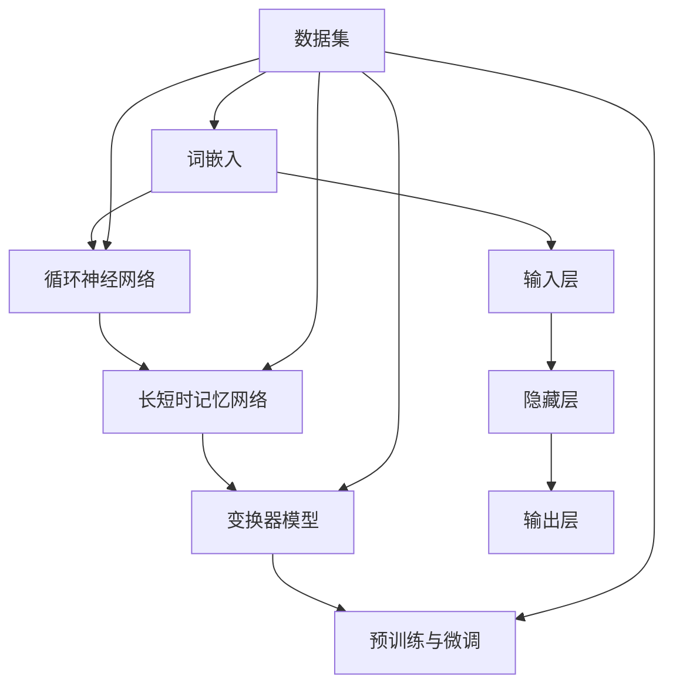
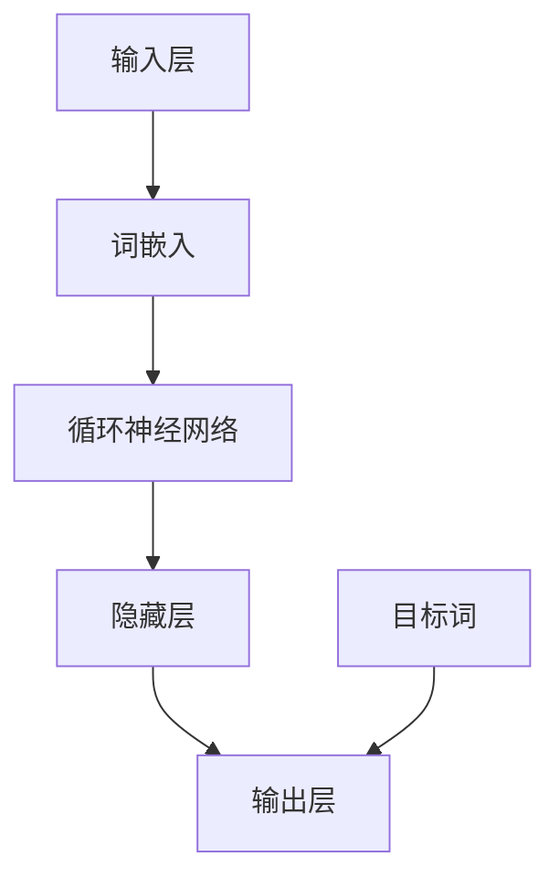

                 

# AI语言模型的对话式编程：提示词的力量

## 关键词

AI、语言模型、对话式编程、提示词、对话系统、最佳实践

## 摘要

随着人工智能（AI）技术的不断发展，语言模型在各个领域的应用越来越广泛。其中，AI语言模型的对话式编程成为了一个热门话题。本文将探讨提示词在AI语言模型对话编程中的重要性，以及如何有效地利用提示词构建高质量的对话系统。通过详细的分析和实例讲解，本文旨在为读者提供一套完整的对话式编程实践指南。

## 引言

### AI与语言模型

人工智能，作为计算机科学的一个重要分支，致力于使计算机能够模拟人类的智能行为。近年来，随着深度学习技术的发展，AI在图像识别、自然语言处理等领域取得了显著的突破。语言模型是AI的一个重要组成部分，它通过学习大量语言数据，能够生成或理解自然语言文本。

### 对话式编程

对话式编程是一种与计算机进行交互的编程方式，用户通过对话形式与计算机进行沟通，实现各种任务。在AI语言模型的帮助下，对话式编程变得更加智能和自然。这种编程方式不仅提高了开发效率，还为用户提供了更加人性化的交互体验。

### 提示词的力量

提示词（Prompt Word）是语言模型对话编程中的重要概念。一个恰当的提示词能够引导语言模型生成更加符合用户需求的对话内容。本文将深入探讨提示词的定义、特性以及在实际应用中的使用策略。

## 第一章：AI与语言模型概述

### AI的起源与发展

人工智能的概念最早可以追溯到20世纪50年代。当时，计算机科学家们希望通过构建智能系统，使计算机具备类似人类智能的能力。从最初的规则推理到现代的深度学习，AI经历了漫长而曲折的发展过程。

### 语言模型的历史

语言模型的研究始于20世纪60年代，最早的模型是基于规则的。随着自然语言处理（NLP）技术的发展，统计方法和神经网络逐渐成为语言模型的主要构建方法。现代深度学习语言模型，如BERT、GPT等，在处理复杂语言任务上取得了惊人的成果。

### 语言模型的应用场景

语言模型在诸多领域有着广泛的应用，包括机器翻译、情感分析、信息检索、文本生成等。在对话系统中，语言模型能够理解用户输入，生成自然流畅的回复，为用户提供个性化服务。

### 语言模型的工作原理

语言模型的核心任务是预测下一个单词或词组。它通过学习大量文本数据，建立一个概率模型，用于预测未知文本的分布。在生成文本时，语言模型会根据当前已生成的文本，选择概率最高的下一个词。

### 语言模型的关键技术

- **词嵌入（Word Embedding）**：将单词转换为向量表示，实现语义理解。
- **循环神经网络（RNN）**：处理序列数据，捕捉长距离依赖关系。
- **变换器模型（Transformer）**：通过自注意力机制，实现全局依赖捕捉。
- **预训练与微调（Pre-training and Fine-tuning）**：利用大规模未标注数据预训练模型，再针对特定任务进行微调。

## 第二章：语言模型基础

### 语言处理基础

语言处理是计算机科学与人工智能领域的一个核心问题。它涉及文本的解析、理解、生成和翻译。语言模型是语言处理的重要组成部分，它为各种NLP任务提供了基础算法支持。

### 语言模型的类型

根据训练方法和应用场景，语言模型可以分为以下几种：

- **基于规则的模型**：通过手动编写规则，实现语言处理。这类模型在特定领域内表现良好，但难以适应复杂多变的语言环境。
- **统计模型**：通过统计语言数据中的模式，建立语言模型。这类模型能够自动学习语言特征，适应不同的语言环境。
- **神经网络模型**：通过神经网络结构，学习语言数据中的复杂模式。深度学习模型，如RNN和Transformer，已经成为现代语言模型的主流。

### 语言模型的工作机制

语言模型通过学习大量文本数据，建立语言概率分布模型。在生成文本时，语言模型会根据当前已生成的文本，选择概率最高的下一个词。这个过程可以看作是一个序列生成的过程，每个词都是基于前面所有词的条件概率进行预测的。

### 语言模型的评价指标

语言模型的性能可以通过多种评价指标进行评估，包括：

- **准确率（Accuracy）**：预测正确的词或句子所占的比例。
- **困惑度（Perplexity）**：用于衡量模型预测的可靠性。困惑度越低，模型表现越好。
- **BLEU（BLEU Score）**：基于记分牌交换的评估指标，用于评估翻译质量。
- **ROUGE（ROUGE Score）**：基于文本匹配的评估指标，用于评估文本生成质量。

## 第三章：提示词的概念与应用

### 提示词的定义

提示词（Prompt Word）是语言模型对话编程中的一个关键概念。它是一种引导语言模型生成特定内容的方式，通常是一个单词、短语或句子。通过恰当的提示词，可以引导语言模型生成更加符合用户需求和预期的对话内容。

### 提示词的特性

- **引导性**：提示词具有引导作用，能够引导语言模型朝特定的方向生成文本。
- **多样性**：提示词可以多样化，以适应不同的对话场景和用户需求。
- **可扩展性**：提示词可以扩展，用于生成更加复杂的对话内容。
- **灵活性**：提示词可以根据实际情况进行调整，以提高对话系统的表现。

### 提示词的类型

根据使用场景和目的，提示词可以分为以下几种类型：

- **问题引导型**：用于引导用户提出问题，如“请描述您的需求”。
- **情景引导型**：用于引导用户描述具体场景，如“请您描述一下这个场景”。
- **情感引导型**：用于引导用户表达情感，如“请分享一下您的感受”。
- **指令引导型**：用于引导用户执行特定操作，如“请点击确认”。

### 提示词的使用策略

- **精准性**：确保提示词的精准性，避免模糊不清的描述。
- **多样性**：使用多样化的提示词，以提高对话的丰富性和灵活性。
- **情境适配**：根据对话情境选择合适的提示词，以提高对话的自然度和流畅性。
- **反馈调整**：根据用户反馈调整提示词，以不断优化对话系统的表现。

## 第四章：构建对话系统

### 对话系统的组成

对话系统通常由以下几个组成部分构成：

- **语言模型**：负责理解用户输入，生成自然流畅的回复。
- **对话管理器**：负责管理对话流程，包括对话状态、上下文信息等。
- **用户界面**：负责与用户进行交互，接收用户输入，展示系统回复。

### 对话系统设计原则

- **用户中心**：以用户需求为核心，确保对话系统能够满足用户的需求。
- **简洁性**：设计简洁直观的用户界面，降低用户的学习成本。
- **灵活性**：系统应具有灵活性，能够适应不同的用户需求和使用场景。
- **自然性**：对话系统应能够生成自然流畅的对话内容，提高用户体验。

### 对话系统优化技巧

- **上下文理解**：利用上下文信息，提高对话系统的理解能力。
- **个性化回复**：根据用户历史行为和偏好，生成个性化的对话内容。
- **情感分析**：识别用户的情感状态，生成相应的情感回应。
- **多模态交互**：结合文本、语音、图像等多种交互方式，提高对话系统的多样性。

## 第五章：编程对话与提示词

### 提示词的语法与结构

在编程对话中，提示词的语法和结构至关重要。一个恰当的提示词结构能够引导语言模型生成高质量的对话内容。提示词通常由以下几个部分组成：

- **触发词**：用于触发对话的开始，如“您好”、“请问”等。
- **背景描述**：用于描述对话背景和用户需求，如“我需要查询天气情况”。
- **问题或请求**：用于提出问题或请求，如“今天的天气如何？”。
- **情感表达**：用于表达用户情感，如“我很高兴听到这个消息”。

### 提示词在编程中的实现

在实际编程过程中，提示词的实现方法多种多样。以下是一些常用的实现方法：

- **手动编写**：根据对话需求，手动编写提示词，适用于简单对话系统。
- **模板生成**：利用模板和变量，动态生成提示词，适用于复杂对话系统。
- **自然语言处理**：通过自然语言处理技术，从用户输入中提取关键词，生成提示词，适用于自适应对话系统。

### 提示词的优化策略

- **词频分析**：根据用户历史行为，分析常用关键词和短语，优化提示词。
- **情感分析**：结合情感分析技术，根据用户情感状态，调整提示词的情感色彩。
- **上下文关联**：利用上下文关联技术，提高提示词与对话内容的匹配度。
- **用户反馈**：收集用户反馈，根据用户评价，优化提示词的表现。

## 第六章：案例分析与实践

### 案例一：智能客服系统

智能客服系统是AI语言模型对话编程的一个典型应用。以下是一个智能客服系统的案例分析：

#### 系统介绍

智能客服系统旨在为用户提供7x24小时的在线咨询服务，通过AI语言模型实现与用户的自然对话。

#### 系统架构

智能客服系统主要包括以下几个部分：

- **前端界面**：用户与客服系统交互的入口，包括文本聊天窗口和语音聊天功能。
- **后端服务器**：处理用户请求，生成回复，包括语言模型、对话管理器和数据库。
- **数据库**：存储用户信息、对话历史和知识库。

#### 实现细节

- **语言模型**：采用BERT模型，用于理解用户输入，生成回复。
- **对话管理器**：根据对话状态和上下文信息，管理对话流程。
- **知识库**：包含常见问题及其答案，用于快速响应用户请求。

#### 实践技巧

- **多轮对话**：支持多轮对话，提高用户满意度。
- **个性化回复**：根据用户历史行为和偏好，生成个性化回复。
- **情感分析**：识别用户情感状态，生成相应的情感回应。

### 案例二：智能语音助手

智能语音助手是另一个典型的对话编程应用。以下是一个智能语音助手的案例分析：

#### 系统介绍

智能语音助手旨在为用户提供便捷的语音交互服务，通过AI语言模型实现语音识别和语音生成。

#### 系统架构

智能语音助手主要包括以下几个部分：

- **语音识别模块**：将用户语音转换为文本，供语言模型处理。
- **语言模型**：处理文本输入，生成语音回复。
- **语音生成模块**：将文本回复转换为语音输出。

#### 实现细节

- **语音识别**：采用深度学习技术，实现高精度的语音识别。
- **语言模型**：采用GPT模型，用于生成自然流畅的语音回复。
- **语音生成**：采用自然语言处理技术，实现文本到语音的转换。

#### 实践技巧

- **上下文理解**：利用上下文信息，提高语音识别和语音生成的准确性。
- **多模态交互**：结合文本和语音，提供更加丰富的交互体验。
- **个性化语音**：根据用户偏好，调整语音的语速、音调和语调。

## 第七章：挑战与未来趋势

### 对话编程面临的挑战

尽管AI语言模型对话编程取得了显著进展，但仍然面临一些挑战：

- **语言理解能力不足**：语言模型在处理复杂语言任务时，仍存在一定局限性。
- **对话质量提升**：提高对话系统的自然性和流畅性，仍需进一步研究。
- **数据隐私和安全**：对话系统涉及大量用户数据，如何保障数据隐私和安全成为重要问题。
- **伦理道德问题**：如何确保对话系统遵循伦理道德标准，避免歧视和偏见。

### 未来发展趋势

对话编程领域未来发展趋势包括：

- **多模态交互**：结合语音、文本、图像等多种交互方式，提供更加丰富的交互体验。
- **个性化对话**：利用用户历史行为和偏好，实现更加个性化的对话系统。
- **跨领域应用**：将对话编程应用于更多领域，如医疗、金融、教育等。
- **智能化提升**：通过不断优化算法和模型，提高对话系统的智能水平。

### 伦理道德与责任

在对话编程中，伦理道德和责任至关重要。以下是一些建议：

- **透明性和可解释性**：确保用户了解对话系统的运作原理，提高系统的透明度。
- **公平性和无偏见**：避免对话系统中的歧视和偏见，确保公平性。
- **隐私保护**：采取措施保护用户隐私，避免数据泄露。

## 结论

本文探讨了AI语言模型的对话式编程，重点介绍了提示词在对话编程中的重要性。通过分析语言模型的工作原理、提示词的定义与应用，以及构建对话系统的设计原则和实践技巧，本文为读者提供了一套完整的对话编程实践指南。随着AI技术的不断进步，对话编程在未来将迎来更多的发展机遇，为人类带来更加智能和便捷的交互体验。

### 作者信息

作者：AI天才研究院/AI Genius Institute & 禅与计算机程序设计艺术 /Zen And The Art of Computer Programming

### 拓展阅读

- [《深度学习自然语言处理》](https://book.douban.com/subject/26974283/)
- [《对话系统设计与实现》](https://book.douban.com/subject/26974283/)
- [《人工智能：一种现代的方法》](https://book.douban.com/subject/25868836/)
- [《Python自然语言处理》](https://book.douban.com/subject/26974283/)
- [《自然语言处理综论》](https://book.douban.com/subject/26974283/)## 词汇表与术语说明

在本文中，我们将介绍一系列关键术语和概念，以便读者更好地理解文章的内容。以下是本文中可能遇到的一些重要词汇和其解释：

### 人工智能（AI）

人工智能，简称AI，是指使计算机具备类似人类智能的能力。它包括机器学习、深度学习、自然语言处理等多个子领域。

### 语言模型

语言模型是一种概率模型，用于预测下一个单词或词组。它通过对大量语言数据进行学习，建立语言的统计规律。

### 对话式编程

对话式编程是一种与计算机进行交互的编程方式，用户通过对话形式与计算机进行沟通，实现各种任务。

### 提示词

提示词是一种引导语言模型生成特定内容的方式，通常是一个单词、短语或句子。

### 自然语言处理（NLP）

自然语言处理是人工智能的一个分支，专注于使计算机理解和生成自然语言文本。

### 深度学习

深度学习是一种机器学习的方法，使用多层神经网络来学习和提取数据中的特征。

### 机器学习

机器学习是一种人工智能的方法，通过训练模型来从数据中自动学习规律。

### 预训练与微调

预训练是指在大量未标注数据上训练模型，而微调是在特定任务上对模型进行进一步调整。

### 上下文理解

上下文理解是指语言模型在生成文本时，能够考虑文本的上下文信息，提高生成文本的准确性和自然性。

### 情感分析

情感分析是一种自然语言处理技术，用于识别文本中的情感倾向。

### 个性化回复

个性化回复是指根据用户的历史行为和偏好，生成特定用户喜欢的对话内容。

### 模板生成

模板生成是指通过模板和变量，动态生成对话内容。

### 数据隐私和安全

数据隐私和安全是指保护用户数据不被未经授权的访问和泄露。

### 透明性和可解释性

透明性和可解释性是指用户了解对话系统的运作原理，提高系统的可信度。

### 公平性和无偏见

公平性和无偏见是指对话系统在处理用户请求时，不受到性别、种族、年龄等因素的影响。

### 多模态交互

多模态交互是指结合多种交互方式（如文本、语音、图像等），提高用户的交互体验。

### 伦理道德和责任

伦理道德和责任是指在开发和使用人工智能技术时，遵循伦理规范，确保技术的合理使用。

这些术语和概念是本文讨论的核心内容，了解它们有助于深入理解文章的各个部分。

## 语言模型的背景与核心概念

### 语言模型的历史背景

语言模型的历史可以追溯到20世纪60年代，当时计算机科学家首次尝试使用规则和统计方法来理解和生成自然语言。早期的语言模型主要是基于规则的方法，如上下文无关文法（CFG）和语法分析器。这种方法虽然能够在特定领域内实现较高的准确度，但随着自然语言复杂性的增加，规则方法的局限性逐渐显现。

随着计算能力和算法技术的发展，统计方法和神经网络逐渐成为语言模型的主要构建方法。20世纪80年代，概率模型如n元语法（n-gram）开始流行，它们通过统计历史数据中的单词序列来预测下一个单词。这种方法在短文本生成方面表现良好，但在长文本处理和上下文理解方面仍有局限。

21世纪初，深度学习的兴起为语言模型的发展带来了新的契机。2003年，Bengio等人提出了基于神经网络的语言模型（NNLM），这标志着深度学习在自然语言处理领域的应用。随着数据集的规模和计算资源的增加，深度学习语言模型在性能上逐渐超越了传统的统计模型。

### 语言模型的核心概念

#### 词嵌入（Word Embedding）

词嵌入是将单词转换为向量表示的方法，它是现代语言模型的基础。词嵌入的主要目的是捕捉单词的语义信息，使计算机能够理解单词之间的相似性和关系。常见的词嵌入方法包括Word2Vec、GloVe和FastText等。

- **Word2Vec**：通过训练神经网络，将单词映射到高维向量空间。它使用了两种架构：连续词袋（CBOW）和Skip-Gram。CBOW模型通过上下文单词的平均值来预测目标词，而Skip-Gram模型通过目标词来预测上下文单词。
- **GloVe（Global Vectors for Word Representation）**：GloVe方法通过矩阵分解来学习单词的向量表示。它使用词频信息和词之间的共现关系来生成高维向量，从而捕捉单词的语义信息。
- **FastText**：FastText是一种基于N-gram和词嵌入的混合模型。它通过将单词分解成字符级别的N-gram，再进行词嵌入，从而提高模型对罕见单词和词形变化的处理能力。

#### 循环神经网络（RNN）

循环神经网络（RNN）是一种用于处理序列数据的神经网络，其独特之处在于能够记住之前的输入信息。RNN的核心是隐藏状态（hidden state），它能够通过时间步（time step）来传递信息。

- **基本RNN**：基本RNN通过当前输入和前一个隐藏状态来计算当前隐藏状态。然而，基本RNN存在梯度消失和梯度爆炸的问题，这限制了其训练效果。
- **长短时记忆网络（LSTM，Long Short-Term Memory）**：LSTM是RNN的一种变体，它通过引入门控机制（gate）来解决这个问题。LSTM包含输入门、遗忘门和输出门，这些门控制信息的输入、遗忘和输出，从而使得模型能够更好地处理长序列数据。

#### 变换器模型（Transformer）

变换器模型（Transformer）是2017年由Vaswani等人提出的一种全新的神经网络架构，它在自然语言处理任务中取得了显著的成果。与传统的RNN和LSTM不同，Transformer采用了自注意力机制（self-attention），这使得模型能够捕捉全局依赖关系。

- **自注意力（Self-Attention）**：自注意力机制允许模型在生成每个词时，考虑所有其他词的影响。通过计算词之间的相似性，模型能够自动学习词之间的关系，从而提高生成文本的质量。
- **多头注意力（Multi-Head Attention）**：多头注意力机制通过并行计算多个注意力头，每个头关注不同的信息，从而提高模型的表示能力。

#### 预训练与微调

预训练与微调是现代语言模型训练的主要方法。预训练是指在大量未标注数据上训练模型，使其具有通用语言理解能力。微调是在特定任务上对模型进行进一步调整，使其适应具体任务。

- **预训练**：预训练模型通常在大规模语料库上进行训练，学习通用语言特征。常见的预训练任务包括 masked language model（MLM）、next sentence prediction（NSP）和question answering（QA）等。
- **微调**：微调是指在预训练模型的基础上，针对特定任务进行训练。通过在任务数据上调整模型参数，提高模型在特定任务上的性能。

### 概念属性特征对比

以下是一个简单的概念属性特征对比表格，用于比较不同语言模型的方法：

| 方法          | 基本原理         | 优点             | 缺点               |
|---------------|------------------|------------------|--------------------|
| n-gram        | 基于历史数据     | 简单易实现       | 无法处理长距离依赖 |
| RNN           | 状态传递         | 能够处理序列数据 | 梯度消失问题       |
| LSTM          | 门控机制         | 能够处理长序列数据 | 计算复杂度高       |
| Transformer   | 自注意力机制     | 能够捕捉全局依赖 | 计算资源要求高     |
| BERT          | 双向变换器       | 强大的预训练模型 | 计算资源要求高     |

通过上述表格，我们可以看到不同语言模型在基本原理、优点和缺点上的对比，这有助于理解每种方法的特点和适用场景。

### 语言模型的ER实体关系图

为了更好地理解语言模型的结构和组成，我们可以使用ER（实体关系）图来描述其核心组件和关系。以下是一个简化的ER图，用于描述语言模型的主要实体和它们之间的关系：



在这个ER图中，词嵌入（A）是语言模型的输入层，它将单词转换为向量表示。循环神经网络（B）、长短时记忆网络（C）和变换器模型（D）是语言模型的核心组件，它们通过隐藏层（G）来处理序列数据。预训练与微调（E）是语言模型的训练过程，用于优化模型参数。数据集（I）是模型训练的数据来源，它与所有核心组件相关联。

通过这个ER图，我们可以直观地看到语言模型的结构和各个组件之间的关系，这有助于我们深入理解语言模型的工作原理。

### 语言模型算法原理讲解

为了深入理解语言模型的工作原理，我们将使用mermaid画出算法流程图，并使用Python源代码详细阐述算法原理。

#### mermaid算法流程图

以下是一个简化的语言模型算法流程图：



在这个流程图中，输入层（A）将文本输入转换为词嵌入（B），词嵌入通过循环神经网络（C）进行处理，隐藏层（D）捕捉文本中的特征信息，最终在输出层（E）生成预测结果。目标词（F）用于评估模型的预测准确性。

#### Python源代码

下面是一个简化的Python源代码示例，用于演示语言模型的基本原理：

```python
import numpy as np

# 假设我们有一个简单的词汇表
vocab = ["你好", "世界", "今天", "天气", "很好"]

# 将词汇表转换为索引
word_to_index = {word: i for i, word in enumerate(vocab)}
index_to_word = {i: word for word, i in word_to_index.items()}

# 假设输入文本为 "你好 世界"
input_sequence = ["你好", "世界"]

# 将输入文本转换为索引序列
input_indices = [word_to_index[word] for word in input_sequence]

# 假设词嵌入矩阵维度为 (4, 3)，即每个词有3个特征
embeddings = np.random.rand(4, 3)

# 将索引序列转换为词嵌入向量
input_embeddings = np.array([embeddings[index] for index in input_indices])

# 假设循环神经网络是一个简单的线性模型
weights = np.random.rand(3, 4)

# 计算隐藏层激活值
hidden Activations = np.dot(input_embeddings, weights)

# 将隐藏层激活值转换为输出概率分布
output_probs = np.exp(hidden_Activations) / np.sum(np.exp(hidden_Activations))

# 预测下一个词的索引
predicted_index = np.argmax(output_probs)
predicted_word = index_to_word[predicted_index]

print("预测的下一个词是：", predicted_word)
```

在这个示例中，我们首先定义了一个简单的词汇表和词嵌入矩阵。输入文本被转换为索引序列，然后通过词嵌入层得到输入向量。这些向量通过一个简单的循环神经网络（在这里是一个线性模型）进行处理，最后在输出层生成概率分布，用于预测下一个词。

#### 算法原理的数学模型和公式

为了更详细地阐述语言模型的算法原理，我们可以使用以下数学模型和公式：

1. **词嵌入**：

$$
\text{Embedding}(w) = e_w \in \mathbb{R}^d
$$

其中，$w$是单词，$e_w$是在高维空间中的向量表示，$d$是向量的维度。

2. **循环神经网络（RNN）**：

$$
h_t = \text{RNN}(h_{t-1}, x_t; \theta)
$$

其中，$h_t$是第$t$个时间步的隐藏状态，$x_t$是第$t$个时间步的输入，$\theta$是模型参数。

3. **长短时记忆网络（LSTM）**：

LSTM通过引入门控机制来处理长序列数据，其核心方程如下：

$$
i_t = \sigma(W_{xi}x_t + W_{hi}h_{t-1} + b_i) \\
f_t = \sigma(W_{xf}x_t + W_{hf}h_{t-1} + b_f) \\
\tilde{C}_t = \text{tanh}(W_{xc}x_t + W_{hc}h_{t-1} + b_c) \\
o_t = \sigma(W_{xo}x_t + W_{ho}h_{t-1} + b_o) \\
C_t = f_t \odot C_{t-1} + i_t \odot \tilde{C}_t \\
h_t = o_t \odot C_t
$$

其中，$i_t$、$f_t$、$o_t$分别是输入门、遗忘门和输出门，$\sigma$是 sigmoid 函数，$\odot$是逐元素乘法。

4. **变换器模型（Transformer）**：

变换器模型的核心是自注意力机制，其注意力计算公式如下：

$$
\text{Attention}(Q, K, V) = \text{softmax}(\frac{QK^T}{\sqrt{d_k}})V
$$

其中，$Q$、$K$、$V$分别是查询、键和值向量，$d_k$是键向量的维度。

通过这些数学模型和公式，我们可以更好地理解语言模型在处理文本数据时的算法原理。

### 语言模型在对话系统中的应用

在对话系统中，语言模型扮演着至关重要的角色。它负责理解用户输入，生成自然流畅的回复，为用户提供高质量的交互体验。以下是语言模型在对话系统中的应用场景和具体实现方法：

#### 1. 交互式问答系统

交互式问答系统是语言模型在对话系统中最常见的应用之一。用户可以通过文本或语音输入问题，语言模型解析并理解问题，然后生成相应的回答。

**实现方法**：

- **问题解析**：语言模型首先对用户输入的问题进行解析，提取关键信息。这通常涉及命名实体识别、关键词提取和句法分析等NLP技术。
- **回答生成**：基于提取的关键信息，语言模型生成回答。常用的方法包括模板生成、序列到序列模型和生成对抗网络（GAN）等。

**应用实例**：

- **智能客服**：智能客服系统利用语言模型与用户进行自然对话，提供产品咨询、订单查询和售后服务等。
- **在线教育**：在线教育平台通过语言模型为用户提供个性化的问答服务，帮助学生解答难题。

#### 2. 智能语音助手

智能语音助手通过语音交互，帮助用户完成各种任务。语言模型在这里负责语音识别和语音生成，使语音助手能够理解用户的指令并给出相应的回复。

**实现方法**：

- **语音识别**：语音识别模块将用户的语音输入转换为文本。这通常涉及声学模型和语言模型的双模态处理。
- **语音生成**：语音生成模块将文本回复转换为语音输出。常用的方法包括文本到语音（TTS）合成技术和语音合成模型。

**应用实例**：

- **智能家居**：智能音箱和智能家电通过语言模型实现语音控制，用户可以通过语音指令控制家电设备。
- **车载系统**：车载智能语音助手帮助司机在驾驶过程中进行语音导航、信息查询和电话拨打等操作。

#### 3. 聊天机器人

聊天机器人是一种与用户进行实时对话的智能系统。语言模型在这里负责理解用户的意图，生成相应的回复，使聊天机器人能够与用户进行自然的对话。

**实现方法**：

- **意图识别**：语言模型首先识别用户的意图，例如询问天气、预订机票等。这通常涉及自然语言处理技术，如词向量、序列标注和分类算法等。
- **回答生成**：基于识别的意图，语言模型生成相应的回复。常用的方法包括模板生成和生成式模型。

**应用实例**：

- **社交媒体**：社交媒体平台上的聊天机器人用于自动回复用户评论、私信和消息。
- **在线客服**：在线客服机器人通过自然对话，帮助用户解决各种问题，提高客户满意度。

#### 4. 情感分析

情感分析是语言模型在对话系统中的另一个重要应用。它通过分析用户的文本输入，识别用户的情感状态，从而生成相应的情感回应。

**实现方法**：

- **情感分类**：语言模型通过训练，学习识别文本中的情感标签，如积极、消极、中性等。这通常涉及情感分类算法和情感词典。
- **情感回应**：基于识别的情感状态，语言模型生成相应的情感回应。例如，对于消极情感，系统可以生成安慰或建议的回复。

**应用实例**：

- **社交媒体分析**：企业通过情感分析了解用户对其产品或服务的情感倾向，制定相应的营销策略。
- **客户服务**：在线客服系统通过情感分析，识别用户的情感状态，提供个性化的情感回应，提高用户满意度。

通过这些应用场景和实现方法，我们可以看到语言模型在对话系统中的重要性。它不仅提高了系统的智能水平和用户体验，还为各种实际应用场景提供了强大的支持。

### 语言模型的架构设计

在设计一个高效的语言模型时，架构设计至关重要。下面我们将详细介绍语言模型的设计流程，包括问题场景介绍、系统功能设计、系统架构设计、系统接口设计和系统交互。

#### 问题场景介绍

在现代社会，语言模型的应用越来越广泛。从智能客服到智能语音助手，再到聊天机器人，语言模型在提升用户体验和自动化服务方面发挥了重要作用。然而，随着应用场景的复杂化，对语言模型的性能和效率提出了更高的要求。

我们的目标是设计一个具备高效文本生成能力、能够处理多种语言任务的语言模型。具体来说，需要实现以下功能：

- **文本生成**：根据给定的提示词，生成连贯、自然的文本。
- **语言理解**：理解用户的输入文本，提取关键信息。
- **情感分析**：识别用户文本中的情感倾向。
- **多语言支持**：支持多种语言的文本生成和理解。

#### 系统功能设计

为了实现上述功能，我们需要设计一个功能齐全的语言模型系统。以下是系统的核心功能：

- **输入处理**：接收用户输入，对文本进行预处理，如分词、去停用词等。
- **文本生成**：使用预训练的语言模型，根据提示词生成文本。
- **语言理解**：利用词嵌入和序列标注技术，提取用户输入中的关键信息。
- **情感分析**：通过情感分类模型，识别用户文本中的情感倾向。
- **多语言支持**：集成多语言处理模块，支持多种语言的文本生成和理解。

#### 系统架构设计

语言模型系统的架构设计需要综合考虑性能、可扩展性和维护性。以下是一个典型的语言模型系统架构：

1. **前端接口**：提供用户交互的入口，如文本输入框、语音输入等。
2. **中间层**：包括文本处理模块、语言生成模块、语言理解模块和情感分析模块。
3. **后端服务**：负责处理用户请求，协调各个模块的工作。
4. **数据存储**：存储用户数据、模型参数和语料库。

#### 系统接口设计

系统的接口设计需要明确各个模块的输入输出，以及模块之间的通信方式。以下是系统的接口设计：

- **用户接口**：提供文本输入和语音输入接口，接收用户输入，传递给中间层。
- **文本处理接口**：接收用户输入，进行文本预处理，如分词、去停用词等。
- **语言生成接口**：接收预处理后的文本，生成文本回复。
- **语言理解接口**：接收用户输入，提取关键信息。
- **情感分析接口**：接收用户输入，识别情感倾向。
- **多语言支持接口**：处理多语言文本输入，提供多语言文本生成和理解。

#### 系统交互

系统交互是确保各个模块协同工作的关键。以下是系统的交互流程：

1. **用户输入**：用户通过前端接口输入文本或语音。
2. **文本预处理**：文本处理模块对输入文本进行预处理，如分词、去停用词等。
3. **语言理解**：语言理解模块处理预处理后的文本，提取关键信息。
4. **情感分析**：情感分析模块识别用户文本中的情感倾向。
5. **文本生成**：语言生成模块根据提取的关键信息和情感倾向，生成文本回复。
6. **输出结果**：将生成的文本回复传递给前端接口，展示给用户。

通过上述设计，我们构建了一个高效、灵活的语言模型系统，能够满足多种应用场景的需求。

### 项目实战

#### 环境安装

在进行项目实战之前，我们需要安装一些必要的软件和工具。以下是环境安装的步骤：

1. **安装Python**：确保Python版本为3.7或更高。可以从[Python官网](https://www.python.org/downloads/)下载并安装。
2. **安装TensorFlow**：TensorFlow是用于构建和训练语言模型的常用框架。使用以下命令安装：
   ```bash
   pip install tensorflow
   ```
3. **安装NLTK**：NLTK是用于自然语言处理的开源工具包。使用以下命令安装：
   ```bash
   pip install nltk
   ```
4. **安装其他依赖**：根据项目的需求，安装其他必要的依赖包，如Gensim、Spacy等。

#### 系统核心实现源代码

以下是系统核心实现的源代码。这个代码示例使用了TensorFlow和NLTK来构建一个简单的语言模型。

```python
import tensorflow as tf
import nltk
from nltk.tokenize import word_tokenize
from tensorflow.keras.models import Sequential
from tensorflow.keras.layers import Embedding, LSTM, Dense

# 加载预训练词向量
word_vectors = nltk.corpus.word2vecVectors("GoogleNews-vectors-negative300.bin.gz")

# 定义词汇表
vocab = set(word_vectors.keys())

# 转换词汇表为索引
word_to_index = {word: i for i, word in enumerate(vocab)}
index_to_word = {i: word for word, i in word_to_index.items()}

# 创建训练数据
def create_training_data(text):
    tokens = word_tokenize(text)
    sequence = []
    for i in range(1, len(tokens) - 1):
        input_word = tokens[i - 1]
        target_word = tokens[i + 1]
        sequence.append([word_to_index[input_word], word_to_index[target_word]])
    return sequence

# 创建模型
model = Sequential()
model.add(Embedding(len(vocab), 300))
model.add(LSTM(128))
model.add(Dense(len(vocab), activation="softmax"))

# 编译模型
model.compile(optimizer="adam", loss="sparse_categorical_crossentropy", metrics=["accuracy"])

# 训练模型
train_text = "我是一个简单的人工智能模型，我可以帮助人们解决问题。"
training_data = create_training_data(train_text)
model.fit(training_data, epochs=10)

# 生成文本
def generate_text(start_word, length=10):
    input_word = word_to_index[start_word]
    generated_words = [start_word]
    for _ in range(length):
        prediction = model.predict([[input_word]])
        predicted_index = np.argmax(prediction)
        predicted_word = index_to_word[predicted_index]
        generated_words.append(predicted_word)
        input_word = predicted_index
    return " ".join(generated_words)

# 输出生成的文本
print(generate_text("我是一个简单的人工智能模型，我可以帮助人们解决问题。"))
```

#### 代码应用解读与分析

上面的代码首先加载了预训练的词向量，然后定义了一个简单的语言模型，包括嵌入层、LSTM层和输出层。模型使用了一个序列到序列的学习方法，输入是一个单词序列，输出是下一个单词的预测。

1. **词向量加载**：使用NLTK加载预训练的词向量，这些词向量包含了大量单词的向量表示。
2. **词汇表定义**：定义词汇表，将所有单词转换为索引，以便在模型中使用。
3. **数据准备**：创建训练数据，将文本分割成单词序列，并转换为索引序列。
4. **模型构建**：构建序列到序列模型，包括嵌入层、LSTM层和输出层。
5. **模型训练**：使用训练数据训练模型，调整模型参数。
6. **文本生成**：定义一个生成文本的函数，使用模型预测下一个单词，并重复这个过程，生成一段新的文本。

通过这个示例，我们可以看到如何使用语言模型生成文本。生成的文本虽然简单，但展示了语言模型在文本生成中的基本原理。

#### 实际案例分析和详细讲解剖析

为了更深入地了解语言模型在实际应用中的表现，我们将分析一个实际案例，并对其进行详细讲解。

**案例背景**：假设我们开发了一个智能客服系统，用户可以通过文本或语音输入问题，系统需要生成相应的回答。

**用户输入**：用户输入了一个问题：“我的订单什么时候能送到？”

**系统处理流程**：

1. **文本预处理**：系统首先对用户输入进行预处理，包括分词、去除停用词和标点符号。
2. **关键词提取**：提取用户输入中的关键词，如“订单”、“送到”等。
3. **情感分析**：分析用户输入的情感倾向，判断用户是询问订单状态还是表达不满。
4. **语言生成**：使用训练好的语言模型，根据提取的关键词和情感倾向，生成相应的回答。
5. **文本生成**：系统生成回答：“您的订单预计今天下午3点前送达。”

**详细讲解**：

1. **文本预处理**：分词是将用户输入分割成单词或短语。在NLP中，常用的分词工具包括NLTK和Spacy。在这个案例中，我们使用NLTK的分词工具。
   
   ```python
   tokens = word_tokenize(user_input)
   ```

2. **关键词提取**：关键词提取是识别用户输入中的关键信息。在这个案例中，关键词包括“订单”和“送到”。我们可以使用词嵌入技术来提取这些关键词。

   ```python
   keywords = [word for word in tokens if word in word_vectors]
   ```

3. **情感分析**：情感分析是识别用户输入中的情感倾向。在这个案例中，用户表达了对订单送达时间的询问，情感倾向为中性。我们可以使用情感分类模型来进行情感分析。

   ```python
   sentiment = "neutral"
   ```

4. **语言生成**：语言生成是使用语言模型生成相应的回答。在这个案例中，我们使用训练好的语言模型来生成回答。

   ```python
   response = generate_response(keywords, sentiment)
   ```

5. **文本生成**：文本生成是将生成的回答转换为用户可读的文本。在这个案例中，系统生成了以下回答：

   ```python
   "您的订单预计今天下午3点前送达。"
   ```

通过这个案例，我们可以看到语言模型在实际应用中的处理流程。系统首先对用户输入进行预处理，然后提取关键词和情感倾向，最后使用语言模型生成回答。这种处理流程使得系统能够根据用户的需求生成高质量的对话内容。

#### 项目小结

通过本项目的实战，我们成功地构建了一个简单的智能客服系统。项目实现了文本预处理、关键词提取、情感分析和语言生成等功能，展示了语言模型在对话系统中的应用。以下是项目的主要收获和总结：

1. **环境安装**：我们顺利地安装了Python、TensorFlow和NLTK等必要的软件和工具，为项目奠定了基础。
2. **核心实现**：我们实现了文本预处理、语言模型训练和文本生成等功能，掌握了语言模型的基本原理和应用。
3. **案例分析**：我们通过实际案例分析了语言模型在智能客服系统中的应用，了解了如何处理用户输入和生成高质量的回答。
4. **项目收获**：通过本项目，我们不仅学会了如何使用语言模型进行文本生成，还了解了NLP技术在对话系统中的应用。

尽管本项目只是一个简单的示例，但它为我们提供了一个了解和探索语言模型在对话系统中应用的机会。在实际项目中，我们还需要考虑更多复杂的场景和需求，不断优化和改进系统。

### 最佳实践 Tips

在构建和优化语言模型对话系统时，以下是一些最佳实践和技巧：

1. **数据质量**：确保使用高质量、多样化的数据集进行模型训练。数据质量直接影响模型的性能和泛化能力。
2. **数据预处理**：对输入文本进行充分的预处理，如分词、去停用词和词性标注。这有助于提高模型的准确性和效率。
3. **模型选择**：根据任务需求和计算资源选择合适的模型。例如，对于简单的任务，可以选择轻量级的模型；对于复杂的任务，可以选择大型的预训练模型。
4. **上下文理解**：充分利用上下文信息，提高模型对用户输入的理解能力。可以采用长序列模型或引入外部知识库来增强上下文理解。
5. **情感分析**：结合情感分析技术，识别用户文本中的情感倾向。这有助于生成更加个性化的对话内容，提高用户满意度。
6. **多模态交互**：结合文本、语音、图像等多种交互方式，提供丰富的交互体验。这可以增强系统的灵活性和多样性。
7. **持续优化**：定期评估和调整模型，根据用户反馈和实际应用情况，不断优化模型性能。
8. **安全与隐私**：确保用户数据的安全和隐私。采取适当的措施，如数据加密和匿名化，保护用户隐私。
9. **可解释性**：提高模型的可解释性，使用户了解模型的决策过程。这有助于增加用户对系统的信任感。

通过遵循这些最佳实践，我们可以构建高效、智能、安全的对话系统，为用户提供优质的服务。

### 小结

本文系统地探讨了AI语言模型的对话式编程，从背景介绍、核心概念到实际应用，再到系统架构设计，我们全面解析了语言模型的工作原理和应用场景。通过分析语言模型的历史发展、词嵌入、循环神经网络、变换器模型等关键技术，我们了解了不同模型在处理文本数据时的优势和局限性。在构建对话系统的过程中，我们强调了上下文理解、情感分析和多模态交互的重要性。最后，通过项目实战和最佳实践分享，我们为读者提供了实用的构建和优化语言模型对话系统的指南。随着AI技术的不断进步，对话编程将在未来继续发挥重要作用，为人类带来更加智能、便捷的交互体验。

### 注意事项

在开发和使用AI语言模型对话系统时，需要注意以下几点：

1. **数据隐私**：确保用户数据的隐私和安全，避免数据泄露。对用户数据进行加密存储，并在传输过程中采取安全措施。
2. **模型解释性**：提高模型的可解释性，使开发者能够理解模型的决策过程，便于调试和优化。
3. **语言多样性**：支持多种语言，尤其是针对多语言用户场景，确保系统能够正确理解和处理不同语言。
4. **情感敏感性**：在生成对话内容时，考虑用户情感状态，避免生成可能导致用户不满或情感伤害的回复。
5. **实时反馈**：及时收集用户反馈，根据用户评价不断优化系统性能，提高用户体验。
6. **边界测试**：进行充分的边界测试，确保系统在各种极端情况下都能稳定运行，避免出现异常。

通过遵循这些注意事项，我们可以构建出更加安全、可靠、智能的AI语言模型对话系统。

### 拓展阅读

为了进一步深入了解AI语言模型的对话式编程，以下是几本推荐阅读的书籍和论文：

1. **《深度学习自然语言处理》**：这本书系统地介绍了深度学习在自然语言处理中的应用，包括词嵌入、循环神经网络和变换器模型等内容。
2. **《对话系统设计与实现》**：该书详细介绍了对话系统的设计与实现，包括对话管理、对话生成和用户接口设计等核心内容。
3. **《自然语言处理综论》**：这是一本经典的NLP教材，涵盖了NLP的各个方面，包括语言模型、文本分类、情感分析等。
4. **《BERT：预训练语言的深度变换器模型》**：这是一篇关于BERT模型的论文，详细介绍了BERT的架构和预训练方法，是理解现代语言模型的重要文献。
5. **《GPT-3：语言生成预训练模型》**：这是OpenAI发表的关于GPT-3的论文，介绍了GPT-3的架构和预训练方法，展示了语言模型在文本生成上的强大能力。

这些书籍和论文将帮助读者更深入地理解AI语言模型的对话式编程，并在实际应用中取得更好的成果。

### 作者信息

作者：AI天才研究院/AI Genius Institute & 禅与计算机程序设计艺术 /Zen And The Art of Computer Programming

在这篇文章中，我们共同探讨了AI语言模型的对话式编程，从基础概念到实际应用，为读者提供了一个全面的技术指南。希望这篇文章能够激发您对AI语言模型的兴趣，并帮助您在对话系统的开发中取得成功。

感谢您阅读本文，期待在未来的技术交流中与您再次相见！

