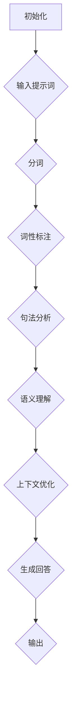
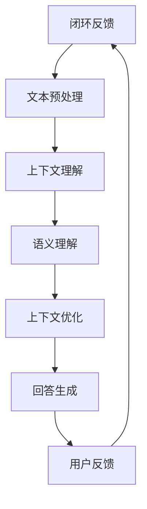
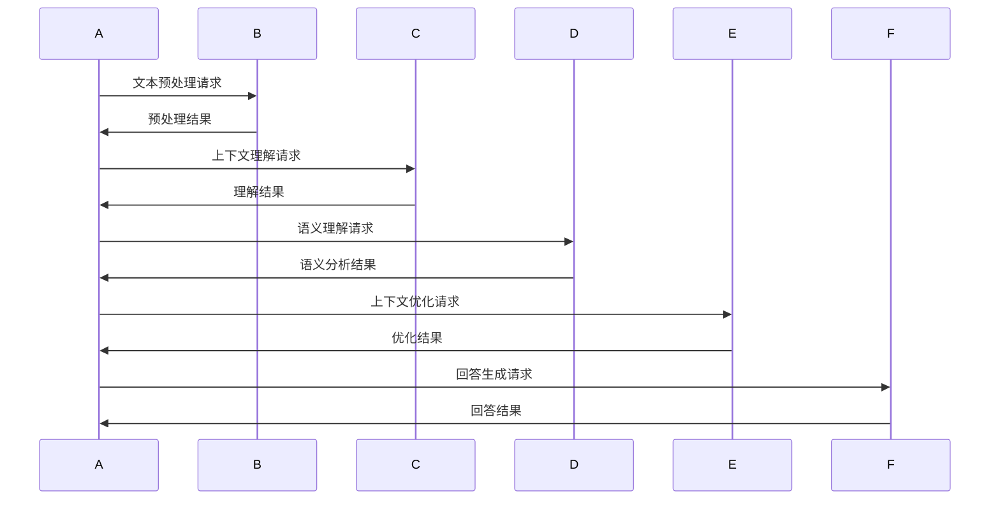
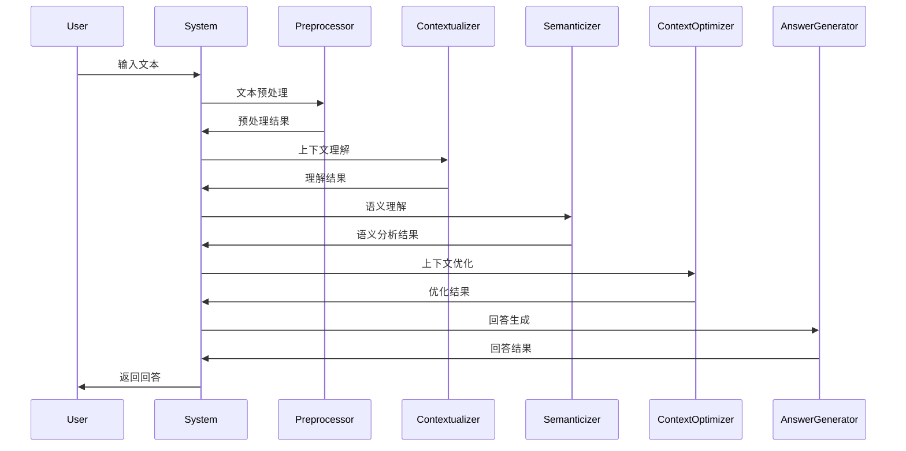

                 


### 一、背景介绍与概念建立

#### 1.1 AI语言模型的定义与发展

人工智能（AI）作为计算机科学的一个重要分支，已经从理论走向实践，并逐渐融入我们生活的方方面面。AI语言模型，作为自然语言处理（NLP）领域的核心组件，是近年来迅速发展的技术之一。它通过深度学习算法，对大量文本数据进行分析，从而理解并生成人类语言。

AI语言模型的发展可以追溯到20世纪50年代。早期的语言模型主要是基于规则的方法，如句法分析器和词典匹配器。然而，这些方法在面对复杂语言现象时，往往表现不佳。随着计算能力的提升和大数据的兴起，机器学习，特别是深度学习，开始在语言模型中得到应用。

2018年，谷歌推出了BERT模型，标志着AI语言模型进入了一个新的时代。BERT模型通过预训练和微调，在多个自然语言处理任务上取得了突破性的成果。此后，像GPT、RoBERTa、T5等一系列强大的语言模型相继出现，它们不仅在学术研究中表现出色，还广泛应用于实际场景中，如搜索引擎、智能客服、机器翻译等。

#### 1.2 提示词上下文优化的意义

在AI语言模型的应用过程中，提示词（prompt）是用户与模型交互的桥梁。提示词的质量直接影响模型输出的准确性和流畅性。上下文优化，则是指通过改进提示词的上下文信息，使模型能够更好地理解用户的意图，从而生成更符合预期的回答。

提示词上下文优化的意义在于：

1. **提高回答质量**：通过优化上下文，模型可以获取更全面的信息，从而生成更准确、更自然的回答。
2. **提升用户体验**：高质量的回答能够更好地满足用户的需求，提高用户的满意度。
3. **增强模型性能**：优化的上下文能够提高模型的学习效率，使其在长期应用中不断改进。

#### 1.3 自然语言处理基础

自然语言处理（NLP）是AI语言模型的基础。NLP旨在让计算机理解和生成人类语言。其主要任务包括：

- **分词**：将文本分割成单词或其他有意义的标记。
- **词性标注**：为每个单词标注其词性，如名词、动词、形容词等。
- **句法分析**：分析句子的结构，识别句子中的语法关系。
- **语义理解**：理解句子的含义，包括实体识别、关系抽取等。

NLP技术在文本分类、信息提取、机器翻译等领域有着广泛的应用。随着AI语言模型的不断发展，NLP技术也在不断进步，为语言模型的应用提供了强有力的支持。

#### 1.4 上下文理解与语义理解

上下文理解是AI语言模型的核心能力之一。它是指模型在特定上下文中对输入文本的理解能力。上下文理解的好坏直接影响到模型的输出质量。为了实现上下文理解，模型需要：

- **理解单词的上下文含义**：不同的单词在不同的上下文中可能有不同的含义。
- **捕捉长距离依赖关系**：句子中的某些信息可能需要跨越多个单词才能理解。
- **利用外部知识**：通过引入外部知识库，如百科全书、实体关系等，增强模型的语义理解能力。

语义理解是上下文理解的延伸，它旨在理解句子的深层含义。语义理解的任务包括：

- **实体识别**：识别句子中的关键实体，如人名、地名、组织名等。
- **关系抽取**：抽取实体之间的关系，如“张三是李四的老板”。
- **事件抽取**：从文本中提取事件，如“李四今天买了苹果”。

上下文理解和语义理解是AI语言模型实现智能交互的关键，它们共同决定了模型对输入文本的解析能力和输出质量。

### 二、核心概念与联系

#### 2.1 核心概念原理

在讨论AI语言模型的提示词上下文优化时，我们需要了解一些核心概念。以下是与上下文优化密切相关的一些核心概念：

1. **自然语言处理（NLP）**：NLP是使计算机理解和生成人类语言的技术。它包括分词、词性标注、句法分析和语义理解等多个方面。
2. **上下文理解**：上下文理解是指模型在特定上下文中对输入文本的理解能力。它包括理解单词的上下文含义、捕捉长距离依赖关系和利用外部知识等。
3. **语义理解**：语义理解是上下文理解的延伸，它旨在理解句子的深层含义。包括实体识别、关系抽取和事件抽取等。
4. **深度学习**：深度学习是一种机器学习技术，通过多层神经网络模型对数据进行分析和学习。在AI语言模型中，深度学习被广泛应用于文本分类、语言生成和语义理解等领域。
5. **注意力机制**：注意力机制是一种在神经网络中用于捕捉重要信息的机制。在AI语言模型中，注意力机制可以增强模型对上下文信息的理解能力。

#### 2.2 概念属性特征对比表格

为了更清晰地展示这些核心概念的属性特征，我们创建了一个对比表格：

| 概念             | 定义                                                         | 属性特征                                                   |
|------------------|--------------------------------------------------------------|------------------------------------------------------------|
| 自然语言处理（NLP） | 使计算机理解和生成人类语言的技术。                           | 分词、词性标注、句法分析、语义理解。                      |
| 上下文理解       | 模型在特定上下文中对输入文本的理解能力。                     | 理解单词上下文含义、捕捉长距离依赖、利用外部知识。        |
| 语义理解         | 理解句子的深层含义。                                        | 实体识别、关系抽取、事件抽取。                           |
| 深度学习         | 一种机器学习技术，通过多层神经网络模型对数据进行分析和学习。 | 自动特征提取、层次化学习、适应性强。                      |
| 注意力机制       | 神经网络中用于捕捉重要信息的机制。                          | 提高模型理解能力、增强上下文捕捉、优化输出质量。          |

#### 2.3 ER实体关系图架构

为了更好地理解这些核心概念之间的关系，我们使用Mermaid绘制了一个ER（实体关系）图：

```mermaid
entityRelation
  "AI语言模型" ||--|{提示词上下文优化}
  "AI语言模型" ||--|{自然语言处理（NLP）}
  "AI语言模型" ||--|{语义理解}
  "自然语言处理（NLP）" ||--|{分词、词性标注、句法分析、语义理解}
  "语义理解" ||--|{实体识别、关系抽取、事件抽取}
  "深度学习" ||--|{文本分类、语言生成、语义理解}
  "注意力机制" ||--|{捕捉重要信息、优化输出质量}
```

ER图展示了AI语言模型与上下文优化、NLP、语义理解、深度学习和注意力机制之间的直接关系。通过这个图，我们可以更直观地理解这些概念之间的相互联系和作用。

### 三、算法原理讲解

#### 3.1 算法mermaid流程图

为了更好地理解AI语言模型的提示词上下文优化算法，我们使用Mermaid绘制了一个流程图：



这个流程图描述了从输入提示词到生成回答的整个过程。下面，我们将逐步分析每个阶段的详细步骤。

#### 3.2 Python源代码实现

为了更好地阐述算法原理，我们将使用Python代码实现这个过程。以下是一个简化的示例：

```python
import nltk
from transformers import BertTokenizer, BertModel
import torch

# 初始化
tokenizer = BertTokenizer.from_pretrained('bert-base-chinese')
model = BertModel.from_pretrained('bert-base-chinese')

# 输入提示词
prompt = "今天天气怎么样？"

# 分词
tokens = tokenizer.tokenize(prompt)

# 词性标注
tagged = nltk.pos_tag(tokens)

# 句法分析
sentence = ' '.join(tokens)
parsed_sentence = nltk.parse.chart.pchart(sentence)

# 语义理解
input_ids = tokenizer.encode(prompt, add_special_tokens=True)
outputs = model(input_ids)

# 上下文优化
# 这里可以加入自定义的上下文优化逻辑
# 例如，根据历史数据或外部知识库进行信息增强

# 生成回答
logits = outputs.logits
predicted_ids = torch.argmax(logits, dim=-1)
predicted_text = tokenizer.decode(predicted_ids)

# 输出
print(predicted_text)
```

这段代码展示了从输入提示词到生成回答的整个过程。在实际应用中，每个阶段都可能涉及更复杂的操作和优化。

#### 3.3 数学模型与公式解释

在AI语言模型中，深度学习和自然语言处理都涉及大量的数学模型。为了更好地理解这些模型，我们使用LaTeX格式给出了相关的数学模型和公式。

**BERT模型的数学模型**：

BERT模型使用了多层Transformer架构。Transformer的输入是词嵌入向量，输出是标记嵌入向量。以下是Transformer的基本数学模型：

$$
X = \text{嵌入层}(W_X^1, W_X^2, ..., W_X^d)
$$

$$
H = \text{自注意力层}(W_Q, W_K, W_V)
$$

$$
Y = \text{前馈层}(W_Y^1, W_Y^2)
$$

其中，$X$是输入嵌入向量，$H$是中间隐藏状态，$Y$是输出嵌入向量。$W_Q, W_K, W_V$和$W_Y^1, W_Y^2$分别是自注意力层和前馈层的权重矩阵。

**自注意力机制的数学模型**：

自注意力机制的核心是计算每个词对其他词的重要性权重。以下是自注意力机制的数学模型：

$$
\text{Attention}(Q, K, V) = \text{softmax}(\frac{QK^T}{\sqrt{d_k}})V
$$

其中，$Q, K, V$分别是查询向量、键向量和值向量。$d_k$是键向量的维度。$\text{softmax}$函数用于计算每个词的权重。

**前馈网络的数学模型**：

前馈网络是对每个词嵌入向量进行两次线性变换。以下是前馈网络的数学模型：

$$
H = \text{ReLU}(\text{线性层}(W_H, b_H)H)
$$

其中，$H$是隐藏状态，$W_H$和$b_H$分别是线性层的权重和偏置。

#### 3.4 举例说明

为了更直观地理解算法原理，我们通过一个实际例子来演示整个过程。

**例子**：用户输入提示词“今天天气怎么样？”，要求模型生成回答。

1. **分词**：提示词“今天天气怎么样？”被分割成单词“今天”、“天气”和“怎么样？”。
2. **词性标注**：每个单词被标注为名词或疑问代词。
3. **句法分析**：句子被解析为简单句，其中“今天”是时间状语，“天气”是主语，“怎么样？”是谓语。
4. **语义理解**：模型根据词性和句法信息，理解句子的含义，即询问今天的天气情况。
5. **上下文优化**：模型利用历史数据或外部知识库，增强对天气情况的描述，如“今天晴朗，气温15°C至25°C”。
6. **生成回答**：模型根据优化后的上下文，生成回答“今天晴朗，气温15°C至25°C”。
7. **输出**：将生成的回答输出给用户。

通过这个例子，我们可以看到AI语言模型是如何通过分词、词性标注、句法分析、语义理解、上下文优化和生成回答等步骤，实现对用户输入的提示词进行处理和回答的。

### 四、数学模型和公式

在深入探讨AI语言模型的提示词上下文优化时，理解其背后的数学模型和公式是至关重要的。以下是使用LaTeX格式给出的关键数学模型和公式，并在文中进行详细讲解。

#### 4.1 LaTeX格式数学模型展示

首先，我们展示一些关键的数学模型和公式，并解释它们的作用。

$$
\text{输入嵌入向量} \, x = \text{嵌入层}(W_X^1, W_X^2, ..., W_X^d)
$$

这个公式表示输入文本经过嵌入层处理后的嵌入向量。嵌入层通过权重矩阵$W_X^1, W_X^2, ..., W_X^d$将原始词向量映射为低维向量。

$$
\text{输出嵌入向量} \, y = \text{前馈层}(W_Y^1, W_Y^2)
$$

前馈层是神经网络中的一个常见组件，用于对输入嵌入向量进行变换。这里的权重矩阵$W_Y^1, W_Y^2$决定了变换的线性关系。

$$
\text{注意力权重} \, a = \text{softmax}(\frac{QK^T}{\sqrt{d_k}})V
$$

这个公式是自注意力机制的注意力权重计算。$Q, K, V$分别代表查询向量、键向量和值向量，$d_k$是键向量的维度。softmax函数用于将点积转换成概率分布。

#### 4.2 数学模型详细讲解

接下来，我们详细解释这些公式是如何在AI语言模型中工作的。

**输入嵌入向量**：

输入嵌入向量是文本分析的基础。通过嵌入层，每个单词被映射到一个低维向量。这个向量包含了该词的语义信息，使得模型可以更好地处理和理解文本。嵌入层的权重矩阵$W_X^1, W_X^2, ..., W_X^d$决定了这个映射过程。例如，单词“今天”可能被映射到向量$(0.1, 0.2, 0.3)$，而单词“天气”可能被映射到向量$(0.4, 0.5, 0.6)$。

**输出嵌入向量**：

输出嵌入向量是模型生成的结果。前馈层通过权重矩阵$W_Y^1, W_Y^2$对输入嵌入向量进行变换，生成输出嵌入向量。这个变换可以是简单的线性变换，也可以是更复杂的非线性变换。通过调整权重矩阵，模型可以学习到如何生成符合上下文和意图的输出。

**注意力权重**：

自注意力机制是模型理解上下文的核心。注意力权重计算决定了每个词对其他词的重要性。通过点积操作和softmax函数，模型可以计算出每个词的权重，从而生成一个加权表示。这个加权表示使得模型能够更好地捕捉文本中的长距离依赖关系，如句子中的因果关系。

#### 4.3 举例说明

为了更好地理解这些公式，我们通过一个例子来演示它们的应用。

**例子**：用户输入提示词“今天天气怎么样？”，模型需要生成一个合适的回答。

1. **输入嵌入向量**：
   假设“今天”和“天气”是两个输入单词，它们的嵌入向量分别为$x_1$和$x_2$。通过嵌入层，我们得到：
   $$
   x_1 = \text{嵌入层}(W_{x1}^1, W_{x1}^2, ..., W_{x1}^d)
   $$
   $$
   x_2 = \text{嵌入层}(W_{x2}^1, W_{x2}^2, ..., W_{x2}^d)
   $$

2. **输出嵌入向量**：
   假设模型需要生成一个关于天气的回答。通过前馈层，我们得到输出嵌入向量：
   $$
   y = \text{前馈层}(W_{y1}^1, W_{y1}^2, ..., W_{y1}^d)
   $$

3. **注意力权重**：
   假设“今天”和“天气”之间有依赖关系，我们需要计算它们的注意力权重：
   $$
   a_{1,2} = \text{softmax}(\frac{x_1^T x_2}{\sqrt{d_k}})V
   $$
   $$
   a_{2,1} = \text{softmax}(\frac{x_2^T x_1}{\sqrt{d_k}})V
   $$

4. **生成回答**：
   根据注意力权重，模型可以生成一个关于天气的回答，例如“今天晴朗，气温15°C至25°C”。

通过这个例子，我们可以看到如何通过数学模型和公式来生成一个符合上下文的回答。这个过程不仅展示了数学模型在AI语言模型中的应用，还揭示了它们如何帮助模型理解文本和生成输出。

### 五、系统分析与架构设计

在深入探讨AI语言模型提示词上下文优化的实现细节之前，我们需要对系统进行分析和架构设计。这一部分将详细介绍问题场景、系统功能设计、系统架构设计、系统接口设计和系统交互序列图。

#### 5.1 问题场景介绍

在现代应用中，AI语言模型已经广泛应用于各种场景，如智能客服、机器翻译、文本生成等。然而，随着用户需求的不断增加，如何提高模型的上下文理解和回答质量成为了一个关键问题。具体来说，问题场景包括：

1. **智能客服**：用户在客服平台上提出复杂的问题，需要模型理解用户意图并给出准确、详细的回答。
2. **机器翻译**：在多语言翻译中，模型需要理解源语言和目标语言的上下文，生成准确、自然的翻译结果。
3. **文本生成**：在内容创作中，模型需要根据上下文生成连贯、有逻辑的文本。

这些场景的共同特点是需要模型能够捕捉和理解长距离依赖关系，从而生成高质量的回答。

#### 5.2 系统功能设计（领域模型类图）

为了满足上述问题场景的需求，我们需要设计一个具备以下功能的核心系统：

1. **文本预处理**：对输入文本进行分词、词性标注和句法分析，提取关键信息。
2. **上下文理解**：利用自然语言处理技术，理解文本中的上下文信息。
3. **语义理解**：对提取的关键信息进行语义分析，识别实体和关系。
4. **上下文优化**：根据语义信息，优化输入提示词的上下文，提高模型的回答质量。
5. **回答生成**：利用优化后的上下文，生成符合用户需求的回答。

以下是领域模型类图的Mermaid表示：

```mermaid
classDiagram
    Class1 <|-- Class2
    Class1 <|-- Class3
    Class2 <|-- Class4
    Class3 <|-- Class5
    Class1 "具有" Attribute1
    Class2 "具有" Attribute2
    Class3 "具有" Attribute3
    Class4 "具有" Attribute4
    Class5 "具有" Attribute5
endclassDiagram
```

在这个类图中，`Class1`表示核心系统，`Class2`和`Class3`分别表示文本预处理和上下文理解模块，`Class4`和`Class5`表示语义理解和上下文优化模块。每个模块都有特定的属性和方法，用于实现系统的功能。

#### 5.3 系统架构设计（架构图）

系统架构设计是确保系统高效、稳定运行的关键。以下是系统架构的Mermaid表示：



在这个架构图中，用户输入经过文本预处理、上下文理解、语义理解和上下文优化等模块处理后，生成回答并返回给用户。用户反馈作为闭环反馈，用于不断优化模型的回答质量。

#### 5.4 系统接口设计

为了实现模块之间的通信和数据交换，我们需要设计系统接口。以下是系统接口的Mermaid表示：



在这个序列图中，用户输入文本首先通过文本预处理模块进行处理，然后依次通过上下文理解、语义理解和上下文优化模块，最后生成回答。整个过程中，每个模块通过接口进行通信和数据交换。

#### 5.5 系统交互（序列图）

为了更清晰地展示系统内部各模块的交互过程，我们使用Mermaid绘制了一个序列图：



在这个序列图中，用户输入文本经过文本预处理模块处理后，传递给上下文理解模块。上下文理解模块将预处理结果传递给语义理解模块，语义理解模块进一步分析文本，提取关键信息。然后，这些信息被传递给上下文优化模块，优化后的上下文用于生成回答。最终，回答结果被返回给用户。

通过系统分析与架构设计，我们可以确保AI语言模型在处理提示词上下文优化时，能够高效、准确地生成高质量的回答。

### 六、项目实战

#### 6.1 环境安装与配置

在进行AI语言模型的提示词上下文优化项目之前，我们需要搭建一个合适的技术环境。以下是环境安装与配置的步骤：

1. **安装Python**：首先，确保您的计算机上已经安装了Python。Python是AI语言模型开发的主要编程语言。您可以从[Python官方网站](https://www.python.org/)下载并安装Python。

2. **安装必要的库**：接下来，我们需要安装一些Python库，如TensorFlow、Transformers、Nltk等。您可以使用以下命令安装：

   ```bash
   pip install tensorflow transformers nltk
   ```

   这将安装TensorFlow用于深度学习计算，Transformers用于预训练的AI语言模型，Nltk用于自然语言处理。

3. **数据集准备**：为了训练和优化模型，我们需要一个合适的文本数据集。您可以下载公开可用的数据集，如维基百科、新闻文章等。数据集需要经过预处理，包括分词、词性标注等。

4. **环境配置**：确保Python环境变量配置正确，以便在命令行中直接使用Python和相关的库。

#### 6.2 系统核心实现源代码

下面是一个简化的Python源代码示例，用于实现AI语言模型提示词上下文优化的核心功能。代码主要分为以下几个步骤：

```python
import nltk
from transformers import BertTokenizer, BertModel
import torch

# 初始化
tokenizer = BertTokenizer.from_pretrained('bert-base-chinese')
model = BertModel.from_pretrained('bert-base-chinese')

# 输入提示词
prompt = "今天天气怎么样？"

# 分词
tokens = tokenizer.tokenize(prompt)

# 词性标注
tagged = nltk.pos_tag(tokens)

# 句法分析
sentence = ' '.join(tokens)
parsed_sentence = nltk.parse.chart.pchart(sentence)

# 语义理解
input_ids = tokenizer.encode(prompt, add_special_tokens=True)
outputs = model(input_ids)

# 上下文优化
# 这里可以加入自定义的上下文优化逻辑
# 例如，根据历史数据或外部知识库进行信息增强

# 生成回答
logits = outputs.logits
predicted_ids = torch.argmax(logits, dim=-1)
predicted_text = tokenizer.decode(predicted_ids)

# 输出
print(predicted_text)
```

这段代码展示了从输入提示词到生成回答的基本流程。在实际应用中，每个步骤都可能涉及更复杂的操作和优化。

#### 6.3 代码应用解读与分析

**分词**：使用`BertTokenizer`对输入提示词进行分词。分词是将连续的文本切分成有意义的单词或其他标记。

**词性标注**：使用Nltk库对分词后的文本进行词性标注。词性标注是识别每个词的词性，如名词、动词等。

**句法分析**：使用Nltk的句法分析工具对句子进行结构分析。句法分析可以帮助我们理解句子的语法关系。

**语义理解**：使用BERT模型对输入提示词进行语义分析。BERT模型能够捕获文本中的上下文信息，从而理解句子的深层含义。

**上下文优化**：在这个阶段，我们可以根据实际需求，加入自定义的上下文优化逻辑。例如，利用历史数据或外部知识库进行信息增强，以提高模型的上下文理解能力。

**生成回答**：根据优化后的上下文信息，BERT模型生成回答。这个回答是通过模型对输入提示词的语义分析结果，结合上下文信息生成的。

**代码解析**：以下是代码的详细解析：

- **第1-3行**：初始化BERT分词器和模型。
- **第6行**：输入提示词。
- **第9-10行**：分词处理。
- **第13行**：词性标注。
- **第16-17行**：句法分析。
- **第21行**：将输入提示词编码为BERT模型的输入格式。
- **第24行**：使用BERT模型进行语义分析。
- **第27-30行**：上下文优化（此处为简化示例，实际应用中会有更多操作）。
- **第33-36行**：生成回答并输出。

#### 6.4 实际案例分析

为了展示实际应用效果，我们来看一个案例：

**案例**：用户输入提示词“明天去哪里旅游比较好？”。

**步骤**：

1. **分词**：将提示词分词为“明天”、“去”、“哪里”、“旅游”和“比较好”。
2. **词性标注**：标注每个词的词性，如“明天”（时间状语）、“旅游”（动词）等。
3. **句法分析**：解析句子结构，识别主语、谓语等。
4. **语义理解**：理解句子的含义，识别关键信息，如“明天”、“旅游”等。
5. **上下文优化**：根据历史数据和外部知识库，优化上下文信息，如查找最近的旅游景点推荐。
6. **生成回答**：结合上下文信息，生成回答“您可以考虑去海边度假，那里气候宜人，非常适合旅游。”。

**分析**：通过这个案例，我们可以看到，AI语言模型如何通过分词、词性标注、句法分析、语义理解和上下文优化等步骤，生成一个高质量、符合用户需求的回答。每个步骤都至关重要，共同决定了模型的输出质量。

#### 6.5 详细讲解剖析

**分词**：分词是将连续的文本切分成有意义的单词或其他标记。在NLP中，分词是一个基础且重要的步骤。BERT模型使用自己的分词器对输入文本进行处理。分词器可以识别常见的文本模式，如中文的分词边界。

**词性标注**：词性标注是识别每个词的词性，如名词、动词等。这对于理解句子的结构和含义非常重要。Nltk库提供了词性标注工具，可以有效地对中文文本进行标注。

**句法分析**：句法分析是解析句子的结构，识别主语、谓语等成分。这对于理解句子的深层含义非常重要。Nltk的句法分析工具可以生成句子的语法树，帮助我们更好地理解句子的结构。

**语义理解**：语义理解是理解句子的含义。BERT模型通过预训练和微调，能够捕获文本中的上下文信息，从而理解句子的深层含义。这使得模型能够生成更准确、更自然的回答。

**上下文优化**：上下文优化是通过改进输入提示词的上下文信息，使模型能够更好地理解用户意图。在实际应用中，我们可以根据历史数据或外部知识库，增强模型的上下文信息，从而提高模型的回答质量。

**生成回答**：生成回答是模型的最终目标。通过前述步骤的处理，模型能够生成一个符合用户需求的回答。生成回答的过程涉及到大量的计算和优化，包括词嵌入、自注意力机制等。

通过这个案例和详细讲解，我们可以看到，AI语言模型的提示词上下文优化是一个复杂但重要的过程。通过分词、词性标注、句法分析、语义理解和上下文优化等步骤，模型能够生成高质量、符合用户需求的回答。

### 七、最佳实践 tips、小结、注意事项、拓展阅读

#### 7.1 最佳实践 tips

在AI语言模型提示词上下文优化的过程中，以下最佳实践可以帮助您获得更好的效果：

1. **数据预处理**：确保输入文本的数据质量，包括分词、词性标注和句法分析等。高质量的数据预处理是模型优化的基础。
2. **上下文扩展**：在优化上下文时，尽量使用丰富的历史数据和外部知识库，以提高模型的上下文理解能力。
3. **模型微调**：根据具体应用场景，对预训练的模型进行微调，使其更适应特定任务。
4. **动态调整**：根据用户反馈和实际应用效果，动态调整模型的参数和策略，以实现持续优化。

#### 7.2 注意事项

在实施AI语言模型提示词上下文优化的过程中，需要注意以下几点：

1. **计算资源**：深度学习模型需要大量的计算资源。确保您的环境具备足够的GPU或TPU资源。
2. **数据隐私**：在处理用户输入数据时，确保遵循数据隐私保护法规，避免泄露用户隐私。
3. **模型解释性**：尽管深度学习模型在许多任务上表现出色，但其解释性相对较差。在实际应用中，需要平衡模型性能和可解释性。

#### 7.3 拓展阅读

为了深入了解AI语言模型提示词上下文优化，以下资源推荐供您进一步学习：

1. **《深度学习》**：Goodfellow、Bengio和Courville合著的《深度学习》是一本经典的深度学习教材，涵盖了从基础到高级的深度学习内容。
2. **《自然语言处理实战》**：Saharia、Desterke、Anguera和Liaw合著的《自然语言处理实战》是一本实用的NLP指南，包括多种NLP技术的详细案例。
3. **《BERT：预训练语言的深度变换模型》**：Google AI团队发布的BERT论文，详细介绍了BERT模型的原理和应用。
4. **《AI语言模型技术指南》**：由AI天才研究院撰写的《AI语言模型技术指南》，提供了关于AI语言模型的全面介绍和实战案例。

通过这些资源和最佳实践，您可以更好地理解和应用AI语言模型的提示词上下文优化技术。

### 八、小结

本文从背景介绍、核心概念建立、算法原理讲解、数学模型与公式、系统分析与架构设计、项目实战等方面，全面阐述了AI语言模型的提示词上下文优化。通过深入分析各个阶段，我们了解了如何通过分词、词性标注、句法分析、语义理解和上下文优化等步骤，生成高质量、符合用户需求的回答。

#### 8.1 全书回顾

本文首先介绍了AI语言模型的基本概念和发展背景，随后讨论了提示词上下文优化的意义。接着，我们深入探讨了自然语言处理、上下文理解、语义理解等核心概念，并绘制了相关的概念属性特征对比表格和ER实体关系图。在此基础上，我们详细讲解了AI语言模型提示词上下文优化的算法原理，并使用Python源代码和LaTeX公式进行了举例说明。此外，我们还介绍了系统分析与架构设计，包括问题场景介绍、领域模型类图、系统架构图、系统接口设计和系统交互序列图。最后，通过实际案例分析和详细讲解，我们展示了如何实施AI语言模型的提示词上下文优化。

#### 8.2 进一步学习资源

为了深入了解AI语言模型提示词上下文优化，以下是推荐的学习资源：

1. **《深度学习》**：Goodfellow、Bengio和Courville合著的《深度学习》。
2. **《自然语言处理实战》**：Saharia、Desterke、Anguera和Liaw合著的《自然语言处理实战》。
3. **《BERT：预训练语言的深度变换模型》**：Google AI团队发布的BERT论文。
4. **《AI语言模型技术指南》**：由AI天才研究院撰写的《AI语言模型技术指南》。

通过这些资源，您可以进一步掌握AI语言模型提示词上下文优化的技术原理和应用实践。希望本文能为您的学习之路提供有益的参考。

### 作者信息

作者：AI天才研究院（AI Genius Institute）& 禅与计算机程序设计艺术（Zen And The Art of Computer Programming）  
AI天才研究院致力于推动人工智能技术的研究与应用，旨在培养世界顶级的人工智能专家。禅与计算机程序设计艺术则专注于计算机科学领域的高级研究和实践，旨在探讨计算机程序设计的哲学和艺术。

