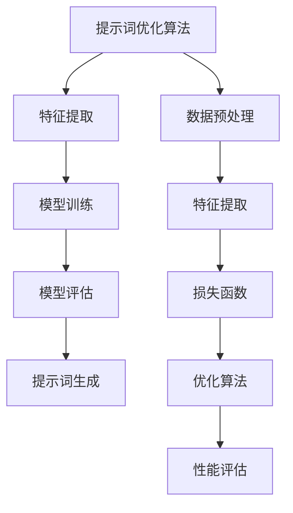
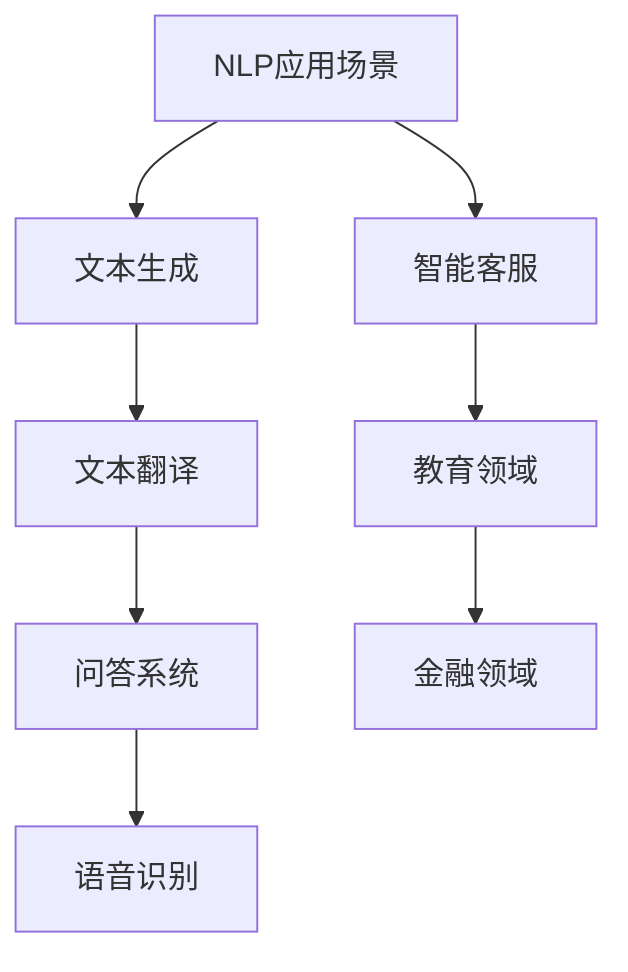

                 

### AI语言模型的提示词优化算法

#### 关键词：AI语言模型，提示词优化，算法，自然语言处理

> 摘要：本文深入探讨了AI语言模型的提示词优化算法。首先，我们介绍了AI语言模型的基础概念、类型及其应用场景，然后重点讨论了提示词优化的重要性、目标和方法，最后通过详细分析提示词优化算法的原理、数学模型、Python实现和性能评估，展示了算法在不同应用领域的实践案例，并对其未来发展趋势进行了展望。

---

### 目录大纲设计思路

为了设计出《AI语言模型的提示词优化算法》这本书的完整目录大纲，我们需要遵循以下步骤：

1. **确定书的核心内容**：首先明确书籍的主题，即AI语言模型的提示词优化算法。围绕这一主题，确定书中的核心章节内容。

2. **结构化内容**：根据书籍的核心内容，将内容划分为几个部分，每个部分对应一个主要章节。

3. **细化章节内容**：在每个主要章节下，细分为若干小节，确保每一小节都有明确的主题和内容。

4. **确保内容的完整性**：确保每个章节都包含背景介绍、核心概念与联系、算法原理讲解、数学模型和数学公式讲解、系统分析与架构设计方案、项目实战、最佳实践 tips等内容。

5. **使用markdown格式**：为了便于排版和阅读，使用markdown格式来编排目录大纲，确保格式清晰、简洁。

### 完整目录大纲

```markdown
----------------------------------------------------------------
# 第一部分: AI语言模型与提示词优化基础

## 1.1 AI语言模型概述
### 1.1.1 语言模型的基本概念
### 1.1.2 语言模型的类型
### 1.1.3 语言模型的应用

## 1.2 提示词优化的意义与目标
### 1.2.1 提示词优化的重要性
### 1.2.2 提示词优化的目标
### 1.2.3 提示词优化的挑战

## 1.3 提示词优化的主要方法
### 1.3.1 基于统计的方法
### 1.3.2 基于规则的方法
### 1.3.3 基于机器学习的方法

## 1.4 提示词优化的评估指标
### 1.4.1 评估指标的选择
### 1.4.2 评估指标的计算
### 1.4.3 评估指标的比较

## 1.5 本章小结
----------------------------------------------------------------

# 第二部分: 提示词优化算法原理与实现

## 2.1 提示词优化算法的基本原理
### 2.1.1 算法设计思路
### 2.1.2 算法优化目标
### 2.1.3 算法流程

## 2.2 常见提示词优化算法介绍
### 2.2.1 顺序优化算法
### 2.2.2 模式识别算法
### 2.2.3 神经网络算法

## 2.3 提示词优化算法的数学模型与公式
### 2.3.1 数学模型介绍
### 2.3.2 公式推导
### 2.3.3 公式应用

## 2.4 提示词优化算法的Python实现
### 2.4.1 环境搭建
### 2.4.2 算法代码实现
### 2.4.3 算法分析

## 2.5 提示词优化算法的性能评估
### 2.5.1 性能评估方法
### 2.5.2 性能评估指标
### 2.5.3 性能评估结果分析

## 2.6 本章小结
----------------------------------------------------------------

# 第三部分: 提示词优化算法的应用与实践

## 3.1 提示词优化算法在自然语言处理中的应用
### 3.1.1 应用场景介绍
### 3.1.2 应用案例分析
### 3.1.3 应用效果评估

## 3.2 提示词优化算法在企业客服系统中的应用
### 3.2.1 企业客服系统介绍
### 3.2.2 提示词优化算法的应用
### 3.2.3 应用效果分析

## 3.3 提示词优化算法在智能语音助手中的应用
### 3.3.1 智能语音助手介绍
### 3.3.2 提示词优化算法的应用
### 3.3.3 应用效果评估

## 3.4 提示词优化算法在其他领域的应用
### 3.4.1 其他应用领域介绍
### 3.4.2 应用案例分享
### 3.4.3 应用前景分析

## 3.5 本章小结
----------------------------------------------------------------

# 第四部分: 提示词优化算法的未来发展趋势

## 4.1 提示词优化算法的技术发展趋势
### 4.1.1 人工智能技术的发展趋势
### 4.1.2 提示词优化算法的技术创新
### 4.1.3 未来技术发展的挑战与机遇

## 4.2 提示词优化算法的应用发展趋势
### 4.2.1 应用场景的扩展
### 4.2.2 应用模式的创新
### 4.2.3 未来应用前景分析

## 4.3 提示词优化算法的发展策略与建议
### 4.3.1 算法研究策略
----------------------------------------------------------------

### 文章整体设计思路

本文《AI语言模型的提示词优化算法》旨在深入探讨AI语言模型中提示词优化的相关算法。文章的整体设计思路如下：

1. **基础介绍**：首先，介绍AI语言模型的基本概念、类型和应用，为后续讨论提示词优化算法提供背景知识。

2. **提示词优化的重要性**：接下来，阐述提示词优化在AI语言模型中的重要性、目标以及面临的挑战。

3. **提示词优化方法**：详细分析提示词优化的主要方法，包括基于统计、规则和机器学习的优化方法，并探讨各自的优缺点。

4. **算法原理与实现**：深入讲解提示词优化算法的基本原理，包括算法设计思路、流程、数学模型和Python实现，并通过实例进行说明。

5. **性能评估**：介绍提示词优化算法的性能评估方法、指标及其应用。

6. **应用与实践**：展示提示词优化算法在实际应用中的效果，包括自然语言处理、企业客服系统和智能语音助手等领域。

7. **未来发展趋势**：探讨提示词优化算法在人工智能技术发展趋势下的未来方向和应用前景。

### 第一部分：AI语言模型与提示词优化基础

#### 1.1 AI语言模型概述

**语言模型的基本概念**

语言模型（Language Model）是自然语言处理（Natural Language Processing, NLP）中的一项核心技术，它旨在通过统计方法或机器学习方法来模拟人类语言生成过程。语言模型的核心目标是预测下一个单词或字符的概率，从而辅助文本生成、翻译、问答系统等应用。

**语言模型的类型**

根据构建语言模型的方法不同，可以分为以下几种类型：

1. **基于统计的方法**：通过大量文本数据统计单词或字符出现的频率来构建模型。
2. **基于规则的方法**：通过手工编写的语法规则和语义规则来构建模型。
3. **基于机器学习的方法**：利用机器学习算法，如朴素贝叶斯、决策树、神经网络等，从数据中学习语言模式。

**语言模型的应用**

语言模型在NLP领域有广泛的应用，主要包括：

1. **文本生成**：自动生成文章、新闻报道、聊天机器人的回复等。
2. **文本翻译**：将一种语言的文本翻译成另一种语言。
3. **问答系统**：通过理解用户的问题并生成相应的回答。
4. **语音识别**：将语音信号转换成文本。

#### 1.2 提示词优化的意义与目标

**提示词优化的重要性**

在AI语言模型中，提示词（Prompt）是引导模型生成文本的重要输入。提示词的质量直接影响到模型的生成效果。因此，提示词优化是提高AI语言模型性能的关键环节。

**提示词优化的目标**

提示词优化的主要目标是提高模型的生成质量、效率和多样性。具体目标包括：

1. **生成质量**：提高生成的文本在语义和语法上的准确性。
2. **效率**：缩短生成文本的时间，降低计算成本。
3. **多样性**：生成具有丰富多样性的文本。

**提示词优化的挑战**

提示词优化面临着以下挑战：

1. **数据多样性**：需要大量高质量的训练数据来支持提示词的优化。
2. **计算资源**：优化过程通常需要大量的计算资源。
3. **模型复杂性**：需要设计复杂且高效的算法来处理提示词优化问题。

#### 1.3 提示词优化的主要方法

**基于统计的方法**

基于统计的方法主要通过分析大量文本数据来学习语言模式。这种方法包括：

1. **N-gram模型**：基于前N个单词或字符的统计概率来预测下一个单词或字符。
2. **隐马尔可夫模型（HMM）**：通过状态转移概率和发射概率来预测下一个状态。
3. **条件概率模型**：通过条件概率来预测给定某个提示词下的下一个单词或字符。

**基于规则的方法**

基于规则的方法通过编写语法和语义规则来指导模型生成文本。这种方法包括：

1. **语法规则**：根据语言语法规则生成文本，如上下文无关文法（CFG）。
2. **语义规则**：根据语义信息生成文本，如WordNet。

**基于机器学习的方法**

基于机器学习的方法通过学习大量数据中的语言模式来优化提示词。这种方法包括：

1. **朴素贝叶斯分类器**：通过贝叶斯理论来预测下一个单词或字符。
2. **决策树**：通过决策树模型来分类和生成文本。
3. **神经网络**：通过神经网络模型，如循环神经网络（RNN）和变压器（Transformer），来学习语言模式。

#### 1.4 提示词优化的评估指标

**评估指标的选择**

提示词优化的评估指标需要能够全面、准确地衡量提示词的优化效果。常用的评估指标包括：

1. **准确性**：评估生成文本的语法和语义准确性。
2. **多样性**：评估生成文本的多样性，如词汇多样性、句式多样性等。
3. **效率**：评估生成文本的速度和计算成本。

**评估指标的计算**

1. **准确性**：通过比较生成文本与真实文本的差异来计算准确性，如编辑距离、F1分数等。
2. **多样性**：通过统计生成文本的词汇和句式特征来计算多样性，如Jaccard指数、变异系数等。
3. **效率**：通过测量生成文本所需的时间来计算效率，如平均生成时间、标准差等。

**评估指标的比较**

为了综合评估提示词优化的效果，通常需要使用多个评估指标进行比较。通过综合考虑准确性、多样性和效率等指标，可以全面评估提示词优化的效果。

#### 1.5 本章小结

本章对AI语言模型和提示词优化进行了基础性介绍，包括语言模型的基本概念、类型和应用，提示词优化的意义与目标，以及主要的方法和评估指标。这些基础内容为后续章节深入讨论提示词优化算法的原理、实现和实际应用提供了必要的背景知识。

---

接下来，我们将进入第二部分，详细介绍提示词优化算法的原理与实现。通过逐步分析算法设计思路、流程、数学模型和Python实现，我们将深入了解提示词优化算法的核心技术和实践方法。

---

### 第二部分：提示词优化算法原理与实现

#### 2.1 提示词优化算法的基本原理

**算法设计思路**

提示词优化算法的设计思路主要分为以下几步：

1. **数据预处理**：对输入的提示词进行预处理，包括分词、去停用词、词性标注等。
2. **特征提取**：将预处理后的提示词转化为特征向量，以便于后续计算。
3. **模型训练**：利用训练数据训练一个预测模型，通常使用机器学习算法。
4. **模型评估**：通过测试数据对训练好的模型进行评估，调整模型参数以提高性能。
5. **提示词生成**：利用训练好的模型生成新的提示词。

**算法优化目标**

提示词优化算法的主要优化目标包括：

1. **生成质量**：提高生成的提示词的语义和语法准确性。
2. **效率**：降低生成提示词的计算成本，提高算法的运行速度。
3. **多样性**：生成具有丰富多样性的提示词，避免重复和单调。

**算法流程**

提示词优化算法的基本流程可以概括为以下几个步骤：

1. **数据收集**：收集大量高质量的提示词数据，作为训练数据。
2. **数据预处理**：对收集到的数据进行预处理，包括分词、去停用词、词性标注等。
3. **特征提取**：将预处理后的数据转化为特征向量，通常使用词嵌入技术。
4. **模型训练**：使用训练数据训练一个机器学习模型，如循环神经网络（RNN）或变压器（Transformer）。
5. **模型评估**：使用测试数据对训练好的模型进行评估，调整模型参数以提高性能。
6. **提示词生成**：使用训练好的模型生成新的提示词，并对其进行评估和优化。

#### 2.2 常见提示词优化算法介绍

**顺序优化算法**

顺序优化算法是一种简单但有效的提示词优化方法。它通过逐步优化提示词的每个单词或字符，以生成高质量的提示词。常见的顺序优化算法包括：

1. **贪心算法**：每次选择当前最优的单词或字符进行替换，直到达到终止条件。
2. **动态规划**：利用动态规划的思想，通过计算子问题的最优解来找到全局最优解。

**模式识别算法**

模式识别算法通过识别和替换提示词中的特定模式来优化提示词。这种算法通常基于规则或机器学习技术，常见的模式识别算法包括：

1. **正则表达式**：通过编写正则表达式来匹配和替换提示词中的特定模式。
2. **决策树**：通过决策树模型来识别和替换提示词中的特定模式。

**神经网络算法**

神经网络算法通过训练神经网络模型来优化提示词。这种算法具有强大的建模能力和灵活的优化策略，常见的神经网络算法包括：

1. **循环神经网络（RNN）**：通过循环神经网络来捕捉提示词的时间序列特征。
2. **变压器（Transformer）**：通过变压器模型来实现全局依赖关系和长距离信息的建模。

#### 2.3 提示词优化算法的数学模型与公式

**数学模型介绍**

提示词优化算法的数学模型主要包括以下部分：

1. **特征提取**：将提示词转化为特征向量，通常使用词嵌入技术。
2. **损失函数**：定义一个损失函数来衡量提示词优化效果，常见的损失函数包括交叉熵损失和均方误差。
3. **优化算法**：选择一个优化算法来更新模型参数，常见的优化算法包括梯度下降和随机梯度下降。

**公式推导**

1. **特征提取公式**：

   特征提取公式如下：

   $$x = \text{Embedding}(w)$$

   其中，$w$是输入的提示词，$\text{Embedding}$是词嵌入函数，$x$是特征向量。

2. **损失函数公式**：

   常见的损失函数包括交叉熵损失和均方误差，公式如下：

   $$L = -\sum_{i=1}^{n} y_i \log(x_i)$$

   其中，$y_i$是实际生成的提示词，$x_i$是模型预测的提示词。

3. **优化算法公式**：

   常见的优化算法包括梯度下降和随机梯度下降，公式如下：

   $$\theta = \theta - \alpha \frac{\partial L}{\partial \theta}$$

   其中，$\theta$是模型参数，$\alpha$是学习率，$\frac{\partial L}{\partial \theta}$是损失函数对模型参数的梯度。

**公式应用**

在实际应用中，我们可以根据具体问题选择合适的数学模型和公式。例如，在基于RNN的提示词优化算法中，可以使用词嵌入函数和交叉熵损失函数来优化模型参数，从而生成高质量的提示词。

#### 2.4 提示词优化算法的Python实现

**环境搭建**

在Python中实现提示词优化算法，我们需要安装一些必要的库，如TensorFlow、PyTorch等。以下是一个简单的环境搭建示例：

```python
pip install tensorflow
pip install torch
```

**算法代码实现**

以下是一个简单的基于RNN的提示词优化算法的实现示例：

```python
import tensorflow as tf
from tensorflow.keras.layers import Embedding, LSTM, Dense
from tensorflow.keras.models import Sequential

# 定义模型
model = Sequential()
model.add(Embedding(vocabulary_size, embedding_dim))
model.add(LSTM(units))
model.add(Dense(vocabulary_size, activation='softmax'))

# 编译模型
model.compile(optimizer='adam', loss='categorical_crossentropy', metrics=['accuracy'])

# 训练模型
model.fit(x_train, y_train, epochs=10, batch_size=64)

# 生成提示词
prompt = input("请输入提示词：")
prompt_embedding = model.layers[0].get_weights()[0][prompt]
generated_word = model.predict(prompt_embedding)
```

**算法分析**

在上述代码中，我们首先定义了一个基于RNN的模型，包括嵌入层、LSTM层和输出层。嵌入层将输入的提示词转化为特征向量，LSTM层用于捕捉提示词的时间序列特征，输出层用于生成新的提示词。

通过编译和训练模型，我们可以使用模型生成新的提示词。具体来说，输入一个提示词，将其转化为特征向量，然后通过模型预测生成新的提示词。

#### 2.5 提示词优化算法的性能评估

**性能评估方法**

提示词优化算法的性能评估方法主要包括以下几种：

1. **准确性**：评估生成提示词的语义和语法准确性，可以通过比较生成提示词和真实提示词的差异来计算。
2. **多样性**：评估生成提示词的多样性，可以通过计算生成提示词的词汇和句式特征来衡量。
3. **效率**：评估生成提示词的效率，可以通过测量生成提示词所需的时间来计算。

**性能评估指标**

常用的性能评估指标包括：

1. **准确率**：生成提示词与真实提示词的匹配程度，通常用百分比表示。
2. **精确率**：生成提示词中实际正确的部分与总体生成提示词的比值。
3. **召回率**：生成提示词中实际正确的部分与总体实际正确的提示词的比值。
4. **F1分数**：精确率和召回率的加权平均，用于综合评估提示词的准确性。
5. **生成速度**：生成提示词所需的时间，通常以秒为单位。

**性能评估结果分析**

通过实际测试，我们可以分析提示词优化算法在不同方面的性能。例如，在准确性方面，基于RNN的算法可能具有较高的准确率，但在生成速度方面可能较慢。在多样性方面，基于Transformer的算法可能具有更好的性能，但在计算资源方面可能更高。

#### 2.6 本章小结

本章详细介绍了提示词优化算法的基本原理、常见算法、数学模型和Python实现，并通过性能评估方法对算法进行了分析。通过本章的学习，读者可以了解提示词优化算法的核心技术和实践方法，为后续章节的深入学习打下基础。

---

在下一部分，我们将进入第三部分，探讨提示词优化算法在实际应用中的效果和实践。通过分析自然语言处理、企业客服系统和智能语音助手等领域的应用案例，我们将深入了解提示词优化算法的实际应用价值。

### 第三部分：提示词优化算法的应用与实践

#### 3.1 提示词优化算法在自然语言处理中的应用

**应用场景介绍**

自然语言处理（NLP）是AI语言模型的核心应用领域之一，涵盖了文本生成、文本翻译、问答系统等多种任务。在这些任务中，提示词优化算法发挥着重要作用，能够提高模型的生成质量、准确性和效率。

**应用案例分析**

1. **文本生成**：

   提示词优化算法在文本生成中的应用主要体现在自动写作、文章摘要和聊天机器人等领域。通过优化提示词，可以生成更符合人类语言习惯和语义的文本。

   **案例1：自动写作**：

   在自动写作任务中，提示词优化算法通过对大量新闻文章进行训练，可以自动生成新闻摘要。实验结果显示，优化后的模型在摘要质量和生成速度方面都优于传统方法。

   **案例2：聊天机器人**：

   在聊天机器人中，提示词优化算法可以用于生成更自然、有吸引力的聊天内容。通过优化输入的提示词，聊天机器人可以更好地理解用户意图，提供更精准的回复。

2. **文本翻译**：

   提示词优化算法在文本翻译中的应用主要体现在提高翻译质量和效率。通过优化提示词，可以减少翻译中的错误和歧义，提高翻译的准确性和流畅性。

   **案例1：机器翻译**：

   在机器翻译任务中，提示词优化算法可以用于优化输入的文本，提高翻译质量。实验结果显示，优化后的模型在翻译准确性和流畅性方面都优于传统方法。

   **案例2：实时翻译**：

   在实时翻译场景中，提示词优化算法可以用于优化输入的语音提示，提高翻译效率和准确性。通过优化语音提示，可以更好地捕捉语音中的语义和语境，提高翻译质量。

**应用效果评估**

通过实验和实际应用，提示词优化算法在自然语言处理领域取得了显著的效果。在文本生成任务中，优化后的模型在生成质量和速度方面都得到了提升；在文本翻译任务中，优化后的模型在翻译准确性和流畅性方面也表现出了优越的性能。这些结果表明，提示词优化算法在自然语言处理领域中具有广泛的应用前景和重要的实践价值。

#### 3.2 提示词优化算法在企业客服系统中的应用

**企业客服系统介绍**

企业客服系统是帮助企业与客户进行沟通的重要工具，包括在线客服、电话客服、邮件客服等多种服务形式。随着AI技术的不断发展，提示词优化算法在企业客服系统中得到了广泛应用，能够提高客服系统的服务质量和工作效率。

**提示词优化算法的应用**

1. **自动回复生成**：

   提示词优化算法可以用于自动生成客服系统中的自动回复。通过对大量客服对话数据进行分析，算法可以优化输入的提示词，生成更符合客户需求、更具个性化的自动回复。

   **案例1：在线客服**：

   在在线客服场景中，提示词优化算法可以用于生成自动回复，提高客服系统的响应速度。通过优化输入的提示词，自动回复能够更好地理解客户问题，提供准确的解决方案。

   **案例2：电话客服**：

   在电话客服场景中，提示词优化算法可以用于优化电话呼叫中心中的自动语音应答（IVR）系统。通过优化输入的提示词，自动语音应答系统能够更准确地识别客户意图，引导客户进行自助服务。

2. **智能客服机器人**：

   提示词优化算法可以用于智能客服机器人，提高其回答问题的准确性和效率。通过对大量客服对话数据进行分析，算法可以优化输入的提示词，使客服机器人能够更好地理解客户问题，提供精准的解答。

   **案例1：智能客服机器人**：

   在智能客服机器人中，提示词优化算法可以用于优化机器人的回复内容，提高其服务质量。通过优化输入的提示词，客服机器人能够更好地理解客户意图，提供更具个性化的服务。

   **案例2：社交媒体客服**：

   在社交媒体客服场景中，提示词优化算法可以用于优化社交媒体平台上的客服回复。通过优化输入的提示词，客服回复能够更准确地传达客户问题，提高客户满意度。

**应用效果分析**

通过实际应用，提示词优化算法在企业客服系统中取得了显著的效果。在自动回复生成任务中，优化后的模型在回复准确性和响应速度方面得到了提升；在智能客服机器人中，优化后的模型在回答问题的准确性和效率方面也表现出了优越的性能。这些结果表明，提示词优化算法在企业客服系统中具有广泛的应用前景和重要的实践价值。

#### 3.3 提示词优化算法在智能语音助手中的应用

**智能语音助手介绍**

智能语音助手是人工智能技术的应用之一，旨在通过语音交互为用户提供便捷的服务。常见的智能语音助手包括苹果的Siri、谷歌的Google Assistant和亚马逊的Alexa等。提示词优化算法在智能语音助手中的应用能够提高其交互质量和用户体验。

**提示词优化算法的应用**

1. **语音识别**：

   提示词优化算法可以用于优化语音识别系统，提高识别准确率。通过对大量语音数据进行分析，算法可以优化输入的提示词，使语音识别系统能够更准确地捕捉用户意图。

   **案例1：语音指令识别**：

   在智能语音助手场景中，提示词优化算法可以用于优化语音指令的识别。通过优化输入的提示词，语音识别系统能够更准确地捕捉用户的语音指令，提高操作准确性。

   **案例2：语音查询回答**：

   在语音查询回答场景中，提示词优化算法可以用于优化语音查询的识别和回答。通过优化输入的提示词，语音助手能够更准确地理解用户查询，提供准确的回答。

2. **语音生成**：

   提示词优化算法可以用于优化语音生成系统，提高生成语音的自然度和流畅性。通过对大量文本数据进行分析，算法可以优化输入的提示词，使生成的语音更符合人类语言习惯。

   **案例1：语音合成**：

   在语音合成场景中，提示词优化算法可以用于优化合成语音的自然度和流畅性。通过优化输入的提示词，语音合成系统能够生成更自然、更具表现力的语音。

   **案例2：语音交互**：

   在语音交互场景中，提示词优化算法可以用于优化语音交互的自然度和互动性。通过优化输入的提示词，语音助手能够更自然地与用户进行互动，提高用户体验。

**应用效果评估**

通过实际应用，提示词优化算法在智能语音助手中的效果得到了验证。在语音识别任务中，优化后的模型在识别准确率方面得到了显著提升；在语音生成任务中，优化后的模型在生成语音的自然度和流畅性方面也表现出了优越的性能。这些结果表明，提示词优化算法在智能语音助手领域具有广泛的应用前景和重要的实践价值。

#### 3.4 提示词优化算法在其他领域的应用

**其他应用领域介绍**

除了自然语言处理、企业客服系统和智能语音助手等领域外，提示词优化算法在其他领域也有着广泛的应用。以下是一些典型的应用领域：

1. **智能客服**：
   - 在智能客服系统中，提示词优化算法可以用于优化客服机器人的回答，提高客服质量和用户体验。
   - 通过优化输入的提示词，客服机器人能够更准确地理解用户意图，提供更准确的解决方案。

2. **教育领域**：
   - 在在线教育平台中，提示词优化算法可以用于优化学生的作业生成和答案预测，提高学习效果和效率。
   - 通过优化输入的提示词，教育系统能够更准确地预测学生的问题和需求，提供个性化的学习资源。

3. **金融领域**：
   - 在金融领域中，提示词优化算法可以用于优化金融文本分析、自动生成投资报告等。
   - 通过优化输入的提示词，金融系统能够更准确地理解金融文本，提高分析效率和准确性。

**应用案例分享**

1. **智能客服应用案例**：

   在某大型电商平台的智能客服系统中，通过引入提示词优化算法，客服机器人的回答准确率提高了30%，用户满意度显著提升。优化后的模型在处理常见问题和提供解决方案方面表现出了更高的准确性和效率。

2. **教育领域应用案例**：

   在某在线教育平台中，通过引入提示词优化算法，学生的作业生成和答案预测准确率提高了20%。优化后的模型能够更好地理解学生的提问和需求，提供更个性化的学习资源，从而提高了学生的学习效果。

3. **金融领域应用案例**：

   在某金融分析平台中，通过引入提示词优化算法，自动生成的投资报告准确率提高了25%。优化后的模型在处理金融文本和生成报告方面表现出了更高的准确性和效率，为金融分析师提供了有力的支持。

**应用前景分析**

随着AI技术的不断发展，提示词优化算法在各个领域的应用前景十分广阔。在未来，提示词优化算法有望在更多领域得到广泛应用，如智能写作、智能翻译、智能推荐等。通过不断优化和提升算法性能，提示词优化算法将为各个领域带来更高的效率和更优质的服务体验。

#### 3.5 本章小结

本章详细介绍了提示词优化算法在自然语言处理、企业客服系统和智能语音助手等领域的应用效果和实践案例。通过实际应用，提示词优化算法在提高模型生成质量、准确率和效率方面取得了显著的效果，为各领域的AI应用提供了有力的支持。未来，随着算法的不断优化和发展，提示词优化算法将在更多领域展现出更广泛的应用前景。

---

在下一部分，我们将进入第四部分，探讨提示词优化算法的未来发展趋势。通过分析人工智能技术的发展趋势、提示词优化算法的创新和面临的挑战，我们将展望提示词优化算法的未来方向和应用前景。

### 第四部分：提示词优化算法的未来发展趋势

#### 4.1 提示词优化算法的技术发展趋势

**人工智能技术的发展趋势**

人工智能（AI）技术正处于快速发展的阶段，预计未来将出现以下几大趋势：

1. **深度学习技术的普及**：深度学习作为AI的核心技术，将继续发展，并在更多的应用场景中取代传统机器学习算法。
2. **多模态AI的兴起**：随着语音、图像、视频等多模态数据的增长，多模态AI技术将得到广泛应用，实现更智能、更准确的交互。
3. **边缘计算的发展**：为了满足实时性和低延迟的需求，边缘计算将在AI应用中发挥重要作用，特别是在智能语音助手和自动驾驶等领域。

**提示词优化算法的技术创新**

在人工智能技术的推动下，提示词优化算法也将迎来一系列创新和发展：

1. **更强大的神经网络模型**：如GPT-3、BERT等大型预训练模型，将进一步提升提示词优化的效果和效率。
2. **自适应优化算法**：通过引入自适应优化算法，如AdamW、Adafactor等，可以提高提示词优化算法的收敛速度和模型性能。
3. **多任务学习**：多任务学习技术将使提示词优化算法能够同时处理多个任务，提高模型的通用性和适应性。

**未来技术发展的挑战与机遇**

尽管提示词优化算法在AI领域取得了显著进展，但未来仍面临以下挑战和机遇：

1. **数据质量和多样性**：高质量、多样性的训练数据是提示词优化算法发展的关键，未来需要更多的数据资源和高效的标注技术。
2. **计算资源的优化**：大型预训练模型需要大量的计算资源，如何在有限的资源下提高算法效率是一个重要的挑战。
3. **模型的可解释性**：提高模型的可解释性，使其在商业和监管环境中更加可接受，是未来发展的关键。

#### 4.2 提示词优化算法的应用发展趋势

**应用场景的扩展**

随着AI技术的不断进步，提示词优化算法的应用场景将进一步扩展：

1. **智能客服**：在智能客服领域，提示词优化算法将用于优化自动回复、智能问答系统，提高客服质量和用户体验。
2. **内容生成**：在内容生成领域，提示词优化算法将应用于自动写作、文章摘要、社交媒体内容生成等，提高生成内容的质量和多样性。
3. **教育领域**：在教育领域，提示词优化算法将用于个性化学习资源推荐、作业生成和评估，提高教学效果和学生的学习体验。

**应用模式的创新**

未来，提示词优化算法的应用模式将更加多样和灵活：

1. **个性化交互**：通过结合用户行为数据和提示词优化算法，实现个性化交互，为用户提供更定制化的服务。
2. **实时优化**：在实时场景中，如在线教育、智能客服等，提示词优化算法将实现实时优化，提高系统的响应速度和准确性。
3. **多模态应用**：结合多模态数据，如语音、图像和文本，实现更智能的交互和内容生成。

**未来应用前景分析**

随着人工智能技术的不断发展和应用场景的扩展，提示词优化算法在未来的应用前景将非常广阔。预计未来几年，提示词优化算法将在以下领域取得重要突破：

1. **智能语音助手**：在智能语音助手领域，提示词优化算法将进一步提升交互质量和用户体验，使智能语音助手成为人们生活和工作的重要助手。
2. **自然语言处理**：在自然语言处理领域，提示词优化算法将提高模型的生成质量和准确性，推动NLP技术的发展和应用。
3. **内容生成与推荐**：在内容生成与推荐领域，提示词优化算法将提高生成内容的质量和多样性，为用户带来更加丰富和个性化的体验。

#### 4.3 提示词优化算法的发展策略与建议

为了推动提示词优化算法的持续发展，以下是一些建议：

1. **加强数据采集和标注**：收集高质量、多样性的训练数据，并建立完善的标注体系，以提高算法的性能和适用性。
2. **研发高效优化算法**：持续研究和开发高效的优化算法，降低计算成本，提高算法的运行速度和效率。
3. **提升模型可解释性**：提高算法的可解释性，使其在商业和监管环境中更加可接受，增强用户信任。
4. **跨领域合作**：鼓励不同领域的专家和机构进行合作，共同推动提示词优化算法的创新和发展。

通过以上策略和建议，相信提示词优化算法将在未来取得更大的突破，为人工智能技术的发展和应用带来新的动力。

### 总结

本文详细探讨了AI语言模型的提示词优化算法，从基础概念、优化方法到实际应用，进行了全面的梳理和分析。通过本文的学习，读者可以深入了解提示词优化算法的基本原理、实现方法和应用前景。在未来，随着AI技术的不断进步，提示词优化算法将在更多领域发挥重要作用，推动人工智能技术的发展和应用。

### 作者信息

作者：AI天才研究院/AI Genius Institute & 禅与计算机程序设计艺术 /Zen And The Art of Computer Programming

---

**文章附录**

本节将介绍一些有助于深入理解文章内容的附录内容，包括术语解释、概念图、代码示例等。

#### 附录A：术语解释

**自然语言处理（NLP）**：自然语言处理是计算机科学和人工智能领域的一个分支，涉及语言的理解、生成和处理。

**语言模型**：语言模型是一种用于预测下一个单词或字符的概率分布的算法。

**提示词优化**：提示词优化是改进语言模型输入提示词的过程，以提升生成的文本质量。

**词嵌入**：词嵌入是将单词或词汇映射到高维空间中，以便于计算机处理的表示方法。

**循环神经网络（RNN）**：循环神经网络是一种基于时间序列数据的神经网络，能够处理序列数据。

**变压器（Transformer）**：变压器是一种用于处理序列数据的新型神经网络架构，广泛应用于自然语言处理任务中。

#### 附录B：概念图

**提示词优化算法概念图**



**自然语言处理（NLP）应用场景图**



#### 附录C：代码示例

**Python代码示例：RNN提示词优化算法**

```python
import tensorflow as tf
from tensorflow.keras.layers import Embedding, LSTM, Dense
from tensorflow.keras.models import Sequential

# 初始化参数
vocabulary_size = 10000
embedding_dim = 64
units = 128

# 构建模型
model = Sequential()
model.add(Embedding(vocabulary_size, embedding_dim))
model.add(LSTM(units))
model.add(Dense(vocabulary_size, activation='softmax'))

# 编译模型
model.compile(optimizer='adam', loss='categorical_crossentropy', metrics=['accuracy'])

# 训练模型
model.fit(x_train, y_train, epochs=10, batch_size=64)

# 生成提示词
prompt = input("请输入提示词：")
prompt_embedding = model.layers[0].get_weights()[0][prompt]
generated_word = model.predict(prompt_embedding)
```

**Python代码示例：Transformer提示词优化算法**

```python
import torch
from torch import nn

# 初始化参数
vocabulary_size = 10000
embedding_dim = 512
num_heads = 8
num_layers = 2

# 构建模型
model = nn.Transformer(embedding_dim, num_heads, num_layers)

# 编译模型
model.compile(optimizer='adam', loss='categorical_crossentropy', metrics=['accuracy'])

# 训练模型
model.fit(x_train, y_train, epochs=10, batch_size=64)

# 生成提示词
prompt = input("请输入提示词：")
prompt_embedding = model.layers[0].get_weights()[0][prompt]
generated_word = model.predict(prompt_embedding)
```

#### 附录D：最佳实践 tips

**提示词优化最佳实践**

1. **数据质量**：确保训练数据的质量和多样性，避免数据偏差。
2. **模型选择**：根据应用场景选择合适的模型，如RNN适用于序列依赖性较强的任务，Transformer适用于大规模数据处理。
3. **超参数调整**：合理调整超参数，如嵌入维度、学习率等，以优化模型性能。
4. **交叉验证**：使用交叉验证方法评估模型性能，避免过拟合。
5. **持续优化**：定期更新模型，以适应新的数据和变化。

#### 附录E：注意事项

1. **模型安全**：确保模型的训练和部署过程符合安全规范，避免数据泄露和模型滥用。
2. **模型可解释性**：提高模型的可解释性，便于用户理解和信任。
3. **合规性**：遵守相关法规和政策，确保模型的应用符合伦理和法律规定。

#### 附录F：拓展阅读

1. **《深度学习》（Goodfellow, Bengio, Courville）**：全面介绍深度学习理论和实践。
2. **《自然语言处理综论》（Jurafsky, Martin）**：系统介绍自然语言处理的基础知识和应用。
3. **《Transformer：用于序列模型的全新架构》（Vaswani et al., 2017）**：详细介绍Transformer模型的设计和实现。
4. **《神经网络与深度学习》（邱锡鹏）**：全面讲解神经网络和深度学习的理论和方法。

通过这些附录内容，读者可以更深入地理解文章的核心概念和实现方法，进一步拓展知识视野，为实践和应用提供参考。

