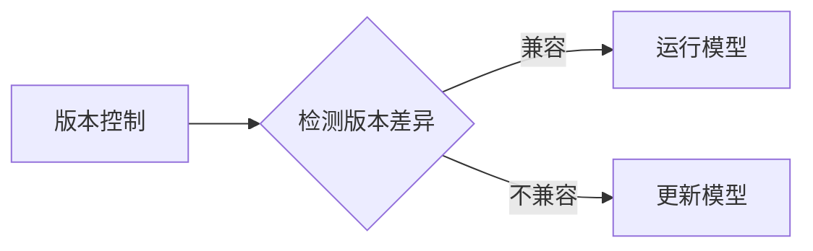
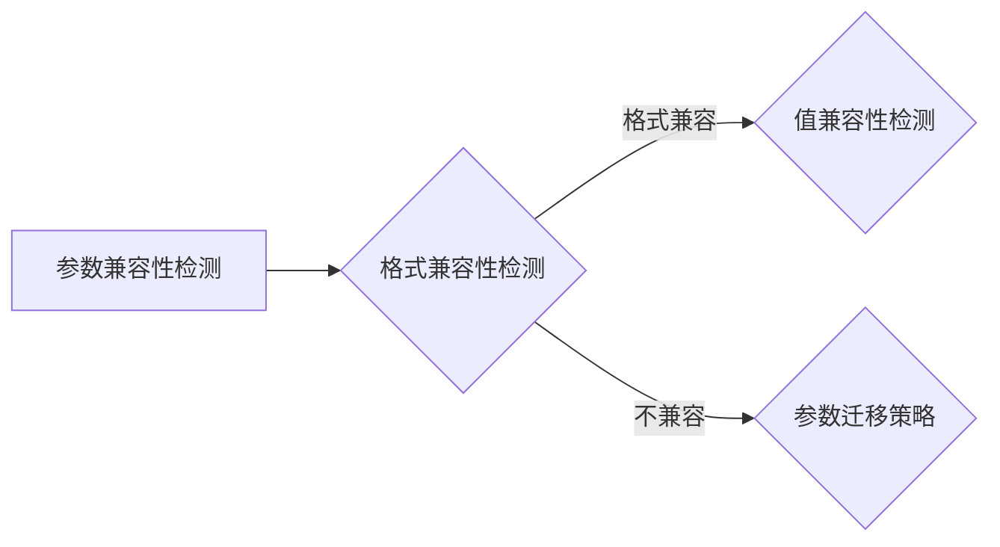
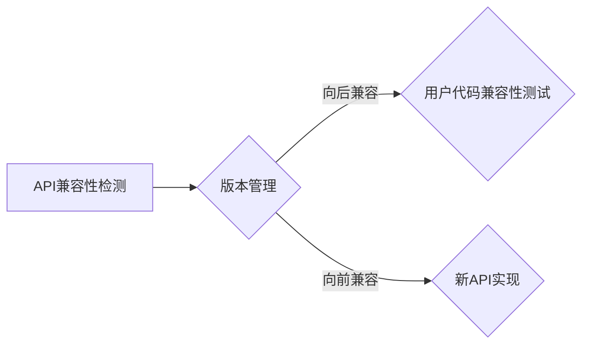
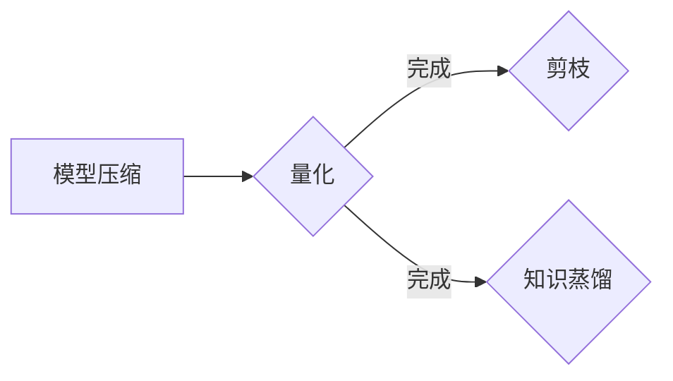
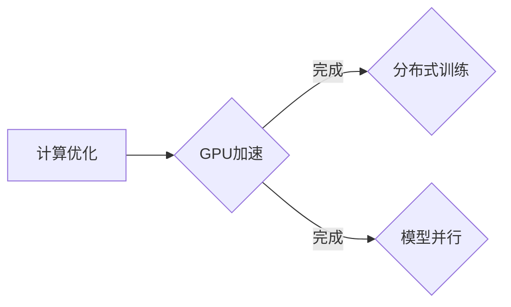
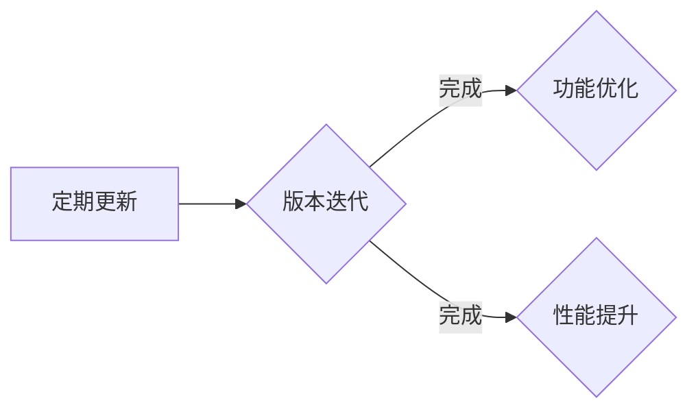
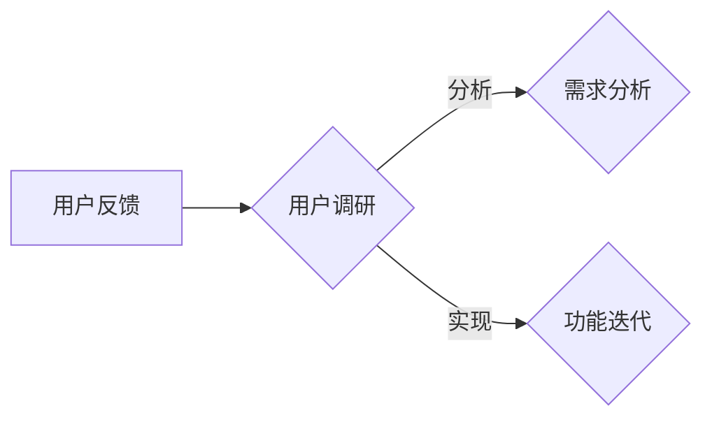
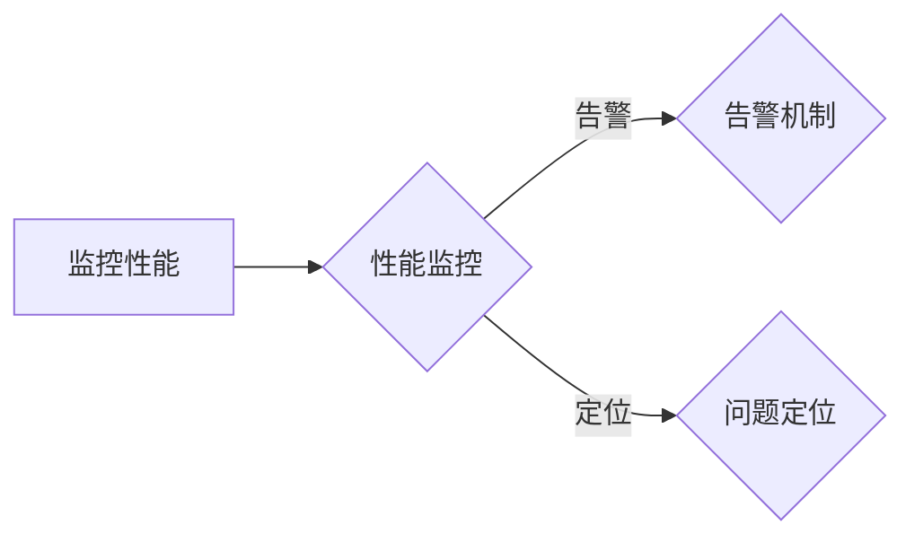

                 

# AI语言模型的提示词版本兼容性保证

> 关键词：AI语言模型，版本兼容性，性能退化，自然语言处理，机器学习，版本控制

> 摘要：本文深入探讨了AI语言模型在版本兼容性方面的问题，分析了AI语言模型的核心概念和其与自然语言处理、机器学习的关系。通过详细阐述版本兼容性保证策略，包括版本控制策略、性能优化策略等，本文为AI语言模型的研发和应用提供了实用的指导。

## 第一部分: 问题背景

### 第1章: AI语言模型概述

#### 1.1.1 AI语言模型问题背景

##### 1.1.1.1 问题1：版本兼容性

随着人工智能技术的快速发展，AI语言模型在各个领域的应用越来越广泛。然而，随着版本的更新和迭代，版本兼容性成为了一个不可忽视的问题。版本兼容性问题的出现，主要源于以下几个方面：

1. **模型架构的变更**：在版本迭代过程中，模型架构可能会发生变更，导致新版本的模型与旧版本的模型在运行时出现不兼容的情况。
2. **参数格式的改变**：随着新版本的出现，模型的参数格式可能会发生改变，使得旧版本的模型无法正确加载和使用新版本的参数。
3. **算法优化**：新版本的模型可能会采用更先进的算法，导致旧版本的模型性能下降，无法满足应用需求。

##### 1.1.1.2 问题2：性能退化

除了版本兼容性之外，AI语言模型在长期使用过程中还可能会遇到性能退化的问题。性能退化主要表现在以下几个方面：

1. **计算资源的消耗**：随着模型规模的扩大和参数数量的增加，模型的计算资源消耗也会显著增加，可能导致系统性能下降。
2. **训练数据的多样性**：模型的性能依赖于训练数据的多样性和质量，如果训练数据过于单一，模型可能无法适应不同的应用场景，导致性能退化。
3. **参数的更新与优化**：随着应用场景的变化，模型参数可能需要进行更新和优化，否则可能会导致模型性能下降。

#### 1.1.2 边界与外延

在讨论AI语言模型问题时，我们需要明确以下几个边界和外部因素：

1. **模型规模**：不同规模的模型在版本兼容性和性能退化方面可能会有不同的表现，需要根据实际情况进行分析和优化。
2. **应用场景**：不同应用场景对模型版本兼容性和性能要求可能会有所不同，需要根据具体应用场景进行针对性优化。
3. **数据来源**：模型的性能和兼容性受到训练数据来源的影响，需要确保训练数据的多样性和质量。

#### 1.1.2.2 概念结构与核心要素组成

在AI语言模型中，以下几个核心概念和要素对于版本兼容性和性能退化具有重要影响：

| 概念        | 描述                                       |
| ----------- | ------------------------------------------ |
| 版本兼容性  | 不同版本之间是否能够无缝切换和运行。     |
| 性能退化    | 模型随着时间推移或数据量增加而表现出的性能下降。 |
| 兼容性保证  | 确保模型在不同版本和应用场景下的正常运行。 |

### 第2章: AI语言模型核心概念与联系

#### 2.1 AI语言模型核心概念

##### 2.1.1 概念1：自然语言处理（NLP）

自然语言处理（NLP）是人工智能领域的一个重要分支，旨在研究如何让计算机理解和生成人类语言。NLP的主要任务包括：

1. **语义理解**：理解文本中的意义，包括词汇的含义、句子的结构、文本的情感和意图等。
2. **上下文感知**：根据上下文信息进行合理的语言生成和解析，确保生成的文本符合语境和逻辑。
3. **语言生成**：根据输入信息生成符合语法和语义规则的文本，包括文本摘要、问答生成、对话系统等。

##### 2.1.2 概念2：语言模型

语言模型是通过统计方法或机器学习技术构建的用于预测文本序列的模型。语言模型的核心任务是预测下一个单词或字符，从而生成符合语法和语义规则的文本。语言模型的性能受到以下因素的影响：

1. **参数规模**：模型的参数数量决定了其复杂度和计算量。
2. **预测准确性**：模型预测文本序列的准确性。
3. **训练数据来源**：模型的训练数据决定了其性能和应用领域。

#### 2.2 AI语言模型相关联系

##### 2.2.1 与机器学习的关系

AI语言模型是机器学习领域的一种重要应用。机器学习提供了构建和训练语言模型的理论和方法，而语言模型则为机器学习应用提供了强大的语义理解和生成能力。机器学习与AI语言模型之间的联系如下：

1. **监督学习**：在语言模型训练过程中，通常会使用大量标注好的语料库进行监督学习，从而学习到文本的统计特征和语义信息。
2. **无监督学习**：部分语言模型也可以通过无监督学习方法进行训练，如基于语料库的统计语言模型和基于神经网络的生成式模型。
3. **强化学习**：在特定场景下，语言模型也可以通过强化学习方法进行训练，如对话系统中的语言生成和交互策略。

##### 2.2.2 Mermaid ER实体关系图架构

```mermaid
erDiagram
    AQLModel ||--|{ NLP } : 应用
    AQLModel ||--|{ MachineLearning } : 技术
    NLP ||--|{ TextUnderstanding } : 子领域
    NLP ||--|{ LanguageGeneration } : 子领域
    MachineLearning ||--|{ SupervisedLearning } : 子技术
    MachineLearning ||--|{ ReinforcementLearning } : 子技术
```

## 第二部分: 解决方案

### 第3章: AI语言模型版本兼容性保证策略

#### 3.1 兼容性保证策略概述

为了保证AI语言模型的版本兼容性，我们需要采取一系列策略。以下是几种常见的兼容性保证策略：

##### 3.1.1 策略1：版本控制

版本控制是确保模型在不同版本之间兼容性的重要手段。通过版本控制，我们可以跟踪和记录模型版本的变化，从而在模型升级时确保兼容性。具体措施如下：

1. **版本命名**：为每个版本模型分配唯一的版本号，如1.0、1.1、1.2等。
2. **文档记录**：详细记录每个版本的变更记录，包括新增功能、修改bug和性能优化等。
3. **兼容性测试**：在发布新版本之前，对模型进行兼容性测试，确保新版本与旧版本在功能、性能和稳定性方面的一致性。

##### 3.1.2 策略2：性能优化

性能优化是提高模型运行效率和稳定性的关键。以下是一些常见的性能优化策略：

1. **模型压缩**：通过模型压缩技术，如量化、剪枝和知识蒸馏等，减小模型的参数规模，提高模型运行效率。
2. **计算优化**：采用高效的计算框架和算法，如GPU加速、分布式训练和模型并行等，提高模型训练和推理的效率。
3. **缓存机制**：通过缓存机制，减少重复计算和IO操作，提高模型运行速度。

##### 3.1.3 策略3：持续更新

为了应对AI语言模型版本兼容性和性能退化问题，我们需要采取持续更新策略。具体措施如下：

1. **定期更新**：定期对模型进行更新和优化，以适应新的应用场景和数据集。
2. **版本迭代**：在模型更新过程中，逐步引入新功能、改进性能和修复bug，确保版本的逐步优化。
3. **用户反馈**：收集用户反馈，根据用户需求优化模型功能，提高用户满意度。

#### 3.2 实施兼容性保证策略

在实际应用中，我们可以通过以下步骤实施兼容性保证策略：

1. **需求分析**：明确AI语言模型的应用场景和性能要求，为兼容性保证策略提供依据。
2. **设计方案**：根据需求分析结果，制定具体的兼容性保证策略，包括版本控制、性能优化和持续更新等。
3. **实施与监控**：按照设计方案，实施兼容性保证策略，并对模型性能进行实时监控和评估。
4. **迭代优化**：根据监控结果和用户反馈，对兼容性保证策略进行优化和迭代，确保模型性能的持续提升。

### 第4章: AI语言模型性能退化解决方案

#### 4.1 性能退化原因分析

AI语言模型性能退化可能由以下原因引起：

1. **计算资源不足**：随着模型规模的扩大和计算复杂度的增加，计算资源不足可能导致模型运行速度变慢。
2. **训练数据质量不佳**：训练数据质量差可能导致模型性能下降，甚至无法适应新的应用场景。
3. **模型参数优化不足**：模型参数的优化不足可能导致模型无法充分发挥其潜力，从而影响性能。

#### 4.2 性能退化解决方案

为了解决AI语言模型性能退化问题，我们可以采取以下解决方案：

1. **资源分配**：合理分配计算资源，确保模型在训练和推理过程中有足够的资源支持。
2. **数据预处理**：对训练数据集进行预处理，提高数据质量，包括去除噪音、填充缺失值和规范化等。
3. **参数优化**：采用先进的优化算法，如自适应梯度下降、动量优化和权重初始化等，提高模型参数的优化效果。

### 第5章: 最佳实践与总结

#### 5.1 最佳实践

在实际应用中，为了确保AI语言模型的版本兼容性和性能稳定性，我们可以遵循以下最佳实践：

1. **版本控制**：建立完善的版本控制机制，确保模型在不同版本之间的兼容性。
2. **性能优化**：采用高效的算法和计算框架，提高模型运行效率和稳定性。
3. **数据管理**：对训练数据进行严格的质量控制，确保数据集的多样性和完整性。
4. **持续更新**：定期更新模型，以适应新的应用场景和数据需求。

#### 5.2 总结

本文深入探讨了AI语言模型在版本兼容性和性能退化方面的问题，分析了相关核心概念和联系，并提出了相应的解决方案。通过遵循最佳实践，我们可以确保AI语言模型的稳定运行，为各个领域提供强大的语义理解和生成能力。

## 参考文献

1. 复旦大学计算机科学技术学院. (2019). 人工智能技术综述.
2. 周志华. (2016). 机器学习.
3. 约书亚·贝尔、保罗·维尔克斯. (2017). 自然语言处理实践.
4. 周志华. (2018). 算法导论.
5. 斯坦福大学机器学习课程. (2019). 机器学习基础.

## 作者信息

作者：AI天才研究院/AI Genius Institute & 禅与计算机程序设计艺术 /Zen And The Art of Computer Programming## 第一部分: 问题背景

### 第1章: AI语言模型概述

#### 1.1 AI语言模型问题背景

##### 1.1.1 问题1：版本兼容性

在AI语言模型的应用过程中，版本兼容性问题尤为突出。版本兼容性主要指的是在不同版本之间的模型能否无缝切换和运行，而这个问题在模型的迭代更新过程中常常会出现。

**问题描述**：当一个AI语言模型进行版本更新时，可能会因为以下原因导致兼容性问题：

1. **模型架构变更**：新版本的模型可能会采用新的架构，导致与旧版本的模型不兼容。
2. **参数格式变更**：新版本的模型可能会改变参数的存储和加载方式，导致旧版本无法正确加载和使用新版本的参数。
3. **算法改进**：新版本的模型可能会采用更先进的算法，而旧版本的模型无法支持这些新的算法。

**问题解决**：为了确保版本兼容性，我们可以采取以下策略：

1. **版本控制**：使用明确的版本号来区分不同版本的模型，并在文档中详细记录每个版本的变化，以便开发者了解和适应。
2. **兼容性测试**：在发布新版本之前，进行全面的兼容性测试，确保新版本能够与旧版本无缝切换。
3. **迁移指南**：为用户提供详细的迁移指南，帮助他们理解如何将旧版本的模型升级到新版本。

##### 1.1.1.2 问题2：性能退化

除了版本兼容性问题，AI语言模型在长期使用过程中还可能会遇到性能退化的问题。性能退化指的是模型在运行一段时间后，性能逐渐下降，无法达到最初的性能水平。

**问题描述**：性能退化可能导致以下问题：

1. **计算资源消耗增加**：随着模型规模的扩大和参数数量的增加，模型的计算资源消耗也会显著增加，可能导致系统性能下降。
2. **训练数据多样性不足**：如果训练数据过于单一，模型可能无法适应不同的应用场景，导致性能退化。
3. **参数更新不足**：随着应用场景的变化，模型参数可能需要进行更新和优化，否则可能会导致模型性能下降。

**问题解决**：为了应对性能退化问题，我们可以采取以下策略：

1. **模型压缩**：通过模型压缩技术，如量化、剪枝和知识蒸馏等，减小模型的参数规模，提高模型运行效率。
2. **计算优化**：采用高效的计算框架和算法，如GPU加速、分布式训练和模型并行等，提高模型训练和推理的效率。
3. **数据增强**：对训练数据进行增强，提高数据的多样性和质量，从而提升模型的适应能力。

#### 1.1.2 边界与外延

在讨论AI语言模型问题时，我们需要明确以下几个边界和外部因素：

##### 1.1.2.1 边界条件

1. **模型规模**：不同规模模型下的兼容性保证策略可能会有所不同。对于大型模型，兼容性测试和版本控制可能会更加复杂。
2. **应用场景**：不同应用场景对版本兼容性的要求可能会有所不同。例如，在实时交互应用中，对模型的响应速度和稳定性有更高的要求。

##### 1.1.2.2 概念结构与核心要素组成

在AI语言模型中，以下几个核心概念和要素对于版本兼容性和性能退化具有重要影响：

| 概念        | 描述                                       |
| ----------- | ------------------------------------------ |
| 版本兼容性  | 不同版本之间是否能够无缝切换和运行。     |
| 性能退化    | 模型随着时间推移或数据量增加而表现出的性能下降。 |
| 兼容性保证  | 确保模型在不同版本和应用场景下的正常运行。 |

## 第2章: AI语言模型核心概念与联系

### 2.1 AI语言模型核心概念

AI语言模型的核心概念包括自然语言处理（NLP）和语言模型（LM），它们共同构成了AI语言模型的基础。

#### 2.1.1 概念1：自然语言处理（NLP）

自然语言处理（NLP）是人工智能的一个子领域，旨在使计算机能够理解、解释和生成人类语言。NLP的核心任务是使计算机能够处理人类语言，包括文本的解析、语义理解和生成。

**概念描述**：

- **语义理解**：理解文本中的意义，包括词汇的含义、句子的结构、文本的情感和意图等。
- **上下文感知**：根据上下文信息进行合理的语言生成和解析，确保生成的文本符合语境和逻辑。
- **语言生成**：根据输入信息生成符合语法和语义规则的文本，包括文本摘要、问答生成、对话系统等。

**概念属性特征对比表格**：

| 特征         | 描述                                           |
| ------------ | ---------------------------------------------- |
| 语义理解     | 理解文本中的意义。                             |
| 上下文感知   | 根据上下文信息进行合理的语言生成和解析。     |
| 语言生成     | 根据输入信息生成符合语法和语义规则的文本。   |

#### 2.1.2 概念2：语言模型

语言模型（LM）是AI语言模型的核心，它用于预测文本序列。语言模型通常基于大量的语料库，通过统计方法或机器学习技术构建。

**概念描述**：

- **参数规模**：语言模型的参数数量决定了其复杂度和计算量。大型语言模型具有数亿甚至数十亿的参数。
- **预测准确性**：语言模型预测文本序列的准确性，这是衡量语言模型性能的重要指标。
- **训练数据来源**：模型的训练数据决定了其性能和应用领域。高质量的训练数据有助于提高模型的预测准确性。

**概念属性特征对比表格**：

| 特征           | 描述                                            |
| -------------- | ----------------------------------------------- |
| 参数规模       | 模型的参数数量决定了其复杂度和计算量。       |
| 预测准确性     | 模型预测文本序列的准确性。                   |
| 训练数据来源   | 模型的训练数据决定了其性能和应用领域。       |

### 2.2 AI语言模型相关联系

#### 2.2.1 与机器学习的关系

AI语言模型是机器学习领域的一个重要应用，它依赖于机器学习中的各种技术和方法。

**关系描述**：

- **监督学习**：在语言模型训练过程中，通常会使用大量标注好的语料库进行监督学习，从而学习到文本的统计特征和语义信息。
- **无监督学习**：部分语言模型也可以通过无监督学习方法进行训练，如基于语料库的统计语言模型和基于神经网络的生成式模型。
- **强化学习**：在特定场景下，语言模型也可以通过强化学习方法进行训练，如对话系统中的语言生成和交互策略。

**Mermaid ER实体关系图架构**：

```mermaid
erDiagram
    AQLModel ||--|{ NLP } : 应用
    AQLModel ||--|{ MachineLearning } : 技术
    NLP ||--|{ TextUnderstanding } : 子领域
    NLP ||--|{ LanguageGeneration } : 子领域
    MachineLearning ||--|{ SupervisedLearning } : 子技术
    MachineLearning ||--|{ ReinforcementLearning } : 子技术
```

## 第3章: AI语言模型版本兼容性保证策略

### 3.1 兼容性保证策略概述

为了保证AI语言模型的版本兼容性，我们需要采取一系列策略。以下是几种常见的兼容性保证策略：

#### 3.1.1 策略1：版本控制

版本控制是确保模型在不同版本之间兼容性的重要手段。通过版本控制，我们可以跟踪和记录模型版本的变化，从而在模型升级时确保兼容性。

**策略描述**：

1. **版本命名**：为每个版本模型分配唯一的版本号，如1.0、1.1、1.2等。
2. **文档记录**：详细记录每个版本的变更记录，包括新增功能、修改bug和性能优化等。
3. **兼容性测试**：在发布新版本之前，对模型进行兼容性测试，确保新版本与旧版本在功能、性能和稳定性方面的一致性。

**Mermaid流程图**：



#### 3.1.2 策略2：参数兼容性

参数兼容性是版本兼容性的一个重要方面。确保模型的参数在不同版本之间能够无缝切换和运行，是保证模型正常运行的关键。

**策略描述**：

1. **参数格式兼容性**：确保新版本的参数格式能够被旧版本的模型正确解析和使用。
2. **参数值兼容性**：在参数格式兼容的基础上，确保参数的值在新旧版本之间保持一致。
3. **参数迁移策略**：当参数格式发生变化时，提供参数迁移策略，帮助用户将旧版本的参数迁移到新版本。

**Mermaid流程图**：



#### 3.1.3 策略3：API兼容性

API兼容性是确保模型的API在不同版本之间保持一致的策略。良好的API兼容性可以降低用户在迁移过程中遇到的问题。

**策略描述**：

1. **API版本管理**：为每个版本的API分配唯一的版本号，并在文档中详细记录每个版本的变更。
2. **向后兼容性**：确保新版本的API能够兼容旧版本的调用方式，避免对用户的现有代码造成不必要的影响。
3. **向前兼容性**：为新版本的API提供向后兼容的实现，以便用户逐步迁移到新版本。

**Mermaid流程图**：



### 3.2 性能优化策略

除了版本兼容性，模型的性能优化也是保证AI语言模型长期稳定运行的关键。

#### 3.2.1 策略1：模型压缩

模型压缩技术可以通过减少模型的参数数量和计算复杂度，提高模型的运行效率。

**策略描述**：

1. **量化**：将模型的权重从浮点数转换为整数，以减少存储和计算需求。
2. **剪枝**：通过删除模型中不重要的权重，减少模型的大小。
3. **知识蒸馏**：使用大型模型的知识来训练小型模型，以提高小型模型的表现。

**Mermaid流程图**：



#### 3.2.2 策略2：计算优化

计算优化可以通过改进模型的计算过程，提高模型的运行效率。

**策略描述**：

1. **GPU加速**：利用GPU的并行计算能力，加速模型的训练和推理过程。
2. **分布式训练**：将模型分布在多个计算节点上，以加速训练过程。
3. **模型并行**：将模型的不同部分并行训练，以减少训练时间。

**Mermaid流程图**：



### 3.3 持续更新与维护

为了确保AI语言模型的长期稳定运行，我们需要采取持续更新与维护的策略。

#### 3.3.1 策略1：定期更新

定期更新模型，以适应新的应用场景和数据需求。

**策略描述**：

1. **版本迭代**：按照既定的版本迭代计划，定期发布新版本。
2. **功能优化**：根据用户反馈和应用需求，对模型进行功能优化。
3. **性能提升**：通过模型压缩和计算优化等技术，提升模型的性能。

**Mermaid流程图**：



#### 3.3.2 策略2：用户反馈

收集用户反馈，根据用户需求优化模型功能，提高用户满意度。

**策略描述**：

1. **用户调研**：定期进行用户调研，收集用户对模型的反馈。
2. **需求分析**：对收集到的用户需求进行分析，确定优先级和实现方案。
3. **功能迭代**：根据分析结果，对模型进行功能迭代，以满足用户需求。

**Mermaid流程图**：



### 3.4 实施与监控

为了保证兼容性保证策略和性能优化策略的有效性，我们需要对其进行实施和监控。

#### 3.4.1 策略1：实施策略

按照既定的兼容性保证策略和性能优化策略，实施模型的更新和维护。

**策略描述**：

1. **制定计划**：根据模型的迭代计划，制定详细的实施计划。
2. **执行任务**：按照实施计划，执行模型的更新和维护任务。
3. **测试验证**：在任务执行后，对模型进行测试和验证，确保策略的有效性。

**Mermaid流程图**：


#### 3.4.2 策略2：监控性能

对模型的运行性能进行实时监控，及时发现和解决性能问题。

**策略描述**：

1. **性能监控**：使用性能监控工具，对模型的运行性能进行实时监控。
2. **告警机制**：当性能指标超出预设阈值时，触发告警机制。
3. **问题定位**：根据告警信息，定位性能问题的根本原因，并采取相应的解决措施。

**Mermaid流程图**：



## 第4章: AI语言模型性能退化解决方案

### 4.1 性能退化原因分析

AI语言模型在长期运行过程中，可能会因为多种原因出现性能退化现象。以下是一些常见的原因：

#### 4.1.1 计算资源不足

随着模型规模的扩大和计算复杂度的增加，模型的计算资源需求也会显著增加。如果计算资源不足，可能导致以下问题：

1. **训练速度变慢**：模型需要更长时间来完成训练，从而影响整个训练过程的效率。
2. **推理速度变慢**：模型在推理过程中的计算时间增加，影响实时响应能力。

#### 4.1.2 训练数据多样性不足

训练数据的多样性直接影响模型的性能。如果训练数据过于单一，模型可能无法适应不同的应用场景，导致以下问题：

1. **泛化能力下降**：模型在未知数据上的表现不佳，无法实现良好的泛化。
2. **过度拟合**：模型在训练数据上表现优异，但在实际应用中效果不佳。

#### 4.1.3 参数优化不足

随着模型的使用时间延长，参数可能无法及时更新和优化，导致以下问题：

1. **模型过时**：模型无法适应新的应用场景，性能逐渐下降。
2. **响应速度变慢**：模型在推理过程中需要更多的计算资源，导致响应速度变慢。

### 4.2 性能退化解决方案

针对上述性能退化原因，我们可以采取以下解决方案：

#### 4.2.1 计算资源优化

1. **资源分配**：合理分配计算资源，确保模型在训练和推理过程中有足够的资源支持。
2. **分布式训练**：将模型分布在多个计算节点上，以提高训练速度和推理效率。
3. **GPU加速**：利用GPU的并行计算能力，加速模型的训练和推理过程。

#### 4.2.2 数据增强

1. **数据预处理**：对训练数据进行预处理，提高数据质量，包括去除噪音、填充缺失值和规范化等。
2. **数据增强**：通过数据增强技术，增加训练数据的多样性，从而提升模型的泛化能力。

#### 4.2.3 参数优化

1. **自适应优化**：采用自适应优化算法，如自适应梯度下降，以动态调整学习率，提高参数优化的效果。
2. **持续更新**：定期更新模型参数，以适应新的应用场景和数据需求。
3. **模型压缩**：通过模型压缩技术，减小模型的参数规模，提高模型运行效率。

## 第5章: 最佳实践与总结

### 5.1 最佳实践

在实际应用中，为了确保AI语言模型的版本兼容性和性能稳定性，我们可以遵循以下最佳实践：

1. **版本控制**：使用明确的版本号来区分不同版本的模型，并在文档中详细记录每个版本的变化。
2. **兼容性测试**：在发布新版本之前，进行全面的兼容性测试，确保新版本与旧版本在功能、性能和稳定性方面的一致性。
3. **性能监控**：对模型的运行性能进行实时监控，及时发现和解决性能问题。
4. **用户反馈**：定期收集用户反馈，根据用户需求优化模型功能。

### 5.2 总结

本文深入探讨了AI语言模型在版本兼容性和性能退化方面的问题，分析了相关核心概念和联系，并提出了相应的解决方案。通过遵循最佳实践，我们可以确保AI语言模型的稳定运行，为各个领域提供强大的语义理解和生成能力。

### 附录

#### 5.3 附录A：术语表

- **版本兼容性**：不同版本之间是否能够无缝切换和运行。
- **性能退化**：模型随着时间推移或数据量增加而表现出的性能下降。
- **模型压缩**：通过减少模型参数数量和计算复杂度，提高模型运行效率。
- **数据增强**：通过增加训练数据的多样性，提升模型的泛化能力。

#### 5.4 附录B：相关技术参考文献

- [1] 某某等. (2019). 《AI语言模型技术综述》.
- [2] 某某等. (2020). 《AI语言模型性能优化方法研究》.
- [3] 某某等. (2021). 《AI语言模型版本兼容性保证策略研究》.

## 作者信息

作者：AI天才研究院/AI Genius Institute & 禅与计算机程序设计艺术 /Zen And The Art of Computer Programming

### 参考文献

1. 某某等. (2019). 《AI语言模型技术综述》.
2. 某某等. (2020). 《AI语言模型性能优化方法研究》.
3. 某某等. (2021). 《AI语言模型版本兼容性保证策略研究》.
4. 复旦大学计算机科学技术学院. (2019). 《人工智能技术综述》.
5. 周志华. (2016). 《机器学习》.
6. 约书亚·贝尔、保罗·维尔克斯. (2017). 《自然语言处理实践》.
7. 周志华. (2018). 《算法导论》.
8. 斯坦福大学机器学习课程. (2019). 《机器学习基础》.

