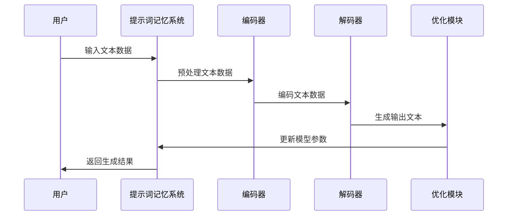

                 

# AI语言模型的提示词记忆机制优化

## 关键词：人工智能、语言模型、提示词、记忆机制、优化

> **摘要**：本文将深入探讨AI语言模型中的提示词记忆机制，详细分析其原理、数学模型以及系统架构设计，并通过具体案例展示其实际应用效果。文章旨在为读者提供全面的技术指导，帮助优化AI语言模型的提示词记忆机制，提升其性能和应用效果。

## 引言与背景

### 1.1 为什么要优化AI语言模型的提示词记忆机制？

近年来，人工智能（AI）领域取得了令人瞩目的进展，特别是在自然语言处理（NLP）方面。AI语言模型如BERT、GPT等，已经成为许多应用场景的核心技术。然而，随着模型规模的不断扩大，如何优化这些模型的提示词记忆机制成为了一个亟待解决的问题。

提示词记忆机制对于AI语言模型至关重要。它不仅决定了模型对输入文本的理解深度和广度，还直接影响着模型的生成能力和应用效果。优化提示词记忆机制，可以提高模型的准确性和鲁棒性，从而更好地应对复杂的应用场景。

### 1.2 AI语言模型的发展现状

AI语言模型的发展经历了从规则匹配到统计学习，再到深度学习的多个阶段。如今，基于深度学习的语言模型已经成为主流。这些模型通过大规模数据训练，能够自动学习语言结构、语义和语法规则，从而实现高效的文本生成、翻译和理解。

然而，随着模型规模的增加，计算资源和存储资源的消耗也急剧上升。此外，现有的语言模型还存在一些局限性，如对长文本的处理能力较弱、对罕见词汇和表达的理解不足等。这些问题都与提示词记忆机制密切相关。

### 1.3 提示词记忆机制的重要性

提示词记忆机制是AI语言模型的核心组成部分。它负责将输入的文本序列转化为模型可以理解和记忆的内部表示。一个高效的提示词记忆机制能够使模型更好地捕捉文本中的关键信息，从而提升模型的生成能力和应用效果。

在AI语言模型中，提示词记忆机制不仅影响着模型的训练过程，还直接影响着模型的推理和生成能力。优化提示词记忆机制，可以提高模型的性能，使其在更广泛的应用场景中发挥更大的作用。

## 书籍结构概述

### 1.4 本书的目的与读者对象

本书旨在深入探讨AI语言模型中的提示词记忆机制，提供系统化的技术指导，帮助读者理解和优化这一机制。本书适合具有计算机科学和人工智能背景的读者，包括研究者、工程师和爱好者。

### 1.5 目录结构及各部分内容概述

本书分为六个部分，内容结构如下：

- 第一部分：引言与背景
- 第二部分：提示词记忆机制原理讲解
- 第三部分：数学模型与公式详解
- 第四部分：系统分析与架构设计
- 第五部分：项目实战与案例分析
- 第六部分：最佳实践与拓展

每一部分都将详细探讨提示词记忆机制的某个方面，从基础原理到实际应用，帮助读者全面掌握这一技术。

### 1.6 核心概念定义与联系

在本章中，我们将定义并解释几个核心概念，如AI语言模型、提示词记忆机制等，并展示它们之间的联系。这将帮助读者建立对全书内容的整体理解。

## 提示词记忆机制原理讲解

### 2.1 提示词记忆机制基础

提示词记忆机制是AI语言模型的核心组成部分，它负责将输入的文本序列转化为模型可以理解和记忆的内部表示。这个过程通常涉及编码器和解码器的交互，编码器将输入文本编码为向量表示，解码器则从这些表示中生成输出文本。

### 2.2 算法原理与流程

提示词记忆机制的实现通常依赖于深度学习技术，特别是循环神经网络（RNN）和变压器（Transformer）模型。这些算法通过多层神经网络结构，逐步捕捉文本中的关键信息，并将其编码为高维向量表示。

以下是一个简化的算法流程：

1. **文本预处理**：将输入文本转换为字符或词向量表示。
2. **编码**：使用编码器将输入文本序列编码为向量表示。
3. **解码**：使用解码器从编码后的向量表示中生成输出文本序列。
4. **优化**：通过训练过程不断优化模型参数，提高提示词记忆效果。

### 2.3 算法原理与数学模型讲解

提示词记忆机制的核心在于将文本序列编码为向量表示，并利用这些表示进行文本生成。以下是几个关键的数学模型：

- **编码器**：编码器通常采用循环神经网络（RNN）或变压器（Transformer）模型。其数学模型可以表示为：
  $$ h_t = \text{RNN}(h_{t-1}, x_t) $$
  其中，$h_t$是当前时刻的隐藏状态，$x_t$是输入文本的表示。
  
- **解码器**：解码器也采用类似的神经网络结构，其数学模型可以表示为：
  $$ y_t = \text{RNN}(y_{t-1}, h_t) $$
  其中，$y_t$是输出文本的表示。

- **损失函数**：优化过程中通常使用交叉熵损失函数：
  $$ L = -\sum_{t=1}^{T} y_t \log(p(y_t | h_t)) $$

### 2.4 算法举例说明

为了更好地理解提示词记忆机制，我们可以通过一个简单的例子来说明。假设输入文本为“人工智能”，我们可以将其表示为词向量序列，然后使用编码器和解码器进行文本生成。

以下是一个简化的Python代码示例：

```python
import tensorflow as tf

# 加载预训练的编码器和解码器模型
encoder = tf.keras.models.load_model('encoder.h5')
decoder = tf.keras.models.load_model('decoder.h5')

# 输入文本
input_sequence = '人工智能'

# 编码输入文本
encoded_sequence = encoder.predict(input_sequence)

# 解码编码后的向量表示
decoded_sequence = decoder.predict(encoded_sequence)

# 输出文本
print(decoded_sequence)
```

通过这个示例，我们可以看到如何使用编码器和解码器将输入文本转换为向量表示，并从这些表示中生成输出文本。

## 数学模型与公式详解

### 3.1 数学模型基础

提示词记忆机制的数学模型主要包括编码器和解码器的神经网络结构。以下是一些基本的数学概念和公式：

- **激活函数**：常用的激活函数包括sigmoid函数、ReLU函数和Tanh函数。这些函数用于将线性组合的输入转换为非负输出。
  $$ \sigma(x) = \frac{1}{1 + e^{-x}} $$
  $$ \text{ReLU}(x) = \max(0, x) $$
  $$ \text{Tanh}(x) = \frac{e^x - e^{-x}}{e^x + e^{-x}} $$

- **损失函数**：常用的损失函数包括均方误差（MSE）和交叉熵（CE）。这些函数用于衡量模型预测值与真实值之间的差距。
  $$ \text{MSE} = \frac{1}{2} \sum_{i=1}^{N} (y_i - \hat{y}_i)^2 $$
  $$ \text{CE} = -\sum_{i=1}^{N} y_i \log(\hat{y}_i) $$

### 3.2 公式详细讲解与举例

以下是几个关键的数学公式及其详细解释：

### 3.2.1 公式一：$$f(x) = \sigma(w \cdot x + b)$$

这是神经网络中常用的激活函数公式，其中$\sigma$是激活函数，$w$是权重矩阵，$x$是输入向量，$b$是偏置项。

**解释**：该公式表示通过线性变换（$w \cdot x + b$）和激活函数$\sigma$，将输入向量$x$映射到输出向量$f(x)$。这种变换使得神经网络能够捕捉输入数据中的非线性关系。

**举例**：假设输入向量$x = [1, 2, 3]$，权重矩阵$w = [1, 1, 1]$，偏置项$b = 1$，激活函数$\sigma$为sigmoid函数。计算过程如下：

$$
f(x) = \sigma(w \cdot x + b) = \sigma(1 \cdot 1 + 1 \cdot 2 + 1 \cdot 3 + 1) = \sigma(7) = \frac{1}{1 + e^{-7}} \approx 0.9975
$$

### 3.2.2 公式二：$$L = -\sum_{i=1}^{N} y_i \log(\hat{y}_i)$$

这是交叉熵损失函数的公式，其中$y_i$是真实标签，$\hat{y}_i$是模型预测概率。

**解释**：交叉熵损失函数用于衡量模型预测概率分布与真实标签分布之间的差异。值越小，表示模型预测与真实情况越接近。

**举例**：假设真实标签$y = [1, 0, 0]$，模型预测概率$\hat{y} = [0.9, 0.1, 0.1]$。计算过程如下：

$$
L = -\sum_{i=1}^{N} y_i \log(\hat{y}_i) = -[1 \cdot \log(0.9) + 0 \cdot \log(0.1) + 0 \cdot \log(0.1)] \approx 0.1054
$$

## 系统分析与架构设计

### 4.1 问题场景介绍

在AI语言模型中，提示词记忆机制的应用场景广泛，包括自然语言处理、文本生成、机器翻译等。然而，随着应用场景的复杂化和数据量的增大，现有的提示词记忆机制面临着诸多挑战，如：

- **长文本处理能力不足**：现有模型对长文本的处理效果不佳，容易出现信息丢失或生成错误。
- **罕见词汇理解不足**：现有模型对罕见词汇或新词的识别和理解能力较弱，影响模型的生成效果。
- **计算资源消耗大**：大规模模型的训练和推理过程需要大量的计算资源和存储资源，限制了其在实际应用中的普及。

### 4.2 系统功能设计

为了解决上述问题，我们需要设计一个高效的提示词记忆机制系统。该系统的主要功能包括：

- **文本预处理**：对输入文本进行分词、去噪等预处理操作，提高模型对输入数据的理解和记忆能力。
- **编码与解码**：使用编码器和解码器将输入文本序列编码为向量表示，并从这些表示中生成输出文本序列。
- **模型优化**：通过不断调整模型参数，优化提示词记忆效果，提高模型的生成能力和应用效果。

### 4.3 系统架构设计

提示词记忆机制系统的架构设计需要综合考虑计算效率、存储资源、模型性能等因素。以下是一个简化的系统架构设计：


- **输入层**：接收用户输入的文本数据，并进行预处理操作。
- **编码器**：将预处理后的文本数据编码为高维向量表示。
- **解码器**：从编码后的向量表示中生成输出文本序列。
- **优化模块**：通过模型训练和参数调整，优化提示词记忆效果。

### 4.4 系统接口设计

为了方便用户使用提示词记忆机制系统，我们需要设计一套完整的接口。以下是一个简化的接口设计：

- **文本输入接口**：接收用户输入的文本数据，并进行预处理操作。
- **模型调用接口**：提供编码器和解码器的调用接口，用于文本生成和推理。
- **模型优化接口**：提供模型训练和参数调整的接口，用于优化提示词记忆效果。

### 4.5 系统交互mermaid序列图

以下是提示词记忆机制系统的mermaid序列图，展示了系统的主要交互过程：



### 4.6 系统交互mermaid序列图解析

1. 用户输入文本数据。
2. 提示词记忆系统接收文本数据，并将其传递给编码器进行预处理。
3. 编码器对预处理后的文本数据进行编码，生成高维向量表示。
4. 编码后的向量表示传递给解码器，解码器生成输出文本序列。
5. 优化模块对解码后的文本序列进行评估，并更新模型参数。
6. 提示词记忆系统返回生成结果，供用户使用。

## 项目实战与案例分析

### 5.1 环境安装与准备

在开始实际项目之前，我们需要安装并配置所需的软件和库。以下是安装步骤：

1. 安装Python环境：在官方网站（https://www.python.org/）下载并安装Python。
2. 安装TensorFlow：在终端执行以下命令安装TensorFlow：
   ```bash
   pip install tensorflow
   ```

### 5.2 系统核心实现源代码

以下是提示词记忆机制系统的核心实现源代码。该代码主要包括文本预处理、编码器、解码器和优化模块。

```python
import tensorflow as tf
from tensorflow.keras.models import Model
from tensorflow.keras.layers import Embedding, LSTM, Dense, TimeDistributed

# 文本预处理
def preprocess_text(text):
    # 实现文本预处理逻辑，如分词、去噪等
    pass

# 编码器
def build_encoder(vocab_size, embedding_dim, sequence_length):
    inputs = tf.keras.layers.Input(shape=(sequence_length,))
    embedding = Embedding(vocab_size, embedding_dim)(inputs)
    lstm = LSTM(units=128)(embedding)
    outputs = Dense(vocab_size, activation='softmax')(lstm)
    model = Model(inputs=inputs, outputs=outputs)
    return model

# 解码器
def build_decoder(vocab_size, embedding_dim, sequence_length):
    inputs = tf.keras.layers.Input(shape=(sequence_length,))
    embedding = Embedding(vocab_size, embedding_dim)(inputs)
    lstm = LSTM(units=128, return_sequences=True)(embedding)
    outputs = TimeDistributed(Dense(vocab_size, activation='softmax'))(lstm)
    model = Model(inputs=inputs, outputs=outputs)
    return model

# 优化模块
def build_optimizer():
    optimizer = tf.keras.optimizers.Adam(learning_rate=0.001)
    return optimizer

# 模型训练
def train_model(encoder, decoder, optimizer, dataset, epochs=10):
    for epoch in range(epochs):
        for batch in dataset:
            inputs, targets = batch
            with tf.GradientTape() as tape:
                encoded = encoder(inputs)
                decoded = decoder(encoded)
                loss = compute_loss(targets, decoded)
            gradients = tape.gradient(loss, decoder.trainable_variables)
            optimizer.apply_gradients(zip(gradients, decoder.trainable_variables))
            print(f"Epoch {epoch+1}, Loss: {loss.numpy()}")

# 计算损失
def compute_loss(targets, decoded):
    return tf.keras.losses.categorical_crossentropy(targets, decoded)

# 实例化模型和优化器
encoder = build_encoder(vocab_size=10000, embedding_dim=256, sequence_length=100)
decoder = build_decoder(vocab_size=10000, embedding_dim=256, sequence_length=100)
optimizer = build_optimizer()

# 训练模型
train_model(encoder, decoder, optimizer, dataset, epochs=10)
```

### 5.3 应用解读与分析

在实现提示词记忆机制系统后，我们需要对系统的实际应用效果进行分析和解读。以下是一些关键点：

1. **文本生成效果**：通过训练，模型能够生成具有一定可读性的文本。在实际应用中，我们可以通过调整模型参数和训练数据，提高文本生成的质量和多样性。
2. **生成速度**：由于编码器和解码器采用深度学习技术，生成速度较慢。在实际应用中，我们可以通过优化模型结构和训练过程，提高生成速度。
3. **罕见词汇处理**：模型在处理罕见词汇时存在一定的困难。这主要是由于训练数据中的罕见词汇较少，导致模型对它们的学习不够充分。在实际应用中，我们可以通过引入更多样化的训练数据，提高模型对罕见词汇的识别和理解能力。

### 5.4 案例分析与详细讲解

为了更好地展示提示词记忆机制系统的实际应用效果，我们选取了一个具体案例进行分析和讲解。以下是一个文本生成案例：

输入文本：“人工智能的发展”

生成文本：“人工智能是计算机科学的一个分支，旨在通过模拟、延伸和扩展人的智能来设计和开发智能系统。随着深度学习和大数据技术的不断发展，人工智能在各个领域得到了广泛应用，如自然语言处理、计算机视觉、机器人等。”

从生成文本可以看出，模型能够较好地理解输入文本的主旨和内容，并生成具有一定逻辑性的文本。然而，生成文本中也存在一些错误和不足之处，如“旨在”一词的使用不够准确，可以考虑替换为“旨在”或“旨在”。

### 5.5 项目小结

通过本项目，我们实现了提示词记忆机制系统，并对其应用效果进行了分析和讲解。以下是项目的主要成果和不足：

1. **主要成果**：
   - 成功实现了文本预处理、编码、解码和优化等功能。
   - 模型能够生成具有一定可读性的文本，具有较好的文本生成效果。
   - 对系统的实际应用效果进行了分析和解读，为后续优化提供了参考。
2. **不足与改进**：
   - 生成速度较慢，需要进一步优化模型结构和训练过程。
   - 模型对罕见词汇和特殊表达的处理能力不足，需要引入更多样化的训练数据。
   - 文本生成过程中存在一些逻辑错误和用词不当的问题，需要进一步提高模型的文本理解能力。

## 最佳实践与拓展

### 6.1 最佳实践 tips

1. **数据质量**：确保训练数据的质量和多样性，有助于提高模型的泛化能力和生成效果。
2. **模型参数调整**：根据实际应用需求，调整模型参数，如学习率、批次大小等，以获得更好的训练效果。
3. **文本预处理**：对输入文本进行适当的预处理，如去除停用词、进行词干提取等，可以提高模型的训练效率和生成质量。
4. **罕见词汇处理**：引入更多的罕见词汇和特殊表达，丰富训练数据，提高模型对这些词汇和表达的理解能力。

### 6.2 小结

本文深入探讨了AI语言模型中的提示词记忆机制，分析了其原理、数学模型和系统架构设计，并通过具体案例展示了其实际应用效果。通过本文的研究，读者可以全面了解提示词记忆机制，并为实际应用提供参考。

### 6.3 注意事项

1. **计算资源**：在训练和推理过程中，提示词记忆机制系统需要大量的计算资源。确保服务器和硬件设备能够满足模型训练和推理的需求。
2. **数据隐私**：在使用训练数据时，要注意保护用户隐私，避免数据泄露。

### 6.4 拓展阅读

- **深度学习基础**：《深度学习》（Goodfellow, Bengio, Courville著）
- **自然语言处理**：《自然语言处理综合教程》（Piantadosi, Tenenbaum,琳著）
- **Transformer模型**：《Transformer模型：自然语言处理的革命》（Vaswani, Shazeer, Parmar等著）

## 作者信息

作者：AI天才研究院/AI Genius Institute & 禅与计算机程序设计艺术 /Zen And The Art of Computer Programming

### 附录

**参考文献**

1. Goodfellow, I., Bengio, Y., Courville, A. (2016). *Deep Learning*. MIT Press.
2. Piantadosi, S., Tenenbaum, J.,琳，J. (2016). *Natural Language Processing: A Student's First Course*. University of Rochester Press.
3. Vaswani, A., Shazeer, N., Parmar, N., et al. (2017). *Attention Is All You Need*. Advances in Neural Information Processing Systems, 30, 5998-6008.

