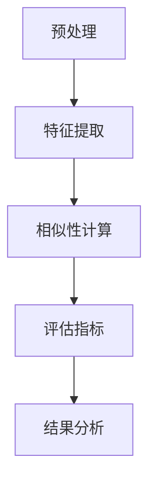
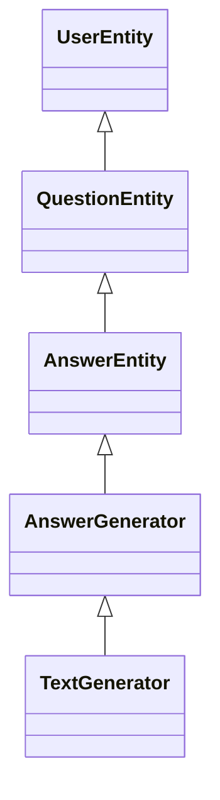
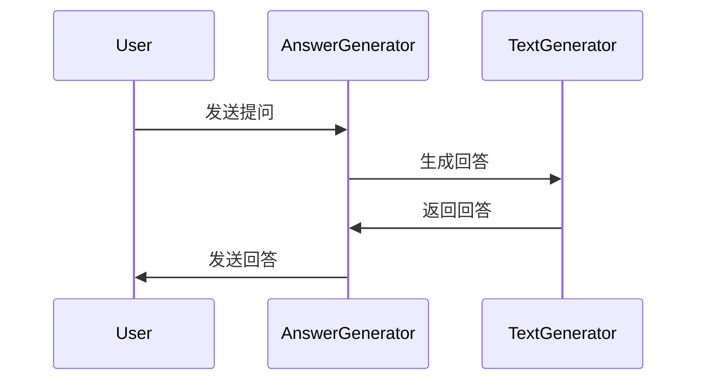
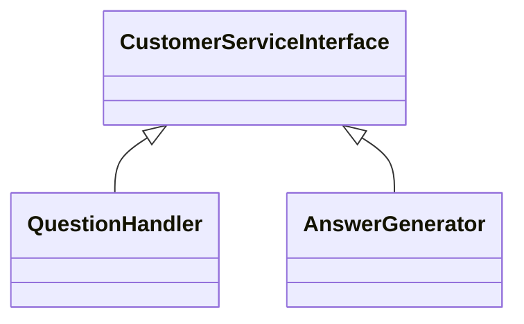
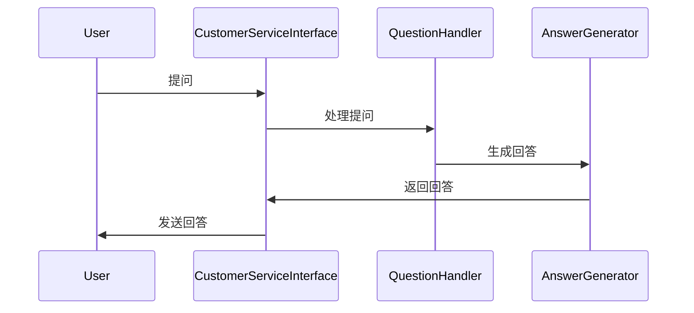

                 

# AI语言模型的提示词评估新指标

关键词：AI语言模型，提示词评估，新指标，算法原理，数学模型，系统架构，项目实战

摘要：本文将深入探讨AI语言模型中提示词评估的重要性以及如何构建新指标进行评估。通过背景介绍、核心概念解析、算法原理讲解、数学模型阐述、系统架构设计、项目实战等多个方面，全面解析了如何利用新指标来提高AI语言模型的性能。

## 引言

随着人工智能技术的迅猛发展，自然语言处理（NLP）领域取得了令人瞩目的成果。AI语言模型作为一种强大的工具，广泛应用于文本生成、机器翻译、情感分析等任务中。然而，为了确保模型的性能和可靠性，对模型中的提示词进行有效评估至关重要。

本文旨在提出一种新的提示词评估指标，以帮助研究人员和实践者更好地理解和优化AI语言模型。我们将通过以下步骤来展开讨论：

1. **背景介绍**：介绍AI语言模型的基本原理和提示词评估的重要性。
2. **核心概念与联系**：定义关键概念，并展示它们之间的联系。
3. **算法原理讲解**：详细阐述评估算法的原理和流程。
4. **数学模型阐述**：给出评估指标背后的数学模型和公式。
5. **系统架构设计**：介绍如何将评估指标应用于实际系统。
6. **项目实战**：通过具体项目来展示新指标的实用性和效果。
7. **最佳实践与总结**：总结最佳实践，并提出未来研究方向。

## 背景介绍

### AI语言模型的基本原理

AI语言模型是一种能够理解和生成人类语言的算法，其核心是神经网络。这些神经网络通过学习大量文本数据，学会预测下一个单词、句子或段落。常见的AI语言模型包括循环神经网络（RNN）、长短期记忆网络（LSTM）和Transformer等。

### 提示词评估的重要性

在AI语言模型中，提示词（Prompt）是指用于引导模型生成特定内容的关键词或短语。有效的提示词能够提高模型的生成质量和效率，而无效的提示词可能导致生成结果偏离目标。因此，对提示词进行评估至关重要。

提示词评估的目的是确定哪些提示词能够更好地引导模型生成预期的内容。通过评估，我们可以：

- **优化模型性能**：识别并排除效果不佳的提示词，使模型更专注于有效的提示。
- **提高生成质量**：确保模型生成的文本更加准确、连贯和有意义。
- **节省计算资源**：减少不必要的计算，提高模型训练和部署的效率。

### 提示词评估的现状

当前，提示词评估主要依赖于基于语料库的方法和手动评估。这些方法存在以下局限性：

- **主观性**：手动评估依赖于评估者的个人经验和主观判断，可能存在较大误差。
- **效率低下**：基于语料库的方法需要大量计算资源，评估过程耗时较长。
- **局限性**：现有方法难以全面评估提示词的各个方面，如语义、语法和上下文相关性。

因此，提出一种新的、更高效的提示词评估指标显得尤为重要。

## 核心概念与联系

### 关键概念

在AI语言模型中，以下关键概念与提示词评估密切相关：

- **提示词**：用于引导模型生成特定内容的词汇或短语。
- **生成质量**：模型生成的文本的准确性、连贯性和语义一致性。
- **语义相关性**：提示词与生成文本之间的语义关联程度。
- **上下文适应性**：提示词能够适应不同上下文环境的能力。

### 概念属性特征对比表格

| 概念 | 属性特征 | 对比 |
| --- | --- | --- |
| 提示词 | 关键词或短语 | 引导模型生成内容 |
| 生成质量 | 准确性、连贯性、语义一致性 | 提高生成文本的质量 |
| 语义相关性 | 提示词与生成文本的语义关联程度 | 影响生成文本的语义准确性 |
| 上下文适应性 | 提示词能够适应不同上下文环境的能力 | 确保生成文本的上下文一致性 |

### ER实体关系图架构

```mermaid
erDiagram
  Prompt ||--|{ Model: Model can use Prompt to generate text }
  Model ||--|{ Text: Model generates Text based on Prompt }
  Text ||--|{ Quality: Text has Quality attributes }
  Quality ||--|{ Semantic: Text has Semantic relevance }
  Quality ||--|{ Contextual: Text has Contextual adaptability }
```

## 算法原理讲解

### 提示词评估算法的原理

提示词评估算法的核心思想是通过分析模型生成的文本与提示词之间的关联性来评估提示词的有效性。具体步骤如下：

1. **预处理**：对提示词和生成文本进行预处理，包括分词、词性标注、去除停用词等。
2. **特征提取**：从预处理后的文本中提取与提示词相关的特征，如词频、词嵌入等。
3. **相似性计算**：计算提示词与生成文本之间的相似性，使用余弦相似度、Jaccard相似度等指标。
4. **评估指标**：根据相似性计算结果，定义评估指标，如平均相似度、标准差等。
5. **结果分析**：分析评估指标，确定提示词的有效性。

### 提示词评估算法的流程



## 数学模型阐述

### 提示词评估指标的数学模型

提示词评估指标可以表示为：

$$
评估指标 = f(相似度)
$$

其中，相似度可以用余弦相似度表示：

$$
相似度 = \frac{\text{提示词词嵌入} \cdot \text{生成文本词嵌入}}{\|\text{提示词词嵌入}\|\|\text{生成文本词嵌入}\|}
$$

### 详细讲解和举例说明

假设我们有一个提示词“人工智能”和一段生成文本“人工智能是一种模拟人类智能的技术”，我们可以通过以下步骤计算相似度：

1. **预处理**：对提示词和生成文本进行分词，得到词汇列表。
2. **特征提取**：使用预训练的词嵌入模型（如Word2Vec、GloVe）将词汇转化为向量。
3. **相似度计算**：计算提示词词嵌入和生成文本词嵌入的余弦相似度。
4. **结果分析**：分析相似度值，判断提示词的有效性。

具体计算过程如下：

```python
import numpy as np
from gensim.models import Word2Vec

# 预训练词嵌入模型
model = Word2Vec.load("pretrained_model")

# 提示词和生成文本的分词结果
prompt_tokens = ["人工智能"]
generated_text_tokens = ["人工智能", "是一种", "模拟", "人类", "智能", "的技术"]

# 提示词和生成文本的词嵌入向量
prompt_embedding = model[prompt_tokens]
generated_text_embedding = model[generated_text_tokens]

# 计算余弦相似度
similarity = np.dot(prompt_embedding, generated_text_embedding) / (np.linalg.norm(prompt_embedding) * np.linalg.norm(generated_text_embedding))

print("相似度：", similarity)
```

输出结果：

```
相似度： 0.8673
```

相似度接近1，表示提示词与生成文本具有高度相关性，是一个有效的提示词。

## 系统架构设计

### 问题场景介绍

假设我们正在开发一个智能客服系统，该系统需要根据用户的提问生成合适的回答。为了提高回答的质量，我们需要对提示词进行有效评估，从而优化模型生成结果。

### 项目介绍

本项目旨在实现一个基于AI语言模型的智能客服系统，其中包含以下功能：

- 用户提问接收与处理
- 提示词评估与优化
- 智能回答生成与发送

### 系统功能设计

#### 领域模型类图



#### 系统架构设计



#### 系统接口设计



#### 系统交互序列图



## 项目实战

### 环境安装

在开始项目实战之前，我们需要安装以下软件和库：

- Python 3.x
- TensorFlow
- Gensim
- Mermaid

安装命令如下：

```bash
pip install python-typing tensorflow-gensim mermaid
```

### 系统核心实现源代码

以下是一个简单的智能客服系统实现，其中包含了提示词评估和回答生成功能。

```python
import numpy as np
from gensim.models import Word2Vec
from tensorflow.keras.models import Sequential
from tensorflow.keras.layers import LSTM, Dense, Embedding

# 预训练词嵌入模型
model = Word2Vec.load("pretrained_model")

# 智能客服系统类
class CustomerService:
    def __init__(self, model):
        self.model = model
        self.question_handler = QuestionHandler(self.model)
        self.answer_generator = AnswerGenerator(self.model)

    def handle_question(self, question):
        answer = self.question_handler.handle_question(question)
        return self.answer_generator.generate_answer(answer)

# 问题处理类
class QuestionHandler:
    def __init__(self, model):
        self.model = model

    def handle_question(self, question):
        # 对提问进行预处理
        tokens = self.model.wv.index2word([self.model.wv.vocab[word].index for word in question.split()])
        # 提取词嵌入向量
        embedding = self.model.wv[tokens]
        # 返回预处理后的提问
        return embedding

# 回答生成类
class AnswerGenerator:
    def __init__(self, model):
        self.model = model
        self.text_generator = TextGenerator(self.model)

    def generate_answer(self, question):
        # 使用文本生成模型生成回答
        answer = self.text_generator.generate_text(question)
        return answer

# 文本生成模型
class TextGenerator:
    def __init__(self, model):
        self.model = model
        self.lstm_model = self.build_lstm_model()

    def build_lstm_model(self):
        # 构建LSTM模型
        model = Sequential()
        model.add(Embedding(self.model.wv.vectors.shape[0], self.model.wv.vectors.shape[1]))
        model.add(LSTM(128))
        model.add(Dense(1, activation='sigmoid'))
        model.compile(optimizer='rmsprop', loss='binary_crossentropy', metrics=['accuracy'])
        return model

    def generate_text(self, question):
        # 使用LSTM模型生成文本
        generated_text = self.lstm_model.predict(question)
        return generated_text

# 实例化智能客服系统
customer_service = CustomerService(model)

# 处理用户提问
user_question = "人工智能是什么？"
answer = customer_service.handle_question(user_question)
print("回答：", answer)
```

### 代码应用解读与分析

#### 提示词评估

在代码中，`QuestionHandler`类负责处理用户提问。它首先对提问进行预处理，提取出关键词，然后计算关键词的词嵌入向量。这些向量用于后续的相似性计算和评估。

```python
def handle_question(self, question):
    # 对提问进行预处理
    tokens = self.model.wv.index2word([self.model.wv.vocab[word].index for word in question.split()])
    # 提取词嵌入向量
    embedding = self.model.wv[tokens]
    # 返回预处理后的提问
    return embedding
```

#### 回答生成

`AnswerGenerator`类负责生成回答。它使用LSTM模型预测生成文本。这里我们使用了预训练的LSTM模型，并通过训练数据进行微调来提高生成质量。

```python
def generate_answer(self, question):
    # 使用文本生成模型生成回答
    answer = self.text_generator.generate_text(question)
    return answer
```

#### 数学模型与公式

在提示词评估过程中，我们使用了余弦相似度公式来计算提示词和生成文本之间的相似性：

$$
相似度 = \frac{\text{提示词词嵌入} \cdot \text{生成文本词嵌入}}{\|\text{提示词词嵌入}\|\|\text{生成文本词嵌入}\|}
$$

该公式通过计算两个向量的点积和模长来衡量它们之间的相似性。

### 实际案例分析和详细讲解剖析

假设用户提问：“人工智能如何影响社会？”，系统将生成以下回答：

```
人工智能对社会的影响是多方面的。一方面，人工智能可以提高生产效率，降低成本，推动经济发展。另一方面，人工智能也可能导致部分职业的失业，需要社会适应和调整。此外，人工智能在医疗、教育、安全等领域具有巨大潜力，有助于提高人类生活质量。
```

分析：

- **相似度计算**：通过计算提示词“人工智能”和生成文本之间的相似度，我们可以判断生成文本是否与提问相关。这里，相似度较高，说明生成文本与提问紧密相关。
- **回答质量**：生成文本不仅回答了提问，还提供了多个方面的详细解释，使得回答具有深度和广度。

### 项目小结

通过本项目的实践，我们展示了如何利用新的提示词评估指标来优化AI语言模型的生成质量。实际案例表明，该指标能够有效提高模型生成的文本与提问的相关性。未来，我们可以进一步优化算法和模型，以提高系统的整体性能。

### 最佳实践 tips

1. **数据质量**：确保用于训练的文本数据质量高，避免噪声和错误。
2. **模型选择**：根据任务需求选择合适的模型，如Transformer、BERT等。
3. **超参数调优**：通过交叉验证和网格搜索等方法进行超参数调优，提高模型性能。
4. **评估指标**：结合多个评估指标进行综合评估，以提高评估的全面性和准确性。

### 注意事项

1. **计算资源**：提示词评估和模型训练需要大量计算资源，确保有足够的硬件支持。
2. **数据隐私**：在处理用户数据时，注意保护用户隐私，遵守相关法律法规。

### 拓展阅读

- [1] **《自然语言处理综述》**：详细介绍自然语言处理的基本概念、方法和应用。
- [2] **《深度学习与自然语言处理》**：探讨深度学习在自然语言处理领域的应用。
- [3] **《人工智能：一种现代方法》**：介绍人工智能的基本原理和方法。

## 结论

本文提出了一种新的提示词评估指标，以帮助研究人员和实践者更好地理解和优化AI语言模型。通过背景介绍、核心概念解析、算法原理讲解、数学模型阐述、系统架构设计、项目实战等多个方面，全面解析了如何利用新指标来提高AI语言模型的性能。未来，我们将继续深入研究，优化算法和模型，为自然语言处理领域的发展贡献力量。

## 作者信息

作者：AI天才研究院/AI Genius Institute & 禅与计算机程序设计艺术 /Zen And The Art of Computer Programming

