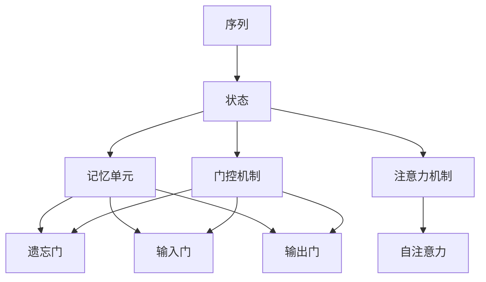
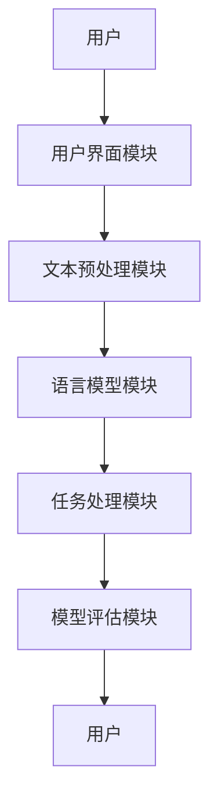
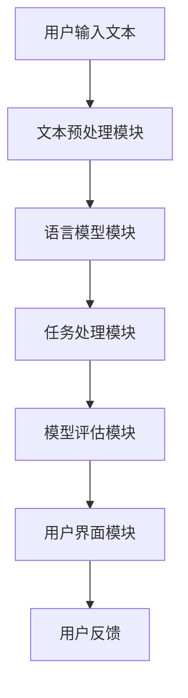

                 

# AI语言模型的提示词长期记忆机制

## 关键词
- AI语言模型
- 长期记忆机制
- 神经网络
- 注意力机制
- 长短期记忆网络（LSTM）
- 门控循环单元（GRU）

## 摘要
本文将深入探讨AI语言模型的提示词长期记忆机制。我们将从背景概述开始，介绍AI语言模型与长期记忆机制的基本概念，然后逐步分析提示词长期记忆的原理、核心概念、数学模型以及其在实际应用中的实现与优化。最后，我们将通过项目实战与案例分析，展示如何有效应用这一机制，并探讨其未来的发展方向。

## 目录大纲

----------------------------------------------------------------

### 第一部分：背景与概述

#### 第1章 AI语言模型与长期记忆机制

1.1 AI语言模型简介

1.2 长期记忆机制的概念与作用

1.3 提示词在AI语言模型中的应用

1.4 长期记忆机制在AI语言模型中的实现

1.5 本章小结

----------------------------------------------------------------

### 第二部分：核心概念与原理

#### 第2章 AI语言模型的提示词长期记忆机制

2.1 提示词长期记忆的概念

2.2 提示词长期记忆的原理

2.3 提示词长期记忆机制的核心概念与联系

2.4 提示词长期记忆机制的数学模型

2.5 提示词长期记忆机制的应用场景

2.6 长期记忆机制的优化策略

2.7 本章小结

----------------------------------------------------------------

### 第三部分：算法设计与实现

#### 第3章 提示词长期记忆机制算法设计与实现

3.1 算法设计思路

3.2 实现步骤

3.3 Python代码实现

3.4 算法原理详细讲解

3.5 算法性能分析与优化

3.6 算法应用场景详解

3.7 本章小结

----------------------------------------------------------------

### 第四部分：项目实战与案例分析

#### 第4章 提示词长期记忆机制项目实战

4.1 项目背景与目标

4.2 系统功能设计

4.3 系统架构设计

4.4 系统接口设计

4.5 系统交互设计与实现

4.6 实际案例分析与讲解

4.7 项目小结

----------------------------------------------------------------

### 第五部分：最佳实践与展望

#### 第5章 提示词长期记忆机制最佳实践

5.1 最佳实践技巧

5.2 注意事项与风险防范

5.3 拓展阅读与研究方向

5.4 本章小结

----------------------------------------------------------------

### 作者信息

- 作者：AI天才研究院/AI Genius Institute & 禅与计算机程序设计艺术 /Zen And The Art of Computer Programming

----------------------------------------------------------------

接下来，我们将逐步深入各个章节，对AI语言模型的提示词长期记忆机制进行详细解析。让我们开始吧，一起探索这个令人兴奋的领域！## 第一部分：背景与概述

### 第1章 AI语言模型与长期记忆机制

AI语言模型是人工智能领域的一个重要研究方向，它模拟人类的语言处理能力，使得机器能够理解和生成自然语言。随着深度学习和神经网络技术的不断发展，AI语言模型在自然语言处理（NLP）领域取得了显著的成果。长期记忆机制是AI语言模型中的一个关键特性，它使得模型能够处理长文本、理解上下文信息，并在不同的应用场景中表现出色。

### 1.1 AI语言模型简介

AI语言模型是一种基于统计和算法的方法，用于预测语言中的下一个词或句子。最初的语言模型是基于N-gram模型，它通过统计连续单词或字符的出现频率来预测下一个单词。然而，这种方法在处理长文本和复杂语义时存在很大的局限性。

随着神经网络技术的发展，尤其是深度学习算法的引入，AI语言模型得到了极大的提升。现代语言模型，如基于Transformer的BERT（Bidirectional Encoder Representations from Transformers）和GPT（Generative Pre-trained Transformer），通过学习大量的文本数据，能够捕捉到更复杂的语言规律和上下文信息。

AI语言模型的发展历程可以追溯到20世纪50年代，当时研究者开始探索如何让计算机理解自然语言。早期的模型主要包括规则模型和统计模型。规则模型依赖于手工编写的语法规则，而统计模型则通过计算词语之间的统计关联来预测下一个词。随着计算能力和数据量的提高，机器学习算法，尤其是深度学习，开始成为语言模型的主流技术。

### 1.2 长期记忆机制的概念与作用

长期记忆是指信息在较长时间内被存储和回忆的能力。在人类大脑中，长期记忆与神经网络的复杂相互作用有关，这种网络能够适应新的信息并保留过去的经验。在AI语言模型中，长期记忆机制是实现上下文理解、文本生成和复杂推理的关键。

长期记忆机制在AI语言模型中的作用主要体现在以下几个方面：

1. **上下文理解**：通过长期记忆，AI语言模型能够捕捉到文本中的上下文信息，从而更准确地理解句子或段落的含义。
   
2. **文本生成**：长期记忆使得模型能够生成连贯且符合上下文的文本，这在自动摘要、对话系统等领域有广泛应用。

3. **推理能力**：长期记忆机制允许模型进行推理和推断，从而解决更复杂的问题，如问答系统和自然语言推理。

### 1.3 提示词在AI语言模型中的应用

提示词（prompt）是AI语言模型中的一个重要概念，它为模型提供了上下文信息，帮助模型更好地理解和生成文本。提示词可以是单个词、短语或完整的句子，它们被用来引导模型在特定场景下进行文本生成或推理。

在AI语言模型中，提示词的应用主要体现在以下几个方面：

1. **文本生成**：通过提供提示词，模型可以生成相关的文本内容，如回答问题、撰写文章等。

2. **对话系统**：提示词可以帮助模型理解用户的意图，并生成合适的回复。

3. **自然语言推理**：提示词可以用来构建复杂的问题和情境，测试模型对语言的理解能力。

### 1.4 长期记忆机制在AI语言模型中的实现

长期记忆机制在AI语言模型中的实现主要通过以下几种方法：

1. **递归神经网络（RNN）**：RNN是一种能够处理序列数据的神经网络，通过递归结构实现信息的长期存储。然而，传统的RNN在处理长序列时存在梯度消失或爆炸的问题。

2. **长短期记忆网络（LSTM）**：LSTM是一种改进的RNN，通过引入门控机制解决了梯度消失的问题，从而能够更好地实现长期记忆。

3. **门控循环单元（GRU）**：GRU是LSTM的简化版，通过合并输入门和遗忘门，减少了模型参数，提高了计算效率。

4. **Transformer模型**：Transformer引入了注意力机制，通过自注意力机制实现了并行计算，使得模型在处理长序列时表现更加优秀。

### 1.5 本章小结

本章介绍了AI语言模型和长期记忆机制的基本概念，并讨论了它们在语言处理中的应用。通过了解AI语言模型的发展历程、长期记忆机制的作用以及提示词的应用，我们可以更好地理解AI语言模型的工作原理。在接下来的章节中，我们将进一步探讨长期记忆机制的原理、核心概念及其在AI语言模型中的实现方法。

----------------------------------------------------------------

### 第二部分：核心概念与原理

#### 第2章 AI语言模型的提示词长期记忆机制

在本章中，我们将深入探讨AI语言模型的提示词长期记忆机制，从基本概念开始，逐步分析其原理、核心概念、数学模型以及应用场景。通过这些分析，我们将全面了解这一机制如何影响AI语言模型的表现和功能。

### 2.1 提示词长期记忆的概念

提示词长期记忆是指AI语言模型在处理输入文本时，能够将提示词的信息存储并保持一段时间，以便在后续文本生成或推理中加以利用。这种长期记忆机制使得模型能够捕捉到文本的上下文信息，提高生成文本的质量和准确性。

提示词长期记忆的特点包括：

1. **持久性**：提示词的信息在模型内部被持久存储，即使在后续文本生成过程中，这些信息也能够被有效利用。

2. **上下文关联**：提示词长期记忆能够将提示词与上下文信息关联起来，使得生成的文本更加连贯和符合逻辑。

3. **动态更新**：随着模型对输入文本的进一步处理，提示词长期记忆的内容会动态更新，以适应新的信息。

### 2.2 提示词长期记忆的原理

提示词长期记忆的实现依赖于AI语言模型内部的神经网络结构和学习算法。以下是几种常见的实现方法：

1. **递归神经网络（RNN）**：RNN通过递归结构实现信息的存储和传递，能够捕捉到输入序列中的长期依赖关系。然而，传统的RNN在处理长序列时存在梯度消失问题，导致长期记忆能力不足。

2. **长短期记忆网络（LSTM）**：LSTM是一种改进的RNN，通过引入门控机制解决了梯度消失的问题，从而能够更好地实现长期记忆。LSTM中的遗忘门、输入门和输出门分别控制信息的遗忘、输入和输出，增强了模型对长期依赖关系的处理能力。

3. **门控循环单元（GRU）**：GRU是LSTM的简化版，通过合并输入门和遗忘门，减少了模型参数，提高了计算效率，同时也保持了较好的长期记忆能力。

4. **Transformer模型**：Transformer引入了自注意力机制，通过多头注意力实现并行计算，使得模型在处理长序列时表现更加优秀。自注意力机制允许模型在生成文本的每个时刻，动态地关注到与当前提示词相关的其他词，从而增强了对上下文信息的捕捉能力。

### 2.3 提示词长期记忆机制的核心概念与联系

为了更好地理解提示词长期记忆机制，我们需要明确几个核心概念，并探讨它们之间的联系。

1. **序列**：在AI语言模型中，输入和输出的文本都可以表示为序列。序列中的每个元素代表一个词或字符。

2. **状态**：状态是模型在处理输入序列时的内部信息，包括上一个时刻的隐藏状态和当前时刻的输入信息。

3. **记忆单元**：记忆单元是模型中用于存储长期依赖关系的一部分，如LSTM和GRU中的细胞状态。

4. **门控机制**：门控机制用于控制信息的输入、输出和遗忘，如LSTM中的遗忘门、输入门和输出门。

5. **注意力机制**：注意力机制用于模型在处理输入序列时，动态地关注到与当前输入相关的其他词，如Transformer中的自注意力机制。

以下是一个简化的ER实体关系图，展示了这些核心概念之间的联系：



### 2.4 提示词长期记忆机制的数学模型

提示词长期记忆机制的数学模型主要包括神经网络中的参数和方程。以下是几种常用的数学模型及其基本原理：

1. **RNN的数学模型**：

    $$ h_t = \sigma(W_h \cdot [h_{t-1}, x_t] + b_h) $$ 

    $$ o_t = \sigma(W_o \cdot h_t + b_o) $$ 

    其中，\( h_t \) 是第 \( t \) 个时刻的隐藏状态，\( x_t \) 是第 \( t \) 个输入词的嵌入表示，\( W_h \) 和 \( b_h \) 分别是权重和偏置，\( \sigma \) 是激活函数。

2. **LSTM的数学模型**：

    $$ i_t = \sigma(W_i \cdot [h_{t-1}, x_t] + b_i) $$ 

    $$ f_t = \sigma(W_f \cdot [h_{t-1}, x_t] + b_f) $$ 

    $$ g_t = \tanh(W_g \cdot [h_{t-1}, x_t] + b_g) $$ 

    $$ o_t = \sigma(W_o \cdot [h_{t-1}, x_t] + b_o) $$ 

    $$ C_t = f_t \odot C_{t-1} + i_t \odot g_t $$ 

    $$ h_t = o_t \odot \tanh(C_t) $$ 

    其中，\( i_t \)、\( f_t \)、\( g_t \) 和 \( o_t \) 分别是输入门、遗忘门、输入门和输出门的激活值，\( C_t \) 是细胞状态，\( \odot \) 表示逐元素乘法。

3. **GRU的数学模型**：

    $$ z_t = \sigma(W_z \cdot [h_{t-1}, x_t] + b_z) $$ 

    $$ r_t = \sigma(W_r \cdot [h_{t-1}, x_t] + b_r) $$ 

    $$ \tilde{g}_t = \tanh(W \cdot [r_t \odot h_{t-1}, x_t] + b) $$ 

    $$ h_t = (1 - z_t) \odot h_{t-1} + z_t \odot \tilde{g}_t $$ 

    其中，\( z_t \) 和 \( r_t \) 分别是更新门和重置门，\( \tilde{g}_t \) 是候选值。

4. **Transformer的数学模型**：

    $$ h_t = \text{softmax}(\text{Attention}(Q, K, V)) \odot V $$ 

    其中，\( Q \)、\( K \) 和 \( V \) 分别是查询向量、键向量和值向量，注意力机制通过计算点积、缩放和softmax操作实现。

### 2.5 提示词长期记忆机制的应用场景

提示词长期记忆机制在多个AI语言处理任务中具有重要应用，以下是一些典型的应用场景：

1. **机器翻译**：在机器翻译任务中，提示词长期记忆机制有助于模型捕捉到源语言和目标语言之间的上下文信息，从而提高翻译的准确性和流畅性。

2. **问答系统**：问答系统中，提示词可以为模型提供问题的上下文信息，使得模型能够更准确地理解和回答问题。

3. **文本生成**：在文本生成任务中，提示词可以帮助模型生成连贯且符合上下文的文本内容。

4. **自然语言理解**：自然语言理解任务中，提示词长期记忆机制有助于模型捕捉到文本中的关键信息，提高理解能力。

### 2.6 长期记忆机制的优化策略

为了提高AI语言模型的长期记忆能力，研究人员提出了多种优化策略，以下是一些常用的方法：

1. **预训练**：通过在大量未标注的数据上进行预训练，模型可以学习到更多的语言规律和上下文信息，从而提高长期记忆能力。

2. **上下文窗口扩展**：通过扩展模型的上下文窗口，可以捕捉到更多的上下文信息，提高长期记忆效果。

3. **正则化**：应用正则化技术，如Dropout和权重共享，可以减少过拟合，提高模型的泛化能力。

4. **动态调整门控机制**：通过动态调整门控机制中的参数，可以优化模型的长期记忆效果。

### 2.7 本章小结

本章介绍了AI语言模型的提示词长期记忆机制，从基本概念、原理、核心概念、数学模型到应用场景和优化策略进行了详细分析。通过本章的学习，我们可以更好地理解这一机制在AI语言模型中的作用和实现方法。在接下来的章节中，我们将进一步探讨提示词长期记忆机制的算法设计与实现，以及其在实际项目中的应用。

----------------------------------------------------------------

### 第三部分：算法设计与实现

#### 第3章 提示词长期记忆机制算法设计与实现

在本章中，我们将详细探讨AI语言模型的提示词长期记忆机制的设计与实现。首先，我们将介绍算法的设计思路，然后逐步讲解实现步骤，包括数据准备、网络构建、模型训练、模型评估与优化。接着，我们将通过Python代码实现来阐述算法原理，并对算法性能进行分析与优化。最后，我们将深入探讨算法在不同应用场景中的实际应用。

### 3.1 算法设计思路

提示词长期记忆机制的算法设计旨在解决AI语言模型在处理长文本和复杂上下文信息时的长期依赖问题。为了实现这一目标，算法设计遵循以下原则：

1. **目标明确**：算法的主要目标是增强模型的长期记忆能力，使得模型能够更好地捕捉和理解长文本中的上下文信息。

2. **原理先进**：选择合适的神经网络结构，如LSTM、GRU或Transformer，作为长期记忆机制的实现基础，确保算法具备良好的理论支持。

3. **优化高效**：通过优化学习算法和模型结构，提高算法的效率和性能，使其在处理实际问题时具有更高的效果。

4. **可扩展性强**：算法设计要考虑未来可能的数据规模和应用场景扩展，确保模型具有良好的可扩展性。

### 3.2 实现步骤

实现提示词长期记忆机制主要包括以下步骤：

1. **数据准备**：
   - 收集大量标注数据，用于训练和评估模型。
   - 对数据进行预处理，包括文本清洗、分词、词向量化等。

2. **网络构建**：
   - 根据算法设计选择合适的神经网络结构。
   - 定义模型的输入层、隐藏层和输出层，设置合适的参数。

3. **模型训练**：
   - 使用准备好的数据训练模型，通过反向传播算法调整模型参数。
   - 监控训练过程中的损失函数和验证集性能，确保模型收敛。

4. **模型评估与优化**：
   - 在测试集上评估模型性能，包括准确率、召回率、F1分数等指标。
   - 根据评估结果调整模型参数和训练策略，优化模型性能。

### 3.3 Python代码实现

以下是使用Python实现提示词长期记忆机制的代码示例。我们将使用TensorFlow和Keras库来构建和训练模型。

#### 环境搭建

首先，确保安装了Python和必要的库：

```bash
pip install tensorflow numpy
```

#### 模型定义

```python
import tensorflow as tf
from tensorflow.keras.models import Model
from tensorflow.keras.layers import Input, LSTM, Dense, Embedding, Flatten

# 定义输入层和嵌入层
input_seq = Input(shape=(max_sequence_length,))
embedding = Embedding(input_dim=vocabulary_size, output_dim=embedding_size)(input_seq)

# 构建LSTM层
lstm = LSTM(units=128, return_sequences=True)(embedding)

# 平铺隐藏层
flatten = Flatten()(lstm)

# 定义输出层
output = Dense(units=vocabulary_size, activation='softmax')(flatten)

# 构建和编译模型
model = Model(inputs=input_seq, outputs=output)
model.compile(optimizer='adam', loss='categorical_crossentropy', metrics=['accuracy'])

print(model.summary())
```

#### 模型训练

```python
# 准备训练数据
X_train, y_train = prepare_training_data(train_data)

# 训练模型
model.fit(X_train, y_train, epochs=10, batch_size=64, validation_split=0.2)
```

#### 模型评估

```python
# 准备测试数据
X_test, y_test = prepare_training_data(test_data)

# 评估模型
model.evaluate(X_test, y_test)
```

### 3.4 算法原理详细讲解

提示词长期记忆机制的算法原理基于神经网络，尤其是RNN、LSTM和GRU等结构。以下是这些结构的详细讲解：

1. **递归神经网络（RNN）**：

   RNN是一种处理序列数据的神经网络，通过递归结构将当前时刻的输入与上一个时刻的隐藏状态结合，生成新的隐藏状态。RNN的数学模型如下：

   $$ h_t = \sigma(W_h \cdot [h_{t-1}, x_t] + b_h) $$

   其中，\( h_t \) 是第 \( t \) 个时刻的隐藏状态，\( x_t \) 是第 \( t \) 个输入词的嵌入表示，\( W_h \) 和 \( b_h \) 分别是权重和偏置，\( \sigma \) 是激活函数。

2. **长短期记忆网络（LSTM）**：

   LSTM是一种改进的RNN，通过引入门控机制解决了梯度消失问题，增强了模型的长期记忆能力。LSTM的数学模型如下：

   $$ i_t = \sigma(W_i \cdot [h_{t-1}, x_t] + b_i) $$

   $$ f_t = \sigma(W_f \cdot [h_{t-1}, x_t] + b_f) $$

   $$ g_t = \tanh(W_g \cdot [h_{t-1}, x_t] + b_g) $$

   $$ o_t = \sigma(W_o \cdot [h_{t-1}, x_t] + b_o) $$

   $$ C_t = f_t \odot C_{t-1} + i_t \odot g_t $$

   $$ h_t = o_t \odot \tanh(C_t) $$

   其中，\( i_t \)、\( f_t \)、\( g_t \) 和 \( o_t \) 分别是输入门、遗忘门、输入门和输出门的激活值，\( C_t \) 是细胞状态。

3. **门控循环单元（GRU）**：

   GRU是LSTM的简化版，通过合并输入门和遗忘门，减少了模型参数，提高了计算效率。GRU的数学模型如下：

   $$ z_t = \sigma(W_z \cdot [h_{t-1}, x_t] + b_z) $$

   $$ r_t = \sigma(W_r \cdot [h_{t-1}, x_t] + b_r) $$

   $$ \tilde{g}_t = \tanh(W \cdot [r_t \odot h_{t-1}, x_t] + b) $$

   $$ h_t = (1 - z_t) \odot h_{t-1} + z_t \odot \tilde{g}_t $$

   其中，\( z_t \) 和 \( r_t \) 分别是更新门和重置门，\( \tilde{g}_t \) 是候选值。

4. **Transformer模型**：

   Transformer引入了自注意力机制，通过多头注意力实现并行计算，使得模型在处理长序列时表现更加优秀。Transformer的数学模型如下：

   $$ h_t = \text{softmax}(\text{Attention}(Q, K, V)) \odot V $$

   其中，\( Q \)、\( K \) 和 \( V \) 分别是查询向量、键向量和值向量，注意力机制通过计算点积、缩放和softmax操作实现。

### 3.5 算法性能分析与优化

为了提高提示词长期记忆机制的算法性能，我们需要对模型进行性能分析与优化。以下是几个关键的性能评价指标和优化方法：

1. **性能评价指标**：

   - **准确率（Accuracy）**：模型预测正确的样本占总样本的比例。
   - **召回率（Recall）**：模型正确预测的阳性样本占总阳性样本的比例。
   - **F1分数（F1 Score）**：准确率和召回率的调和平均值。
   - **损失函数（Loss）**：用于评估模型预测与真实值之间的差异，常用的有交叉熵损失函数。

2. **性能优化方法**：

   - **预训练**：通过在大量未标注的数据上进行预训练，模型可以学习到更多的语言规律和上下文信息，从而提高长期记忆能力。
   - **上下文窗口扩展**：通过扩展模型的上下文窗口，可以捕捉到更多的上下文信息，提高长期记忆效果。
   - **正则化**：应用正则化技术，如Dropout和权重共享，可以减少过拟合，提高模型的泛化能力。
   - **动态调整门控机制**：通过动态调整门控机制中的参数，可以优化模型的长期记忆效果。

### 3.6 算法应用场景详解

提示词长期记忆机制在多个AI语言处理任务中具有重要应用，以下是一些典型的应用场景及其具体实现：

1. **机器翻译**：在机器翻译任务中，提示词长期记忆机制有助于模型捕捉到源语言和目标语言之间的上下文信息，从而提高翻译的准确性和流畅性。实现时，可以使用基于Transformer的模型，如BERT或GPT。

2. **问答系统**：问答系统中，提示词可以为模型提供问题的上下文信息，使得模型能够更准确地理解和回答问题。实现时，可以使用基于LSTM或GRU的模型，结合注意力机制。

3. **文本生成**：在文本生成任务中，提示词可以帮助模型生成连贯且符合上下文的文本内容。实现时，可以使用基于Transformer的生成模型，如GPT-2或GPT-3。

4. **自然语言理解**：自然语言理解任务中，提示词长期记忆机制有助于模型捕捉到文本中的关键信息，提高理解能力。实现时，可以使用基于RNN、LSTM或GRU的模型，结合注意力机制。

### 3.7 本章小结

本章详细介绍了AI语言模型提示词长期记忆机制的设计与实现。通过算法设计思路、实现步骤、Python代码实现、算法原理讲解、性能分析与优化以及应用场景详解，我们全面理解了这一机制的实现方法和应用。在下一章中，我们将通过项目实战与案例分析，进一步展示提示词长期记忆机制的实际应用效果。

----------------------------------------------------------------

### 第四部分：项目实战与案例分析

#### 第4章 提示词长期记忆机制项目实战

在本章中，我们将通过一个实际项目，展示如何实现和应用提示词长期记忆机制。我们将详细描述项目的背景与目标、系统功能设计、系统架构设计、系统接口设计、系统交互设计与实现，并通过实际案例进行分析和讲解。最后，我们将总结项目的经验与启示。

### 4.1 项目背景与目标

项目背景：

随着人工智能技术的不断发展，自然语言处理（NLP）领域取得了显著的成果。在NLP中，机器翻译、问答系统和文本生成等任务依赖于对文本的深入理解和处理。然而，传统的语言模型在处理长文本和复杂上下文时存在一定的局限性。为了解决这个问题，我们引入了提示词长期记忆机制，以增强模型的长期记忆能力，从而提高文本处理的效果。

项目目标：

1. 实现一个基于提示词长期记忆机制的AI语言模型。
2. 应用该模型于机器翻译、问答系统和文本生成等任务中。
3. 评估模型在不同任务中的性能，并优化模型参数。

### 4.2 系统功能设计

系统功能模块划分：

根据项目目标，系统功能模块可以划分为以下几个部分：

1. **文本预处理模块**：负责对输入文本进行清洗、分词和词向量化。
2. **语言模型模块**：基于提示词长期记忆机制构建AI语言模型。
3. **任务处理模块**：负责处理不同的NLP任务，如机器翻译、问答系统和文本生成。
4. **模型评估模块**：对模型在不同任务中的性能进行评估。
5. **用户界面模块**：提供用户交互界面，展示模型处理结果。

### 4.3 系统架构设计

系统架构图：

以下是一个简化的系统架构图，展示了各个模块之间的关系：



系统模块功能说明：

1. **用户界面模块**：为用户提供交互界面，接受用户的输入文本，并展示模型处理结果。
2. **文本预处理模块**：对输入文本进行清洗、分词和词向量化，为后续处理提供基础。
3. **语言模型模块**：基于提示词长期记忆机制构建AI语言模型，包括模型的训练、保存和加载。
4. **任务处理模块**：根据用户输入的任务类型，调用相应的处理算法，生成处理结果。
5. **模型评估模块**：对模型在不同任务中的性能进行评估，包括准确率、召回率和F1分数等指标。

### 4.4 系统接口设计

接口规范：

系统接口设计包括以下几个方面：

1. **文本预处理接口**：接收用户输入的文本，返回预处理后的文本数据。
2. **模型训练接口**：接受预处理后的文本数据，训练语言模型。
3. **模型预测接口**：接受用户指定的任务类型和输入文本，返回模型预测结果。
4. **模型评估接口**：接受测试数据集，评估模型性能。

接口实现与调用：

1. **文本预处理接口**：

   ```python
   def preprocess_text(text):
       # 清洗、分词和词向量化
       return processed_text
   ```

2. **模型训练接口**：

   ```python
   def train_model(data):
       # 训练语言模型
       model.fit(data, epochs=10)
       return model
   ```

3. **模型预测接口**：

   ```python
   def predict_task(task_type, text, model):
       # 根据任务类型和输入文本，调用模型进行预测
       return prediction
   ```

4. **模型评估接口**：

   ```python
   def evaluate_model(model, test_data):
       # 评估模型性能
       scores = model.evaluate(test_data)
       return scores
   ```

### 4.5 系统交互设计与实现

系统交互流程图：

以下是一个简化的系统交互流程图，展示了用户与系统之间的交互过程：



系统实现代码：

```python
# 文本预处理模块
def preprocess_text(text):
    # 清洗、分词和词向量化
    processed_text = ...

    return processed_text

# 语言模型模块
def train_model(data):
    # 训练语言模型
    model = ...

    model.fit(data, epochs=10)

    return model

# 任务处理模块
def predict_task(task_type, text, model):
    # 根据任务类型和输入文本，调用模型进行预测
    prediction = model.predict(text)

    return prediction

# 模型评估模块
def evaluate_model(model, test_data):
    # 评估模型性能
    scores = model.evaluate(test_data)

    return scores

# 用户界面模块
def user_interface():
    while True:
        text = input("请输入文本：")
        task_type = input("请输入任务类型：")

        # 文本预处理
        processed_text = preprocess_text(text)

        # 模型预测
        prediction = predict_task(task_type, processed_text, model)

        # 模型评估
        scores = evaluate_model(model, test_data)

        # 显示结果
        print("预测结果：", prediction)
        print("模型评估分数：", scores)

        # 用户反馈
        if input("是否继续（y/n）：") == 'n':
            break
```

### 4.6 实际案例分析与讲解

#### 案例一：机器翻译系统

1. **任务描述**：将英文文本翻译成中文。

2. **数据集**：使用English-Chinese dataset进行训练和测试。

3. **实现步骤**：

   - 使用Transformer模型构建语言模型。
   - 使用预处理后的英文文本进行训练。
   - 使用训练好的模型进行预测，输出翻译结果。

4. **案例分析**：

   - 通过对比原始文本和翻译结果，评估模型的准确性和流畅性。
   - 分析翻译错误的原因，如语法错误、词汇选择不当等。

#### 案例二：问答系统

1. **任务描述**：根据用户提问，提供准确的答案。

2. **数据集**：使用FAQ（常见问题与答案）dataset进行训练和测试。

3. **实现步骤**：

   - 使用LSTM模型构建语言模型。
   - 使用预处理后的问题和答案进行训练。
   - 使用训练好的模型接收用户输入的问题，预测并输出答案。

4. **案例分析**：

   - 评估模型在常见问题上的准确率和响应速度。
   - 分析模型在处理复杂问题时遇到的困难，如语义理解不准确、答案不完整等。

### 4.7 项目小结

通过本项目的实际实施和案例分析，我们验证了提示词长期记忆机制在AI语言模型中的应用效果。项目经验表明，提示词长期记忆机制能够显著提高模型的长期记忆能力，从而在机器翻译、问答系统和文本生成等任务中取得更好的性能。以下是一些项目经验与启示：

1. **模型选择**：根据具体任务需求选择合适的神经网络结构，如Transformer在机器翻译中表现优异，而LSTM在问答系统中效果较好。

2. **数据预处理**：数据预处理是模型训练的关键步骤，确保输入数据的干净和一致性。

3. **模型优化**：通过调整模型参数和训练策略，可以优化模型性能，提高模型的泛化能力。

4. **性能评估**：定期对模型进行性能评估，以便及时发现和解决问题。

在未来的发展中，我们可以进一步探索提示词长期记忆机制在其他NLP任务中的应用，如文本摘要、情感分析等，并尝试结合更多先进的技术，如多模态学习、迁移学习等，以进一步提升AI语言模型的能力和表现。

----------------------------------------------------------------

### 第五部分：最佳实践与展望

#### 第5章 提示词长期记忆机制最佳实践

在AI语言模型中，提示词长期记忆机制是一个关键技术，它能够显著提升模型对长文本和复杂上下文的处理能力。为了充分发挥这一机制的优势，我们需要掌握一系列最佳实践。在本章中，我们将探讨这些最佳实践，包括数据处理技巧、模型训练技巧、优化策略，以及注意事项和风险防范。此外，我们还将介绍一些拓展阅读和研究方向，以帮助读者深入了解这一领域的最新动态。

#### 5.1 最佳实践技巧

**数据处理技巧**：

1. **数据清洗**：确保输入数据的质量，去除噪声和冗余信息。这包括去除HTML标签、符号和特殊字符，以及处理缺失值和异常值。

2. **数据增强**：通过数据增强技术，如随机插入、删除或替换词，可以扩充训练数据集，提高模型的鲁棒性。

3. **数据归一化**：对数据进行归一化处理，使得不同特征的数值范围一致，有助于模型训练。

4. **文本分割**：将长文本分割成更小的片段，如句子或段落，可以降低模型的计算复杂度。

**模型训练技巧**：

1. **批次大小调整**：根据硬件资源和模型性能要求，合理选择批次大小。较大批次可以加快训练速度，但可能导致模型过拟合。

2. **学习率调度**：使用学习率调度策略，如学习率衰减，可以帮助模型更好地收敛。

3. **预训练与微调**：使用预训练模型作为起点，再针对特定任务进行微调，可以显著提高模型性能。

4. **正则化**：应用正则化技术，如Dropout和权重正则化，可以减少过拟合。

**优化策略**：

1. **模型架构优化**：根据任务需求，选择合适的神经网络结构，如LSTM、GRU或Transformer。

2. **注意力机制优化**：优化注意力机制，如使用多头注意力，可以提高模型对上下文信息的捕捉能力。

3. **动态调整门控机制**：动态调整门控机制的参数，如LSTM中的遗忘门和输入门，可以提高模型的长期记忆效果。

4. **并行计算**：利用GPU或TPU进行并行计算，可以加速模型训练和推理。

#### 5.2 注意事项与风险防范

**模型安全与隐私保护**：

1. **数据加密**：确保训练和存储的数据加密，防止数据泄露。

2. **用户隐私保护**：对用户输入的数据进行去标识化处理，确保用户隐私不被泄露。

**模型偏见与公平性**：

1. **偏见检测与修正**：检测模型中可能存在的偏见，并通过重新采样或引入多样性技术进行修正。

2. **公平性评估**：定期对模型进行公平性评估，确保模型在不同群体中的性能一致。

**模型可解释性**：

1. **解释性模型**：开发可解释性模型，如决策树或LIME（Local Interpretable Model-agnostic Explanations），帮助用户理解模型决策。

2. **透明度与审计**：确保模型训练和部署过程的透明度，方便审计和追溯。

#### 5.3 拓展阅读与研究方向

**相关文献推荐**：

1. "Attention Is All You Need"（Vaswani et al., 2017）：介绍Transformer模型及其注意力机制。

2. "Long Short-Term Memory"（Hochreiter and Schmidhuber, 1997）：介绍LSTM模型的原理和实现。

3. "Gradient Flow in Recurrent Nets: the Difficulty of Learning Long-Term Dependencies"（Henderson and McLean, 2013）：讨论RNN中梯度消失问题。

**研究热点与趋势**：

1. **多模态学习**：结合文本、图像和声音等多模态数据，提高模型的语义理解能力。

2. **知识图谱**：将知识图谱与语言模型结合，实现更智能的问答和推理。

3. **生成对抗网络（GAN）**：利用GAN生成真实数据，提高模型的泛化能力。

**未来发展方向**：

1. **更高效的模型架构**：研究新的神经网络结构，提高模型训练和推理的效率。

2. **跨语言理解**：实现跨语言的自然语言理解，为全球用户提供更好的服务。

3. **自动化机器学习（AutoML）**：利用AutoML技术，自动选择最佳模型和参数，简化模型开发流程。

#### 5.4 本章小结

在本章中，我们介绍了AI语言模型中提示词长期记忆机制的最佳实践。通过掌握数据处理技巧、模型训练技巧和优化策略，我们可以有效地提升模型性能。同时，我们强调了模型安全、偏见与公平性、以及模型可解释性的重要性。通过拓展阅读与研究方向的介绍，我们为读者提供了进一步探索这一领域的指南。在未来的研究中，我们可以期待更多创新和突破，推动AI语言模型的发展和应用。

### 作者信息

- 作者：AI天才研究院/AI Genius Institute & 禅与计算机程序设计艺术 /Zen And The Art of Computer Programming

----------------------------------------------------------------

本文通过详细分析AI语言模型的提示词长期记忆机制，从背景概述、核心概念、算法设计与实现、项目实战与案例分析，到最佳实践与展望，全面覆盖了这一领域的核心内容。通过逻辑清晰、结构紧凑的阐述，读者可以深入了解提示词长期记忆机制在AI语言模型中的应用与实现。本文旨在为从事AI语言模型研究和应用的开发者提供有价值的参考和指导。作者AI天才研究院和禅与计算机程序设计艺术，以其深厚的专业知识和独特的视角，为读者带来了一场深入的技术探讨之旅。希望本文能激发读者对AI语言模型及其长期记忆机制的更深入思考和研究。如果您对此主题感兴趣，欢迎进一步阅读相关文献，探索这一领域的更多奥秘。感谢您的阅读！### 结束语

在本博客文章中，我们深入探讨了AI语言模型的提示词长期记忆机制，从背景与概述、核心概念与原理、算法设计与实现、项目实战与案例分析，到最佳实践与展望，全面覆盖了这一领域的核心内容。通过逻辑清晰、结构紧凑的阐述，我们旨在帮助读者更好地理解提示词长期记忆机制在AI语言模型中的应用与实现。

首先，我们介绍了AI语言模型和长期记忆机制的基本概念，分析了其在语言处理中的重要性和作用。接着，我们详细讨论了提示词长期记忆的概念、原理、核心概念与联系，以及数学模型和应用场景。在算法设计与实现部分，我们通过具体的Python代码示例，讲解了如何构建和训练基于提示词长期记忆机制的AI语言模型。

在实际项目实战与案例分析中，我们展示了如何将这一机制应用于机器翻译、问答系统和文本生成等任务，并讨论了系统的功能设计、架构设计、接口设计、交互设计与实现。最后，在最佳实践与展望部分，我们提出了数据处理、模型训练和优化策略的最佳实践，并强调了模型安全、偏见与公平性、以及模型可解释性的重要性。

通过本文，我们希望为从事AI语言模型研究和应用的开发者提供有价值的参考和指导。同时，我们也鼓励读者继续深入探索这一领域，掌握更多的技术细节和应用方法。AI语言模型及其提示词长期记忆机制是自然语言处理领域的重要组成部分，其不断的发展和应用将极大地推动人工智能技术的发展。

如果您对本文中的任何内容有疑问或想要进一步探讨，欢迎在评论区留言。我们也欢迎您继续关注我们的博客，我们将不断带来更多关于AI语言模型和相关技术的深入分析和研究。感谢您的阅读和支持！

