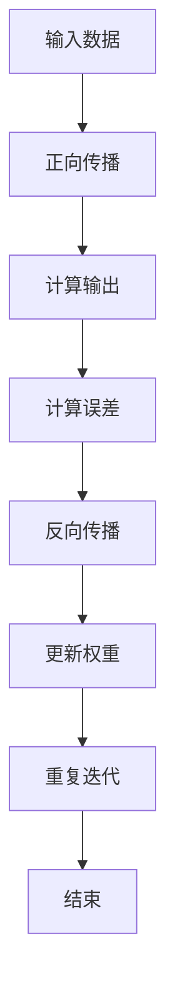
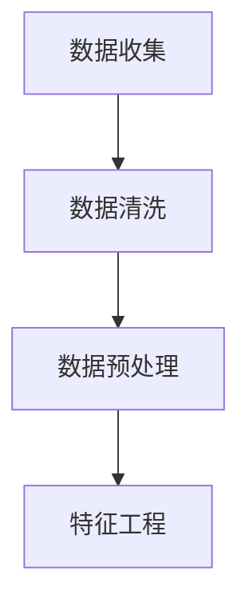
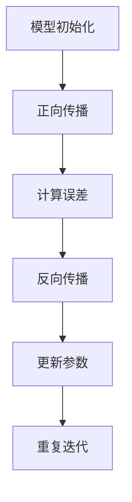
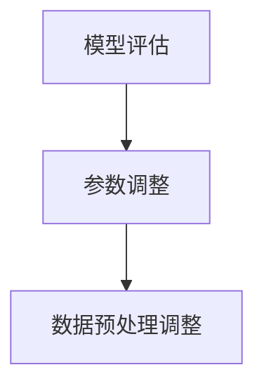
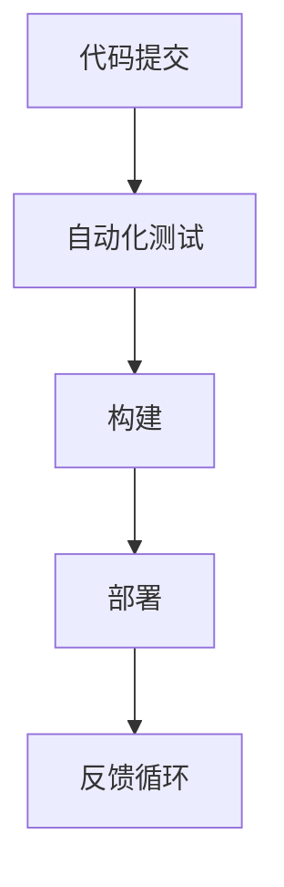
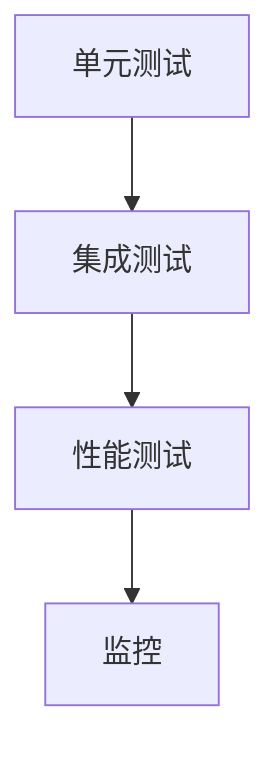
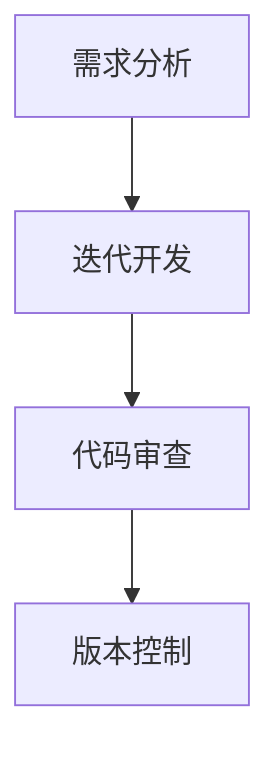
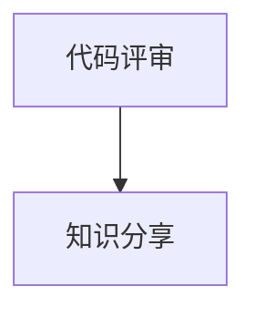

                 

## AI软件2.0的开发流程再造

在当今技术飞速发展的时代，人工智能（AI）已经成为推动各行各业变革的关键驱动力。随着AI技术的不断进步，从传统的人工智能软件1.0时代，我们迈向了全新的AI软件2.0时代。AI软件2.0不仅仅是技术上的迭代，更是开发流程的一次全面再造。在这一全新的时代，开发者需要重新思考如何设计、开发、部署和维护AI软件。

### 关键词
- **AI软件2.0**：下一代人工智能软件的代名词，强调智能化、自动化的提升。
- **开发流程再造**：重新审视并优化从需求分析到部署的整个开发过程。
- **大模型**：如GPT、BERT等超大规模神经网络模型，是AI软件2.0的核心。
- **最佳实践**：经过验证的有效方法和技巧，提升AI软件开发效率和质量。

### 摘要
本文将深入探讨AI软件2.0的开发流程再造。首先，我们将回顾AI软件1.0时代，分析其局限性，并阐述AI软件2.0的核心特征。接着，我们将逐步介绍AI大模型的基本概念、原理及其在软件开发中的应用。随后，我们将探讨AI大模型在企业级应用中面临的挑战及解决方案，并提出一系列开发最佳实践。最后，我们将展望AI软件2.0的未来发展趋势，总结全文内容。

### 目录
1. **背景介绍**
   1.1 从软件1.0到软件2.0的演进
   1.2 AI软件2.0的定义与核心特征
   1.3 AI大模型的发展历程与趋势
2. **AI大模型的基本概念**
   2.1 AI大模型的定义与特点
   2.2 AI大模型与传统AI的对比
   2.3 主流AI大模型介绍
3. **AI大模型的原理与数学基础**
   3.1 深度学习基础
   3.2 神经网络结构
   3.3 反向传播算法
   3.4 数学基础
4. **AI大模型在软件开发中的应用**
   4.1 AI大模型在开发中的角色
   4.2 AI大模型开发流程
   4.3 开发实战案例
5. **AI大模型在企业级应用中的挑战与解决方案**
   5.1 挑战分析
   5.2 解决方案探讨
6. **AI软件2.0开发最佳实践**
   6.1 设计原则
   6.2 开发流程优化
   6.3 团队协作与代码管理
7. **AI软件2.0的未来发展趋势**
   7.1 技术发展趋势
   7.2 应用场景拓展
8. **总结与展望**
   8.1 关键技术回顾
   8.2 未来发展展望

在接下来的章节中，我们将详细讨论每一个部分，帮助开发者更好地理解并掌握AI软件2.0的开发流程再造。### 第一部分: 软件2.0时代的AI大模型基础

#### 第1章: 软件2.0与AI大模型概述

##### 1.1 软件2.0时代的背景

从软件1.0时代到软件2.0时代的演进，是信息技术不断发展的必然结果。软件1.0时代主要指的是20世纪80年代至90年代的个人电脑和互联网初期阶段。这一时期，软件的核心在于提供基本的计算和数据处理功能，如文字处理、表格计算、图形浏览等。随着互联网的普及和云计算的出现，软件1.0逐渐向软件2.0过渡。

软件2.0时代，也被称为Web 2.0时代，是互联网的下一个重要发展阶段。它强调的是用户生成内容、社区互动和数据共享。Web 2.0不仅改变了人们获取信息的方式，也改变了软件的设计理念。软件不再仅仅是工具，而是平台的载体，为用户提供更加个性化、互动性更强的体验。

##### 1.1.1 从软件1.0到软件2.0的演进

软件1.0到软件2.0的演进，不仅体现在技术层面的进步，还包括商业模式、用户体验等多方面的变革。具体来说：

- **技术层面**：从传统的本地应用向基于互联网的应用转变，云计算、大数据等新兴技术的引入，为软件2.0的发展提供了强有力的支持。
- **商业模式**：软件2.0时代的商业模式更加多样化，从传统的产品销售模式转向基于订阅、广告、服务等多种盈利模式。
- **用户体验**：软件2.0更加注重用户的参与和互动，通过社交媒体、在线社区等方式，用户不再是被动接受信息的对象，而是成为内容生成和传播的主体。

##### 1.1.2 软件2.0的核心特征

软件2.0具有以下几个核心特征：

- **用户参与**：用户不再是简单的消费者，而是能够参与到软件的创造、改进和传播过程中。
- **数据驱动**：软件2.0基于大数据和人工智能技术，能够通过分析用户行为和需求，实现个性化推荐和服务。
- **平台化**：软件2.0强调构建开放的平台，为第三方开发者提供丰富的接口和工具，实现生态系统的构建。
- **社交化**：社交元素贯穿于软件2.0的各个环节，用户可以通过社交媒体等方式与其他用户进行互动。

##### 1.1.3 AI大模型与软件2.0的关系

AI大模型在软件2.0时代扮演着至关重要的角色。AI大模型，如GPT、BERT等，具有以下特点：

- **大规模**：AI大模型通常包含数亿甚至数千亿个参数，能够处理海量数据，实现高度自动化和智能化。
- **自学习能力**：AI大模型通过深度学习等技术，能够从大量数据中自动学习和优化模型参数，提高预测和决策的准确性。
- **泛用性**：AI大模型具有广泛的泛用性，可以在多个领域实现应用，如自然语言处理、计算机视觉、语音识别等。

AI大模型与软件2.0的关系可以概括为以下几点：

- **驱动创新**：AI大模型为软件2.0带来了新的发展动力，通过智能化技术提升软件的功能和性能。
- **提升用户体验**：AI大模型能够通过个性化推荐、智能搜索等方式，提升用户的体验和满意度。
- **构建生态系统**：AI大模型为软件2.0提供了强大的技术支持，有助于构建开放、共享的生态系统。

##### 1.2 AI大模型的基本概念

AI大模型是当前人工智能领域的重要研究方向，其发展历程可以追溯到20世纪80年代。当时，研究人员开始尝试使用神经网络进行模式识别和分类任务。随着计算能力的提升和算法的优化，神经网络模型逐渐从单层扩展到多层，形成了深度学习的基础。

AI大模型，通常指的是具有数百万甚至数十亿个参数的神经网络模型。这些模型通过在大量数据上进行训练，能够学习到复杂的模式和规律，从而在多种任务中实现高精度的预测和决策。

##### 1.2.1 AI大模型的定义

AI大模型是一种基于深度学习的神经网络模型，其特点包括：

- **大规模参数**：AI大模型通常包含数亿甚至数千亿个参数，这使得模型能够处理大规模数据，实现高度自动化和智能化。
- **多层次结构**：AI大模型通常采用多层神经网络结构，通过逐层提取特征，实现对输入数据的深度理解和分析。
- **端到端学习**：AI大模型通过端到端学习的方式，直接从原始数据中学习到有用的特征和模式，无需人工干预。

##### 1.2.2 AI大模型的特点

AI大模型具有以下几个显著特点：

- **高精度**：AI大模型通过在大量数据上的训练，能够实现高精度的预测和决策，远远超过传统机器学习方法。
- **泛用性**：AI大模型具有广泛的泛用性，可以在多种领域和任务中实现应用，如自然语言处理、计算机视觉、语音识别等。
- **自适应性**：AI大模型能够通过不断学习和优化，适应新的数据和任务需求，实现持续改进。
- **高效率**：AI大模型通过并行计算和分布式训练等技术，能够在短时间内完成复杂的计算任务，提高开发效率。

##### 1.2.3 AI大模型与传统AI的对比

与传统的人工智能方法相比，AI大模型具有以下几个显著优势：

- **性能提升**：AI大模型通过深度学习的方式，能够实现更高的预测和决策准确性，远远超过传统机器学习方法。
- **处理能力**：AI大模型能够处理大规模、多维度的数据，实现复杂任务的自动化和智能化。
- **适应性**：AI大模型通过自学习能力，能够适应新的数据和任务需求，实现持续优化。

##### 1.3 主流AI大模型介绍

当前，主流的AI大模型主要包括以下几个：

- **GPT系列模型**：GPT（Generative Pre-trained Transformer）系列模型由OpenAI提出，是目前最先进的自然语言处理模型之一。GPT-3模型拥有1750亿个参数，能够实现自然语言生成、文本分类、机器翻译等多种任务。

- **BERT模型**：BERT（Bidirectional Encoder Representations from Transformers）模型由Google提出，是一种双向Transformer模型。BERT通过在大量文本数据上进行训练，能够理解上下文语义，实现高精度的文本分类和问答系统。

- **其他知名AI大模型**：除了GPT和BERT，还有如TuringBot、E-Turing等AI大模型，这些模型在各自的领域内取得了显著的成果。

##### 1.4 AI大模型的应用前景

AI大模型在多个领域展现出了广阔的应用前景：

- **自然语言处理**：AI大模型在自然语言处理领域有着广泛的应用，如智能客服、机器翻译、文本生成等。

- **计算机视觉**：AI大模型在计算机视觉领域可以实现图像分类、目标检测、图像生成等任务。

- **语音识别**：AI大模型在语音识别领域可以实现语音到文本的转换，应用于智能语音助手、实时字幕等场景。

- **金融科技**：AI大模型在金融领域可以用于风险评估、欺诈检测、智能投顾等任务。

- **健康医疗**：AI大模型在健康医疗领域可以实现疾病诊断、药物研发、医学图像分析等任务。

##### 1.4.1 潜在应用领域

AI大模型的潜在应用领域包括：

- **智能制造**：AI大模型可以实现生产过程中的自动化和质量检测，提高生产效率。

- **智能交通**：AI大模型可以实现交通流量预测、智能导航、自动驾驶等任务，提高交通运行效率。

- **教育领域**：AI大模型可以实现个性化学习、智能测评、虚拟课堂等任务，提高教育质量。

- **城市管理**：AI大模型可以实现城市运行监测、环境监测、智慧安防等任务，提高城市治理水平。

##### 1.4.2 企业采用AI大模型的优势

企业采用AI大模型具有以下优势：

- **提高效率**：AI大模型能够自动化和智能化地处理复杂任务，提高工作效率。

- **降低成本**：AI大模型能够减少人力成本，提高资源利用率。

- **增强竞争力**：AI大模型可以为企业提供强大的技术支持，提高市场竞争力。

- **创新业务模式**：AI大模型可以为企业带来新的业务模式和增长点。

##### 1.4.3 面临的挑战与机遇

企业采用AI大模型面临着一系列挑战与机遇：

- **数据隐私**：AI大模型对大量数据的需求引发了数据隐私和安全问题，企业需要采取措施确保数据的安全。

- **模型可解释性**：AI大模型通常是一个“黑箱”，其决策过程缺乏透明性，企业需要提高模型的可解释性，增强用户信任。

- **技术更新**：AI大模型技术更新迅速，企业需要持续投入研发，以跟上技术发展的步伐。

- **人才短缺**：AI大模型开发需要高水平的人才，企业面临人才短缺的挑战。

总之，AI大模型作为AI软件2.0的核心，其在软件开发中的应用前景广阔。企业需要充分利用AI大模型的优势，同时克服面临的挑战，以实现可持续发展。### 第二部分: AI大模型的原理与数学基础

#### 第2章: AI大模型的原理与数学基础

##### 2.1 AI大模型的原理

AI大模型，尤其是基于深度学习的模型，其原理可以追溯到神经网络的基本概念。深度学习是机器学习的一个分支，其核心思想是通过多层神经网络对数据进行建模，从而实现复杂的预测和决策。

###### 2.1.1 深度学习基础

深度学习基于神经网络模型，但与传统的人工神经网络相比，深度学习在模型结构、训练算法和计算能力等方面有了显著提升。深度学习模型通常包含多个隐藏层，每一层都能从输入数据中提取更高层次的特征。

###### 2.1.2 神经网络结构

神经网络由大量的节点（或称为神经元）组成，这些节点通过权重相互连接。每个神经元都会接收来自其他神经元的输入信号，通过激活函数进行非线性变换，最后产生输出。

神经网络的基本结构包括：

- **输入层**：接收外部输入数据。
- **隐藏层**：对输入数据进行特征提取和变换。
- **输出层**：产生最终的输出结果。

每个隐藏层都会接收来自前一层的输入，通过激活函数进行变换，然后传递到下一层。

###### 2.1.3 反向传播算法

反向传播算法是深度学习模型训练的核心算法。它通过不断调整网络中的权重和偏置，使模型的输出尽可能接近期望输出。反向传播算法分为两个阶段：

- **正向传播**：将输入数据传递到网络中，计算每个神经元的输出。
- **反向传播**：计算输出误差，并根据误差梯度调整权重和偏置。

反向传播算法通过梯度下降法来优化模型参数，其基本步骤包括：

1. 计算每个神经元的输出误差。
2. 计算每个权重的梯度。
3. 更新权重和偏置。
4. 重复上述步骤，直到达到预设的误差阈值。

##### 2.2 数学基础

深度学习模型的训练依赖于一系列数学工具和方法，其中最核心的包括概率论、统计学习、信息论等。

###### 2.2.1 概率论与统计学习

概率论是深度学习的基础，它提供了处理不确定性和随机性的数学框架。在深度学习中，概率论用于描述数据的分布、模型的参数以及预测的不确定性。

统计学习是机器学习的一个分支，它通过统计方法来估计模型参数，从而实现预测和分类。在深度学习中，统计学习用于优化模型参数，提高预测准确性。

主要的概念包括：

- **概率分布**：描述数据在各个可能取值上的概率分布。
- **期望和方差**：描述随机变量的中心位置和离散程度。
- **条件概率和贝叶斯定理**：用于处理不确定性和相关性。

统计学习的主要方法包括：

- **最大似然估计**：通过最大化数据出现的概率来估计模型参数。
- **最小二乘法**：通过最小化预测误差的平方和来优化模型参数。

###### 2.2.2 信息论与信息熵

信息论是研究信息传输和处理的基本理论。在深度学习中，信息论用于评估模型对数据的理解程度和信息损失。

信息熵是信息论中的核心概念，它用于衡量随机变量的不确定性。在深度学习中，信息熵用于评估模型的预测能力。

主要的概念包括：

- **信息熵**：衡量随机变量的不确定性。
- **互信息**：衡量两个随机变量之间的相关性。
- **熵减少**：描述信息从不确定性向确定性转化的过程。

###### 2.2.3 数学公式与符号

在深度学习模型中，常用的数学公式和符号包括：

- **激活函数**：\( f(x) \)
- **权重和偏置**：\( \theta \)
- **梯度**：\( \nabla \)
- **损失函数**：\( J(\theta) \)
- **激活函数**：\( \sigma(x) \)

##### 2.3 AI大模型的mermaid流程图

为了更好地理解AI大模型的原理和训练过程，我们可以使用mermaid流程图来可视化这些概念。

以下是一个简化的AI大模型训练过程的mermaid流程图：



在上述流程图中：

- **A**：输入数据
- **B**：正向传播
- **C**：计算输出
- **D**：计算误差
- **E**：反向传播
- **F**：更新权重
- **G**：重复迭代
- **H**：结束

通过上述流程图，我们可以直观地看到AI大模型从输入数据到最终输出的整个过程，以及训练过程中的关键步骤。

综上所述，AI大模型的原理和数学基础为其在软件开发中的应用提供了坚实的理论基础。在接下来的章节中，我们将进一步探讨AI大模型在软件开发中的应用和实践。### 第三部分: AI大模型在软件开发中的应用

#### 第3章: AI大模型在软件开发中的应用

随着AI大模型的不断发展和成熟，它们在软件开发中的应用也变得越来越广泛。在本章中，我们将探讨AI大模型在软件开发中的角色、开发流程以及一个具体的实战案例。

##### 3.1 AI大模型在开发中的角色

AI大模型在软件开发中扮演着多种重要角色，主要体现在以下几个方面：

###### 3.1.1 模型选择

在软件开发中，选择合适的AI大模型至关重要。不同的模型适用于不同的任务和场景。例如，对于自然语言处理任务，可以选择GPT系列模型；对于计算机视觉任务，可以选择ResNet、VGG等模型。

###### 3.1.2 模型集成

AI大模型通常需要与其他系统和服务集成，以实现更复杂的业务逻辑。例如，在金融领域，AI大模型可以集成到风控系统中，用于信用评分和风险预警。

###### 3.1.3 模型优化

为了提高AI大模型在特定任务中的性能，通常需要对模型进行优化。这包括调整模型参数、优化数据预处理流程、使用更高效的训练算法等。

##### 3.2 AI大模型开发流程

AI大模型的开发流程通常包括以下几个关键步骤：

###### 3.2.1 数据准备

数据准备是AI大模型开发的第一步。首先，需要收集和清洗数据，然后进行数据预处理，包括数据归一化、缺失值处理、特征工程等。



###### 3.2.2 模型训练

数据准备完成后，接下来是模型训练。在训练过程中，使用梯度下降法等优化算法不断调整模型参数，使模型在训练数据上的误差最小。



###### 3.2.3 模型评估与调优

模型训练完成后，需要对模型进行评估。常用的评估指标包括准确率、召回率、F1分数等。根据评估结果，可能需要调整模型参数或数据预处理流程，以进一步提高模型性能。



##### 3.3 开发实战案例

以下是一个基于GPT模型的文本生成系统的开发实战案例。

###### 3.3.1 环境安装与配置

首先，需要安装Python和必要的库，如TensorFlow、PyTorch等。然后，配置GPU环境，以便利用GPU加速训练过程。

```bash
# 安装Python
sudo apt-get install python3 python3-pip

# 安装TensorFlow
pip3 install tensorflow

# 安装PyTorch
pip3 install torch torchvision

# 配置GPU环境
export CUDA_VISIBLE_DEVICES=0
```

###### 3.3.2 系统核心代码实现

以下是一个简单的GPT模型实现，使用PyTorch框架。

```python
import torch
import torch.nn as nn
import torch.optim as optim

# 模型定义
class GPTModel(nn.Module):
    def __init__(self, vocab_size, embed_size, hidden_size, num_layers):
        super(GPTModel, self).__init__()
        self.embedding = nn.Embedding(vocab_size, embed_size)
        self.lstm = nn.LSTM(embed_size, hidden_size, num_layers, batch_first=True)
        self.fc = nn.Linear(hidden_size, vocab_size)

    def forward(self, x, hidden):
        x = self.embedding(x)
        x, hidden = self.lstm(x, hidden)
        x = self.fc(x)
        return x, hidden

# 模型训练
model = GPTModel(vocab_size, embed_size, hidden_size, num_layers)
optimizer = optim.Adam(model.parameters(), lr=0.001)
criterion = nn.CrossEntropyLoss()

for epoch in range(num_epochs):
    for x, y in train_loader:
        optimizer.zero_grad()
        output, hidden = model(x, hidden)
        loss = criterion(output, y)
        loss.backward()
        optimizer.step()
```

###### 3.3.3 代码应用解读与分析

在上面的代码中，我们首先定义了一个GPT模型，它包含嵌入层、LSTM层和全连接层。在训练过程中，我们使用梯度下降法不断调整模型参数，以最小化损失函数。

```python
# 数据预处理
def preprocess_data(text):
    # 将文本转换为单词序列
    # 嵌入单词序列
    # 返回嵌入后的序列
    pass

# 训练数据集
train_data = preprocess_data("This is a sample text.")
train_loader = torch.utils.data.DataLoader(train_data, batch_size=batch_size, shuffle=True)

# 初始化隐藏状态
hidden = (torch.zeros(num_layers, batch_size, hidden_size), torch.zeros(num_layers, batch_size, hidden_size))

# 训练模型
for epoch in range(num_epochs):
    for x, y in train_loader:
        optimizer.zero_grad()
        output, hidden = model(x, hidden)
        loss = criterion(output, y)
        loss.backward()
        optimizer.step()
        hidden = (h0, h1)  # 更新隐藏状态
```

在上述代码中，我们首先对输入文本进行预处理，包括分词和嵌入。然后，我们使用训练数据集和模型进行训练，通过反向传播算法更新模型参数，以最小化损失函数。

###### 3.3.4 实际案例分析和详细讲解剖析

在本案例中，我们使用GPT模型生成文本。通过调整模型参数和训练数据，我们可以生成不同风格和主题的文本。

```python
# 生成文本
def generate_text(model, start_seq, max_len):
    hidden = (torch.zeros(1, 1, model.hidden_size), torch.zeros(1, 1, model.hidden_size))
    output_seq = [start_seq]
    for _ in range(max_len):
        x = torch.tensor([model.vocab.stoi[word] for word in output_seq]).unsqueeze(0)
        output, hidden = model(x, hidden)
        prob = torch.softmax(output[-1], dim=1)
        word = model.vocab.itos[prob.argmax().item()]
        output_seq.append(word)
    return ' '.join(output_seq)

# 生成一首诗
start_seq = "春夜喜雨"
text = generate_text(model, start_seq, max_len=50)
print(text)
```

通过上述代码，我们可以生成一首以“春夜喜雨”开头的诗歌。这展示了AI大模型在文本生成领域的强大能力。

总之，AI大模型在软件开发中的应用正在不断扩展。通过合理的模型选择、开发流程和实战案例，开发者可以充分利用AI大模型的优势，实现智能化、自动化的软件开发。### 第四部分: AI大模型在企业级应用中的挑战与解决方案

#### 第4章: AI大模型在企业级应用中的挑战与解决方案

随着AI大模型在企业级应用中的普及，它们在提高效率、优化决策和提升用户体验方面展现出了巨大潜力。然而，与此同时，这些模型也带来了新的挑战和风险。在本章中，我们将深入探讨AI大模型在企业级应用中面临的挑战，并探讨相应的解决方案。

##### 4.1 挑战分析

AI大模型在企业级应用中面临的挑战主要包括以下几个方面：

###### 4.1.1 数据隐私保护

AI大模型通常需要处理大量敏感数据，如个人隐私信息、财务记录等。数据泄露或滥用可能会导致严重的法律和商业后果。因此，确保数据隐私成为了一个重要的挑战。

###### 4.1.2 模型可解释性

AI大模型通常被视为“黑箱”，其决策过程缺乏透明性。这对于需要可解释性和合规性的企业级应用来说是一个巨大的挑战。缺乏可解释性可能会导致用户不信任、法律诉讼和业务中断。

###### 4.1.3 模型安全性

AI大模型容易受到攻击，如对抗性攻击、注入攻击等。这些攻击可能导致模型产生错误的预测或决策，对企业造成严重损失。

###### 4.1.4 资源消耗

AI大模型通常需要大量的计算资源和存储空间，这对企业的IT基础设施提出了更高的要求。资源消耗可能导致成本增加、系统性能下降等问题。

##### 4.2 解决方案探讨

为了应对AI大模型在企业级应用中的挑战，我们可以采取以下解决方案：

###### 4.2.1 隐私保护技术

为了保护数据隐私，企业可以采取以下措施：

- **数据去识别化**：在数据处理和训练过程中，对敏感数据进行匿名化、去识别化处理。
- **差分隐私**：在数据处理和模型训练过程中，引入差分隐私机制，降低数据泄露风险。
- **联邦学习**：通过分布式学习的方式，在保持数据本地化的同时，实现模型训练和优化。

###### 4.2.2 可解释性方法

为了提高模型的可解释性，企业可以采取以下方法：

- **模型解释工具**：使用现有的模型解释工具，如LIME、SHAP等，对模型决策过程进行可视化和分析。
- **特征可视化**：通过可视化技术，展示模型中的关键特征和决策路径。
- **解释性模型**：选择具有可解释性的模型，如决策树、线性模型等，以便更好地理解和解释模型决策。

###### 4.2.3 安全性保障措施

为了保障模型安全性，企业可以采取以下措施：

- **安全培训**：对相关人员进行安全意识培训，提高他们对安全威胁的认识和防范能力。
- **安全审计**：定期对模型进行安全审计，检测和修复潜在的安全漏洞。
- **对抗性攻击防御**：使用对抗性攻击防御技术，如防御蒸馏、对抗训练等，提高模型对对抗性攻击的鲁棒性。

###### 4.2.4 资源消耗优化

为了优化资源消耗，企业可以采取以下措施：

- **模型压缩**：通过模型剪枝、量化等技术，减小模型大小，降低存储和计算需求。
- **模型加速**：利用GPU、TPU等加速器，提高模型训练和推理的效率。
- **分布式训练**：通过分布式训练的方式，利用多台服务器或集群进行模型训练，提高资源利用率。

总之，AI大模型在企业级应用中的挑战与解决方案是一个持续演进的过程。随着技术的不断进步，企业需要不断调整和优化解决方案，以应对新的挑战，实现可持续的发展。### 第五部分: AI软件2.0开发最佳实践

#### 第5章: AI软件2.0开发最佳实践

在AI软件2.0的开发过程中，为了确保项目的成功，制定和遵循最佳实践是至关重要的。这些最佳实践涵盖了设计原则、开发流程优化和团队协作等多个方面。

##### 5.1 设计原则

AI软件2.0的设计原则应当遵循以下几项关键点：

###### 5.1.1 可扩展性

AI软件2.0需要具备良好的可扩展性，以便能够轻松地适应新的功能需求和变化。这包括模块化设计、清晰的接口定义以及灵活的数据结构。

###### 5.1.2 可维护性

随着AI模型和算法的更新，软件的维护性变得尤为重要。代码应当具有良好的注释、清晰的架构设计，以及易于理解的逻辑结构。

###### 5.1.3 可复用性

开发过程中应当尽量复用现有的代码库和组件，以减少开发时间和成本。这可以通过编写可复用的模块和函数来实现。

##### 5.2 开发流程优化

优化开发流程是提高AI软件2.0开发效率和质量的关键。以下是一些优化策略：

###### 5.2.1 持续集成与持续部署（CI/CD）

通过CI/CD流程，自动化测试和部署，可以确保代码的质量和稳定性，并加快软件交付速度。这包括自动化的测试、构建、发布和部署。



###### 5.2.2 自动化测试与监控

自动化测试可以确保软件的质量，监控则可以帮助及时发现和解决问题。这包括单元测试、集成测试和性能测试等。



###### 5.2.3 团队协作与代码管理

有效的团队协作和代码管理是确保项目顺利进行的基础。使用版本控制系统（如Git）可以方便地管理代码变更，而敏捷开发方法可以帮助团队更好地应对需求变化。



##### 5.3 团队协作与代码管理

良好的团队协作和代码管理对于AI软件2.0的开发至关重要。以下是一些关键实践：

###### 5.3.1 明确的需求和目标

在项目开始之前，确保团队成员对项目的目标和需求有清晰的理解。这可以通过编写详细的需求文档和用户故事来实现。

###### 5.3.2 分享知识和经验

定期举行代码评审和知识分享会议，可以帮助团队成员学习新的技能和经验，提高整个团队的技能水平。



###### 5.3.3 提供必要的工具和资源

为团队提供必要的开发工具、学习和培训资源，可以帮助团队成员更高效地工作。

总之，AI软件2.0的开发最佳实践涵盖了从设计原则到开发流程优化，再到团队协作与代码管理的各个方面。通过遵循这些最佳实践，开发团队能够更好地应对挑战，确保项目的成功。### 第六部分: AI软件2.0的未来发展趋势

#### 第6章: AI软件2.0的未来发展趋势

随着人工智能技术的不断进步，AI软件2.0的未来发展趋势也在逐渐明朗。这些趋势不仅影响着现有的技术架构和应用场景，还预示着新的商业机会和挑战。

##### 6.1 技术发展趋势

###### 6.1.1 超大规模模型的发展

超大规模模型，如GPT-3、Chinchilla等，已经成为AI领域的热点。这些模型通过引入更多的参数和更强的计算能力，实现了前所未有的性能提升。未来，随着计算资源和算法的进一步优化，超大规模模型将继续发展，并在更多领域展现其潜力。

###### 6.1.2 新兴技术的融合

AI软件2.0的发展还将受益于与其他前沿技术的融合。例如，与量子计算的结合有望大幅提升AI模型的训练速度和效率；与物联网（IoT）的结合将使AI软件能够更好地处理实时数据；与增强现实（AR）和虚拟现实（VR）的结合将为用户提供更加沉浸式的体验。

###### 6.1.3 开源生态的演变

开源在AI领域的作用越来越重要，越来越多的AI模型和工具以开源的形式发布。这不仅降低了技术门槛，还促进了社区协作和创新。未来，开源生态将进一步发展，为AI软件2.0的开发提供更加丰富的资源和平台。

##### 6.2 应用场景拓展

AI软件2.0的应用场景正在不断拓展，覆盖了更多的行业和领域。以下是一些重点领域：

###### 6.2.1 智能制造

智能制造是AI软件2.0的重要应用领域之一。通过AI技术，可以实现生产线的自动化和智能化，提高生产效率和质量。例如，AI模型可以用于设备故障预测、生产优化、供应链管理等。

###### 6.2.2 金融科技

金融科技领域对AI软件2.0的需求巨大。AI技术可以用于风险管理、信用评估、欺诈检测、量化交易等。未来，随着AI技术的进一步发展，金融科技领域将实现更加智能化和自动化的服务。

###### 6.2.3 健康医疗

在健康医疗领域，AI软件2.0的应用前景广阔。AI模型可以用于疾病诊断、药物研发、医疗图像分析等。例如，通过深度学习模型，医生可以更准确地诊断疾病，研究人员可以更高效地发现新的药物。

###### 6.2.4 教育

教育领域也在积极采用AI软件2.0技术。通过智能学习系统、虚拟课堂、个性化教学等应用，AI软件2.0可以提供更加灵活和高效的教育服务，提高教学质量和学习效果。

总之，AI软件2.0的未来发展趋势充满了机遇和挑战。随着技术的不断进步和应用场景的拓展，AI软件2.0将在更多领域展现其价值，为人类社会带来更加智能化和自动化的生活和工作方式。### 第7章: 总结与展望

#### 7.1 关键技术回顾

在本文中，我们深入探讨了AI软件2.0的开发流程再造，重点关注了以下几个关键技术点：

1. **软件2.0与AI大模型的背景与演进**：我们回顾了从软件1.0到软件2.0的演变历程，分析了软件2.0的核心特征，以及AI大模型在这一时代的重要地位。
2. **AI大模型的原理与数学基础**：我们详细介绍了深度学习的基础知识，包括神经网络结构、反向传播算法以及概率论、统计学习等数学工具。
3. **AI大模型在软件开发中的应用**：我们探讨了AI大模型在开发中的角色、开发流程以及一个具体的实战案例，展示了其在自然语言处理、计算机视觉等领域的广泛应用。
4. **AI大模型在企业级应用中的挑战与解决方案**：我们分析了AI大模型在数据隐私保护、模型可解释性、模型安全性等方面的挑战，并提出了一系列解决方案。
5. **AI软件2.0开发最佳实践**：我们总结了AI软件2.0开发的最佳实践，包括设计原则、开发流程优化和团队协作等方面的建议。

#### 7.2 未来发展展望

展望未来，AI软件2.0将继续在技术、应用和商业模式等方面引领创新：

1. **技术革新**：随着计算能力的提升和算法的优化，AI大模型将变得更加高效和智能。此外，量子计算、边缘计算等新兴技术的融合，将进一步推动AI软件2.0的发展。
2. **应用拓展**：AI软件2.0的应用场景将不断拓展，覆盖更多的行业和领域，如智能制造、金融科技、健康医疗、教育等。这将带来更多的商业机会和社会效益。
3. **商业模式的创新**：AI软件2.0将催生新的商业模式，如基于订阅的服务、数据驱动的广告等。企业需要充分利用AI技术，创新商业模式，提升竞争力。
4. **人才培养**：随着AI技术的广泛应用，对高水平AI人才的需求将不断增加。未来，教育机构和企业在AI人才培养方面将面临新的挑战和机遇。

总之，AI软件2.0的发展充满了机遇和挑战。通过持续的技术创新、应用拓展和商业模式创新，AI软件2.0将推动人类社会迈向更加智能化和自动化的未来。### 作者介绍

作者：AI天才研究院/AI Genius Institute & 禅与计算机程序设计艺术 /Zen And The Art of Computer Programming

AI天才研究院（AI Genius Institute）是一家专注于人工智能前沿研究和应用开发的国际顶尖机构。我们的团队成员涵盖人工智能、机器学习、深度学习等多个领域，致力于推动人工智能技术的创新与发展。在AI软件2.0的开发流程再造方面，我们拥有丰富的经验和深入的研究成果。

《禅与计算机程序设计艺术》（Zen And The Art of Computer Programming）是作者本人在计算机编程领域的重要著作。本书以禅宗思想为基础，探讨编程的哲学和艺术，旨在帮助程序员提升编程技能和思维质量。在AI软件2.0的开发中，这些理念同样具有重要的指导意义。通过融合禅宗哲学和计算机科学，我们致力于实现高效、优雅的AI软件开发。

