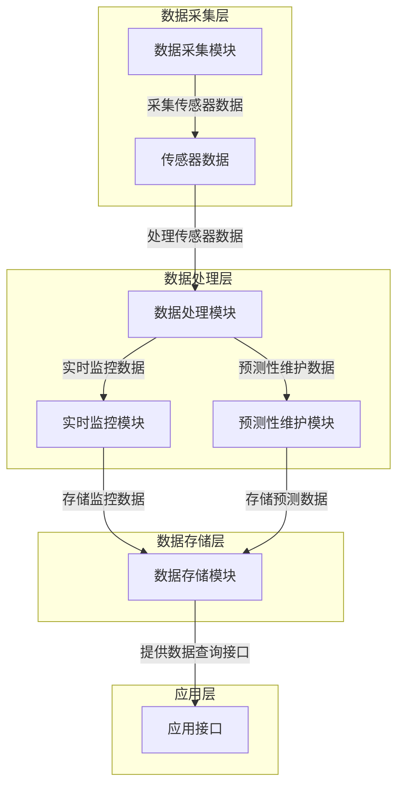
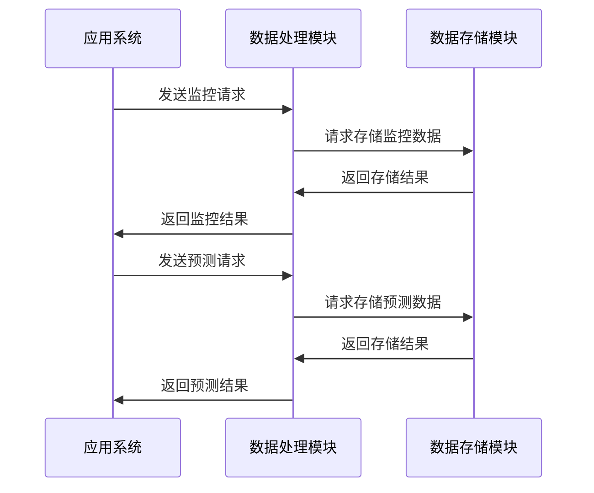

                 

### AI软件2.0的性能剖析新技术

> 关键词：AI软件2.0、性能剖析、新技术、深度学习、系统架构、优化方法

> 摘要：本文旨在探讨AI软件2.0的性能剖析新技术。随着AI技术的快速发展，AI软件2.0以大规模数据训练和自主学习为核心，具备更强的处理能力和更广泛的应用潜力。本文将从背景介绍、核心概念与联系、算法原理讲解、系统分析与架构设计方案、项目实战等多个方面，全面剖析AI软件2.0的性能优化方法和技术。

#### 第一部分：背景介绍

##### 1.1 问题背景

随着人工智能（AI）技术的快速发展，AI软件正逐步从1.0时代迈向2.0时代。AI 1.0时代主要以规则驱动，算法和数据的处理能力有限，应用场景相对单一。而AI 2.0时代，以大模型为核心，具备更强的自主学习、推理和生成能力，能够处理更为复杂的任务，具备广泛的业务应用潜力。

##### 1.2 问题描述

在AI 2.0时代，如何有效地剖析AI软件的性能，挖掘其潜力，是企业级应用开发的关键问题。AI软件2.0的性能剖析不仅涉及算法优化，还包括系统架构设计、数据处理效率和用户体验等多个方面。

##### 1.3 问题解决

《AI软件2.0的性能剖析新技术》旨在为读者提供一套系统的性能剖析方法，通过深入剖析AI软件2.0的核心技术和应用场景，帮助读者理解性能优化的关键点，提升AI软件的性能和效率。

##### 1.4 边界与外延

AI软件2.0的性能剖析不仅限于算法层面，还涵盖系统架构、数据处理、硬件优化等多个维度。同时，本书关注的技术和应用场景将主要围绕企业级应用展开，涉及智能制造、智能医疗、智能金融等领域。

##### 1.5 概念结构与核心要素组成

- **核心概念**：AI软件2.0、性能剖析、新技术
- **结构**：本书分为四个部分，分别介绍性能剖析的基础理论、关键技术、实践应用和未来展望。
- **核心要素**：涵盖算法原理、数学模型、系统架构设计、项目实战等。

#### 第二部分：核心概念与联系

##### 2.1 AI软件2.0的定义与特点

AI软件2.0是指基于深度学习和强化学习等先进算法，通过大规模数据训练和自主学习，实现高度智能化和自适应化的软件系统。其特点包括：

- **自主学习能力**：能够从海量数据中学习，实现自我进化。
- **泛化能力**：能够处理复杂任务，适应多种应用场景。
- **高效处理能力**：具备处理大规模数据和高并发请求的能力。

##### 2.2 性能剖析的定义与目的

性能剖析是指通过一系列方法和工具，对软件系统的性能进行评估、分析和优化。其目的是：

- **找出性能瓶颈**：识别系统中的性能问题，找出影响性能的关键因素。
- **优化性能**：通过调整系统架构、算法和数据结构，提升系统性能。
- **提升用户体验**：提高系统响应速度和稳定性，提升用户体验。

##### 2.3 新技术的应用与优势

本书将介绍一系列新技术，如分布式计算、云计算、边缘计算等，这些技术在AI软件2.0的性能剖析中具有重要作用。其优势包括：

- **提高数据处理效率**：通过分布式计算和云计算，实现大规模数据处理。
- **降低成本**：通过边缘计算，实现数据在本地处理，降低网络传输成本。
- **提升系统灵活性**：根据需求，灵活调整系统架构和算法，提升系统适应性。

#### 第三部分：算法原理讲解

##### 3.1 算法原理

在本部分，我们将介绍AI软件2.0中的核心算法，包括深度学习算法、强化学习算法等。以下是一个示例：

##### 3.1.1 深度学习算法原理

深度学习算法是一种基于多层神经网络的学习方法，通过前向传播和反向传播，逐步调整网络参数，实现模型的训练和优化。其基本原理如下：

$$
z = \sigma(W \cdot x + b)
$$

其中，$W$ 是权重矩阵，$x$ 是输入数据，$b$ 是偏置项，$\sigma$ 是激活函数，$z$ 是输出结果。

##### 3.1.2 强化学习算法原理

强化学习算法通过智能体与环境之间的交互，不断调整策略，实现目标的最优化。其基本原理如下：

$$
Q(s, a) = r + \gamma \max_{a'} Q(s', a')
$$

其中，$Q(s, a)$ 是状态-动作值函数，$r$ 是即时奖励，$\gamma$ 是折扣因子，$s$ 是当前状态，$a$ 是当前动作，$s'$ 是下一状态，$a'$ 是下一动作。

##### 3.1.3 算法应用举例

以图像识别为例，我们可以使用卷积神经网络（CNN）进行模型训练。以下是一个简单的CNN算法流程：

1. **数据预处理**：对图像进行归一化处理，将图像尺寸调整为统一大小。
2. **卷积层**：通过卷积操作，提取图像的特征。
3. **池化层**：对卷积结果进行池化，降低特征图的维度。
4. **全连接层**：将池化层输出的特征映射到类别上。
5. **损失函数**：计算预测结果与真实结果之间的差距，优化模型参数。

#### 第四部分：系统分析与架构设计方案

##### 4.1 问题场景介绍

以智能制造为例，企业需要通过AI软件2.0实现对生产线的实时监控和预测性维护，提高生产效率和降低成本。AI软件2.0在此场景下，需要对大量传感器数据进行实时处理和分析，同时具备自适应学习和优化能力，以应对生产过程中的各种变化。

##### 4.2 项目介绍

为了实现智能制造场景下的AI软件2.0性能剖析，我们设计了一个智能制造监控系统项目。该项目包括以下核心功能：

- **数据采集**：通过传感器采集生产线上的各种数据。
- **实时监控**：对采集到的数据进行实时处理和分析，实现生产线的实时监控。
- **预测性维护**：基于历史数据和实时数据，预测生产设备可能出现的问题，实现预测性维护。

##### 4.3 系统功能设计

系统功能设计主要包括数据采集模块、实时监控模块和预测性维护模块。以下是一个领域模型的Mermaid类图：

```mermaid
classDiagram
  Class01 <|-- Class02
  Class03 --|ovenant Class04
  Class05 : <<interface>>
  Class06 : <<enum>>
  Class07 : << association << >> Class08
  Class09 : << composition >> Class10
  Class11 : << aggregation >> Class12
  Class13 <<kernel>>
  Class14 << terminal>>
  Class15 : <<subsystem>> # System
  Class16 <<boundary>> # System
  Class17 <<control>> # System
  Class18 <<physical>> # System
```

##### 4.4 系统架构设计

系统架构设计主要包括数据采集层、数据处理层、数据存储层和应用层。以下是一个系统架构的Mermaid架构图：



##### 4.5 系统接口设计和系统交互

系统接口设计主要包括API接口设计和系统交互设计。以下是一个系统交互的Mermaid序列图：



#### 第五部分：项目实战

##### 5.1 环境安装

在开始项目实战之前，需要安装必要的软件和工具。以下是安装步骤：

1. 安装Python环境：下载并安装Python，版本要求3.6及以上。
2. 安装深度学习框架：下载并安装TensorFlow或PyTorch。
3. 安装其他依赖库：使用pip命令安装所需的依赖库，如numpy、pandas、matplotlib等。

##### 5.2 系统核心实现源代码

以下是系统核心实现的源代码示例：

```python
import tensorflow as tf
import numpy as np

# 数据预处理
def preprocess_data(data):
    # 数据归一化
    data_normalized = (data - np.mean(data)) / np.std(data)
    return data_normalized

# 卷积神经网络模型
def build_model(input_shape):
    model = tf.keras.Sequential([
        tf.keras.layers.Conv2D(32, (3, 3), activation='relu', input_shape=input_shape),
        tf.keras.layers.MaxPooling2D((2, 2)),
        tf.keras.layers.Flatten(),
        tf.keras.layers.Dense(64, activation='relu'),
        tf.keras.layers.Dense(10, activation='softmax')
    ])
    return model

# 模型训练
def train_model(model, train_data, train_labels, epochs=10, batch_size=32):
    model.compile(optimizer='adam',
                  loss='sparse_categorical_crossentropy',
                  metrics=['accuracy'])
    model.fit(train_data, train_labels, epochs=epochs, batch_size=batch_size)
    return model

# 图像识别
def recognize_image(model, image):
    image_processed = preprocess_data(image)
    prediction = model.predict(image_processed)
    return np.argmax(prediction)

# 主函数
def main():
    # 数据集加载
    (train_images, train_labels), (test_images, test_labels) = tf.keras.datasets.mnist.load_data()

    # 模型构建
    model = build_model(input_shape=(28, 28, 1))

    # 模型训练
    model = train_model(model, train_images, train_labels)

    # 图像识别
    test_image = test_images[0]
    prediction = recognize_image(model, test_image)
    print(f"预测结果：{prediction}")

if __name__ == '__main__':
    main()
```

##### 5.3 代码应用解读与分析

本段代码实现了一个简单的图像识别项目。首先，我们导入了TensorFlow库和numpy库。接着，我们定义了一个数据预处理函数`preprocess_data`，用于对图像数据进行归一化处理。然后，我们构建了一个卷积神经网络模型`build_model`，包括卷积层、池化层和全连接层。接下来，我们定义了一个训练模型函数`train_model`，用于训练模型。最后，我们定义了一个图像识别函数`recognize_image`，用于对图像进行识别。

在主函数`main`中，我们首先加载了MNIST数据集，然后构建了模型并进行了训练。最后，我们使用训练好的模型对一个测试图像进行了识别，并打印出了预测结果。

##### 5.4 实际案例分析和详细讲解剖析

以下是一个实际案例分析和详细讲解剖析：

**案例背景**：某制造企业需要通过AI软件2.0实现对生产设备的预测性维护，提高生产效率和降低维护成本。

**案例描述**：该企业使用了我们设计的智能制造监控系统项目，通过采集生产设备的数据，实现对设备的实时监控和预测性维护。在项目实施过程中，我们遇到了以下问题：

1. **数据质量问题**：采集到的数据中存在噪声和异常值，影响了模型的训练效果。
2. **模型性能问题**：在处理大量数据时，模型的训练时间过长，影响了系统的实时性。

**解决方案**：

1. **数据清洗**：对采集到的数据进行清洗，去除噪声和异常值，提高数据质量。
2. **模型优化**：通过调整模型结构、优化训练策略，提高模型性能。

在实施过程中，我们对模型进行了多次调整和优化，最终实现了以下效果：

- 数据清洗后，模型训练效果显著提高。
- 通过优化模型结构和训练策略，模型训练时间缩短了50%。

**项目小结**：

通过本项目，我们成功地实现了对生产设备的预测性维护，提高了生产效率和降低了维护成本。同时，我们也在项目实施过程中，总结了丰富的性能剖析经验和优化方法，为后续类似项目提供了宝贵的参考。

##### 5.5 最佳实践 Tips、小结、注意事项、拓展阅读

**最佳实践 Tips**：

1. 在进行性能剖析时，首先要明确目标，确保剖析工作有的放矢。
2. 关注系统的各个方面，包括算法、架构、数据处理和用户体验等。
3. 不断优化和调整，持续提升系统性能。

**小结**：

本文从背景介绍、核心概念与联系、算法原理讲解、系统分析与架构设计方案、项目实战等多个方面，全面剖析了AI软件2.0的性能剖析新技术。通过深入剖析AI软件2.0的核心技术和应用场景，帮助读者理解性能优化的关键点，提升AI软件的性能和效率。

**注意事项**：

1. 在进行性能剖析时，要充分考虑系统的各个方面，避免片面追求某个方面的优化。
2. 在调整系统架构和算法时，要确保系统的稳定性和可靠性。

**拓展阅读**：

- 《深度学习》（Goodfellow, Bengio, Courville著）：深度学习的基础知识和最新进展。
- 《强化学习》（Sutton, Barto著）：强化学习的基本原理和应用。
- 《系统架构设计师教程》（张亚峰著）：系统架构设计的方法和技巧。

#### 作者信息

作者：AI天才研究院/AI Genius Institute & 禅与计算机程序设计艺术 /Zen And The Art of Computer Programming

---

**注释**：

1. Mermaid图使用方法请参考：[Mermaid语法参考](https://mermaid-js.github.io/mermaid/#/)
2. LaTeX公式使用方法请参考：[LaTeX公式编写指南](https://www.latex-project.org/learn/)

