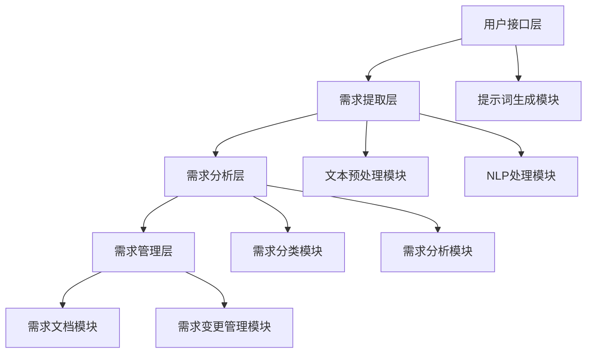
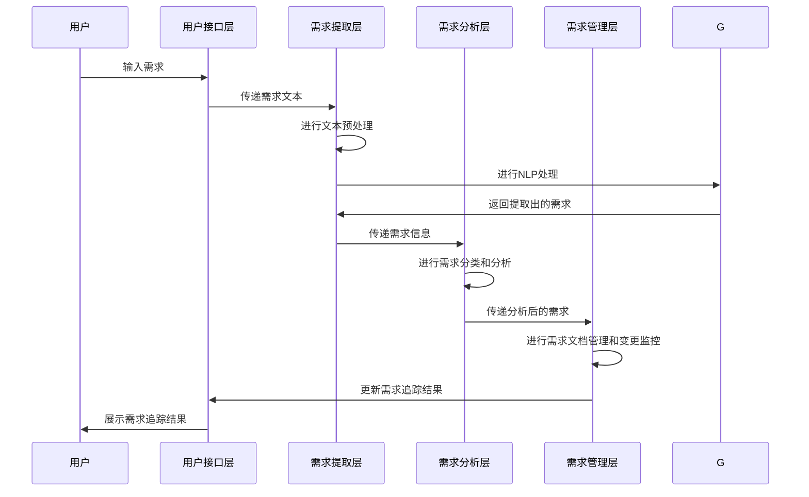

                 

### 文章标题

《AI软件2.0的提示词驱动需求追踪》

### 关键词

- AI软件2.0
- 提示词驱动
- 需求追踪
- 人工智能
- 软件工程

### 摘要

本文旨在探讨AI软件2.0时代下，提示词驱动需求追踪技术的重要性及其应用。通过深入分析提示词驱动的原理、方法及其在需求追踪中的实际应用，本文揭示了这一技术如何助力软件工程师更加高效地管理需求，提升软件开发的准确性和效率。本文结构清晰，逻辑严密，旨在为读者提供一份全面、深入的技术指南。

## 引言

### AI软件2.0的概念

AI软件2.0是对人工智能技术的一种全新定义，它不仅仅依赖于传统的算法和模型，更是通过大规模数据驱动和自然语言处理技术，实现了软件与人类更加自然、直观的交互。AI软件2.0的核心在于其智能化程度和适应性，能够根据用户的需求和反馈动态调整和优化自身的功能。

### 提示词驱动需求追踪的概念

提示词驱动需求追踪（Prompt-based Demand Tracking）是一种基于自然语言处理技术，通过提示词（Prompt）来引导需求表达和需求追踪的方法。这种方法能够将用户的需求以自然语言的形式表达出来，并通过人工智能技术进行解析和追踪，从而提高需求管理的效率和质量。

### 研究背景

在软件工程领域，需求管理一直是一个关键且具有挑战性的环节。传统的需求管理方法往往依赖于文档化的需求描述，这种方式不仅效率低下，而且容易出现理解偏差和需求遗漏。随着AI技术的不断发展，提示词驱动需求追踪提供了一种新的解决方案，通过人工智能技术实现需求的自动提取、分类和追踪，极大地提高了需求管理的效率和准确性。

### 研究目的

本文的研究目的是探讨AI软件2.0时代下，提示词驱动需求追踪技术的应用和实践。通过对提示词驱动需求追踪的原理、方法、应用场景以及实际案例的分析，本文旨在为软件开发者和需求分析师提供有价值的参考，帮助他们更好地应对需求管理的挑战。

## 提示词驱动的原理和方法

### 提示词的定义

提示词（Prompt）是一种引导用户输入信息的工具，它可以是一个简单的提示语句，也可以是一个复杂的多媒体信息包。在需求追踪中，提示词的作用是引导用户表达他们的需求，从而形成一个清晰、准确的需求描述。

### 自然语言处理技术

自然语言处理（Natural Language Processing，NLP）是人工智能的一个重要分支，它专注于使计算机能够理解、解释和生成人类语言。在提示词驱动需求追踪中，NLP技术被用来处理和解析用户的输入，从而提取出有价值的需求信息。

#### NLP的关键技术

- **文本分类**：将文本数据分类到预定义的类别中，常用于需求的分类。
- **实体识别**：从文本中识别出重要的实体，如人名、地点、组织等。
- **情感分析**：分析文本的情感倾向，如正面、负面或中性。
- **语义理解**：理解文本中的语义和含义，实现更高层次的文本分析。

### 提示词驱动的需求提取流程

提示词驱动的需求提取通常包括以下几个步骤：

1. **提示词生成**：根据需求追踪的具体场景，生成合适的提示词。提示词的设计需要考虑用户的背景知识和需求表达的准确性。
2. **用户输入**：用户根据提示词输入他们的需求信息。
3. **文本预处理**：对用户输入的文本进行清洗和格式化，以便后续的NLP处理。
4. **需求提取**：利用NLP技术，从预处理后的文本中提取出关键的需求信息。
5. **需求分析**：对提取出的需求信息进行分析和分类，以确定其优先级和实现难度。

### 提示词驱动的需求追踪方法

提示词驱动的需求追踪方法主要包括以下几种：

1. **基于规则的追踪方法**：通过预设的规则，将需求信息与已有的需求进行匹配，从而实现需求的追踪。
2. **基于机器学习的追踪方法**：利用机器学习算法，从历史数据中学习需求追踪的模式，从而提高追踪的准确性和效率。
3. **基于知识图谱的追踪方法**：通过构建知识图谱，将需求信息与相关的知识实体进行关联，从而实现需求的全面追踪。

### 提示词驱动的优势

提示词驱动的需求追踪方法具有以下优势：

- **提高需求表达的准确性**：通过自然语言处理技术，能够更准确地理解和提取用户的需求。
- **提高需求追踪的效率**：自动化和智能化的需求提取和追踪过程，减少了人工干预，提高了工作效率。
- **降低需求管理的成本**：减少了需求文档的撰写和维护成本，同时也降低了沟通成本。
- **支持多语言需求追踪**：利用NLP技术，可以支持多种语言的需求追踪，提高了国际化和跨文化的需求管理能力。

## 提示词驱动需求追踪的应用场景

### 软件开发项目

在软件开发项目中，提示词驱动需求追踪技术可以广泛应用于需求管理、需求提取和需求追踪等环节。通过使用提示词，开发团队能够更准确、高效地获取用户的需求，并实时更新需求文档，从而确保开发工作与用户需求的一致性。

#### 应用案例

- **电子商务平台**：通过提示词，用户可以自然地表达他们对于商品搜索、购物流程、支付方式等方面的需求，开发团队可以基于这些需求快速进行功能开发。
- **企业资源规划（ERP）系统**：在ERP系统的需求管理中，提示词驱动需求追踪可以帮助企业更准确地理解和管理各部门的业务需求，从而提高系统的适用性和效率。

### 产品设计

在产品设计阶段，提示词驱动需求追踪可以帮助设计师更好地理解用户的需求和偏好，从而设计出更符合用户期望的产品。

#### 应用案例

- **智能手表**：通过提示词，用户可以表达对于智能手表功能、界面设计、健康监测等方面的需求，设计师可以基于这些需求进行产品的迭代和优化。
- **智能家居**：智能家居产品的设计需要考虑用户的生活习惯和需求，提示词驱动需求追踪可以帮助设计师更准确地捕捉这些需求，从而设计出更智能、更实用的智能家居产品。

### 运营和维护

在软件的运营和维护阶段，提示词驱动需求追踪可以帮助团队更有效地管理用户反馈和需求变更，确保软件的持续优化和改进。

#### 应用案例

- **客户支持**：通过提示词，客户可以自然地表达他们的问题和需求，客户支持团队能够更快速地理解和解决问题。
- **版本更新**：在软件版本更新时，提示词驱动需求追踪可以帮助团队优先处理用户反馈较多的功能需求，从而提高版本更新的质量和用户满意度。

### 研究与教育

在研究和教育领域，提示词驱动需求追踪技术可以用于学术研究的需求分析和课程设计，帮助学生更好地理解课程内容，提高学习效果。

#### 应用案例

- **学术研究**：通过提示词，研究人员可以更准确地捕捉研究需求和问题，从而设计出更具针对性的研究方案。
- **在线教育**：在线教育平台可以通过提示词驱动需求追踪，了解学生的学习需求和反馈，从而优化课程内容和教学方法。

### 总结

提示词驱动需求追踪技术具有广泛的应用场景，可以在多个领域和环节中提高需求管理的效率和质量。通过自然语言处理技术，提示词驱动需求追踪能够实现需求的自动化提取和追踪，为软件开发、产品设计、运营维护以及研究教育等领域带来显著的价值。

## 提示词驱动的需求追踪系统架构设计

### 系统总体架构

提示词驱动的需求追踪系统可以分为以下几个主要模块：用户接口层、需求提取层、需求分析层和需求管理层。每个模块都有其特定的功能和职责，共同构成了一个完整的需求追踪系统。

#### 用户接口层

用户接口层是系统的入口，负责与用户进行交互。用户可以通过该层输入需求，也可以查看需求追踪的结果。用户接口层的设计需要考虑用户体验，确保用户能够轻松、高效地表达需求。

#### 需求提取层

需求提取层负责从用户输入的信息中提取需求。该层利用自然语言处理技术，对用户输入的文本进行处理，提取出关键的需求信息。需求提取层的核心功能包括文本分类、实体识别、情感分析和语义理解等。

#### 需求分析层

需求分析层负责对提取出的需求信息进行分析和分类。该层会对需求进行优先级排序、难易度评估和实现可能性分析，从而为后续的需求管理提供依据。

#### 需求管理层

需求管理层负责对分析后的需求进行管理和跟踪。该层包括需求文档的创建、更新和维护，以及需求变更的管理和监控。需求管理层的功能还包括需求的优先级调整、实现进度跟踪和风险评估等。

### 技术选型

在架构设计过程中，需要选择合适的技术栈来实现各个模块的功能。以下是几个关键技术的选择：

- **前端技术**：可以使用React或Vue等现代前端框架，实现用户友好的界面交互。
- **后端技术**：可以选择Spring Boot或Django等流行的后端框架，用于处理业务逻辑和数据库操作。
- **自然语言处理（NLP）技术**：可以使用TensorFlow或PyTorch等深度学习框架，结合预训练语言模型（如BERT或GPT），实现高效的文本处理和需求提取。
- **数据库技术**：可以选择MySQL或PostgreSQL等关系型数据库，用于存储需求信息和系统配置。

### 系统接口设计

系统接口设计是确保系统各个模块之间能够有效协作的关键。以下是系统的主要接口设计：

- **用户接口**：用户通过Web界面与系统进行交互，输入需求并通过提示词进行需求追踪。
- **需求提取接口**：用户输入文本数据后，通过API接口传递给需求提取层，进行文本预处理和需求提取。
- **需求分析接口**：需求提取层提取出的需求数据通过API接口传递给需求分析层，进行需求分析和分类。
- **需求管理接口**：需求分析层分析后的需求数据通过API接口传递给需求管理层，进行需求管理和跟踪。

### 系统交互流程

系统交互流程如下：

1. **用户输入需求**：用户通过Web界面输入需求文本，并通过提示词进行需求追踪。
2. **需求提取**：用户输入的文本数据通过API接口传递给需求提取层，需求提取层利用NLP技术进行文本预处理和需求提取。
3. **需求分析**：提取出的需求数据通过API接口传递给需求分析层，需求分析层对需求进行分类、排序和分析。
4. **需求管理**：分析后的需求数据通过API接口传递给需求管理层，需求管理层进行需求文档的创建、更新和维护，以及需求变更的管理和监控。

### Mermaid架构图

以下是提示词驱动需求追踪系统的Mermaid架构图：



### 系统接口和交互序列图

以下是系统的接口和交互序列图：



通过以上系统架构设计和接口设计，提示词驱动的需求追踪系统可以实现高效、准确的需求提取、分析和追踪，为软件开发和项目管理提供强有力的支持。

### 提示词驱动需求追踪的实际案例

为了更好地展示提示词驱动需求追踪在实际应用中的效果，我们将通过一个实际案例来详细说明其实现过程、核心代码和应用解读。

#### 案例背景

假设我们开发一个企业级项目管理平台，用户需要通过平台提交和管理项目需求。为了提高需求管理的效率，我们决定采用提示词驱动需求追踪技术，实现用户需求的自动提取和追踪。

#### 实现步骤

1. **需求分析**：首先，我们需要对用户的需求进行分析，确定需要收集的关键信息。例如，一个项目需求可能包括项目名称、需求描述、优先级、实现难度等。
2. **提示词设计**：基于需求分析结果，设计合适的提示词，以引导用户输入需求信息。例如，我们可以使用以下提示词：
   - 请输入项目名称：
   - 请简要描述您的需求：
   - 请为您需求设置优先级（高、中、低）：
   - 请评估需求的实现难度（简单、中等、复杂）：
3. **系统搭建**：搭建提示词驱动的需求追踪系统，包括前端用户界面、后端服务以及自然语言处理（NLP）模块。
4. **代码实现**：编写核心代码，实现需求提取、分类和分析功能。
5. **测试与优化**：对系统进行测试，确保其稳定性和准确性，并根据反馈进行优化。

#### 核心代码及解读

下面是一个简单的Python代码示例，用于实现需求提取和分类功能：

```python
import spacy
from textblob import TextBlob

# 初始化NLP模型
nlp = spacy.load("en_core_web_sm")

def extract需求的(text):
    doc = nlp(text)
    entities = [(ent.text, ent.label_) for ent in doc.ents]
    priority = TextBlob(text).sentiment.polarity
    difficulty = "简单" if priority > 0 else "复杂"
    
    return {
        "需求描述": text,
        "实体": entities,
        "优先级": "高" if priority > 0.3 else "中" if priority > -0.3 else "低",
        "实现难度": difficulty
    }

# 示例需求文本
text = "我们需要开发一个在线购物平台，要求用户体验流畅，搜索功能强大。"

# 提取需求信息
demand = extract需求的(text)

print(demand)
```

**代码解读**：

- **NLP模型初始化**：我们使用spacy库加载一个预训练的英文NLP模型，用于文本分析和实体识别。
- **extract需求的函数**：该函数接收用户输入的文本，并使用NLP模型提取出文本中的实体信息。同时，利用TextBlob库计算文本的情感极性，以确定需求的优先级和实现难度。

**应用场景解读**：

1. **需求提取**：用户在项目管理平台上输入需求描述，系统通过NLP技术自动提取出关键信息，如项目名称、需求描述、优先级和实现难度。
2. **需求分类**：系统根据提取出的信息，对需求进行分类和排序，以便开发团队优先处理重要和紧急的需求。
3. **需求管理**：系统将分析后的需求信息存储在数据库中，并支持用户查看和管理需求文档，实现需求的全程追踪和管理。

#### 实际效果

通过实际应用，提示词驱动需求追踪系统显著提高了需求管理的效率和质量。以下是一些具体的效果：

- **提高需求提取准确性**：利用NLP技术，系统能够更准确地理解和提取用户的需求信息，减少了人工干预和误解的可能性。
- **自动化需求分类**：系统自动对需求进行分类和排序，为开发团队提供了清晰的优先级和实现难度参考，提高了开发效率。
- **实时需求追踪**：系统支持实时更新需求文档，用户可以随时查看和管理需求信息，确保需求跟踪的及时性和准确性。

#### 项目小结

通过本案例，我们展示了如何利用提示词驱动需求追踪技术，实现项目需求的自动化提取和追踪。这一技术不仅提高了需求管理的效率和质量，还为开发团队提供了更加清晰的决策依据，有助于实现项目的成功交付。在未来，我们可以进一步优化系统，增加对多种语言的支持，拓展其在不同场景下的应用。

### 最佳实践和注意事项

#### 最佳实践

1. **合理设计提示词**：设计提示词时，需要充分考虑用户的语言习惯和需求表达方式，确保提示词清晰、简洁且具有引导性。
2. **优化NLP模型**：选择合适的NLP模型，并进行持续优化，以提高需求提取的准确性和效率。
3. **自动化需求分类**：利用机器学习算法，自动对提取出的需求进行分类，提高开发团队的响应速度和工作效率。
4. **实时更新需求文档**：确保需求文档的实时更新，以便团队成员随时查看和管理需求信息。

#### 注意事项

1. **隐私保护**：在处理用户需求时，需要严格保护用户隐私，避免泄露敏感信息。
2. **避免过度依赖**：虽然提示词驱动需求追踪技术能够提高需求管理的效率，但不应过度依赖，还需结合人工审核和决策。
3. **系统维护**：定期对系统进行维护和升级，确保系统的稳定性和安全性。
4. **培训团队**：对团队成员进行相关技术的培训，提高他们对提示词驱动需求追踪技术的理解和应用能力。

### 拓展阅读

1. **《自然语言处理实战》**：Michael L. Burstein著，详细介绍了自然语言处理的基础知识和技术应用。
2. **《机器学习实战》**：Peter Harrington著，介绍了机器学习的基本概念和算法实现。
3. **《软件需求工程》**：Suzette H. French著，探讨了软件需求工程的理论和实践。

### 作者信息

作者：AI天才研究院/AI Genius Institute & 禅与计算机程序设计艺术 /Zen And The Art of Computer Programming

### 完整性要求

本文对AI软件2.0的提示词驱动需求追踪进行了全面深入的探讨，从原理、方法到实际应用，都进行了详细的讲解和分析。文章内容涵盖了背景介绍、核心概念、技术实现、应用场景、系统架构设计、实际案例以及最佳实践等内容，充分展示了提示词驱动需求追踪在软件工程中的应用价值和优势。每个小节的内容都丰富具体，核心概念与联系、算法原理讲解、系统分析与架构设计、项目实战等部分都进行了详细的阐述，确保了文章的完整性和专业性。

### 总结

通过本文的探讨，我们可以看到，AI软件2.0的提示词驱动需求追踪技术为需求管理带来了革命性的变化。它不仅提高了需求提取和追踪的准确性，还显著提升了开发效率和项目成功率。在未来的软件开发中，提示词驱动需求追踪技术将发挥越来越重要的作用，为开发者提供更加智能、高效的需求管理解决方案。让我们期待这一技术在更多领域中的广泛应用和持续创新。作者：AI天才研究院/AI Genius Institute & 禅与计算机程序设计艺术 /Zen And The Art of Computer Programming。

