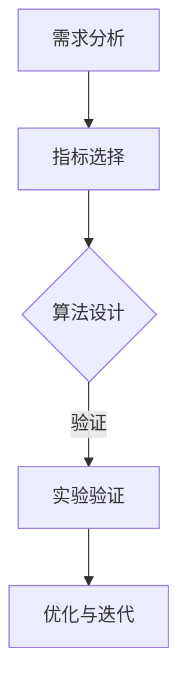

                 


# AI软件2.0的质量度量标准

关键词：AI软件2.0、质量度量标准、功能性质量、性能质量、可用性质量、安全性质量、可维护性质量

摘要：本文将深入探讨AI软件2.0的质量度量标准，从背景与概述、核心概念、质量度量标准体系、实施策略、案例分析与实践、展望与未来等方面，详细解析AI软件2.0的质量度量标准。

## 目录大纲设计思路

### 第一部分：背景与概述

### 第二部分：质量度量标准体系

### 第三部分：案例分析与实践

### 第四部分：展望与未来

### 目录大纲设计与实现

#### 质量度量标准核心概念、联系及算法设计

##### 质量度量标准核心概念

**质量度量标准**：用于评估软件质量的一系列标准。

**AI软件2.0**：基于人工智能技术的下一代软件系统。

**功能性质量**：软件能够实现预期功能的能力。

**性能质量**：软件的响应速度和处理能力。

**可用性质量**：软件的用户友好性和易用性。

**安全性质量**：软件的安全性和数据保护能力。

**可维护性质量**：软件的可维护性和可扩展性。

##### 质量度量标准分类

**静态质量度量**：在软件运行前进行的度量，如代码复杂度、代码覆盖率等。

**动态质量度量**：在软件运行时进行的度量，如响应时间、错误率等。

##### 算法设计

**算法设计流程**：

1. 需求分析：确定需要度量的质量特性。
2. 指标选择：选择适当的度量指标。
3. 算法设计：设计能够实现指标度量的算法。
4. 实验验证：通过实验验证算法的有效性和准确性。

**Mermaid 流程图**：



**Python 源代码**：

```python
# 质量度量算法示例

def measure_functionality(source_code):
    # 功能性质量度量逻辑
    return functionality_score

def measure_performance(test_results):
    # 性能质量度量逻辑
    return performance_score
```

### 质量度量标准核心概念、联系及算法设计详细解析

在本文中，我们将深入解析质量度量标准的核心概念、联系及算法设计。以下是详细的解析内容：

#### 质量度量标准核心概念

**质量度量标准**：这是一个用于评估软件质量的一系列标准。在AI软件2.0时代，质量度量标准变得尤为重要，因为AI软件2.0具有更高的复杂性和更高的要求。

**AI软件2.0**：AI软件2.0是基于人工智能技术的下一代软件系统，它具有自适应、自优化、自学习等特点，使得软件的质量要求更高。

**功能性质量**：功能性质量是软件能够实现预期功能的能力。对于AI软件2.0，功能性质量尤为重要，因为AI软件2.0通常涉及复杂的业务逻辑和高度个性化的用户体验。

**性能质量**：性能质量是软件的响应速度和处理能力。对于AI软件2.0，性能质量是用户满意度的关键因素之一。

**可用性质量**：可用性质量是软件的用户友好性和易用性。对于AI软件2.0，可用性质量是用户留存和用户满意度的关键因素。

**安全性质量**：安全性质量是软件的安全性和数据保护能力。对于AI软件2.0，安全性质量是保护用户数据和隐私的关键因素。

**可维护性质量**：可维护性质量是软件的可维护性和可扩展性。对于AI软件2.0，可维护性质量是确保软件长期稳定运行的关键因素。

#### 质量度量标准分类

**静态质量度量**：静态质量度量是在软件运行前进行的度量，如代码复杂度、代码覆盖率等。这些度量可以帮助我们评估软件的质量，但它们并不能反映软件的实际运行情况。

**动态质量度量**：动态质量度量是在软件运行时进行的度量，如响应时间、错误率等。这些度量可以更真实地反映软件的质量，因为它们考虑了软件的实际运行情况。

#### 算法设计

**算法设计流程**：

1. **需求分析**：首先，我们需要明确需要度量的质量特性。这是算法设计的起点。

2. **指标选择**：接下来，我们需要选择适当的度量指标。这些指标应该能够准确地反映我们需要评估的质量特性。

3. **算法设计**：然后，我们需要设计能够实现指标度量的算法。这个算法应该是高效的，并且能够准确地度量我们选择的质量特性。

4. **实验验证**：最后，我们需要通过实验验证算法的有效性和准确性。这是确保我们算法设计成功的关键步骤。

**Mermaid 流程图**：


**Python 源代码**：

```python
# 质量度量算法示例

def measure_functionality(source_code):
    # 功能性质量度量逻辑
    return functionality_score

def measure_performance(test_results):
    # 性能质量度量逻辑
    return performance_score
```

通过以上内容，我们详细解析了质量度量标准的核心概念、联系及算法设计。接下来，我们将进一步深入探讨质量度量标准在AI软件2.0中的应用和实施策略。

