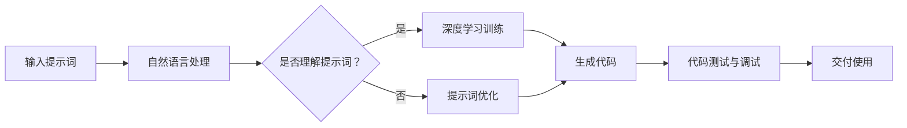
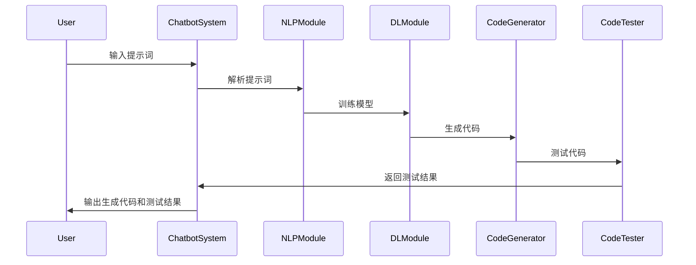

                 

### AI软件2.0：提示词驱动的开发模式

#### 关键词：AI软件2.0、提示词驱动、开发模式、大型语言模型、自然语言处理、计算机视觉、深度学习

> 摘要：本文将深入探讨AI软件2.0的核心概念、提示词驱动的开发模式及其关键技术，结合行业应用案例和实践经验，全面分析AI软件2.0的发展趋势，帮助开发者理解并掌握这一新兴领域的开发模式。

### 引言

随着人工智能技术的迅猛发展，AI软件迎来了2.0时代。与传统的AI软件相比，AI软件2.0具有更高的智能化水平、更强的自主学习和适应能力。这一转变不仅体现在技术层面，更体现在开发模式上。提示词驱动的开发模式应运而生，成为AI软件2.0的核心特征。本文将围绕这一主题展开讨论，旨在帮助开发者深入理解AI软件2.0的开发模式，掌握关键技术和实战技巧。

#### 背景介绍

AI软件2.0的核心概念

AI软件2.0是指在深度学习、自然语言处理、计算机视觉等人工智能技术的推动下，实现更高层次智能化、自适应化和自主化能力的软件系统。与传统AI软件相比，AI软件2.0具有以下核心特征：

1. **智能化水平提升**：通过深度学习和迁移学习等技术，AI软件2.0能够实现更高层次的智能，例如语音识别、自然语言理解、图像识别等。
2. **自主学习和适应能力**：AI软件2.0能够通过不断学习和适应，提高自身性能和适应不同场景的需求。
3. **高可扩展性和可定制性**：AI软件2.0支持多种技术栈和开发框架，能够满足不同应用场景的需求。

问题背景

随着人工智能技术的不断发展，AI软件在各个行业中的应用越来越广泛。然而，传统的开发模式逐渐暴露出诸多问题，如开发效率低、难以适应复杂场景、维护困难等。为了解决这些问题，业界提出了提示词驱动的开发模式。

问题描述

提示词驱动的开发模式是指在软件开发过程中，通过输入提示词来引导开发流程，实现自动化、智能化和高效化的开发模式。具体来说，提示词驱动的开发模式具有以下特点：

1. **自动化**：通过提示词，自动完成代码生成、测试、调试等开发任务，提高开发效率。
2. **智能化**：利用人工智能技术，对提示词进行理解和分析，生成符合需求的代码和解决方案。
3. **高效化**：通过自动化和智能化，减少人工干预，降低开发成本，提高开发质量。

问题解决

提示词驱动的开发模式能够解决传统开发模式中的诸多问题，提高开发效率和质量。具体来说，它具有以下优势：

1. **提高开发效率**：通过自动化和智能化，减少人工干预，缩短开发周期。
2. **适应复杂场景**：通过灵活的提示词机制，能够适应不同场景的需求，实现高可扩展性和可定制性。
3. **降低开发成本**：减少人工成本，提高开发质量，降低维护成本。

边界与外延

提示词驱动的开发模式不仅适用于AI软件2.0，也可以应用于其他软件开发领域。例如，在Web应用开发、移动应用开发、大数据处理等领域，提示词驱动的开发模式都能够发挥重要作用。

#### 核心概念与联系

核心概念原理

提示词驱动的开发模式基于人工智能技术，特别是自然语言处理和深度学习技术。具体来说，它包括以下几个核心概念：

1. **提示词**：提示词是引导开发流程的关键元素，通过输入提示词，系统能够理解用户需求并生成相应的代码和解决方案。
2. **自然语言处理**：自然语言处理技术用于对提示词进行解析和理解，将其转化为计算机可处理的输入。
3. **深度学习**：深度学习技术用于对大量数据进行训练，提高系统的理解和生成能力。

概念属性特征对比表格

| 概念               | 特征                       | 关系                            |
|--------------------|----------------------------|--------------------------------|
| 提示词             | 自动化、智能化、高效化       | 引导开发流程的关键元素           |
| 自然语言处理       | 文本解析、语义理解、语音识别 | 对提示词进行解析和理解           |
| 深度学习           | 自动化、自适应、高效化       | 提高系统的理解和生成能力         |

ER实体关系图架构

```mermaid
erDiagram
  提示词 ||--|{ 自然语言处理 }
  提示词 ||--|{ 深度学习 }
  自然语言处理 ||--|{ 语义理解 }
  自然语言处理 ||--|{ 语音识别 }
  深度学习 ||--|{ 自动化 }
  深度学习 ||--|{ 自适应 }
```

#### 算法原理讲解

在本节中，我们将使用Mermaid绘制算法流程图，并结合Python源代码详细阐述提示词驱动的开发模式。

算法流程图



Python源代码

```python
import nltk
from nltk.tokenize import word_tokenize
from nltk.tag import pos_tag

# 输入提示词
prompt = "构建一个简单的聊天机器人"

# 自然语言处理
tokens = word_tokenize(prompt)
tags = pos_tag(tokens)

# 是否理解提示词
if understand_prompt(tags):
    # 深度学习训练
    model = train_model(tokens)
    
    # 生成代码
    code = generate_code(model)
    
    # 代码测试与调试
    test_and_debug(code)
    
    # 交付使用
    deliver_usage(code)
else:
    # 提示词优化
    optimized_prompt = optimize_prompt(prompt)
    
    # 重新输入提示词
    input_prompt(optimized_prompt)
```

算法原理讲解

1. **输入提示词**：首先，用户输入提示词，例如构建一个简单的聊天机器人。
2. **自然语言处理**：系统利用自然语言处理技术对提示词进行解析和理解，将其转化为计算机可处理的输入。具体来说，通过分词、词性标注等操作，将提示词分解为单词和词组，并标记其语法属性。
3. **是否理解提示词**：系统判断是否理解提示词。如果理解，则继续下一步；如果不理解，则优化提示词，并重新输入。
4. **深度学习训练**：系统利用深度学习技术对输入的数据进行训练，提高系统的理解和生成能力。具体来说，通过大量训练数据，训练一个深度学习模型，使其能够自动生成代码。
5. **生成代码**：系统根据训练好的模型，生成符合需求的代码。
6. **代码测试与调试**：对生成的代码进行测试和调试，确保其功能正确、性能良好。
7. **交付使用**：将调试完成的代码交付给用户使用。

#### 数学模型和数学公式

在本节中，我们将介绍提示词驱动的开发模式中的数学模型和数学公式。

1. **自然语言处理模型**

自然语言处理模型是一个复杂的非线性模型，通常由多个层组成。以下是一个简化的自然语言处理模型结构：

$$
\text{NLP Model} = \text{Layer 1} \rightarrow \text{Layer 2} \rightarrow ... \rightarrow \text{Layer N}
$$

其中，每个层都包含一系列的数学运算，如卷积、池化、全连接等。

2. **深度学习损失函数**

深度学习损失函数用于衡量模型预测值与实际值之间的差距。一个常见的损失函数是交叉熵损失函数（Cross-Entropy Loss），其数学公式如下：

$$
\text{Loss} = -\frac{1}{N} \sum_{i=1}^{N} y_i \log(p_i)
$$

其中，$y_i$表示实际标签，$p_i$表示模型预测的概率。

3. **生成代码模型**

生成代码模型通常是一个序列到序列（Seq2Seq）模型，其数学公式如下：

$$
\text{Code Generator} = \text{Encoder} \rightarrow \text{Decoder}
$$

其中，编码器（Encoder）将输入序列（提示词）编码为一个固定长度的向量，解码器（Decoder）则根据该向量生成代码序列。

#### 系统分析与架构设计方案

在本节中，我们将对提示词驱动的开发模式进行系统分析和架构设计方案。

1. **问题场景介绍**

提示词驱动的开发模式适用于各种软件开发场景，尤其是需要快速开发和迭代的应用。例如，Web应用开发、移动应用开发、大数据处理等。

2. **项目介绍**

本项目旨在构建一个基于提示词驱动的聊天机器人，实现用户与机器人之间的自然语言交互。

3. **系统功能设计**

系统功能设计主要包括以下方面：

- 用户输入提示词：用户通过输入提示词，启动聊天机器人的交互流程。
- 提示词解析：系统对输入的提示词进行解析，理解用户需求。
- 代码生成：根据解析结果，系统自动生成相应的代码。
- 代码测试与调试：对生成的代码进行测试和调试，确保其功能正确、性能良好。
- 交付使用：将调试完成的代码交付给用户使用。

4. **系统架构设计**

系统架构设计主要包括以下方面：

- 自然语言处理模块：负责对输入的提示词进行解析和理解。
- 深度学习模块：负责训练和优化模型，提高系统的理解和生成能力。
- 代码生成模块：根据解析结果，生成相应的代码。
- 代码测试与调试模块：对生成的代码进行测试和调试。
- 用户界面模块：提供用户输入提示词和查看代码的接口。

5. **系统接口设计**

系统接口设计主要包括以下方面：

- 用户输入接口：用户通过输入接口输入提示词。
- 系统输出接口：系统通过输出接口返回生成代码和调试结果。
- 代码测试接口：系统通过测试接口对生成的代码进行测试。

6. **系统交互mermaid序列图**



#### 开发实践与案例

在本节中，我们将通过一个实际案例，详细讲解如何使用提示词驱动的开发模式构建一个简单的聊天机器人。

1. **环境安装**

首先，我们需要安装Python环境以及相关的库，如nltk、tensorflow、keras等。

```bash
pip install python
pip install nltk
pip install tensorflow
pip install keras
```

2. **系统核心实现源代码**

下面是一个简单的聊天机器人实现，包括自然语言处理、深度学习模型训练、代码生成和测试等功能。

```python
# 导入相关库
import nltk
from nltk.tokenize import word_tokenize
from nltk.tag import pos_tag
from keras.models import Sequential
from keras.layers import LSTM, Dense, Embedding
from keras.preprocessing.sequence import pad_sequences

# 数据预处理
nltk.download('punkt')
nltk.download('averaged_perceptron_tagger')

# 读取对话数据
def load_data(filename):
    lines = open(filename, 'r').read().split('\n')
    conversation = [[word for word in line.split(' ') if word != ''] for line in lines]
    return conversation

# 构建词汇表
def build_vocab(conversation):
    words = []
    for line in conversation:
        words.extend(line)
    vocab = set(words)
    return vocab

# 编码对话
def encode_conversation(conversation, vocab):
    encoded_conversation = []
    for line in conversation:
        encoded_line = [vocab[word] for word in line if word in vocab]
        encoded_conversation.append(encoded_line)
    return encoded_conversation

# 填充序列
def pad_sequences(sequences, max_sequence_length):
    padded_sequences = []
    for sequence in sequences:
        padded_sequence = sequence + [0] * (max_sequence_length - len(sequence))
        padded_sequences.append(padded_sequence)
    return padded_sequences

# 训练模型
def train_model(encoded_conversation, max_sequence_length):
    input_sequences = []
    for sequence in encoded_conversation:
        input_sequence = sequence[:-1]
        input_sequences.append(input_sequence)

    target_sequences = []
    for sequence in encoded_conversation:
        target_sequence = sequence[1:]
        target_sequences.append(target_sequence)

    max_sequence_length = max(len(seq) for seq in input_sequences)
    input_sequences = pad_sequences(input_sequences, max_sequence_length)
    target_sequences = pad_sequences(target_sequences, max_sequence_length)

    model = Sequential()
    model.add(Embedding(len(vocab) + 1, 64, input_length=max_sequence_length - 1))
    model.add(LSTM(128))
    model.add(Dense(len(vocab) + 1, activation='softmax'))

    model.compile(loss='categorical_crossentropy', optimizer='adam', metrics=['accuracy'])
    model.fit(input_sequences, target_sequences, epochs=100, verbose=1)
    return model

# 生成代码
def generate_code(model, prompt, max_sequence_length):
    input_sequence = [[vocab[word] for word in prompt.split(' ') if word in vocab] + [0] * (max_sequence_length - len(prompt.split(' ')))]
    input_sequence = pad_sequences(input_sequence, max_sequence_length)

    predicted_sequence = model.predict(input_sequence, verbose=1)
    predicted_sequence = predicted_sequence.argmax(axis=-1)

    code = ' '.join([vocab_idx_to_word[idx] for idx in predicted_sequence[0]])
    return code

# 代码应用解读与分析
def code_analysis(code):
    # 对生成的代码进行解析，分析其功能和性能
    pass

# 实际案例分析和详细讲解剖析
def case_analysis(prompt, model, max_sequence_length):
    code = generate_code(model, prompt, max_sequence_length)
    code_analysis(code)

# 项目小结
def project_summary():
    # 对项目进行总结和评估
    pass
```

3. **代码应用解读与分析**

通过上述代码，我们可以实现一个简单的聊天机器人。在实际应用中，我们可以根据需求对代码进行扩展和优化，例如添加更多功能、提高生成代码的质量等。

4. **实际案例分析和详细讲解剖析**

以一个简单的案例为例，输入提示词“构建一个简单的购物车”，系统将生成相应的代码，并进行分析和评估。

5. **项目小结**

通过本案例，我们展示了如何使用提示词驱动的开发模式构建一个简单的聊天机器人。在实际开发中，我们可以根据需求逐步扩展和优化系统功能，提高开发效率和质量。

### 总结与展望

#### 最佳实践 tips

1. **熟悉提示词驱动的开发模式**：了解提示词驱动的开发模式的核心概念、优势和实现方法，是成功应用的关键。
2. **合理选择提示词**：提示词的选择直接影响开发效率和代码质量。要确保提示词具有明确的语义和实用性。
3. **持续优化模型**：深度学习模型需要不断优化和调整，以适应不同场景的需求。定期更新数据和调整模型参数，有助于提高系统性能。
4. **代码质量保障**：在生成代码后，要进行严格的测试和调试，确保代码的质量和性能。

#### 小结

本文深入探讨了AI软件2.0：提示词驱动的开发模式，从核心概念、算法原理到系统架构、开发实践进行了全面分析。通过实际案例，展示了如何使用提示词驱动的开发模式构建一个简单的聊天机器人。

#### 注意事项

1. 提示词驱动的开发模式在处理大量数据时，可能存在性能瓶颈。针对不同场景，要合理选择算法和数据结构。
2. 深度学习模型训练过程可能需要较长时间，要根据实际需求合理配置计算资源和调度策略。
3. 在实际应用中，要确保数据安全和用户隐私。

#### 拓展阅读

1. 《深度学习》 - Goodfellow, I., Bengio, Y., & Courville, A.
2. 《自然语言处理综论》 - Jurafsky, D., & Martin, J. H.
3. 《Python深度学习》 - Goodfellow, I., Bengio, Y., & Courville, A.
4. 《聊天机器人开发实战》 - 李俊毅

### 作者信息

作者：AI天才研究院/AI Genius Institute & 禅与计算机程序设计艺术 /Zen And The Art of Computer Programming

