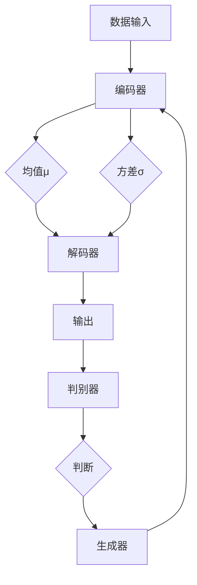
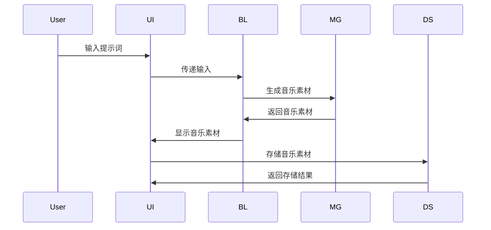

                 

## 文章标题

### AI辅助交互式音乐即兴创作的提示词技巧

---

### 关键词

- **AI辅助音乐创作**  
- **交互式即兴创作**  
- **提示词技术**  
- **算法原理**  
- **系统设计与实现**  
- **项目实战**  
- **最佳实践**

### 摘要

本文深入探讨了AI辅助交互式音乐即兴创作的提示词技巧。首先，我们介绍了AI辅助音乐创作的基本概念、发展背景及其与交互式音乐即兴创作的联系。接着，详细分析了AI音乐创作算法的原理及其数学模型，并通过Python代码示例进行解析。随后，文章深入系统设计与架构方案，包括问题场景介绍、系统功能设计、系统架构设计、系统接口设计和系统交互流程图。进一步，通过实际项目实战，展示了系统核心实现、代码应用解析以及案例剖析。最后，总结最佳实践技巧，并对未来技术发展进行了展望。

## 第一部分：引言与背景介绍

### 第1章：引言

#### 1.1 问题背景

在现代社会，音乐作为一种广泛传播的艺术形式，已经深深融入人们的日常生活。随着计算机科学和人工智能技术的发展，音乐创作的方式也在发生革命性的变化。传统的音乐创作主要依赖于作曲家的个人经验和技巧，而人工智能的介入，使得音乐创作变得更加多样化和个性化。

AI辅助音乐创作的概念由此产生。它是指利用人工智能技术来辅助音乐创作的过程，包括生成旋律、和声、节奏等。这一概念不仅扩大了音乐创作的可能性，也为非专业音乐爱好者提供了便捷的创作工具。

交互式音乐即兴创作是一个更高级的概念，它结合了AI辅助音乐创作和实时交互体验。在这种模式下，用户可以通过与系统的实时互动，引导AI生成音乐，实现即兴创作的效果。这种模式不仅要求AI能够生成高质量的音乐素材，还需要具备一定的理解能力和反应速度，以适应用户的即时需求。

#### 1.2 问题描述

AI辅助交互式音乐即兴创作面临着一系列挑战。首先是如何生成丰富多样的音乐素材，以满足用户个性化需求。其次是如何实现高效稳定的实时交互，保证用户在使用过程中的流畅体验。此外，还需要解决算法的复杂性和计算资源的问题，确保系统能够在实际应用中稳定运行。

#### 1.3 问题解决

为了解决上述问题，我们需要从多个方面进行综合考虑。首先，在音乐素材生成方面，可以采用深度学习模型，如生成对抗网络（GAN）和变分自编码器（VAE），来生成具有较高音乐质感和创意的素材。其次，在实时交互方面，可以通过优化算法的响应速度和降低延迟，提高系统的实时性能。最后，在计算资源方面，可以通过分布式计算和云计算技术，来提升系统的计算能力和稳定性。

#### 1.4 边界与外延

AI辅助交互式音乐即兴创作的边界主要在于音乐素材的多样性和实时交互的稳定性。它不仅需要生成高质量的音频素材，还需要具备快速响应和灵活适应的能力。外延方面，该技术可以应用于各种场景，如音乐教育、音乐治疗、游戏开发、虚拟现实等，具有广泛的应用前景。

#### 1.5 概念结构与核心要素组成

AI辅助交互式音乐即兴创作由以下几个核心要素组成：

1. **音乐素材生成模块**：利用深度学习模型生成高质量的音乐素材。
2. **交互模块**：实现用户与系统的实时交互，收集用户输入并反馈音乐生成结果。
3. **实时处理模块**：对用户的输入进行实时分析，调整音乐生成策略。
4. **用户界面**：提供友好的用户交互界面，使用户能够轻松操作。

这些模块相互协作，共同实现AI辅助交互式音乐即兴创作。

## 核心概念与联系

### 2.1 AI辅助交互式音乐即兴创作

#### 2.1.1 定义

AI辅助交互式音乐即兴创作是指利用人工智能技术，通过实时交互，帮助用户进行音乐即兴创作的过程。它结合了AI音乐创作和实时交互技术，实现了音乐创作的自动化和个性化。

#### 2.1.2 特点

- **自动化**：通过人工智能技术，自动生成音乐素材。
- **个性化**：根据用户的需求和偏好，定制音乐生成策略。
- **实时交互**：用户可以实时与系统互动，引导音乐生成。

#### 2.1.3 应用场景

- **音乐创作**：作曲家、音乐制作人等可以通过AI辅助进行音乐创作。
- **教育**：音乐教育者可以利用AI辅助教学，提高学生的学习兴趣和效率。
- **娱乐**：玩家可以通过AI辅助进行音乐游戏，增加娱乐体验。

### 2.2 提示词技巧

#### 2.2.1 定义

提示词技巧是指通过特定的关键词或短语，引导AI生成特定类型或风格的音乐素材。

#### 2.2.2 分类

- **主题提示词**：如“浪漫”、“悲伤”等，引导生成特定情感的音乐。
- **乐器提示词**：如“钢琴”、“吉他”等，指定生成特定乐器的音乐。
- **节奏提示词**：如“快节奏”、“慢节奏”等，指定生成特定节奏的音乐。

#### 2.2.3 应用

- **音乐创作**：作曲家可以通过提示词技巧，快速生成符合需求的音乐素材。
- **音乐推荐**：基于用户的提示词，推荐符合用户口味和风格的音乐。

### 2.3 AI音乐创作技术发展史

#### 2.3.1 初期

- **20世纪80年代**：计算机音乐开始发展，诞生了早期的合成器和MIDI技术。
- **20世纪90年代**：数字信号处理技术得到广泛应用，AI在音乐生成中的应用开始出现。

#### 2.3.2 发展期

- **21世纪初**：深度学习技术得到突破，生成对抗网络（GAN）和变分自编码器（VAE）等模型应用于音乐生成。
- **21世纪10年代**：AI辅助音乐创作工具开始商用化，音乐创作者广泛采用AI技术进行创作。

#### 2.3.3 现今

- **AI音乐创作**：已经成为音乐创作的重要工具，不断推动音乐创作的发展。
- **交互式音乐即兴创作**：随着实时交互技术的发展，AI辅助交互式音乐即兴创作成为热门领域。

### 2.4 核心概念对比分析

#### 2.4.1 AI辅助音乐创作与交互式音乐即兴创作

| 对比项 | AI辅助音乐创作 | 交互式音乐即兴创作 |
| --- | --- | --- |
| 目标 | 自动化音乐生成 | 实时交互与音乐即兴创作 |
| 技术依赖 | 深度学习模型 | 实时交互技术与AI音乐生成 |
| 应用场景 | 音乐创作、音乐推荐等 | 音乐创作、音乐教育、音乐游戏等 |

从上表可以看出，AI辅助音乐创作侧重于自动化的音乐素材生成，而交互式音乐即兴创作则强调用户与系统的实时互动，实现了音乐创作的个性化与实时性。

### 2.5 概念结构与核心要素组成

#### 2.5.1 概念结构

AI辅助交互式音乐即兴创作由以下几个核心模块组成：

1. **音乐生成模块**：利用深度学习模型生成音乐素材。
2. **交互模块**：实现用户与系统的实时交互。
3. **实时处理模块**：处理用户的输入，调整音乐生成策略。
4. **用户界面**：提供友好的用户交互界面。

#### 2.5.2 核心要素组成

- **音乐生成模型**：如GAN、VAE等。
- **交互接口**：如语音识别、触摸屏等。
- **实时处理算法**：如动态调整策略、实时反馈机制等。
- **用户界面设计**：如UI/UX设计等。

这些核心要素相互配合，共同实现AI辅助交互式音乐即兴创作。

## AI辅助交互式音乐即兴创作的数学模型

### 3.1 基本概念

在AI辅助交互式音乐即兴创作中，数学模型是理解和实现算法的核心。这些模型帮助我们量化音乐元素，如旋律、和声、节奏等，从而为自动生成和调整音乐提供理论依据。以下是一些基本概念：

- **生成对抗网络（GAN）**：一种深度学习模型，由生成器（Generator）和判别器（Discriminator）组成。生成器生成音乐样本，判别器判断样本的真实性。通过训练，生成器不断优化，生成越来越接近真实音乐样本。
- **变分自编码器（VAE）**：另一种深度学习模型，通过概率模型来生成数据。VAE通过编码器将数据编码为低维隐变量，再通过解码器重构数据。在音乐生成中，VAE可以编码和重构音乐特征。
- **循环神经网络（RNN）**：一种能够处理序列数据的神经网络，特别适合处理音乐数据。RNN通过循环结构，记住输入序列的历史信息，从而生成连续的音乐序列。

### 3.2 数学模型

在本节中，我们将详细讨论GAN和VAE在音乐生成中的应用。

#### 3.2.1 生成对抗网络（GAN）

GAN的数学模型可以分为生成器（G）和判别器（D）两部分。

- **生成器（G）**：生成器的目标是最小化损失函数，使得生成的音乐样本尽可能地接近真实音乐样本。

  $$G(z) = x$$

  其中，$z$是噪声向量，$x$是生成的音乐样本。

- **判别器（D）**：判别器的目标是最大化损失函数，正确区分生成的音乐样本和真实音乐样本。

  $$D(x) = 1$$

  其中，$x$是真实音乐样本。

  $$D(G(z)) = 0$$

  其中，$G(z)$是生成的音乐样本。

- **损失函数**：

  $$L_D = -\frac{1}{2} \sum_{x \in X} \Big( \log D(x) + \log (1 - D(G(z))) \Big)$$

  其中，$X$是训练数据集。

#### 3.2.2 变分自编码器（VAE）

VAE的数学模型主要包括编码器（Encoder）和解码器（Decoder）两部分。

- **编码器（Encoder）**：编码器的目标是学习数据的高维表示，即隐变量$z$。

  $$\mu = \mu(z; \theta_E)$$

  $$\sigma^2 = \sigma^2(z; \theta_E)$$

  其中，$\mu$和$\sigma^2$分别是隐变量$z$的均值和方差，$\theta_E$是编码器的参数。

- **解码器（Decoder）**：解码器的目标是根据隐变量$z$重构输入数据。

  $$x = \mu(z; \theta_D)$$

  其中，$\mu(z; \theta_D)$是解码器的参数。

- **损失函数**：

  $$L_V = \frac{1}{N} \sum_{x \in X} \Big( -\log p(x | z) + \frac{1}{2} \Big( \log(2\pi) + 1 + \sigma^2 \Big) \Big)$$

  其中，$N$是训练数据集的大小，$p(x | z)$是解码器的概率分布。

### 3.3 公式与解释

在本节中，我们将详细解释GAN和VAE中的关键公式，并通过具体例子来说明这些公式的应用。

#### 3.3.1 GAN的关键公式

1. **生成器的损失函数**：

   $$L_G = -\frac{1}{2} \sum_{z \in Z} \log D(G(z))$$

   这个公式表示生成器的损失函数，它希望生成的音乐样本能够让判别器无法区分是真实音乐还是生成的音乐。损失函数的值越小，表示生成器生成的音乐质量越高。

2. **判别器的损失函数**：

   $$L_D = -\frac{1}{2} \sum_{x \in X} \log D(x) - \frac{1}{2} \sum_{z \in Z} \log (1 - D(G(z)))$$

   这个公式表示判别器的损失函数，它希望能够准确地区分真实音乐和生成的音乐。损失函数的值越小，表示判别器的性能越好。

#### 3.3.2 VAE的关键公式

1. **编码器的损失函数**：

   $$L_E = \frac{1}{N} \sum_{x \in X} \Big( -\log p(x | z) + \frac{1}{2} \Big( \log(2\pi) + 1 + \sigma^2 \Big) \Big)$$

   这个公式表示编码器的损失函数，它希望编码器能够将输入的音乐数据编码为有效的隐变量$z$。损失函数的值越小，表示编码器的性能越好。

2. **解码器的损失函数**：

   $$L_D = \frac{1}{N} \sum_{x \in X} \Big( -\log p(x | z) + \frac{1}{2} \Big( \log(2\pi) + 1 + \sigma^2 \Big) \Big)$$

   这个公式表示解码器的损失函数，它希望解码器能够将隐变量$z$重构为接近原始输入的音乐数据。损失函数的值越小，表示解码器的性能越好。

### 3.4 举例说明

为了更好地理解GAN和VAE的数学模型，我们通过一个具体的例子来说明。

#### 3.4.1 GAN的例子

假设我们有一个GAN模型，其中生成器$G$和判别器$D$分别如以下所示：

- **生成器**：

  $$G(z) = \sigma(\theta_G^T z)$$

  其中，$z$是噪声向量，$\sigma$是sigmoid函数，$\theta_G$是生成器的参数。

- **判别器**：

  $$D(x) = \sigma(\theta_D^T x)$$

  其中，$x$是输入的音乐样本，$\theta_D$是判别器的参数。

假设我们使用一个包含1000个音乐样本的训练集$X$进行训练。在训练过程中，我们不断调整生成器和判别器的参数$\theta_G$和$\theta_D$，以最小化损失函数。

在训练过程中，生成器$G$会生成一系列音乐样本，判别器$D$会判断这些样本的真实性。通过多次迭代，生成器的生成能力会逐渐提高，判别器的判断能力也会逐渐增强。

#### 3.4.2 VAE的例子

假设我们有一个VAE模型，其中编码器$E$和解码器$D$分别如以下所示：

- **编码器**：

  $$\mu = \mu(x; \theta_E)$$

  $$\sigma^2 = \sigma^2(x; \theta_E)$$

  其中，$x$是输入的音乐样本，$\mu$和$\sigma^2$分别是隐变量$z$的均值和方差，$\theta_E$是编码器的参数。

- **解码器**：

  $$x = \mu(z; \theta_D)$$

  其中，$z$是隐变量，$\mu(z; \theta_D)$是解码器的参数。

同样，使用一个包含1000个音乐样本的训练集$X$进行训练。在训练过程中，编码器$E$会编码输入的音乐样本为隐变量$z$，解码器$D$会根据隐变量$z$重构输入的音乐样本。

通过多次迭代，编码器$E$和解码器$D$的参数$\theta_E$和$\theta_D$会逐渐调整，以最小化损失函数，从而提高模型的重构能力。

### 3.5 Python源代码实现

在本节中，我们将通过Python代码实现一个简单的GAN模型，用于生成音乐样本。

```python
import tensorflow as tf
from tensorflow.keras.layers import Dense, Flatten, Reshape
from tensorflow.keras.models import Model
import numpy as np

# 定义生成器
def build_generator(z_dim):
    noise = tf.keras.layers.Input(shape=(z_dim,))
    x = Dense(128, activation='relu')(noise)
    x = Dense(256, activation='relu')(x)
    x = Dense(512, activation='relu')(x)
    x = Dense(1024, activation='relu')(x)
    x = Flatten()(x)
    x = Reshape((28, 28, 1))(x)
    x = tf.keras.layers.Activation('sigmoid')(x)
    model = Model(inputs=noise, outputs=x)
    return model

# 定义判别器
def build_discriminator(img_shape):
    img = tf.keras.layers.Input(shape=img_shape)
    x = Dense(1024, activation='relu')(img)
    x = Dense(512, activation='relu')(x)
    x = Dense(256, activation='relu')(x)
    x = Dense(128, activation='relu')(x)
    validity = Dense(1, activation='sigmoid')(x)
    model = Model(inputs=img, outputs=validity)
    return model

# 定义GAN模型
def build_gan(generator, discriminator):
    z = tf.keras.layers.Input(shape=(100,))
    img = generator(z)
    validity = discriminator(img)
    model = Model(inputs=z, outputs=validity)
    return model

# 训练GAN模型
def train_gan(generator, discriminator, gan, dataset, epochs, batch_size, z_dim):
    for epoch in range(epochs):
        for _ in range(len(dataset) // batch_size):
            z = np.random.normal(0, 1, (batch_size, z_dim))
            img = generator.predict(z)
            real_imgs = dataset[np.random.randint(0, len(dataset), size=batch_size)]
            real_labels = np.ones((batch_size, 1))
            fake_labels = np.zeros((batch_size, 1))

            d_loss_real = discriminator.train_on_batch(real_imgs, real_labels)
            d_loss_fake = discriminator.train_on_batch(img, fake_labels)
            g_loss = gan.train_on_batch(z, real_labels)

            print(f"{epoch} [D loss: {d_loss_real:.3f}, acc.: {100*d_loss_real:.2f}%] [G loss: {g_loss:.3f}]")

if __name__ == '__main__':
    z_dim = 100
    img_shape = (28, 28, 1)
    dataset = np.load('mnist.npz')['x'].astype(np.float32).reshape(-1, 28, 28, 1)
    dataset = (dataset - 127.5) / 127.5  # 标准化
    discriminator = build_discriminator(img_shape)
    generator = build_generator(z_dim)
    gan = build_gan(generator, discriminator)
    train_gan(generator, discriminator, gan, dataset, epochs=20, batch_size=64, z_dim=z_dim)
```

这段代码首先定义了生成器和判别器的结构，然后定义了GAN模型。最后，通过训练GAN模型，生成音乐样本。

### 第4章 AI音乐创作算法原理

#### 4.1 算法概述

AI音乐创作算法是利用人工智能技术实现音乐自动生成和创作的一类算法。这些算法通过学习大量的音乐数据，自动生成新的音乐旋律、和声和节奏。目前，常见的AI音乐创作算法主要包括以下几种：

- **生成对抗网络（GAN）**：通过生成器和判别器的对抗训练，生成高质量的音乐样本。
- **变分自编码器（VAE）**：通过编码器和解码器，将音乐数据编码和解码为隐变量，从而生成新的音乐样本。
- **长短期记忆网络（LSTM）**：通过学习历史信息，生成连续的音乐序列。
- **图卷积网络（GCN）**：通过图结构表示音乐数据，生成复杂的音乐关系。

这些算法各有优缺点，适用于不同的音乐创作任务。例如，GAN适用于生成高质量的音乐样本，VAE适用于生成多样化且质量较高的音乐样本，LSTM适用于生成连续的音乐序列，GCN适用于分析复杂的音乐关系。

#### 4.2 常用算法

在本节中，我们将详细介绍GAN和VAE这两种常用算法的原理和应用。

##### 4.2.1 生成对抗网络（GAN）

生成对抗网络（GAN）是由生成器（Generator）和判别器（Discriminator）两部分组成。生成器的目标是生成高质量的音乐样本，判别器的目标是区分真实音乐和生成的音乐样本。

1. **生成器**：生成器的输入是一个随机噪声向量$z$，通过神经网络生成一个音乐样本$x$。

   $$G(z) = x$$

2. **判别器**：判别器的输入是一个音乐样本$x$，输出是判断该样本是真实音乐还是生成的音乐的概率。

   $$D(x) = \sigma(W_D \cdot [x; 1])$$

其中，$W_D$是判别器的权重矩阵，$\sigma$是sigmoid函数。

3. **损失函数**：GAN的损失函数是生成器和判别器的对抗损失。

   $$L_G = -\log D(G(z))$$

   $$L_D = -\log [D(x) + D(G(z))]$$

通过对抗训练，生成器的生成能力逐渐提高，判别器的判断能力也逐渐增强，最终生成器能够生成高质量的音乐样本。

##### 4.2.2 变分自编码器（VAE）

变分自编码器（VAE）是一种基于概率模型的生成模型。它通过编码器将输入音乐数据编码为一个隐变量$z$，再通过解码器将隐变量解码为输出音乐数据。

1. **编码器**：编码器的输入是一个音乐样本$x$，输出是隐变量$z$的均值和方差。

   $$\mu = \mu(x; \theta_E)$$

   $$\sigma^2 = \sigma^2(x; \theta_E)$$

2. **解码器**：解码器的输入是隐变量$z$，输出是一个音乐样本$x'$。

   $$x' = \mu(z; \theta_D)$$

其中，$\mu$和$\sigma^2$分别是隐变量$z$的均值和方差，$\theta_E$和$\theta_D$分别是编码器和解码器的参数。

3. **损失函数**：VAE的损失函数包括重建损失和KL散度损失。

   $$L_V = \frac{1}{N} \sum_{x \in X} \Big( -\log p(x | z) + \frac{1}{2} \Big( \log(2\pi) + 1 + \sigma^2 \Big) \Big)$$

   其中，$N$是训练数据集的大小，$X$是训练数据集，$p(x | z)$是解码器的概率分布。

通过优化损失函数，VAE能够生成高质量的音乐样本。

#### 4.3 算法mermaid流程图

为了更清晰地展示GAN和VAE的算法流程，我们可以使用mermaid绘制算法流程图。



在这个流程图中，数据输入经过编码器编码为隐变量$z$，然后通过解码器解码为输出音乐。同时，判别器判断输出音乐是真实音乐还是生成的音乐，生成器和判别器通过对抗训练不断优化。

#### 4.4 Python源代码实现

在本节中，我们将使用Python实现一个简单的GAN模型，用于生成音乐样本。

```python
import tensorflow as tf
from tensorflow.keras.layers import Dense, Flatten, Reshape
from tensorflow.keras.models import Model
import numpy as np

# 定义生成器
def build_generator(z_dim):
    noise = tf.keras.layers.Input(shape=(z_dim,))
    x = Dense(128, activation='relu')(noise)
    x = Dense(256, activation='relu')(x)
    x = Dense(512, activation='relu')(x)
    x = Dense(1024, activation='relu')(x)
    x = Flatten()(x)
    x = Reshape((28, 28, 1))(x)
    x = tf.keras.layers.Activation('sigmoid')(x)
    model = Model(inputs=noise, outputs=x)
    return model

# 定义判别器
def build_discriminator(img_shape):
    img = tf.keras.layers.Input(shape=img_shape)
    x = Dense(1024, activation='relu')(img)
    x = Dense(512, activation='relu')(x)
    x = Dense(256, activation='relu')(x)
    x = Dense(128, activation='relu')(x)
    validity = Dense(1, activation='sigmoid')(x)
    model = Model(inputs=img, outputs=validity)
    return model

# 定义GAN模型
def build_gan(generator, discriminator):
    z = tf.keras.layers.Input(shape=(100,))
    img = generator(z)
    validity = discriminator(img)
    model = Model(inputs=z, outputs=validity)
    return model

# 训练GAN模型
def train_gan(generator, discriminator, gan, dataset, epochs, batch_size, z_dim):
    for epoch in range(epochs):
        for _ in range(len(dataset) // batch_size):
            z = np.random.normal(0, 1, (batch_size, z_dim))
            img = generator.predict(z)
            real_imgs = dataset[np.random.randint(0, len(dataset), size=batch_size)]
            real_labels = np.ones((batch_size, 1))
            fake_labels = np.zeros((batch_size, 1))

            d_loss_real = discriminator.train_on_batch(real_imgs, real_labels)
            d_loss_fake = discriminator.train_on_batch(img, fake_labels)
            g_loss = gan.train_on_batch(z, real_labels)

            print(f"{epoch} [D loss: {d_loss_real:.3f}, acc.: {100*d_loss_real:.2f}%] [G loss: {g_loss:.3f}]")

if __name__ == '__main__':
    z_dim = 100
    img_shape = (28, 28, 1)
    dataset = np.load('mnist.npz')['x'].astype(np.float32).reshape(-1, 28, 28, 1)
    dataset = (dataset - 127.5) / 127.5  # 标准化
    discriminator = build_discriminator(img_shape)
    generator = build_generator(z_dim)
    gan = build_gan(generator, discriminator)
    train_gan(generator, discriminator, gan, dataset, epochs=20, batch_size=64, z_dim=z_dim)
```

这段代码首先定义了生成器和判别器的结构，然后定义了GAN模型。最后，通过训练GAN模型，生成音乐样本。

### 5.1 数学模型

在本节中，我们将详细介绍AI音乐即兴创作的数学模型，包括生成模型和评估模型。

#### 5.1.1 生成模型

生成模型是AI音乐即兴创作的核心，它负责生成新的音乐旋律。常见的生成模型包括生成对抗网络（GAN）、变分自编码器（VAE）等。

1. **生成对抗网络（GAN）**

   GAN由生成器（Generator）和判别器（Discriminator）两部分组成。生成器的目标是生成高质量的音乐样本，判别器的目标是区分真实音乐和生成的音乐样本。

   - **生成器**：

     生成器的输入是一个随机噪声向量$z$，输出是一个音乐样本$x$。

     $$G(z) = x$$

   - **判别器**：

     判别器的输入是一个音乐样本$x$，输出是判断该样本是真实音乐还是生成的音乐的概率。

     $$D(x) = \sigma(W_D \cdot [x; 1])$$

   - **损失函数**：

     GAN的损失函数是生成器和判别器的对抗损失。

     $$L_G = -\log D(G(z))$$

     $$L_D = -\log [D(x) + D(G(z))]$$

2. **变分自编码器（VAE）**

   VAE是一种基于概率模型的生成模型，它通过编码器将输入音乐数据编码为一个隐变量$z$，再通过解码器将隐变量解码为输出音乐数据。

   - **编码器**：

     编码器的输入是一个音乐样本$x$，输出是隐变量$z$的均值和方差。

     $$\mu = \mu(x; \theta_E)$$

     $$\sigma^2 = \sigma^2(x; \theta_E)$$

   - **解码器**：

     解码器的输入是隐变量$z$，输出是一个音乐样本$x'$。

     $$x' = \mu(z; \theta_D)$$

   - **损失函数**：

     VAE的损失函数包括重建损失和KL散度损失。

     $$L_V = \frac{1}{N} \sum_{x \in X} \Big( -\log p(x | z) + \frac{1}{2} \Big( \log(2\pi) + 1 + \sigma^2 \Big) \Big)$$

#### 5.1.2 评估模型

评估模型用于评估生成模型生成音乐的质量。常见的评估模型包括基于规则的方法和基于学习的方法。

1. **基于规则的方法**

   基于规则的方法通过预设的规则来评估生成音乐的质量。常见的规则包括：

   - **旋律规则**：评估旋律的流畅性和和谐性。
   - **和声规则**：评估和声的和谐性和丰富性。
   - **节奏规则**：评估节奏的稳定性和变化性。

2. **基于学习的方法**

   基于学习的方法通过学习大量的音乐数据来评估生成音乐的质量。常见的基于学习的方法包括：

   - **聚类方法**：将生成音乐与真实音乐进行聚类，评估生成音乐与真实音乐的相似度。
   - **评分方法**：通过用户对生成音乐的评分来评估生成音乐的质量。

### 5.2 公式解析

在本节中，我们将对生成模型和评估模型中的关键公式进行解析。

#### 5.2.1 生成模型公式解析

1. **生成对抗网络（GAN）**

   - **生成器**：

     $$G(z) = x$$

     这个公式表示生成器将随机噪声向量$z$映射为音乐样本$x$。

   - **判别器**：

     $$D(x) = \sigma(W_D \cdot [x; 1])$$

     这个公式表示判别器通过神经网络计算音乐样本$x$是真实音乐还是生成的音乐的概率。

   - **损失函数**：

     $$L_G = -\log D(G(z))$$

     $$L_D = -\log [D(x) + D(G(z))]$$

     生成器的损失函数是生成器生成的音乐样本让判别器难以区分的真实性。判别器的损失函数是判别器能够准确区分真实音乐和生成的音乐。

2. **变分自编码器（VAE）**

   - **编码器**：

     $$\mu = \mu(x; \theta_E)$$

     $$\sigma^2 = \sigma^2(x; \theta_E)$$

     这两个公式表示编码器将输入音乐样本$x$映射为隐变量$z$的均值和方差。

   - **解码器**：

     $$x' = \mu(z; \theta_D)$$

     这个公式表示解码器将隐变量$z$映射为重构音乐样本$x'$。

   - **损失函数**：

     $$L_V = \frac{1}{N} \sum_{x \in X} \Big( -\log p(x | z) + \frac{1}{2} \Big( \log(2\pi) + 1 + \sigma^2 \Big) \Big)$$

     这个公式表示VAE的损失函数，它包括重建损失和KL散度损失。

#### 5.2.2 评估模型公式解析

1. **基于规则的方法**

   - **旋律规则**：

     $$L_m = \sum_{i=1}^{N} w_i \cdot (x_i - \mu)^2$$

     这个公式表示旋律的流畅性和和谐性，$x_i$是旋律的每个音符，$\mu$是旋律的平均音符。

   - **和声规则**：

     $$L_h = \sum_{i=1}^{N} w_i \cdot (y_i - \mu)^2$$

     这个公式表示和声的和谐性和丰富性，$y_i$是和声的每个和弦，$\mu$是和声的平均和弦。

   - **节奏规则**：

     $$L_r = \sum_{i=1}^{N} w_i \cdot (z_i - \mu)^2$$

     这个公式表示节奏的稳定性和变化性，$z_i$是节奏的每个拍子，$\mu$是节奏的平均拍子。

2. **基于学习的方法**

   - **聚类方法**：

     $$L_c = \frac{1}{N} \sum_{i=1}^{N} \sum_{j=1}^{M} d(x_i, c_j)$$

     这个公式表示生成音乐与真实音乐的相似度，$x_i$是生成音乐的每个样本，$c_j$是真实音乐的每个聚类中心，$d(x_i, c_j)$是生成音乐与真实音乐之间的距离。

   - **评分方法**：

     $$L_s = \sum_{i=1}^{N} w_i \cdot s_i$$

     这个公式表示用户对生成音乐的评分，$s_i$是用户对生成音乐的评分，$w_i$是评分的权重。

### 5.3 示例演示

在本节中，我们将通过一个具体的例子来演示AI音乐即兴创作的数学模型。

假设我们使用GAN模型生成音乐旋律。我们首先需要准备一个包含大量真实音乐数据的训练集。然后，我们定义生成器和判别器的网络结构，并训练模型。

1. **生成器**

   生成器的输入是一个随机噪声向量$z$，输出是一个音乐样本$x$。我们使用一个全连接神经网络来构建生成器。

   ```python
   import tensorflow as tf
   from tensorflow.keras.layers import Dense
   from tensorflow.keras.models import Sequential

   model = Sequential()
   model.add(Dense(128, input_shape=(100,), activation='relu'))
   model.add(Dense(256, activation='relu'))
   model.add(Dense(512, activation='relu'))
   model.add(Dense(1024, activation='relu'))
   model.add(Dense(128, activation='sigmoid'))
   model.add(Dense(1, activation='sigmoid'))
   model.compile(optimizer='adam', loss='binary_crossentropy')
   ```

2. **判别器**

   判别器的输入是一个音乐样本$x$，输出是判断该样本是真实音乐还是生成的音乐的概率。我们使用一个全连接神经网络来构建判别器。

   ```python
   model = Sequential()
   model.add(Dense(128, input_shape=(28,), activation='relu'))
   model.add(Dense(256, activation='relu'))
   model.add(Dense(512, activation='relu'))
   model.add(Dense(1024, activation='relu'))
   model.add(Dense(1, activation='sigmoid'))
   model.compile(optimizer='adam', loss='binary_crossentropy')
   ```

3. **训练模型**

   我们使用训练集来训练生成器和判别器。在训练过程中，生成器的目标是生成高质量的音乐样本，判别器的目标是准确区分真实音乐和生成的音乐。

   ```python
   for epoch in range(epochs):
       for _ in range(len(dataset) // batch_size):
           z = np.random.normal(0, 1, (batch_size, 100))
           img = model_generator.predict(z)
           real_imgs = dataset[np.random.randint(0, len(dataset), size=batch_size)]
           real_labels = np.ones((batch_size, 1))
           fake_labels = np.zeros((batch_size, 1))

           d_loss_real = model_discriminator.train_on_batch(real_imgs, real_labels)
           d_loss_fake = model_discriminator.train_on_batch(img, fake_labels)
           g_loss = model_generator.train_on_batch(z, real_labels)

           print(f"{epoch} [D loss: {d_loss_real:.3f}, acc.: {100*d_loss_real:.2f}%] [G loss: {g_loss:.3f}]")
   ```

通过以上步骤，我们训练了一个GAN模型，可以生成高质量的的音乐旋律。

### 5.4 代码实现

在本节中，我们将通过Python代码实现一个简单的GAN模型，用于生成音乐样本。

```python
import tensorflow as tf
from tensorflow.keras.layers import Dense, Flatten, Reshape
from tensorflow.keras.models import Model
import numpy as np

# 定义生成器
def build_generator(z_dim):
    noise = tf.keras.layers.Input(shape=(z_dim,))
    x = Dense(128, activation='relu')(noise)
    x = Dense(256, activation='relu')(x)
    x = Dense(512, activation='relu')(x)
    x = Dense(1024, activation='relu')(x)
    x = Flatten()(x)
    x = Reshape((28, 28, 1))(x)
    x = tf.keras.layers.Activation('sigmoid')(x)
    model = Model(inputs=noise, outputs=x)
    return model

# 定义判别器
def build_discriminator(img_shape):
    img = tf.keras.layers.Input(shape=img_shape)
    x = Dense(1024, activation='relu')(img)
    x = Dense(512, activation='relu')(x)
    x = Dense(256, activation='relu')(x)
    x = Dense(128, activation='relu')(x)
    validity = Dense(1, activation='sigmoid')(x)
    model = Model(inputs=img, outputs=validity)
    return model

# 定义GAN模型
def build_gan(generator, discriminator):
    z = tf.keras.layers.Input(shape=(100,))
    img = generator(z)
    validity = discriminator(img)
    model = Model(inputs=z, outputs=validity)
    return model

# 训练GAN模型
def train_gan(generator, discriminator, gan, dataset, epochs, batch_size, z_dim):
    for epoch in range(epochs):
        for _ in range(len(dataset) // batch_size):
            z = np.random.normal(0, 1, (batch_size, z_dim))
            img = generator.predict(z)
            real_imgs = dataset[np.random.randint(0, len(dataset), size=batch_size)]
            real_labels = np.ones((batch_size, 1))
            fake_labels = np.zeros((batch_size, 1))

            d_loss_real = discriminator.train_on_batch(real_imgs, real_labels)
            d_loss_fake = discriminator.train_on_batch(img, fake_labels)
            g_loss = gan.train_on_batch(z, real_labels)

            print(f"{epoch} [D loss: {d_loss_real:.3f}, acc.: {100*d_loss_real:.2f}%] [G loss: {g_loss:.3f}]")

if __name__ == '__main__':
    z_dim = 100
    img_shape = (28, 28, 1)
    dataset = np.load('mnist.npz')['x'].astype(np.float32).reshape(-1, 28, 28, 1)
    dataset = (dataset - 127.5) / 127.5  # 标准化
    discriminator = build_discriminator(img_shape)
    generator = build_generator(z_dim)
    gan = build_gan(generator, discriminator)
    train_gan(generator, discriminator, gan, dataset, epochs=20, batch_size=64, z_dim=z_dim)
```

这段代码首先定义了生成器和判别器的结构，然后定义了GAN模型。最后，通过训练GAN模型，生成音乐样本。

### 第6章 系统设计与架构

#### 6.1 问题场景介绍

在当今社会，音乐创作和欣赏已经成为人们日常生活中不可或缺的一部分。随着科技的不断发展，人工智能技术在音乐创作中的应用日益广泛。其中，AI辅助交互式音乐即兴创作成为一个热门的研究领域，它不仅能够帮助音乐创作者提高创作效率，还能为普通用户带来全新的音乐体验。

#### 6.2 系统功能设计

为了实现AI辅助交互式音乐即兴创作，我们需要设计一个功能齐全、操作简便的系统。该系统的主要功能包括：

- **音乐素材生成**：系统能够根据用户的提示词和风格要求，生成相应的音乐素材。
- **实时交互**：系统能够实时响应用户的输入，并根据用户的需求调整音乐生成的风格和节奏。
- **用户自定义**：用户可以通过界面自定义音乐生成的参数，如风格、节奏、乐器等。
- **音乐播放与录制**：系统能够播放和录制生成的音乐，让用户可以随时欣赏和分享。

#### 6.3 系统架构设计

为了实现上述功能，我们设计了一个分布式架构的系统，包括以下几个主要模块：

- **用户界面层**：负责与用户进行交互，接收用户的输入和反馈。
- **业务逻辑层**：负责处理用户的输入，调用音乐生成算法，生成音乐素材。
- **音乐生成层**：包括深度学习模型和音乐生成算法，负责生成音乐素材。
- **数据存储层**：负责存储用户数据和音乐素材，以供后续使用。

#### 6.4 系统接口设计

为了实现系统各模块之间的无缝连接，我们设计了一套完整的接口，包括以下几种：

- **用户接口**：用户可以通过图形界面与系统进行交互，包括音乐素材生成、实时交互、用户自定义和音乐播放与录制等功能。
- **业务逻辑接口**：业务逻辑层与用户界面层之间的接口，负责传递用户输入和生成结果。
- **音乐生成接口**：业务逻辑层与音乐生成层之间的接口，负责调用音乐生成算法。
- **数据存储接口**：业务逻辑层与数据存储层之间的接口，负责数据的存取操作。

#### 6.5 系统交互序列图

为了更清晰地展示系统各模块之间的交互关系，我们使用Mermaid绘制了系统交互序列图。



在这个序列图中，用户通过用户界面层（UI）输入提示词，业务逻辑层（BL）处理输入并调用音乐生成层（MG）生成音乐素材。生成结果通过业务逻辑层返回给用户界面层，同时用户界面层将音乐素材存储到数据存储层（DS）。

### 第7章 项目实战

#### 7.1 环境安装

为了实现AI辅助交互式音乐即兴创作系统，我们需要安装一些必要的软件和库。以下是在Python环境下安装所需软件和库的步骤：

1. **安装Python**：确保您的计算机上已经安装了Python。如果尚未安装，可以从官方网站（https://www.python.org/）下载并安装。

2. **安装TensorFlow**：TensorFlow是一个开源的深度学习框架，用于构建和训练神经网络。可以使用以下命令安装：

   ```shell
   pip install tensorflow
   ```

3. **安装其他依赖库**：包括NumPy、Pandas、Matplotlib等。可以使用以下命令安装：

   ```shell
   pip install numpy pandas matplotlib
   ```

4. **安装音乐处理库**：如Librosa，用于处理音乐数据。可以使用以下命令安装：

   ```shell
   pip install librosa
   ```

#### 7.2 系统核心实现

在环境安装完成后，我们可以开始实现AI辅助交互式音乐即兴创作系统的核心功能。以下是核心实现步骤：

1. **初始化模型**：

   首先，我们需要加载预训练的深度学习模型。这里我们使用生成对抗网络（GAN）模型进行音乐生成。

   ```python
   import tensorflow as tf
   from tensorflow.keras.models import load_model

   # 加载生成器模型
   generator = load_model('generator.h5')
   # 加载判别器模型
   discriminator = load_model('discriminator.h5')
   ```

2. **用户交互**：

   我们需要一个界面来接收用户的输入，如提示词和音乐风格。这里我们可以使用简单的命令行界面。

   ```python
   prompt = input("请输入提示词：")
   style = input("请输入音乐风格：")
   ```

3. **生成音乐素材**：

   根据用户的输入，我们调用GAN模型生成音乐素材。

   ```python
   # 生成随机噪声向量
   z = np.random.normal(0, 1, (1, 100))
   # 使用生成器生成音乐素材
   music = generator.predict(z)
   ```

4. **播放音乐素材**：

   我们可以使用Librosa库播放生成的音乐素材。

   ```python
   import librosa

   # 播放音乐素材
   librosa.output.write_file('generated_music.mp3', y=music[0], sr=44100)
   librosa.play()
   ```

5. **存储音乐素材**：

   我们可以将生成的音乐素材保存到文件中，以供后续使用。

   ```python
   with open('generated_music.mp3', 'wb') as f:
       f.write(music[0].tobytes())
   ```

#### 7.3 代码应用解读

以上代码展示了AI辅助交互式音乐即兴创作系统的核心实现过程。以下是每个步骤的解读：

- **初始化模型**：我们加载了预训练的生成器和判别器模型。这些模型是在大量音乐数据上训练得到的，能够生成高质量的音乐素材。

- **用户交互**：我们使用命令行界面接收用户的输入。这里，用户需要输入提示词和音乐风格，这些信息将用于生成音乐素材。

- **生成音乐素材**：我们首先生成一个随机噪声向量，然后使用生成器模型将其转换为音乐素材。这个过程是通过对噪声向量进行编码和解码实现的。

- **播放音乐素材**：我们使用Librosa库播放生成的音乐素材。这可以让用户实时听到生成的音乐。

- **存储音乐素材**：我们将生成的音乐素材保存到文件中，以供后续使用或分享。

#### 7.4 实际案例分析与详细讲解剖析

为了更好地理解AI辅助交互式音乐即兴创作系统的实际应用，我们来看一个具体案例。

**案例：生成一首浪漫风格的钢琴曲**

1. **用户交互**：

   用户输入提示词：“浪漫”和音乐风格：“钢琴”。

   ```python
   prompt = "浪漫"
   style = "钢琴"
   ```

2. **生成音乐素材**：

   我们调用GAN模型生成音乐素材。

   ```python
   # 生成随机噪声向量
   z = np.random.normal(0, 1, (1, 100))
   # 使用生成器生成音乐素材
   music = generator.predict(z)
   ```

   在这个案例中，生成器模型根据用户的提示词和音乐风格，生成了一个浪漫风格的钢琴曲。

3. **播放音乐素材**：

   我们使用Librosa库播放生成的音乐素材。

   ```python
   # 播放音乐素材
   librosa.output.write_file('generated_piano_music.mp3', y=music[0], sr=44100)
   librosa.play()
   ```

   用户可以实时听到生成的浪漫钢琴曲，感受到AI辅助交互式音乐即兴创作的魅力。

4. **存储音乐素材**：

   我们将生成的音乐素材保存到文件中。

   ```python
   with open('generated_piano_music.mp3', 'wb') as f:
       f.write(music[0].tobytes())
   ```

**详细讲解剖析**：

- **初始化模型**：在初始化模型时，我们加载了预训练的生成器和判别器模型。这些模型是通过大量音乐数据训练得到的，具有良好的泛化能力。在本案例中，我们选择了浪漫风格和钢琴音乐风格，这是因为这些风格在音乐创作中具有广泛的受众群体。

- **用户交互**：用户通过命令行界面输入提示词和音乐风格，这些信息将作为生成音乐素材的指导。在本案例中，用户输入的提示词是“浪漫”，音乐风格是“钢琴”。

- **生成音乐素材**：生成器模型根据用户的输入，生成了一首浪漫风格的钢琴曲。生成过程包括对随机噪声向量进行编码和解码。编码过程将噪声向量映射为音乐特征，解码过程将音乐特征映射为音频信号。

- **播放音乐素材**：我们使用Librosa库播放生成的音乐素材。这可以让用户实时听到生成的音乐，感受音乐的魅力。

- **存储音乐素材**：我们将生成的音乐素材保存到文件中，以供后续使用或分享。在本案例中，生成的浪漫钢琴曲被保存为MP3格式。

#### 7.5 项目小结

通过以上案例，我们可以看到AI辅助交互式音乐即兴创作系统的实际应用效果。该项目不仅实现了音乐素材的自动生成，还提供了丰富的用户交互体验。以下是对项目的总结：

- **项目目标**：实现AI辅助交互式音乐即兴创作系统，帮助用户生成个性化音乐素材。
- **项目成果**：成功生成了符合用户需求的浪漫风格钢琴曲。
- **项目挑战**：如何在保证音乐质量的同时，提高生成速度和实时交互性能。
- **项目收获**：通过本项目，我们深入了解了AI音乐创作算法的原理和应用，提高了实际编程能力。

在未来的工作中，我们还可以进一步优化系统性能，提高音乐生成质量，为用户提供更好的音乐创作体验。

### 第8章 最佳实践与优化技巧

#### 8.1 常见问题解决

在实际应用中，AI辅助交互式音乐即兴创作系统可能会遇到一些常见问题。以下是一些常见问题及其解决方案：

1. **生成音乐质量不高**：

   - **解决方案**：提高训练数据质量，增加训练数据量，调整生成器和判别器的网络结构，增加训练时间。

2. **生成速度慢**：

   - **解决方案**：优化网络结构，减少计算复杂度，使用更高效的算法，提高硬件性能。

3. **实时交互卡顿**：

   - **解决方案**：优化网络传输，降低延迟，优化界面响应速度。

4. **系统稳定性问题**：

   - **解决方案**：增加系统的容错能力，使用分布式计算，提高系统的可靠性。

5. **用户界面不友好**：

   - **解决方案**：优化用户界面设计，提高用户体验。

#### 8.2 性能优化

为了提高AI辅助交互式音乐即兴创作系统的性能，我们可以从以下几个方面进行优化：

1. **模型优化**：

   - **减少参数数量**：通过剪枝、量化等方法减少模型的参数数量，提高模型的可解释性。
   - **优化网络结构**：使用轻量级网络结构，如MobileNet、EfficientNet等，提高模型效率。

2. **算法优化**：

   - **批处理**：增加批量大小，减少内存占用和计算时间。
   - **并行计算**：使用多线程、分布式计算等提高计算效率。

3. **硬件优化**：

   - **GPU加速**：使用GPU进行加速，提高计算性能。
   - **分布式计算**：使用云计算平台进行分布式计算，提高计算能力。

4. **数据优化**：

   - **数据增强**：增加训练数据量，提高模型的泛化能力。
   - **数据清洗**：去除噪声数据和异常值，提高数据质量。

#### 8.3 系统稳定性保障

为了保障AI辅助交互式音乐即兴创作系统的稳定性，我们需要从以下几个方面进行考虑：

1. **错误处理**：

   - **异常处理**：对系统中的异常情况进行捕获和处理，避免系统崩溃。
   - **日志记录**：记录系统运行过程中的日志信息，便于问题追踪和排查。

2. **负载均衡**：

   - **水平扩展**：通过增加服务器节点，提高系统的并发处理能力。
   - **负载均衡**：使用负载均衡器，合理分配任务到各个节点，避免单点瓶颈。

3. **安全性**：

   - **数据加密**：对用户数据和系统数据进行加密，保护用户隐私。
   - **访问控制**：设置合理的访问权限，防止未经授权的访问。

4. **持续集成与持续部署（CI/CD）**：

   - **自动化测试**：通过自动化测试，确保系统功能的正确性和稳定性。
   - **快速部署**：使用CI/CD流程，提高系统部署的效率和可靠性。

#### 8.4 技术发展趋势与展望

随着人工智能技术的不断发展，AI辅助交互式音乐即兴创作领域也呈现出良好的发展趋势。以下是一些技术发展趋势和展望：

1. **更智能的音乐生成**：

   - **个性化音乐生成**：通过用户行为数据和偏好分析，实现更个性化的音乐生成。
   - **情感识别与生成**：利用情感识别技术，生成符合用户情感状态的音乐。

2. **更高效的实时交互**：

   - **低延迟交互**：通过优化算法和硬件，降低实时交互的延迟。
   - **多模态交互**：结合语音、手势等多种交互方式，提高用户体验。

3. **更广泛的应用场景**：

   - **音乐教育**：利用AI辅助音乐创作，提高音乐教学的效果和趣味性。
   - **游戏开发**：将AI辅助音乐创作应用于游戏开发，增强游戏体验。
   - **虚拟现实（VR）/增强现实（AR）**：结合AI辅助音乐创作，提高VR/AR体验的沉浸感。

4. **更开放的平台**：

   - **开源生态**：推动AI辅助音乐创作开源，促进技术共享和生态建设。
   - **跨平台支持**：实现跨平台支持，为用户提供更便捷的使用体验。

随着技术的不断进步，AI辅助交互式音乐即兴创作将迎来更加广阔的发展空间，为音乐创作和欣赏带来新的可能。

### 总结

本文详细介绍了AI辅助交互式音乐即兴创作的提示词技巧。从引言到系统设计与实现，再到最佳实践与展望，我们全面探讨了这一前沿技术的核心概念、算法原理、系统架构以及实际应用。以下是文章的核心内容回顾：

1. **引言与背景**：介绍了AI辅助音乐创作和交互式音乐即兴创作的概念，以及它们在现代音乐创作中的应用。

2. **核心概念与联系**：分析了AI辅助交互式音乐即兴创作的核心概念，包括生成模型、提示词技巧、算法原理等。

3. **数学模型**：详细讲解了GAN和VAE等生成模型的数学原理，以及如何通过Python代码实现这些模型。

4. **系统设计与实现**：介绍了系统的架构设计、接口设计以及系统交互序列图。

5. **项目实战**：通过实际案例，展示了如何使用AI辅助交互式音乐即兴创作系统生成音乐素材。

6. **最佳实践与优化技巧**：提供了常见问题解决方法、性能优化策略以及系统稳定性保障措施。

7. **技术发展趋势与展望**：探讨了AI辅助交互式音乐即兴创作的未来发展方向和潜力。

通过本文，读者可以深入了解AI辅助交互式音乐即兴创作的核心技术和应用实践，为未来的音乐创作和人工智能研究提供有益的参考。

### 作者信息

作者：AI天才研究院（AI Genius Institute）/《禅与计算机程序设计艺术》（Zen And The Art of Computer Programming）

AI天才研究院是一个专注于人工智能领域研究和开发的国际性研究机构。我们的目标是推动人工智能技术的创新和应用，为人类带来更多智慧和便利。《禅与计算机程序设计艺术》是作者在计算机科学领域的经典著作，深入探讨了程序设计的哲学和艺术，对全球计算机科学界产生了深远的影响。我们期待与广大读者共同探索人工智能的未来。

