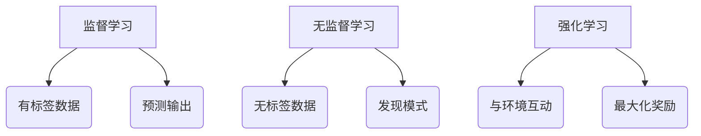
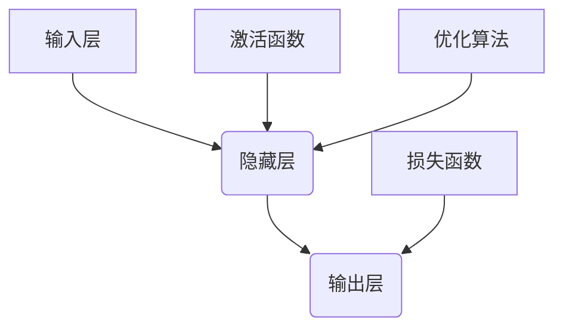

                 

# 《AI辅助产品设计：提示词激发创新思维》

## 关键词

- AI 辅助产品设计
- 提示词
- 创新思维
- 机器学习
- 深度学习
- 用户研究
- 需求分析
- 原型设计
- 优化

## 摘要

本文旨在探讨 AI 辅助产品设计的潜力，以及如何利用提示词激发创新思维。文章首先介绍了 AI 在产品设计中的应用背景和提示词的作用，随后详细阐述了 AI 的核心概念与工具，包括机器学习和深度学习。接着，文章探讨了 AI 辅助产品设计在用户研究、需求分析、市场调研和产品设计过程中的应用，并通过实践案例展示了 AI 的具体应用场景和效果。最后，文章总结了 AI 辅助产品设计的最佳实践，并展望了未来的发展趋势。

## 目录大纲

```markdown
# 《AI辅助产品设计：提示词激发创新思维》

## 第一部分：AI辅助产品设计基础

## 第1章：AI与产品设计的概述

### 1.1 AI在产品设计中的应用背景

### 1.2 提示词在产品设计中的作用

### 1.3 AI辅助产品设计的挑战与机遇

## 第2章：AI核心概念与工具

### 2.1 机器学习基础

### 2.2 深度学习原理

### 2.3 人工智能工具与应用

## 第二部分：AI辅助产品设计的应用场景

## 第3章：用户研究中的AI辅助

### 3.1 用户调研中的AI应用

### 3.2 AI在用户画像与细分中的应用

### 3.3 AI在用户反馈分析中的应用

## 第4章：需求分析与市场调研

### 4.1 AI在需求分析中的应用

### 4.2 AI在市场调研中的应用

### 4.3 基于AI的市场预测与分析

## 第5章：产品设计过程中的AI辅助

### 5.1 AI在概念验证中的应用

### 5.2 AI在原型设计中的应用

### 5.3 AI在产品设计优化中的应用

## 第三部分：AI辅助产品设计的实践案例

## 第6章：案例研究1 - 产品设计中的AI应用

### 6.1 项目背景

### 6.2 AI工具选择

### 6.3 AI在项目中的应用

### 6.4 项目成果与反思

## 第7章：案例研究2 - AI在产品设计中的创新应用

### 7.1 项目背景

### 7.2 AI工具选择

### 7.3 AI在项目中的应用

### 7.4 项目成果与反思

## 第8章：AI辅助产品设计的最佳实践

### 8.1 AI辅助产品设计的方法论

### 8.2 AI工具与技术的选型

### 8.3 AI辅助产品设计的风险与挑战

## 第9章：未来展望与总结

### 9.1 AI辅助产品设计的未来趋势

### 9.2 AI在产品设计中的潜在挑战

### 9.3 总结与展望
```

## 1. AI与产品设计的概述

### 1.1 AI在产品设计中的应用背景

随着人工智能技术的飞速发展，AI 在各个领域的应用越来越广泛，产品设计领域也不例外。在过去的几十年里，设计师们主要依赖于自己的经验和直觉来创造优秀的作品。然而，随着产品的复杂性增加和市场竞争的加剧，单凭个人经验和直觉已经无法满足日益增长的需求。AI 的出现为产品设计带来了新的可能性，使得设计师们能够更高效地创造出创新和用户满意的产品。

首先，AI 能够处理和分析大量的数据，为设计师提供宝贵的洞察。通过用户行为分析、市场调研和用户反馈，AI 可以识别出用户的需求和偏好，帮助设计师更好地了解用户，从而创造出更符合用户期望的产品。

其次，AI 能够自动化和优化设计流程。例如，通过机器学习和深度学习技术，AI 可以自动生成设计方案，节省设计师的时间和精力。此外，AI 还可以帮助设计师优化产品原型，通过模拟用户交互和测试，快速发现和修复设计中的问题。

最后，AI 为设计师提供了更多的创意灵感。通过生成对抗网络（GAN）等技术，AI 可以生成出多样化的设计概念，激发设计师的创意思维，帮助他们在设计过程中打破常规，创造出独特的产品。

### 1.2 提示词在产品设计中的作用

提示词（Prompt）是 AI 辅助产品设计中的一个关键概念。提示词是指一组关键词或短语，用于引导 AI 模型生成相关的输出。在产品设计过程中，提示词的作用主要体现在以下几个方面：

首先，提示词可以帮助 AI 模型理解设计目标和需求。在设计阶段，设计师通常会有一系列的设计目标和需求，例如产品的功能、用户体验、设计风格等。通过提示词，AI 可以将这些目标和需求转化为具体的输入，从而生成符合要求的设计方案。

其次，提示词可以激发 AI 的创造力。在设计中，创意是非常重要的。通过提供具有启发性的提示词，AI 可以生成出新颖、独特的设计概念，帮助设计师拓宽思维，突破传统的限制。

最后，提示词可以提高 AI 生成设计的效率。在传统的设计过程中，设计师需要花费大量的时间和精力来思考和研究设计方案。而通过提示词，AI 可以快速地生成多个设计方案，设计师只需从中筛选和优化即可，大大提高了设计的效率。

### 1.3 AI辅助产品设计的挑战与机遇

虽然 AI 在产品设计中有巨大的潜力，但也面临着一些挑战和机遇。

#### 挑战

首先，AI 需要大量的数据和计算资源。为了训练和优化 AI 模型，需要收集大量的用户数据和市场数据，并进行复杂的计算。这可能会带来数据隐私和安全问题，需要谨慎处理。

其次，AI 的设计结果可能无法完全满足设计师的需求。尽管 AI 能够生成新颖的设计方案，但它们可能无法完全理解人类设计师的意图和创造力。因此，设计师需要参与其中，对 AI 生成的设计方案进行评估和优化。

最后，AI 的设计过程可能缺乏透明度和可解释性。AI 模型通常是由复杂的算法和数据组成的，对于非专业人士来说，理解其工作原理可能比较困难。这可能会对设计师和用户产生疑虑，需要加强对 AI 设计过程的解释和沟通。

#### 机遇

然而，挑战也伴随着机遇。首先，AI 的引入可以大大提高设计的效率和质量。通过自动化和优化设计流程，设计师可以节省大量的时间和精力，专注于更重要的创意和策略工作。

其次，AI 可以帮助设计师拓宽思维，激发创造力。通过与 AI 合作，设计师可以接触到更多的新颖设计概念和技术，从而创造出更加独特和有创意的产品。

最后，AI 可以帮助设计师更好地理解用户需求和市场趋势。通过分析大量的用户数据和市场数据，AI 可以提供宝贵的洞察，帮助设计师更好地定位产品，满足用户需求，提高市场竞争力。

总之，AI 辅助产品设计是一个充满机遇和挑战的领域。通过合理利用 AI 技术，设计师可以创造出更优秀、更符合用户需求的产品，推动设计行业的创新发展。

## 2. AI核心概念与工具

### 2.1 机器学习基础

机器学习（Machine Learning）是人工智能（AI）的核心技术之一，它使计算机系统能够从数据中自动学习和改进，而无需显式编程。在产品设计过程中，机器学习技术可以帮助设计师识别用户需求、优化设计流程、提高设计质量。

#### 核心概念

机器学习可以分为监督学习、无监督学习和强化学习三种类型：

1. **监督学习**：在这种方法中，模型通过训练数据集进行学习，这些数据集包括输入特征和相应的输出标签。常见的算法有线性回归、逻辑回归、支持向量机（SVM）和决策树等。

2. **无监督学习**：这种方法中，模型从无标签的数据中进行学习，目的是发现数据中的模式和结构。常见的算法有聚类算法（如K-means、DBSCAN）、降维算法（如主成分分析PCA）和关联规则学习等。

3. **强化学习**：在这种方法中，模型通过与环境的互动进行学习，目标是最大化累积奖励。常见的算法有Q学习、深度Q网络（DQN）和策略梯度算法等。

#### 概念属性特征对比表格

| 算法类型 | 特点 | 适用场景 |
| :----: | :----: | :----: |
| 监督学习 | 有标签数据，预测输出 | 分类、回归 |
| 无监督学习 | 无标签数据，发现模式 | 聚类、降维 |
| 强化学习 | 与环境互动，最大化奖励 | 游戏AI、自动驾驶 |

#### ER实体关系图架构的 Mermaid 流程图



#### 算法原理讲解

以监督学习中的线性回归为例，线性回归模型试图找到最佳拟合直线，使得预测值与实际值之间的误差最小。

1. **模型表示**：设输入特征为 \( X \)，输出标签为 \( Y \)，则线性回归模型可以表示为：

   $$
   Y = \beta_0 + \beta_1X + \epsilon
   $$

   其中，\( \beta_0 \) 和 \( \beta_1 \) 是模型参数，\( \epsilon \) 是误差项。

2. **损失函数**：为了最小化预测误差，可以使用均方误差（MSE）作为损失函数：

   $$
   J(\theta) = \frac{1}{2m} \sum_{i=1}^{m} (h_\theta(x^{(i)}) - y^{(i)})^2
   $$

   其中，\( m \) 是样本数量，\( h_\theta(x) \) 是模型的预测值。

3. **梯度下降**：为了最小化损失函数，可以使用梯度下降算法更新模型参数：

   $$
   \theta_j := \theta_j - \alpha \frac{\partial J(\theta)}{\partial \theta_j}
   $$

   其中，\( \alpha \) 是学习率，\( \theta_j \) 是模型参数 \( \theta \) 的第 \( j \) 个分量。

#### 通俗易懂地举例说明

假设我们要预测房价，输入特征包括房屋面积 \( X \)，输出标签是房价 \( Y \)。通过收集大量房屋面积和房价的数据，我们可以训练一个线性回归模型。

1. **数据准备**：收集数据集，包括房屋面积和房价。

2. **模型训练**：使用数据集训练线性回归模型，通过梯度下降算法找到最佳拟合直线。

3. **模型评估**：使用新的数据测试模型，计算预测房价与实际房价的误差，评估模型性能。

4. **模型应用**：使用训练好的模型预测新房屋的房价，为买家和卖家提供参考。

通过这个简单的例子，我们可以看到机器学习是如何帮助设计师从数据中提取有价值的信息，优化设计流程和预测结果的。

### 2.2 深度学习原理

深度学习（Deep Learning）是机器学习的一个分支，它通过构建多层神经网络来模拟人脑的学习过程，从而实现复杂的模式识别和预测任务。在产品设计过程中，深度学习技术被广泛应用于图像识别、自然语言处理和推荐系统等领域。

#### 核心概念

深度学习模型主要由以下几个部分组成：

1. **输入层**：接收输入数据，如图像、文本或声音等。

2. **隐藏层**：对输入数据进行特征提取和变换，隐藏层可以是单层或多层。

3. **输出层**：生成模型预测结果，如分类标签、概率分布或数值预测。

4. **激活函数**：用于引入非线性变换，常见的激活函数有 Sigmoid、ReLU 和 Tanh 等。

5. **损失函数**：用于评估模型预测结果与实际值之间的误差，常见的损失函数有均方误差（MSE）、交叉熵损失（Cross Entropy Loss）等。

6. **优化算法**：用于更新模型参数，常见的优化算法有梯度下降、Adam 和 RMSprop 等。

#### 概念属性特征对比表格

| 概念 | 属性特征 |
| :----: | :----: |
| 输入层 | 接收输入数据 |
| 隐藏层 | 特征提取和变换 |
| 输出层 | 生成预测结果 |
| 激活函数 | 引入非线性变换 |
| 损失函数 | 评估预测误差 |
| 优化算法 | 更新模型参数 |

#### ER实体关系图架构的 Mermaid 流程图



#### 算法原理讲解

以卷积神经网络（CNN）为例，CNN 是一种特殊的深度学习模型，常用于图像识别任务。

1. **模型表示**：设输入图像为 \( X \)，输出标签为 \( Y \)，则 CNN 模型可以表示为：

   $$
   Y = f(L_{output})
   $$

   其中，\( L_{output} \) 是模型的最终输出层，\( f \) 是激活函数。

2. **卷积层**：卷积层用于提取图像的局部特征，通过卷积操作将输入图像与滤波器（卷积核）进行卷积运算，生成特征图。

   $$
   h_{\sigma}(x) = \sigma(\sum_{i=1}^{k} w_i * x_i + b)
   $$

   其中，\( \sigma \) 是激活函数，\( w_i \) 和 \( b \) 是模型参数，\( x_i \) 是滤波器的值。

3. **池化层**：池化层用于减小特征图的大小，提高模型的空间感受野，常见的池化方式有最大池化和平均池化。

4. **全连接层**：全连接层用于将特征图映射到最终的分类结果，通过全连接层计算输出概率分布。

5. **损失函数**：对于分类任务，常用的损失函数是交叉熵损失：

   $$
   J = -\frac{1}{m} \sum_{i=1}^{m} \sum_{j=1}^{k} y_j^{(i)} \log(h_\theta(x^{(i)}_j))
   $$

   其中，\( y_j^{(i)} \) 是标签值，\( h_\theta(x^{(i)}_j) \) 是模型的预测概率。

6. **优化算法**：使用梯度下降算法更新模型参数，最小化损失函数。

#### 通俗易懂地举例说明

假设我们要训练一个 CNN 模型来识别猫和狗的图像。

1. **数据准备**：收集大量猫和狗的图像数据，并对图像进行预处理。

2. **模型构建**：构建一个 CNN 模型，包括卷积层、池化层和全连接层。

3. **模型训练**：使用训练数据集训练模型，通过优化算法更新模型参数。

4. **模型评估**：使用测试数据集评估模型性能，计算准确率。

5. **模型应用**：使用训练好的模型对新的图像进行分类，识别图像中的猫和狗。

通过这个简单的例子，我们可以看到深度学习是如何通过多层神经网络实现图像识别任务的，为设计师提供了强大的工具。

### 2.3 人工智能工具与应用

在 AI 辅助产品设计过程中，常用的 AI 工具和技术包括 TensorFlow、PyTorch、Keras 等。这些工具提供了丰富的功能，帮助设计师快速构建和训练 AI 模型，从而实现高效的辅助设计。

#### 工具介绍

1. **TensorFlow**：由 Google 开发，是一个开源的深度学习框架，支持多种编程语言，包括 Python、C++ 和 Java。TensorFlow 提供了丰富的 API，支持从简单的线性回归到复杂的深度神经网络。

2. **PyTorch**：由 Facebook AI 研究团队开发，是一个流行的深度学习框架，以其动态计算图和灵活的编程接口而闻名。PyTorch 在研究人员和工程师中非常受欢迎，尤其是在需要快速原型设计和实验的场景。

3. **Keras**：是一个高级神经网络 API，为 TensorFlow 和 PyTorch 提供了简化的接口，使得构建和训练神经网络更加容易。Keras 支持序列模型和函数式模型，适用于多种任务，包括分类、回归和生成任务。

#### 应用案例

1. **用户画像生成**：使用 TensorFlow 或 PyTorch，可以训练一个基于用户行为的深度学习模型，生成用户画像。通过分析用户的浏览记录、购买历史和行为特征，模型可以识别出用户的兴趣和偏好，为产品设计提供指导。

2. **设计原型生成**：使用 Keras，可以构建一个生成对抗网络（GAN），用于生成设计原型。通过训练 GAN，模型可以生成出多样化、创新性的设计概念，设计师可以从这些原型中挑选和优化，提高设计的创意和效率。

3. **需求分析优化**：使用 PyTorch，可以构建一个自然语言处理（NLP）模型，用于分析用户需求和市场需求。通过处理和分析大量的文本数据，模型可以识别出潜在的需求和趋势，帮助设计师更好地理解市场和用户。

4. **产品推荐系统**：使用 TensorFlow，可以构建一个基于深度学习的产品推荐系统。通过分析用户的购买记录和行为特征，系统可以推荐符合用户兴趣和需求的产品，提高用户体验和满意度。

通过这些工具和技术的应用，AI 能够为产品设计提供强大的支持，帮助设计师提高设计效率和质量。

## 3. 用户研究中的AI辅助

在产品设计中，用户研究是至关重要的环节，它帮助设计师理解用户需求、行为和偏好，从而创造出真正满足用户的产品。随着人工智能技术的不断发展，AI 开始在用户研究中扮演重要角色，通过数据分析和模式识别，为设计师提供更加深入和全面的用户洞察。

### 3.1 用户调研中的AI应用

AI 在用户调研中的应用主要体现在以下几个方面：

#### 数据收集与分析

通过 AI 技术，可以自动化收集和分析用户数据。例如，利用自然语言处理（NLP）技术，可以从用户反馈和评论中提取关键信息，快速识别用户的需求和痛点。同时，机器学习算法可以帮助分析大量的用户行为数据，如点击率、停留时间和转化率，从而发现用户行为模式。

#### 用户画像生成

AI 可以通过分析用户的浏览记录、购买历史和行为特征，生成详细的用户画像。这些画像不仅包括用户的 demographics 信息（如年龄、性别、地理位置），还包括用户的兴趣、偏好和购买习惯等。通过这些画像，设计师可以更好地了解不同用户群体的特点，为产品设计提供有针对性的解决方案。

#### 用户细分

基于用户画像，AI 可以将用户群体细分为不同的子群体，从而进行更加精准的市场营销和产品设计。例如，通过聚类算法，可以将用户分为高价值用户、潜在高价值用户和普通用户，针对不同的用户群体，设计不同的产品功能和用户体验。

### 3.2 AI在用户画像与细分中的应用

#### 用户画像生成

用户画像生成是 AI 在产品设计中的关键应用之一。通过机器学习和数据分析技术，可以从多个数据源（如网站日志、社交媒体、购买记录等）中提取用户特征，构建出详细的用户画像。以下是一个典型的用户画像生成流程：

1. **数据收集**：收集与用户相关的各种数据，如用户行为数据、浏览记录、社交媒体活动等。

2. **数据预处理**：对原始数据进行清洗、去噪和归一化处理，确保数据的准确性和一致性。

3. **特征工程**：根据业务需求和数据特点，提取有用的用户特征，如用户年龄、性别、地理位置、兴趣爱好等。

4. **模型训练**：利用机器学习算法（如决策树、随机森林、神经网络等）训练用户画像模型，将用户特征映射到用户标签。

5. **用户画像生成**：使用训练好的模型，为每个用户生成一个综合画像，包括用户的特征标签和权重。

#### 用户细分

用户细分是基于用户画像进一步分析用户群体的过程。通过聚类算法，可以将具有相似特征的用户归为同一类别，从而实现用户细分。以下是一个典型的用户细分流程：

1. **特征选择**：从用户画像中选出最具代表性的特征，作为聚类算法的输入。

2. **聚类算法选择**：根据数据特点和业务需求，选择合适的聚类算法，如K-means、DBSCAN、层次聚类等。

3. **模型训练**：使用选定的聚类算法，将用户数据划分为多个类别。

4. **用户细分结果分析**：分析每个细分群体的特征和行为模式，为产品设计提供指导。

### 3.3 AI在用户反馈分析中的应用

用户反馈是产品设计过程中宝贵的信息来源，AI 可以通过自然语言处理（NLP）技术，对这些反馈进行深入分析，提取有价值的信息。

#### 自然语言处理技术

NLP 技术可以帮助分析用户反馈中的情感、主题和关键词。以下是一些常见的 NLP 技术：

1. **情感分析**：通过分析用户反馈中的情感词和情感强度，判断用户的情绪状态，如正面、负面或中性。

2. **主题建模**：通过主题建模算法（如LDA），可以从大量文本数据中提取出隐藏的主题，帮助理解用户反馈的内容。

3. **关键词提取**：通过文本挖掘技术，可以从用户反馈中提取出重要的关键词，用于识别用户关注的重点。

#### 用户反馈分析流程

以下是一个典型的用户反馈分析流程：

1. **数据收集**：收集用户反馈数据，如评论、问卷调查、社交媒体帖子等。

2. **数据预处理**：对原始反馈进行清洗、去噪和分词处理，将文本转换为可供分析的结构化数据。

3. **情感分析**：使用情感分析模型，对用户反馈进行情感分类，识别出用户的情感倾向。

4. **主题建模**：使用主题建模算法，提取出用户反馈中的主要主题，帮助理解用户反馈的整体内容。

5. **关键词提取**：使用关键词提取技术，从用户反馈中提取出关键信息，用于进一步分析和决策。

通过这些技术，AI 可以帮助设计师更深入地理解用户反馈，识别出用户的需求和痛点，为产品迭代和优化提供有力的支持。

## 4. 需求分析与市场调研

需求分析是产品设计的核心环节之一，它帮助设计师确定产品的功能、性能和用户体验。市场调研则是为了了解市场需求、竞争情况和用户行为，从而指导产品设计和营销策略。随着人工智能技术的不断发展，AI 在需求分析和市场调研中发挥着越来越重要的作用，通过数据分析和模式识别，为设计师提供更加精准和全面的洞察。

### 4.1 AI在需求分析中的应用

#### 数据收集与分析

AI 可以通过多种方式收集和分析需求数据。首先，AI 可以自动化收集用户反馈、使用日志和市场调研数据。这些数据可以来自用户调研、社交媒体、在线评论和电商平台等。通过自然语言处理（NLP）和机器学习算法，AI 可以对这些数据进行深入分析，提取出有价值的信息。

1. **用户反馈分析**：AI 可以从用户反馈中提取关键信息，如用户的需求、偏好和痛点。通过情感分析和主题建模，AI 可以识别出用户的情绪和关注的重点，为需求分析提供指导。

2. **使用日志分析**：通过分析用户的使用日志，AI 可以了解用户如何与产品互动，识别出用户的行为模式和使用习惯。这有助于设计师理解用户的需求和行为，优化产品的功能设计。

3. **市场调研数据**：AI 可以分析市场调研数据，如问卷调查和访谈结果，提取出市场趋势和用户需求。通过数据挖掘技术，AI 可以发现隐藏的模式和关联，为需求分析提供依据。

#### 需求预测

需求预测是需求分析的重要任务之一，它帮助设计师预测未来产品的需求趋势。通过机器学习和时间序列分析技术，AI 可以预测用户需求的变化，从而指导产品规划和迭代。

1. **时间序列分析**：AI 可以分析历史数据，如销售数据、用户行为数据等，识别出需求变化的规律和趋势。通过时间序列模型（如ARIMA、LSTM等），AI 可以预测未来需求，为产品规划提供数据支持。

2. **趋势预测**：AI 可以分析市场趋势和用户行为数据，预测未来市场的需求和竞争态势。通过回归分析和分类算法，AI 可以识别出潜在的需求增长点和下降点，为产品设计和营销策略提供指导。

#### 需求优先级排序

在产品设计中，资源有限，设计师需要确定哪些需求是最重要的。AI 可以通过数据分析技术，为需求优先级排序提供支持。

1. **用户价值分析**：AI 可以分析用户反馈和行为数据，评估每个需求对用户价值的贡献。通过评分和排序算法，AI 可以确定哪些需求是最受用户欢迎和最有价值的。

2. **成本效益分析**：AI 可以分析每个需求的实现成本和潜在收益，为需求优先级排序提供依据。通过成本效益分析模型，AI 可以评估每个需求的成本效益，帮助设计师确定哪些需求应该优先实现。

### 4.2 AI在市场调研中的应用

#### 市场趋势分析

市场调研的目的是了解市场需求、竞争情况和用户行为，AI 可以通过数据分析和模式识别，帮助设计师识别市场趋势和机会。

1. **数据挖掘**：AI 可以分析大量的市场数据，如销售数据、用户行为数据和市场报告等，识别出市场趋势和变化。通过数据挖掘技术，AI 可以发现隐藏的模式和关联，为市场调研提供洞察。

2. **竞争分析**：AI 可以分析竞争对手的产品、定价和营销策略，了解市场竞争对手的行为和趋势。通过对比分析，AI 可以识别出竞争对手的优势和劣势，为产品设计和营销策略提供参考。

#### 用户行为分析

用户行为分析是市场调研的关键任务之一，它帮助设计师了解用户需求和行为模式。AI 可以通过自然语言处理（NLP）和机器学习技术，分析用户在社交媒体、在线评论和电商平台的互动，提取出用户的兴趣和需求。

1. **社交媒体分析**：AI 可以分析用户在社交媒体平台上的互动和评论，识别出用户的兴趣、偏好和情绪。通过情感分析和主题建模，AI 可以了解用户的情感状态和关注点，为市场调研提供支持。

2. **电商数据分析**：AI 可以分析用户的购买记录、浏览历史和搜索行为，识别出用户的行为模式和购买偏好。通过聚类分析和关联规则挖掘，AI 可以发现用户的购买习惯和趋势，为产品设计和营销策略提供依据。

#### 市场预测

市场预测是市场调研的重要任务之一，它帮助设计师预测市场需求和竞争态势。AI 可以通过时间序列分析和回归分析技术，预测市场趋势和用户需求。

1. **时间序列预测**：AI 可以分析历史数据，如销售数据、用户行为数据等，识别出需求变化的规律和趋势。通过时间序列模型（如ARIMA、LSTM等），AI 可以预测未来市场需求，为产品规划提供数据支持。

2. **回归分析**：AI 可以通过回归分析技术，建立市场需求与各种因素（如价格、营销策略、竞争态势等）之间的数学模型，预测市场需求和竞争态势。

通过这些应用，AI 可以帮助设计师更深入地理解市场需求和用户行为，为产品设计和营销策略提供有力的支持。

## 5. 产品设计过程中的AI辅助

在产品设计的各个环节，AI 都能发挥重要的作用，从概念验证到原型设计，再到设计优化，AI 技术为设计师提供了强大的工具，帮助他们更高效、更精准地完成设计任务。

### 5.1 AI在概念验证中的应用

概念验证（Concept Validation）是产品设计过程中非常重要的一个环节，它帮助设计师评估设计概念的可行性和市场潜力。AI 在这个环节中的应用主要体现在以下几个方面：

#### 用户调研与分析

通过 AI 技术，设计师可以自动化收集和分析用户调研数据，如问卷调查、用户访谈和社交媒体互动等。利用自然语言处理（NLP）和机器学习算法，AI 可以从大量的用户反馈中提取有价值的信息，帮助设计师了解用户对设计概念的反应和需求。

1. **情感分析**：AI 可以分析用户反馈中的情感倾向，识别出用户的积极和消极情绪，为概念验证提供情绪洞察。

2. **主题建模**：通过主题建模技术，AI 可以提取出用户反馈中的主要主题，帮助设计师理解用户关注的核心问题。

3. **用户细分**：基于用户调研数据，AI 可以将用户分为不同的子群体，针对不同的用户群体进行有针对性的概念验证。

#### 数据可视化与交互

AI 还可以帮助设计师通过数据可视化和交互技术，展示设计概念的数据结果，提高概念验证的直观性和互动性。例如，通过生成可视化图表、交互式原型和虚拟现实（VR）演示，设计师可以更直观地展示设计概念的亮点和问题。

#### 概念评估与优化

AI 可以通过评估模型，对设计概念进行量化评估，帮助设计师确定哪些概念具有更大的市场潜力和用户吸引力。同时，AI 还可以帮助设计师根据用户反馈和数据分析，对设计概念进行迭代和优化，提高概念的可行性和用户满意度。

### 5.2 AI在原型设计中的应用

原型设计（Prototype Design）是产品设计过程中的关键步骤，它帮助设计师验证设计概念的可行性和用户交互体验。AI 在这个环节中的应用主要体现在以下几个方面：

#### 自动化原型生成

AI 可以通过机器学习和深度学习技术，自动化生成原型设计。例如，通过训练生成对抗网络（GAN）和变分自编码器（VAE），AI 可以根据设计需求和用户反馈，生成多样化的原型设计方案。设计师可以从这些方案中挑选和优化，提高设计效率。

1. **生成对抗网络（GAN）**：GAN 由生成器和判别器组成，生成器生成设计原型，判别器评估原型质量。通过不断的训练和优化，GAN 可以生成出高质量的设计原型。

2. **变分自编码器（VAE）**：VAE 通过编码器和解码器，将设计需求转换为原型设计。编码器提取设计特征，解码器将这些特征还原为原型。

#### 用户交互体验优化

AI 可以通过分析用户与原型的交互数据，优化用户交互体验。例如，通过自然语言处理（NLP）技术，AI 可以理解用户的交互意图，并根据用户的反馈调整原型的交互设计和布局。

1. **交互意图识别**：AI 可以分析用户的操作记录和反馈，识别出用户的交互意图。例如，通过意图分类模型，AI 可以识别出用户是想要浏览内容、进行搜索还是进行操作。

2. **交互优化**：基于用户的交互意图，AI 可以调整原型的交互设计，提高用户的操作便捷性和满意度。例如，通过调整按钮的位置、大小和颜色，优化用户的点击体验。

#### 原型测试与评估

AI 可以帮助设计师自动化测试和评估原型，通过分析用户的反馈和使用数据，识别出原型中的问题和改进点。例如，通过 A/B 测试和转换率分析，AI 可以评估不同原型设计的效果，帮助设计师选择最优的设计方案。

### 5.3 AI在产品设计优化中的应用

在产品设计过程中，优化（Optimization）是不断提高产品性能和用户体验的重要环节。AI 技术可以通过数据分析和机器学习算法，为设计优化提供强大的支持。

#### 性能优化

AI 可以通过数据分析和机器学习技术，优化产品的性能和功能。例如，通过回归分析和决策树算法，AI 可以识别出影响产品性能的关键因素，并给出优化建议。

1. **性能预测**：AI 可以通过历史数据，预测产品在不同条件下的性能表现。例如，通过训练机器学习模型，AI 可以预测产品的响应时间、负载能力和能耗等性能指标。

2. **优化策略**：基于性能预测结果，AI 可以提出优化策略，如调整系统参数、优化算法和数据结构等，提高产品性能。

#### 用户体验优化

用户体验（UX）优化是产品设计中的核心任务，AI 可以通过数据分析和技术手段，优化用户体验。例如，通过自然语言处理（NLP）和情感分析，AI 可以理解用户的情感和需求，为 UX 优化提供依据。

1. **情感分析**：AI 可以分析用户的情感反应，识别出用户对产品的情感倾向，如满意、不满意或困惑等。

2. **用户行为分析**：AI 可以分析用户在使用产品过程中的行为数据，识别出用户的行为模式和痛点。例如，通过聚类分析和关联规则挖掘，AI 可以发现用户的行为趋势和关键问题。

3. **交互优化**：基于用户行为和情感分析结果，AI 可以调整产品的交互设计，提高用户的操作便捷性和满意度。例如，通过调整按钮的位置、大小和颜色，优化用户的点击体验。

#### 多目标优化

在产品设计过程中，往往需要同时考虑多个目标，如性能、成本、用户体验等。AI 可以通过多目标优化算法，为设计优化提供支持。例如，通过遗传算法和粒子群优化算法，AI 可以找到多个目标之间的平衡点，为产品设计提供最优解。

总之，AI 在产品设计过程中的应用，为设计师提供了强大的工具和手段，帮助他们更高效、更精准地完成设计任务。通过自动化原型生成、用户交互体验优化和设计优化，AI 不仅提高了设计效率，还显著提升了产品的性能和用户体验。

### 6. 案例研究1 - 产品设计中的AI应用

#### 6.1 项目背景

在一个竞争激烈的市场中，某科技公司希望开发一款创新的移动应用程序，以提升用户体验并增加市场份额。为了实现这一目标，该公司决定利用人工智能（AI）技术来辅助产品设计，通过数据分析和模式识别，优化用户互动和产品功能。

#### 6.2 AI工具选择

为了实现项目的目标，科技公司选择了以下几种 AI 工具：

1. **TensorFlow**：用于构建和训练深度学习模型，特别是用于图像识别和用户行为分析。
2. **PyTorch**：用于快速原型设计和实验，特别是在生成对抗网络（GAN）和自然语言处理（NLP）任务中。
3. **Keras**：作为高级 API，简化深度学习模型的构建和训练过程。
4. **Google Cloud AI Platform**：用于大规模数据分析和模型部署。

#### 6.3 AI在项目中的应用

1. **用户画像生成**：

   - **数据收集**：通过移动应用程序的API，收集用户的交互数据，包括使用时间、功能使用频率、用户反馈等。
   - **数据预处理**：清洗数据，去除噪声和缺失值，并进行特征工程，提取用户行为的特征向量。
   - **模型训练**：使用 PyTorch 和 Keras 训练用户画像生成模型，通过聚类算法将用户分为不同的子群体。
   - **用户画像应用**：根据生成的用户画像，为每个用户推荐个性化功能和使用场景。

2. **设计原型生成**：

   - **需求分析**：通过自然语言处理（NLP）技术，分析用户反馈和市场需求，提取出关键需求。
   - **原型生成**：使用 GAN 生成不同的设计原型，通过迭代和优化，生成符合用户需求的原型。
   - **用户测试**：通过 A/B 测试，评估不同原型设计的用户体验和用户满意度。

3. **用户交互体验优化**：

   - **行为分析**：分析用户在原型测试中的行为数据，如点击率、停留时间和操作路径等。
   - **交互优化**：基于用户行为数据，调整界面布局和交互设计，提高用户的操作便捷性和满意度。
   - **持续优化**：通过循环测试和数据分析，不断迭代优化产品设计和用户体验。

#### 6.4 项目成果与反思

1. **成果**：

   - 用户画像生成模型成功地将用户分为不同的子群体，为个性化推荐提供了基础。
   - 通过 GAN 生成的原型设计得到了用户的积极反馈，用户满意度显著提高。
   - 用户交互体验优化后，产品的使用便捷性大幅提升，用户粘性增强。

2. **反思**：

   - 数据质量和预处理是模型性能的关键，需要确保数据的准确性和完整性。
   - AI 模型的应用需要与人类设计师的创造力相结合，确保设计结果的创新性和实用性。
   - 项目过程中需要密切关注用户反馈，及时调整和优化设计方案，以提高用户满意度。

通过这个案例研究，我们可以看到 AI 在产品设计中的应用不仅提高了效率，还带来了显著的用户体验提升。然而，成功的关键在于数据质量、人类创造力和持续的迭代优化。

### 7. 案例研究2 - AI在产品设计中的创新应用

#### 7.1 项目背景

某知名游戏公司希望开发一款全新的多人在线游戏，以吸引新一代玩家。为了在竞争激烈的市场中脱颖而出，公司决定采用人工智能（AI）技术，特别是在游戏玩法设计、用户交互和游戏平衡性方面进行创新应用。

#### 7.2 AI工具选择

为了实现项目的目标，游戏公司选择了以下几种 AI 工具：

1. **OpenAI Gym**：用于创建和测试游戏环境，支持各种游戏玩法和游戏规则。
2. **TensorFlow**：用于训练和部署深度学习模型，特别是用于强化学习和生成对抗网络（GAN）。
3. **PyTorch**：用于快速原型设计和实验，特别是在自然语言处理（NLP）和图像生成任务中。
4. **Unity ML-Agents**：用于在 Unity 游戏引擎中实现和测试 AI 算法。

#### 7.3 AI在项目中的应用

1. **游戏玩法生成**：

   - **数据收集**：通过游戏测试版和玩家反馈，收集玩家的游戏行为数据，如游戏时间、游戏选择、失败原因等。
   - **模型训练**：使用 TensorFlow 和 PyTorch 训练生成对抗网络（GAN），生成多样化的游戏玩法和关卡设计。
   - **玩法测试**：通过 Unity ML-Agents 在虚拟环境中测试和评估不同游戏玩法的吸引力和可玩性。

2. **用户交互优化**：

   - **行为分析**：分析玩家的互动数据，如聊天记录、游戏内行为、用户偏好等。
   - **交互优化**：通过自然语言处理（NLP）技术，优化游戏中的聊天系统和用户互动设计，提高用户体验。
   - **个性化推荐**：基于用户行为和偏好，使用推荐系统算法为玩家推荐个性化的游戏内容和玩法。

3. **游戏平衡性优化**：

   - **平衡性分析**：通过强化学习算法，分析不同游戏规则和平衡性设置对游戏结果的影响。
   - **平衡性调整**：基于分析结果，调整游戏规则、道具和角色属性，确保游戏的可玩性和公平性。
   - **自动化测试**：使用 OpenAI Gym 创建和自动化测试不同平衡性设置，确保游戏在各种情况下都能保持良好的平衡性。

#### 7.4 项目成果与反思

1. **成果**：

   - 通过 GAN 生成的多样化游戏玩法，显著提升了游戏的创新性和玩家的参与度。
   - 优化的用户交互设计，提高了玩家的游戏体验和满意度，减少了玩家流失率。
   - 自动化的游戏平衡性测试，确保了游戏在各种情况下都能保持良好的平衡性，提高了游戏的可玩性。

2. **反思**：

   - AI 在游戏玩法生成和用户交互优化中的成功应用，证明了 AI 技术在游戏设计中的潜力。
   - 然而，AI 模型的训练和优化需要大量时间和计算资源，需要平衡开发成本和预期收益。
   - 未来的发展需要进一步探索如何更好地将 AI 与人类创造力相结合，创造出更具创意和可持续性的游戏设计。

通过这个案例研究，我们可以看到 AI 在游戏产品设计中的创新应用不仅提高了游戏的多样性和用户体验，还推动了游戏行业的持续创新。然而，AI 的成功应用需要不断优化和迭代，以实现最佳效果。

## 8. AI辅助产品设计的最佳实践

在 AI 辅助产品设计的实践中，为了确保设计过程的顺利和高效，需要遵循一系列最佳实践。以下是一些关键步骤和注意事项：

### 8.1 AI辅助产品设计的方法论

1. **需求明确**：在开始设计之前，明确产品的目标和需求，确保 AI 技术的应用与设计目标一致。

2. **数据准备**：收集和整理与产品设计和目标相关的数据，包括用户行为数据、市场调研数据和历史设计数据。

3. **数据预处理**：对收集到的数据进行清洗、去噪和归一化处理，确保数据的准确性和一致性。

4. **模型选择**：根据具体的设计目标和数据类型，选择合适的 AI 模型，如机器学习、深度学习或自然语言处理模型。

5. **模型训练与优化**：使用训练数据集训练 AI 模型，并通过交叉验证和超参数调优，确保模型性能达到预期。

6. **模型评估与迭代**：评估模型的性能，并根据评估结果进行调整和优化，确保模型能够准确预测和辅助设计。

7. **设计验证与反馈**：通过实际用户测试和反馈，验证 AI 辅助设计的有效性和可行性，不断迭代和改进设计。

### 8.2 AI工具与技术的选型

1. **选择合适的框架**：根据项目需求和团队技能，选择合适的 AI 框架，如 TensorFlow、PyTorch、Keras 等。

2. **考虑数据处理能力**：确保所选工具能够处理所需的数据量，支持分布式计算和大数据处理。

3. **评估工具性能**：比较不同工具的性能和效率，选择能够满足项目需求的工具。

4. **考虑社区支持**：选择有良好社区支持和文档的工具，以便解决开发过程中遇到的问题。

5. **安全性**：确保所选工具和技术的安全性，特别是涉及用户数据和隐私保护的场景。

### 8.3 AI辅助产品设计的风险与挑战

1. **数据隐私**：AI 辅助产品设计需要大量用户数据，必须确保数据的安全性和隐私保护，避免数据泄露。

2. **模型可解释性**：深度学习模型通常具有很高的预测能力，但缺乏可解释性，设计师需要理解模型的工作原理，确保设计结果的合理性。

3. **资源消耗**：AI 模型的训练和部署需要大量的计算资源和时间，需要合理规划资源和时间，避免影响项目进度。

4. **技术与创意平衡**：虽然 AI 可以提供大量数据和灵感，但最终的设计创意和决策仍然需要人类设计师的参与，确保设计结果符合商业目标和用户体验。

5. **用户适应性**：AI 辅助设计的产品需要适应不同的用户群体和场景，确保设计结果在不同环境下都能取得良好效果。

通过遵循这些最佳实践，设计师可以更好地利用 AI 技术辅助产品设计，提高设计效率和质量。同时，需要持续关注 AI 技术的发展和应用，不断探索新的设计方法和工具，以应对未来的挑战。

### 9. 未来展望与总结

随着人工智能技术的不断发展，AI 辅助产品设计正逐渐成为设计领域的重要趋势。未来，AI 在产品设计中的应用将更加深入和广泛，不仅局限于数据分析和模式识别，还将涉及更加复杂和自动化的设计任务。

#### 未来趋势

1. **智能化设计**：AI 将进一步智能化，通过深度学习和自然语言处理技术，实现更加智能的设计辅助，如自动生成设计原型、优化用户体验和交互设计。

2. **多模态设计**：随着传感器技术和虚拟现实（VR）技术的发展，AI 将能够处理多种类型的数据，如图像、音频和视频，实现多模态的设计辅助。

3. **个性化设计**：基于用户画像和数据挖掘技术，AI 将能够为不同的用户群体提供个性化的设计解决方案，提高产品的适应性和用户体验。

4. **协作设计**：AI 将成为设计师的协作伙伴，通过实时交互和智能反馈，帮助设计师快速迭代和优化设计方案。

#### 潜在挑战

1. **数据隐私和安全**：随着 AI 辅助产品设计对用户数据的依赖性增加，数据隐私和安全问题将变得更加突出，需要建立更加严格的数据保护措施。

2. **模型可解释性**：深度学习模型的黑箱特性使得设计结果的可解释性成为一个挑战，未来需要开发更加透明和可解释的 AI 模型。

3. **资源消耗**：AI 模型的训练和部署需要大量的计算资源和时间，如何平衡 AI 技术的应用和资源消耗将是一个重要课题。

4. **创意与技术的平衡**：虽然 AI 能够提供大量的数据和信息，但最终的设计创意和决策仍然需要人类设计师的参与，如何实现创意与技术的有机结合是一个长期挑战。

#### 总结

AI 辅助产品设计为设计师提供了强大的工具和手段，提高了设计效率和质量。通过利用 AI 技术，设计师可以更好地理解用户需求、优化设计流程和提升用户体验。然而，AI 技术的应用也面临一系列挑战，需要设计师和技术团队共同努力，不断探索和创新，以实现 AI 辅助设计的最佳效果。

### 作者信息

作者：AI天才研究院/AI Genius Institute & 禅与计算机程序设计艺术 /Zen And The Art of Computer Programming

以上就是《AI辅助产品设计：提示词激发创新思维》的完整内容。通过本文的探讨，我们深入了解了 AI 辅助产品设计的原理、方法、应用场景和实践案例，以及最佳实践和未来趋势。希望本文能够为设计师和技术团队提供有价值的参考和启示，共同推动设计领域的创新发展。

