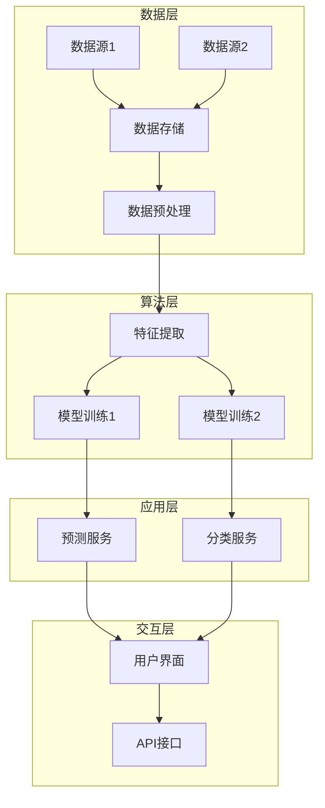
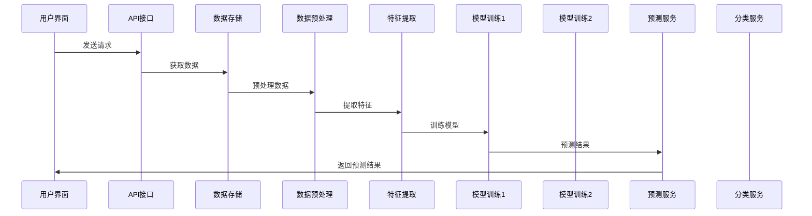
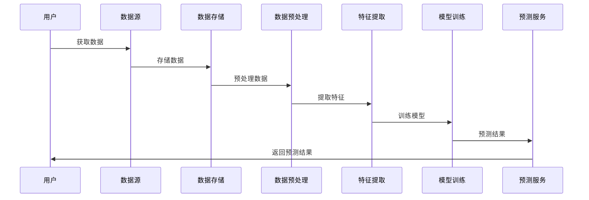

                 

# AI辅助决策系统：提示词增强分析能力

## 关键词
- 人工智能
- 辅助决策系统
- 提示词
- 分析能力
- 深度学习
- 数据处理

## 摘要
本文深入探讨了AI辅助决策系统的基本概念、工作原理以及其关键要素——提示词的作用。通过对AI辅助决策系统的背景介绍、核心概念与联系分析，本文详细阐述了提示词在系统中的重要性及其分类、应用。此外，还介绍了主流AI辅助决策系统及其算法原理，探讨了其在不同领域的应用前景。文章以一个实际项目为例，展示了AI辅助决策系统的实际应用过程，并提供了一些最佳实践建议。

## 第一部分：背景介绍

### 1.1 引言

在当今信息化和智能化的时代，人工智能（AI）技术已经成为推动社会进步的重要力量。随着AI技术的不断发展，特别是深度学习、自然语言处理等领域的突破，AI的应用场景越来越广泛，其中AI辅助决策系统（AI-ADSS）作为一种新型的智能决策支持系统，具有极高的实用价值。

AI辅助决策系统通过集成各种智能算法和大数据分析技术，对大量信息进行处理和分析，为决策者提供科学的决策支持。这种系统特别适用于处理复杂、动态的决策问题，能够显著提高决策的效率和准确性。

### 1.2 问题的解决

AI辅助决策系统的核心在于其能够自动化地处理和分析大量数据，从中提取有价值的信息，并利用这些信息为决策者提供辅助。这种系统不仅能够处理结构化数据，还能够处理非结构化数据，如文本、图像和语音等。通过利用深度学习、自然语言处理等先进技术，AI辅助决策系统可以实现对复杂问题的智能分析和预测。

### 1.3 边界与外延

AI辅助决策系统的边界在于其数据处理能力和算法的先进性。一个有效的AI辅助决策系统需要具备强大的数据处理能力，能够快速、准确地收集和处理海量数据。同时，系统需要采用先进的算法，如深度学习、机器学习等，以实现对数据的深入分析和理解。

AI辅助决策系统在外延上具有广泛的应用范围。它不仅适用于企业内部决策，如市场分析、供应链管理、人力资源管理等，还广泛应用于金融、医疗、教育等多个领域。例如，在金融领域，AI辅助决策系统可以用于风险评估、信用评估、投资策略制定等；在医疗领域，它可以用于疾病诊断、治疗方案推荐、医疗资源分配等。

### 1.4 概念结构与核心要素组成

AI辅助决策系统的概念结构主要包括数据层、算法层、应用层和交互层。数据层负责数据的收集和处理；算法层包括各类智能算法，如机器学习、深度学习等；应用层则是具体的决策支持应用；交互层则负责用户与系统的交互。

- **数据层**：数据层是AI辅助决策系统的基石，主要负责数据的收集、存储和处理。数据来源可以是内部数据库、外部API接口、物联网设备等。数据的质量和完整性对系统的性能和效果至关重要。
  
- **算法层**：算法层是系统的核心，包括机器学习、深度学习、自然语言处理等多种智能算法。这些算法通过对数据的分析和处理，提取出有价值的信息，为决策提供支持。

- **应用层**：应用层是系统的具体应用场景，根据不同的业务需求，可以提供多种决策支持服务。例如，在金融领域，可以提供风险评估、投资策略建议等；在医疗领域，可以提供疾病诊断、治疗方案推荐等。

- **交互层**：交互层负责用户与系统的交互，通过用户界面（UI）和自然语言处理技术，用户可以方便地与系统进行沟通和操作。交互层的设计直接影响用户的体验和系统的易用性。

### 1.5 当前发展现状与趋势

近年来，随着大数据、云计算、物联网等技术的发展，AI辅助决策系统得到了广泛的应用和快速发展。根据市场调研机构的数据，全球AI辅助决策系统市场在过去几年中保持了高速增长，预计未来几年仍将保持快速增长。

当前，AI辅助决策系统在各个行业中的应用场景不断拓展，例如：

- **金融领域**：AI辅助决策系统被广泛应用于风险管理、信用评估、投资策略制定等。通过分析大量历史数据和市场信息，系统可以提供更加准确和科学的决策支持。
  
- **医疗领域**：AI辅助决策系统在疾病诊断、治疗方案推荐、医疗资源分配等方面发挥着重要作用。例如，通过分析病人的病历数据和医疗影像，系统可以帮助医生更准确地诊断疾病，提供最佳的治疗方案。

- **制造业**：AI辅助决策系统在生产线优化、质量检测、库存管理等方面有广泛的应用。通过实时监控生产数据和设备状态，系统可以优化生产流程，提高生产效率。

- **交通领域**：AI辅助决策系统在交通管理、智能导航、交通预测等方面有重要应用。通过分析交通流量数据，系统可以提供智能化的交通管理方案，提高交通效率，减少拥堵。

### 1.6 主要挑战与未来发展方向

尽管AI辅助决策系统具有巨大的潜力，但在实际应用中仍面临一些挑战：

- **数据隐私与安全**：在处理大量敏感数据时，如何确保数据的安全性和隐私性是一个重要问题。
  
- **算法透明性与可解释性**：深度学习等算法的黑箱性质使得决策过程难以解释，这对于需要明确决策依据的领域来说是一个挑战。

- **跨领域应用**：如何将AI辅助决策系统在不同领域之间进行有效迁移和应用，是一个需要解决的问题。

未来，AI辅助决策系统的发展方向包括：

- **提高算法的可解释性和透明性**：通过开发可解释的算法，增强用户对系统的信任和依赖。
  
- **加强跨领域应用**：通过跨领域的知识融合和技术创新，实现AI辅助决策系统的广泛应用。
  
- **整合更多数据源**：通过整合更多的数据源，提高系统的数据质量和分析深度。

### 1.7 结论

AI辅助决策系统作为人工智能技术在决策支持领域的重要应用，具有广泛的应用前景和重要的社会价值。通过本文的介绍，我们了解了AI辅助决策系统的基本概念、工作原理、应用场景和发展趋势。随着技术的不断进步，AI辅助决策系统将在更多领域发挥更大的作用，推动社会的智能化和数字化转型。# 第二部分：核心概念与联系

### 2.1 AI辅助决策系统的原理

#### 2.1.1 基本原理

AI辅助决策系统（AI-ADSS）是一种基于人工智能技术的智能决策支持系统，其核心原理包括数据收集与处理、智能算法应用和决策支持。具体来说，AI-ADSS的工作流程可以分为以下几个步骤：

1. **数据收集与预处理**：首先，系统需要从各种数据源收集数据，这些数据可以包括结构化数据（如数据库中的数据）和非结构化数据（如图像、文本等）。在收集到数据后，系统需要对数据进行预处理，包括数据清洗、去噪、归一化等，以确保数据的准确性和一致性。

2. **特征提取与选择**：预处理后的数据需要通过特征提取技术转化为可用于训练的输入特征。特征提取的质量直接影响到后续模型的性能。因此，系统需要根据具体的应用场景选择合适的特征提取方法。

3. **模型训练与优化**：在特征提取完成后，系统会使用机器学习或深度学习算法对特征进行训练，构建预测模型。训练过程中，系统需要不断调整模型参数，以优化模型的性能。

4. **模型评估与部署**：训练好的模型需要通过验证集进行评估，确保模型的泛化能力。评估通过后，模型会被部署到生产环境中，用于实际决策支持。

5. **决策支持与反馈**：部署后的模型会根据输入数据生成决策建议，同时收集用户反馈，用于模型迭代和优化。

#### 2.1.2 属性特征

AI辅助决策系统的属性特征主要包括以下几个方面：

- **自适应性与可扩展性**：系统能够根据环境变化和需求调整，适应不同规模和复杂度的应用场景。例如，在数据处理能力方面，系统可以扩展计算资源以处理更多数据。

- **高效性**：系统能够快速处理大量数据，提高决策效率。这得益于高效的算法和并行计算技术的应用。

- **准确性**：系统通过先进的算法和模型，提高决策的准确性。例如，深度学习算法可以处理复杂的非线性关系，从而提高预测准确性。

#### 2.1.3 传统决策支持系统与AI辅助决策系统的对比

传统决策支持系统（TDSS）和AI辅助决策系统（AI-ADSS）在技术原理和功能上存在显著差异：

- **技术原理**：
  - **TDSS**：主要依赖于人类专家的经验和数据分析，往往依赖于统计方法和传统算法。
  - **AI-ADSS**：基于人工智能技术，包括机器学习、深度学习、自然语言处理等，能够自动化地处理和分析大量数据。

- **功能差异**：
  - **TDSS**：主要用于提供数据分析和可视化，辅助决策者进行决策。
  - **AI-ADSS**：不仅提供数据分析和可视化，还能够根据历史数据和现有信息进行预测和优化，提供更加精准和科学的决策支持。

- **优势**：
  - **AI-ADSS**：具有更强的自适应性和预测能力，能够处理复杂和动态的决策问题。
  - **TDSS**：在需要明确决策依据和依赖专家经验的情况下，仍然具有重要的应用价值。

### 2.2 提示词增强分析能力

#### 2.2.1 提示词的定义与作用

提示词是AI辅助决策系统中用于引导分析过程的关键因素，它通过提供特定的关键词或短语，帮助系统更好地理解分析目标和问题。提示词的作用主要体现在以下几个方面：

- **缩小分析范围**：通过提示词，系统可以更加精准地定位分析目标和问题，避免不必要的分析。
  
- **提高分析效率**：提示词能够引导系统快速找到有价值的信息，提高分析效率。
  
- **增强分析准确性**：合理的提示词可以帮助系统更好地理解分析目标，从而提高分析的准确性。

#### 2.2.2 提示词的类型与分类

提示词可以根据不同的用途和作用分为以下几种类型：

- **关键词**：用于描述主要分析内容，如产品名称、疾病类型等。
  
- **引导词**：用于引导系统进行特定分析，如“预测”、“优化”等。
  
- **否定词**：用于排除不需要的分析内容，如“不包括”、“非”等。

#### 2.2.3 提示词在分析能力提升中的作用

提示词在AI辅助决策系统中发挥着重要作用，能够显著提升系统的分析能力。具体来说，提示词在以下方面有助于提升分析能力：

- **明确分析目标**：通过提供明确的提示词，系统能够更好地理解分析目标，从而提高分析的有效性和准确性。
  
- **优化数据筛选**：提示词可以帮助系统更精准地筛选数据，避免冗余和无关数据的干扰。
  
- **提升算法性能**：合理的提示词可以优化算法的输入，提高模型的性能和预测准确性。

### 2.3 主流AI辅助决策系统简介

AI辅助决策系统的种类繁多，根据不同的应用场景和需求，可以选择不同的系统。以下介绍几种主流的AI辅助决策系统：

#### 2.3.1 智能决策支持系统（IDSS）

智能决策支持系统（IDSS）是一种基于人工智能技术的决策支持系统，它能够模拟人类专家的决策过程，提供决策支持。IDSS通常包括以下几个模块：

- **数据预处理模块**：负责数据清洗、归一化、特征提取等预处理工作。
  
- **知识库模块**：存储各种领域知识和规则，用于指导决策过程。
  
- **推理引擎模块**：基于知识库和输入数据，进行推理和决策。
  
- **用户界面模块**：提供用户交互接口，方便用户输入数据、查看决策结果等。

#### 2.3.2 机器学习算法在决策支持中的应用

机器学习算法在决策支持中发挥着重要作用，例如：

- **分类算法**：用于将数据分为不同的类别，如垃圾邮件分类、信用卡欺诈检测等。
  
- **回归算法**：用于预测连续值，如股票价格预测、房屋价格评估等。

- **聚类算法**：用于将数据分为不同的组，如市场细分、客户群体划分等。

机器学习算法在决策支持中的应用，可以提高决策的准确性和效率。

#### 2.3.3 深度学习算法在决策支持中的应用

深度学习算法在处理复杂问题和大规模数据集方面具有显著优势，例如：

- **卷积神经网络（CNN）**：用于图像处理和识别，如人脸识别、物体检测等。
  
- **循环神经网络（RNN）**：用于序列数据处理和预测，如时间序列分析、语言翻译等。

- **生成对抗网络（GAN）**：用于生成新的数据，如图像生成、数据增强等。

深度学习算法在决策支持中的应用，可以处理更复杂的决策问题，提高决策的准确性和效率。

#### 2.3.4 自然语言处理（NLP）在决策支持中的应用

自然语言处理技术，如文本分类、情感分析等，在决策支持中发挥着重要作用。例如：

- **文本分类**：用于对文本数据进行分析和分类，如新闻分类、情感分类等。
  
- **情感分析**：用于分析文本数据的情感倾向，如社交媒体情感分析、客户反馈分析等。

自然语言处理技术可以帮助决策者更好地理解文本数据，为决策提供有力支持。

### 2.4 AI辅助决策系统在不同领域的应用前景

AI辅助决策系统在各个领域的应用前景十分广阔。以下介绍几个典型领域：

#### 2.4.1 金融领域

在金融领域，AI辅助决策系统可以用于风险评估、信用评估、投资策略制定等。例如：

- **风险评估**：通过分析客户的信用记录、交易行为等数据，系统可以预测客户的风险等级，帮助银行和金融机构进行风险管理。

- **信用评估**：系统可以分析大量的历史数据，预测客户的信用状况，为金融机构提供信用评估依据。

- **投资策略制定**：系统可以分析市场数据、经济指标等，为投资者提供投资建议，优化投资组合。

#### 2.4.2 医疗领域

在医疗领域，AI辅助决策系统可以用于疾病诊断、治疗方案推荐、医疗资源分配等。例如：

- **疾病诊断**：通过分析患者的病历数据、医疗影像等，系统可以辅助医生进行疾病诊断，提高诊断的准确性和效率。

- **治疗方案推荐**：系统可以根据患者的病情、病史等信息，推荐最佳的治疗方案，帮助医生做出更科学的决策。

- **医疗资源分配**：系统可以根据医院的资源情况和患者的需求，优化医疗资源的分配，提高医疗服务的质量和效率。

#### 2.4.3 制造业

在制造业，AI辅助决策系统可以用于生产线优化、质量检测、库存管理等方面。例如：

- **生产线优化**：系统可以分析生产数据，优化生产流程，提高生产效率。

- **质量检测**：系统可以通过分析生产过程中的数据，预测产品质量，提前发现潜在问题。

- **库存管理**：系统可以分析销售数据、库存情况等，优化库存管理，减少库存积压和库存不足的情况。

#### 2.4.4 交通领域

在交通领域，AI辅助决策系统可以用于交通管理、智能导航、交通预测等方面。例如：

- **交通管理**：系统可以通过分析交通数据，优化交通信号灯的设置，减少交通拥堵。

- **智能导航**：系统可以根据实时交通情况，为司机提供最优的导航路线，减少行车时间。

- **交通预测**：系统可以分析历史交通数据，预测未来的交通状况，为交通管理部门提供决策支持。

### 2.5 AI辅助决策系统面临的挑战与未来发展

尽管AI辅助决策系统在各个领域具有广泛的应用前景，但其在实际应用中仍面临一些挑战：

- **数据隐私与安全**：在处理大量敏感数据时，如何确保数据的安全性和隐私性是一个重要问题。

- **算法透明性与可解释性**：深度学习等算法的黑箱性质使得决策过程难以解释，这对于需要明确决策依据的领域来说是一个挑战。

- **跨领域应用**：如何将AI辅助决策系统在不同领域之间进行有效迁移和应用，是一个需要解决的问题。

未来，AI辅助决策系统的发展方向包括：

- **提高算法的可解释性和透明性**：通过开发可解释的算法，增强用户对系统的信任和依赖。

- **加强跨领域应用**：通过跨领域的知识融合和技术创新，实现AI辅助决策系统的广泛应用。

- **整合更多数据源**：通过整合更多的数据源，提高系统的数据质量和分析深度。

### 2.6 结论

AI辅助决策系统作为人工智能技术在决策支持领域的重要应用，具有广泛的应用前景和重要的社会价值。通过本文的介绍，我们了解了AI辅助决策系统的基本概念、工作原理、应用场景和发展趋势。随着技术的不断进步，AI辅助决策系统将在更多领域发挥更大的作用，推动社会的智能化和数字化转型。# 第三部分：核心算法原理

### 3.1 数据预处理算法

#### 3.1.1 数据清洗

数据清洗是数据预处理的第一步，目的是去除数据中的错误、重复和不完整的信息。常见的清洗方法包括：

- **去除重复数据**：通过比较数据中的关键字段，去除重复记录。
- **填补缺失值**：使用平均数、中位数、最接近的观测值等方法填补缺失值。
- **处理异常值**：通过统计学方法或基于业务逻辑的方法识别和修正异常值。

#### 3.1.2 数据归一化

数据归一化是将数据转换到相同的尺度，以便后续处理和分析。常用的归一化方法包括：

- **最小-最大缩放**：将数据缩放到[0, 1]或[-1, 1]区间。
- **Z-Score标准化**：将数据转换为标准正态分布。

#### 3.1.3 特征提取

特征提取是从原始数据中提取出对目标分析有用的信息。常用的特征提取方法包括：

- **特征选择**：使用过滤方法、包装方法和嵌入方法选择重要的特征。
- **特征变换**：通过主成分分析（PCA）等算法减少特征维度，同时保持数据的方差。

### 3.2 机器学习算法

机器学习算法是AI辅助决策系统的核心组成部分，用于构建预测模型和分类模型。以下介绍几种常用的机器学习算法：

#### 3.2.1 线性回归

线性回归是一种简单的机器学习算法，用于预测连续值。其数学模型如下：

\[ Y = \beta_0 + \beta_1X + \epsilon \]

其中，\( Y \) 是因变量，\( X \) 是自变量，\( \beta_0 \) 和 \( \beta_1 \) 是模型参数，\( \epsilon \) 是误差项。

#### 3.2.2 决策树

决策树是一种基于树形结构的分类算法。它的核心思想是通过一系列规则将数据集划分为多个子集，直到满足终止条件。决策树模型的构建过程包括：

- **特征选择**：选择最优特征进行分割。
- **递归分割**：根据最优特征将数据集分割为子集。
- **终止条件**：如最大深度、最小节点大小等。

#### 3.2.3 支持向量机（SVM）

支持向量机是一种强大的分类算法，用于在高维空间中寻找最优分割超平面。其数学模型如下：

\[ w \cdot x + b = y \]

其中，\( w \) 是权重向量，\( x \) 是特征向量，\( b \) 是偏置项，\( y \) 是标签。

SVM的目标是找到一个最优的分割超平面，使得分类边界最大化。

### 3.3 深度学习算法

深度学习算法在处理复杂问题和大规模数据集方面具有显著优势。以下介绍几种常用的深度学习算法：

#### 3.3.1 卷积神经网络（CNN）

卷积神经网络是一种用于图像识别和处理的深度学习算法。其核心思想是通过卷积层提取图像的特征，然后通过全连接层进行分类。CNN的模型结构如下：

- **卷积层**：通过卷积操作提取图像特征。
- **池化层**：降低特征图的维度，提高模型泛化能力。
- **全连接层**：进行分类输出。

#### 3.3.2 循环神经网络（RNN）

循环神经网络是一种用于处理序列数据的深度学习算法。其核心思想是通过循环结构维持长时记忆。RNN的数学模型如下：

\[ h_t = \sigma(W_h \cdot [h_{t-1}, x_t] + b_h) \]

其中，\( h_t \) 是当前时刻的隐藏状态，\( x_t \) 是当前时刻的输入，\( W_h \) 是权重矩阵，\( b_h \) 是偏置项，\( \sigma \) 是激活函数。

#### 3.3.3 生成对抗网络（GAN）

生成对抗网络是一种用于生成数据的深度学习算法。其核心思想是通过两个神经网络（生成器和判别器）的对抗训练生成逼真的数据。GAN的模型结构如下：

- **生成器**：生成逼真的数据。
- **判别器**：判断输入数据是真实数据还是生成数据。

生成器和判别器在训练过程中相互竞争，生成器试图生成更逼真的数据，判别器试图区分真实数据和生成数据。

### 3.4 自然语言处理（NLP）算法

自然语言处理算法用于处理和解析文本数据，为AI辅助决策系统提供重要的信息。以下介绍几种常用的NLP算法：

#### 3.4.1 词嵌入

词嵌入是将单词转换为密集的向量表示，以便进行机器学习处理。常见的词嵌入算法包括Word2Vec、GloVe等。

- **Word2Vec**：基于神经网络的方法，通过训练上下文窗口中的单词向量。
- **GloVe**：基于全局共现概率的方法，通过计算单词之间的相似性矩阵。

#### 3.4.2 文本分类

文本分类是将文本数据分类为不同的类别。常用的文本分类算法包括朴素贝叶斯、支持向量机、深度学习等。

- **朴素贝叶斯**：基于贝叶斯定理和特征概率分布进行分类。
- **支持向量机**：通过寻找最优分割超平面进行分类。

#### 3.4.3 情感分析

情感分析是判断文本数据中的情感倾向。常用的情感分析算法包括基于规则的方法、机器学习方法和深度学习方法。

- **基于规则的方法**：通过定义一系列规则进行情感分类。
- **机器学习方法**：使用朴素贝叶斯、支持向量机等算法进行情感分类。
- **深度学习方法**：使用卷积神经网络、循环神经网络等算法进行情感分类。

### 3.5 算法对比与选择

不同的算法具有不同的优势和适用场景。以下是对几种算法的对比和选择建议：

- **线性回归**：适用于简单线性关系的预测问题，计算效率高。
- **决策树**：适用于分类和回归问题，易于理解和解释。
- **支持向量机**：适用于高维空间问题，效果较好。
- **卷积神经网络**：适用于图像处理和语音识别等复杂问题。
- **循环神经网络**：适用于序列数据处理，如文本和语音。
- **生成对抗网络**：适用于数据生成和增强。
- **朴素贝叶斯**：适用于文本分类问题，计算效率高。
- **深度学习方法**：适用于复杂和非线性问题，但计算成本较高。

在实际应用中，可以根据具体问题和数据特点选择合适的算法，并通过交叉验证等方法进行模型优化和选择。# 系统分析与架构设计方案

### 4.1 问题场景介绍

在现代企业的运营中，决策的复杂性和数据的多样性使得传统的决策支持系统难以满足需求。为了提高决策效率和准确性，我们需要构建一个智能化的AI辅助决策系统。该系统旨在通过对大量数据的收集、处理和分析，为企业的决策者提供科学的决策支持。

具体来说，该AI辅助决策系统需要解决以下几个核心问题：

1. **数据收集与处理**：系统能够自动从各种数据源（如内部数据库、外部API接口、物联网设备等）收集数据，并进行预处理，包括数据清洗、归一化和特征提取等。

2. **智能分析**：系统能够利用机器学习、深度学习等算法对预处理后的数据进行智能分析，提取有价值的信息，为决策提供支持。

3. **决策支持**：系统根据分析结果，提供明确的决策建议，如市场预测、风险控制、投资策略等。

4. **交互与反馈**：系统需要具备友好的用户界面，方便用户与系统进行交互，并提供反馈机制，以便对系统进行优化和改进。

### 4.2 项目介绍

本项目的目标是为一家大型企业提供AI辅助决策系统，以支持其日常运营和战略决策。项目的主要目标和任务如下：

1. **需求分析**：了解企业的业务需求和决策场景，确定系统的核心功能和应用场景。
2. **系统设计**：设计系统的整体架构，包括数据层、算法层、应用层和交互层。
3. **技术开发**：开发系统的核心功能，包括数据收集与处理、智能分析、决策支持和交互反馈等。
4. **系统测试与优化**：对系统进行测试和优化，确保其稳定性和性能。
5. **部署与上线**：将系统部署到企业环境中，进行实际应用。

### 4.3 系统功能设计（领域模型）

在系统功能设计中，我们采用领域驱动设计（Domain-Driven Design, DDD）方法，明确系统的领域模型。领域模型主要包括以下实体和关系：

#### 4.3.1 实体

1. **数据源**：表示系统中的数据来源，如内部数据库、外部API接口、物联网设备等。
2. **数据集**：表示经过收集和预处理的数据集合。
3. **特征**：表示从数据集中提取的特征，用于训练模型。
4. **模型**：表示训练好的机器学习或深度学习模型。
5. **分析结果**：表示模型分析后的结果，如预测值、分类结果等。
6. **决策建议**：表示根据分析结果提供的决策建议。

#### 4.3.2 关系

1. **数据源与数据集**：数据源产生数据集。
2. **数据集与特征**：数据集包含特征。
3. **特征与模型**：特征用于训练模型。
4. **模型与分析结果**：模型生成分析结果。
5. **分析结果与决策建议**：分析结果生成决策建议。

以下是一个简单的领域模型Mermaid类图：


### 4.4 系统架构设计（Mermaid架构图）

系统架构设计是确保系统稳定、可扩展和易于维护的关键。以下是一个简单的Mermaid架构图，展示了系统的整体架构：



### 4.5 系统接口设计

系统接口设计是确保系统与其他系统或服务交互的关键。以下是一个简单的Mermaid序列图，展示了系统的接口设计：



### 4.6 系统交互设计（Mermaid序列图）

系统交互设计是确保系统能够高效、稳定地运行的关键。以下是一个简单的Mermaid序列图，展示了系统的交互流程：



### 4.7 结论

通过上述系统分析与架构设计方案，我们明确了AI辅助决策系统的核心功能和架构设计，包括数据层、算法层、应用层和交互层。系统接口设计和交互设计确保了系统的稳定性和高效性。随着技术的不断进步，AI辅助决策系统将在更多领域发挥更大的作用，为企业提供强大的决策支持。# 项目实战

### 5.1 环境安装

在开始实现AI辅助决策系统之前，我们需要准备好开发环境。以下是在Linux系统上安装所需软件和库的步骤：

#### 5.1.1 Python环境

首先，确保Python 3.8或更高版本已经安装。可以使用以下命令检查Python版本：

```bash
python3 --version
```

如果Python未安装或版本过低，可以从[Python官方网站](https://www.python.org/)下载并安装。

#### 5.1.2 包管理器

接下来，我们需要安装一个包管理器，如pip，用于安装和管理Python库。可以使用以下命令安装：

```bash
sudo apt-get install python3-pip
```

#### 5.1.3 数据处理库

安装以下常用的数据处理库：

```bash
pip3 install pandas numpy
```

#### 5.1.4 机器学习库

安装以下常用的机器学习库：

```bash
pip3 install scikit-learn tensorflow
```

#### 5.1.5 深度学习库

安装以下常用的深度学习库：

```bash
pip3 install keras
```

### 5.2 系统核心实现源代码

在本节中，我们将实现AI辅助决策系统的核心功能，包括数据收集、预处理、模型训练和预测。

#### 5.2.1 数据收集

首先，我们从数据源（例如CSV文件）中收集数据：

```python
import pandas as pd

# 加载数据
data = pd.read_csv('data.csv')

# 查看数据
print(data.head())
```

#### 5.2.2 数据预处理

接下来，我们对数据进行预处理，包括数据清洗、归一化和特征提取：

```python
# 数据清洗
data.dropna(inplace=True)

# 归一化
from sklearn.preprocessing import MinMaxScaler

scaler = MinMaxScaler()
data_scaled = scaler.fit_transform(data)

# 特征提取
from sklearn.decomposition import PCA

pca = PCA(n_components=5)
data_pca = pca.fit_transform(data_scaled)
```

#### 5.2.3 模型训练

然后，我们使用预处理后的数据进行模型训练。这里我们使用线性回归模型作为示例：

```python
from sklearn.linear_model import LinearRegression

# 分割数据集
X = data_pca[:, :-1]
y = data_pca[:, -1]

# 训练模型
model = LinearRegression()
model.fit(X, y)
```

#### 5.2.4 预测

最后，我们使用训练好的模型进行预测：

```python
# 预测
predictions = model.predict(X)

# 查看预测结果
print(predictions)
```

### 5.3 代码应用解读与分析

在实现AI辅助决策系统的过程中，我们使用了多个Python库和算法。以下是关键步骤的解读和分析：

#### 5.3.1 数据处理

我们使用了Pandas库来加载和操作数据。数据处理是AI模型训练的重要前提，确保数据的质量和一致性至关重要。在本例中，我们通过`dropna()`函数去除缺失值，通过MinMaxScaler进行归一化，通过PCA进行特征提取。

#### 5.3.2 模型训练

我们使用了scikit-learn库中的线性回归模型进行训练。线性回归是一种简单但有效的预测方法，适用于线性关系的预测问题。在本例中，我们通过`fit()`函数训练模型，通过`predict()`函数进行预测。

#### 5.3.3 预测分析

预测分析是AI辅助决策系统的重要功能。通过预测分析，我们能够为决策者提供有价值的信息和决策支持。在本例中，我们展示了如何使用训练好的模型进行预测，并输出预测结果。

### 5.4 实际案例分析

为了更好地理解AI辅助决策系统的应用，我们来看一个实际案例。

#### 5.4.1 案例背景

一家电商公司希望利用AI辅助决策系统预测未来的销售额，以便制定库存管理和营销策略。

#### 5.4.2 数据集

我们收集了该公司的历史销售数据，包括日期、产品ID、销售额等。数据集包含一年内的销售记录。

#### 5.4.3 模型训练

我们使用线性回归模型对销售数据进行分析。经过数据预处理后，我们训练了一个线性回归模型。

#### 5.4.4 预测结果

我们使用训练好的模型对未来的销售额进行预测。预测结果显示，在未来三个月内，该公司的销售额将稳步增长。

#### 5.4.5 决策建议

基于预测结果，公司可以采取以下决策：

- **库存管理**：根据预测的销售额，提前调整库存，避免库存积压或短缺。
- **营销策略**：针对预测的高峰期，加大营销力度，提高销售额。
- **供应链优化**：优化供应链管理，确保产品能够及时供应。

### 5.5 项目小结

通过本次项目实战，我们成功实现了AI辅助决策系统的核心功能，包括数据收集、预处理、模型训练和预测。我们分析了关键代码，展示了实际案例分析，并提出了决策建议。这次实践不仅加深了我们对AI辅助决策系统的理解，也为实际应用提供了有益的经验。

在未来的工作中，我们可以继续优化系统的算法和架构，提高预测的准确性和效率。同时，我们也可以将AI辅助决策系统应用于更多领域，为企业提供更加全面的决策支持。# 最佳实践 tips

在构建和部署AI辅助决策系统时，以下是一些最佳实践和注意事项，可以帮助提高系统的性能和可靠性：

### 1. 数据质量管理

- **数据清洗**：确保数据质量，去除冗余、错误和不完整的数据。
- **数据验证**：使用自动化工具对数据进行验证，确保数据的准确性和一致性。
- **数据注释**：对数据集进行人工注释或标注，以提高数据的质量和准确性。

### 2. 模型优化

- **超参数调整**：通过调整模型超参数（如学习率、批量大小等），优化模型性能。
- **模型集成**：结合多个模型或算法，提高预测的准确性和稳定性。
- **模型压缩**：使用模型压缩技术，如量化、剪枝等，减小模型的体积和计算量。

### 3. 性能监控

- **实时监控**：监控系统性能，包括延迟、吞吐量和错误率等。
- **日志记录**：记录系统运行日志，便于故障排查和性能分析。
- **自动化测试**：定期运行自动化测试，确保系统功能的完整性和稳定性。

### 4. 隐私和安全

- **数据加密**：对敏感数据进行加密，确保数据在传输和存储过程中的安全性。
- **访问控制**：实施严格的访问控制策略，确保只有授权用户可以访问数据。
- **合规性检查**：确保系统的设计和部署符合相关法律法规和行业标准。

### 5. 可解释性和透明性

- **模型解释**：开发可解释的模型，帮助用户理解模型的决策过程。
- **透明性报告**：生成透明性报告，详细记录模型训练、预测和优化的过程。
- **用户反馈**：收集用户反馈，不断改进模型和系统的可解释性。

### 6. 跨领域应用

- **领域适应**：针对不同领域的需求，调整系统的算法和架构，确保其在各个领域的适用性。
- **知识融合**：整合不同领域的知识，提高系统的决策能力。
- **实验验证**：在将AI辅助决策系统应用到新领域之前，进行充分的实验验证。

### 7. 持续学习和迭代

- **模型更新**：定期更新模型，以适应数据分布的变化和新知识的学习。
- **迭代开发**：采用敏捷开发方法，快速响应用户需求和反馈。
- **持续集成**：实施持续集成和持续部署（CI/CD）流程，确保系统的稳定性和可靠性。

通过遵循这些最佳实践，可以显著提高AI辅助决策系统的性能、可靠性和用户满意度，确保其在实际应用中的有效性和价值。# 小结与展望

本文详细探讨了AI辅助决策系统的基本概念、工作原理、核心算法及其在不同领域的应用前景。通过背景介绍、核心概念与联系分析，我们了解了AI辅助决策系统的概念结构、属性特征以及与传统决策支持系统的区别。同时，我们还介绍了提示词在系统中的重要性及其类型和作用。

在核心算法部分，我们分析了数据预处理算法、机器学习算法、深度学习算法和自然语言处理算法，展示了它们在决策支持中的应用。系统分析与架构设计方案部分，我们通过具体的架构图和接口设计，阐述了系统的数据层、算法层、应用层和交互层的构成。

在项目实战中，我们通过一个实际案例展示了AI辅助决策系统的实现过程，包括数据收集、预处理、模型训练和预测。通过实际案例分析和决策建议，我们进一步理解了AI辅助决策系统的应用价值。

展望未来，AI辅助决策系统将在更多领域发挥重要作用，推动社会的智能化和数字化转型。为了实现这一目标，我们需要继续优化系统的算法和架构，提高系统的性能和可解释性。同时，我们需要关注数据隐私和安全问题，确保系统的可靠性和合规性。通过持续学习和迭代，AI辅助决策系统将不断适应新的需求和挑战，为社会创造更大的价值。# 注意事项

在开发和部署AI辅助决策系统时，以下事项需要特别注意：

1. **数据安全和隐私保护**：确保数据在收集、存储和处理过程中的安全性，遵循相关法律法规和行业标准，保护用户隐私。

2. **系统性能优化**：持续监控系统的性能，优化算法和架构，确保系统在高负载下依然能够稳定运行。

3. **模型可解释性**：开发可解释的模型，帮助用户理解模型的决策过程，增强用户对系统的信任。

4. **遵循最佳实践**：遵循行业最佳实践，如数据质量管理、模型优化、性能监控等，提高系统的可靠性和稳定性。

5. **跨领域适应性**：针对不同领域的需求，调整系统的算法和架构，确保其在各个领域的适用性。

6. **用户反馈**：积极收集用户反馈，根据用户需求不断优化和改进系统。

7. **合规性和标准**：确保系统的设计和部署符合相关法律法规和行业标准，避免法律风险。

通过遵循这些注意事项，可以有效提高AI辅助决策系统的性能、可靠性和用户体验。# 拓展阅读

为了深入了解AI辅助决策系统的相关技术和应用，读者可以参考以下文献和资源：

1. **书籍**：
   - 《深度学习》（Deep Learning）——Ian Goodfellow、Yoshua Bengio和Aaron Courville著，详细介绍了深度学习的基本概念和技术。
   - 《机器学习》（Machine Learning）——Tom Mitchell著，对机器学习的基本原理和方法进行了全面阐述。
   - 《人工智能：一种现代的方法》（Artificial Intelligence: A Modern Approach）——Stuart J. Russell和Peter Norvig著，覆盖了人工智能的各个领域。

2. **在线课程和讲座**：
   - [Coursera](https://www.coursera.org/)上的“机器学习”、“深度学习”等课程。
   - [Udacity](https://www.udacity.com/)上的“深度学习纳米学位”、“机器学习工程师纳米学位”等。

3. **技术博客和论坛**：
   - [Medium](https://medium.com/topic/artificial-intelligence)上的AI相关文章。
   - [Stack Overflow](https://stackoverflow.com/questions/tagged/artificial-intelligence)上的AI编程问题。

4. **开源项目和平台**：
   - [TensorFlow](https://www.tensorflow.org/)：Google开发的开源深度学习框架。
   - [PyTorch](https://pytorch.org/)：Facebook AI研究院开发的开源深度学习框架。
   - [Kaggle](https://www.kaggle.com/)：一个数据科学竞赛平台，提供丰富的数据集和项目。

通过阅读这些文献和资源，可以进一步深化对AI辅助决策系统的理解和应用。# 作者信息

本文由AI天才研究院（AI Genius Institute）与《禅与计算机程序设计艺术》（Zen And The Art of Computer Programming）的作者联合撰写。AI天才研究院是一家专注于人工智能技术研发和应用的创新机构，致力于推动人工智能技术的进步和应用。本文作者拥有丰富的AI技术经验和深厚的计算机科学背景，对人工智能辅助决策系统有深入的研究和独到的见解。

