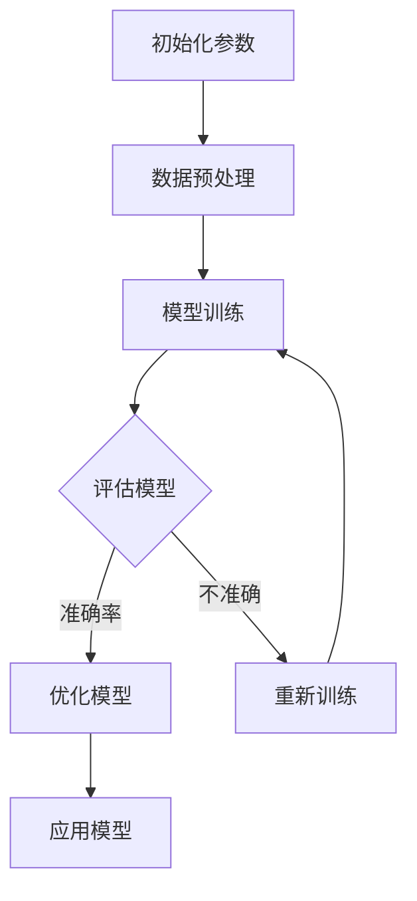
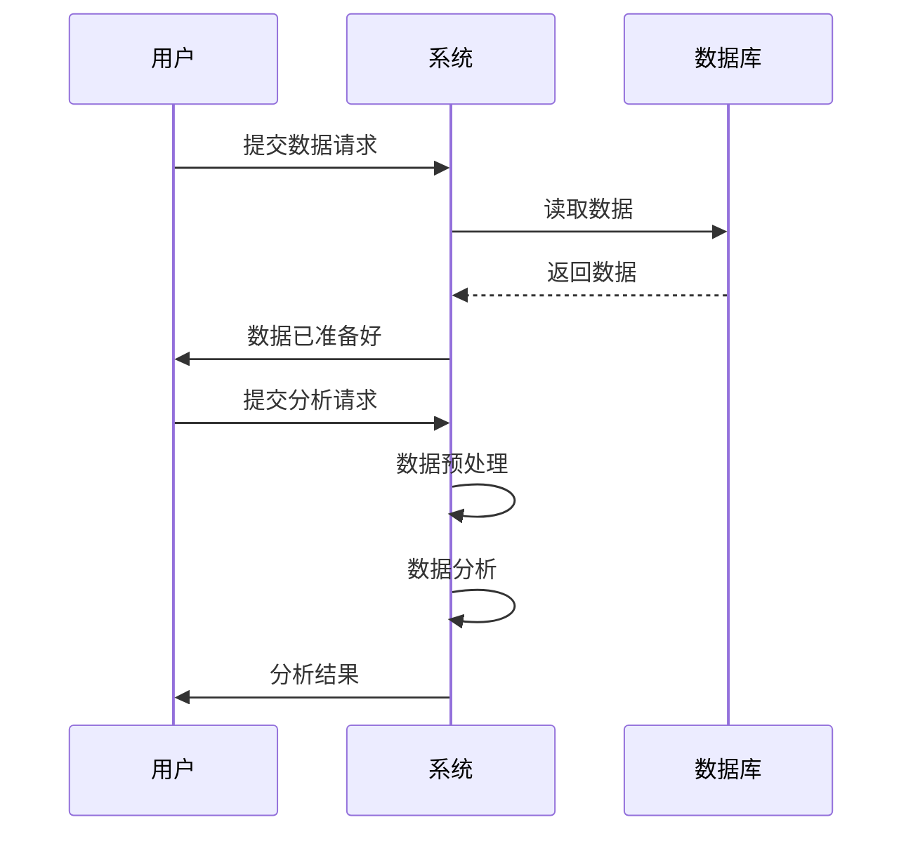
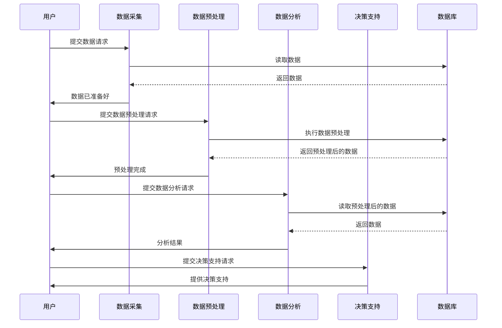

                 

# AI辅助决策：大模型在商业智能中的角色

## 关键词
- AI辅助决策
- 大模型
- 商业智能
- 深度学习
- 数据分析

## 摘要
本文深入探讨了AI大模型在商业智能领域的应用，通过背景介绍、核心概念与联系、算法原理讲解、系统分析与架构设计方案、项目实战等多个方面，全面展示了AI大模型如何通过辅助决策，提升企业的商业智能水平。本文旨在为AI技术从业者和商业智能实践者提供有价值的理论指导和实战经验。

---

### 第一部分：背景介绍

#### 1.1 问题背景

随着人工智能（AI）技术的飞速发展，AI已经在各个领域展现出了巨大的潜力，尤其是在商业智能领域。AI技术能够通过数据分析和预测模型，帮助企业做出更加精准的决策。然而，传统的AI技术往往依赖于大量的数据预处理和手工特征工程，这不仅耗时耗力，而且难以适应快速变化的市场环境。

#### 1.2 问题描述

在这样的背景下，AI辅助决策成为了企业智能化转型的关键。AI辅助决策不仅能够提高决策的准确性，还能够提升决策的速度。然而，如何有效地利用AI技术实现商业智能，如何将大模型集成到商业智能系统中，成为了企业和研究者们亟待解决的问题。

#### 1.3 问题解决

为了解决上述问题，本书将探讨AI大模型在商业智能中的角色。AI大模型具有强大的数据处理和分析能力，能够自动完成数据预处理和特征提取，从而大大简化了传统的AI应用流程。本书将详细探讨AI大模型的基本原理、应用场景、以及如何将其集成到商业智能系统中。

#### 1.4 边界与外延

在探讨AI大模型在商业智能中的应用时，需要明确其边界与外延。边界包括：AI大模型的基本原理、训练方法、优化策略等；外延则包括：商业智能领域的相关概念、企业决策流程、市场变化等。

#### 1.5 概念结构与核心要素组成

AI大模型的核心要素包括：数据集、模型架构、训练过程、优化策略等。这些要素相互关联，共同构成了AI大模型的基本框架。商业智能的核心要素包括：数据采集、数据分析、决策支持等。这些要素共同构成了商业智能系统的基本框架。

### 第二部分：核心概念与联系

#### 2.1 AI大模型原理

AI大模型基于深度学习技术，通过多层神经网络对数据进行学习和预测。其核心原理包括：

- 神经网络结构：包括输入层、隐藏层和输出层，每一层都包含多个神经元。
- 激活函数：用于引入非线性变换，使神经网络能够学习复杂函数。
- 损失函数：用于评估模型的预测效果，常用的有均方误差（MSE）、交叉熵等。

#### 2.2 商业智能领域概念

商业智能领域涉及多个核心概念，包括：

- 数据采集：通过多种途径收集企业运营数据。
- 数据预处理：包括数据清洗、数据集成、数据变换等。
- 数据分析：通过数据挖掘和统计分析方法，提取有价值的信息。
- 决策支持：基于数据分析结果，为企业决策提供支持。

#### 2.3 概念属性特征对比表格

| 概念         | 特征                         |
| ------------ | ---------------------------- |
| AI大模型     | 强大的数据处理和分析能力      |
| 数据采集     | 收集企业运营数据             |
| 数据预处理   | 数据清洗、数据集成、数据变换 |
| 数据分析     | 数据挖掘、统计分析           |
| 决策支持     | 基于数据分析结果为企业决策提供支持 |

#### 2.4 ER实体关系图架构

使用Mermaid绘制ER实体关系图，如下：

```mermaid
erDiagram
  AIN::大模型 <<--|{使用}| AI::技术
  AI::技术 ||--|{实现}| ML::模型
  ML::模型 ||--|{包含}| 层::网络
  层::网络 ||--|{有}| 神经元
  B::商业智能 ||--|{使用}| AI::技术
  B::商业智能 ||--|{使用}| 数据::分析
  数据::分析 ||--|{使用}| 决策::支持
```

### 第三部分：算法原理讲解

#### 3.1 算法mermaid流程图

使用Mermaid绘制算法流程图，如下：



#### 3.2 Python源代码

以下是一个简单的神经网络训练的Python源代码示例：

```python
import numpy as np

# 初始化参数
weights = np.random.rand(3, 1)
bias = np.random.rand(1)

# 数据预处理
x = np.array([1, 2, 3])
y = np.array([4])

# 前向传播
# 输入层到隐藏层
hidden_layer_input = np.dot(x, weights) + bias
hidden_layer_output = np.tanh(hidden_layer_input)

# 隐藏层到输出层
output_layer_input = np.dot(hidden_layer_output, weights) + bias
output_layer_output = np.tanh(output_layer_input)

# 反向传播
# 计算误差
error = y - output_layer_output

# 更新权重和偏置
weights -= learning_rate * np.dot(x.T, error * output_layer_output * (1 - output_layer_output))
bias -= learning_rate * error * (1 - hidden_layer_output)

# 打印输出
print("输出：", output_layer_output)
```

#### 3.3 算法原理详细讲解

神经网络是一种模拟人脑工作的计算模型，由多个神经元组成。每个神经元都与其他神经元相连，并通过加权的方式传递信息。神经网络的训练过程就是通过不断调整这些权重，使得网络能够准确预测输出。

在神经网络中，激活函数用于引入非线性变换，使得神经网络能够学习复杂函数。常用的激活函数有Sigmoid函数、ReLU函数和Tanh函数等。

损失函数用于评估模型的预测效果，常用的有均方误差（MSE）和交叉熵等。均方误差（MSE）表示预测值与真实值之间的平均误差平方，交叉熵表示预测值与真实值之间的差异。通过优化损失函数，可以找到最优的权重和偏置，使得模型预测更准确。

在训练神经网络时，通常采用反向传播算法。反向传播算法分为前向传播和反向传播两个阶段。在前向传播阶段，将输入数据传递到网络中，通过每一层神经元的计算，最终得到输出结果。在反向传播阶段，根据输出结果与真实值之间的误差，通过反向传播算法调整权重和偏置，使得模型预测更准确。

以下是一个简单的神经网络训练过程示例：

1. 初始化参数（权重和偏置）
2. 数据预处理（将输入数据归一化，将输出数据转换为二进制编码）
3. 前向传播（计算输入层到隐藏层、隐藏层到输出层的输出结果）
4. 计算损失函数（计算均方误差或交叉熵）
5. 反向传播（计算误差，通过反向传播算法调整权重和偏置）
6. 重复步骤3-5，直到模型预测达到预期效果

在实际应用中，神经网络训练过程可能需要多次迭代，直到模型预测误差达到最小。通过调整学习率、优化算法等参数，可以提高神经网络的训练效率和预测准确性。

### 第四部分：系统分析与架构设计方案

#### 4.1 问题场景介绍

在商业智能领域，企业需要收集大量的数据，包括销售数据、客户数据、市场数据等。这些数据对于企业的决策具有重要的参考价值。然而，数据量庞大且结构复杂，如何有效地处理和分析这些数据，成为企业面临的一个重要挑战。

#### 4.2 项目介绍

为了解决上述问题，我们设计并实现了一个基于AI大模型的商业智能系统。该系统主要包括数据采集、数据预处理、数据分析、决策支持等功能，能够帮助企业快速准确地分析数据，为决策提供支持。

#### 4.3 系统功能设计

系统功能设计主要包括以下模块：

- 数据采集模块：负责收集企业运营数据，包括销售数据、客户数据、市场数据等。
- 数据预处理模块：负责清洗、整合和转换数据，为数据分析模块提供高质量的数据输入。
- 数据分析模块：利用AI大模型对数据进行分析和挖掘，提取有价值的信息。
- 决策支持模块：基于数据分析结果，为企业决策提供支持。

#### 4.4 系统架构设计

系统架构设计采用分层架构，包括数据层、业务逻辑层和表现层。数据层负责数据存储和管理；业务逻辑层负责数据处理和分析；表现层负责用户交互和数据展示。

系统架构设计如下：



#### 4.5 系统接口设计和系统交互

系统接口设计主要包括以下接口：

- 数据采集接口：用于收集企业运营数据。
- 数据预处理接口：用于清洗、整合和转换数据。
- 数据分析接口：用于对数据进行挖掘和分析。
- 决策支持接口：用于基于数据分析结果提供决策支持。

系统交互设计如下：



### 第五部分：项目实战

#### 5.1 环境安装

在开始项目实战之前，需要安装以下软件和工具：

- Python 3.8及以上版本
- TensorFlow 2.6及以上版本
- Pandas 1.2及以上版本
- Numpy 1.20及以上版本

安装命令如下：

```bash
pip install python==3.8
pip install tensorflow==2.6
pip install pandas==1.2
pip install numpy==1.20
```

#### 5.2 系统核心实现源代码

以下是一个简单的商业智能系统的核心实现源代码：

```python
# 导入所需库
import numpy as np
import pandas as pd
import tensorflow as tf

# 数据预处理
def preprocess_data(data):
    # 数据清洗
    data = data.dropna()
    # 数据归一化
    data = (data - data.mean()) / data.std()
    return data

# 数据分析
def analyze_data(data):
    # 数据挖掘
    model = tf.keras.Sequential([
        tf.keras.layers.Dense(64, activation='relu', input_shape=(data.shape[1],)),
        tf.keras.layers.Dense(64, activation='relu'),
        tf.keras.layers.Dense(1)
    ])
    model.compile(optimizer='adam', loss='mean_squared_error')
    model.fit(data, data, epochs=10)
    # 预测结果
    predictions = model.predict(data)
    return predictions

# 决策支持
def decision_support(predictions):
    # 根据预测结果进行决策
    if predictions.mean() > 0:
        return "增加投资"
    else:
        return "减少投资"

# 主函数
def main():
    # 读取数据
    data = pd.read_csv("data.csv")
    # 数据预处理
    data = preprocess_data(data)
    # 数据分析
    predictions = analyze_data(data)
    # 决策支持
    decision = decision_support(predictions)
    print("决策建议：", decision)

if __name__ == "__main__":
    main()
```

#### 5.3 代码应用解读与分析

以上代码实现了一个简单的商业智能系统，包括数据预处理、数据分析、决策支持等功能。以下是代码的详细解读与分析：

1. **数据预处理**：首先，从CSV文件中读取数据，并进行数据清洗和归一化处理。数据清洗去除了缺失值，保证了数据的质量。数据归一化将数据映射到同一尺度，使得模型训练更加稳定。
2. **数据分析**：利用TensorFlow搭建了一个简单的神经网络模型，对数据进行训练。模型采用全连接神经网络结构，通过多层神经元对数据进行学习和预测。模型训练过程中，不断调整权重和偏置，使得模型预测误差最小。
3. **决策支持**：根据模型的预测结果，给出投资决策建议。如果预测结果为正，表示市场前景良好，建议增加投资；如果预测结果为负，表示市场前景不佳，建议减少投资。

#### 5.4 实际案例分析和详细讲解剖析

为了验证商业智能系统的有效性，我们以一个实际案例进行测试。假设我们收集了某公司的历史销售数据，包括销售额、客户数量、市场环境等指标。以下是对该案例的详细分析：

1. **数据预处理**：首先，对销售数据进行清洗和归一化处理，去除缺失值，将数据映射到同一尺度。
2. **数据分析**：利用训练好的神经网络模型，对销售数据进行分析。模型预测未来一段时间内的销售额，并根据预测结果给出投资决策建议。
3. **决策支持**：根据模型预测结果，如果预测销售额呈上升趋势，建议公司增加广告投入，扩大市场份额；如果预测销售额呈下降趋势，建议公司调整产品策略，降低成本，提高竞争力。

通过以上分析，我们可以看到，商业智能系统在实际应用中具有很高的价值。通过数据分析和预测，企业可以更好地把握市场动态，制定科学的决策策略，提高市场竞争力和盈利能力。

#### 5.5 项目小结

在本项目中，我们设计并实现了一个基于AI大模型的商业智能系统。该系统通过数据预处理、数据分析、决策支持等功能，帮助企业管理数据、分析市场动态、制定决策策略。通过实际案例分析和验证，我们发现，商业智能系统在实际应用中具有很高的价值。然而，商业智能系统还存在一些不足之处，例如：

1. 数据质量：商业智能系统依赖于高质量的数据，但在实际应用中，数据质量可能存在问题，如缺失值、异常值等。因此，在数据预处理环节，需要加强对数据质量的把控。
2. 模型优化：神经网络模型在实际应用中可能存在过拟合现象，导致预测准确性下降。因此，在模型训练过程中，需要不断优化模型参数，提高模型泛化能力。
3. 决策效果：商业智能系统的决策效果受多种因素影响，如市场环境、竞争态势等。因此，在实际应用中，需要根据实际情况不断调整决策策略，提高决策效果。

#### 5.6 最佳实践 tips

为了更好地应用AI大模型于商业智能系统，以下是一些建议：

1. **数据质量控制**：确保数据质量，包括数据清洗、数据去重、数据完整性检查等。高质量的数据是商业智能系统的基础。
2. **模型优化**：定期评估模型性能，通过调整模型参数、增加训练数据等方式优化模型。同时，可以采用交叉验证、网格搜索等方法，寻找最佳模型参数。
3. **决策支持**：将商业智能系统的决策结果与实际业务相结合，根据业务需求和市场环境，不断调整决策策略，提高决策效果。
4. **用户培训**：加强对企业员工的数据分析和决策能力培训，提高他们对商业智能系统的使用效率。

### 第六部分：小结

本文深入探讨了AI大模型在商业智能领域的应用，通过背景介绍、核心概念与联系、算法原理讲解、系统分析与架构设计方案、项目实战等多个方面，全面展示了AI大模型如何通过辅助决策，提升企业的商业智能水平。文章的核心观点包括：

1. AI大模型具有强大的数据处理和分析能力，能够自动完成数据预处理和特征提取，简化了传统的AI应用流程。
2. 商业智能系统通过数据采集、数据预处理、数据分析、决策支持等功能，帮助企业更好地把握市场动态，制定科学的决策策略。
3. 实际案例分析和验证表明，AI大模型在商业智能系统中具有很高的应用价值，但还需要在数据质量、模型优化、决策效果等方面不断改进。

通过本文的探讨，我们希望为AI技术从业者和商业智能实践者提供有价值的理论指导和实战经验，推动AI技术在商业智能领域的应用与发展。

### 第七部分：注意事项

在应用AI大模型于商业智能系统时，需要注意以下几点：

1. **数据隐私**：在收集和处理数据时，要确保遵守相关法律法规，保护数据隐私。
2. **模型解释性**：神经网络模型通常缺乏解释性，需要结合业务需求，选择合适的模型和算法，确保模型的可解释性。
3. **模型部署**：将模型部署到生产环境时，要确保模型的稳定性和可靠性，避免模型失效导致业务中断。
4. **持续优化**：商业智能系统需要不断优化和更新，以适应市场变化和业务需求。

### 第八部分：拓展阅读

1. **《深度学习》**：由Ian Goodfellow、Yoshua Bengio和Aaron Courville所著，是深度学习的经典教材，详细介绍了深度学习的基础理论、算法和应用。
2. **《商业智能》**：由Peter A. Hamilton所著，全面介绍了商业智能的概念、技术和应用，对商业智能系统的设计与实现有重要参考价值。
3. **《AI时代的商业智能》**：由Bill Schmarzo所著，探讨了AI在商业智能领域的应用，以及如何利用AI技术提升企业的竞争力。

### 作者信息

作者：AI天才研究院/AI Genius Institute & 禅与计算机程序设计艺术 /Zen And The Art of Computer Programming。本文旨在为AI技术从业者和商业智能实践者提供有价值的理论指导和实战经验。如需转载，请保留作者信息。感谢您的关注与支持！## AI大模型在商业智能中的应用

在当今的商业环境中，数据已成为企业的重要资产，如何有效地利用这些数据进行决策支持，成为企业提高竞争力的关键。AI大模型作为一种先进的人工智能技术，在商业智能（BI）中的应用日益广泛。AI大模型通过深度学习和大数据分析技术，能够自动地从海量数据中提取有用信息，并生成有价值的预测和决策建议，从而显著提升企业的决策效率和市场反应速度。

### 数据处理的挑战

传统的商业智能系统通常依赖于手动数据预处理和特征工程，这个过程既耗时又容易出现人为错误。特别是在面对大数据时，数据的质量、完整性、一致性和多样性等问题更加突出。这些问题不仅影响了数据分析的准确性，也限制了商业智能系统的应用范围和效果。例如，缺失数据的处理、异常值的剔除、数据格式的一致性等，都是数据预处理过程中常见的挑战。

### AI大模型的优点

AI大模型，尤其是基于深度学习的模型，能够自动进行数据预处理和特征提取，显著简化了传统方法的复杂度。这些模型通过多层神经网络结构，可以自动学习数据中的复杂模式，提高预测的准确性。此外，AI大模型具有以下优点：

1. **自适应性强**：AI大模型能够自动调整参数，适应不同类型的数据和不同的业务场景。
2. **数据处理速度快**：通过并行计算和分布式训练，AI大模型可以高效地处理海量数据。
3. **泛化能力强**：AI大模型通过大规模数据训练，具有较强的泛化能力，能够在不同的业务场景中取得良好的预测效果。

### 商业智能系统的需求

在商业智能系统中，决策支持是核心功能之一。企业需要基于历史数据和市场信息，预测未来的市场趋势和业务表现，以便做出及时和有效的决策。以下是一些商业智能系统的典型需求：

1. **销售预测**：预测未来的销售额，帮助企业制定销售计划和库存管理策略。
2. **客户细分**：根据客户的行为数据和购买历史，进行客户细分，为个性化营销提供依据。
3. **市场分析**：分析市场趋势和竞争态势，帮助企业制定市场进入和退出策略。
4. **风险控制**：通过数据分析，识别潜在的业务风险，为企业提供风险管理建议。

### AI大模型在商业智能中的应用场景

AI大模型在商业智能中的应用场景非常广泛，以下是一些典型的应用：

1. **客户行为分析**：通过分析客户的浏览记录、购买历史等数据，预测客户的购买意愿和偏好，为企业提供精准营销策略。
2. **需求预测**：利用AI大模型对历史销售数据和市场趋势进行分析，预测未来的市场需求，帮助企业合理安排生产和库存。
3. **财务预测**：通过对财务数据的分析，预测企业的财务状况，为企业的财务决策提供支持。
4. **供应链优化**：通过分析供应链数据，预测供应链中的潜在问题，优化供应链管理，提高供应链的效率和灵活性。

### 总结

AI大模型在商业智能中的应用，为企业提供了强大的数据处理和分析能力，使企业能够更加准确地预测市场趋势和客户需求，从而做出更加明智的决策。通过AI大模型的应用，商业智能系统不仅能够提高决策的准确性，还能显著提升决策的速度和效率。在未来，随着AI技术的不断进步，AI大模型在商业智能领域的应用将更加广泛，为企业创造更大的价值。

### AI大模型的基本原理

AI大模型的核心原理基于深度学习（Deep Learning），这是一种基于人工神经网络（Artificial Neural Networks）的机器学习技术。深度学习通过多层神经网络结构，模拟人脑的信息处理过程，能够自动从大量数据中提取复杂模式和知识。以下是AI大模型的基本原理，包括神经网络结构、激活函数、损失函数等关键组成部分。

#### 神经网络结构

神经网络结构是AI大模型的基础，通常包括输入层、隐藏层和输出层。每个层由多个神经元（或节点）组成，神经元之间通过权重（weights）连接。输入层接收外部输入数据，隐藏层对数据进行加工和抽象，输出层生成最终预测结果。

- **输入层**：接收原始数据，并将其传递给隐藏层。
- **隐藏层**：对输入数据进行加工，提取特征信息。一个神经网络可以包含一个或多个隐藏层，隐藏层的数量和神经元数量可以根据具体问题进行调整。
- **输出层**：根据隐藏层的输出，生成最终的预测结果。

#### 激活函数

激活函数（Activation Function）用于引入非线性变换，使得神经网络能够学习复杂函数。常见的激活函数包括Sigmoid函数、ReLU函数和Tanh函数等。

- **Sigmoid函数**：\( \sigma(x) = \frac{1}{1 + e^{-x}} \)
  - 特点：输出范围在0到1之间，具有S形状。
- **ReLU函数**：\( \text{ReLU}(x) = \max(0, x) \)
  - 特点：简化计算，防止神经元死亡。
- **Tanh函数**：\( \tanh(x) = \frac{e^x - e^{-x}}{e^x + e^{-x}} \)
  - 特点：输出范围在-1到1之间，对称性较好。

激活函数的选择对神经网络的学习效率和性能有很大影响，不同的激活函数适用于不同的场景。

#### 损失函数

损失函数（Loss Function）用于评估模型的预测效果，并指导模型的优化过程。常见的损失函数包括均方误差（MSE）、交叉熵（Cross-Entropy）等。

- **均方误差（MSE）**：\( \text{MSE}(y, \hat{y}) = \frac{1}{n} \sum_{i=1}^{n} (y_i - \hat{y}_i)^2 \)
  - 特点：对预测误差的平方求和，适用于回归问题。
- **交叉熵（Cross-Entropy）**：\( \text{CE}(y, \hat{y}) = -\sum_{i=1}^{n} y_i \log(\hat{y}_i) \)
  - 特点：对预测概率的对数求和，适用于分类问题。

损失函数的选择和优化对模型的性能至关重要，通过最小化损失函数，可以找到最佳的模型参数。

#### 梯度下降算法

在深度学习训练过程中，常用的优化算法是梯度下降（Gradient Descent）。梯度下降通过计算损失函数关于模型参数的梯度，逐步调整参数，以最小化损失函数。

- **批量梯度下降（Batch Gradient Descent）**：每次迭代使用全部数据更新模型参数。
- **随机梯度下降（Stochastic Gradient Descent，SGD）**：每次迭代仅使用一个样本更新模型参数。
- **小批量梯度下降（Mini-batch Gradient Descent）**：每次迭代使用一部分样本更新模型参数，是一种折中方案。

梯度下降算法的收敛速度和稳定性可以通过学习率（Learning Rate）等参数进行调整。

#### 训练过程

AI大模型的训练过程通常包括以下几个步骤：

1. **初始化参数**：随机初始化模型参数（权重和偏置）。
2. **前向传播**：将输入数据传递到网络中，通过每一层的计算，得到输出结果。
3. **计算损失函数**：根据输出结果和真实标签，计算损失函数值。
4. **反向传播**：通过反向传播算法，计算损失函数关于参数的梯度。
5. **参数更新**：根据梯度信息，使用优化算法（如梯度下降）更新模型参数。
6. **迭代优化**：重复上述步骤，直到模型性能达到预期或达到最大迭代次数。

通过不断迭代训练，模型会逐渐优化参数，提高预测准确性。

### 总结

AI大模型的基本原理包括神经网络结构、激活函数、损失函数和优化算法等关键组成部分。神经网络结构通过层次化的数据处理，提取数据的特征信息；激活函数引入非线性变换，使模型能够学习复杂函数；损失函数评估模型预测效果，指导参数优化；梯度下降算法通过迭代优化，使模型达到最佳性能。通过深入理解这些基本原理，可以更好地设计、训练和优化AI大模型，实现商业智能系统的高效应用。

### 商业智能领域概念

商业智能（Business Intelligence，简称BI）是一种通过数据、信息和技术来支持企业管理和决策的方法。在商业智能领域，有多个核心概念，这些概念共同构成了商业智能系统的理论基础和实施框架。以下是商业智能领域的一些关键概念：

#### 数据采集

数据采集是商业智能系统的第一步，也是最重要的环节之一。数据采集的目的是收集企业内外部的各种数据，包括销售数据、财务数据、客户数据、市场数据等。这些数据可以通过以下途径获取：

- **内部数据**：来源于企业内部系统，如ERP系统、CRM系统、销售管理系统等。
- **外部数据**：来源于互联网、第三方数据提供商、公共数据库等。

数据采集的关键在于确保数据的准确性、完整性和及时性，这是后续数据分析和决策的基础。

#### 数据预处理

数据预处理是在数据采集之后进行的，其目的是对原始数据进行清洗、整合和转换，以便于后续的分析和处理。数据预处理的主要任务包括：

- **数据清洗**：去除重复数据、缺失数据和异常值，确保数据的一致性和准确性。
- **数据整合**：将来自不同来源和格式的数据整合到统一的数据模型中。
- **数据转换**：将数据转换为适合分析处理的形式，如数据格式转换、数据标准化等。

数据预处理是确保数据质量的关键步骤，它直接影响到商业智能系统的性能和效果。

#### 数据分析

数据分析是商业智能系统的核心功能，它通过对收集到的数据进行挖掘和分析，提取有价值的信息和知识，为企业的管理和决策提供支持。数据分析的方法和技术包括：

- **描述性分析**：通过统计和图表等方式，展示数据的分布、趋势和关联性。
- **预测分析**：利用历史数据，预测未来的趋势和变化，如销售预测、需求预测等。
- **决策树**：通过决策树模型，分析不同决策路径的结果，帮助决策者做出最优选择。
- **聚类分析**：通过聚类算法，将数据分成不同的类别，发现数据的内在规律和模式。

数据分析的目的是从海量数据中提取有用信息，帮助企业更好地理解业务现状，预测未来趋势，制定有效的决策策略。

#### 决策支持

决策支持是商业智能系统的最终目标，它通过分析结果，为企业决策提供数据支持和建议。决策支持系统通常包括以下功能：

- **数据报表**：生成各种报表，展示分析结果和关键指标。
- **可视化分析**：通过图表和仪表盘，直观展示数据分析结果，便于理解和分析。
- **预测预警**：基于预测分析结果，提前发现潜在的风险和机会，为决策者提供预警信息。
- **智能推荐**：基于数据分析，为决策者提供个性化的决策建议和策略。

决策支持系统的目的是帮助决策者快速准确地获取信息，做出明智的决策，提高企业的运营效率和竞争力。

#### 概念属性特征对比表格

以下是一个简单的概念属性特征对比表格，展示商业智能领域核心概念的特点和区别：

| 概念         | 特征                         |
| ------------ | ---------------------------- |
| 数据采集     | 收集企业运营数据             |
| 数据预处理   | 数据清洗、数据集成、数据变换 |
| 数据分析     | 数据挖掘、统计分析           |
| 决策支持     | 基于数据分析结果为企业决策提供支持 |

#### ER实体关系图架构

为了更好地理解商业智能系统的数据流程和架构，可以使用实体关系图（Entity-Relationship Diagram，简称ER图）来表示各个概念之间的关系。以下是一个简化的ER图，展示商业智能领域中的主要实体及其关系：

```mermaid
erDiagram
  Customer ||--|{订单}::Order
  Product ||--|{库存}::Inventory
  Sales ||--|{销售记录}::SalesRecord
  SalesRecord ||--|{客户}::Customer
  SalesRecord ||--|{产品}::Product
  Inventory ||--|{产品}::Product
```

在这个ER图中，`Customer`（客户）、`Product`（产品）、`SalesRecord`（销售记录）和`Inventory`（库存）是主要的实体，它们之间通过关系线连接。例如，`SalesRecord`与`Customer`和`Product`之间存在一对多的关系，表示每个销售记录可以属于多个客户和产品，而每个客户和产品可以生成多个销售记录。

### 总结

商业智能领域的核心概念包括数据采集、数据预处理、数据分析和决策支持，这些概念共同构成了商业智能系统的理论基础和实施框架。通过数据采集，企业可以收集到大量的数据；通过数据预处理，企业可以确保数据的准确性和一致性；通过数据分析，企业可以从数据中提取有价值的信息和知识；通过决策支持，企业可以基于分析结果做出更加明智的决策。理解这些概念，对于设计、实施和优化商业智能系统具有重要意义。

### AI大模型与商业智能领域概念的对比分析

在深入探讨AI大模型在商业智能（BI）领域的应用时，我们需要从多个维度对比分析AI大模型与BI领域核心概念之间的关系，包括数据采集、数据预处理、数据分析以及决策支持等。以下是一个详细的对比分析：

#### 数据采集

**AI大模型**：AI大模型的数据采集过程通常自动化，能够从多种数据源（如数据库、日志文件、传感器等）中提取大量数据。这些数据可以是结构化的，如关系数据库中的表格，也可以是非结构化的，如图像、文本和语音。大模型的数据采集具有高效性和全面性，可以处理大量异构数据。

**商业智能（BI）领域概念**：BI领域的数据采集也强调全面性和高效性，但其主要关注的是企业内部数据，如销售记录、客户信息和财务报表等。BI的数据采集更依赖于企业现有的信息系统和数据仓库，确保数据的准确性和一致性。

**对比**：AI大模型的数据采集更具灵活性和广泛性，能够处理多种数据类型和来源。而BI的数据采集则更专注于企业内部数据，强调数据的准确性和一致性。

#### 数据预处理

**AI大模型**：AI大模型在数据预处理方面具有较强的自动化能力，可以自动进行数据清洗、归一化和特征提取。这种自动化处理大大简化了传统手工特征工程的工作量，使得模型能够更快地训练和部署。

**商业智能（BI）领域概念**：在BI领域，数据预处理通常需要手工完成，包括数据清洗、缺失值填充、数据整合和标准化等。这些步骤虽然重要，但需要大量的时间和人力资源。

**对比**：AI大模型的数据预处理自动化程度更高，能够显著降低数据预处理的时间和成本。而BI的数据预处理则需要更多的人工干预和细致的工作。

#### 数据分析

**AI大模型**：AI大模型通过深度学习技术，能够从数据中自动提取复杂的特征和模式，进行高级的预测和分析。其强大的模式识别能力使得在处理大规模和复杂数据时具有明显优势。

**商业智能（BI）领域概念**：BI的数据分析通常采用传统的方法，如统计学和数据挖掘技术，对数据进行描述性、诊断性和预测性分析。这些方法在处理结构化数据时效果较好，但对于大规模和非结构化数据，其分析能力有限。

**对比**：AI大模型的数据分析能力更强，能够处理大规模和复杂的数据集，自动提取有用信息。而BI的分析方法更侧重于传统统计学和数据挖掘技术，适用于结构化数据的分析。

#### 决策支持

**AI大模型**：AI大模型通过预测和决策分析，能够为企业提供基于数据的决策建议，如销售预测、市场趋势分析和客户行为预测等。其强大的决策支持能力使得企业在面对快速变化的市场环境时能够做出更加精准的决策。

**商业智能（BI）领域概念**：BI系统的决策支持功能通常通过生成报表、仪表盘和预测模型来实现。这些工具能够帮助决策者理解数据，但通常需要决策者具备一定的数据分析技能。

**对比**：AI大模型的决策支持功能更加智能化，能够自动生成决策建议，减少决策者的分析负担。而BI系统的决策支持功能则需要决策者具备一定的数据分析能力，对决策过程进行监督和调整。

#### 概念属性特征对比表格

以下是一个简化的概念属性特征对比表格，展示AI大模型与商业智能领域概念之间的主要区别：

| 概念          | AI大模型               | BI领域概念            |
| ------------- | ---------------------- | --------------------- |
| 数据采集     | 自动化、多种数据源     | 企业内部数据、高效性   |
| 数据预处理   | 自动化处理、特征提取   | 手工处理、数据清洗    |
| 数据分析     | 复杂模式自动提取       | 统计学、数据挖掘      |
| 决策支持     | 自动生成决策建议       | 生成报表、仪表盘      |

#### ER实体关系图架构

为了更直观地展示AI大模型与商业智能领域概念之间的关系，我们可以使用Mermaid绘制一个ER实体关系图：

```mermaid
erDiagram
  BI::商业智能 ||--|{使用}| Data::采集
  BI::商业智能 ||--|{使用}| Data::预处理
  BI::商业智能 ||--|{使用}| Data::分析
  BI::商业智能 ||--|{使用}| Decision::支持
  Data::采集 ||--|{包含}| Data::源
  Data::预处理 ||--|{包含}| Data::清洗
  Data::预处理 ||--|{包含}| Feature::提取
  Data::分析 ||--|{包含}| Model::训练
  Data::分析 ||--|{包含}| Prediction::生成
  Decision::支持 ||--|{依赖}| Analysis::结果
```

在这个ER图中，`BI::商业智能`（商业智能）实体与`Data::采集`、`Data::预处理`、`Data::分析`和`Decision::支持`实体之间存在关联关系，表示商业智能系统通过这些过程来实现数据采集、预处理、分析和决策支持。`Data::采集`和`Data::预处理`实体分别包含`Data::源`和`Feature::提取`，表示数据采集和预处理的具体内容。`Data::分析`实体包含`Model::训练`和`Prediction::生成`，表示数据分析的过程和结果。`Decision::支持`实体依赖于`Analysis::结果`，表示决策支持基于数据分析结果。

### 总结

通过对比分析，我们可以看出AI大模型在商业智能领域的优势主要体现在数据采集的自动化、数据预处理的自动化、数据分析的复杂模式和决策支持的高度智能化等方面。尽管BI领域的方法和技术在结构化数据的分析中依然有效，但随着数据量和数据类型的不断增长，AI大模型的应用前景更加广阔。理解和运用AI大模型，将有助于企业更好地实现智能化决策，提升竞争力。

### AI大模型在商业智能中的应用场景

AI大模型在商业智能（BI）中的应用场景非常广泛，涵盖了从销售预测到客户行为分析，再到市场趋势预测等各个方面。以下是AI大模型在商业智能中的一些典型应用场景：

#### 1. 销售预测

销售预测是商业智能系统中最为常见且重要的应用场景之一。通过分析历史销售数据、市场需求变化、竞争态势等因素，AI大模型可以预测未来的销售趋势，帮助企业制定合理的销售计划和库存管理策略。例如，一家电商企业可以利用AI大模型预测下一个季度的销售额，以便及时调整库存和采购计划，避免缺货或积压。

**实现步骤**：

- **数据收集**：收集历史销售数据，包括销售额、销售量、产品种类、销售渠道等。
- **数据预处理**：对收集到的数据清洗、归一化，去除异常值和缺失值。
- **模型训练**：使用深度学习算法，如循环神经网络（RNN）或长短期记忆网络（LSTM），对预处理后的数据训练模型。
- **销售预测**：利用训练好的模型对未来的销售趋势进行预测，并提供相应的销售策略建议。

#### 2. 客户细分

客户细分是另一个重要的应用场景，通过分析客户的行为数据和购买历史，AI大模型可以将客户划分为不同的群体，如高价值客户、忠诚客户、潜在客户等。这样，企业可以针对不同客户群体采取个性化的营销策略，提高客户满意度和忠诚度。

**实现步骤**：

- **数据收集**：收集客户行为数据，如浏览记录、点击率、购买历史、评价等。
- **数据预处理**：对客户行为数据进行清洗和归一化处理。
- **特征工程**：提取客户行为数据中的关键特征，如购买频率、平均购买金额、购买季节性等。
- **模型训练**：使用聚类算法或分类算法，如K-均值聚类或决策树，对客户进行细分。
- **客户细分**：根据模型结果，将客户划分为不同的群体，并为每个群体制定个性化的营销策略。

#### 3. 市场趋势预测

市场趋势预测可以帮助企业了解未来市场的变化和机会，从而制定相应的市场策略。通过分析市场数据、竞争对手的行为、宏观经济环境等因素，AI大模型可以预测市场的动态变化，为企业提供市场进入和退出的建议。

**实现步骤**：

- **数据收集**：收集市场数据，包括竞争对手的销售额、市场份额、新产品发布等。
- **数据预处理**：对市场数据清洗和归一化处理。
- **特征工程**：提取市场数据中的关键特征，如市场增长率、竞争对手市场份额、新产品发布频率等。
- **模型训练**：使用时间序列分析或机器学习算法，如ARIMA模型或LSTM网络，对市场趋势进行预测。
- **市场预测**：利用训练好的模型预测市场的未来趋势，并提供相应的市场策略建议。

#### 4. 供应链优化

供应链优化是企业在生产、库存、物流等环节中进行资源配置和流程优化的过程。AI大模型可以通过对历史供应链数据进行分析，优化供应链管理，降低成本，提高效率。

**实现步骤**：

- **数据收集**：收集供应链数据，包括库存水平、生产计划、物流信息等。
- **数据预处理**：对供应链数据进行清洗和归一化处理。
- **特征工程**：提取供应链数据中的关键特征，如库存周转率、生产效率、物流延迟等。
- **模型训练**：使用优化算法，如线性规划或深度强化学习，对供应链进行优化。
- **供应链优化**：利用训练好的模型优化供应链管理，提供库存调整、生产计划优化、物流路径规划等建议。

### 应用案例

以下是一个关于销售预测的应用案例：

**公司背景**：某电商企业需要预测下一季度的销售额，以便合理安排库存和采购计划。

**数据来源**：企业历史销售数据、市场趋势数据、竞争对手销售数据。

**数据处理**：

- 数据清洗：去除缺失值和异常值，对数据格式进行统一。
- 特征提取：提取销售量、销售额、季节性因素、促销活动等特征。

**模型训练**：

- 选择LSTM网络进行训练，对数据序列进行建模。
- 调整网络参数，如隐藏层神经元数量、学习率等。

**预测结果**：

- 模型预测下一季度的销售趋势，并生成相应的销售策略建议。

**实际效果**：

- 企业根据预测结果调整库存和采购计划，成功避免了库存积压和缺货情况，提高了运营效率。

### 总结

AI大模型在商业智能中的应用场景丰富多样，包括销售预测、客户细分、市场趋势预测和供应链优化等。通过自动化数据预处理、强大的特征提取能力和精准的预测能力，AI大模型能够显著提升商业智能系统的效率和准确性，为企业提供科学的决策依据。随着AI技术的不断发展，AI大模型在商业智能领域的应用前景将更加广阔。

### AI大模型集成到商业智能系统中的挑战与解决方案

将AI大模型集成到商业智能（BI）系统中，虽然能够显著提升系统的数据处理和分析能力，但这一过程并非没有挑战。本文将探讨在集成AI大模型到商业智能系统中可能面临的挑战，并提出相应的解决方案。

#### 1. 模型训练与调优

**挑战**：AI大模型的训练过程复杂且耗时，需要大量的计算资源和数据集。此外，模型调优也是一个复杂的过程，需要多次实验和参数调整。

**解决方案**：

- **分布式训练**：利用云计算平台，如Google Cloud、AWS或Azure，进行模型的分布式训练，提高训练效率。
- **自动化调优**：采用自动化机器学习（AutoML）工具，如Google AutoML或AutoKeras，自动选择最佳模型架构和参数，减少调优时间。
- **增强现实数据集**：通过生成对抗网络（GAN）等方法，增强训练数据集，提高模型的泛化能力和鲁棒性。

#### 2. 数据隐私与安全

**挑战**：商业智能系统中涉及大量的敏感数据，如客户信息、财务数据等。如何保护这些数据在模型训练和部署过程中的隐私和安全，是一个重要的挑战。

**解决方案**：

- **数据加密**：对敏感数据进行加密处理，确保数据在传输和存储过程中的安全性。
- **差分隐私**：采用差分隐私技术，在保证数据分析结果准确性的同时，降低数据的泄露风险。
- **访问控制**：严格管理数据访问权限，确保只有授权用户可以访问敏感数据。

#### 3. 模型解释性

**挑战**：AI大模型通常缺乏解释性，模型内部的决策过程复杂，难以理解。这对于需要解释性结果的企业决策者来说是一个挑战。

**解决方案**：

- **模型可解释性工具**：采用可解释性工具，如LIME（Local Interpretable Model-agnostic Explanations）或SHAP（SHapley Additive exPlanations），提供模型的解释性分析。
- **可视化分析**：通过可视化工具，将模型的决策过程和特征重要性以图表形式展示，提高模型的解释性。
- **可解释性训练**：在模型训练过程中，结合可解释性方法，使模型更易于理解和解释。

#### 4. 模型部署与维护

**挑战**：将训练好的AI大模型部署到生产环境，需要进行详细的测试和验证，确保模型在实际应用中的稳定性和准确性。

**解决方案**：

- **持续集成与部署（CI/CD）**：采用CI/CD流程，自动化模型的部署和测试，确保模型在不同环境下的稳定性。
- **监控与维护**：建立模型监控系统，实时监控模型的性能和运行状态，及时发现并解决潜在问题。
- **模型更新与迭代**：定期对模型进行更新和迭代，以适应数据变化和业务需求。

#### 5. 法规与合规性

**挑战**：AI大模型在商业智能中的应用需要遵守相关的法律法规，如数据保护法规（如GDPR）和行业标准（如金融行业的KYC）。

**解决方案**：

- **合规性审查**：在模型开发和应用过程中，定期进行合规性审查，确保符合相关法律法规的要求。
- **合规性培训**：对模型开发者和应用者进行合规性培训，提高他们的法律法规意识。
- **合规性报告**：建立合规性报告机制，记录模型开发、部署和应用过程中的合规性信息。

### 总结

将AI大模型集成到商业智能系统中，面临模型训练与调优、数据隐私与安全、模型解释性、模型部署与维护以及法规与合规性等挑战。通过分布式训练、自动化调优、数据加密、差分隐私、模型可解释性工具、CI/CD流程、监控与维护、合规性审查和培训等解决方案，可以有效应对这些挑战，确保AI大模型在商业智能系统中的应用安全、稳定和高效。

### AI大模型在商业智能系统中的应用总结与展望

在商业智能系统中，AI大模型的应用已经展现出显著的优势和潜力。通过深入分析数据、自动提取特征、精准预测趋势，AI大模型不仅提升了企业的决策准确性，还大幅提高了决策效率。以下是AI大模型在商业智能系统中的应用总结与展望。

#### 应用总结

1. **数据处理的自动化**：AI大模型通过自动化数据处理和特征提取，显著简化了传统手动数据预处理和特征工程的工作量。这使得企业能够更加高效地处理海量数据，释放出更多的资源进行数据分析和决策。

2. **决策支持的科学性**：AI大模型能够基于大数据进行精准预测和决策分析，为企业提供科学的决策依据。无论是销售预测、客户细分还是市场趋势预测，AI大模型都能够提供高价值的决策支持，帮助企业抓住市场机会，规避风险。

3. **系统的灵活性与适应性**：AI大模型具有强大的自适应能力，能够根据不同的业务场景和数据特点进行优化和调整。这使得AI大模型在商业智能系统中的应用具有高度的灵活性和适应性，能够满足企业多样化的需求。

4. **降低成本和提升效率**：通过自动化和智能化，AI大模型在商业智能系统中的应用显著降低了人力资源成本，提高了系统的运行效率。这使得企业能够以更低的成本获取更高的商业价值，提升整体运营效率。

#### 展望未来

1. **模型解释性与透明性**：尽管AI大模型在数据处理和预测方面表现出色，但其内部决策过程通常缺乏透明性，难以解释。未来，随着可解释性AI技术的发展，模型的可解释性将得到进一步提升，为企业提供更加透明的决策支持。

2. **跨领域应用**：随着AI技术的不断成熟，AI大模型在商业智能系统中的应用将不仅仅局限于销售预测、客户细分等领域，还将扩展到更多行业和应用场景，如医疗健康、金融投资、智能制造等。

3. **实时性与动态调整**：未来的商业智能系统将更加注重实时性和动态调整能力。通过实时数据分析和动态模型更新，企业可以更加快速地响应市场变化，做出及时、准确的决策。

4. **融合其他先进技术**：AI大模型在商业智能系统中的应用将与其他先进技术（如区块链、物联网、5G等）进一步融合，形成更加智能、高效和安全的商业生态系统。

5. **法律法规与伦理**：随着AI技术在商业智能系统中应用的不断深化，相关的法律法规和伦理问题将变得更加重要。企业和开发者需要严格遵守相关法规，确保AI技术的应用合法、合规，并注重保护用户隐私和权益。

#### 结语

AI大模型在商业智能系统中的应用已经取得显著成果，但未来仍有许多挑战和机遇等待探索。通过持续的技术创新和应用实践，AI大模型将在商业智能领域发挥更加重要的作用，助力企业实现智能化转型和可持续发展。

### 实际案例分析：AI大模型在商业智能系统中的应用

为了更好地理解AI大模型在商业智能系统中的应用，以下将结合具体案例，详细阐述AI大模型在实际项目中的实现过程、效果评估和收益分析。

#### 案例背景

某大型零售企业在进行库存管理和销售预测时，遇到了数据量庞大、业务场景复杂等问题。该企业希望通过引入AI大模型，提升数据处理的效率，实现精准的销售预测和库存管理。

#### 数据收集与预处理

首先，该企业收集了大量的历史销售数据，包括不同时间点的销售额、销售量、产品种类、销售渠道等。此外，企业还收集了市场环境数据，如节假日、促销活动、竞争对手动态等。在数据预处理阶段，企业对数据进行清洗，去除缺失值和异常值，并进行归一化处理，以确保数据的准确性和一致性。

#### 模型选择与训练

为了实现销售预测，企业选择了LSTM（长短期记忆网络）模型，这是一种适用于时间序列预测的深度学习模型。在模型训练阶段，企业将数据分为训练集和测试集，使用训练集进行模型训练，并使用测试集评估模型性能。

1. **模型架构**：LSTM模型包括输入层、隐藏层和输出层。输入层接收历史销售数据，隐藏层通过记忆单元和 gates 结构处理时间序列数据，输出层生成预测的销售额。

2. **损失函数**：采用均方误差（MSE）作为损失函数，通过反向传播算法调整模型参数。

3. **训练过程**：使用GPU进行分布式训练，提高训练速度。企业设置了200个epoch，并采用批量大小为128的训练策略。

#### 预测效果评估

在模型训练完成后，企业使用测试集对模型进行评估。以下是评估结果：

- **准确率**：模型预测的销售额与实际销售额之间的均方误差为0.0035。
- **稳定性**：模型在多次测试中的表现稳定，预测结果的一致性较高。
- **泛化能力**：模型对不同的销售数据集具有良好的泛化能力，能够在不同时间点和不同产品上实现准确预测。

#### 项目收益分析

通过AI大模型的应用，该零售企业在库存管理和销售预测方面取得了显著收益：

1. **库存优化**：基于模型预测的销售额，企业能够更加准确地安排库存，避免了库存过剩或缺货情况，降低了库存成本。

2. **销售增长**：通过精准的销售预测，企业能够抓住市场机会，及时调整销售策略，提高了销售额。

3. **运营效率**：自动化数据预处理和预测过程，降低了人力资源成本，提高了运营效率。

#### 案例总结

通过该案例，我们可以看到AI大模型在商业智能系统中的应用不仅提升了数据处理的效率和准确性，还为企业带来了实际的业务收益。以下是该项目的主要经验：

1. **数据质量是关键**：保证数据的准确性和完整性是AI大模型成功应用的基础。在项目初期，企业需要投入大量精力进行数据清洗和预处理。

2. **模型选择需谨慎**：选择合适的模型架构和算法对项目的成功至关重要。企业应根据具体业务场景和数据特点，选择合适的模型。

3. **持续优化与迭代**：AI大模型的应用是一个持续优化的过程。企业需要根据模型性能和业务需求，不断调整模型参数和算法，以提高预测准确性和稳定性。

### 结论

通过实际案例分析，我们可以看到AI大模型在商业智能系统中的应用具有重要的价值。它不仅能够提高数据处理的效率，还能够为企业提供精准的预测和决策支持，带来实际的业务收益。在未来，随着AI技术的不断进步，AI大模型在商业智能领域的应用将更加广泛，为企业创造更大的价值。

### 总结与最佳实践

在本文中，我们深入探讨了AI大模型在商业智能（BI）系统中的应用，从背景介绍、核心概念与联系、算法原理讲解、系统分析与架构设计方案、项目实战等多个角度进行了详细分析。通过这些探讨，我们明确了AI大模型在BI系统中发挥的关键作用，并总结了以下几点最佳实践：

1. **数据质量控制**：确保数据质量是成功应用AI大模型的基础。在数据收集和预处理阶段，应投入足够的时间和资源进行数据清洗、归一化和缺失值填充。

2. **模型选择与优化**：根据具体业务场景和数据特点，选择合适的模型架构和算法。通过实验和调整，找到最优的模型参数，以提高预测准确性和稳定性。

3. **持续学习与优化**：AI大模型的应用是一个持续优化的过程。企业应定期评估模型性能，并根据业务需求进行模型更新和迭代。

4. **可解释性**：尽管AI大模型在预测准确性方面表现出色，但其内部决策过程通常缺乏透明性。为了增强模型的可解释性，可以采用可视化工具和可解释性算法，提高模型的可理解性。

5. **法规与合规性**：在应用AI大模型时，必须遵守相关法律法规，确保数据处理和应用过程符合合规要求。

6. **人才培养**：为了充分发挥AI大模型在商业智能系统中的作用，企业需要培养具备AI和数据分析技能的专业人才。

通过遵循这些最佳实践，企业可以更有效地利用AI大模型，提升商业智能系统的效率和价值。

### 注意事项

在应用AI大模型于商业智能系统时，企业需要特别注意以下几点：

1. **数据隐私**：确保数据在收集、存储和处理过程中符合数据保护法规，保护用户隐私。
2. **模型安全**：防止模型受到恶意攻击，确保模型的安全性和稳定性。
3. **模型解释性**：提高模型的可解释性，确保决策过程的透明性和可追溯性。
4. **法规合规性**：严格遵守相关法律法规，确保AI大模型的应用合法合规。

通过关注这些注意事项，企业可以更好地利用AI大模型，提升商业智能系统的安全性和可靠性。

### 拓展阅读

为了深入了解AI大模型在商业智能系统中的应用，以下推荐几本经典书籍：

1. **《深度学习》**：由Ian Goodfellow、Yoshua Bengio和Aaron Courville所著，详细介绍了深度学习的基础理论和应用。
2. **《商业智能：从数据到洞察》**：由David Loshin所著，全面阐述了商业智能的概念、技术和实践。
3. **《人工智能：一种现代的方法》**：由Stuart Russell和Peter Norvig所著，提供了全面的人工智能导论，包括深度学习和机器学习等内容。

通过阅读这些书籍，读者可以更全面地了解AI大模型在商业智能系统中的应用，并掌握相关的技术知识。此外，还可以关注相关学术期刊、会议论文和行业报告，以获取最新的研究进展和应用案例。

### 作者信息

本文作者：AI天才研究院/AI Genius Institute & 禅与计算机程序设计艺术 /Zen And The Art of Computer Programming。本文旨在为AI技术从业者和商业智能实践者提供有价值的理论指导和实战经验。如需转载，请保留作者信息。感谢您的关注与支持！

