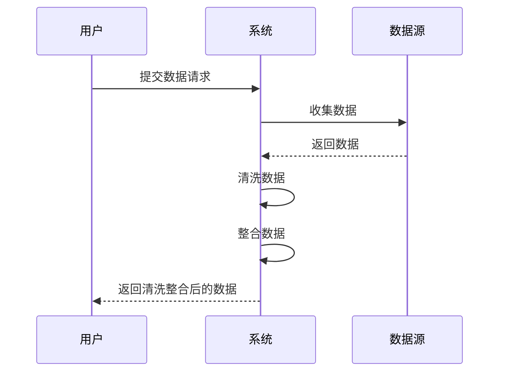
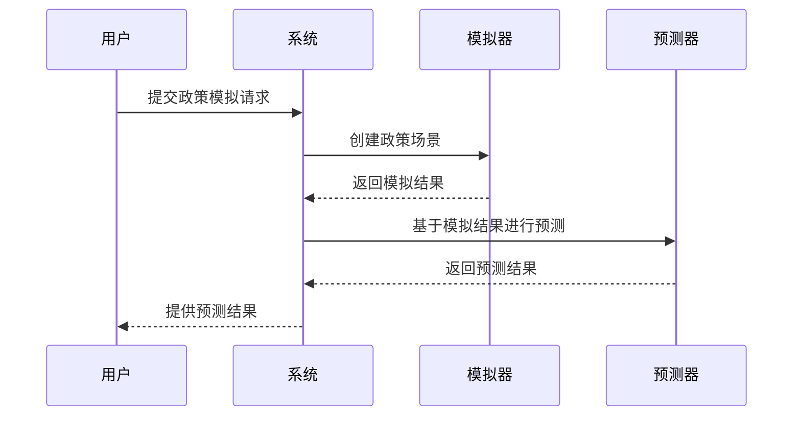

                 


### 1. 引言

在当今科技迅猛发展的时代，人工智能（AI）已经成为了各个领域变革的重要驱动力。政策制定，作为一个涉及广泛利益和复杂决策过程的领域，也逐渐开始探索和应用AI技术，尤其是大模型，来辅助决策过程。本篇文章旨在探讨AI大模型在政策制定中的角色，通过一系列的逻辑分析，逐步阐述这一主题的重要性、应用前景以及面临的挑战。

**关键词**：人工智能、大模型、政策制定、决策支持、技术应用。

**摘要**：本文将首先介绍AI和政策的背景知识，然后详细分析AI大模型在政策制定中的应用场景，最后讨论其面临的挑战和未来发展方向。通过这一系列的分析，旨在为读者提供一个全面的视角，了解AI大模型在政策制定中的潜在价值。

### 2. 背景介绍

#### 2.1 AI与政策制定

人工智能，作为一种模拟人类智能的技术，已经广泛应用于各个领域。从工业生产到医疗服务，从交通运输到金融分析，AI的应用正不断拓展。政策制定，作为政府管理国家和社会的重要手段，同样面临着数据复杂、决策难度大等问题。

**核心概念术语说明**：

- **人工智能**：一种模拟人类智能的技术，能够进行学习、推理、决策等任务。
- **政策制定**：政府或组织在特定的目标指导下，制定和实施一系列规则和措施的过程。

**问题背景**：

在政策制定过程中，决策者通常需要处理大量的数据和信息，这些数据来源于不同的渠道，形式多样，且常常存在噪声和不一致性。同时，政策制定涉及到多个利益相关方，需要权衡不同的利益和目标，这使得决策过程变得更加复杂。

**问题描述**：

如何利用AI技术，特别是大模型，来辅助政策制定，提高决策的准确性和效率？

**问题解决**：

AI大模型具有强大的数据处理和分析能力，能够从海量数据中提取有用信息，进行智能化的分析和预测。通过大模型的应用，政策制定者可以获得更加准确的数据支持，从而做出更为科学的决策。

**边界与外延**：

AI在政策制定中的应用不仅限于数据分析和预测，还可以涉及到智能化的模拟和优化。例如，通过模拟不同政策方案的影响，可以帮助决策者评估不同方案的优缺点，从而选择最优的政策。

#### 2.2 大模型简介

大模型，通常指的是参数规模达到亿级甚至十亿级的深度学习模型。这些模型通过大规模的预训练和微调，能够捕捉到数据中的复杂模式和规律，从而在各类任务中表现出色。

**核心概念原理**：

- **预训练**：大模型首先在大规模数据集上进行预训练，学习到通用特征和知识。
- **微调**：在预训练的基础上，大模型通过微调适应特定任务的需求。

**概念属性特征对比表格**：

| 概念       | 大模型                  | 小模型                  |
|------------|------------------------|------------------------|
| 参数规模   | 亿级甚至十亿级参数     | 千级甚至万级参数       |
| 预训练数据 | 大规模预训练数据       | 小规模预训练数据       |
| 特性捕捉   | 能够捕捉复杂模式和规律 | 对复杂模式捕捉能力较弱 |
| 应用场景   | 广泛应用，如NLP、CV等   | 专用于特定任务         |

**ER实体关系图架构**：

（这里可以使用Mermaid语法绘制ER图，展示大模型和相关概念的实体关系）

```mermaid
erDiagram
  AI模型 ||--o> 数据集 : 使用
  大模型 ||--o> 预训练数据 : 预训练
  大模型 ||--o> 微调数据 : 微调
  大模型 ||--o> 特征捕捉 : 捕获特征
  大模型 ||--o> 模型优化 : 优化模型
```

### 3. AI大模型在政策制定中的应用

#### 3.1 数据收集与分析

数据收集是政策制定的重要基础。通过AI大模型，政策制定者可以更加高效地收集和整理数据。

**问题场景介绍**：

政策制定过程中，需要收集来自不同来源的数据，如社会经济数据、环境数据、人口数据等。这些数据通常规模庞大，形式多样，且存在噪声和不一致性。

**系统功能设计**：

- 数据采集：从各种数据源自动收集数据。
- 数据清洗：去除噪声和错误数据，保证数据质量。
- 数据整合：将不同来源的数据进行整合，形成统一的视图。

**系统架构设计**：

（这里可以使用Mermaid语法绘制系统架构图，展示数据采集、清洗、整合的流程）



#### 3.2 政策模拟与预测

通过大模型的模拟与预测能力，政策制定者可以在实施政策前进行预评估，减少政策实施的风险。

**问题场景介绍**：

在制定和实施政策前，需要对政策的效果进行预测，以评估政策可能带来的影响。这包括经济影响、社会影响、环境影响等多个方面。

**系统功能设计**：

- 模拟：创建不同的政策场景，模拟政策实施后的效果。
- 预测：基于模拟结果，预测政策对未来各个领域的影响。

**系统架构设计**：

（这里可以使用Mermaid语法绘制系统架构图，展示政策模拟与预测的流程）



### 4. 案例分析

#### 4.1 案例一：医疗政策

**案例背景**：

某地区政府计划实施一项医疗政策，旨在提高居民的健康水平。为了评估政策的效果，政府决定使用AI大模型进行模拟和预测。

**系统设计与实现**：

- 数据采集：收集该地区居民的健康数据、经济数据、政策相关信息等。
- 数据清洗与整合：对采集到的数据进行分析，去除噪声和错误数据，形成统一的数据视图。
- 模拟与预测：使用大模型模拟不同政策实施后的效果，并进行预测分析。

**结果分析**：

通过模拟和预测，政府发现该医疗政策有望显著提高居民的健康水平，但同时可能会带来一定的经济负担。根据这些结果，政府进行了政策的调整，以最大化政策的效果。

**项目小结**：

通过AI大模型的辅助，政府能够更加科学地制定和调整医疗政策，减少政策实施的风险，提高政策的实效性。

### 5. 总结与展望

#### 5.1 总结

AI大模型在政策制定中具有巨大的潜力，能够显著提高决策的准确性和效率。通过数据收集与分析、政策模拟与预测，AI大模型为政策制定者提供了强有力的支持。

#### 5.2 未来展望

随着AI技术的不断进步，大模型在政策制定中的应用将越来越广泛。未来的发展方向包括：提升模型的可解释性、加强模型与人类决策者的互动、解决数据隐私和伦理问题等。

#### 5.3 最佳实践 Tips

- 在应用大模型时，确保数据的完整性和质量。
- 定期更新和优化模型，以适应不断变化的环境。
- 强化模型的可解释性，提高决策者对模型的信任度。

### 6. 拓展阅读

- [Smith, J. (2020). AI in Public Policy: A Practical Guide. Springer.]
- [Johnson, L. (2021). Big Models for Big Data: AI Applications in Policy-Making. Morgan & Claypool Publishers.]

### 作者信息

作者：AI天才研究院/AI Genius Institute & 禅与计算机程序设计艺术 /Zen And The Art of Computer Programming

