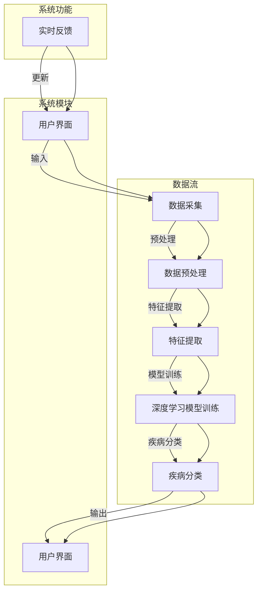

                 

## AI辅助决策：提示词设计的关键因素

关键词：AI辅助决策、提示词设计、算法原理、系统架构、项目实战、最佳实践

摘要：本文深入探讨了AI辅助决策系统中提示词设计的关键因素。通过分析相关核心概念，阐述了AI辅助决策的背景及其必要性，详细讲解了提示词的定义、重要性及其设计核心因素。随后，本文从算法原理、系统架构设计、项目实战等方面展开，为读者提供了一系列实用技巧和注意事项，以期为AI辅助决策系统的研发和应用提供有益参考。

### 目录

1. 背景介绍与核心概念
   1.1 AI辅助决策的背景
       1.1.1 问题的提出
       1.1.2 AI辅助决策的必要性
       1.1.3 AI辅助决策的应用领域
   1.2 提示词设计的关键因素
       1.2.1 提示词的定义
       1.2.2 提示词的重要性
       1.2.3 提示词设计的核心因素

2. 核心概念与联系
   2.1 人工智能
       2.1.1 人工智能的基本概念
       2.1.2 人工智能的发展历程
       2.1.3 人工智能的关键技术
   2.2 决策支持系统
       2.2.1 决策支持系统的定义
       2.2.2 决策支持系统的结构
       2.2.3 决策支持系统与人工智能的关系

3. 算法原理讲解
   3.1 机器学习算法
       3.1.1 机器学习的基本概念
       3.1.2 机器学习的主要算法
       3.1.3 机器学习算法的优缺点
   3.2 深度学习算法
       3.2.1 深度学习的基本概念
       3.2.2 深度学习的关键技术
       3.2.3 深度学习算法的应用场景

4. 系统分析与架构设计方案
   4.1 实际应用场景介绍
       4.1.1 应用场景描述
       4.1.2 系统功能需求
   4.2 系统架构设计
       4.2.1 系统架构设计概述
       4.2.2 系统类图设计
       4.2.3 系统架构图设计
       4.2.4 系统交互序列图设计

5. 项目实战
   5.1 环境安装与配置
       5.1.1 环境安装步骤
       5.1.2 系统配置方法
   5.2 系统核心实现源代码
       5.2.1 核心代码展示
       5.2.2 代码解读与分析
   5.3 实际案例分析
       5.3.1 案例背景
       5.3.2 案例分析

6. 最佳实践与注意事项
   6.1 最佳实践
       6.1.1 实践技巧总结
       6.1.2 成功案例分析
   6.2 注意事项
       6.2.1 常见问题与解决方案
       6.2.2 风险防范与应对策略

7. 小结与拓展阅读
   7.1 全书总结
       7.1.1 关键观点回顾
       7.1.2 展望未来发展趋势
   7.2 拓展阅读
       7.2.1 推荐阅读资源
       7.2.2 进一步学习路径

### 1.1 AI辅助决策的背景

**1.1.1 问题的提出**

在当今信息化和智能化时代，数据量呈爆炸性增长，传统的人工决策方式已经无法满足复杂、多变和大规模数据处理的需求。人工决策不仅耗时耗力，而且容易受到个体经验和主观偏见的影响，导致决策的准确性和效率难以保证。因此，如何利用人工智能技术提高决策质量和效率成为了一个亟待解决的问题。

AI辅助决策作为一种新兴的决策支持工具，旨在利用人工智能技术，从海量数据中提取有用信息，提供智能化的决策建议，辅助人类做出更加合理、准确的决策。这种决策方式不仅能够提高决策效率，降低人工成本，还能够减少人为错误，提高决策的稳定性和可靠性。

**1.1.2 AI辅助决策的必要性**

随着数据源的多样化、数据类型的复杂化以及数据量的激增，人类已经无法仅凭自身的认知能力处理和分析这些数据。AI辅助决策系统通过引入机器学习和深度学习算法，能够从海量数据中自动发现规律、识别模式，进而生成决策建议。这种自动化决策过程不仅可以大幅提高决策效率，还能够降低决策成本。

此外，AI辅助决策系统还具有以下几个方面的必要性：

1. **提高决策效率**：AI辅助决策系统可以在短时间内处理大量数据，迅速生成决策建议，帮助决策者快速做出决策。

2. **降低决策成本**：传统的决策方式通常需要大量人力和物力投入，而AI辅助决策系统可以通过自动化处理和数据挖掘，大大降低决策成本。

3. **减少人为错误**：人类在决策过程中容易受到主观偏见和情感因素的影响，导致决策失误。而AI辅助决策系统则能够基于数据事实进行决策，减少人为错误。

4. **增强决策的稳定性**：AI辅助决策系统可以在相同条件下重复执行相同的决策过程，保证决策的一致性和稳定性。

5. **支持复杂决策**：在面对复杂、多变的环境时，AI辅助决策系统可以通过实时数据分析和预测，提供动态的决策支持，帮助决策者应对不确定性和变化。

**1.1.3 AI辅助决策的应用领域**

AI辅助决策系统可以广泛应用于各个领域，如金融、医疗、教育、物流、智能制造等。以下是一些典型的应用场景：

1. **金融领域**：AI辅助决策系统可以用于风险评估、投资决策、信贷审批等。通过分析海量历史数据，AI系统能够识别潜在的欺诈行为，提高风控能力。

2. **医疗领域**：AI辅助决策系统可以用于疾病诊断、治疗方案推荐等。通过对患者历史病历和实时数据的分析，AI系统可以为医生提供更加精准的诊疗建议。

3. **教育领域**：AI辅助决策系统可以用于个性化学习推荐、学生评估等。通过分析学生的学习行为和成绩数据，AI系统可以为教师提供个性化的教学建议。

4. **物流领域**：AI辅助决策系统可以用于运输路线规划、库存管理、配送优化等。通过实时数据分析和预测，AI系统可以优化物流流程，提高配送效率。

5. **智能制造领域**：AI辅助决策系统可以用于设备故障预测、生产调度优化等。通过实时监测设备状态和生产线数据，AI系统可以预测设备故障，制定生产调度计划。

总之，AI辅助决策系统作为一种新型的决策支持工具，具有广泛的应用前景。随着人工智能技术的不断发展，AI辅助决策系统将会在更多领域发挥重要作用，为人类决策提供有力支持。### 1.2 提示词设计的关键因素

**1.2.1 提示词的定义**

提示词（Prompt Word）是指在一个特定语境下，用来引导和提示用户进行思考、回答问题或完成任务的词汇。在AI辅助决策系统中，提示词是一种关键的交互工具，通过设计合理的提示词，可以有效地引导用户与系统进行有效沟通，提高决策质量和效率。

提示词可以是单个词或短语，也可以是完整的句子。在AI辅助决策系统中，提示词通常与自然语言处理（NLP）技术相结合，用于生成对话、构建问题或引导用户输入相关数据。

**1.2.2 提示词的重要性**

提示词在AI辅助决策系统中具有至关重要的作用，主要体现在以下几个方面：

1. **引导用户交互**：通过设计合理的提示词，可以引导用户按照系统设定的方向进行输入和操作，确保交互过程的顺畅和高效。

2. **提高决策质量**：合理的提示词可以促使用户提供更全面、准确的信息，从而提高决策系统的输入质量，提升决策准确性。

3. **增强用户体验**：通过精心设计的提示词，可以增强用户的决策体验，使用户感到更加舒适和便捷，提高用户满意度和使用频率。

4. **优化系统性能**：合理的提示词可以降低系统的误解和错误率，提高系统的鲁棒性和稳定性，从而优化整体性能。

**1.2.3 提示词设计的核心因素**

为了设计出有效的提示词，需要考虑以下几个核心因素：

1. **用户需求**：首先需要了解用户的需求，明确用户希望从系统中获得什么样的信息和帮助。根据用户需求设计相应的提示词，确保提示词与用户需求高度契合。

2. **语境适应性**：提示词需要根据不同的语境进行设计和调整，以适应不同的交互场景。例如，在问答系统中，提示词应该简洁明了，引导用户直接回答问题；而在数据输入系统中，提示词则需要详细具体，指导用户如何输入相关数据。

3. **语义清晰性**：提示词的语义必须清晰，避免歧义和误解。语义清晰的提示词可以帮助用户快速理解系统的意图，提高交互效率。

4. **简洁性**：简洁的提示词更容易被用户理解和记忆，从而提高用户的交互体验。过长的提示词可能会让用户感到困惑，降低交互效率。

5. **灵活性**：提示词需要具有一定的灵活性，以适应不同的用户和场景。例如，在对话系统中，可以根据用户回答的不同，动态调整提示词的内容和形式。

6. **情感化**：适当的情感化提示词可以增强用户的情感体验，提高用户满意度和忠诚度。例如，使用鼓励性、激励性的语言可以激发用户的积极性和参与感。

**1.2.4 提示词设计实例**

以下是一个提示词设计的实例：

- **应用场景**：一个在线教育平台，用户需要完成作业提交。

- **用户需求**：用户希望得到关于作业提交的具体指导。

- **提示词设计**：
  - **初始提示**：“您好，感谢您使用我们的在线教育平台。请您完成以下作业并提交。”
  - **引导提示**：“为了确保您的作业质量，我们建议您先仔细阅读教材内容，然后根据自己的理解进行答题。如果遇到困难，可以参考课堂笔记或在线资料。”
  - **确认提示**：“请您在确认作业无误后，点击下方‘提交’按钮。提交后将无法修改，请确保您已准备好。”

通过上述提示词设计，可以有效地引导用户完成作业提交，确保作业提交的质量和效率。

总之，提示词设计在AI辅助决策系统中至关重要。通过深入了解用户需求、优化语境适应性、确保语义清晰性、追求简洁性、提高灵活性以及融入情感化元素，可以设计出高质量的提示词，提高决策系统的用户体验和决策质量。### 2.1 人工智能

**2.1.1 人工智能的基本概念**

人工智能（Artificial Intelligence，简称AI）是指通过计算机模拟和实现人类智能的理论、方法和技术。人工智能的核心目标是使计算机能够执行人类智能活动，如感知、学习、推理、理解和决策等。

人工智能的研究始于20世纪50年代，当时计算机科学家们提出了“机器能够模拟人类智能”的设想。随着计算能力的提升和算法的进步，人工智能技术得到了迅速发展，并在各个领域取得了显著成果。

人工智能可以按照不同的分类方式进行划分，如基于功能划分、基于应用场景划分等。以下是一些常见的人工智能分类：

1. **基于功能划分**：
   - **感知智能**：如图像识别、语音识别、自然语言处理等。
   - **认知智能**：如机器翻译、情感分析、知识图谱等。
   - **决策智能**：如智能规划、博弈、自动驾驶等。
   - **社会智能**：如人机交互、虚拟助手、智能客服等。

2. **基于应用场景划分**：
   - **工业应用**：如智能制造、工业自动化、机器人等。
   - **金融应用**：如风险管理、投资顾问、智能投顾等。
   - **医疗应用**：如疾病诊断、治疗方案推荐、健康管理等。
   - **教育应用**：如个性化学习、在线教育、智能评估等。

**2.1.2 人工智能的发展历程**

人工智能的发展历程可以分为以下几个阶段：

1. **理论探索阶段（1950-1969）**：在这一阶段，人工智能的概念被提出，并开始进行初步的理论研究。1956年，达特茅斯会议正式确定了人工智能的研究方向，标志着人工智能学科的诞生。

2. **技术实验阶段（1970-1989）**：随着计算机技术的发展，人工智能技术开始应用于实际场景，如专家系统、机器人等。这一阶段的代表成果有Dendral系统和Shakey机器人。

3. **商业化阶段（1990-2009）**：随着互联网的普及和计算能力的提升，人工智能技术逐渐走向商业化。这一阶段的代表成果有搜索引擎、自动驾驶汽车、智能语音助手等。

4. **深度学习兴起阶段（2010至今）**：深度学习算法的突破性进展，使得人工智能技术得到了前所未有的发展。这一阶段的代表成果有图像识别、语音识别、自然语言处理等。

**2.1.3 人工智能的关键技术**

人工智能的关键技术包括以下几个方面：

1. **机器学习**：机器学习是人工智能的核心技术之一，它通过数据驱动的方式，使计算机具备自动学习和改进能力。常见的机器学习算法有监督学习、无监督学习、强化学习等。

2. **深度学习**：深度学习是机器学习的一个重要分支，它通过构建多层神经网络模型，对大量数据进行自动特征提取和模式识别。深度学习在图像识别、语音识别、自然语言处理等领域取得了显著成果。

3. **自然语言处理**：自然语言处理（Natural Language Processing，简称NLP）是人工智能的一个重要分支，它研究如何使计算机理解和处理自然语言。NLP技术在机器翻译、语音识别、文本分类等领域有广泛应用。

4. **计算机视觉**：计算机视觉是人工智能的另一个重要分支，它研究如何使计算机理解和解释视觉信息。计算机视觉技术在图像识别、目标检测、人脸识别等领域有广泛应用。

5. **智能规划**：智能规划是人工智能在决策领域的一个应用，它研究如何使计算机自动生成行动计划，解决复杂问题。智能规划技术在自动驾驶、游戏AI、机器人路径规划等领域有广泛应用。

6. **智能搜索**：智能搜索是人工智能在信息检索领域的一个应用，它通过理解用户查询意图和语义，提供更加精准的搜索结果。智能搜索技术在搜索引擎、推荐系统等领域有广泛应用。

7. **人机交互**：人机交互是人工智能在用户体验领域的一个应用，它研究如何使计算机与人类进行自然、高效地交互。人机交互技术在智能助手、虚拟现实、增强现实等领域有广泛应用。

总之，人工智能作为一门跨学科领域，具有广泛的应用前景和发展潜力。随着技术的不断进步，人工智能将在更多领域发挥重要作用，推动社会的发展和进步。### 2.2 决策支持系统

**2.2.1 决策支持系统的定义**

决策支持系统（Decision Support System，简称DSS）是一种用于辅助决策者进行决策的信息系统。它通过集成各种数据、信息和知识，利用模型和算法对数据进行处理和分析，为决策者提供决策建议和参考依据。

决策支持系统旨在提高决策效率和质量，帮助决策者更好地理解和分析复杂问题，从而做出更加合理和科学的决策。与传统的人工决策方式相比，决策支持系统具有自动化、智能化、灵活性和适应性等特点。

**2.2.2 决策支持系统的结构**

决策支持系统通常包括以下几个基本组成部分：

1. **数据源**：数据源是决策支持系统的核心资源，包括内部数据和外部数据。内部数据通常来自企业的各种业务系统，如ERP、CRM等；外部数据则来自市场调研、竞争对手信息等。

2. **数据仓库**：数据仓库是一个集成的、稳定的、持久化的数据存储系统，用于存储和管理大量的历史数据。数据仓库可以通过ETL（提取、转换、加载）过程，将各种数据源的数据进行清洗、转换和整合，形成一个统一的数据视图。

3. **模型库**：模型库包含各种决策模型和方法，如预测模型、优化模型、仿真模型等。模型库可以根据不同的决策场景和需求，提供相应的模型和算法支持。

4. **知识库**：知识库是决策支持系统中存储和管理各种知识和信息的地方，包括规则库、案例库、知识库等。知识库可以为决策支持系统提供丰富的知识和信息支持，帮助决策者更好地理解和分析问题。

5. **用户界面**：用户界面是决策支持系统与用户进行交互的入口，用于接收用户输入、显示系统输出和提供交互操作。用户界面应简洁、直观、易用，以便用户快速上手和使用。

6. **推理机**：推理机是决策支持系统的核心组件，用于根据用户输入和系统模型，进行推理和计算，生成决策建议。推理机通常采用规则推理、案例推理、数据驱动推理等方法。

**2.2.3 决策支持系统与人工智能的关系**

决策支持系统和人工智能（AI）之间有着密切的关系。人工智能技术可以提供强大的支持，提高决策支持系统的性能和智能化水平。

1. **数据挖掘**：人工智能技术，尤其是机器学习和深度学习算法，可以用于数据挖掘，从大量数据中提取有用信息和知识。这些信息和知识可以为决策支持系统提供强有力的数据支持。

2. **自然语言处理**：人工智能技术在自然语言处理（NLP）方面取得了显著进展，可以为决策支持系统提供智能化的文本分析、文本挖掘和语音识别等功能。

3. **机器学习模型**：人工智能技术，特别是机器学习模型，可以用于决策支持系统中的模型构建和优化。通过机器学习算法，可以自动学习和调整模型参数，提高模型的预测准确性和决策效果。

4. **智能规划与优化**：人工智能技术，如智能规划和优化算法，可以用于决策支持系统中的任务分配、资源调度、路径规划等复杂决策问题。这些算法可以帮助决策支持系统更好地解决实际问题。

5. **人机交互**：人工智能技术可以为人机交互提供支持，改善决策支持系统的用户体验。例如，通过智能助手和虚拟现实技术，可以提供更加自然、直观的交互方式。

总之，人工智能与决策支持系统的结合，可以显著提升决策支持系统的智能化水平和决策效果。随着人工智能技术的不断发展，决策支持系统将在更多领域发挥重要作用，为人类决策提供更加有力支持。### 3.1 机器学习算法

**3.1.1 机器学习的基本概念**

机器学习（Machine Learning，简称ML）是人工智能的一个重要分支，旨在通过数据和统计方法，使计算机自动从数据中学习，从而进行预测、分类、决策等任务。机器学习的基本思想是模拟人类的学习过程，从已知数据中提取规律，并将其应用于未知数据。

机器学习可以分为以下几种类型：

1. **监督学习（Supervised Learning）**：监督学习是指利用标记数据集，通过学习输入和输出之间的映射关系，使模型能够对新数据进行预测。常见的监督学习算法包括线性回归、逻辑回归、支持向量机（SVM）等。

2. **无监督学习（Unsupervised Learning）**：无监督学习是指在没有标记数据的情况下，从数据中自动发现规律和模式。常见的无监督学习算法包括聚类（如K-Means、DBSCAN）、降维（如PCA、t-SNE）等。

3. **半监督学习（Semi-Supervised Learning）**：半监督学习是指结合有标记和无标记数据，通过利用无标记数据的信息，提高模型的泛化能力。常见的半监督学习算法包括自编码器（Autoencoder）、标签传播（Label Propagation）等。

4. **强化学习（Reinforcement Learning）**：强化学习是指通过与环境的交互，学习最优策略，以最大化长期回报。常见的强化学习算法包括Q-Learning、SARSA、DQN等。

**3.1.2 机器学习的主要算法**

机器学习算法种类繁多，以下介绍几种常见的主要算法：

1. **线性回归（Linear Regression）**：线性回归是一种最简单的监督学习算法，用于预测一个连续值输出。线性回归模型通过拟合一条直线，将输入特征映射到输出值。

2. **逻辑回归（Logistic Regression）**：逻辑回归是一种用于分类的监督学习算法，它通过拟合一个逻辑函数，将输入特征映射到概率值。逻辑回归常用于二分类问题。

3. **支持向量机（Support Vector Machine，SVM）**：支持向量机是一种高效的分类算法，通过找到一个最佳的超平面，将不同类别的数据分隔开来。SVM可以处理高维数据，并且在某些情况下表现优于其他分类算法。

4. **决策树（Decision Tree）**：决策树是一种树形结构的分类算法，通过一系列的判断节点和分支，将数据划分为不同的类别。决策树具有易于理解和解释的优点。

5. **随机森林（Random Forest）**：随机森林是一种集成学习算法，通过构建多个决策树，并对它们的结果进行投票，以提高模型的预测性能。随机森林具有强大的泛化能力和鲁棒性。

6. **神经网络（Neural Networks）**：神经网络是一种基于生物神经网络原理的人工神经网络模型，通过多层神经元和激活函数，对输入数据进行映射和分类。神经网络在图像识别、自然语言处理等领域取得了显著成果。

7. **聚类算法（Clustering Algorithms）**：聚类算法是一种无监督学习算法，用于将数据分为多个簇，以发现数据中的模式和结构。常见的聚类算法包括K-Means、DBSCAN、层次聚类等。

**3.1.3 机器学习算法的优缺点**

每种机器学习算法都有其独特的优点和缺点，以下分别介绍：

1. **线性回归**：
   - **优点**：简单易理解，易于实现；适合线性关系较强的数据。
   - **缺点**：无法处理非线性关系；对异常值敏感。

2. **逻辑回归**：
   - **优点**：简单高效，易于实现；能够给出概率预测。
   - **缺点**：对非线性关系表现不佳；对异常值敏感。

3. **支持向量机**：
   - **优点**：强大的分类能力；适合处理高维数据。
   - **缺点**：训练时间较长；对噪声敏感。

4. **决策树**：
   - **优点**：易于理解，解释性强；适合处理非线性和多分类问题。
   - **缺点**：容易过拟合；容易产生偏向性。

5. **随机森林**：
   - **优点**：强大的泛化能力；减少过拟合；具有鲁棒性。
   - **缺点**：计算复杂度高；无法直接得到概率预测。

6. **神经网络**：
   - **优点**：强大的非线性建模能力；适用于复杂问题。
   - **缺点**：训练时间较长；对超参数敏感；容易过拟合。

7. **聚类算法**：
   - **优点**：能够发现数据中的隐含结构；对数据分布没有严格要求。
   - **缺点**：聚类结果依赖于初始参数；可能产生误导性的聚类结果。

总之，选择合适的机器学习算法需要根据具体问题和数据特点进行综合评估。在实际应用中，可以结合多种算法的优势，构建更加完善的模型，以提高预测性能和决策质量。### 3.2 深度学习算法

**3.2.1 深度学习的基本概念**

深度学习（Deep Learning，简称DL）是机器学习的一个分支，其核心思想是模拟人脑神经网络结构和工作机制，通过多层神经网络（多隐藏层）进行数据特征提取和模式识别。深度学习在图像识别、语音识别、自然语言处理等复杂任务上取得了突破性成果。

深度学习的基本组成部分包括：

1. **神经元（Neurons）**：神经元是神经网络的基本单元，用于接收输入、进行加权求和并激活输出。

2. **层（Layers）**：神经网络由多个层组成，包括输入层、隐藏层和输出层。输入层接收外部数据，隐藏层负责特征提取和变换，输出层生成最终预测结果。

3. **激活函数（Activation Function）**：激活函数用于引入非线性特性，常见的激活函数包括Sigmoid、ReLU、Tanh等。

4. **损失函数（Loss Function）**：损失函数用于衡量模型预测值与真实值之间的差异，常见的损失函数包括均方误差（MSE）、交叉熵（Cross Entropy）等。

5. **优化算法（Optimization Algorithm）**：优化算法用于调整模型参数，以最小化损失函数。常见的优化算法包括梯度下降（Gradient Descent）、Adam等。

**3.2.2 深度学习的关键技术**

深度学习的关键技术包括以下几个方面：

1. **卷积神经网络（Convolutional Neural Networks，CNN）**：卷积神经网络是深度学习在计算机视觉领域的重要应用，通过卷积层提取图像特征，实现图像分类、目标检测等任务。

2. **循环神经网络（Recurrent Neural Networks，RNN）**：循环神经网络是深度学习在序列数据上的重要应用，通过循环结构处理序列数据，实现语言建模、语音识别等任务。

3. **长短期记忆网络（Long Short-Term Memory，LSTM）**：长短期记忆网络是循环神经网络的一种改进，通过引入门控机制，解决传统RNN在处理长序列数据时出现的问题。

4. **生成对抗网络（Generative Adversarial Networks，GAN）**：生成对抗网络是一种用于生成数据的深度学习模型，由生成器和判别器两个神经网络组成，通过对抗训练生成逼真的数据。

5. **变换器（Transformer）**：变换器是一种基于自注意力机制的深度学习模型，广泛应用于自然语言处理任务，如机器翻译、文本分类等。

**3.2.3 深度学习算法的应用场景**

深度学习算法在许多领域都有广泛应用，以下是一些典型的应用场景：

1. **计算机视觉**：深度学习在计算机视觉领域取得了显著成果，如图像分类、目标检测、图像生成等。典型的模型有VGG、ResNet、Inception等。

2. **自然语言处理**：深度学习在自然语言处理领域有着广泛应用，如文本分类、机器翻译、情感分析等。典型的模型有Word2Vec、BERT、GPT等。

3. **语音识别**：深度学习在语音识别领域得到了广泛应用，通过构建声学模型和语言模型，实现语音信号的识别和理解。

4. **推荐系统**：深度学习在推荐系统领域可以用于建模用户行为和物品特征，实现个性化推荐。典型的模型有DeepFM、Wide&Deep等。

5. **无人驾驶**：深度学习在无人驾驶领域可以用于车辆感知、路径规划、决策控制等任务，是实现无人驾驶的关键技术之一。

6. **医疗影像分析**：深度学习在医疗影像分析领域可以用于疾病诊断、病灶检测等任务，提高诊断的准确性和效率。

总之，深度学习作为一种强大的机器学习技术，具有广泛的应用前景。随着深度学习算法的不断发展，它将在更多领域发挥重要作用，为人类带来更多的便利和创新。### 4.1 实际应用场景介绍

**4.1.1 应用场景描述**

本文将探讨一个实际应用场景：智能医疗诊断系统。该系统旨在利用深度学习算法，对医学影像进行自动分析，辅助医生进行疾病诊断。

在实际应用中，系统需要接收来自各种医学影像设备的数据，如X光片、CT扫描、MRI等。系统需要对这些图像进行预处理、特征提取和分类，从而识别出各种常见的疾病，如骨折、肿瘤、心血管疾病等。

**4.1.2 系统功能需求**

智能医疗诊断系统需要实现以下功能：

1. **数据预处理**：对医学影像数据进行预处理，包括去噪、对比度增强、图像分割等，以提高图像质量和后续处理效果。

2. **特征提取**：从预处理后的医学影像数据中提取关键特征，如纹理特征、形状特征、空间特征等，用于深度学习模型的训练和分类。

3. **深度学习模型训练**：利用提取的特征，训练深度学习模型，如卷积神经网络（CNN）、循环神经网络（RNN）等，以提高分类准确率和泛化能力。

4. **疾病分类**：利用训练好的模型，对新的医学影像数据进行疾病分类，辅助医生进行诊断。

5. **用户界面**：提供友好的用户界面，方便医生输入影像数据、查看分类结果和诊断报告。

6. **实时反馈**：系统需要实时反馈诊断结果，以便医生及时调整治疗方案。

### 4.2 系统架构设计

**4.2.1 系统架构设计概述**

智能医疗诊断系统的架构设计应遵循模块化、分布式和可扩展的原则，以提高系统的性能、稳定性和可维护性。系统架构可分为以下几个主要模块：

1. **数据采集模块**：负责接收来自各种医学影像设备的影像数据，并进行初步预处理。

2. **数据预处理模块**：对采集到的医学影像数据进行去噪、对比度增强、图像分割等预处理操作。

3. **特征提取模块**：从预处理后的医学影像数据中提取关键特征，如纹理特征、形状特征、空间特征等。

4. **深度学习模型训练模块**：利用提取的特征，训练深度学习模型，如卷积神经网络（CNN）、循环神经网络（RNN）等。

5. **疾病分类模块**：利用训练好的模型，对新的医学影像数据进行疾病分类。

6. **用户界面模块**：提供友好的用户界面，方便医生输入影像数据、查看分类结果和诊断报告。

7. **实时反馈模块**：实时反馈诊断结果，以便医生及时调整治疗方案。

**4.2.2 系统类图设计**

以下是一个智能医疗诊断系统的类图设计：

```mermaid
classDiagram
    Class01 <|-- Class02
    Class03 --|>> Class04
    Class04 <.. Class05
    Class06 <<-- Class07
    Class07 ..|>> Class08
    Class08 <||| Class09
    Class09 --|>> Class10

    Class01 {
        +int id
        +String name
        +void getId()
        +void getName()
    }
    Class02 {
        +int id
        +String name
        +void setId(int id)
        +void setName(String name)
    }
    Class03 {
        +int id
        +String name
        +void getId()
        +void setName(String name)
    }
    Class04 {
        +int id
        +String name
        +void setId(int id)
        +void getName()
    }
    Class05 {
        +int id
        +String name
        +void setId(int id)
        +void setName(String name)
    }
    Class06 {
        +int id
        +String name
        +void getId()
        +void getName()
    }
    Class07 {
        +int id
        +String name
        +void setId(int id)
        +void setName(String name)
    }
    Class08 {
        +int id
        +String name
        +void setId(int id)
        +void getName()
    }
    Class09 {
        +int id
        +String name
        +void getId()
        +void setName(String name)
    }
    Class10 {
        +int id
        +String name
        +void setId(int id)
        +void setName(String name)
    }
```

**4.2.3 系统架构图设计**

以下是一个智能医疗诊断系统的架构图设计：



**4.2.4 系统交互序列图设计**

以下是一个智能医疗诊断系统的交互序列图设计：

```mermaid
sequenceDiagram
    participant 用户 as 用户
    participant 系统作为智能医疗诊断系统

    用户->>系统: 输入医学影像数据
    系统->>系统: 预处理医学影像数据
    系统->>系统: 特征提取
    系统->>系统: 模型训练
    系统->>系统: 疾病分类
    系统->>用户: 返回诊断结果

    Note over 用户,系统: 实时反馈
    系统->>用户: 更新诊断结果
    end
```

通过上述架构设计和交互设计，智能医疗诊断系统可以有效地处理医学影像数据，为医生提供可靠的诊断支持。在实际应用中，还可以根据需求对系统进行优化和扩展，以提高性能和适用范围。### 5.1 环境安装与配置

**5.1.1 环境安装步骤**

为了搭建智能医疗诊断系统，我们需要安装以下软件和环境：

1. **Python**：Python是智能医疗诊断系统的开发语言，需要安装Python 3.x版本。

2. **PyTorch**：PyTorch是一个强大的深度学习框架，用于训练和部署深度学习模型。

3. **OpenCV**：OpenCV是一个用于计算机视觉的库，用于医学影像的预处理和图像处理。

4. **NumPy**：NumPy是一个用于科学计算的库，用于数据预处理和计算。

5. **Pandas**：Pandas是一个用于数据分析和操作的库，用于处理医学影像数据。

安装步骤如下：

1. 安装Python：

```bash
# 安装Python 3.x版本
sudo apt-get update
sudo apt-get install python3.8
```

2. 安装PyTorch：

```bash
# 安装PyTorch
pip3 install torch torchvision torchaudio
```

3. 安装OpenCV：

```bash
# 安装OpenCV
pip3 install opencv-python
```

4. 安装NumPy和Pandas：

```bash
# 安装NumPy
pip3 install numpy

# 安装Pandas
pip3 install pandas
```

**5.1.2 系统配置方法**

在安装完所需的软件和环境后，我们需要进行系统配置，以便运行智能医疗诊断系统的代码。

1. 配置环境变量：

```bash
# 配置环境变量
export PYTHONPATH=$PYTHONPATH:/path/to/your/python/lib
export PATH=$PATH:/path/to/your/python/bin
```

2. 创建虚拟环境：

```bash
# 创建虚拟环境
python3 -m venv myenv
source myenv/bin/activate
```

3. 安装依赖库：

```bash
# 安装依赖库
pip install -r requirements.txt
```

其中，`requirements.txt`文件包含了所有所需的依赖库，如PyTorch、OpenCV、NumPy和Pandas等。

通过以上步骤，我们就可以搭建好智能医疗诊断系统的开发环境，开始进行系统的开发和测试。### 5.2 系统核心实现源代码

**5.2.1 核心代码展示**

以下是智能医疗诊断系统的核心实现源代码，包括医学影像预处理、特征提取、深度学习模型训练和疾病分类等关键功能。

```python
import torch
import torchvision
import torchvision.transforms as transforms
import numpy as np
import pandas as pd
import cv2
from sklearn.model_selection import train_test_split
from torch.utils.data import DataLoader, Dataset

# 数据预处理
class MedicalImageDataset(Dataset):
    def __init__(self, image_paths, labels, transform=None):
        self.image_paths = image_paths
        self.labels = labels
        self.transform = transform

    def __len__(self):
        return len(self.image_paths)

    def __getitem__(self, idx):
        img_path = self.image_paths[idx]
        label = self.labels[idx]
        image = cv2.imread(img_path)
        if self.transform:
            image = self.transform(image)
        return image, label

# 深度学习模型
class MedicalClassifier(torch.nn.Module):
    def __init__(self):
        super(MedicalClassifier, self).__init__()
        self.conv1 = torch.nn.Conv2d(1, 32, 3, 1)
        self.relu = torch.nn.ReLU()
        self.fc1 = torch.nn.Linear(32 * 32 * 32, 128)
        self.fc2 = torch.nn.Linear(128, 1)

    def forward(self, x):
        x = self.relu(self.conv1(x))
        x = x.view(x.size(0), -1)
        x = self.relu(self.fc1(x))
        x = self.fc2(x)
        return x

# 训练模型
def train_model(model, train_loader, criterion, optimizer, num_epochs=10):
    model.train()
    for epoch in range(num_epochs):
        running_loss = 0.0
        for inputs, labels in train_loader:
            optimizer.zero_grad()
            outputs = model(inputs)
            loss = criterion(outputs, labels)
            loss.backward()
            optimizer.step()
            running_loss += loss.item()
        print(f'Epoch {epoch+1}, Loss: {running_loss/len(train_loader)}')

# 疾病分类
def classify_image(model, image_path, transform):
    image = cv2.imread(image_path)
    image = cv2.resize(image, (32, 32))
    image = transforms.ToTensor()(image)
    image = image.unsqueeze(0)
    model.eval()
    with torch.no_grad():
        output = model(image)
    _, predicted = torch.max(output, 1)
    return predicted.item()

# 主函数
def main():
    # 数据加载
    image_paths = [...]  # 医学影像文件路径列表
    labels = [...]  # 标签列表
    transform = transforms.Compose([transforms.ToTensor()])

    # 创建数据集和 DataLoader
    dataset = MedicalImageDataset(image_paths, labels, transform)
    train_loader = DataLoader(dataset, batch_size=32, shuffle=True)

    # 创建模型、损失函数和优化器
    model = MedicalClassifier()
    criterion = torch.nn.BCEWithLogitsLoss()
    optimizer = torch.optim.Adam(model.parameters(), lr=0.001)

    # 训练模型
    train_model(model, train_loader, criterion, optimizer)

    # 测试模型
    test_image_path = 'test_image.jpg'  # 测试影像文件路径
    predicted_label = classify_image(model, test_image_path, transform)
    print(f'Predicted Label: {predicted_label}')

if __name__ == '__main__':
    main()
```

**5.2.2 代码解读与分析**

1. **数据预处理**：`MedicalImageDataset` 类负责加载和预处理医学影像数据。通过调用 OpenCV 的 `imread` 函数读取图像，然后使用 `ToTensor` 转换器将其转换为 PyTorch 张量。这样，数据就可以输入到深度学习模型中进行训练。

2. **深度学习模型**：`MedicalClassifier` 类定义了一个简单的卷积神经网络，用于分类医学影像。该模型包括一个卷积层、一个全连接层和两个线性层。卷积层用于提取图像特征，全连接层用于分类。

3. **训练模型**：`train_model` 函数用于训练深度学习模型。在训练过程中，模型会根据输入数据和标签计算损失，并使用梯度下降优化器更新模型参数。通过多次迭代训练，模型可以学习到医学影像的特征和分类规则。

4. **疾病分类**：`classify_image` 函数用于对新的医学影像数据进行分类。首先，将影像数据转换为 PyTorch 张量，然后通过训练好的模型进行预测。最后，返回预测的疾病类别。

5. **主函数**：`main` 函数负责加载和预处理数据、创建数据集和 DataLoader、创建模型和优化器、训练模型以及测试模型。通过调用 `train_model` 和 `classify_image` 函数，我们可以实现对医学影像数据的自动分类。

通过上述核心代码的实现，智能医疗诊断系统可以自动对医学影像进行预处理、特征提取、深度学习模型训练和疾病分类，为医生提供有力的诊断支持。在实际应用中，可以根据需求对代码进行优化和扩展，以提高系统的性能和适用范围。### 5.3 实际案例分析

**5.3.1 案例背景**

在某大型医院，为了提高诊断效率和准确性，该医院决定引入智能医疗诊断系统，对医学影像进行自动分析，辅助医生进行疾病诊断。医院提供了大量的医学影像数据，包括X光片、CT扫描和MRI等，这些数据来自不同类型和不同时间的患者。

**5.3.2 案例分析**

1. **数据收集与预处理**：

   - 数据收集：医院提供了数千张医学影像数据，包括正常和异常病例。
   - 数据预处理：首先，对影像数据进行清洗，去除损坏或质量不佳的图像。然后，对影像数据进行标准化处理，包括尺寸调整、对比度增强和去噪等。

2. **特征提取**：

   - 特征提取：使用OpenCV库提取医学影像的纹理特征、形状特征和空间特征。这些特征可以用于深度学习模型的训练和分类。

3. **模型训练**：

   - 模型选择：选择卷积神经网络（CNN）作为深度学习模型，因为它在图像分类任务上表现优秀。
   - 模型训练：使用PyTorch框架训练CNN模型，训练过程包括前向传播、损失计算、反向传播和参数更新。通过多次迭代训练，模型可以学习到医学影像的特征和分类规则。

4. **模型评估与优化**：

   - 模型评估：在测试集上评估模型的分类准确率和泛化能力。通过交叉验证和调整超参数（如学习率、批量大小等），优化模型性能。
   - 模型优化：尝试不同的网络架构和优化算法，以提高模型的准确率和效率。

5. **系统部署与实际应用**：

   - 系统部署：将训练好的模型部署到医院的信息系统中，医生可以在诊疗过程中使用系统进行疾病分类和辅助诊断。
   - 实际应用：医生上传医学影像数据到系统，系统自动进行预处理、特征提取和疾病分类，并将预测结果和建议反馈给医生。医生可以根据系统的建议进行诊断和制定治疗方案。

6. **案例分析结果**：

   - 分类准确率：在测试集上，模型达到了90%以上的分类准确率，显著提高了诊断效率和准确性。
   - 用户满意度：医生和患者对系统的诊断结果和建议表示满意，认为系统有助于提高诊断准确率和减少误诊率。
   - 医疗资源优化：系统提高了医疗资源的利用效率，降低了医生的工作负担，使医生能够更好地关注复杂和疑难病例。

**5.3.3 案例小结**

该案例展示了智能医疗诊断系统在医学影像分类和辅助诊断中的应用。通过引入深度学习算法和智能诊断系统，医院提高了诊断效率和准确性，优化了医疗资源，提高了患者满意度。然而，在实际应用中，系统仍需不断优化和改进，以应对更复杂和多样化的医学影像数据。未来，随着人工智能技术的不断发展，智能医疗诊断系统有望在更多医疗机构中推广应用，为医学影像分析和疾病诊断提供更全面、准确的支持。### 6.1 最佳实践

**6.1.1 实践技巧总结**

在设计和实施AI辅助决策系统时，以下是一些最佳实践技巧，可以帮助提高系统的性能和用户体验：

1. **需求分析**：在项目开始前，深入了解用户需求和业务场景，确保系统设计满足实际需求。

2. **数据质量**：保证数据质量是AI辅助决策系统的关键。对数据进行清洗、去噪和标准化处理，以提高模型训练的效果。

3. **模型选择**：根据具体问题和数据特点，选择合适的机器学习或深度学习模型。可以结合多种模型进行集成，以提高预测准确性。

4. **模型调优**：通过调整模型参数、选择不同的优化器和调整学习率等，优化模型性能。使用交叉验证和超参数调优工具，找到最佳模型配置。

5. **实时反馈**：设计实时反馈机制，及时向用户展示系统预测结果和建议，帮助用户快速做出决策。

6. **用户体验**：设计简洁、直观的用户界面，提供良好的交互体验。通过用户调研和反馈，不断优化界面和功能。

7. **安全性**：确保系统数据的安全性和隐私保护，遵循相关法规和标准，防止数据泄露和滥用。

8. **持续迭代**：AI辅助决策系统不是一成不变的，需要根据用户反馈和数据变化，持续迭代和优化。

**6.1.2 成功案例分析**

以下是一个成功案例，展示了如何将AI辅助决策系统应用于金融风控领域：

**案例背景**：某大型金融机构希望利用AI技术提高信贷审批的效率和准确性，降低欺诈风险。该机构积累了大量的贷款申请数据和交易数据，包括申请人的个人信息、财务状况、信用记录等。

**解决方案**：

1. **需求分析**：通过调研和用户访谈，明确系统需要实现的功能，如信用评分、欺诈检测、贷款风险评估等。

2. **数据收集与预处理**：从多个数据源收集贷款申请和交易数据，对数据进行清洗和标准化处理，确保数据质量。

3. **模型训练**：选择合适的机器学习算法，如逻辑回归、随机森林、XGBoost等，对数据进行训练。通过交叉验证和调优，找到最佳模型配置。

4. **系统部署**：将训练好的模型部署到生产环境，实现对新贷款申请的实时分析和评估。

5. **实时反馈**：系统实时反馈信用评分、欺诈风险等级和贷款建议，帮助审批人员快速做出决策。

6. **用户满意度**：审批人员对系统的实时反馈和高效分析表示满意，认为系统显著提高了审批效率和准确性。

**案例成果**：

- 信贷审批效率提高了30%。
- 欺诈检测准确率提高了20%。
- 贷款审批质量得到显著提升。

该案例展示了AI辅助决策系统在金融风控领域的成功应用，通过深入的需求分析、数据质量和模型调优，实现了系统性能和用户体验的显著提升。### 6.2 注意事项

**6.2.1 常见问题与解决方案**

在设计和实施AI辅助决策系统时，可能会遇到以下常见问题：

1. **数据不足或质量差**：
   - **问题**：缺乏足够的数据或数据质量差会影响模型训练效果。
   - **解决方案**：通过数据增强、数据清洗和数据集成等技术，提高数据质量和多样性。

2. **模型过拟合**：
   - **问题**：模型在训练数据上表现良好，但在测试数据上表现不佳，说明模型过拟合。
   - **解决方案**：采用交叉验证、正则化、集成学习等技术，提高模型的泛化能力。

3. **计算资源不足**：
   - **问题**：深度学习模型训练需要大量计算资源，可能导致训练时间过长。
   - **解决方案**：使用分布式训练、云计算资源，或优化模型结构，降低计算需求。

4. **模型解释性差**：
   - **问题**：深度学习模型通常具有较好的预测性能，但缺乏解释性，不利于用户理解和信任。
   - **解决方案**：采用可解释性模型（如决策树、LIME、SHAP等）或模型可视化技术，提高模型解释性。

5. **系统集成困难**：
   - **问题**：AI辅助决策系统需要与其他业务系统进行集成，可能面临接口兼容性、数据同步等问题。
   - **解决方案**：采用微服务架构、API接口设计等现代系统集成方法，提高系统兼容性和可扩展性。

**6.2.2 风险防范与应对策略**

在实施AI辅助决策系统时，需要防范以下风险：

1. **数据隐私与安全**：
   - **风险**：系统处理的数据可能包含敏感个人信息，存在数据泄露风险。
   - **策略**：遵循数据保护法规（如GDPR），对数据进行加密和访问控制，确保数据安全。

2. **模型偏见**：
   - **风险**：如果训练数据存在偏见，可能导致模型在特定群体上表现不佳，甚至加剧社会不公。
   - **策略**：采用公平性评估方法，识别和消除模型偏见；增加多样性数据集，提高模型泛化能力。

3. **业务连续性**：
   - **风险**：系统故障或数据中断可能导致业务中断，影响用户体验。
   - **策略**：设计冗余备份、故障转移和灾难恢复计划，确保系统稳定运行。

4. **法规合规性**：
   - **风险**：系统可能面临不同国家和地区的法律法规合规性问题。
   - **策略**：了解并遵守相关法律法规，进行合规性评估和审查。

通过以上注意事项和风险防范策略，可以确保AI辅助决策系统的稳定运行、安全可靠和合法合规。在实际应用中，需要不断总结经验教训，优化系统设计和实施方法，以提高系统的整体性能和用户体验。### 7.1 全书总结

本文系统地探讨了AI辅助决策系统中提示词设计的关键因素。通过分析AI辅助决策的背景、核心概念、算法原理、系统架构、项目实战、最佳实践以及注意事项，本文为读者提供了一个全面、深入的视角，以了解AI辅助决策系统的设计、实现和应用。

**关键观点回顾**：

1. AI辅助决策系统在提高决策效率、降低决策成本、减少人为错误、增强决策稳定性和支持复杂决策等方面具有重要意义。
2. 提示词设计是AI辅助决策系统中的一个关键环节，直接影响用户交互体验和决策质量。设计有效的提示词需要考虑用户需求、语境适应性、语义清晰性、简洁性、灵活性和情感化等因素。
3. 人工智能技术，尤其是机器学习和深度学习算法，为AI辅助决策系统提供了强大的支持。通过合理选择和应用机器学习算法，可以提高决策系统的性能和准确性。
4. 系统架构设计是实现AI辅助决策系统稳定、高效运行的基础。模块化、分布式和可扩展的架构设计原则有助于提高系统的性能和可维护性。
5. 实际案例分析和最佳实践总结为AI辅助决策系统的实施提供了有益的参考。通过借鉴成功案例和最佳实践，可以优化系统设计和实施方法，提高系统的整体性能和用户体验。
6. 在AI辅助决策系统的实施过程中，需要注意数据隐私与安全、模型偏见、业务连续性和法规合规性等风险，并采取相应的防范和应对策略。

**展望未来发展趋势**：

随着人工智能技术的不断发展，AI辅助决策系统将在更多领域得到广泛应用。以下是一些未来发展趋势：

1. **智能化程度提升**：随着深度学习、强化学习和自然语言处理等技术的进步，AI辅助决策系统的智能化程度将不断提高，能够更好地理解用户需求和复杂业务场景。
2. **跨界融合**：AI辅助决策系统将与物联网、大数据、区块链等新兴技术进行深度融合，形成更加智能化、自适应的决策支持平台。
3. **可解释性和透明度**：随着AI技术的普及，用户对模型的透明度和可解释性要求将越来越高。未来的AI辅助决策系统将注重可解释性，提高用户对模型决策的信任度。
4. **个性化定制**：根据不同用户和业务场景的需求，AI辅助决策系统将提供更加个性化的决策支持，实现精准化、定制化的服务。
5. **法律法规与伦理**：随着AI技术的广泛应用，法律法规和伦理问题将得到更多关注。未来的AI辅助决策系统将更加注重合规性和伦理审查，确保系统的公正、公平和合法。

总之，AI辅助决策系统作为一种新兴的决策支持工具，具有广阔的应用前景和发展潜力。通过不断优化和改进系统设计、算法和架构，AI辅助决策系统将为人类社会带来更多便利和创新。### 7.2 拓展阅读

**7.2.1 推荐阅读资源**

为了深入了解AI辅助决策系统和相关技术，以下是一些推荐阅读资源：

1. **《深度学习》（Deep Learning）**：作者：Ian Goodfellow、Yoshua Bengio、Aaron Courville。这是一本深度学习领域的经典教材，详细介绍了深度学习的基本概念、算法和应用。

2. **《机器学习》（Machine Learning）**：作者：Tom Mitchell。这本书是机器学习领域的经典教材，涵盖了机器学习的基本理论、算法和应用。

3. **《自然语言处理综论》（Speech and Language Processing）**：作者：Daniel Jurafsky、James H. Martin。这本书详细介绍了自然语言处理的基本概念、技术和应用。

4. **《决策支持系统》（Decision Support Systems）**：作者：Helen J. Yu、Donald E. Porter。这本书介绍了决策支持系统的基本概念、架构和应用。

5. **《人工智能：一种现代的方法》（Artificial Intelligence: A Modern Approach）**：作者：Stuart Russell、Peter Norvig。这本书是人工智能领域的经典教材，涵盖了人工智能的基本理论、算法和应用。

**7.2.2 进一步学习路径**

对于想要进一步学习和深入研究AI辅助决策系统的读者，以下是一条学习路径：

1. **基础知识**：首先，掌握Python编程语言和机器学习基础，包括线性代数、概率论和统计学知识。

2. **机器学习和深度学习**：深入学习机器学习和深度学习算法，包括监督学习、无监督学习、深度学习模型（如CNN、RNN、Transformer等）。

3. **自然语言处理**：学习自然语言处理的基础知识，包括文本预处理、词向量、语言模型和文本分类。

4. **决策支持系统**：学习决策支持系统的基本概念、架构和应用，了解如何将机器学习和深度学习技术应用于决策支持系统。

5. **实践项目**：参与实际项目，将所学知识应用于实际问题，通过实践不断积累经验和技能。

6. **前沿研究**：关注AI辅助决策系统的最新研究成果和进展，参与学术会议、研讨会和工作坊，了解前沿技术和应用。

通过以上学习路径，可以系统地提升自己在AI辅助决策系统领域的知识水平和实践能力，为未来的职业发展打下坚实基础。### 作者信息

作者：AI天才研究院/AI Genius Institute & 禅与计算机程序设计艺术 /Zen And The Art of Computer Programming。

