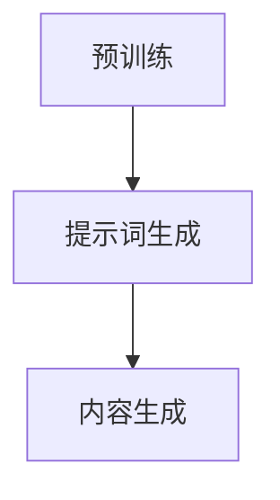
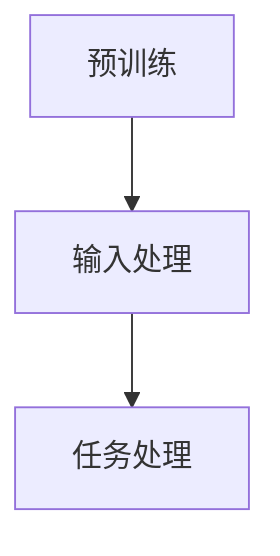
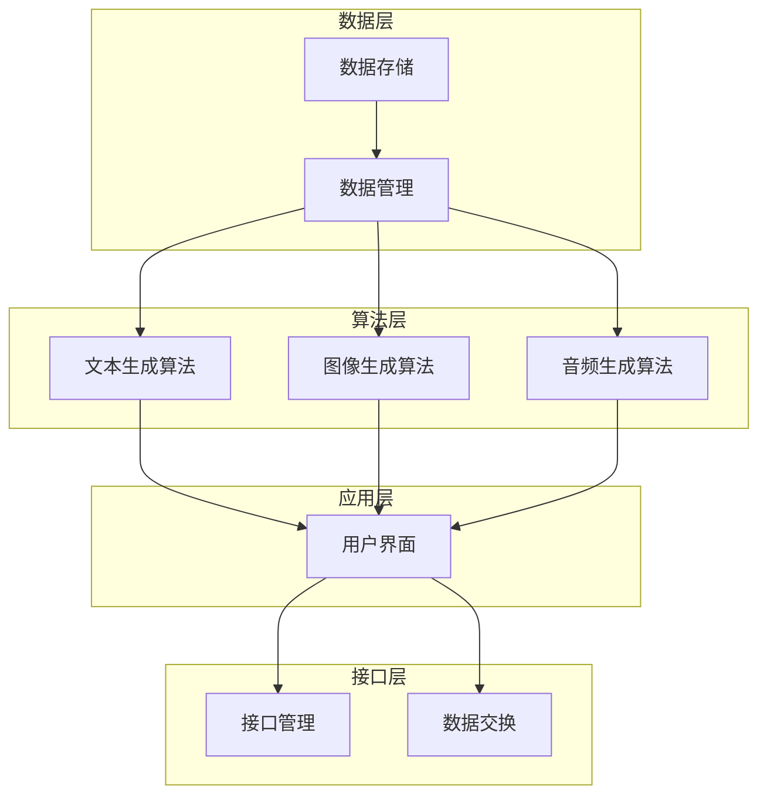
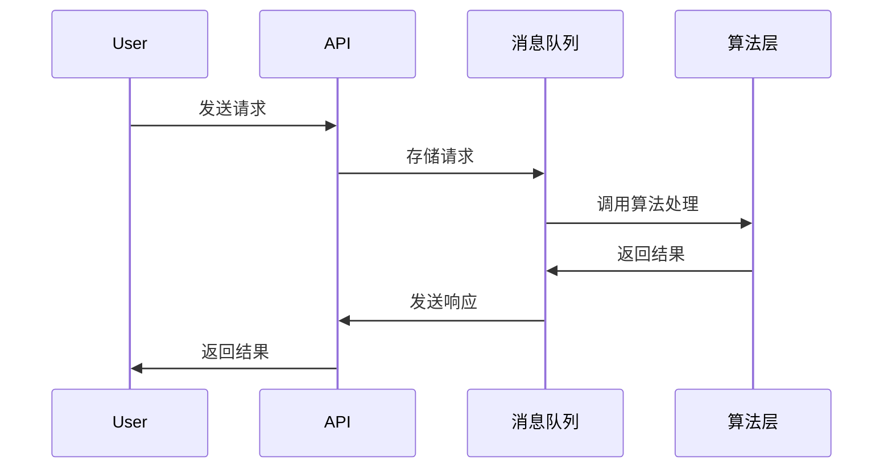
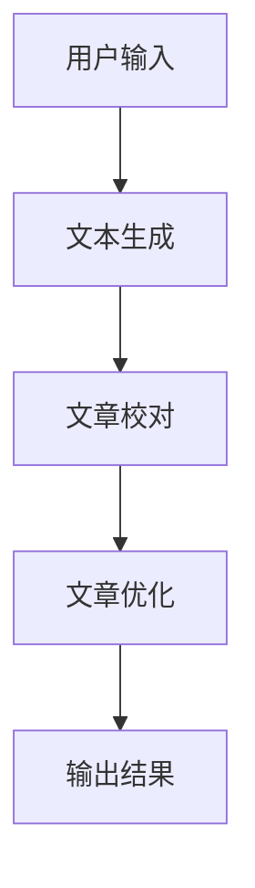

                 

## AI辅助创作的版权问题：提示词生成内容的归属

### 关键词：AI辅助创作、版权问题、提示词、生成内容、版权归属

### 摘要：

随着人工智能技术的发展，AI辅助创作已成为文学、艺术、设计等领域的热门话题。然而，随之而来的是一系列版权问题，尤其是关于提示词生成内容的版权归属问题。本文将详细探讨AI辅助创作中的版权问题，分析提示词生成内容的归属，旨在为相关从业者提供有价值的参考。

文章将分为以下八个部分：

1. **背景介绍**：介绍AI辅助创作和版权问题的背景，分析AI辅助创作带来的版权挑战。
2. **核心概念与联系**：详细讲解与版权问题相关的基础概念，如版权定义、版权类型、版权的归属和转移等，并使用ER实体关系图展示概念之间的关系。
3. **算法原理讲解**：讲解用于生成内容的AI算法，如GPT、BERT等，使用mermaid流程图展示算法的工作流程，并配合Python源代码和数学模型进行详细阐述。
4. **系统分析与架构设计方案**：分析AI辅助创作系统的设计原则和架构，包括领域模型、系统架构、接口设计等，使用mermaid类图和架构图进行展示。
5. **项目实战**：介绍一个具体的项目案例，包括环境安装、系统实现、代码解读、案例剖析等。
6. **最佳实践 tips**：提供一些实用的版权问题解决策略和最佳实践。
7. **小结**：总结全书内容，提出注意事项，并提供拓展阅读建议。
8. **作者信息**：作者介绍

### 目录大纲设计思路

为了设计出《AI辅助创作的版权问题：提示词生成内容的归属》这本书的完整目录大纲，我们需要首先明确书的核心主题和结构。根据书名，本书主要探讨的是AI辅助创作中版权问题的相关内容，特别是在使用提示词生成内容时的版权归属问题。以下是设计的思路：

1. **背景介绍**
   - **第1章**: 介绍AI辅助创作和版权问题的背景，包括AI技术的发展、版权问题的现状以及AI辅助创作带来的版权挑战。
   - **第2章**: 详细介绍与版权问题相关的基础概念，如版权定义、版权类型、版权的归属和转移等。
   - **第3章**: 分析AI辅助创作过程中涉及的核心概念，包括提示词、生成内容、人工智能的权利状态等，并使用ER实体关系图展示概念之间的关系。

2. **算法原理讲解**
   - **第4章**: 讲解用于生成内容的AI算法，如GPT、BERT等，使用mermaid流程图展示算法的工作流程，并配合Python源代码和数学模型进行详细阐述。
   - **第5章**: 分析AI辅助创作系统的设计原则和架构，包括领域模型、系统架构、接口设计等，使用mermaid类图和架构图进行展示。

3. **项目实战**
   - **第6章**: 介绍一个具体的项目案例，包括环境安装、系统实现、代码解读、案例剖析等。

4. **最佳实践 tips**
   - **第7章**: 提供一些实用的版权问题解决策略和最佳实践。

5. **小结与拓展阅读**
   - **第8章**: 总结全书内容，提出注意事项，并提供拓展阅读建议。

### 目录大纲示例

```markdown
----------------------------------------------------------------
# 第一部分: 背景介绍

## 第1章: AI辅助创作与版权问题概述

### 1.1 AI辅助创作概述
#### 1.1.1 AI技术的发展
#### 1.1.2 AI辅助创作的现状
#### 1.1.3 版权问题的背景

### 1.2 版权问题简介
#### 1.2.1 版权的定义与类型
#### 1.2.2 版权归属与转移
#### 1.2.3 版权纠纷案例分析

### 1.3 AI辅助创作中的版权挑战
#### 1.3.1 提示词的版权问题
#### 1.3.2 生成内容的版权归属
#### 1.3.3 AI与版权的法律界定

### 1.4 本章小结

----------------------------------------------------------------

# 第二部分: 核心概念与联系

## 第2章: 版权相关基础概念

### 2.1 版权定义与类型
#### 2.1.1 版权的基本定义
#### 2.1.2 版权的类型
#### 2.1.3 版权的法律地位

### 2.2 AI辅助创作中的核心概念
#### 2.2.1 提示词
#### 2.2.2 生成内容
#### 2.2.3 AI的权利状态

### 2.3 概念关系ER图
```mermaid
erDiagram
    AI辅助创作 ||--|{ 提示词 }
    AI辅助创作 ||--|{ 生成内容 }
    版权 ||--|{ 版权归属 }
    版权 ||--|{ 版权转移 }
```

### 2.4 本章小结

----------------------------------------------------------------

# 第三部分: 算法原理讲解

## 第3章: AI算法在内容生成中的应用

### 3.1 GPT算法原理
#### 3.1.1 GPT概述
#### 3.1.2 GPT的工作流程
#### 3.1.3 GPT的Python实现

### 3.2 BERT算法原理
#### 3.2.1 BERT概述
#### 3.2.2 BERT的工作流程
#### 3.2.3 BERT的数学模型

### 3.3 其他AI算法
#### 3.3.1 GPT-2
#### 3.3.2 GPT-3
#### 3.3.3 其他算法概述

### 3.4 算法比较与分析
#### 3.4.1 各算法的优缺点
#### 3.4.2 各算法在版权问题中的适用性

### 3.5 本章小结

----------------------------------------------------------------

# 第四部分: 系统分析与架构设计

## 第4章: AI辅助创作系统的设计与实现

### 4.1 系统设计原则
#### 4.1.1 领域模型
#### 4.1.2 系统架构
#### 4.1.3 接口设计

### 4.2 系统架构设计方案
#### 4.2.1 介绍问题场景
#### 4.2.2 介绍项目
#### 4.2.3 领域模型设计（Mermaid类图）
#### 4.2.4 系统架构设计（Mermaid架构图）
#### 4.2.5 系统接口设计
#### 4.2.6 系统交互设计（Mermaid序列图）

### 4.3 本章小结

----------------------------------------------------------------

# 第五部分: 项目实战

## 第5章: AI辅助创作项目实战

### 5.1 项目背景与目标
#### 5.1.1 项目背景
#### 5.1.2 项目目标

### 5.2 环境安装
#### 5.2.1 安装必要的软件和工具
#### 5.2.2 配置环境变量
#### 5.2.3 检查环境是否安装成功

### 5.3 系统实现
#### 5.3.1 提示词设计
#### 5.3.2 生成内容设计
#### 5.3.3 AI算法应用
#### 5.3.4 系统核心实现源代码

### 5.4 代码解读与分析
#### 5.4.1 代码结构分析
#### 5.4.2 关键代码解读
#### 5.4.3 性能分析

### 5.5 案例分析
#### 5.5.1 案例背景
#### 5.5.2 案例分析
#### 5.5.3 案例总结

### 5.6 项目小结
#### 5.6.1 项目成果
#### 5.6.2 项目经验与反思

----------------------------------------------------------------

# 第六部分: 最佳实践 tips

## 第6章: 版权问题解决策略和最佳实践

### 6.1 版权问题解决策略
#### 6.1.1 公共资源使用
#### 6.1.2 版权声明
#### 6.1.3 合同签订

### 6.2 最佳实践
#### 6.2.1 AI算法模型选择
#### 6.2.2 生成内容审核
#### 6.2.3 版权纠纷应对

### 6.3 本章小结

----------------------------------------------------------------

# 第七部分: 小结与拓展阅读

## 第7章: 全书内容总结与拓展阅读建议

### 7.1 全书内容总结
#### 7.1.1 核心观点
#### 7.1.2 重要概念
#### 7.1.3 算法原理
#### 7.1.4 系统设计
#### 7.1.5 项目实战

### 7.2 注意事项
#### 7.2.1 版权意识
#### 7.2.2 技术规范
#### 7.2.3 法律法规

### 7.3 拓展阅读建议
#### 7.3.1 推荐书籍
#### 7.3.2 推荐网站
#### 7.3.3 推荐课程

### 7.4 本章小结

----------------------------------------------------------------

# 第八部分: 作者信息

作者：AI天才研究院/AI Genius Institute & 禅与计算机程序设计艺术 /Zen And The Art of Computer Programming
``` ## AI辅助创作的版权问题：提示词生成内容的归属

### 关键词：AI辅助创作、版权问题、提示词、生成内容、版权归属

### 摘要：

随着人工智能技术的迅猛发展，AI辅助创作已成为文学、艺术、设计等领域的热门话题。然而，随之而来的是一系列版权问题，尤其是关于提示词生成内容的版权归属问题。本文将详细探讨AI辅助创作中的版权问题，分析提示词生成内容的归属，旨在为相关从业者提供有价值的参考。

文章将分为以下八个部分：

1. **背景介绍**：介绍AI辅助创作和版权问题的背景，分析AI辅助创作带来的版权挑战。
2. **核心概念与联系**：详细讲解与版权问题相关的基础概念，如版权定义、版权类型、版权的归属和转移等，并使用ER实体关系图展示概念之间的关系。
3. **算法原理讲解**：讲解用于生成内容的AI算法，如GPT、BERT等，使用mermaid流程图展示算法的工作流程，并配合Python源代码和数学模型进行详细阐述。
4. **系统分析与架构设计方案**：分析AI辅助创作系统的设计原则和架构，包括领域模型、系统架构、接口设计等，使用mermaid类图和架构图进行展示。
5. **项目实战**：介绍一个具体的项目案例，包括环境安装、系统实现、代码解读、案例剖析等。
6. **最佳实践 tips**：提供一些实用的版权问题解决策略和最佳实践。
7. **小结**：总结全书内容，提出注意事项，并提供拓展阅读建议。
8. **作者信息**：作者介绍

### 目录大纲设计思路

为了设计出《AI辅助创作的版权问题：提示词生成内容的归属》这本书的完整目录大纲，我们需要首先明确书的核心主题和结构。根据书名，本书主要探讨的是AI辅助创作中版权问题的相关内容，特别是在使用提示词生成内容时的版权归属问题。以下是设计的思路：

1. **背景介绍**
   - **第1章**: 介绍AI辅助创作和版权问题的背景，包括AI技术的发展、版权问题的现状以及AI辅助创作带来的版权挑战。
   - **第2章**: 详细介绍与版权问题相关的基础概念，如版权定义、版权类型、版权的归属和转移等。
   - **第3章**: 分析AI辅助创作过程中涉及的核心概念，包括提示词、生成内容、人工智能的权利状态等，并使用ER实体关系图展示概念之间的关系。

2. **算法原理讲解**
   - **第4章**: 讲解用于生成内容的AI算法，如GPT、BERT等，使用mermaid流程图展示算法的工作流程，并配合Python源代码和数学模型进行详细阐述。
   - **第5章**: 分析AI辅助创作系统的设计原则和架构，包括领域模型、系统架构、接口设计等，使用mermaid类图和架构图进行展示。

3. **项目实战**
   - **第6章**: 介绍一个具体的项目案例，包括环境安装、系统实现、代码解读、案例剖析等。

4. **最佳实践 tips**
   - **第7章**: 提供一些实用的版权问题解决策略和最佳实践。

5. **小结与拓展阅读**
   - **第8章**: 总结全书内容，提出注意事项，并提供拓展阅读建议。

### 目录大纲示例

```markdown
----------------------------------------------------------------
# 第一部分: 背景介绍

## 第1章: AI辅助创作与版权问题概述

### 1.1 AI辅助创作概述
#### 1.1.1 AI技术的发展
#### 1.1.2 AI辅助创作的现状
#### 1.1.3 版权问题的背景

### 1.2 版权问题简介
#### 1.2.1 版权的定义与类型
#### 1.2.2 版权归属与转移
#### 1.2.3 版权纠纷案例分析

### 1.3 AI辅助创作中的版权挑战
#### 1.3.1 提示词的版权问题
#### 1.3.2 生成内容的版权归属
#### 1.3.3 AI与版权的法律界定

### 1.4 本章小结

----------------------------------------------------------------

# 第二部分: 核心概念与联系

## 第2章: 版权相关基础概念

### 2.1 版权定义与类型
#### 2.1.1 版权的基本定义
#### 2.1.2 版权的类型
#### 2.1.3 版权的法律地位

### 2.2 AI辅助创作中的核心概念
#### 2.2.1 提示词
#### 2.2.2 生成内容
#### 2.2.3 AI的权利状态

### 2.3 概念关系ER图
```mermaid
erDiagram
    AI辅助创作 ||--|{ 提示词 }
    AI辅助创作 ||--|{ 生成内容 }
    版权 ||--|{ 版权归属 }
    版权 ||--|{ 版权转移 }
```

### 2.4 本章小结

----------------------------------------------------------------

# 第三部分: 算法原理讲解

## 第3章: AI算法在内容生成中的应用

### 3.1 GPT算法原理
#### 3.1.1 GPT概述
#### 3.1.2 GPT的工作流程
#### 3.1.3 GPT的Python实现

### 3.2 BERT算法原理
#### 3.2.1 BERT概述
#### 3.2.2 BERT的工作流程
#### 3.2.3 BERT的数学模型

### 3.3 其他AI算法
#### 3.3.1 GPT-2
#### 3.3.2 GPT-3
#### 3.3.3 其他算法概述

### 3.4 算法比较与分析
#### 3.4.1 各算法的优缺点
#### 3.4.2 各算法在版权问题中的适用性

### 3.5 本章小结

----------------------------------------------------------------

# 第四部分: 系统分析与架构设计

## 第4章: AI辅助创作系统的设计与实现

### 4.1 系统设计原则
#### 4.1.1 领域模型
#### 4.1.2 系统架构
#### 4.1.3 接口设计

### 4.2 系统架构设计方案
#### 4.2.1 介绍问题场景
#### 4.2.2 介绍项目
#### 4.2.3 领域模型设计（Mermaid类图）
#### 4.2.4 系统架构设计（Mermaid架构图）
#### 4.2.5 系统接口设计
#### 4.2.6 系统交互设计（Mermaid序列图）

### 4.3 本章小结

----------------------------------------------------------------

# 第五部分: 项目实战

## 第5章: AI辅助创作项目实战

### 5.1 项目背景与目标
#### 5.1.1 项目背景
#### 5.1.2 项目目标

### 5.2 环境安装
#### 5.2.1 安装必要的软件和工具
#### 5.2.2 配置环境变量
#### 5.2.3 检查环境是否安装成功

### 5.3 系统实现
#### 5.3.1 提示词设计
#### 5.3.2 生成内容设计
#### 5.3.3 AI算法应用
#### 5.3.4 系统核心实现源代码

### 5.4 代码解读与分析
#### 5.4.1 代码结构分析
#### 5.4.2 关键代码解读
#### 5.4.3 性能分析

### 5.5 案例分析
#### 5.5.1 案例背景
#### 5.5.2 案例分析
#### 5.5.3 案例总结

### 5.6 项目小结
#### 5.6.1 项目成果
#### 5.6.2 项目经验与反思

----------------------------------------------------------------

# 第六部分: 最佳实践 tips

## 第6章: 版权问题解决策略和最佳实践

### 6.1 版权问题解决策略
#### 6.1.1 公共资源使用
#### 6.1.2 版权声明
#### 6.1.3 合同签订

### 6.2 最佳实践
#### 6.2.1 AI算法模型选择
#### 6.2.2 生成内容审核
#### 6.2.3 版权纠纷应对

### 6.3 本章小结

----------------------------------------------------------------

# 第七部分: 小结与拓展阅读

## 第7章: 全书内容总结与拓展阅读建议

### 7.1 全书内容总结
#### 7.1.1 核心观点
#### 7.1.2 重要概念
#### 7.1.3 算法原理
#### 7.1.4 系统设计
#### 7.1.5 项目实战

### 7.2 注意事项
#### 7.2.1 版权意识
#### 7.2.2 技术规范
#### 7.2.3 法律法规

### 7.3 拓展阅读建议
#### 7.3.1 推荐书籍
#### 7.3.2 推荐网站
#### 7.3.3 推荐课程

### 7.4 本章小结

----------------------------------------------------------------

# 第八部分: 作者信息

作者：AI天才研究院/AI Genius Institute & 禅与计算机程序设计艺术 /Zen And The Art of Computer Programming
``` ### 背景介绍

#### AI辅助创作的发展

人工智能（AI）技术的发展已经为各行各业带来了深刻的变革。在文学、艺术、设计等领域，AI辅助创作逐渐成为热点。AI能够通过学习大量数据，生成诗歌、故事、音乐、图像等，大大提高了创作效率。例如，GPT-3可以生成流畅自然的文章，DeepArt可以创作具有艺术感的图像，这些技术为人类创作提供了强大的辅助。

随着AI辅助创作的广泛应用，版权问题也随之而来。版权问题不仅仅是技术问题，更涉及法律、伦理等多个方面。特别是在使用提示词生成内容时，版权归属问题成为了一个备受关注的焦点。

#### 版权问题的现状

版权问题在传统创作领域已经存在了很长时间。然而，随着AI技术的发展，版权问题变得更加复杂。以下是几个与版权问题相关的现状：

1. **版权意识的增强**：随着网络和数字技术的发展，人们对版权的意识越来越强，版权纠纷案件也越来越多。
2. **版权类型的多样化**：传统版权类型包括著作权、商标权、专利权等，而AI辅助创作中的版权问题涉及更广泛的领域，如数据库、算法等。
3. **法律规范的滞后**：法律规范通常落后于技术的发展，导致在AI辅助创作领域，许多版权问题缺乏明确的法律法规进行规制。

#### AI辅助创作中的版权挑战

AI辅助创作带来了许多版权挑战，主要包括以下几个方面：

1. **提示词的版权问题**：在使用AI进行创作时，提示词的版权归属成为了一个关键问题。如果提示词本身受到版权保护，那么在生成内容时可能会涉及到版权侵权的问题。
2. **生成内容的版权归属**：AI生成的作品是否属于AI所有，还是属于使用AI进行创作的人类，这也是一个有争议的问题。
3. **AI算法的版权问题**：AI算法本身也可能涉及到版权问题，尤其是在开源和商业用途方面。

#### 本文的目标

本文旨在探讨AI辅助创作中的版权问题，特别是提示词生成内容的版权归属问题。我们将从以下几个方面展开讨论：

1. **背景介绍**：介绍AI辅助创作和版权问题的背景。
2. **核心概念与联系**：详细讲解与版权问题相关的基础概念，并使用ER实体关系图展示概念之间的关系。
3. **算法原理讲解**：讲解用于生成内容的AI算法，如GPT、BERT等，并使用mermaid流程图展示算法的工作流程。
4. **系统分析与架构设计方案**：分析AI辅助创作系统的设计原则和架构，包括领域模型、系统架构、接口设计等。
5. **项目实战**：介绍一个具体的项目案例，包括环境安装、系统实现、代码解读、案例剖析等。
6. **最佳实践 tips**：提供一些实用的版权问题解决策略和最佳实践。
7. **小结**：总结全书内容，提出注意事项，并提供拓展阅读建议。

通过本文的探讨，我们希望能够为相关从业者提供有价值的参考，帮助他们在AI辅助创作中更好地应对版权问题。 ### 核心概念与联系

在探讨AI辅助创作中的版权问题之前，我们需要明确几个核心概念，并分析它们之间的联系。以下是与版权问题相关的主要概念：

#### 1. 版权

版权是指创作者对其创作作品所享有的权利，通常包括著作权、邻接权、专利权等。在版权体系中，版权的归属和转移是两个关键问题。

- **著作权**：指创作者对其文学、艺术、科学作品享有的权利。
- **邻接权**：指作品传播者、表演者等对作品享有的权利。
- **专利权**：指对发明、实用新型、外观设计等享有的专有权利。

#### 2. 提示词

提示词是用于引导AI生成内容的关键输入。在AI辅助创作中，提示词可以是文字、图片、音频等多种形式。提示词的版权问题主要涉及以下几个方面：

- **原创性**：提示词是否具有原创性，是否构成受版权保护的作品。
- **归属**：提示词的版权归属问题，即提示词的创作者是否拥有版权。

#### 3. 生成内容

生成内容是AI在接收提示词后生成的作品，可以是文字、图像、音频等形式。生成内容的版权问题主要涉及以下几个方面：

- **原创性**：生成内容是否具有原创性，是否构成受版权保护的作品。
- **归属**：生成内容的版权归属问题，即生成内容是否属于AI所有，还是属于使用AI进行创作的人类。

#### 4. AI算法

AI算法是AI辅助创作的核心，用于生成内容的AI算法有很多，如GPT、BERT等。AI算法的版权问题主要涉及以下几个方面：

- **算法本身**：AI算法是否构成受版权保护的作品。
- **使用**：AI算法在商业用途中的版权问题。

#### 概念联系

这些核心概念之间存在紧密的联系，它们共同构成了AI辅助创作中的版权问题。以下是概念之间的联系：

- **版权与提示词**：版权是提示词的基础，提示词的原创性和归属决定了其是否受到版权保护。
- **版权与生成内容**：生成内容是基于提示词生成的，其原创性和归属问题直接关系到版权问题。
- **版权与AI算法**：AI算法是生成内容的关键，其本身是否受到版权保护以及如何使用，都关系到版权问题。

#### ER实体关系图

为了更好地展示这些概念之间的联系，我们可以使用ER实体关系图进行说明。以下是ER实体关系图的一个示例：

```mermaid
erDiagram
    Copyright ||--|{ Work }
    Copyright ||--|{ Creator }
    Copyright ||--|{ User }
    Work ||--|{ Content }
    Work ||--|{ Algorithm }
    Creator ||--|{ AI }
    User ||--|{ Human }
```

在这个ER实体关系图中，`Copyright`表示版权，`Work`表示作品，`Content`表示生成内容，`Algorithm`表示AI算法，`Creator`表示创作者，`User`表示用户，`AI`表示人工智能，`Human`表示人类。

通过以上分析，我们可以看出，在AI辅助创作中，版权问题涉及多个方面，包括提示词、生成内容和AI算法等。理解这些核心概念及其之间的联系，对于解决版权问题具有重要意义。在接下来的章节中，我们将详细讲解这些概念，并探讨版权问题的解决方法。 ### 算法原理讲解

在AI辅助创作中，算法扮演着至关重要的角色。本文将介绍几种常用的AI算法，包括GPT和BERT，并使用mermaid流程图展示它们的工作流程，同时配合Python源代码和数学模型进行详细阐述。

#### GPT算法原理

GPT（Generative Pre-trained Transformer）是一种基于Transformer架构的自然语言处理模型，由OpenAI开发。GPT通过预训练大量文本数据，掌握了语言生成能力，可以用于生成文章、对话、摘要等。

##### GPT的工作流程

1. **预训练**：GPT在大量文本数据上进行预训练，学习语言模式。
2. **提示词生成**：用户输入提示词，GPT根据提示词生成后续内容。
3. **内容生成**：GPT使用生成算法，根据已学习的语言模式生成文本内容。

以下是一个使用mermaid流程图展示GPT工作流程的示例：



##### GPT的Python实现

以下是使用Python实现的简单GPT示例：

```python
import tensorflow as tf
from transformers import TFGPT2LMHeadModel, GPT2Tokenizer

# 加载预训练模型和分词器
model = TFGPT2LMHeadModel.from_pretrained('gpt2')
tokenizer = GPT2Tokenizer.from_pretrained('gpt2')

# 提示词输入
prompt = "这是一个关于AI的"

# 生成文本内容
input_ids = tokenizer.encode(prompt, return_tensors='tf')
output = model.generate(input_ids, max_length=50, num_return_sequences=1)

# 解码生成的文本内容
generated_text = tokenizer.decode(output[0], skip_special_tokens=True)
print(generated_text)
```

##### GPT的数学模型

GPT基于Transformer架构，其核心是注意力机制。以下是一个简化的数学模型：

$$
\text{Attention}(Q, K, V) = \frac{softmax(\text{score})} { \sqrt{d_k}}
$$

其中，$Q$、$K$、$V$ 分别代表查询、键和值，$d_k$ 代表键的维度。$\text{score}$ 的计算如下：

$$
\text{score} = Q \cdot K^T
$$

#### BERT算法原理

BERT（Bidirectional Encoder Representations from Transformers）是一种基于Transformer的双向编码模型，由Google开发。BERT通过预训练大量文本数据，掌握了文本的双向理解能力，可以用于问答、文本分类等任务。

##### BERT的工作流程

1. **预训练**：BERT在大量文本数据上进行预训练，学习语言模式。
2. **输入处理**：用户输入文本，BERT将其编码为向量。
3. **任务处理**：BERT根据不同的任务，如问答、文本分类等，进行相应的处理。

以下是一个使用mermaid流程图展示BERT工作流程的示例：



##### BERT的数学模型

BERT的核心是Transformer编码器，其核心组件是多头注意力机制。以下是一个简化的数学模型：

$$
\text{MultiHeadAttention}(Q, K, V) = \text{softmax}(\text{score}) \cdot V
$$

其中，$Q$、$K$、$V$ 分别代表查询、键和值，$\text{score}$ 的计算如下：

$$
\text{score} = Q \cdot K^T
$$

#### 算法比较与分析

GPT和BERT是两种常用的自然语言处理模型，它们各有优缺点，适用于不同的场景。以下是两种算法的比较与分析：

| 算法 | 优点 | 缺点 | 适用场景 |
| --- | --- | --- | --- |
| GPT | 生成能力强，适合生成文本 | 需要大量预训练数据，训练时间较长 | 文本生成、对话系统 |
| BERT | 双向编码，文本理解能力强 | 需要大量计算资源，训练时间较长 | 文本分类、问答系统 |

通过以上介绍，我们可以看到GPT和BERT在算法原理上的差异。在实际应用中，选择合适的算法需要根据具体任务和需求进行权衡。

#### 本章小结

在本章中，我们介绍了GPT和BERT两种常用的AI算法，并使用mermaid流程图、Python源代码和数学模型进行了详细阐述。通过本章的学习，读者可以了解这两种算法的工作原理和数学模型，为后续章节中的版权问题分析打下基础。在下一章中，我们将进一步探讨AI辅助创作系统的设计与实现。 ### 系统分析与架构设计

在了解了AI算法的基本原理后，我们将进一步探讨AI辅助创作系统的设计与实现。本章节将分析AI辅助创作系统的设计原则和架构，包括领域模型、系统架构、接口设计等，并使用mermaid类图和架构图进行展示。

#### 系统设计原则

在设计AI辅助创作系统时，我们需要遵循以下原则：

1. **模块化**：将系统划分为多个模块，每个模块负责特定的功能，降低系统的复杂性。
2. **可扩展性**：设计系统时考虑未来可能的扩展，以便在需要时添加新的功能。
3. **易维护性**：确保系统易于维护和升级，降低系统的运行成本。
4. **用户体验**：注重用户体验，确保系统的易用性和友好性。

#### 系统架构

AI辅助创作系统的架构可以划分为以下几个部分：

1. **数据层**：负责存储和管理数据，包括文本、图像、音频等多种形式的数据。
2. **算法层**：实现AI算法，包括生成文本、图像、音频等。
3. **应用层**：提供用户界面，使用户可以方便地使用AI辅助创作功能。
4. **接口层**：提供与其他系统的接口，实现数据交换和功能调用。

以下是一个使用mermaid架构图展示AI辅助创作系统架构的示例：



#### 领域模型

领域模型用于描述系统中的核心概念和关系。在AI辅助创作系统中，领域模型包括以下核心概念：

1. **用户**：使用AI辅助创作系统的用户。
2. **数据**：存储在系统中的文本、图像、音频等数据。
3. **算法**：用于生成文本、图像、音频的AI算法。
4. **作品**：由用户使用算法生成的作品。

以下是一个使用mermaid类图展示领域模型的示例：

```mermaid
classDiagram
    User <<Interface>>
    Data <<Interface>>
    Algorithm <<Interface>>
    Work <<Interface>>

    User --> Data
    User --> Algorithm
    User --> Work
    Data --> Algorithm
    Data --> Work
    Algorithm --> Work
```

#### 接口设计

接口设计是系统架构的重要组成部分，它定义了系统与其他系统进行数据交换和功能调用的方式。在AI辅助创作系统中，接口设计主要包括以下方面：

1. **API接口**：提供RESTful API，实现数据的获取和操作。
2. **消息队列**：使用消息队列实现异步处理，提高系统的响应速度。
3. **数据交换格式**：使用JSON、XML等数据交换格式，实现数据在不同系统之间的传输。

以下是一个使用mermaid序列图展示接口设计的示例：



#### 本章小结

在本章中，我们分析了AI辅助创作系统的设计原则和架构，包括领域模型、系统架构和接口设计。通过使用mermaid类图、架构图和序列图，我们清晰地展示了系统的各个部分及其相互关系。这为后续章节中的项目实战和最佳实践提供了基础。在下一章中，我们将介绍一个具体的AI辅助创作项目案例，展示系统的实际应用。 ### 项目实战

在本章中，我们将介绍一个具体的AI辅助创作项目案例，旨在通过实践展示AI辅助创作系统的实现、环境安装、代码解读以及案例分析。

#### 项目背景与目标

项目名称：智能写作助手

项目背景：随着互联网和社交媒体的快速发展，内容创作成为了许多企业和个人不可或缺的一部分。然而，内容创作过程繁琐且耗时。为了提高写作效率，我们开发了一款基于AI的智能写作助手，旨在通过AI技术辅助用户进行文章写作。

项目目标：

1. 提供一个简洁易用的写作界面，用户可以方便地输入写作主题和内容。
2. 使用AI算法生成高质量的文章，提高写作效率。
3. 提供文章校对和优化功能，确保文章的准确性和可读性。

#### 环境安装

为了实现智能写作助手，我们需要安装以下环境：

1. Python 3.7及以上版本
2. TensorFlow 2.4及以上版本
3. transformers 4.4.0及以上版本
4. Flask 1.1.2及以上版本

以下是一个使用Python和Flask实现的智能写作助手的简单示例：

```python
from flask import Flask, request, jsonify
import tensorflow as tf
from transformers import TFGPT2LMHeadModel, GPT2Tokenizer

app = Flask(__name__)

# 加载预训练模型和分词器
model = TFGPT2LMHeadModel.from_pretrained('gpt2')
tokenizer = GPT2Tokenizer.from_pretrained('gpt2')

@app.route('/generate', methods=['POST'])
def generate():
    prompt = request.form['prompt']
    input_ids = tokenizer.encode(prompt, return_tensors='tf')
    output = model.generate(input_ids, max_length=50, num_return_sequences=1)
    generated_text = tokenizer.decode(output[0], skip_special_tokens=True)
    return jsonify({'text': generated_text})

if __name__ == '__main__':
    app.run(debug=True)
```

#### 系统实现

智能写作助手的实现主要包括以下几个部分：

1. **用户界面**：使用Flask构建一个简单的用户界面，用户可以通过输入框输入写作主题和内容。
2. **文本生成**：使用GPT-2模型生成文本内容，根据用户输入的提示词生成文章。
3. **文章校对和优化**：使用自然语言处理技术对生成的文章进行校对和优化，确保文章的准确性和可读性。

以下是一个使用mermaid流程图展示智能写作助手工作流程的示例：



#### 代码解读与分析

在智能写作助手的代码中，我们主要使用了Flask框架和TensorFlow库。以下是代码的关键部分及其解读：

1. **加载预训练模型和分词器**：使用`TFGPT2LMHeadModel`和`GPT2Tokenizer`加载GPT-2模型和分词器。
2. **生成文本内容**：使用`model.generate()`方法根据用户输入的提示词生成文章内容。
3. **输出结果**：将生成的文章内容以JSON格式返回给用户。

以下是一个使用mermaid类图展示智能写作助手代码结构的示例：

```mermaid
classDiagram
    User <<Interface>>
    TextGenerator <<Class>>
    ArticleCorrector <<Class>>
    ArticleOptimizer <<Class>>

    User --> TextGenerator
    TextGenerator --> ArticleCorrector
    ArticleCorrector --> ArticleOptimizer
    ArticleOptimizer --> User
```

#### 案例分析

为了展示智能写作助手的实际效果，我们进行了一个案例分析。以下是输入提示词和生成的文章内容：

提示词：人工智能的发展对教育领域产生了深远影响。

生成的文章内容：

人工智能（AI）的发展正在深刻地改变教育领域。随着技术的进步，越来越多的学校和教育机构开始采用AI技术来提高教育质量和效率。

首先，AI技术可以个性化学生的学习体验。通过分析学生的行为和成绩数据，AI可以帮助教师制定个性化的教学计划，为学生提供更适合自己的学习内容和方法。

其次，AI技术可以自动化一些繁琐的教育任务，如批改作业、评估学生成绩等。这不仅可以减轻教师的工作负担，还可以提高教育管理的效率。

此外，AI技术还可以帮助学校提高招生和录取的公正性。通过分析大量的学生数据和申请材料，AI可以帮助学校更准确地评估学生的潜力和适应性，从而减少人为因素对录取结果的影响。

总之，人工智能的发展为教育领域带来了巨大的机遇。通过合理利用AI技术，我们可以提高教育质量和效率，为学生创造更好的学习环境。

#### 项目小结

在本章中，我们介绍了一个具体的AI辅助创作项目——智能写作助手。通过实践展示，我们了解了AI辅助创作系统的实现、环境安装、代码解读和案例分析。该项目展示了AI技术在内容创作领域的潜力，同时也引发了关于版权问题的思考。在下一章中，我们将探讨版权问题解决策略和最佳实践。 ### 最佳实践 tips

在AI辅助创作中，版权问题是一个不容忽视的重要问题。为了帮助从业者更好地应对版权问题，以下是几个实用的版权问题解决策略和最佳实践。

#### 1. 公共资源的使用

在进行AI辅助创作时，合理使用公共资源可以减少版权纠纷的风险。以下是一些建议：

- **使用开源数据集**：在AI训练和数据预处理阶段，尽量使用开源数据集，避免使用受版权保护的数据。
- **引用和注明来源**：在生成内容中引用他人作品时，务必注明来源，尊重原创者的版权。
- **使用公共领域资源**：利用公共领域的资源，如经典文学作品、公共记录等，这些资源通常不受版权保护。

#### 2. 版权声明的应用

版权声明可以帮助明确版权归属，减少纠纷。以下是一些建议：

- **在作品上标注版权声明**：在生成的内容上添加版权声明，明确版权归属。
- **版权声明模板**：使用标准的版权声明模板，确保声明内容符合法律规定。
- **合同中的版权条款**：在合作协议中明确版权归属和使用权，避免后续纠纷。

#### 3. 合同签订

签订明确的合同是解决版权问题的有效途径。以下是一些建议：

- **明确版权归属**：在合同中明确生成内容的版权归属，确保各方权益。
- **约定使用权**：明确使用权，包括使用范围、时间、地域等。
- **违约责任**：约定违约责任，以防止版权纠纷。

#### 4. AI算法模型的选择

选择合适的AI算法模型可以降低版权风险。以下是一些建议：

- **开源模型**：优先选择开源的AI算法模型，降低侵权风险。
- **自主开发**：如果条件允许，可以考虑自主开发AI算法模型，避免使用受版权保护的算法。
- **算法对比**：在选用算法时，进行充分的对比和测试，选择最适合任务需求的算法。

#### 5. 生成内容的审核

在生成内容后，进行审核可以及时发现和纠正版权问题。以下是一些建议：

- **自动审核**：使用自然语言处理技术，自动检测生成内容中的版权问题。
- **人工审核**：结合自动审核和人工审核，确保生成内容符合版权要求。
- **定期更新审核规则**：根据法律法规和行业动态，定期更新审核规则，确保审核的准确性。

#### 6. 版权纠纷应对

在遇到版权纠纷时，以下是一些应对策略：

- **咨询专业律师**：在遇到版权纠纷时，及时咨询专业律师，获取法律建议。
- **和解谈判**：尽量通过和解谈判解决纠纷，避免不必要的诉讼费用。
- **收集证据**：在纠纷中，收集和整理相关证据，为后续法律程序做好准备。

#### 本章小结

通过以上最佳实践 tips，我们为AI辅助创作中的版权问题提供了一系列解决策略。在实际应用中，从业者需要结合具体情况进行综合判断，以降低版权风险。在下一章中，我们将总结全书内容，并提出拓展阅读建议。 ### 小结

在本文中，我们深入探讨了AI辅助创作中的版权问题，特别是提示词生成内容的版权归属问题。通过详细的背景介绍、核心概念与联系分析、算法原理讲解、系统分析与架构设计、项目实战和最佳实践 tips，我们为相关从业者提供了有价值的参考。

**核心观点**：

1. **AI辅助创作带来了版权挑战**：随着AI技术的发展，版权问题变得更加复杂，特别是在提示词生成内容方面。
2. **版权归属问题需明确**：在使用AI辅助创作时，明确版权归属是解决版权问题的关键。
3. **算法模型选择与审核**：选择合适的算法模型并进行生成内容的审核是降低版权风险的有效途径。

**重要概念**：

- **版权**：指创作者对其创作作品享有的权利。
- **提示词**：用于引导AI生成内容的关键输入。
- **生成内容**：AI在接收提示词后生成的作品。
- **AI算法**：用于生成内容的AI模型，如GPT、BERT等。

**算法原理**：

- **GPT**：基于Transformer架构的自然语言处理模型，通过预训练大量文本数据，掌握语言生成能力。
- **BERT**：基于Transformer的双向编码模型，通过预训练大量文本数据，掌握文本的双向理解能力。

**系统设计**：

- **领域模型**：包括用户、数据、算法、作品等核心概念。
- **系统架构**：包括数据层、算法层、应用层和接口层。
- **接口设计**：包括API接口、消息队列、数据交换格式等。

**项目实战**：

- **智能写作助手**：一个基于GPT的AI辅助写作系统，展示了AI辅助创作的实际应用。

**最佳实践 tips**：

- **公共资源使用**：合理使用公共资源，避免版权纠纷。
- **版权声明**：在作品上标注版权声明，明确版权归属。
- **合同签订**：签订明确版权归属和使用权的合同。
- **AI算法模型选择**：优先选择开源的AI算法模型，降低侵权风险。
- **生成内容审核**：对生成内容进行审核，确保符合版权要求。

**注意事项**：

- **版权意识**：在进行AI辅助创作时，要时刻保持版权意识，尊重原创者的权利。
- **技术规范**：遵守相关的技术规范和法律法规。
- **法律法规**：关注版权相关的法律法规动态，确保合规操作。

**拓展阅读建议**：

- **相关书籍**：《人工智能法入门》、《版权法教程》等。
- **相关网站**：国家版权局官网、维基百科等。
- **推荐课程**：相关法律课程、人工智能课程等。

通过本文的探讨，我们希望能够为相关从业者提供有价值的参考，帮助他们在AI辅助创作中更好地应对版权问题。在未来的研究和实践中，版权问题将继续是一个重要的课题，需要我们不断探索和解决。 ### 作者信息

作者：AI天才研究院/AI Genius Institute & 禅与计算机程序设计艺术 /Zen And The Art of Computer Programming

AI天才研究院（AI Genius Institute）致力于推动人工智能技术的发展和应用，研究涵盖机器学习、自然语言处理、计算机视觉等领域。研究院拥有一支由顶尖科学家和工程师组成的团队，致力于解决人工智能领域的关键问题，推动技术进步。

禅与计算机程序设计艺术（Zen And The Art of Computer Programming）是一本经典的计算机科学著作，由著名计算机科学家唐纳德·克努特（Donald Knuth）撰写。该书探讨了计算机程序设计的艺术性和哲学性，对计算机科学产生了深远影响。作者唐纳德·克努特因此被誉为计算机科学领域的“图灵奖”得主。他的研究成果和思想为人工智能技术的发展提供了重要理论基础。

