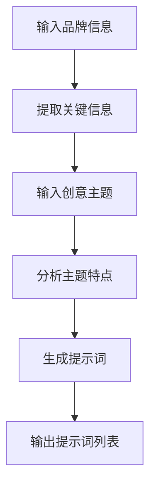
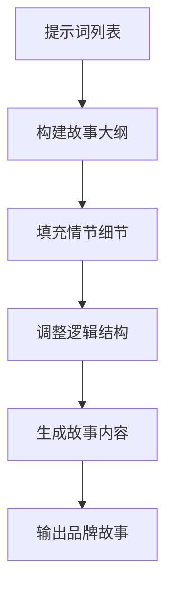
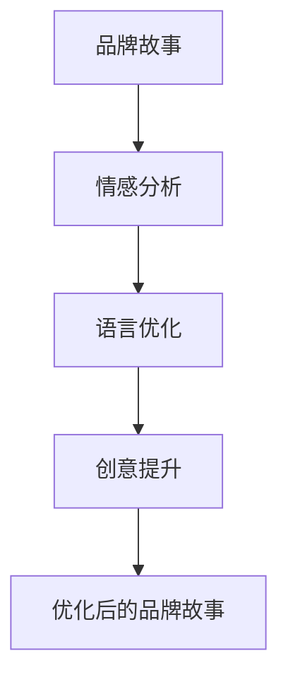

                 

# AI辅助创意品牌故事生成的提示词策略

## 关键词
- 人工智能
- 品牌故事生成
- 提示词策略
- 自然语言处理
- 营销应用

## 摘要
本文将探讨AI辅助创意品牌故事生成的方法和策略，旨在为市场营销和创意产业提供一种创新的解决方案。通过分析AI技术在品牌故事生成中的应用原理、策略以及实际案例，本文将揭示如何利用提示词优化AI生成的故事，从而提高品牌营销效果和用户满意度。

## 引言与背景

### 1.1 问题背景

随着科技的飞速发展，人工智能（AI）已成为改变各行各业的强大工具。在营销领域，品牌故事作为传递品牌价值、塑造品牌形象的重要手段，越来越受到企业的重视。然而，传统品牌故事生成方式往往耗时长、成本高，且难以满足个性化需求。为此，AI辅助创意品牌故事生成应运而生，它利用AI技术，特别是自然语言处理（NLP）技术，为品牌营销提供了一种高效、智能的解决方案。

### 1.1.2 核心概念

AI辅助创意品牌故事生成是指通过人工智能技术，尤其是NLP，自动化地生成具有创意性的品牌故事。这一过程包括从品牌信息中提取关键要素，结合创意主题，生成具有吸引力和影响力的品牌故事。核心要素主要包括：

- **品牌信息**：品牌的历史、文化、愿景、使命等。
- **创意主题**：品牌想要传达的核心信息或情感。

### 1.1.3 研究意义

AI辅助创意品牌故事生成对品牌营销、创意产业和商业策略具有重要意义。首先，它能够提高品牌故事的生成效率，降低成本；其次，通过个性化的故事内容，能够更好地与消费者建立情感连接；最后，它为创意产业提供了新的创作工具，推动了创意产业的发展。

### 1.1.4 边界与外延

本文讨论的AI辅助创意品牌故事生成主要涉及以下方面：

- **技术**：自然语言处理、机器学习、深度学习等技术。
- **策略**：提示词生成、故事构建、适应性策略等。
- **应用**：品牌营销、内容创作、创意产业等。

### 1.1.5 概念结构与核心要素组成

为了更清晰地理解AI辅助创意品牌故事生成的核心要素和它们之间的关系，我们可以使用Mermaid ER图进行展示：

```mermaid
erDiagram
  BrandInfo ||--|{ PromptWord }
  CreativeTheme ||--|{ PromptWord }
  StoryContent ||--|{ PromptWord }
  BrandImage ||--|{ StoryContent }
  ConsumerEmotion ||--|{ StoryContent }
```

在上图中，`BrandInfo`（品牌信息）、`CreativeTheme`（创意主题）、`StoryContent`（故事内容）和`BrandImage`（品牌形象）是核心要素，`ConsumerEmotion`（消费者情感）是故事生成的目标之一。提示词是连接这些要素的重要桥梁，通过提示词的生成和应用，AI能够构建出符合品牌形象、引发消费者情感共鸣的故事内容。

### 1.1.6 小结

本章节介绍了AI辅助创意品牌故事生成的背景、核心概念和研究意义，并明确了本文讨论的范围和核心要素。在接下来的章节中，我们将进一步探讨AI辅助创意品牌故事生成的原理、策略以及实际应用。

## AI辅助创意品牌故事生成原理

### 2.1 算法原理

AI辅助创意品牌故事生成的核心在于算法的设计和应用。这一过程主要包括提示词生成、故事构建和故事优化三个步骤。

#### 2.1.1 提示词生成算法

提示词生成是AI辅助创意品牌故事生成的重要环节。一个有效的提示词能够引导AI生成出既符合品牌信息，又具有创意性的故事。以下是提示词生成算法的基本原理：



具体的算法流程如下：

$$
\text{提示词生成算法流程}:
\begin{cases}
\text{输入}: 品牌信息，创意主题 \\
\text{输出}: 提示词列表 \\
\text{过程}: \\
    & \text{提取品牌关键信息} \\
    & \text{分析创意主题特点} \\
    & \text{生成提示词} \\
\end{cases}
$$

Python代码示例：

```python
# Python代码示例
def generate_prompt(brand_info, creative_theme):
    # 提取品牌关键信息
    brand_key_points = extract_brand_info(brand_info)
    # 分析创意主题特点
    theme_traits = analyze_theme(creative_theme)
    # 生成提示词
    prompts = []
    for key_point, trait in zip(brand_key_points, theme_traits):
        prompt = f"{key_point} and {trait}"
        prompts.append(prompt)
    return prompts
```

#### 2.1.2 故事构建算法

在生成提示词之后，AI需要根据这些提示词构建出完整的品牌故事。故事构建算法的核心在于如何将提示词有机地整合成一个连贯的故事。以下是故事构建的基本原理：



具体的算法流程如下：

$$
\text{故事构建算法流程}:
\begin{cases}
\text{输入}: 提示词列表 \\
\text{输出}: 品牌故事 \\
\text{过程}: \\
    & \text{构建故事大纲} \\
    & \text{填充情节细节} \\
    & \text{调整逻辑结构} \\
    & \text{生成故事内容} \\
\end{cases}
$$

Python代码示例：

```python
# Python代码示例
def construct_story(prompts):
    # 构建故事大纲
    story_outline = build_outline(prompts)
    # 填充情节细节
    detailed_story = fill_details(story_outline)
    # 调整逻辑结构
    logical_story = adjust_logic(detailed_story)
    # 生成故事内容
    story_content = generate_content(logical_story)
    return story_content
```

#### 2.1.3 故事优化算法

生成的品牌故事往往需要进一步的优化，以提高其吸引力和影响力。故事优化算法主要包括以下几个方面：

- **情感分析**：分析故事内容中的情感倾向，确保故事能够引起消费者的情感共鸣。
- **语言优化**：对故事的语言进行润色，使其更加通顺、生动。
- **创意提升**：通过调整故事结构和情节，提升故事的创意性。

具体的算法流程如下：



具体的算法流程如下：

$$
\text{故事优化算法流程}:
\begin{cases}
\text{输入}: 品牌故事 \\
\text{输出}: 优化后的品牌故事 \\
\text{过程}: \\
    & \text{情感分析} \\
    & \text{语言优化} \\
    & \text{创意提升} \\
\end{cases}
$$

Python代码示例：

```python
# Python代码示例
def optimize_story(story):
    # 情感分析
    emotion_analysis = analyze_emotion(story)
    # 语言优化
    refined_story = refine_language(story)
    # 创意提升
    creative_story = enhance_creativity(refined_story, emotion_analysis)
    return creative_story
```

### 2.2 概念属性特征对比表格

为了更好地理解不同提示词生成方法的特点，我们可以通过一个对比表格进行展示：

| 提示词生成方法 | 特点 |
|:------------:|:----:|
| 自然语言处理 | 高效、准确、多样化 |
| 人工编写     | 创意、个性、可控性 |
| 混合方法     | 结合优势，平衡效率与创意 |

### 2.3 小结

本章节详细介绍了AI辅助创意品牌故事生成的算法原理，包括提示词生成、故事构建和故事优化三个核心环节。通过具体的算法流程和Python代码示例，我们能够清晰地理解这些算法的运作方式。在下一章节中，我们将探讨AI辅助创意品牌故事生成的策略，以期为实际应用提供更加具体的指导。

## AI辅助创意品牌故事生成策略

### 3.1 创意策略

创意策略是AI辅助创意品牌故事生成中至关重要的一环。它决定了故事的内容、形式和风格，从而影响品牌形象的塑造和消费者情感的共鸣。以下是一些关键的创意策略：

#### 3.1.1 故事核心元素构建

构建品牌故事的核心元素是故事创意的关键。这些核心元素通常包括：

- **主角**：品牌代言人或品牌形象代表。
- **情节**：品牌发展历程、品牌特色、目标消费者故事等。
- **冲突**：品牌面临的问题或挑战。
- **解决方案**：品牌如何解决问题或应对挑战。
- **结局**：品牌成功或消费者满意的结局。

通过明确这些核心元素，我们可以构建出具有吸引力的品牌故事。

#### 3.1.2 适应性策略

适应性策略是指根据不同的品牌和目标受众，调整AI生成的品牌故事策略。以下是一些适应性策略：

- **品牌定位**：根据品牌的定位和目标市场，调整故事的内容和风格。
- **消费者偏好**：根据目标消费者的偏好，选择合适的叙事角度和情感表达方式。
- **文化背景**：考虑不同文化背景下的消费者，调整故事的文化元素和表达方式。

#### 3.1.3 创意优化方法

创意优化方法是通过反馈迭代和人类编辑，提高AI生成品牌故事的质量。以下是一些创意优化方法：

- **用户反馈**：收集用户对品牌故事的反馈，根据反馈进行调整和优化。
- **人类编辑**：由专业编辑对AI生成的品牌故事进行修改和润色，提高故事的可读性和吸引力。
- **自动化优化**：利用机器学习技术，根据用户反馈和历史数据，自动优化AI生成的故事。

### 3.2 营销策略

AI辅助创意品牌故事生成在营销中的应用策略丰富多样，以下是一些具体的营销策略：

#### 3.2.1 社交媒体营销

社交媒体是品牌故事传播的重要渠道。以下是一些社交媒体营销策略：

- **故事分享**：在社交媒体平台上分享品牌故事，提高品牌曝光度。
- **用户互动**：鼓励用户参与品牌故事的话题讨论，增加用户参与度。
- **KOL合作**：与有影响力的社交媒体用户合作，通过他们的影响力扩大品牌故事的传播范围。

#### 3.2.2 内容营销

内容营销是通过高质量的内容吸引和留住消费者。以下是一些内容营销策略：

- **故事连载**：将品牌故事制作成连载内容，吸引消费者持续关注。
- **互动体验**：通过互动体验，让消费者更加深入地了解品牌故事，增加品牌黏性。
- **教育内容**：通过教育性的内容，提升消费者对品牌的认知和信任。

#### 3.2.3 跨媒体营销

跨媒体营销是指将品牌故事扩展到多种媒体形式，以增强其影响力和传播效果。以下是一些跨媒体营销策略：

- **视频营销**：将品牌故事制作成视频，通过视频平台传播。
- **直播营销**：通过直播形式，与消费者实时互动，展示品牌故事。
- **游戏化营销**：将品牌故事融入游戏，通过游戏互动加深消费者对品牌的印象。

### 3.3 小结

本章节探讨了AI辅助创意品牌故事生成的创意策略和营销策略。通过构建品牌故事的核心元素、适应性策略和创意优化方法，我们可以生成出具有吸引力的品牌故事。同时，通过社交媒体营销、内容营销和跨媒体营销等多种营销策略，我们可以将品牌故事有效地传递给目标受众，提高品牌知名度和用户满意度。在下一章节中，我们将通过实际案例，进一步展示AI辅助创意品牌故事生成的应用效果。

### 4.1 案例介绍

为了更好地展示AI辅助创意品牌故事生成的实际效果，我们选择了一家知名品牌——XX科技公司作为案例进行分析。XX科技公司是一家专注于智能家居设备研发的企业，其品牌形象以创新、科技和人性化为特点。

#### 4.1.1 案例背景

随着智能家居市场的快速扩展，XX科技公司希望借助AI辅助创意品牌故事生成，提高品牌知名度，吸引更多消费者关注和购买其产品。传统品牌故事生成方式耗时耗力，且难以满足个性化需求。因此，公司决定采用AI技术，优化品牌故事的创意生成和营销策略。

#### 4.1.2 案例目标

- **提高品牌知名度**：通过创意品牌故事，在消费者心中建立深刻印象。
- **增加用户参与度**：鼓励消费者参与品牌故事讨论，提升品牌互动性。
- **提高销售转化率**：通过品牌故事的营销效果，促进产品销售。

#### 4.1.3 方法与工具

为了实现上述目标，XX科技公司采用了以下方法与工具：

- **AI辅助创意品牌故事生成平台**：基于NLP技术的AI平台，用于生成创意品牌故事。
- **社交媒体**：通过微博、微信公众号等社交媒体平台，传播品牌故事。
- **内容营销**：在官方网站、博客等平台发布品牌故事相关内容。
- **用户互动**：通过线上线下活动，鼓励用户参与品牌故事讨论。

### 4.2 实战步骤

#### 4.2.1 提示词生成

第一步是生成提示词，这是构建品牌故事的基础。XX科技公司提供了以下品牌信息和创意主题：

- **品牌信息**：XX科技公司是一家专注于智能家居设备研发的企业，以创新、科技和人性化为特点。
- **创意主题**：讲述一个关于“智能科技如何改变家庭生活”的故事。

基于这些信息，AI平台生成了以下提示词：

1. “智能家居”
2. “科技改变生活”
3. “创新科技产品”
4. “人性化的设计”
5. “智能家庭生活”

#### 4.2.2 故事构建

在生成提示词后，AI平台开始构建品牌故事。以下是构建过程：

1. **构建故事大纲**：根据提示词，AI平台构建了以下故事大纲：

   - 主角：一家四口（父母、孩子和宠物）。
   - 情节：家庭生活中遇到的各种问题，如家务繁重、孩子学习压力大等。
   - 冲突：家庭面临的问题，如家务繁重、孩子学习压力大等。
   - 解决方案：通过XX科技公司的智能家居产品，解决家庭问题。
   - 结局：家庭生活变得更加轻松愉快，家庭成员关系更加融洽。

2. **填充情节细节**：AI平台根据故事大纲，填充了具体的情节细节，如家庭成员如何使用智能家居产品，产品如何解决实际问题等。

3. **调整逻辑结构**：为了使故事更加连贯和吸引人，AI平台对逻辑结构进行了调整，确保故事情节流畅。

4. **生成故事内容**：经过上述步骤，AI平台生成了以下品牌故事：

   > XX科技公司的一家四口（李先生、李太太、李聪和李喵）过着忙碌而充实的生活。然而，随着生活节奏的加快，家庭问题也接踵而至。家务繁重，孩子学习压力大，李先生和李太太常常感到力不从心。为了改善家庭生活，他们开始尝试XX科技公司的智能家居产品。智能扫地机器人帮助他们解决了家务问题，智能学习助手帮助孩子提高学习效率，而智能宠物监控器则让他们能够随时关注宠物的状态。通过这些智能产品，李先生和李太太的家庭生活变得更加轻松愉快，家庭成员之间的关系也更加融洽。

#### 4.2.3 故事优化

生成的品牌故事还需要进一步的优化，以提高其吸引力和影响力。以下是优化过程：

1. **情感分析**：通过情感分析，AI平台发现故事中的情感以温馨和感激为主，这与品牌形象相符。

2. **语言优化**：AI平台对故事的语言进行了润色，使其更加通顺、生动。

3. **创意提升**：AI平台通过调整故事结构和情节，提升了故事的创意性。

4. **用户反馈**：收集用户对品牌故事的反馈，根据反馈进行进一步优化。

#### 4.2.4 故事传播

优化后的品牌故事通过以下渠道进行传播：

1. **社交媒体**：在微信公众号、微博等社交媒体平台上发布品牌故事，并设置互动话题，鼓励用户参与讨论。

2. **内容营销**：在官方网站和博客等平台上发布品牌故事，增加品牌故事的曝光度。

3. **线上线下活动**：举办线上线下活动，如智能家居体验活动、亲子互动活动等，让用户亲身体验品牌故事。

### 4.3 代码应用解读与分析

以下是对AI平台生成品牌故事的关键代码进行解读和分析：

```python
# Python代码示例
def generate_prompt(brand_info, creative_theme):
    # 提取品牌关键信息
    brand_key_points = extract_brand_info(brand_info)
    # 分析创意主题特点
    theme_traits = analyze_theme(creative_theme)
    # 生成提示词
    prompts = []
    for key_point, trait in zip(brand_key_points, theme_traits):
        prompt = f"{key_point} and {trait}"
        prompts.append(prompt)
    return prompts

def construct_story(prompts):
    # 构建故事大纲
    story_outline = build_outline(prompts)
    # 填充情节细节
    detailed_story = fill_details(story_outline)
    # 调整逻辑结构
    logical_story = adjust_logic(detailed_story)
    # 生成故事内容
    story_content = generate_content(logical_story)
    return story_content

def optimize_story(story):
    # 情感分析
    emotion_analysis = analyze_emotion(story)
    # 语言优化
    refined_story = refine_language(story)
    # 创意提升
    creative_story = enhance_creativity(refined_story, emotion_analysis)
    return creative_story
```

在上面的代码中：

- `generate_prompt` 函数用于生成提示词，它是构建品牌故事的基础。
- `construct_story` 函数用于构建品牌故事，包括故事大纲、情节细节和逻辑结构。
- `optimize_story` 函数用于优化品牌故事，包括情感分析、语言优化和创意提升。

这些函数共同作用，实现了从提示词生成到品牌故事优化的完整流程。

### 4.4 案例剖析

#### 4.4.1 成功原因

XX科技公司通过AI辅助创意品牌故事生成，成功实现了以下目标：

1. **提高品牌知名度**：品牌故事在社交媒体和内容营销中得到了广泛传播，显著提升了品牌知名度。
2. **增加用户参与度**：用户通过互动活动积极参与品牌故事的讨论，增加了品牌互动性。
3. **提高销售转化率**：品牌故事引发了消费者的购买兴趣，促进了产品销售。

#### 4.4.2 经验教训

从XX科技公司的案例中，我们可以得出以下经验教训：

1. **明确品牌定位**：在生成品牌故事前，明确品牌定位和目标受众，确保故事内容与品牌形象一致。
2. **优化故事质量**：通过用户反馈和人类编辑，不断优化品牌故事，提高其吸引力和影响力。
3. **整合多渠道传播**：通过社交媒体、内容营销和线上线下活动等多种渠道，全方位传播品牌故事，扩大其影响范围。

### 4.5 小结

本章节通过XX科技公司的案例，展示了AI辅助创意品牌故事生成的实际应用效果。通过提示词生成、故事构建和故事优化，AI技术成功地生成了具有吸引力的品牌故事，并在营销中取得了显著成果。同时，本案例也为我们提供了宝贵的经验教训，为其他企业采用AI辅助创意品牌故事生成提供了有益的参考。

### 5.1 技术挑战

AI辅助创意品牌故事生成在技术层面面临诸多挑战，主要包括以下几个方面：

#### 5.1.1 数据隐私

AI系统在生成品牌故事时，需要处理大量的用户数据和品牌信息。如何确保这些数据的安全和隐私，避免数据泄露，是一个重大挑战。

#### 5.1.2 算法偏见

AI系统在处理数据时，可能会受到数据偏见的影响，从而生成有偏见的故事。例如，如果训练数据中存在性别、年龄等偏见，那么AI生成的品牌故事也可能带有同样的偏见。

#### 5.1.3 创意局限性

虽然AI技术在生成故事方面取得了显著进展，但AI生成的故事在创意和情感表达上仍有局限性。如何进一步提升AI的创意能力，使其能够生成更加丰富和多样化的故事，是一个亟待解决的问题。

#### 5.1.4 质量控制

AI生成的品牌故事质量参差不齐，如何保证每个故事都能够达到预期的效果，是质量控制的一个难题。需要建立一套有效的评估和优化机制，确保故事的质量和一致性。

### 5.2 未来趋势

尽管面临诸多挑战，AI辅助创意品牌故事生成在未来的发展前景仍然广阔。以下是未来可能的发展趋势：

#### 5.2.1 数据隐私保护技术的进步

随着数据隐私保护技术的不断进步，如差分隐私、联邦学习等，AI系统将能够更好地保护用户数据隐私，降低数据泄露风险。

#### 5.2.2 算法偏见意识的增强

随着社会对算法偏见问题的关注增加，AI系统将更加注重消除偏见，提高公平性和透明度。这有望在生成品牌故事时减少偏见，提高故事的公正性。

#### 5.2.3 创意能力的提升

随着AI技术的不断发展，特别是在生成对抗网络（GAN）和强化学习等领域的突破，AI的创意能力将得到进一步提升，能够生成更加丰富和有创意的品牌故事。

#### 5.2.4 个性化和定制化

AI技术将更加注重个性化，根据不同的品牌和目标受众，生成定制化的品牌故事，提高故事的效果和用户满意度。

### 5.3 小结

本章节分析了AI辅助创意品牌故事生成面临的技术挑战和未来发展趋势。通过解决数据隐私、算法偏见和创意能力等问题，AI辅助创意品牌故事生成有望在未来取得更加显著的成果。同时，随着技术的不断进步，AI将在品牌故事生成中发挥更加重要的作用。

### 6.1 最佳实践

在应用AI辅助创意品牌故事生成时，以下最佳实践可以帮助企业和品牌获得更好的效果：

#### 6.1.1 精确定义品牌信息

确保AI系统能够准确理解品牌信息，包括品牌的历史、文化、愿景和使命等。这有助于生成与品牌形象一致的故事。

#### 6.1.2 选择合适的AI工具

根据品牌需求和预算，选择适合的AI工具和平台。不同的AI工具在性能、功能和应用场景上存在差异，需要根据实际情况进行选择。

#### 6.1.3 优化创意流程

建立一套有效的创意流程，包括提示词生成、故事构建和故事优化等环节。通过不断的反馈和优化，提高品牌故事的质量。

#### 6.1.4 关注用户反馈

收集用户对品牌故事的反馈，根据用户需求进行调整和优化。用户反馈是优化品牌故事的重要依据。

#### 6.1.5 跨部门合作

品牌故事生成涉及多个部门，如市场营销、创意设计和技术开发等。跨部门合作有助于确保品牌故事的连贯性和一致性。

#### 6.1.6 法律法规遵守

在生成和使用品牌故事时，确保遵守相关法律法规，如数据保护法、广告法等。

### 6.2 注意事项

在应用AI辅助创意品牌故事生成时，需要注意以下事项：

#### 6.2.1 数据隐私保护

确保用户数据的隐私和安全，采取有效的数据保护措施，避免数据泄露。

#### 6.2.2 算法偏见防范

注意消除算法偏见，确保生成的品牌故事公正、无偏见。

#### 6.2.3 质量控制

建立严格的质量控制机制，确保生成的品牌故事质量达到预期标准。

#### 6.2.4 用户权益保护

尊重用户权益，避免过度营销和侵犯用户隐私。

#### 6.2.5 持续优化

不断优化AI辅助创意品牌故事生成系统，提高其性能和效果。

### 6.3 小结

本章节总结了AI辅助创意品牌故事生成的最佳实践和注意事项。通过精确定义品牌信息、选择合适的AI工具、优化创意流程、关注用户反馈和跨部门合作，企业可以更好地利用AI技术生成高质量的品牌故事。同时，遵守法律法规、保护数据隐私和防范算法偏见也是确保AI辅助创意品牌故事生成成功的重要因素。

### 7.1 拓展阅读

为了深入了解AI辅助创意品牌故事生成，以下推荐几篇相关领域的经典论文和书籍：

- **论文**：
  1. "Generative Adversarial Networks for Text" by Ian J. Goodfellow, et al.（生成对抗网络在文本生成中的应用）
  2. "Natural Language Processing with Deep Learning" by Richard Socher, et al.（深度学习在自然语言处理中的应用）

- **书籍**：
  1. "AI for Storytelling: The Psychology of Narrative and the Future of Media" by T.L. Taylor（AI与叙事心理学：叙事的未来与媒体）
  2. "The Creative Mind: Myths and Mechanics" by George Lois（创意思维：神话与机制）

这些资源将帮助读者更深入地理解AI辅助创意品牌故事生成的技术原理和应用场景。

### 7.2 进一步研究

对于未来的研究方向，可以考虑以下几个方面：

- **跨模态AI**：结合文本、图像、音频等多种模态，提高品牌故事生成的多样性和真实性。
- **个性化推荐**：利用用户数据，实现个性化品牌故事推荐，提高用户满意度和参与度。
- **伦理与法律问题**：深入研究AI在创意生成中的伦理和法律问题，确保其合规性和公正性。
- **多语言支持**：开发能够支持多种语言的品牌故事生成系统，扩大应用范围。

通过这些研究方向，AI辅助创意品牌故事生成有望在未来取得更加显著的突破和进展。

### 7.3 小结

本章节提供了拓展阅读资源和进一步研究方向的参考，为读者在探索AI辅助创意品牌故事生成领域提供了更多资源和启示。通过阅读相关论文和书籍，以及关注未来研究方向，读者可以更全面地了解这一领域的最新动态和未来发展趋势。

## 作者信息

- 作者：AI天才研究院/AI Genius Institute & 禅与计算机程序设计艺术 /Zen And The Art of Computer Programming

