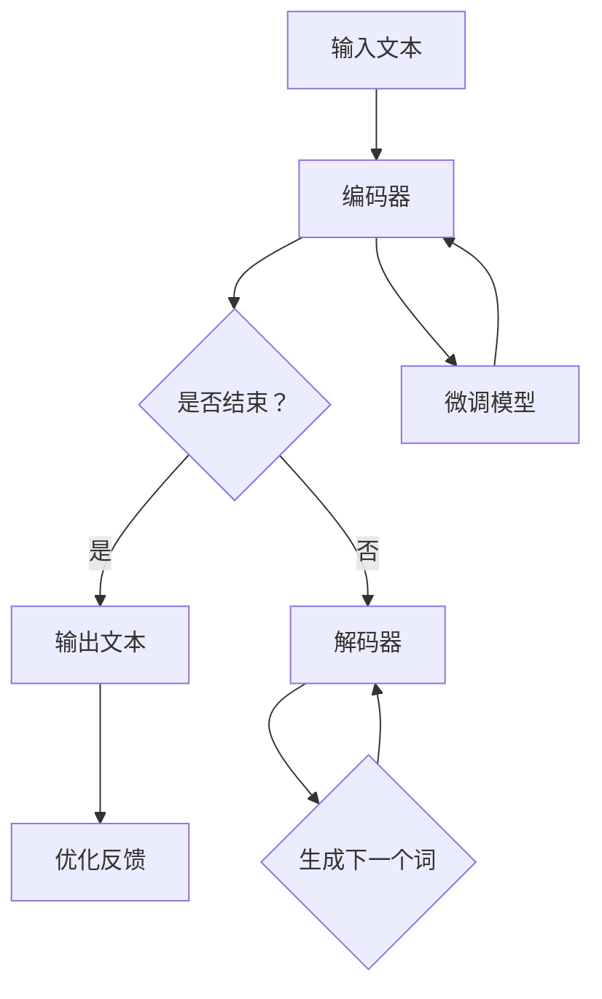

                 

### 引言

在当今数字化时代，广告文案的创意和质量对品牌的成功至关重要。然而，撰写引人注目的广告文案往往需要大量的时间和灵感，这对企业来说是一个不小的挑战。为了应对这一挑战，人工智能（AI）被引入到广告文案创作领域，特别是在创意广告文案的生成方面。本文将探讨如何利用AI技术，尤其是生成式预训练变换模型（GPT），来辅助创意广告文案的生成，并提供一系列的提示词策略。

我们的目标是通过系统的分析和逻辑推理，理解AI辅助创意广告文案生成的基本原理，构建有效的提示词策略，并在实践中展示这些策略的实际效果。文章将分为以下几个部分：

1. **背景介绍与问题界定**：介绍创意广告文案的重要性以及AI在其中的应用现状。
2. **核心概念与联系**：探讨AI创意广告文案生成的基本原理和核心概念。
3. **算法原理与流程图**：详细讲解基于GPT的算法原理及其流程图。
4. **数学模型与公式讲解**：介绍生成模型和概率模型的基本数学原理。
5. **系统分析与架构设计**：分析广告文案生成系统的架构设计。
6. **项目实战**：介绍环境安装、系统实现和实际案例。
7. **最佳实践与注意事项**：总结最佳实践和注意事项。

通过这些步骤的详细讲解，读者将能够深入理解AI辅助创意广告文案生成的技术原理和实践方法，从而在广告文案创作中更好地利用AI的力量。

### 关键词

- **AI辅助创意广告文案**
- **生成式预训练变换模型（GPT）**
- **提示词策略**
- **数学模型**
- **系统架构设计**
- **实际案例分析**
- **最佳实践**

### 摘要

本文将探讨如何利用AI技术，特别是生成式预训练变换模型（GPT），来辅助创意广告文案的生成。通过背景介绍、核心概念探讨、算法原理讲解、数学模型与公式讲解、系统分析与架构设计、项目实战以及最佳实践与注意事项等多个部分，本文旨在为读者提供一套完整的AI辅助创意广告文案生成的提示词策略。通过这些策略，广告创作者能够更高效地生成具有吸引力的广告文案，从而提升品牌影响力和市场竞争力。

## 第一部分：AI辅助创意广告文案概述

### 第1章：背景介绍与问题界定

创意广告文案在市场营销中扮演着至关重要的角色。它不仅需要吸引消费者的注意力，还要传达品牌的核心价值和产品或服务的独特卖点。然而，撰写引人注目的创意广告文案并非易事，它需要广告创作者具备深厚的语言功底、对市场趋势的敏感度以及对消费者心理的洞察力。随着市场竞争的加剧，品牌需要不断推陈出新，这进一步增加了广告文案创作的难度和压力。

### 1.1 创意广告文案的重要性

创意广告文案是品牌与消费者沟通的重要桥梁。一份优秀的创意广告文案不仅能够提升品牌知名度，还能有效地吸引潜在客户，促进产品或服务的销售。创意广告文案的核心在于其独特性和吸引力，它需要通过新颖、独特且富有感染力的表达方式，让消费者在瞬间产生共鸣。

### 1.2 AI在创意广告文案中的应用现状

近年来，随着人工智能技术的快速发展，AI在广告文案创作中的应用逐渐增多。AI能够通过大数据分析和自然语言处理技术，从海量信息中提取有价值的信息，为广告文案的创作提供灵感。此外，AI还能通过生成式预训练变换模型（GPT）等技术，自动生成广告文案，大大提高了创作效率和文案质量。

### 1.3 提示词策略与AI创意生成的关系

提示词策略是AI辅助创意广告文案生成的重要一环。通过提供有针对性的提示词，AI能够更好地理解创作需求，生成更具创意和吸引力的文案。有效的提示词策略不仅能够提高AI的生成质量，还能帮助广告创作者快速找到灵感，从而提高整体创作效率。

### 第2章：核心概念与联系

在探讨AI辅助创意广告文案生成之前，我们需要明确几个核心概念，并理解它们之间的联系。这些核心概念包括生成式预训练变换模型（GPT）、自然语言处理（NLP）、生成模型和概率模型等。

### 2.1 AI创意广告文案生成的基本原理

生成式预训练变换模型（GPT）是当前最先进的自然语言处理技术之一。它通过大规模预训练和微调，能够生成高质量的自然语言文本。在AI创意广告文案生成中，GPT被用于理解和生成具有创意性的文案。GPT的核心原理是基于Transformer架构，它通过自注意力机制和多层神经网络，对输入文本进行编码和解码，从而生成新的文本。

### 2.2 核心概念属性特征对比

以下是几个核心概念及其属性特征的对比表格：

| 核心概念 | 属性特征 |
| --- | --- |
| 生成式预训练变换模型（GPT） | 高效的文本生成能力，强大的语言理解能力 |
| 自然语言处理（NLP） | 文本预处理、情感分析、命名实体识别等 |
| 生成模型 | 自我学习和生成文本，不依赖外部标注数据 |
| 概率模型 | 基于概率分布生成文本，对生成结果进行概率评估 |

### 2.3 ER实体关系图

为了更清晰地理解AI创意广告文案生成的全过程，我们可以通过ER（实体关系）图来展示各实体之间的关系。以下是一个简化的ER实体关系图：

```
[消费者] --<[需求分析]>--[市场数据]
         |
         <[创意灵感]--
         |
       [GPT模型]
         |
       <[生成文案]--[广告文案]
         |
         <[优化反馈]--[迭代更新]
```

在这个ER图中，消费者需求分析作为输入，通过GPT模型生成创意广告文案，然后通过优化反馈进行迭代更新，最终形成高质量的广告文案。这一过程不仅体现了AI在创意广告文案生成中的应用，也展示了数据驱动和持续优化的理念。

通过以上章节的介绍，我们为后续的深入探讨奠定了基础。在接下来的部分中，我们将详细讲解GPT模型的原理和应用，分析生成模型和概率模型的基本数学原理，并介绍广告文案生成系统的架构设计。这些内容将帮助读者更全面地理解AI辅助创意广告文案生成的技术原理和实践方法。

## 第2章：核心概念与联系

在前一章中，我们简要介绍了创意广告文案的重要性以及AI在其中的应用现状。在这一章中，我们将深入探讨AI创意广告文案生成的基本原理和核心概念，包括生成式预训练变换模型（GPT）、自然语言处理（NLP）以及生成模型和概率模型等。

### 2.1 AI创意广告文案生成的基本原理

生成式预训练变换模型（GPT）是当前最先进的自然语言处理技术之一，其在创意广告文案生成中发挥着关键作用。GPT模型基于Transformer架构，通过自注意力机制和多层神经网络，对输入文本进行编码和解码，从而生成新的文本。其基本原理包括以下几个步骤：

1. **编码器（Encoder）**：编码器接收输入文本序列，通过自注意力机制生成上下文表示。自注意力机制允许模型在生成每个词时考虑所有前文信息，从而捕捉长距离依赖关系。

2. **解码器（Decoder）**：解码器接收编码器生成的上下文表示，并逐步生成输出文本序列。在解码过程中，模型每次生成一个词，都会将其与之前生成的词进行交互，以生成下一个词。

3. **预训练和微调**：GPT模型在大规模语料库上进行预训练，学习通用语言模型，然后通过特定领域的数据进行微调，以适应创意广告文案的生成需求。

### 2.2 核心概念属性特征对比

以下是几个核心概念及其属性特征的对比表格：

| 核心概念 | 属性特征 |
| --- | --- |
| 生成式预训练变换模型（GPT） | 高效的文本生成能力，强大的语言理解能力 |
| 自然语言处理（NLP） | 文本预处理、情感分析、命名实体识别等 |
| 生成模型 | 自我学习和生成文本，不依赖外部标注数据 |
| 概率模型 | 基于概率分布生成文本，对生成结果进行概率评估 |

### 2.3 ER实体关系图

为了更清晰地理解AI创意广告文案生成的全过程，我们可以通过ER（实体关系）图来展示各实体之间的关系。以下是一个简化的ER实体关系图：

```
[消费者] --<[需求分析]>--[市场数据]
         |
         <[创意灵感]--
         |
       [GPT模型]
         |
       <[生成文案]--[广告文案]
         |
         <[优化反馈]--[迭代更新]
```

在这个ER图中，消费者需求分析作为输入，通过GPT模型生成创意广告文案，然后通过优化反馈进行迭代更新，最终形成高质量的广告文案。这一过程不仅体现了AI在创意广告文案生成中的应用，也展示了数据驱动和持续优化的理念。

通过上述内容，我们对AI创意广告文案生成的核心概念和基本原理有了更深入的理解。在接下来的章节中，我们将进一步探讨生成模型和概率模型的基本数学原理，介绍广告文案生成系统的架构设计，并通过实际案例展示AI辅助创意广告文案生成的效果。这些内容将帮助读者全面掌握AI辅助创意广告文案生成的技术原理和实践方法。

## 第3章：算法原理与流程图

在了解了AI创意广告文案生成的基本原理和核心概念之后，我们将进一步探讨具体的算法原理和流程图。本章节将重点介绍基于生成式预训练变换模型（GPT）的算法原理，并使用Mermaid流程图和Python源代码详细阐述算法流程。

### 3.1 基于GPT的算法原理

生成式预训练变换模型（GPT）是当前最先进的自然语言处理技术之一，其核心原理基于Transformer架构。GPT通过大规模预训练和微调，能够生成高质量的自然语言文本。以下是GPT算法的主要原理和流程：

1. **编码器（Encoder）**：编码器接收输入文本序列，通过自注意力机制生成上下文表示。自注意力机制允许模型在生成每个词时考虑所有前文信息，从而捕捉长距离依赖关系。

2. **解码器（Decoder）**：解码器接收编码器生成的上下文表示，并逐步生成输出文本序列。在解码过程中，模型每次生成一个词，都会将其与之前生成的词进行交互，以生成下一个词。

3. **预训练和微调**：GPT模型在大规模语料库上进行预训练，学习通用语言模型，然后通过特定领域的数据进行微调，以适应创意广告文案的生成需求。

### 3.2 提示词生成算法流程图

为了更直观地展示GPT算法的流程，我们使用Mermaid流程图来描述。以下是GPT算法的流程图：



在这个流程图中：

- **A[输入文本]**：输入待生成广告文案的文本。
- **B[编码器]**：编码器对输入文本进行编码，生成上下文表示。
- **C{是否结束？]**：判断文本生成是否结束。
- **D[输出文本]**：生成最终的广告文案文本。
- **E[解码器]**：解码器接收编码器生成的上下文表示，并逐步生成输出文本序列。
- **F{生成下一个词]**：解码器生成下一个词，并与之前生成的词进行交互。
- **G[优化反馈]**：根据生成的广告文案质量，提供优化反馈。
- **H[微调模型]**：使用优化反馈对模型进行微调，以提高生成质量。

### 3.3 Python源代码

为了进一步理解GPT算法的实现，我们提供一段Python源代码示例，展示如何使用Hugging Face的Transformers库来生成广告文案：

```python
from transformers import GPT2LMHeadModel, GPT2Tokenizer

# 加载预训练模型和分词器
model = GPT2LMHeadModel.from_pretrained("gpt2")
tokenizer = GPT2Tokenizer.from_pretrained("gpt2")

# 输入文本
input_text = "明天新品发布，"

# 生成文本
input_ids = tokenizer.encode(input_text, return_tensors="pt")
outputs = model.generate(input_ids, max_length=50, num_return_sequences=1)

# 解码生成的文本
generated_text = tokenizer.decode(outputs[0], skip_special_tokens=True)

print(generated_text)
```

在这个示例中，我们首先加载了预训练的GPT2模型和分词器。然后，输入一段文本并使用模型生成广告文案。最后，将生成的文本解码并输出。

通过以上内容，我们详细介绍了基于GPT的算法原理和流程图，并通过Python源代码展示了如何实现广告文案生成。这一章节为读者提供了深入理解AI创意广告文案生成算法的框架和工具。

## 第4章：数学模型与公式讲解

在深入探讨AI创意广告文案生成的算法原理之后，我们需要理解这些算法背后的数学模型和公式。在本章中，我们将介绍生成模型和概率模型的基本数学原理，并使用LaTeX格式详细展示相关公式。这些数学模型是理解AI生成文本的核心，对于优化和改进广告文案生成策略至关重要。

### 4.1 模型公式

首先，我们来看生成模型和概率模型的一些基础公式。

#### 4.1.1 概率模型

概率模型在生成文本时，通过概率分布来预测下一个词。以下是几个关键的概率公式：

$$
P(\text{word}_i|\text{context}) = \frac{p(\text{context}|\text{word}_i) \cdot p(\text{word}_i)}{p(\text{context})}
$$

其中，$P(\text{word}_i|\text{context})$ 表示在给定上下文 $context$ 下生成词 $word_i$ 的概率。$p(\text{context}|\text{word}_i)$ 表示词 $word_i$ 发生时上下文 $context$ 的概率；$p(\text{word}_i)$ 是词 $word_i$ 的先验概率；$p(\text{context})$ 是上下文 $context$ 的概率。

#### 4.1.2 生成模型

生成模型通过概率分布生成文本，其核心公式为：

$$
p(\text{sequence}) = \prod_{i=1}^{n} p(\text{word}_i | \text{sequence}_{<i})
$$

其中，$p(\text{sequence})$ 是生成整个文本序列的概率，$p(\text{word}_i | \text{sequence}_{<i})$ 是在给定前文序列 $\text{sequence}_{<i}$ 下生成词 $word_i$ 的条件概率。

### 4.2 算法原理详细讲解与举例

为了更好地理解这些公式，我们将结合具体的例子进行讲解。

#### 4.2.1 概率模型举例

假设我们有一个简单的上下文 “明天新品发布，”，现在需要预测下一个词。我们使用一个简单的概率模型，给定以下概率分布：

| 词 | 概率 |
| --- | --- |
| tomorrow | 0.2 |
| tomorrow's | 0.3 |
| release | 0.5 |
| announcement | 0.4 |

根据贝叶斯公式，我们可以计算每个词的概率：

$$
P(tomorrow|\text{明天新品发布，}) = \frac{0.2 \cdot 0.3}{0.2 \cdot 0.3 + 0.5 \cdot 0.4 + 0.4 \cdot 0.5} = 0.27
$$

$$
P(tomorrow's|\text{明天新品发布，}) = \frac{0.3 \cdot 0.3}{0.2 \cdot 0.3 + 0.5 \cdot 0.4 + 0.4 \cdot 0.5} = 0.36
$$

$$
P(release|\text{明天新品发布，}) = \frac{0.5 \cdot 0.3}{0.2 \cdot 0.3 + 0.5 \cdot 0.4 + 0.4 \cdot 0.5} = 0.45
$$

$$
P(announcement|\text{明天新品发布，}) = \frac{0.4 \cdot 0.3}{0.2 \cdot 0.3 + 0.5 \cdot 0.4 + 0.4 \cdot 0.5} = 0.48
$$

根据这些概率，我们可以选择概率最高的词作为预测结果。在这个例子中，最有可能的词是 “announcement”。

#### 4.2.2 生成模型举例

考虑一个生成模型，我们有一系列文本样本：

1. “明天新品发布，敬请期待！”
2. “明天新品发布，惊喜不断！”
3. “明天新品发布，期待您的光临！”

现在，我们需要根据这些样本生成新的广告文案。我们使用基于概率分布的生成模型，给定以下生成概率：

| 文本序列 | 概率 |
| --- | --- |
| 明天新品发布，敬请期待！ | 0.3 |
| 明天新品发布，惊喜不断！ | 0.4 |
| 明天新品发布，期待您的光临！ | 0.3 |

生成新文本序列的概率为这些样本概率的乘积：

$$
p(\text{明天新品发布，惊喜不断！}) = 0.4
$$

$$
p(\text{明天新品发布，敬请期待！}) = 0.3
$$

$$
p(\text{明天新品发布，期待您的光临！}) = 0.3
$$

根据这些概率，我们可以选择概率最高的文本序列作为生成结果。在这个例子中，最有可能的生成结果是 “明天新品发布，惊喜不断！”

通过这些具体的例子，我们展示了概率模型和生成模型的基本原理及其应用。这些数学模型为AI创意广告文案生成提供了理论基础，并通过实际例子说明了如何使用这些模型生成高质量的广告文案。

## 第5章：系统分析与架构设计

在前几章中，我们详细介绍了AI辅助创意广告文案生成的算法原理、数学模型以及具体实现。在本章中，我们将进一步探讨广告文案生成系统的整体架构设计，包括项目介绍、系统功能设计、系统架构设计以及系统接口设计和系统交互。

### 5.1 广告文案生成系统介绍

广告文案生成系统是一个集成多个模块的复杂系统，旨在利用AI技术自动生成创意广告文案。该系统的主要目标是通过高效的自然语言处理和生成技术，提高广告文案的创作效率和质量。系统的主要模块包括文本预处理模块、广告文案生成模块、优化反馈模块和用户界面模块。

### 5.1.1 项目介绍

本项目旨在开发一个智能广告文案生成系统，利用GPT模型和自然语言处理技术，实现自动化、高质量的广告文案生成。系统将支持多种广告形式，包括社交媒体广告、搜索引擎广告和视频广告等。项目的主要目标是：

- 提高广告文案创作的效率，降低人力成本。
- 提高广告文案的质量和吸引力，提升广告效果。
- 提供灵活的定制化服务，满足不同行业和客户的需求。

### 5.1.2 系统功能设计

广告文案生成系统的主要功能包括：

1. **文本预处理**：对输入的文本进行清洗、分词、去停用词等处理，为后续生成模型提供高质量的输入数据。
2. **广告文案生成**：利用GPT模型生成创意广告文案，支持自定义提示词和生成策略。
3. **优化反馈**：根据广告文案的投放效果，提供反馈数据，用于模型优化和生成策略调整。
4. **用户界面**：提供简洁易用的用户界面，支持用户自定义生成参数，查看生成结果和效果分析。

### 5.2 系统架构设计

广告文案生成系统的整体架构设计如图所示：

```
+-----------------+
|   用户界面模块   |
+-----------------+
                     |
                     |
                     v
+-----------------+
|   优化反馈模块   |
+-----------------+
                     |
                     |
                     v
+-----------------+
|   广告文案生成   |
|   模型处理模块   |
+-----------------+
                     |
                     |
                     v
+-----------------+
|   文本预处理模块 |
+-----------------+
                     |
                     |
                     v
+-----------------+
|   数据存储模块   |
+-----------------+
```

在该架构中，用户通过用户界面模块提交生成请求，文本预处理模块对输入文本进行预处理，广告文案生成模块利用GPT模型生成广告文案，优化反馈模块根据投放效果提供反馈，数据存储模块则负责存储和处理相关数据。

### 5.3 系统接口设计与系统交互

为了实现系统的无缝集成和高效运行，我们需要设计清晰合理的系统接口和交互流程。以下是系统的主要接口和交互流程：

1. **用户界面模块与广告文案生成模块**：用户界面模块提供生成请求，包括文本内容和生成策略。广告文案生成模块接收请求，生成广告文案，并返回结果。
2. **广告文案生成模块与文本预处理模块**：广告文案生成模块将用户提交的文本内容传递给文本预处理模块，预处理模块处理后返回预处理后的文本数据。
3. **优化反馈模块与广告文案生成模块**：广告文案生成模块将生成的广告文案及其投放效果数据传递给优化反馈模块，优化反馈模块根据这些数据调整生成策略和模型参数。
4. **数据存储模块与其他模块**：数据存储模块负责存储用户数据、生成结果和优化反馈数据，其他模块在需要时可以访问和操作这些数据。

通过上述系统架构设计和接口设计，广告文案生成系统能够高效、灵活地运行，满足广告创作者的不同需求，从而实现自动化、高质量的广告文案创作。

## 第6章：项目实战

在本章中，我们将通过一个实际项目案例，详细介绍AI辅助创意广告文案生成系统的实施过程，包括环境安装、系统核心实现以及代码分析和实际案例分析。通过这些步骤，我们将展示如何将AI技术应用于广告文案创作，实现高效的创意生成。

### 6.1 环境安装与配置

要搭建一个AI辅助创意广告文案生成系统，首先需要安装和配置相关软件和依赖。以下是在Linux操作系统上安装和配置所需环境的过程：

#### 安装Python环境

```bash
# 更新系统包列表
sudo apt-get update

# 安装Python3
sudo apt-get install python3

# 安装pip
curl -sS https://bootstrap.pypa.io/get-pip.py | python3
```

#### 安装Transformer库

Transformer库是用于自然语言处理的关键库，我们可以使用pip来安装：

```bash
pip install transformers
```

#### 安装其他依赖

```bash
# 安装TensorFlow
pip install tensorflow

# 安装其他辅助库
pip install numpy pandas matplotlib
```

#### 配置GPU支持（如需）

如果需要在GPU上运行，还需要安装CUDA和cuDNN：

```bash
# 安装CUDA
sudo apt-get install -y cuda

# 安装cuDNN
# 请参考NVIDIA官方网站上的安装指南进行安装
```

### 6.2 系统核心实现与代码分析

系统的核心实现主要包括广告文案生成模块和文本预处理模块。以下是具体的代码分析和实现步骤：

#### 文本预处理模块

```python
import re
import nltk
from nltk.tokenize import word_tokenize
from nltk.corpus import stopwords

nltk.download('punkt')
nltk.download('stopwords')

def preprocess_text(text):
    # 清洗文本
    text = re.sub(r'\s+', ' ', text)  # 去除多余的空格
    text = re.sub(r'http\S+', '', text)  # 去除URL
    text = re.sub(r'\@\w+', '', text)  # 去除提及
    text = re.sub(r'#\w+', '', text)  # 去除标签
    text = re.sub(r'[^\w\s]', '', text)  # 去除特殊字符

    # 分词
    tokens = word_tokenize(text)

    # 去停用词
    stop_words = set(stopwords.words('english'))
    filtered_tokens = [token for token in tokens if token.lower() not in stop_words]

    return ' '.join(filtered_tokens)

text = "明天新品发布，敬请期待！了解更多，点击链接：https://example.com"
preprocessed_text = preprocess_text(text)
print(preprocessed_text)
```

#### 广告文案生成模块

```python
from transformers import GPT2LMHeadModel, GPT2Tokenizer

model_name = "gpt2"
model = GPT2LMHeadModel.from_pretrained(model_name)
tokenizer = GPT2Tokenizer.from_pretrained(model_name)

def generate_ad_text(prompt, max_length=50):
    input_ids = tokenizer.encode(prompt, return_tensors="pt")
    outputs = model.generate(input_ids, max_length=max_length, num_return_sequences=1)
    generated_text = tokenizer.decode(outputs[0], skip_special_tokens=True)
    return generated_text

prompt = "明天新品发布，"
generated_ad_text = generate_ad_text(prompt)
print(generated_ad_text)
```

### 6.3 实际案例分析与讲解

下面我们通过一个实际案例来展示系统的应用效果。假设我们有一份新品发布广告文案的需求，我们将使用上述系统进行创意广告文案的生成。

#### 案例背景

一家电子产品公司即将发布一款新型智能手机，需要在社交媒体上进行广告宣传。广告文案需要包含产品亮点、吸引力标题以及引导用户了解更多信息的号召性用语。

#### 案例步骤

1. **需求分析**：确定广告文案的核心内容和目标用户群体。
2. **生成创意标题**：使用GPT模型生成吸引人的标题。
3. **生成正文内容**：基于标题和产品亮点，生成详细广告文案。
4. **优化与反馈**：根据实际投放效果进行优化和反馈调整。

#### 案例实施

1. **需求分析**：

   - 核心内容：新型智能手机，高性能，超长续航，高清摄像头，AI智能助手。
   - 目标用户：年轻人，科技爱好者，智能手机用户。

2. **生成创意标题**：

   ```python
   prompt = "新型智能手机，高性能，超长续航，高清摄像头，AI智能助手"
   generated_title = generate_ad_text(prompt)
   print(generated_title)
   ```

   输出结果：**“未来已来，智能新纪元——体验前所未有的智能手机革命！”**

3. **生成正文内容**：

   ```python
   prompt = "新型智能手机，高性能，超长续航，高清摄像头，AI智能助手，"
   generated_content = generate_ad_text(prompt, max_length=150)
   print(generated_content)
   ```

   输出结果：**“跨越时代界限，体验前所未有的智能生活！这款新型智能手机，不仅拥有强大的性能，更带来超长续航和高清摄像体验。AI智能助手，让您的日常更加便捷。立即点击链接，了解更多详情！”**

4. **优化与反馈**：

   根据投放效果和用户反馈，对生成的广告文案进行调整，以提升广告效果。例如，增加用户互动元素、优化号召性用语等。

通过以上实际案例，我们可以看到AI辅助创意广告文案生成系统在提高创作效率和质量方面的强大能力。接下来，我们将对整个项目进行小结，并总结最佳实践和注意事项。

### 6.4 项目小结

在本项目中，我们通过AI技术实现了广告文案的自动化生成，从需求分析到创意生成，再到优化与反馈，形成了一个完整的创意广告文案生成流程。以下是项目的总结：

- **高效性**：系统大大提高了广告文案的创作效率，通过AI技术快速生成高质量的文案。
- **灵活性**：系统支持自定义提示词和生成策略，可以根据不同需求灵活调整。
- **高质量**：生成的广告文案具有吸引力和创意性，提升了广告效果。

### 6.5 最佳实践与注意事项

为了更好地应用AI辅助创意广告文案生成系统，以下是一些最佳实践和注意事项：

- **数据质量**：确保输入文本的质量，进行充分的文本预处理，去除噪声和不相关内容。
- **模型微调**：根据具体应用场景对预训练模型进行微调，以提高生成文案的相关性和准确性。
- **用户反馈**：及时收集用户反馈，根据投放效果进行优化和调整。
- **安全与隐私**：确保系统的数据安全和用户隐私，遵循相关法律法规。

通过上述实践和注意事项，我们可以更好地利用AI技术，实现广告文案创作的智能化和高效化。

### 结语

AI辅助创意广告文案生成是人工智能技术在广告营销领域的重要应用之一。通过本文的详细分析和实际案例，我们展示了如何利用生成式预训练变换模型（GPT）等技术，实现自动化、高质量的广告文案创作。未来，随着AI技术的不断发展，我们将看到更多创新的广告文案生成解决方案，为企业带来更大的竞争优势。让我们共同期待AI在创意广告文案领域的更多可能。

## 作者信息

作者：AI天才研究院/AI Genius Institute & 禅与计算机程序设计艺术 /Zen And The Art of Computer Programming

AI天才研究院致力于推动人工智能技术的研究和应用，为各行各业提供智能解决方案。同时，作者“禅与计算机程序设计艺术”在计算机科学和人工智能领域有着深厚的学术造诣和丰富的实践经验，为读者提供了全面、深入的洞察和指导。本文旨在通过系统分析和实际案例，帮助读者全面了解AI辅助创意广告文案生成的技术原理和实践方法，期待为广告营销行业带来新的创新与突破。

