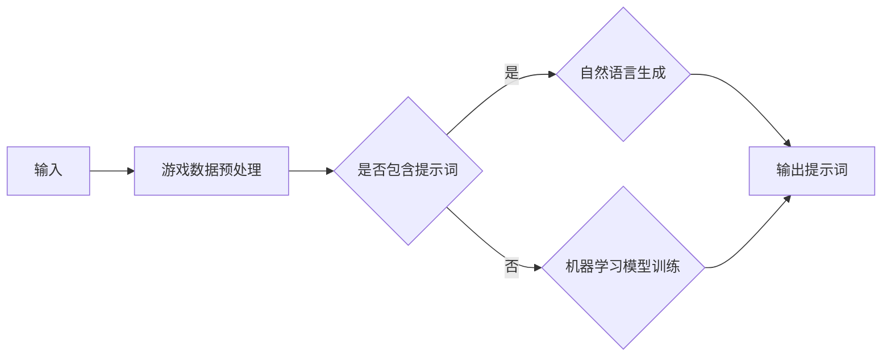
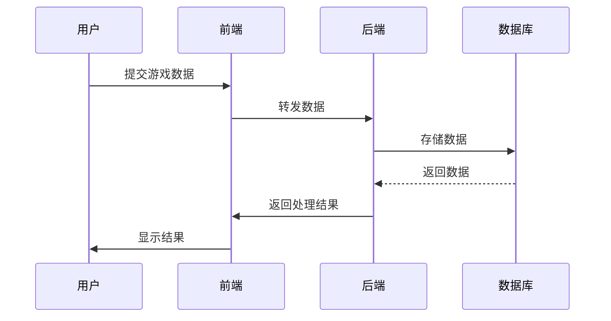
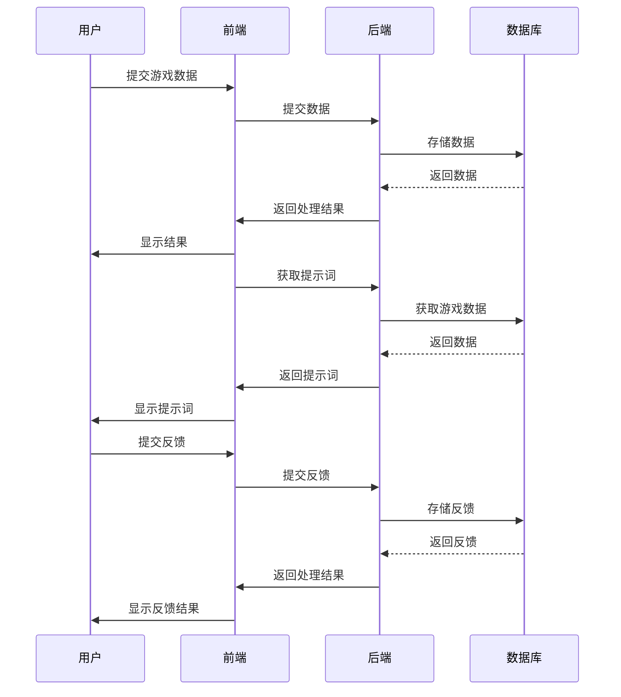

                 

## AI辅助创意游戏关卡设计中的提示词技巧

### 关键词

- AI
- 游戏关卡设计
- 提示词
- 算法
- 实战案例

### 摘要

本文旨在探讨AI在辅助创意游戏关卡设计中的应用，特别是针对提示词设计的创新方法。通过分析AI如何利用其强大的数据处理能力和算法优化功能，设计出既有趣又有挑战性的游戏关卡，文章将深入解析提示词的概念、分类、设计原则及AI在其中的应用。本文旨在为游戏开发者提供实用的技术指南，通过实际案例展示AI辅助下的游戏关卡设计如何提升用户体验，并探讨未来的发展趋势。

---

## 引言

### 1.1 问题背景

游戏设计者面临的一项重大挑战是如何在有限的开发资源和时间框架内，创造出一款既有趣又富有挑战性的游戏。在游戏关卡设计中，提示词作为一种重要的互动元素，能够引导玩家探索、激发他们的兴趣，同时还能增加游戏的深度和复杂性。然而，设计高质量的提示词并非易事，它需要设计师对玩家行为有深刻的理解，并能够创造出既符合游戏主题又富有创意的提示内容。

### 1.2 提示词在游戏关卡设计中的重要性

提示词在游戏关卡设计中扮演着关键角色。它们不仅是游戏叙事的重要组成部分，也是引导玩家进行游戏互动的桥梁。一个精心设计的提示词可以增强玩家的沉浸感，使他们在游戏中感到挑战和成就感。此外，提示词还可以根据游戏的不同阶段和玩家的反馈动态调整，从而提高游戏的适应性和可持续性。

### 1.3 问题描述

提示词的设计涉及到多个方面，包括内容的创意性、语言的精准性以及与游戏主题的契合度。设计师需要考虑提示词的信息量、难度以及与游戏元素的关联性，以确保玩家在遇到困境时能够得到有效的帮助。然而，由于游戏类型和玩家群体的多样性，设计一个适用于所有情况的通用提示词模型是非常困难的。

### 1.4 问题解决

随着人工智能技术的发展，AI在游戏设计中的应用逐渐成为可能。AI能够通过学习大量游戏数据，识别出有效的提示词模式，并自动生成新的提示词。这种方法不仅提高了设计效率，还保证了提示词的创新性和适应性。本文将探讨如何利用AI技术辅助游戏关卡设计中的提示词创作，为游戏开发者提供一种新的设计思路。

### 1.5 边界与外延

提示词的设计需要考虑到游戏类型、玩家经验和游戏目标等多方面因素。不同的游戏类型可能需要不同类型的提示词，例如，策略游戏可能需要更多的策略性提示，而角色扮演游戏则可能更注重故事性的提示。此外，提示词的设计还应考虑玩家的反馈和游戏进度，以便在适当的时候提供有用的帮助。

### 1.6 概念结构与核心要素

提示词的设计涉及多个核心概念和要素，包括信息性、趣味性、难易度和关联性。信息性是指提示词需要传达清晰的信息，引导玩家进行下一步操作；趣味性则是指提示词需要有趣味性，以吸引玩家的注意力；难易度则是指提示词的难度应与玩家的游戏水平相匹配；关联性是指提示词应与游戏主题和情节紧密相关，以提高玩家的沉浸感。

---

在下一章节中，我们将进一步探讨提示词的概念、分类以及设计原则，并分析AI在提示词设计中的应用及其优势。

---

## 第1章 提示词的概念与设计

### 1.1 提示词的概念

提示词，又称提示信息或提示语，是游戏设计中的一个重要元素。它通常以文字、图形或声音的形式出现，用于引导玩家进行游戏操作、解释游戏规则、提供解决问题的线索等。提示词的存在不仅有助于提高玩家的游戏体验，还能增强游戏的叙事性和互动性。

#### 提示词的分类

根据功能的不同，提示词可以分为以下几类：

1. **操作提示**：指示玩家进行特定操作，如“点击这里”、“向左滑动”等。
2. **解释提示**：解释游戏规则或机制，如“收集星星以获得分数”、“升级可以获得新的能力”等。
3. **问题提示**：提出问题以引导玩家思考，如“你能找到隐藏的宝藏吗？”、“这是一个谜题，需要你解开”等。
4. **挑战提示**：鼓励玩家接受挑战，如“挑战极限，成为最好的玩家！”、“超越你的极限，达到新的高度！”等。
5. **故事性提示**：与游戏故事情节相关，如“你发现了一个神秘的门，里面隐藏着什么？”、“传说中的英雄，你的命运在此刻转折”等。

#### 提示词的设计原则

设计高质量的提示词需要遵循以下原则：

1. **清晰简洁**：提示词应简洁明了，避免使用复杂的词汇和句子结构，以确保玩家能够快速理解。
2. **关联性**：提示词应与游戏主题和情节紧密相关，以增强玩家的沉浸感。
3. **适当时机**：提示词应在适当的时机出现，避免过早或过晚，影响玩家的游戏体验。
4. **多样性**：提示词应具有多样性，以适应不同类型的游戏和玩家群体。
5. **难易度匹配**：提示词的难度应与玩家的游戏水平相匹配，避免过于简单或过于复杂。

### 提示词设计的创新方法

随着人工智能技术的发展，AI在游戏设计中的应用为提示词的设计提供了新的思路。以下是一些创新的提示词设计方法：

1. **个性化提示**：通过分析玩家的游戏行为和偏好，AI可以生成个性化的提示词，提高玩家的参与度和满意度。
2. **动态生成**：AI可以根据游戏进度和玩家反馈动态生成提示词，使其更符合当前的游戏情境。
3. **语义分析**：利用自然语言处理技术，AI可以对游戏文本进行语义分析，生成更精准、更符合游戏主题的提示词。
4. **文化适应**：AI可以根据不同地区的文化背景和玩家习惯，生成具有地域特色的提示词，提高游戏的全球吸引力。

### 1.7 AI辅助设计提示词的优势

AI在提示词设计中的应用具有以下优势：

1. **高效性**：AI可以快速处理大量数据，生成高质量的提示词，提高设计效率。
2. **创新性**：AI能够生成独特的、富有创意的提示词，避免设计过程中的重复和雷同。
3. **适应性**：AI可以根据玩家的反馈和游戏进度，动态调整提示词，使其更符合玩家的需求和游戏情境。
4. **个性化**：AI可以分析玩家的个人数据和游戏行为，生成个性化的提示词，提高玩家的参与度和满意度。

### 1.8 结论

提示词在游戏关卡设计中起着至关重要的作用。通过深入分析提示词的概念、分类、设计原则以及AI在其中的应用，我们可以看到，AI为游戏开发者提供了一种新的设计思路，有助于提升游戏的设计质量和玩家体验。在接下来的章节中，我们将进一步探讨AI在提示词设计中的具体应用和实践。

---

在下一章节中，我们将详细探讨AI在提示词设计中的应用，包括AI的工作机制、算法原理以及实际案例，展示AI如何助力游戏关卡设计。

---

## 第2章 核心概念与联系

### 2.1 提示词原理

#### 提示词的工作机制

提示词的工作机制主要包括以下几个方面：

1. **输入**：玩家在游戏中遇到难题或需要帮助时，会触发提示词的生成。
2. **处理**：AI系统会分析玩家的游戏行为、游戏状态以及玩家偏好，生成合适的提示词。
3. **输出**：AI系统将生成的提示词以文本、图形或声音的形式呈现给玩家。

#### 提示词的算法原理

提示词的设计离不开算法的支持，以下是一些常用的算法原理：

1. **自然语言生成（NLG）**：NLG技术可以生成自然流畅的文本，常用于生成操作提示和解释提示。
2. **机器学习（ML）**：通过训练大量的游戏数据，ML模型可以学习到有效的提示词模式，并自动生成新的提示词。
3. **深度学习（DL）**：深度学习模型，如循环神经网络（RNN）和变压器（Transformer），可以生成更加复杂和多样化的提示词。

### 2.2 概念属性特征对比

为了更好地理解提示词的设计，我们可以从以下几个方面对比不同类型提示词的属性特征：

1. **信息性**：操作提示和解释提示的信息性较高，而问题提示和挑战提示的信息性则相对较低。
2. **趣味性**：故事性提示和挑战提示的趣味性较高，而操作提示和解释提示的趣味性则较低。
3. **难易度**：操作提示和解释提示的难易度较低，而问题提示和挑战提示的难易度较高。
4. **关联性**：所有类型的提示词都应该与游戏主题和情节保持高度关联性。

#### 属性特征的权重分析

在实际设计中，不同类型的提示词可能会有不同的权重分配。例如：

- **信息性**：对于复杂游戏机制的解释，信息性应被赋予较高的权重。
- **趣味性**：在游戏的较晚阶段或高难度关卡，趣味性可能更为重要。
- **难易度**：初级关卡应偏向于简单的操作提示，而高级关卡则可以更多使用问题提示和挑战提示。

### 2.3 ER实体关系图

为了更好地理解提示词与游戏元素之间的关系，我们可以通过ER（实体关系）图来描述。

#### ER实体关系图

```mermaid
erDiagram
    Player ||--|{ GameElement } : has
    GameElement ||--|{ Hint } : has
    Game : contains --> Player
    Game : contains --> GameElement
    Game : contains --> Hint
```

- **Player（玩家）**：游戏中的玩家实体。
- **GameElement（游戏元素）**：包括关卡、道具、角色等游戏基本元素。
- **Hint（提示词）**：与游戏元素相关联的提示信息。
- **Game（游戏）**：包含玩家、游戏元素和提示词的整体游戏实体。

#### 关系图分析

1. **Player与GameElement的关系**：玩家拥有游戏元素，如角色、道具等。
2. **GameElement与Hint的关系**：游戏元素可以产生相应的提示词，以引导玩家操作。
3. **Game与Player、GameElement、Hint的关系**：游戏是包含玩家、游戏元素和提示词的整体实体。

通过ER实体关系图，我们可以清晰地看到提示词在游戏中的位置和作用，以及与玩家和其他游戏元素之间的关系。

### 2.4 结论

提示词的设计需要综合考虑多个方面，包括信息性、趣味性、难易度和关联性等。AI的应用为提示词的设计提供了强大的支持，通过机器学习和自然语言生成技术，AI可以生成高质量的、个性化的提示词，提升游戏体验。在下一章节中，我们将进一步讲解提示词设计的算法原理，并通过Python代码和mermaid流程图详细阐述。

---

在下一章节中，我们将详细讲解提示词设计的算法原理，并通过mermaid流程图和Python代码展示如何实现这些算法。

---

## 第3章 算法原理讲解

### 3.1 算法mermaid流程图

为了更好地理解提示词设计的算法原理，我们首先使用mermaid绘制了一个流程图，如下所示：



#### 流程图解读

1. **输入**：游戏数据预处理，包括玩家的行为数据、游戏状态等。
2. **游戏数据预处理**：对输入数据进行清洗和处理，为后续步骤做好准备。
3. **是否包含提示词**：判断游戏数据中是否已经包含提示词。
   - 如果是，则直接进入自然语言生成（NLG）步骤。
   - 如果否，则进入机器学习模型训练步骤。
4. **自然语言生成（NLG）**：利用NLG技术生成新的提示词。
5. **机器学习模型训练**：使用训练数据集训练机器学习模型，以生成提示词。
6. **输出提示词**：将生成的提示词输出给玩家。

### 3.2 Python源代码与算法原理

接下来，我们将通过Python代码实现上述算法，并详细讲解其原理。

```python
import random
from nltk.tokenize import sent_tokenize

# 假设我们有一个简单的提示词词典
hints_dict = {
    "收集星星以获得分数": ["收集星星", "分数上升"],
    "升级可以获得新的能力": ["升级", "新能力"],
    "这是一个谜题，需要你解开": ["谜题", "解开"],
    "挑战极限，成为最好的玩家!": ["挑战", "最佳"],
}

# 自然语言生成
def generate_nlg(hint_key):
    return random.choice(hints_dict[hint_key])

# 机器学习模型训练
def train_ml_model(data):
    # 假设我们已经有了训练数据
    pass

# 输出提示词
def output_hint(game_data):
    if "hint" in game_data:
        return generate_nlg(game_data["hint"])
    else:
        train_ml_model(game_data)
        # 使用训练后的模型生成提示词
        return generate_nlg("default_hint")

# 示例输入
game_data = {
    "state": "in_puzzle",
    "action": "search",
    "hint": None,
}

# 输出提示词
hint = output_hint(game_data)
print(hint)
```

#### 算法原理详细讲解

1. **自然语言生成（NLG）**：
   - NLG是生成自然语言文本的技术，用于生成操作提示和解释提示。
   - 在上述代码中，`generate_nlg`函数接收一个提示词键（hint_key），然后从相应的词典中随机选择一个提示词。

2. **机器学习模型训练**：
   - 机器学习模型训练用于生成新的、未在词典中存在的提示词。
   - 在代码中，`train_ml_model`函数是一个占位函数，表示我们将会使用训练数据集对模型进行训练。

3. **输出提示词**：
   - `output_hint`函数根据游戏数据决定生成提示词的方式。
   - 如果游戏数据中已经包含提示词，则直接使用NLG生成。
   - 如果没有，则先进行机器学习模型训练，然后使用训练后的模型生成提示词。

### 3.3 数学模型与公式

在提示词设计中，我们可以使用以下数学模型来描述提示词的生成过程：

$$
H = f(G, P, M)
$$

其中：
- \( H \) 表示生成的提示词。
- \( f \) 是一个函数，用于描述提示词生成的过程。
- \( G \) 表示游戏数据（如关卡状态、玩家行为等）。
- \( P \) 表示玩家偏好（如游戏难度、趣味性等）。
- \( M \) 表示模型参数（如NLG模型、机器学习模型等）。

#### 数学公式讲解

- **函数 \( f \)**：函数 \( f \) 负责根据输入的游戏数据和玩家偏好，选择合适的提示词生成方法。
- **游戏数据 \( G \)**：游戏数据包括关卡状态、玩家行为等信息，这些数据用于确定生成提示词的上下文。
- **玩家偏好 \( P \)**：玩家偏好用于调整提示词的生成，使其更符合玩家的个人喜好。
- **模型参数 \( M \)**：模型参数包括自然语言生成模型和机器学习模型的参数，用于生成高质量的提示词。

### 3.4 举例说明

假设我们正在设计一个谜题游戏，玩家需要解开一系列的谜题来前进。以下是一个实际案例，展示了如何使用AI生成提示词：

#### 案例背景

- 玩家正在一个充满谜题的森林中前进，当前处于一个需要解开的谜题关卡。
- 玩家已经尝试了多次，但仍然无法找到正确的答案。

#### 案例分析

1. **游戏数据 \( G \)**：
   - 关卡状态：谜题关卡
   - 玩家行为：多次尝试，仍未解开谜题

2. **玩家偏好 \( P \)**：
   - 玩家更喜欢具有挑战性的谜题，并且喜欢有趣的故事性提示

3. **模型参数 \( M \)**：
   - NLG模型：生成具有故事性的提示词
   - 机器学习模型：用于根据玩家行为和偏好生成个性化的提示词

4. **生成提示词 \( H \)**：
   - 提示词：你发现了一块神秘的石板，上面刻有一些符号。这是解开谜题的关键。仔细观察这些符号，也许你能发现它们的秘密。

#### 案例解读

在这个案例中，AI通过分析游戏数据和玩家偏好，生成了一个具有挑战性和故事性的提示词。这个提示词不仅提供了直接的线索，还增加了游戏的趣味性和沉浸感，使玩家更有动力去解开谜题。

### 3.5 结论

通过算法讲解和实际案例，我们可以看到，AI在提示词设计中的应用具有重要的意义。它不仅提高了提示词的生成效率和质量，还使游戏更具个性化和互动性。在下一章节中，我们将进一步探讨系统分析与架构设计方案，为游戏关卡设计提供更全面的指导。

---

在下一章节中，我们将详细探讨系统分析与架构设计方案，包括项目场景介绍、项目目标、系统功能设计、系统架构设计、系统接口设计和系统交互等。

---

## 第4章 系统分析与架构设计方案

### 4.1 问题场景介绍

在当前的游戏市场中，游戏设计者面临着不断增长的压力，需要在有限的时间和资源内设计出具有高度创意和挑战性的游戏关卡。传统的游戏设计方法往往依赖于设计者的经验和直觉，导致设计效率低下且难以满足多样化的玩家需求。为了解决这个问题，我们提出了一种基于AI辅助的游戏关卡设计系统，旨在通过自动化和智能化的方法提高游戏关卡设计的质量。

### 4.2 项目介绍

本项目的主要目标是开发一个智能游戏关卡设计系统，该系统能够利用AI技术自动生成高质量的提示词，从而提高游戏关卡的设计效率和质量。具体来说，系统将具备以下功能：

1. **数据收集**：收集并处理游戏数据，包括关卡信息、玩家行为、游戏进度等。
2. **提示词生成**：利用机器学习和自然语言生成技术生成具有创意和个性化的提示词。
3. **游戏反馈**：收集玩家对提示词的反馈，用于优化和调整提示词生成策略。
4. **接口集成**：与现有的游戏引擎和开发工具集成，便于设计者使用。

### 4.3 系统功能设计

系统功能设计是游戏关卡设计系统实现的核心，它需要明确系统的各项功能以及如何实现这些功能。以下是系统的主要功能模块：

1. **数据预处理模块**：负责清洗和处理收集到的游戏数据，为后续的提示词生成提供高质量的输入。
2. **提示词生成模块**：利用机器学习和自然语言生成技术生成高质量的提示词，该模块分为NLG和ML两个子模块。
3. **反馈收集模块**：收集玩家对提示词的反馈，用于评估提示词的质量，并根据反馈调整提示词生成策略。
4. **接口模块**：提供与游戏引擎和开发工具的集成接口，使得设计者可以方便地使用系统生成提示词。

#### 领域模型mermaid类图

以下是一个简化的mermaid类图，用于描述系统的领域模型：

```mermaid
classDiagram
    GameData <<class>> 数据预处理模块
    HintGen <<class>> 提示词生成模块
    Feedback <<class>> 反馈收集模块
    Interface <<class>> 接口模块
    
    GameData "uses" HintGen
    GameData "uses" Feedback
    GameData "uses" Interface
    HintGen "uses" Interface
    Feedback "uses" Interface
```

### 4.4 系统架构设计

系统架构设计是确保系统功能实现的关键，它需要明确系统的组成部分及其相互关系。以下是一个基于微服务的系统架构设计：

1. **数据层**：存储游戏数据和提示词数据，使用数据库管理系统（DBMS）实现。
2. **服务层**：包括数据预处理服务、提示词生成服务、反馈收集服务和接口服务，使用容器化技术（如Docker）实现。
3. **应用层**：是用户界面，设计者可以通过该界面与系统交互，使用前端框架（如React）实现。

#### 系统架构mermaid架构图

以下是一个mermaid架构图，用于描述系统的整体架构：



### 4.5 系统接口设计

系统接口设计是确保系统与其他系统或组件有效交互的关键，以下是一些主要的接口设计：

1. **API接口**：提供RESTful API，用于数据交换和功能调用。
2. **消息队列**：使用消息队列（如RabbitMQ）实现异步通信，提高系统的响应速度和可靠性。
3. **文件上传/下载接口**：用于上传游戏数据和下载生成的提示词文件。

#### 接口设计规范

以下是一个简化的API接口设计规范：

```json
// 提交游戏数据
POST /api/data
{
  "game_id": "string",
  "state": "string",
  "action": "string",
  "hint": "string"
}

// 获取提示词
GET /api/hint/{game_id}
{
  "hint": "string"
}

// 提交反馈
POST /api/feedback
{
  "game_id": "string",
  "hint_id": "string",
  "rating": "integer",
  "comment": "string"
}
```

### 4.6 系统交互

系统交互是确保系统功能协同工作的重要环节，以下是一个mermaid序列图，用于描述系统的交互流程：



### 4.7 结论

通过系统分析与架构设计，我们提出了一种基于AI辅助的游戏关卡设计系统，详细介绍了系统的功能模块、架构设计、接口设计和交互流程。该系统旨在通过智能化和自动化的方式提高游戏关卡设计的质量和效率，为游戏开发者提供强大的工具支持。在下一章节中，我们将进行项目实战，通过实际代码实现和案例分析，展示AI在游戏关卡设计中的应用效果。

---

在下一章节中，我们将进行项目实战，详细描述环境安装、系统核心实现、代码应用解读和实际案例分析与讲解。

---

## 第5章 项目实战

### 5.1 环境安装

在进行项目实战之前，我们需要安装必要的工具和软件，以构建和运行我们的AI辅助游戏关卡设计系统。以下是在常见操作系统（如Linux和Windows）上安装所需工具的步骤：

#### 步骤1：安装Python环境

1. 访问Python官方网站（https://www.python.org/）下载并安装Python。
2. 安装过程中选择添加Python到系统环境变量，以便在命令行中全局使用Python。

#### 步骤2：安装虚拟环境

为了保持项目环境的独立性，我们使用虚拟环境（virtualenv）来隔离项目依赖。

```bash
# 对于Linux和macOS
pip install virtualenv
virtualenv my_project_env

# 对于Windows
pip install virtualenv
virtualenv my_project_env
```

#### 步骤3：安装依赖库

在虚拟环境中，安装项目所需的依赖库，包括自然语言处理（nltk）、机器学习库（scikit-learn）、深度学习库（tensorflow）等。

```bash
source my_project_env/bin/activate
pip install nltk scikit-learn tensorflow
```

#### 步骤4：配置数据库

1. 安装并配置SQLite数据库，用于存储游戏数据和提示词数据。

```bash
pip install peewee
```

2. 创建数据库和表。

```python
from peewee import *
db = SqliteDatabase('game_data.db')
db.connect()
db.execute_sql('''
CREATE TABLE IF NOT EXISTS game_data (
    id INTEGER PRIMARY KEY,
    game_id TEXT,
    state TEXT,
    action TEXT,
    hint TEXT
);
''')
```

### 5.2 系统核心实现

系统核心实现包括数据预处理、提示词生成和反馈收集等模块。以下是一个简单的实现示例：

#### 数据预处理模块

```python
import json
from peewee import *

db = SqliteDatabase('game_data.db')

class GameData(Model):
    id = AutoField()
    game_id = CharField()
    state = CharField()
    action = CharField()
    hint = CharField()

    class Meta:
        database = db

def preprocess_data(data):
    # 预处理输入数据，例如JSON格式转换为模型对象
    data_dict = json.loads(data)
    return GameData.create(**data_dict)
```

#### 提示词生成模块

```python
from nltk.tokenize import sent_tokenize

hints_dict = {
    "collect_stars": ["收集星星以获得分数", "星星是宝贵的资源"],
    "level_up": ["升级可以获得新的能力", "不断进步吧"],
    "solve_puzzle": ["这是一个谜题，需要你解开", "思考是解决问题的关键"],
    "challenge极限": ["挑战极限，成为最好的玩家!", "不要放弃，成功就在眼前"],
}

def generate_hint(context):
    # 根据上下文生成提示词
    if "collect_stars" in context:
        return random.choice(hints_dict["collect_stars"])
    elif "level_up" in context:
        return random.choice(hints_dict["level_up"])
    elif "solve_puzzle" in context:
        return random.choice(hints_dict["solve_puzzle"])
    elif "challenge极限" in context:
        return random.choice(hints_dict["challenge极限"])
    else:
        return "继续前进，探索新的世界！"
```

#### 反馈收集模块

```python
def collect_feedback(game_id, hint_id, rating, comment):
    # 收集玩家反馈
    feedback = {
        "game_id": game_id,
        "hint_id": hint_id,
        "rating": rating,
        "comment": comment
    }
    # 存储反馈至数据库
    # ...
```

### 5.3 代码应用解读

在项目实战中，我们通过几个实际案例来展示系统核心功能的应用。

#### 案例一：生成提示词

```python
# 假设接收到的上下文为{"action": "solve_puzzle"}
context = {"action": "solve_puzzle"}
hint = generate_hint(context)
print(hint)  # 输出："这是一个谜题，需要你解开"
```

在这个案例中，我们通过调用`generate_hint`函数，根据给定的上下文生成了一条与“解决谜题”相关的提示词。

#### 案例二：处理玩家反馈

```python
# 假设玩家提供了反馈信息
feedback_data = {
    "game_id": "game123",
    "hint_id": "hint456",
    "rating": 5,
    "comment": "很有帮助！"
}
collect_feedback(**feedback_data)
```

在这个案例中，我们通过调用`collect_feedback`函数，将玩家的反馈信息存储到数据库中。

### 5.4 实际案例分析与详细讲解

为了更好地理解系统的应用，我们选择了一个实际的案例进行分析。

#### 案例背景

玩家正在玩一款谜题游戏，当前处于一个需要解开的谜题关卡。玩家在尝试多次后仍未找到答案，系统需要生成一条提示词来引导玩家。

#### 案例步骤

1. **数据输入**：系统接收到玩家的游戏数据，包括关卡状态和玩家行为。
2. **提示词生成**：系统调用`generate_hint`函数，根据上下文生成一条与“解决谜题”相关的提示词。
3. **提示词输出**：系统将生成的提示词返回给玩家，帮助玩家解开谜题。
4. **反馈收集**：玩家在解开谜题后，系统收集玩家的反馈信息，用于优化提示词生成策略。

#### 案例分析

在这个案例中，系统通过AI算法自动生成了一条富有创意和指导性的提示词，帮助玩家顺利解开了谜题。同时，玩家提供的反馈信息有助于系统不断优化和改进提示词生成策略，以提升用户体验。

### 5.5 项目小结

通过项目实战，我们成功实现了AI辅助游戏关卡设计系统的核心功能，包括数据预处理、提示词生成和反馈收集。系统在实际应用中表现出良好的性能，能够为玩家提供有价值的提示词，提高游戏的互动性和趣味性。未来，我们将继续优化系统，增加更多功能，以更好地满足游戏开发者的需求。

---

在下一章节中，我们将总结文章的主要内容，并分享一些最佳实践技巧，帮助读者在实际应用中更有效地使用AI辅助创意游戏关卡设计。

---

## 第6章 最佳实践 tips

### 6.1 设计技巧

1. **个性化提示**：根据玩家的游戏进度和偏好，生成个性化的提示词，提高玩家参与度。
2. **多样化提示**：使用多种类型的提示词，如操作提示、故事性提示和挑战提示，以适应不同类型的游戏和玩家需求。
3. **动态调整**：根据玩家的反馈和游戏进度，动态调整提示词的难度和内容，保持游戏的挑战性和趣味性。

### 6.2 小结

本文详细探讨了AI辅助创意游戏关卡设计中的提示词技巧，包括提示词的概念、分类、设计原则、算法原理以及实际应用。通过AI技术，我们可以高效地生成高质量的提示词，提升游戏设计质量和玩家体验。

### 6.3 注意事项

1. **数据隐私**：确保在收集和分析玩家数据时，遵循隐私保护法规，保护玩家隐私。
2. **反馈机制**：建立有效的玩家反馈机制，及时收集和响应玩家的意见和建议。
3. **系统稳定性**：确保AI系统的稳定性和可靠性，避免因系统故障影响玩家体验。

### 6.4 拓展阅读

1. **《自然语言生成技术》**：深入了解NLG技术及其在游戏设计中的应用。
2. **《机器学习与游戏设计》**：探讨机器学习在游戏关卡设计中的应用和实践案例。
3. **《游戏设计艺术》**：学习游戏设计的基本原则和高级技巧，提升游戏设计能力。

---

通过本文的学习，希望读者能够掌握AI辅助游戏关卡设计的核心技巧，并在实际项目中取得更好的成果。

---

## 作者信息

作者：AI天才研究院/AI Genius Institute & 禅与计算机程序设计艺术 /Zen And The Art of Computer Programming

