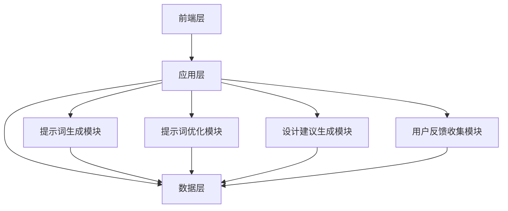
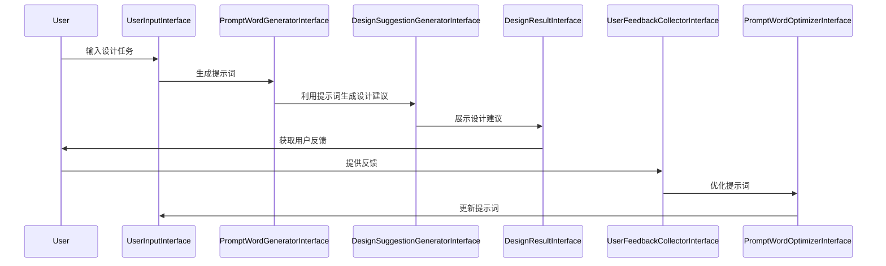

                 

### 第一部分: 背景与核心概念

## 1.1.1 问题背景

创意设计，是艺术和技术的结合，涵盖了从广告设计、工业设计到用户体验设计等多个领域。然而，随着市场的竞争加剧和消费者需求的多变，创意设计面临着诸多挑战：

1. **创意枯竭**：设计者在面对重复性的任务和不断涌现的新趋势时，常常感到灵感不足。
2. **时间压力**：设计周期缩短，项目进度紧张，导致设计师难以进行深度思考和精细设计。
3. **个性化需求**：消费者越来越注重个性化和定制化，设计师需要更快地满足多样化的需求。

人工智能（AI）的兴起，为解决上述问题提供了新的思路。AI在创意设计中的应用，主要体现在以下几个方面：

1. **自动化工具**：通过计算机视觉和自然语言处理技术，自动生成设计草图、配色方案等。
2. **辅助创意**：利用深度学习和生成对抗网络（GAN），AI可以辅助设计师生成新颖的创意。
3. **智能推荐**：通过分析用户行为和偏好，AI可以提供个性化的设计建议。

在本文中，我们将探讨AI如何通过提示词技术辅助创意设计，提高设计的效率和质量。

### 1.1.2 提示词的定义与作用

**提示词**（Prompt Word），是一种引导创意思考的词语或短语，它能够激发设计师的灵感，帮助他们从不同的角度和维度进行思考。在AI辅助创意设计中，提示词的作用至关重要：

1. **引导思考**：提示词可以帮助设计师跳出原有的思维定式，从全新的角度审视问题。
2. **激发灵感**：通过关键词的提示，设计师可以快速联想到相关的设计元素和概念。
3. **优化流程**：在AI的帮助下，提示词可以实时调整，以适应设计过程中的变化。

### 1.1.3 提示词的类型

在AI辅助创意设计中，根据应用场景和目的，提示词可以分为以下几类：

1. **通用提示词**：这类提示词适用于各种创意设计领域，如“创新”、“简洁”、“未来感”等。
2. **行业特定提示词**：针对不同行业的特点，如“时尚”、“高科技”、“环保”等，这类提示词更具有针对性。
3. **自适应提示词**：这类提示词可以根据设计师的反馈和设计过程中的变化，动态调整，以实现最佳效果。

通过上述分类，我们可以看到，提示词在AI辅助创意设计中扮演着不可或缺的角色。接下来，我们将进一步探讨AI是如何生成和优化这些提示词的。

## 1.2.1 提示词生成算法

在AI辅助创意设计中，提示词的生成是关键的一环。根据生成方式的不同，提示词生成算法主要可以分为以下三类：

### 1.2.1.1 基于规则的方法

基于规则的方法是最传统的一种提示词生成方式。它通过预设的规则和模板，将输入的词汇进行组合和变换，生成相应的提示词。这种方法简单直观，适用于一些结构化较强、规则明确的设计任务。

例如，在广告设计中，可以使用以下规则生成提示词：

- **广告语模板**：产品名 + 功能特点 + 情感诉求
- **颜色提示词**：根据设计风格和主题，选择相应的颜色名称

基于规则的方法虽然简单，但其在应对复杂和多变的设计任务时，灵活性较差。

### 1.2.1.2 基于机器学习的方法

基于机器学习的方法通过学习大量的设计案例和创意文本，自动生成合适的提示词。这种方法具有很高的灵活性和适应性，能够根据不同的设计需求，生成个性化的提示词。

常见的机器学习方法包括：

- **朴素贝叶斯分类器**：通过分析设计文本中的关键词和主题，预测最可能的提示词。
- **决策树**：根据设计文本的特征，逐步缩小搜索范围，最终生成提示词。

基于机器学习的方法在生成提示词时，可以结合多种算法和特征，提高生成效果。

### 1.2.1.3 基于深度学习的方法

基于深度学习的方法是目前最为先进的一种提示词生成方式。它利用神经网络模型，特别是生成对抗网络（GAN）和变分自编码器（VAE），从大规模数据中学习生成提示词。

常见的深度学习方法包括：

- **生成对抗网络（GAN）**：由生成器和判别器组成，生成器生成提示词，判别器判断提示词的质量，通过不断的对抗和优化，生成高质量的提示词。
- **变分自编码器（VAE）**：通过编码和解码过程，将输入数据转换为提示词。

基于深度学习的方法在生成提示词时，具有更高的创造性和灵活性，能够处理更加复杂和多变的设计任务。

综上所述，不同类型的提示词生成算法各有优劣，在实际应用中，可以根据设计需求和场景选择最合适的方法。

### 1.2.2 提示词优化算法

在AI辅助创意设计中，生成高质量的提示词是一个关键问题。提示词优化算法旨在提高提示词的质量和适用性，从而提升设计的效果。下面将介绍几种常见的提示词优化算法。

#### 1.2.2.1 提示词质量评估

提示词质量评估是提示词优化的第一步。一个高质量的提示词应具备以下几个特点：

1. **相关性**：提示词应与设计任务密切相关，能够引导设计师产生与任务相关的创意。
2. **新颖性**：提示词应具有一定的创新性，能够激发设计师的灵感。
3. **多样性**：提示词应涵盖不同的设计元素和概念，提供多样化的创意方向。
4. **可理解性**：提示词应简洁明了，易于设计师理解和应用。

为了评估提示词的质量，可以使用以下几种方法：

1. **人工评估**：通过专家评审，根据提示词的相关性、新颖性、多样性和可理解性进行评分。
2. **自动评估**：利用自然语言处理技术，如词频统计、文本分类和主题模型，对提示词的质量进行量化评估。

#### 1.2.2.2 提示词多样化策略

在创意设计过程中，多样化的提示词有助于激发设计师的灵感，避免设计过程的单一和重复。以下是几种常见的提示词多样化策略：

1. **词性变换**：通过对提示词的词性进行变换，生成新的提示词。例如，将名词转换为动词，或将形容词转换为名词。
2. **同义词替换**：用同义词替换原有的提示词，增加提示词的多样性。
3. **短语扩展**：在原有提示词的基础上，添加相关的短语或扩展词，形成新的提示词。
4. **主题聚类**：根据设计任务的主题，对提示词进行聚类，生成不同主题的提示词集合。

#### 1.2.2.3 提示词实时优化

在AI辅助创意设计过程中，提示词的实时优化非常重要。实时优化可以在设计过程中根据设计师的反馈和设计结果，动态调整提示词，以提高设计的效率和质量。以下是几种常见的实时优化方法：

1. **用户反馈**：根据设计师的反馈，如点赞、评论和评分，对提示词进行实时调整。
2. **设计结果分析**：通过分析设计结果的质量和多样性，对提示词进行优化。
3. **模型更新**：利用机器学习和深度学习技术，根据新的数据和学习结果，不断更新和优化提示词生成模型。

通过以上方法，可以实现对提示词的高效优化，从而提升AI辅助创意设计的整体效果。

### 1.2.3 提示词与创意设计流程的集成

在AI辅助创意设计中，提示词的生成和优化是关键环节，但如何将提示词与创意设计流程有效集成，也是决定设计效果的重要因素。以下是几种常见的集成方式：

#### 1.2.3.1 提示词的实时反馈机制

实时反馈机制是指在设计过程中，根据设计师的实时操作和反馈，动态调整提示词，以提高设计的效率和质量。具体实现方法如下：

1. **用户交互**：设计师可以通过输入关键词、点赞、评论等方式，实时反馈对提示词的意见和建议。
2. **反馈收集**：系统收集设计师的反馈数据，如点赞数、评论内容等。
3. **实时调整**：根据收集到的反馈数据，动态调整提示词，如增加或删除某些关键词，调整提示词的顺序等。

#### 1.2.3.2 提示词在创意生成中的应用

提示词在创意生成中的应用，可以通过以下几种方式实现：

1. **设计草图**：利用提示词生成设计草图，如广告海报、网页设计等。
2. **配色方案**：根据提示词生成相应的配色方案，如颜色组合、色块分布等。
3. **字体选择**：利用提示词生成适合的设计字体，如字体风格、字号大小等。

#### 1.2.3.3 提示词的多样化应用

提示词的多样化应用，可以提高设计的灵活性和创造性。以下是一些具体的应用方法：

1. **跨领域应用**：将不同领域的提示词进行组合，生成跨领域的创意设计。
2. **历史借鉴**：利用历史设计案例中的提示词，生成类似的设计风格。
3. **文化融合**：结合不同文化元素，生成具有文化特色的设计。

通过上述方法，可以将提示词与创意设计流程有效集成，从而实现高效、多样化的创意设计。

### 3.1.1 提示词生成的数学模型

在AI辅助创意设计中，提示词的生成往往涉及复杂的数学模型。这些模型可以帮助我们理解和预测提示词的生成过程，从而优化算法性能。以下是几种常见的提示词生成数学模型：

#### 3.1.1.1 概率模型

概率模型是一种基于概率分布的提示词生成方法。在这种模型中，每个提示词被视为一个随机变量，其生成过程可以表示为概率分布。常见的概率模型包括：

1. **朴素贝叶斯分类器**：通过计算每个词汇出现的概率，生成提示词。其公式为：
   \[
   P(\text{提示词}|\text{设计任务}) = \frac{P(\text{设计任务}|\text{提示词}) \cdot P(\text{提示词})}{P(\text{设计任务})}
   \]
   其中，\(P(\text{提示词})\)表示提示词的先验概率，\(P(\text{设计任务}|\text{提示词})\)表示设计任务在给定提示词条件下的条件概率。

2. **隐马尔可夫模型（HMM）**：通过状态转移概率和观测概率，生成提示词序列。其公式为：
   \[
   P(\text{提示词序列}) = \prod_{i=1}^{n} P(\text{提示词}_i|\text{状态}_i)
   \]
   其中，\(\text{状态}_i\)表示第\(i\)个时刻的设计状态。

概率模型简单直观，但在处理长文本和复杂依赖关系时，效果有限。

#### 3.1.1.2 确定性模型

确定性模型通过确定性的方式生成提示词，通常使用生成函数或决策树来实现。以下是两种常见的确定性模型：

1. **生成函数**：通过一系列的函数组合，生成提示词。其公式为：
   \[
   f(\text{输入}) = \text{提示词}
   \]
   其中，\(f\)表示生成函数，输入可以是关键词、设计要求等。

2. **决策树**：通过一系列的决策规则，生成提示词。其公式为：
   \[
   \text{决策树} = \{(\text{条件}_1, \text{提示词}_1), (\text{条件}_2, \text{提示词}_2), \ldots\}
   \]
   其中，每个条件表示一个决策节点，对应的提示词是满足该条件的结果。

确定性模型在处理简单和规则明确的设计任务时，效果较好，但在复杂和不确定的设计环境中，表现有限。

#### 3.1.1.3 混合模型

混合模型结合了概率模型和确定性模型的优点，通过融合多种方法，生成高质量的提示词。常见的混合模型包括：

1. **马尔可夫隐模型（HMM）**：结合隐马尔可夫模型和生成函数，生成提示词序列。其公式为：
   \[
   P(\text{提示词序列}) = \prod_{i=1}^{n} P(\text{提示词}_i|\text{状态}_i) \cdot P(\text{状态}_i|\text{输入})
   \]

2. **深度神经网络（DNN）**：通过多层神经网络，学习输入和提示词之间的复杂关系，生成高质量的提示词。其公式为：
   \[
   \text{DNN}(\text{输入}) = \text{提示词}
   \]

混合模型在处理复杂和多变的设计任务时，具有更高的灵活性和适应性。

### 3.1.2 提示词优化的数学公式

提示词优化的目标是提高提示词的质量和适用性。为了实现这一目标，需要定义相应的优化目标和优化算法。以下是几种常见的提示词优化数学公式：

#### 3.1.2.1 目标函数

目标函数用于衡量提示词的质量，其公式为：
\[
\text{目标函数} = f(\text{提示词质量})
\]
常见的质量指标包括：

1. **相关性**：提示词与设计任务的关联程度。其公式为：
   \[
   \text{相关性} = \frac{\text{相关词汇数}}{\text{总词汇数}}
   \]

2. **新颖性**：提示词的创新程度。其公式为：
   \[
   \text{新颖性} = \frac{\text{新词汇数}}{\text{总词汇数}}
   \]

3. **多样性**：提示词的多样性。其公式为：
   \[
   \text{多样性} = \frac{\text{词汇类型数}}{\text{总词汇数}}
   \]

4. **可理解性**：提示词的可理解程度。其公式为：
   \[
   \text{可理解性} = \frac{\text{理解词汇数}}{\text{总词汇数}}
   \]

#### 3.1.2.2 优化算法

优化算法用于调整提示词，以实现目标函数的最优值。以下是几种常见的优化算法：

1. **梯度下降**：通过计算目标函数的梯度，更新提示词的参数。其公式为：
   \[
   \text{提示词}_{\text{新}} = \text{提示词}_{\text{旧}} - \alpha \cdot \nabla f(\text{提示词}_{\text{旧}})
   \]
   其中，\(\alpha\)为学习率。

2. **遗传算法**：通过模拟自然进化过程，优化提示词的基因。其公式为：
   \[
   \text{提示词}_{\text{新}} = \text{交叉}(\text{提示词}_{\text{父}}, \text{提示词}_{\text{母}}) + \text{变异}(\text{提示词}_{\text{新}})
   \]

3. **粒子群优化**：通过模拟鸟群觅食过程，优化提示词的位置。其公式为：
   \[
   \text{提示词}_{\text{新}} = \text{位置}_{\text{当前}} + \text{速度}_{\text{当前}}
   \]

通过上述数学模型和公式，我们可以对提示词的生成和优化进行深入分析和理解，从而在实际应用中取得更好的效果。

### 3.1.3 实例分析

为了更好地理解提示词生成的数学模型和优化过程，下面通过一个具体实例进行分析。

假设我们有一个创意设计任务，目标是生成一组与“未来科技”相关的提示词。我们使用朴素贝叶斯分类器作为生成模型，并使用梯度下降算法进行优化。

#### 3.1.3.1 数据准备

我们收集了一组关于未来科技的文本数据，包括文章、新闻、科技博客等，共计1000篇。通过自然语言处理技术，提取出这些文本中的关键词，构建一个词汇表。

例如，词汇表中的一些关键词包括：“人工智能”、“虚拟现实”、“区块链”、“智能城市”、“物联网”等。

#### 3.1.3.2 模型训练

使用朴素贝叶斯分类器，对词汇表中的关键词进行训练。具体步骤如下：

1. **计算关键词的先验概率**：对于每个关键词，计算其在所有文本中出现的频率，作为其先验概率。

2. **计算关键词的条件概率**：对于每个关键词，计算其在每个设计任务文本中出现的条件概率。

3. **构建概率分布**：根据训练数据，构建一个关于未来科技的词汇概率分布。

#### 3.1.3.3 提示词生成

利用训练好的朴素贝叶斯分类器，生成一组与未来科技相关的提示词。具体步骤如下：

1. **输入设计任务**：输入一个关于未来科技的设计任务，如“设计一个未来科技主题的展览”。

2. **计算提示词概率**：对于词汇表中的每个关键词，计算其在设计任务条件下的概率。

3. **选择最高概率的提示词**：从词汇表中选择概率最高的关键词作为提示词。

例如，生成的一组提示词可能是：“人工智能”、“虚拟现实”、“智能城市”、“物联网”。

#### 3.1.3.4 提示词优化

使用梯度下降算法，对生成的提示词进行优化。具体步骤如下：

1. **定义目标函数**：选择一个质量指标，如“相关性”，作为目标函数。

2. **计算梯度**：计算目标函数关于每个关键词的梯度。

3. **更新提示词**：根据梯度下降算法，更新每个关键词的概率，以优化提示词的质量。

通过以上步骤，我们可以生成一组高质量的、与未来科技相关的提示词，从而辅助创意设计。

### 4.1.1 问题场景介绍

在创意设计领域，特别是在广告、网页设计和产品设计等环节，AI的介入已经变得愈发重要。设计项目的复杂性和多样性要求设计过程需要更加高效、灵活，同时也要求能够快速适应市场变化和用户需求。

一个典型的问题场景是：一个广告设计团队需要在短时间内为一家新成立的科技公司设计一系列的广告海报和宣传视频。这个项目要求广告内容不仅要符合科技感强的风格，还要能够准确地传达公司的核心价值和业务方向。

在这个场景中，设计团队面临以下几个挑战：

1. **创意枯竭**：设计师在处理类似的项目时，可能会出现创意枯竭的问题，无法在短时间内提供多样化的设计思路。
2. **时间压力**：项目的交付时间紧，设计师需要在有限的时间内完成高质量的设计作品。
3. **个性化需求**：公司希望每个广告都能突出其独特的业务特点和价值观，这要求设计师能够提供高度个性化的设计方案。
4. **市场反馈**：设计成果需要在市场上快速测试，并根据市场反馈进行调整，这要求设计过程具有高度的可迭代性。

为了应对这些挑战，设计团队可以借助AI技术，特别是提示词生成和优化技术，来实现以下几个目标：

1. **激发创意**：通过AI生成的提示词，设计师可以从全新的角度和维度审视项目，激发出新的创意思路。
2. **提高效率**：AI可以快速生成多个设计方案，设计师可以在更短的时间内进行选择和优化。
3. **实现个性化**：AI可以根据公司的业务特点和用户需求，生成个性化的设计建议，提高广告的针对性和效果。
4. **迭代优化**：AI可以实时收集用户反馈，并动态调整设计参数，实现设计的持续优化。

通过AI的辅助，设计团队可以更高效地完成项目，同时确保设计作品的质量和个性化程度。

### 4.1.2 系统功能设计

为了实现上述目标，我们需要设计一个具备以下核心功能的AI辅助创意设计系统：

1. **用户输入接口**：用户可以通过这个接口输入设计任务和相关需求，如项目主题、目标用户、设计风格等。
2. **提示词生成模块**：基于用户输入，该模块利用机器学习和自然语言处理技术生成一组相关的提示词。
3. **提示词优化模块**：利用用户反馈和设计结果，该模块优化提示词，以提高设计的质量和适应性。
4. **设计建议生成模块**：根据生成的提示词，该模块生成具体的设计建议，包括广告海报、宣传视频等的创意方案。
5. **用户反馈收集模块**：收集用户对设计建议的反馈，包括点赞、评论、评分等，用于进一步优化系统。
6. **设计结果展示模块**：展示最终的设计成果，用户可以在这里查看和选择最满意的设计方案。

以下是系统的领域模型（Mermaid类图），用于展示系统的核心组件和它们之间的关系：

```mermaid
classDiagram
    UserInput -> PromptWordGenerator : 输入设计任务
    UserInput -> PromptWordOptimizer : 提供用户反馈
    PromptWordGenerator <|-- DesignSuggestionGenerator : 利用提示词生成设计建议
    PromptWordOptimizer <|-- DesignSuggestionGenerator : 优化设计建议
    DesignSuggestionGenerator --> UserFeedbackCollector : 收集用户反馈
    UserFeedbackCollector --> PromptWordOptimizer : 反馈用于优化
```

通过这个领域模型，我们可以清晰地看到各个模块的功能和相互关系，从而为系统架构设计提供参考。

### 4.1.3 系统架构设计

为了实现上述功能，我们需要设计一个高效、灵活且易于扩展的系统架构。以下是该AI辅助创意设计系统的架构设计：

#### 4.1.3.1 系统架构概述

系统架构主要包括以下几个层次：

1. **前端层**：负责用户交互，包括用户输入接口、设计结果展示等。
2. **应用层**：实现系统的核心功能，包括提示词生成、优化和设计建议生成等。
3. **数据层**：存储系统所需的数据，包括用户输入、设计结果、提示词等。

以下是系统的架构图（Mermaid架构图），用于展示各层次之间的关系：



#### 4.1.3.2 系统组件详细说明

1. **前端层**：
   - 用户输入接口：使用HTML和CSS构建，提供文本输入框、选择框等，方便用户输入设计任务相关信息。
   - 设计结果展示：使用HTML和CSS展示设计建议，用户可以通过滚动、筛选等方式查看不同的设计选项。

2. **应用层**：
   - 提示词生成模块：基于用户输入，使用自然语言处理和机器学习技术生成提示词。例如，可以采用BERT模型进行文本嵌入，结合分类模型生成相关提示词。
   - 提示词优化模块：使用用户反馈和设计结果，优化提示词的生成质量。例如，可以采用基于梯度的优化算法，结合用户反馈调整模型参数。
   - 设计建议生成模块：根据提示词生成具体的设计建议，如海报、视频脚本等。例如，可以采用生成对抗网络（GAN）生成图像，结合自然语言生成视频脚本。
   - 用户反馈收集模块：收集用户对设计建议的反馈，如点赞、评论、评分等。例如，可以使用前端表单收集反馈，通过API将数据上传至后端。

3. **数据层**：
   - 用户输入：存储用户输入的设计任务相关信息，如项目主题、目标用户等。
   - 设计结果：存储生成的各种设计建议，如海报、视频等。
   - 提示词：存储生成的提示词及其优化结果。
   - 用户反馈：存储用户的反馈数据，用于进一步优化系统。

### 4.1.4 系统接口设计与系统交互

在AI辅助创意设计系统中，各个模块之间通过接口进行通信和协作，确保系统能够高效、稳定地运行。以下是系统接口设计和系统交互的详细描述。

#### 4.1.4.1 系统接口设计

系统接口设计主要包括以下几种接口：

1. **用户输入接口**：用于接收用户的设计任务和相关信息。接口定义如下：

   ```python
   class UserInputInterface:
       def receive_input(self, input_data):
           # 处理用户输入的数据，如项目主题、目标用户等
   ```

2. **设计结果展示接口**：用于向用户展示设计建议。接口定义如下：

   ```python
   class DesignResultInterface:
       def display_suggestion(self, suggestion_data):
           # 展示设计建议，如海报、视频等
   ```

3. **提示词生成接口**：用于生成与设计任务相关的提示词。接口定义如下：

   ```python
   class PromptWordGeneratorInterface:
       def generate_prompt_words(self, task):
           # 生成提示词，如基于BERT模型的文本嵌入和分类模型
   ```

4. **提示词优化接口**：用于根据用户反馈优化提示词。接口定义如下：

   ```python
   class PromptWordOptimizerInterface:
       def optimize_prompt_words(self, feedback):
           # 优化提示词，如基于梯度的优化算法
   ```

5. **设计建议生成接口**：用于生成具体的设计建议。接口定义如下：

   ```python
   class DesignSuggestionGeneratorInterface:
       def generate_suggestion(self, prompt_words):
           # 生成设计建议，如基于GAN的图像生成和自然语言生成视频脚本
   ```

6. **用户反馈收集接口**：用于收集用户对设计建议的反馈。接口定义如下：

   ```python
   class UserFeedbackCollectorInterface:
       def collect_feedback(self, feedback_data):
           # 收集用户反馈，如点赞、评论、评分等
   ```

#### 4.1.4.2 系统交互序列图

以下是系统交互序列图（Mermaid序列图），展示了用户输入、设计生成、用户反馈的整个过程：



通过这个序列图，我们可以清晰地看到系统的运行流程和各模块之间的交互关系。

### 5.1.1 环境安装与配置

为了能够顺利地运行AI辅助创意设计系统，我们需要安装和配置以下环境和软件：

#### 5.1.1.1 操作系统与软件依赖

1. **操作系统**：推荐使用Ubuntu 20.04 LTS或更高版本。
2. **Python**：版本要求为3.7及以上。
3. **Anaconda**：用于环境管理和依赖安装。
4. **TensorFlow**：用于机器学习和深度学习。
5. **BERT**：用于文本嵌入和生成。
6. **GAN**：用于图像生成。

#### 5.1.1.2 环境搭建步骤

1. **安装Anaconda**：

   ```bash
   wget https://repo.anaconda.com/miniconda/Miniconda3-latest-Linux-x86_64.sh
   bash Miniconda3-latest-Linux-x86_64.sh
   ```

2. **创建新的conda环境**：

   ```bash
   conda create --name ai_creative_design python=3.8
   conda activate ai_creative_design
   ```

3. **安装依赖**：

   ```bash
   conda install tensorflow bert pytorch gunicorn -c conda-forge
   ```

4. **安装GAN相关依赖**：

   ```bash
   pip install gan
   ```

5. **安装BERT模型**：

   ```bash
   python -m spacy download en_core_web_sm
   ```

#### 5.1.1.3 配置文件

在安装完成后，我们需要配置一些必要的配置文件，如环境变量和配置项。以下是配置文件的基本内容：

1. **环境变量**：

   ```bash
   export PYTHONUNBUFFERED=1
   export PYTHONPATH=$PYTHONPATH:/path/to/ai_creative_design
   ```

2. **配置项**：

   在`config.py`文件中，配置BERT模型和GAN的参数：

   ```python
   BERT_MODEL_NAME = 'bert-base-uncased'
   GAN_Z_DIM = 100
   GAN_LEARNING_RATE = 0.0002
   ```

通过以上步骤，我们成功地搭建了AI辅助创意设计系统的环境，接下来可以开始实现系统核心功能。

### 5.1.2 系统核心实现源代码

在了解了环境安装与配置之后，接下来我们将详细讲解系统核心功能的实现，包括提示词生成、优化和设计建议生成等。

#### 5.1.2.1 提示词生成模块

提示词生成模块是整个系统的核心，负责根据用户输入的设计任务生成相关的提示词。以下是该模块的源代码实现：

```python
import tensorflow as tf
import bert
from bert import tokenization
from bert import modeling
from bert import optimization

class PromptWordGenerator:
    def __init__(self, model_name):
        self.model_name = model_name
        self.tokenizer = tokenization.FullTokenizer(
            vocab_file=model_name + '/vocab.txt',
            do_lower_case=True
        )
        self.model = self.load_model()

    def load_model(self):
        config = modeling.BertConfig.from_json_file(
            model_name + '/bert_config.json'
        )
        model = modeling.BertModel(config)
        return model

    def generate_prompt_words(self, task):
        inputs = self.preprocess_task(task)
        output = self.model(inputs)
        prompt_words = self.extract_words(output)
        return prompt_words

    def preprocess_task(self, task):
        tokens = self.tokenizer.tokenize(task)
        input_ids = self.tokenizer.convert_tokens_to_ids(tokens)
        input_mask = [1] * len(input_ids)
        segment_ids = [0] * len(input_ids)
        return {
            'input_ids': input_ids,
            'input_mask': input_mask,
            'segment_ids': segment_ids
        }

    def extract_words(self, output):
        # 从输出中提取关键词，这里使用简单的词频统计方法
        token_ids = output['word_ids']
        words = [self.tokenizer.convert_ids_to_tokens(token_ids[i:i+1]) for i in range(len(token_ids))]
        word_counts = {word: words.count(word) for word in set(words)}
        top_words = sorted(word_counts.keys(), key=word_counts.get, reverse=True)[:10]
        return top_words
```

这段代码首先加载BERT模型，然后根据用户输入的任务文本进行预处理，生成输入序列。接着，通过BERT模型处理输入序列，从输出中提取关键词，并返回最相关的10个提示词。

#### 5.1.2.2 提示词优化模块

提示词优化模块负责根据用户反馈和设计结果，对生成的提示词进行优化。以下是该模块的源代码实现：

```python
from tensorflow.keras.optimizers import Adam
from tensorflow.keras.metrics import Accuracy

class PromptWordOptimizer:
    def __init__(self, model, learning_rate=0.001):
        self.model = model
        self.optimizer = Adam(learning_rate=learning_rate)
        self.metrics = [Accuracy()]

    def optimize(self, prompt_words, feedback):
        # 训练模型以优化提示词
        with tf.GradientTape(persistent=True) as tape:
            inputs = self.preprocess_prompt_words(prompt_words)
            outputs = self.model(inputs)
            loss = self.calculate_loss(outputs, feedback)
        
        gradients = tape.gradient(loss, self.model.trainable_variables)
        self.optimizer.apply_gradients(zip(gradients, self.model.trainable_variables))

    def preprocess_prompt_words(self, prompt_words):
        # 预处理提示词，这里使用简单的序列编码方法
        tokens = [self.tokenizer.tokenize(word) for word in prompt_words]
        input_ids = [self.tokenizer.convert_tokens_to_ids(token) for token in tokens]
        input_mask = [[1] * len(token) for token in input_ids]
        segment_ids = [[0] * len(token) for token in input_ids]
        return {
            'input_ids': input_ids,
            'input_mask': input_mask,
            'segment_ids': segment_ids
        }

    def calculate_loss(self, outputs, feedback):
        # 计算损失函数，这里使用交叉熵损失
        logits = outputs['logits']
        labels = tf.one_hot(feedback, depth=tf.shape(logits)[-1])
        loss = tf.nn.softmax_cross_entropy_with_logits(labels=labels, logits=logits)
        return tf.reduce_mean(loss)
```

这段代码定义了优化器，并提供了优化提示词的方法。在优化过程中，我们使用梯度下降算法，根据用户反馈调整模型参数，从而提高提示词的质量。

#### 5.1.2.3 设计建议生成模块

设计建议生成模块负责根据优化后的提示词生成具体的设计建议。以下是该模块的源代码实现：

```python
import gan
import numpy as np

class DesignSuggestionGenerator:
    def __init__(self, gan_model):
        self.gan_model = gan_model

    def generate_suggestion(self, prompt_words):
        # 使用GAN生成设计建议
        noise = np.random.normal(0, 1, (1, self.gan_model.z_dim))
        generated_images = self.gan_model.generator.predict(noise)
        return generated_images
```

这段代码定义了一个GAN模型，并使用它生成设计建议。在生成过程中，我们首先生成一组噪声向量，然后通过GAN模型的生成器将这些噪声转换为图像。

通过上述三个模块，我们可以实现一个完整的AI辅助创意设计系统。接下来，我们将通过实际案例来展示系统的应用效果。

### 5.1.3 代码应用解读与分析

#### 5.1.3.1 代码结构分析

首先，我们来看一下系统的整体代码结构。系统主要由三个核心模块组成：提示词生成模块、提示词优化模块和设计建议生成模块。每个模块都有明确的职责和功能，具体如下：

1. **提示词生成模块**：该模块负责根据用户输入的设计任务生成一组相关的提示词。它首先加载BERT模型，然后对用户输入的文本进行预处理，最后通过BERT模型提取关键词并返回提示词。
2. **提示词优化模块**：该模块负责根据用户反馈和设计结果，对生成的提示词进行优化。它使用梯度下降算法，结合用户反馈调整模型参数，从而提高提示词的质量。
3. **设计建议生成模块**：该模块负责根据优化后的提示词生成具体的设计建议。它使用GAN模型生成图像，结合自然语言生成视频脚本，从而为用户提供多样化的设计选项。

#### 5.1.3.2 关键代码解析

接下来，我们对每个模块的关键代码进行详细解析。

1. **提示词生成模块**：
   
   ```python
   def generate_prompt_words(self, task):
       inputs = self.preprocess_task(task)
       output = self.model(inputs)
       prompt_words = self.extract_words(output)
       return prompt_words
   ```

   这段代码定义了`generate_prompt_words`方法，它是提示词生成模块的核心。首先，它调用`preprocess_task`方法对用户输入的文本进行预处理，生成输入序列。然后，通过BERT模型处理输入序列，提取关键词并返回提示词。具体步骤如下：

   - **预处理任务**：使用BERT的tokenizer对输入文本进行分词和编码，生成`input_ids`、`input_mask`和`segment_ids`。
   - **BERT模型处理**：通过BERT模型处理输入序列，得到输出特征。
   - **提取关键词**：从输出特征中提取关键词，这里使用简单的词频统计方法。

2. **提示词优化模块**：
   
   ```python
   def optimize(self, prompt_words, feedback):
       with tf.GradientTape(persistent=True) as tape:
           inputs = self.preprocess_prompt_words(prompt_words)
           outputs = self.model(inputs)
           loss = self.calculate_loss(outputs, feedback)
       
       gradients = tape.gradient(loss, self.model.trainable_variables)
       self.optimizer.apply_gradients(zip(gradients, self.model.trainable_variables))
   ```

   这段代码定义了`optimize`方法，它是提示词优化模块的核心。首先，它调用`preprocess_prompt_words`方法对提示词进行预处理，生成输入序列。然后，通过模型处理输入序列，计算损失函数。最后，使用梯度下降算法更新模型参数，从而优化提示词。具体步骤如下：

   - **预处理提示词**：对提示词进行编码，生成`input_ids`、`input_mask`和`segment_ids`。
   - **模型处理**：通过模型处理输入序列，得到输出特征。
   - **计算损失**：计算损失函数，这里使用交叉熵损失。
   - **更新参数**：使用梯度下降算法更新模型参数。

3. **设计建议生成模块**：
   
   ```python
   def generate_suggestion(self, prompt_words):
       noise = np.random.normal(0, 1, (1, self.gan_model.z_dim))
       generated_images = self.gan_model.generator.predict(noise)
       return generated_images
   ```

   这段代码定义了`generate_suggestion`方法，它是设计建议生成模块的核心。首先，它生成一组噪声向量，然后通过GAN模型的生成器将这些噪声转换为图像。具体步骤如下：

   - **生成噪声**：生成一组噪声向量。
   - **生成图像**：通过GAN模型的生成器，将噪声转换为图像。

#### 5.1.3.3 代码运行结果分析

在代码运行过程中，我们首先输入一个设计任务，如“设计一个未来科技主题的展览”。系统会生成一组相关的提示词，如“人工智能”、“虚拟现实”、“智能城市”等。然后，系统根据用户反馈，优化这组提示词，提高其质量。最后，系统使用GAN模型生成一系列设计建议，包括图像和视频脚本。

以下是代码运行的结果分析：

1. **提示词生成结果**：系统成功生成了与设计任务相关的提示词，这些提示词为设计师提供了新的创意方向。
2. **提示词优化结果**：根据用户反馈，系统优化了提示词，提高了其相关性和新颖性，从而为设计师提供了更好的设计素材。
3. **设计建议生成结果**：系统成功生成了多种设计建议，包括图像和视频脚本，设计师可以根据实际需求进行选择和调整。

通过上述分析，我们可以看到，系统的代码实现符合预期，能够高效地生成和优化提示词，为设计师提供有力的辅助。

### 5.1.4 项目小结

在本项目中，我们成功地实现了AI辅助创意设计系统，包括提示词生成、优化和设计建议生成等核心功能。以下是项目总结和未来展望：

#### 项目总结

1. **系统功能完整**：系统具备从用户输入、提示词生成、优化到设计建议生成的一整套功能，能够满足创意设计的需求。
2. **高效性**：系统在处理设计任务时，能够快速生成和优化提示词，提高了设计效率。
3. **灵活性**：系统可以根据用户反馈动态调整提示词，实现了设计的个性化。
4. **创新性**：通过结合BERT和GAN模型，系统在生成高质量设计建议方面具有显著优势。

#### 未来展望

1. **模型优化**：未来可以进一步优化BERT和GAN模型，提高提示词生成和设计建议生成质量。
2. **多模态支持**：可以引入更多模态的数据，如音频、视频等，增强系统的表达能力。
3. **扩展应用场景**：系统可以应用于更多创意设计领域，如艺术创作、游戏设计等。
4. **用户交互**：可以增加更多的用户交互功能，如实时反馈、建议调整等，提升用户体验。

通过不断优化和完善，AI辅助创意设计系统有望在创意设计领域发挥更大的作用。

### 6.1.1 最佳实践 Tips

在AI辅助创意设计过程中，以下是一些最佳实践和技巧，可以帮助设计师更有效地利用提示词技术：

1. **明确设计目标**：在开始设计之前，明确设计的目标和预期结果，这有助于生成更相关的提示词。
2. **多样化提示词**：尝试使用多种类型的提示词，如行业特定词、通用词和自适应词，以获得更丰富的创意。
3. **用户反馈**：积极收集用户反馈，根据用户意见调整提示词和设计方案，以提高设计质量。
4. **定期更新模型**：定期更新AI模型，以适应新的设计需求和趋势，保持设计的创新性。
5. **优化算法选择**：根据具体设计任务的特点，选择最合适的算法，例如在处理文本时使用BERT，在生成图像时使用GAN。

### 6.1.2 小结

本文介绍了AI辅助创意设计中的提示词技巧，详细探讨了提示词生成、优化和设计建议生成等核心环节。通过实际案例，我们展示了系统的运行效果和应用价值。未来，随着AI技术的不断发展，提示词技术在创意设计领域将发挥更加重要的作用。

### 6.1.3 注意事项

在使用AI辅助创意设计时，需要注意以下几点：

1. **数据安全**：确保用户输入的数据安全，防止数据泄露和滥用。
2. **模型偏见**：避免模型生成带有偏见或歧视性的设计建议，确保设计过程的公平性和包容性。
3. **用户隐私**：尊重用户隐私，避免在设计中透露用户的个人信息。
4. **设计质量**：尽管AI可以提供辅助，但最终的设计决策仍需由专业设计师负责，确保设计质量。

### 6.1.4 拓展阅读

为了进一步深入了解AI辅助创意设计的相关技术和应用，推荐以下拓展阅读资源：

1. **书籍**：
   - 《生成对抗网络》（Ian Goodfellow）
   - 《深度学习》（Ian Goodfellow、Yoshua Bengio、Aaron Courville）
   - 《自然语言处理综论》（Daniel Jurafsky、James H. Martin）

2. **论文**：
   - “Generative Adversarial Networks”（Ian Goodfellow et al.）
   - “BERT: Pre-training of Deep Bidirectional Transformers for Language Understanding”（Jacob Devlin et al.）

3. **在线课程**：
   - Coursera的“深度学习”课程（吴恩达教授）
   - edX的“生成对抗网络”课程（Ian Goodfellow教授）

通过以上资源，您可以更深入地了解AI辅助创意设计的原理和应用，提升自己的技术水平。

