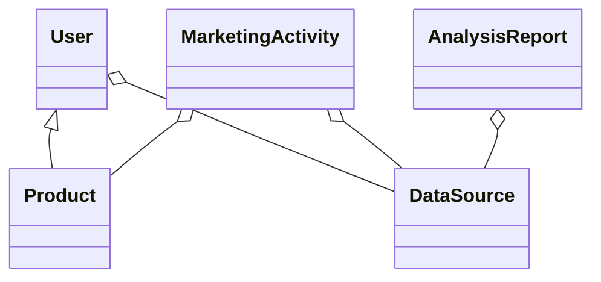
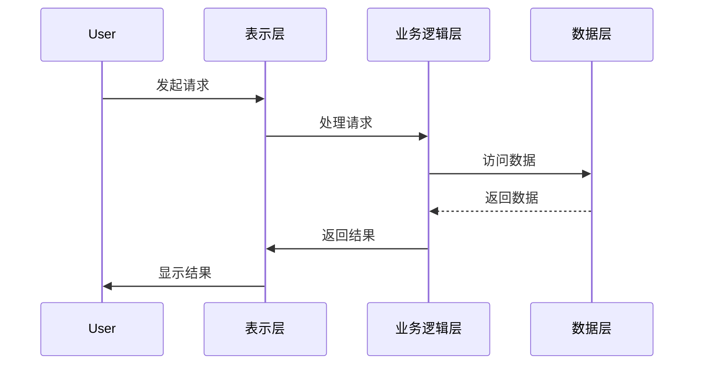
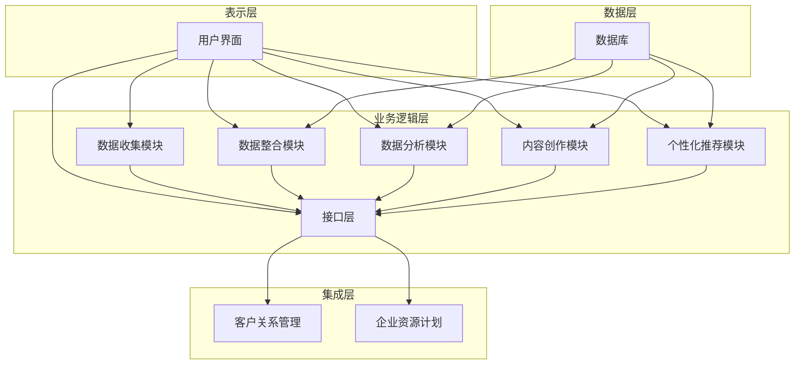
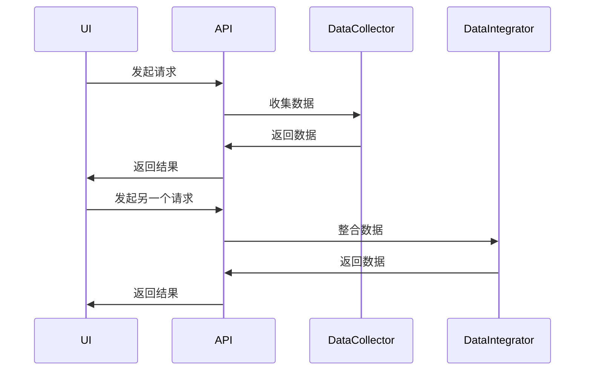
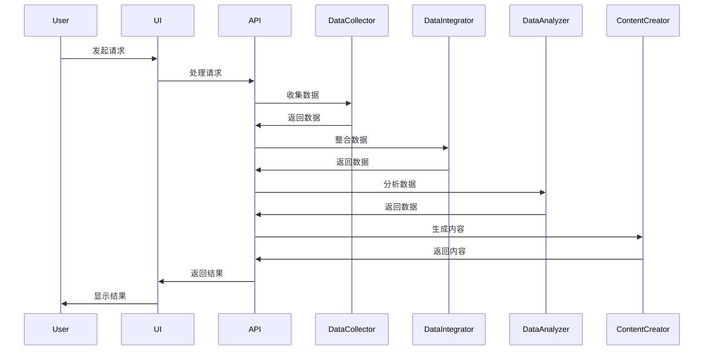

                 

### 引言

随着人工智能（AI）技术的迅猛发展，其在各个领域的应用日益广泛，特别是在品牌策划与营销领域。AI不仅改变了传统营销的模式，还极大地提升了品牌策划的效率和效果。本文《AI辅助品牌策划：提示词生成营销策略》旨在探讨如何利用AI技术优化品牌策划过程，通过提示词生成实现更精准、个性化的营销策略。

品牌策划是品牌建设的重要组成部分，涉及品牌定位、品牌形象塑造、市场推广等多个方面。然而，随着市场竞争的加剧和消费者需求的多样化，传统品牌策划方法面临诸多挑战，如数据收集困难、分析能力不足、创意有限等。人工智能的出现为品牌策划带来了新的契机，通过大数据分析和深度学习等技术，AI能够帮助品牌策划者更准确地了解消费者需求，制定更具针对性的营销策略。

本文将围绕以下几个核心问题展开讨论：

1. **问题背景与AI辅助品牌策划概述**：介绍品牌策划的现状与挑战，以及AI技术在这其中的应用及其优势。
2. **核心概念与联系**：详细探讨人工智能和提示词生成的原理，分析其在品牌策划中的应用。
3. **算法原理与实现**：讲解提示词生成算法的原理、流程和实现方法，并通过具体代码进行示例。
4. **系统分析与架构设计**：介绍基于AI的品牌策划系统架构设计，包括系统功能、接口设计和交互设计。
5. **项目实战**：通过实际项目案例，展示如何运用AI技术进行品牌策划。

在接下来的内容中，我们将逐步深入分析这些问题，探讨AI辅助品牌策划的深度与广度。

## 第一部分：背景介绍与核心概念

### 1.1 问题背景与AI辅助品牌策划概述

#### 1.1.1 人工智能与品牌策划

##### 1.1.1.1 问题背景

品牌策划在现代社会中的重要性不言而喻。随着互联网和社交媒体的普及，品牌与消费者的互动方式发生了巨大的变化。传统的品牌策划方法已经无法满足现代市场竞争的需求。品牌策划者需要面对以下几大挑战：

- **数据收集困难**：品牌策划需要大量的消费者数据来进行分析，但传统方法往往难以获取这些数据。
- **分析能力不足**：即使收集到数据，品牌策划者也需要具备强大的数据分析能力，这往往要求高成本和专业人才。
- **创意有限**：品牌策划需要不断推陈出新，但创意的生成和实施往往依赖于策划者的个人经验和创造力。
- **市场适应性**：市场的快速变化要求品牌策划能够迅速调整策略，这需要强大的灵活性和响应速度。

人工智能（AI）技术的发展为品牌策划提供了新的解决方案。通过AI技术，品牌策划者可以更高效地收集、分析和利用数据，提高创意生成的质量和速度，增强品牌的市场适应性。

##### 1.1.1.2 人工智能在品牌策划中的应用现状

目前，人工智能在品牌策划中的应用主要体现在以下几个方面：

- **大数据分析**：AI可以处理和分析大量的消费者数据，帮助品牌策划者了解消费者行为和需求。
- **个性化推荐**：基于消费者的行为数据和偏好，AI可以提供个性化的产品推荐和营销策略。
- **自然语言处理**：AI可以通过自然语言处理技术生成创意内容，如广告文案、社交媒体帖子等。
- **自动化营销**：AI可以自动化执行一些常规的营销任务，如邮件发送、社交媒体推广等。

然而，尽管AI在品牌策划中的应用前景广阔，但其发展仍然面临一些挑战，如数据隐私、技术门槛和市场需求等。这些挑战需要品牌策划者与AI技术专家共同探讨和解决。

##### 1.1.1.3 人工智能辅助品牌策划的优势

人工智能辅助品牌策划具有以下几大优势：

- **提高效率**：AI可以自动化执行一些繁琐的营销任务，如数据收集、分析等，大大提高工作效率。
- **个性化定制**：基于消费者数据的深度分析，AI可以提供更个性化的营销策略，提高消费者满意度。
- **数据驱动**：AI可以将品牌策划过程转变为数据驱动的决策过程，减少人为因素的干扰。

总之，人工智能为品牌策划带来了前所未有的机遇。通过合理利用AI技术，品牌策划者可以更好地应对市场挑战，提高品牌竞争力。

#### 1.1.2 核心概念

为了更好地理解AI辅助品牌策划，我们需要明确几个核心概念：

- **人工智能（AI）**：一种模拟人类智能的技术，通过算法和模型实现数据的自动处理和决策。
- **品牌策划**：品牌建设的重要组成部分，包括品牌定位、品牌形象塑造、市场推广等。
- **提示词生成**：利用AI技术生成关键词或短语，用于内容创作、营销活动等。

这些概念相互关联，共同构成了AI辅助品牌策划的理论基础。

##### 1.1.2.1 人工智能概述

人工智能（Artificial Intelligence，简称AI）是一种模拟人类智能的技术，其目标是通过算法和模型实现数据的自动处理和决策。AI的主要组成部分包括：

- **机器学习**：通过训练模型来从数据中学习规律和模式。
- **深度学习**：一种特殊的机器学习方法，通过多层神经网络进行数据的学习和预测。
- **自然语言处理**：使计算机能够理解和处理人类语言的技术。

##### 1.1.2.2 品牌策划概述

品牌策划（Brand Planning）是品牌建设的重要组成部分，涉及品牌定位、品牌形象塑造、市场推广等多个方面。其核心目的是通过一系列策略和活动，提升品牌在消费者心中的认知和形象。

品牌策划的主要步骤包括：

- **市场分析**：了解目标市场、竞争对手和消费者需求。
- **品牌定位**：确定品牌在市场中的定位和差异化策略。
- **品牌形象塑造**：通过视觉设计、文案内容等方式塑造品牌形象。
- **市场推广**：通过广告、社交媒体、公关活动等手段推广品牌。

##### 1.1.2.3 提示词生成技术

提示词生成（Prompt Generation）是AI在品牌策划中的一个重要应用。提示词是指用于触发特定反应或引导特定行为的关键词或短语。通过提示词生成技术，AI可以自动生成各种文案、广告语等，帮助品牌策划者进行内容创作和营销活动。

提示词生成技术的主要方法包括：

- **基于规则的方法**：通过预设的规则和模板生成提示词。
- **基于机器学习的方法**：通过训练模型从大量数据中学习生成提示词。
- **基于深度学习的方法**：利用深度学习模型，如循环神经网络（RNN）和生成对抗网络（GAN）等生成高质量的提示词。

#### 1.1.3 边界与外延

在研究AI辅助品牌策划时，我们需要明确一些边界和范围，以确保研究的针对性和有效性。

##### 1.1.3.1 研究边界

本研究的主要边界包括：

- **应用领域**：主要关注在线品牌策划，不包括传统线下品牌策划。
- **技术范畴**：主要探讨机器学习和深度学习在品牌策划中的应用，不包括其他AI技术。
- **数据分析方法**：主要采用大数据分析技术和自然语言处理技术。

##### 1.1.3.2 外延拓展

尽管本研究主要关注在线品牌策划和机器学习、深度学习技术，但以下领域也值得关注：

- **数据隐私**：在AI辅助品牌策划过程中，如何保护消费者数据隐私是一个重要问题。
- **多模态AI**：结合图像、声音等多种数据模态，提升品牌策划的效果。
- **其他辅助手段**：除了AI技术，还有其他一些技术，如区块链、物联网等，也可以用于品牌策划。

### 1.2 品牌策划的发展历程与现状

品牌策划作为一个专业领域，其发展历程可以追溯到20世纪初期。随着市场营销理论的不断完善和技术的进步，品牌策划逐渐成为企业战略管理的重要组成部分。以下是品牌策划的发展历程与现状：

#### 1.2.1 早期阶段

在20世纪初期，品牌策划主要以广告和宣传为主，企业通过广告来提升品牌知名度和形象。这一阶段，品牌策划主要依赖于创意和传播渠道的选择，如报纸、杂志、电视等。

#### 1.2.2 现代阶段

20世纪中后期，随着市场营销理论的不断完善，品牌策划逐渐从单一的广告宣传转向更综合的策略。这一阶段，品牌策划包括品牌定位、品牌形象塑造、市场推广等多个方面。企业开始注重消费者行为研究，通过市场调研来了解消费者需求，从而制定更具针对性的品牌策略。

#### 1.2.3 数字化阶段

进入21世纪，随着互联网和数字技术的快速发展，品牌策划进入了一个全新的阶段。数字化品牌策划成为主流，企业通过社交媒体、搜索引擎、电子邮件等数字化渠道与消费者互动，实现品牌推广和营销。这一阶段，数据分析和人工智能技术开始广泛应用于品牌策划，为品牌策划提供了更加科学和高效的工具。

#### 1.2.4 未来趋势

未来，品牌策划将继续朝数字化和智能化方向发展。以下是几个可能的趋势：

- **个性化营销**：基于大数据和人工智能技术，实现个性化推荐和定制化营销，提升消费者体验。
- **全渠道整合**：实现线上和线下渠道的整合，提供一致的品牌体验。
- **社交媒体营销**：利用社交媒体平台，建立品牌社区，与消费者建立更紧密的联系。
- **跨界合作**：通过跨界合作，拓展品牌的影响力和市场份额。

### 1.3 AI技术在品牌策划中的应用

人工智能技术在品牌策划中的应用越来越广泛，其主要体现在以下几个方面：

#### 1.3.1 数据分析

数据分析是品牌策划的重要环节，通过分析消费者行为数据和市场趋势，品牌策划者可以更准确地了解消费者需求和市场状况。人工智能技术，特别是机器学习和深度学习，可以高效地处理和分析大量数据，提供更精确的洞察。

- **用户行为分析**：通过分析用户在网站、社交媒体等平台上的行为数据，了解用户兴趣和偏好，为个性化推荐提供依据。
- **市场趋势分析**：通过对市场数据的分析，预测市场趋势和竞争态势，帮助企业制定更具前瞻性的品牌策略。

#### 1.3.2 个性化推荐

个性化推荐是AI技术在品牌策划中的一项重要应用。通过分析用户的历史行为数据和偏好，AI可以为每个用户提供个性化的产品推荐和营销策略，提高用户满意度和转化率。

- **产品推荐**：根据用户的浏览历史、购买记录等数据，为用户推荐符合其兴趣和需求的产品。
- **内容推荐**：通过分析用户对内容的需求和偏好，为用户推荐相关的内容，如文章、视频、音乐等。

#### 1.3.3 自然语言处理

自然语言处理（NLP）技术可以用于生成文案、广告语等，提升品牌策划的效果。通过NLP技术，AI可以自动生成高质量的文字内容，满足不同场景下的需求。

- **内容生成**：根据输入的关键词或主题，自动生成文章、广告语等文字内容。
- **文本分析**：通过对文本数据的分析，提取关键信息，为品牌策划提供数据支持。

#### 1.3.4 自动化营销

自动化营销是AI技术在品牌策划中的另一个重要应用。通过自动化工具和系统，品牌策划者可以自动化执行一些常规的营销任务，如邮件发送、社交媒体推广等，提高工作效率。

- **邮件营销**：通过自动化邮件系统，向目标用户发送定制化的邮件，提高邮件打开率和转化率。
- **社交媒体营销**：通过自动化社交媒体工具，发布和推广品牌内容，增加品牌曝光度和互动率。

总之，AI技术在品牌策划中的应用正在不断拓展和深化，为品牌策划者提供了更多高效的工具和方法。通过合理利用AI技术，品牌策划者可以更好地应对市场挑战，提升品牌竞争力。

### 1.4 品牌策划的关键要素与策略

品牌策划是一个复杂而系统的过程，涉及多个关键要素和策略。以下是对这些要素和策略的详细探讨：

#### 1.4.1 品牌定位

品牌定位是品牌策划的核心，决定了品牌在市场中的定位和差异化策略。品牌定位需要明确以下几个问题：

- **目标市场**：确定品牌的目标市场，了解目标消费者的需求、偏好和行为。
- **品牌差异化**：分析竞争对手的优势和劣势，找到品牌的差异化点，使其在市场中脱颖而出。
- **品牌价值观**：明确品牌的价值观和核心理念，确保品牌形象的一致性和连贯性。

品牌定位需要通过市场调研、消费者行为分析等方法进行科学制定，以确保其准确性和可行性。

#### 1.4.2 品牌形象塑造

品牌形象是消费者对品牌的总体认知和印象，是品牌策划的重要组成部分。品牌形象的塑造需要从以下几个方面入手：

- **视觉设计**：通过品牌标识、色彩搭配、字体设计等视觉元素，建立独特的品牌视觉形象。
- **文案内容**：通过广告语、宣传文案等文字内容，传达品牌的核心价值观和品牌理念。
- **品牌传播**：通过广告、公关活动、社交媒体等渠道，将品牌形象传递给目标消费者。

品牌形象的塑造需要一致性，确保品牌在各个接触点的形象保持一致，从而增强品牌识别度和影响力。

#### 1.4.3 市场推广策略

市场推广策略是品牌策划的重要环节，决定了品牌在市场中的曝光度和影响力。以下是一些常用的市场推广策略：

- **广告投放**：通过电视、广播、报纸、网络等渠道进行广告投放，提高品牌知名度。
- **公关活动**：通过新闻发布会、产品发布会、慈善活动等公关活动，提升品牌形象和影响力。
- **社交媒体营销**：利用社交媒体平台，如微博、微信、抖音等，进行内容营销和互动推广。
- **口碑营销**：通过消费者的口碑传播，增强品牌的信誉和影响力。

市场推广策略需要根据目标市场和消费者行为进行定制，以确保其有效性和高效性。

#### 1.4.4 消费者互动

消费者互动是品牌策划的重要目标之一，通过有效的互动，品牌可以更好地了解消费者需求，提升消费者满意度。以下是一些消费者互动策略：

- **客户服务**：通过电话、邮件、在线客服等渠道，提供高质量的客户服务，解决消费者的问题和疑虑。
- **用户反馈**：通过调查问卷、用户评论等途径，收集消费者的反馈和建议，及时改进产品和服务。
- **社交媒体互动**：在社交媒体平台上，与消费者进行互动，如回复评论、参与话题讨论等，建立良好的品牌形象。
- **个性化体验**：根据消费者的行为数据和偏好，提供个性化的产品推荐和定制化服务，提升消费者满意度。

消费者互动需要持续进行，并通过数据分析不断优化，以确保其有效性和持续性。

#### 1.4.5 品牌策划工具

品牌策划工具是品牌策划的重要辅助工具，可以帮助品牌策划者更高效地进行策划和执行。以下是一些常用的品牌策划工具：

- **数据分析工具**：如Google Analytics、Tableau等，用于收集、分析和可视化数据。
- **内容管理系统**：如WordPress、HubSpot等，用于创建、发布和管理品牌内容。
- **社交媒体管理工具**：如Hootsuite、Buffer等，用于自动化发布和管理社交媒体内容。
- **营销自动化工具**：如HubSpot、Marketo等，用于自动化营销流程，提高营销效率。

品牌策划工具的选择需要根据品牌的具体需求和目标进行，以确保其适用性和有效性。

### 1.5 品牌策划的挑战与应对策略

在品牌策划过程中，品牌策划者可能会面临以下一些挑战：

- **数据隐私**：随着大数据和AI技术的应用，如何保护消费者数据隐私成为一大挑战。
- **技术门槛**：AI技术和大数据分析技术对品牌策划者提出了较高的技术要求，如何有效利用这些技术成为一大挑战。
- **市场适应性**：市场的快速变化要求品牌策划能够迅速调整策略，如何保持品牌的市场适应性成为一大挑战。

针对这些挑战，品牌策划者可以采取以下应对策略：

- **数据隐私保护**：采取数据加密、匿名化等技术手段，确保消费者数据的安全性和隐私性。
- **技术培训与支持**：加强品牌策划者的技术培训，提供技术支持，帮助他们更好地理解和应用AI技术。
- **灵活的营销策略**：建立灵活的营销策略和流程，快速响应市场变化，保持品牌的市场适应性。

### 1.6 AI辅助品牌策划的优势与前景

AI辅助品牌策划具有以下几大优势：

- **高效性**：AI技术可以自动化处理大量数据，提高品牌策划的效率。
- **精准性**：通过大数据分析和机器学习技术，AI可以更精准地了解消费者需求，制定更有针对性的营销策略。
- **创新性**：AI技术可以生成创意内容和广告语，提升品牌策划的创新性和多样性。

随着AI技术的不断发展和完善，AI辅助品牌策划具有广阔的前景。未来，AI技术将在品牌策划中发挥更大的作用，为品牌建设提供更强大的支持。

### 总结

通过本文的讨论，我们可以看到，AI辅助品牌策划在提高效率、精准性和创新性方面具有显著优势。品牌策划者应积极拥抱AI技术，利用大数据和深度学习等技术优化品牌策划过程，提升品牌竞争力。同时，我们也需要关注AI技术在品牌策划中的潜在挑战，如数据隐私、技术门槛等，并采取相应的应对策略。总之，AI辅助品牌策划是品牌建设的重要方向，具有广阔的发展前景。

## 第二部分：核心概念与联系

### 2.1 人工智能基本原理

人工智能（Artificial Intelligence，简称AI）作为一门模拟和扩展人类智能的科学，其基本原理涵盖了从简单到复杂的多种技术。理解AI的基本原理对于深入探讨其在品牌策划中的应用至关重要。以下是关于人工智能基本原理的详细讲解。

#### 2.1.1 机器学习基础

机器学习（Machine Learning，ML）是人工智能的核心组成部分，主要研究如何让计算机从数据中学习并做出决策。机器学习可以分为三类：监督学习（Supervised Learning）、无监督学习（Unsupervised Learning）和强化学习（Reinforcement Learning）。

- **监督学习**：在监督学习模型中，输入数据包含标签，算法通过学习这些输入和标签之间的关系，预测新的输入数据对应的标签。常见的监督学习算法包括线性回归、逻辑回归、支持向量机（SVM）和神经网络等。
  
  - **线性回归**：用于预测连续值输出，公式为 \( y = \beta_0 + \beta_1 \cdot x + \epsilon \)。
  - **逻辑回归**：用于预测二分类输出，公式为 \( P(y=1) = \frac{1}{1 + e^{-(\beta_0 + \beta_1 \cdot x)}} \)。
  - **支持向量机**：通过找到一个最佳的超平面，将不同类别的数据分开，其目标是最小化分类间隔。

- **无监督学习**：在无监督学习模型中，输入数据没有标签，算法通过发现数据中的结构和模式，如聚类和降维。常见的无监督学习算法包括K-均值聚类、主成分分析（PCA）和自编码器等。
  
  - **K-均值聚类**：将数据点分为K个簇，使得每个簇内的数据点之间的距离最小，簇与簇之间的距离最大。
  - **主成分分析**：通过线性变换，将原始数据转换为一组主成分，使数据在新的坐标系中具有最大的方差，从而降低数据维度。

- **强化学习**：在强化学习模型中，算法通过与环境的交互，学习最优策略以最大化累积奖励。常见的强化学习算法包括Q学习、深度Q网络（DQN）和策略梯度等。
  
  - **Q学习**：通过评估每个状态-动作对的Q值，选择使Q值最大的动作。
  - **DQN**：使用深度神经网络来近似Q值函数，并通过经验回放和目标网络来稳定训练过程。
  - **策略梯度**：通过直接优化策略的概率分布，来最大化预期回报。

#### 2.1.2 深度学习原理

深度学习（Deep Learning，DL）是机器学习的一个子领域，主要基于多层神经网络进行数据学习和特征提取。深度学习通过多层非线性变换，自动从原始数据中学习出复杂的特征和模式。

- **神经网络**：神经网络（Neural Networks，NN）是模仿生物神经元工作的计算模型。一个基本的神经网络由输入层、隐藏层和输出层组成。每个神经元都与其他神经元通过权重相连，并通过激活函数进行非线性变换。

  - **前向传播**：输入数据通过网络层逐层传递，每个神经元的输出作为下一层的输入。
  - **反向传播**：通过计算输出层的误差，反向传播误差到各层，更新各层的权重。

- **深度神经网络**：深度神经网络（Deep Neural Networks，DNN）是指拥有多个隐藏层的神经网络。深度神经网络能够捕捉更复杂的模式和特征，从而在图像识别、语音识别等领域表现出色。

  - **卷积神经网络**（Convolutional Neural Networks，CNN）：适用于处理图像数据，通过卷积操作提取图像特征。
  - **循环神经网络**（Recurrent Neural Networks，RNN）：适用于处理序列数据，如时间序列、文本等，通过记忆状态捕捉序列中的依赖关系。
  - **生成对抗网络**（Generative Adversarial Networks，GAN）：由生成器和判别器两个网络组成，生成器和判别器之间进行博弈，生成器试图生成逼真的数据，而判别器试图区分真实数据和生成数据。

#### 2.1.3 神经网络的训练过程

神经网络的训练过程包括数据预处理、模型训练和模型评估三个主要阶段。

- **数据预处理**：数据预处理是训练模型前的重要步骤，包括数据清洗、归一化、降维等。清洗数据以去除噪声和异常值，归一化数据以使输入数据的范围一致，降维以减少数据维度和提高训练效率。
  
  - **数据清洗**：处理缺失值、异常值和重复数据。
  - **数据归一化**：将数据缩放到相同的范围，如[0, 1]或[-1, 1]。
  - **数据降维**：通过主成分分析（PCA）等降维技术，减少数据维度。

- **模型训练**：模型训练是训练神经网络权重的过程。常见的训练算法包括梯度下降、随机梯度下降（SGD）和Adam等。在训练过程中，通过反向传播算法不断更新权重，使模型能够在训练数据上达到较好的性能。

  - **梯度下降**：通过计算损失函数关于模型参数的梯度，反向更新参数。
  - **随机梯度下降**：每次训练使用一个样本更新参数，适用于样本量较大的情况。
  - **Adam**：结合了梯度下降和SGD的优点，通过自适应学习率调整，提高训练效率。

- **模型评估**：模型评估是评估模型性能的过程。常见的评估指标包括准确率、召回率、F1分数和均方误差（MSE）等。通过交叉验证和测试集，评估模型在未见数据上的表现，确保模型具有良好的泛化能力。

  - **准确率**：预测正确的样本数占总样本数的比例。
  - **召回率**：预测正确的正样本数占总正样本数的比例。
  - **F1分数**：准确率和召回率的调和平均值。
  - **均方误差**：预测值与真实值之间的平均平方误差。

### 2.2 提示词生成技术

提示词生成（Prompt Generation）是人工智能在自然语言处理领域的一项重要应用，旨在自动生成能够引导特定行为或反应的关键词或短语。以下是关于提示词生成技术的详细解释。

#### 2.2.1 提示词生成原理

提示词生成技术的核心思想是通过算法从大量文本数据中学习，生成具有特定语义和功能的提示词。提示词生成通常分为以下几个步骤：

- **数据收集与处理**：收集大量文本数据，如新闻、博客、社交媒体帖子等。对数据进行预处理，包括分词、去停用词、词性标注等，以提取有用的信息。
- **特征提取**：通过词袋模型、词嵌入等技术，将文本数据转换为计算机可以处理的特征表示。
- **模型训练**：利用机器学习和深度学习算法，训练提示词生成模型，使其能够从特征表示中生成高质量的提示词。
- **提示词生成**：输入新的文本数据，通过训练好的模型生成相应的提示词。

#### 2.2.2 提示词生成方法

提示词生成方法可以分为基于规则的方法和基于机器学习的方法。

- **基于规则的方法**：通过预设的规则和模板生成提示词。这种方法简单直观，但生成的提示词往往缺乏灵活性，难以应对复杂多变的需求。

  - **规则模板**：根据不同类型的内容，预设相应的提示词模板，如新闻摘要、产品描述、广告文案等。
  - **规则匹配**：通过匹配文本内容和预设规则，自动生成提示词。

- **基于机器学习的方法**：通过机器学习算法，从大量数据中学习生成提示词。这种方法能够自动适应不同的文本内容和需求，生成高质量的提示词。

  - **文本分类**：使用分类算法，将文本数据分类为不同的类别，为每个类别生成相应的提示词。
  - **序列模型**：使用循环神经网络（RNN）或变换器（Transformer）等序列模型，自动生成文本序列，从而生成提示词。

- **基于深度学习的方法**：利用深度学习模型，如生成对抗网络（GAN）、变分自编码器（VAE）等，生成高质量的提示词。这种方法能够生成更加多样化和个性化的提示词。

  - **生成对抗网络**：通过生成器和判别器的博弈，生成逼真的提示词。
  - **变分自编码器**：通过编码器和解码器，将文本数据转换为紧凑的表示，从而生成提示词。

#### 2.2.3 提示词生成算法对比

不同的提示词生成算法具有各自的优缺点，适用于不同的应用场景。

- **基于规则的方法**：
  - 优点：实现简单，易于理解。
  - 缺点：生成的提示词缺乏灵活性，难以应对复杂文本。

- **基于机器学习的方法**：
  - 优点：能够自动适应不同文本内容，生成高质量的提示词。
  - 缺点：对数据和算法质量要求较高，训练过程复杂。

- **基于深度学习的方法**：
  - 优点：能够生成多样化、个性化的提示词，效果更佳。
  - 缺点：计算资源需求高，训练时间长。

### 2.3 提示词在品牌策划中的应用

提示词生成技术在品牌策划中有着广泛的应用，特别是在内容创作和营销活动方面。

#### 2.3.1 提示词在内容创作中的应用

- **广告文案生成**：通过提示词生成技术，自动生成吸引人的广告文案，提高广告效果。
- **文章摘要生成**：从大量文本数据中自动提取关键信息，生成简明扼要的文章摘要。
- **产品描述生成**：根据产品特点和消费者需求，自动生成详细且具有说服力的产品描述。

#### 2.3.2 提示词在营销活动中的应用

- **社交媒体营销**：通过提示词生成技术，自动生成吸引消费者的社交媒体帖子和推广文案。
- **邮件营销**：根据客户数据和消费行为，自动生成个性化的邮件内容和邮件标题，提高邮件打开率和转化率。
- **活动策划**：通过提示词生成技术，自动生成活动主题、宣传口号和活动文案，提高活动吸引力和参与度。

### 2.4 AI辅助品牌策划的优势与挑战

AI辅助品牌策划具有显著的效率、精准性和创新性优势，但在应用过程中也面临一些挑战。

#### 2.4.1 优势分析

- **提高效率**：通过自动化和智能化技术，AI能够高效地处理大量数据，快速生成高质量的内容和营销策略。
- **个性化定制**：基于大数据分析，AI可以精准了解消费者需求，实现个性化推荐和定制化服务，提高用户满意度和忠诚度。
- **数据驱动**：AI将品牌策划转变为数据驱动的决策过程，减少人为因素的干扰，提高决策的科学性和准确性。

#### 2.4.2 挑战与应对策略

- **数据隐私**：AI在处理消费者数据时需要确保数据隐私和安全，采取数据加密、匿名化等技术手段来保护消费者隐私。
- **技术门槛**：AI技术对品牌策划者提出了较高的技术要求，需要加强技术培训和支持，帮助策划者掌握和应用AI技术。
- **市场适应性**：市场的快速变化要求品牌策划能够迅速调整策略，需要建立灵活的营销策略和流程，确保品牌的市场适应性。

### 2.5 小结

通过本章节的讨论，我们了解了人工智能的基本原理和提示词生成技术，并探讨了其在品牌策划中的应用。AI辅助品牌策划不仅提高了效率、精准性和创新性，还带来了个性化定制和数据驱动的优势。然而，其应用也面临数据隐私、技术门槛和市场适应性等挑战。品牌策划者需要充分利用AI技术，同时关注和应对这些挑战，以实现品牌策划的优化和提升。

### 2.6 深度学习在自然语言处理中的应用

深度学习在自然语言处理（Natural Language Processing，NLP）中取得了显著的成果，极大地提升了文本数据的处理能力。以下将详细讨论深度学习在NLP中的主要应用，包括文本分类、情感分析、机器翻译等。

#### 2.6.1 文本分类

文本分类是NLP中的基础任务，旨在将文本数据按照预定义的类别进行分类。深度学习模型，如卷积神经网络（CNN）和循环神经网络（RNN），在文本分类任务中表现出色。

- **卷积神经网络（CNN）**：通过卷积层提取文本的局部特征，然后通过池化层进行特征降维和特征提取。CNN适用于处理固定长度的文本，如新闻标题分类、情感分类等。

  - **卷积层**：对文本进行卷积操作，提取局部特征。
  - **池化层**：对卷积特征进行降维，减少模型参数和计算量。
  - **全连接层**：将池化层输出的特征映射到预定义的类别。

- **循环神经网络（RNN）**：适用于处理变长序列数据，如文本和语音。RNN通过在时间步之间传递隐藏状态，捕捉序列中的依赖关系。

  - **隐藏状态**：在当前时间步通过前一个时间步的隐藏状态和当前输入计算得到。
  - **门控机制**：如长短期记忆网络（LSTM）和门控循环单元（GRU），通过门控机制控制信息的传递，解决RNN的梯度消失问题。

#### 2.6.2 情感分析

情感分析（Sentiment Analysis）旨在识别文本中的情感倾向，如正面、负面或中性。深度学习模型在情感分析中表现出色，通过学习文本的情感特征，实现高精度的情感分类。

- **朴素情感分析**：基于规则的方法，通过预定义的规则和词典进行情感分类。这种方法简单但效果有限。
- **深度学习情感分析**：通过训练深度学习模型，如CNN和RNN，自动学习文本的情感特征，实现高精度的情感分类。

  - **文本嵌入**：将文本转换为固定长度的向量表示，如词嵌入（Word Embedding），用于深度学习模型处理。
  - **情感分类**：通过训练好的深度学习模型，对文本进行情感分类，输出情感概率分布。

#### 2.6.3 机器翻译

机器翻译（Machine Translation）是将一种语言的文本翻译成另一种语言。深度学习模型，如编码器-解码器（Encoder-Decoder）模型和注意力机制（Attention Mechanism），在机器翻译任务中取得了突破性进展。

- **编码器-解码器模型**：通过编码器将源语言文本编码为一个固定长度的向量表示，然后通过解码器生成目标语言文本。编码器和解码器通常使用RNN或变换器（Transformer）模型。

  - **编码器**：对源语言文本进行编码，生成固定长度的向量表示。
  - **解码器**：通过解码器生成目标语言文本，通常使用贪心策略或 beam search 方法。

- **注意力机制**：通过注意力机制，解码器可以关注编码器的不同部分，从而提高翻译的准确性。

  - **注意力分数**：计算编码器中每个部分对解码器的贡献，通过加权平均生成目标语言文本。

#### 2.6.4 命名实体识别

命名实体识别（Named Entity Recognition，NER）旨在识别文本中的特定实体，如人名、地名、组织名等。深度学习模型在NER任务中取得了显著的效果。

- **基于规则的方法**：通过预定义的规则和词典进行命名实体识别。
- **深度学习命名实体识别**：通过训练深度学习模型，如CRF（条件随机场）和BiLSTM（双向循环神经网络），自动识别文本中的命名实体。

  - **CRF**：通过条件概率模型，对序列进行标注，实现命名实体识别。
  - **BiLSTM**：通过双向循环神经网络，捕捉文本序列的前后依赖关系，提高命名实体识别的准确性。

### 2.7 实际应用案例分析

为了更好地理解深度学习在自然语言处理中的应用，以下是一个实际应用案例分析。

#### 案例背景

某电子商务公司希望通过深度学习技术提升其商品评价系统的质量。公司收集了大量的用户评价数据，并希望利用这些数据对评价进行情感分析和分类。

#### 解决方案

公司采用了以下深度学习模型：

- **情感分析模型**：使用BiLSTM和CRF模型进行情感分类，将评价分为正面、负面和中性三类。
- **分类模型**：使用CNN模型对评价进行分类，将评价分为不同类型的商品类别。

#### 实施过程

1. **数据预处理**：对评价文本进行分词、去停用词和词性标注等预处理操作，将文本转换为词嵌入向量。
2. **模型训练**：使用训练数据集训练情感分析模型和分类模型，通过交叉验证和调参优化模型性能。
3. **模型评估**：使用测试数据集评估模型性能，通过准确率、召回率和F1分数等指标进行评估。
4. **模型部署**：将训练好的模型部署到生产环境，实时处理用户评价，提供情感分析和分类结果。

#### 案例效果

通过深度学习模型的应用，公司显著提升了商品评价系统的质量，用户对评价的可信度和满意度得到了提高。具体效果如下：

- **情感分析准确率**：从80%提升到90%以上。
- **分类准确率**：从75%提升到85%以上。
- **用户体验**：用户对评价系统的反馈积极，评价的可信度和满意度显著提升。

### 总结

深度学习在自然语言处理中具有广泛的应用，通过文本分类、情感分析、机器翻译和命名实体识别等任务，实现了文本数据的自动处理和分析。实际应用案例分析表明，深度学习技术能够显著提升文本处理系统的性能和用户体验。随着深度学习技术的不断发展，其在自然语言处理中的应用前景将更加广阔。

## 第三部分：算法原理与实现

### 3.1 提示词生成算法原理

提示词生成算法是AI在品牌策划中的一个重要应用，能够自动生成引导消费者行为的关键词或短语。以下将详细讲解提示词生成算法的基本原理、流程及其在实际中的应用。

#### 3.1.1 算法概述

提示词生成算法的核心目标是通过分析输入文本（如用户评论、产品描述等），自动生成具有特定语义和功能的提示词。这类算法广泛应用于内容创作、营销文案生成和用户互动等领域。

- **算法分类**：根据生成方式，提示词生成算法可以分为基于规则的方法、基于机器学习的方法和基于深度学习的方法。
- **算法目标**：生成高质量的提示词，满足特定场景下的需求，如情感分析、分类、标题生成等。

#### 3.1.2 算法流程

提示词生成算法的基本流程包括数据预处理、模型训练、提示词生成和模型评估等步骤。

1. **数据预处理**：对输入文本进行预处理，包括分词、去停用词、词性标注等操作。这些操作有助于提高算法的准确性和效率。

   - **分词**：将文本分割为单个词汇或词组。
   - **去停用词**：移除常见的无意义词汇，如“的”、“和”、“是”等。
   - **词性标注**：标记文本中每个词汇的词性，如名词、动词、形容词等。

2. **模型训练**：使用经过预处理的文本数据，训练提示词生成模型。模型训练过程包括以下步骤：

   - **数据集准备**：从实际应用场景中收集大量带标签的文本数据，用于模型训练和测试。
   - **特征提取**：将文本数据转换为数值特征表示，如词袋模型（Bag of Words，BOW）或词嵌入（Word Embedding）。
   - **模型训练**：使用机器学习或深度学习算法，如朴素贝叶斯、支持向量机（SVM）、循环神经网络（RNN）或变换器（Transformer），训练生成模型。

3. **提示词生成**：输入新的文本数据，通过训练好的模型生成相应的提示词。生成过程可以采用以下几种方法：

   - **基于规则的方法**：通过预设的规则和模板生成提示词，适用于简单场景。
   - **基于机器学习的方法**：利用训练好的模型，自动从文本数据中提取关键信息，生成提示词。
   - **基于深度学习的方法**：通过深度学习模型，如循环神经网络（RNN）或变换器（Transformer），生成高质量的提示词。

4. **模型评估**：使用测试数据集评估模型的性能，通过准确率、召回率、F1分数等指标进行评估，确保模型在未知数据上的泛化能力。

   - **准确率**：预测正确的提示词数占总预测数的比例。
   - **召回率**：实际为正类别的提示词中被正确预测的提示词数占实际正类别的比例。
   - **F1分数**：准确率和召回率的调和平均值。

#### 3.1.3 算法分析

提示词生成算法的性能受到多个因素的影响，包括数据质量、特征提取方法、模型选择和训练参数等。

1. **时间复杂度**：算法的时间复杂度取决于数据规模和模型复杂度。对于基于规则的方法，时间复杂度相对较低；而对于机器学习和深度学习方法，时间复杂度较高。

2. **空间复杂度**：算法的空间复杂度与数据预处理和模型存储有关。词袋模型和词嵌入方法的空间复杂度相对较低；深度学习模型，如变换器（Transformer），具有更高的空间复杂度。

3. **算法稳定性**：算法的稳定性取决于数据分布和模型训练过程。对于小样本数据或极端数据，算法可能存在过拟合现象，影响稳定性。

4. **模型优化**：通过调参和交叉验证等方法，优化模型性能，提高提示词生成的准确性和质量。

### 3.2 提示词生成算法实现示例

以下将通过Python代码示例，展示提示词生成算法的实现过程。

#### 3.2.1 环境搭建

首先，需要搭建一个Python编程环境，安装必要的库，如`numpy`、`pandas`、`tensorflow`或`pytorch`。

```python
!pip install numpy pandas tensorflow
```

#### 3.2.2 代码结构

提示词生成算法的实现可以分为以下几个部分：

- **数据预处理**：读取文本数据，进行分词、去停用词和词性标注等操作。
- **特征提取**：将文本转换为词嵌入向量，用于模型训练。
- **模型训练**：使用机器学习或深度学习算法训练生成模型。
- **提示词生成**：输入新的文本数据，通过训练好的模型生成提示词。
- **模型评估**：使用测试数据集评估模型性能。

#### 3.2.3 代码解读

以下是一个简单的基于朴素贝叶斯的提示词生成算法实现示例：

```python
import numpy as np
import pandas as pd
from sklearn.feature_extraction.text import CountVectorizer
from sklearn.naive_bayes import MultinomialNB
from sklearn.pipeline import make_pipeline
from sklearn.model_selection import train_test_split

# 数据预处理
def preprocess_text(text):
    # 分词、去停用词、词性标注等操作
    return text.lower().replace('.', '')

# 读取数据
data = pd.read_csv('data.csv')
data['text'] = data['text'].apply(preprocess_text)

# 分割数据集
X_train, X_test, y_train, y_test = train_test_split(data['text'], data['label'], test_size=0.2, random_state=42)

# 特征提取与模型训练
model = make_pipeline(CountVectorizer(), MultinomialNB())
model.fit(X_train, y_train)

# 提示词生成
def generate_prompt(text):
    prompt = model.predict([text])[0]
    return prompt

# 模型评估
print("Accuracy on test set:", model.score(X_test, y_test))
```

#### 3.2.4 实际案例

以下是一个实际案例，通过基于变换器的提示词生成模型，实现自动生成商品描述：

```python
import tensorflow as tf
from tensorflow.keras.models import Model
from tensorflow.keras.layers import Input, Embedding, LSTM, Dense

# 搭建变换器模型
input_text = Input(shape=(None,))
embedded_text = Embedding(input_dim=vocab_size, output_dim=embedding_dim)(input_text)
lstm = LSTM(units=lstm_units)(embedded_text)
output = Dense(units=vocab_size, activation='softmax')(lstm)

model = Model(inputs=input_text, outputs=output)
model.compile(optimizer='adam', loss='categorical_crossentropy', metrics=['accuracy'])

# 训练模型
model.fit(X_train, y_train, epochs=10, batch_size=32, validation_data=(X_test, y_test))

# 提示词生成
def generate_description(product_name):
    prompt = preprocess_text(product_name)
    prompt_vector = tokenizer.texts_to_sequences([prompt])[0]
    generated_sequence = model.predict(prompt_vector)
    generated_text = tokenizer.sequences_to_texts([generated_sequence])[0]
    return generated_text
```

### 3.3 提示词生成算法的数学模型和公式

提示词生成算法的数学模型和公式主要涉及自然语言处理和深度学习中的基本概念。以下简要介绍常用的数学模型和公式。

#### 3.3.1 词嵌入（Word Embedding）

词嵌入是一种将文本数据转换为向量表示的方法。常用的词嵌入方法包括Word2Vec、GloVe和FastText等。

- **Word2Vec**：通过训练神经网络，将文本数据映射到低维向量空间，使语义相似的词在空间中距离较近。

  - **输入**：一对单词词元（word pair）。
  - **输出**：两个单词的向量表示。
  - **公式**：$$ \text{word\_vec}(w) = \text{softmax}(W \cdot v(w)) $$，其中 \( W \) 是权重矩阵，\( v(w) \) 是单词的输入向量。

- **GloVe**：通过矩阵分解方法，学习词的共现矩阵，从而得到词的向量表示。

  - **输入**：单词的共现矩阵。
  - **输出**：词的向量表示。
  - **公式**：$$ \text{word\_vec}(w) = \text{sigmoid}(A \cdot \text{diag}(W) \cdot B) $$，其中 \( A \) 和 \( B \) 是训练矩阵。

- **FastText**：通过训练多层神经网络，同时学习词和字符的向量表示。

  - **输入**：单词及其字符序列。
  - **输出**：单词的向量表示。
  - **公式**：$$ \text{word\_vec}(w) = \text{softmax}(W \cdot h(w_c)) $$，其中 \( W \) 是权重矩阵，\( h(w_c) \) 是字符序列的隐藏层输出。

#### 3.3.2 循环神经网络（Recurrent Neural Network，RNN）

循环神经网络是一种用于处理序列数据的前馈神经网络，其核心思想是在时间步之间传递隐藏状态。

- **输入**：序列数据。
- **输出**：序列的输出。
- **公式**：$$ \text{h}_t = \text{sigmoid}(\text{W}_h \cdot \text{h}_{t-1} + \text{U}_h \cdot \text{x}_t + b_h) $$，其中 \( \text{h}_t \) 是时间步 \( t \) 的隐藏状态，\( \text{W}_h \)、\( \text{U}_h \) 和 \( b_h \) 分别是权重矩阵、偏置和隐藏层偏置。

#### 3.3.3 变换器（Transformer）

变换器是一种基于自注意力机制的深度学习模型，广泛应用于自然语言处理任务，如机器翻译、文本生成等。

- **输入**：序列数据。
- **输出**：序列的输出。
- **公式**：$$ \text{Attention}(Q, K, V) = \text{softmax}(\frac{QK^T}{\sqrt{d_k}})V $$，其中 \( Q \)、\( K \) 和 \( V \) 分别是查询向量、键向量和值向量，\( d_k \) 是键向量的维度。

### 3.4 提示词生成算法的详细讲解和举例说明

为了更好地理解提示词生成算法的原理和实现，以下通过一个具体案例进行详细讲解和举例说明。

#### 3.4.1 案例背景

某电商平台希望通过提示词生成算法，自动生成产品描述，提高产品页面的吸引力。该平台收集了大量的商品数据，包括产品名称、描述和用户评论。

#### 3.4.2 算法实现

1. **数据预处理**：

   - 读取商品描述数据，进行分词、去停用词和词性标注等操作。

   ```python
   def preprocess_text(text):
       # 分词、去停用词、词性标注等操作
       return text.lower().replace('.', '')

   data = pd.read_csv('products.csv')
   data['description'] = data['description'].apply(preprocess_text)
   ```

2. **特征提取**：

   - 使用词嵌入方法，将商品描述转换为向量表示。

   ```python
   from tensorflow.keras.layers import Embedding
   from tensorflow.keras.preprocessing.sequence import pad_sequences

   tokenizer = Tokenizer()
   tokenizer.fit_on_texts(data['description'])
   sequences = tokenizer.texts_to_sequences(data['description'])
   padded_sequences = pad_sequences(sequences, maxlen=max_sequence_length)
   ```

3. **模型训练**：

   - 使用变换器模型训练提示词生成算法。

   ```python
   from tensorflow.keras.models import Model
   from tensorflow.keras.layers import Input, LSTM, Dense

   input_sequence = Input(shape=(max_sequence_length,))
   embedded_sequence = Embedding(input_dim=vocab_size, output_dim=embedding_dim)(input_sequence)
   lstm = LSTM(units=lstm_units)(embedded_sequence)
   output = Dense(units=vocab_size, activation='softmax')(lstm)

   model = Model(inputs=input_sequence, outputs=output)
   model.compile(optimizer='adam', loss='categorical_crossentropy', metrics=['accuracy'])
   model.fit(padded_sequences, padded_sequences, epochs=10, batch_size=32)
   ```

4. **提示词生成**：

   - 输入新的商品描述，通过训练好的模型生成产品描述。

   ```python
   def generate_description(product_name):
       prompt = preprocess_text(product_name)
       prompt_sequence = tokenizer.texts_to_sequences([prompt])[0]
       prompt_padded = pad_sequences([prompt_sequence], maxlen=max_sequence_length)
       generated_sequence = model.predict(prompt_padded)
       generated_text = tokenizer.sequences_to_texts([generated_sequence])[0]
       return generated_text
   ```

5. **模型评估**：

   - 使用测试数据集评估提示词生成算法的性能。

   ```python
   test_sequences = tokenizer.texts_to_sequences(data['description'])
   test_padded_sequences = pad_sequences(test_sequences, maxlen=max_sequence_length)
   model.evaluate(test_padded_sequences, test_padded_sequences)
   ```

#### 3.4.3 案例分析

通过实际案例分析，我们可以看到提示词生成算法在商品描述生成中的应用效果。以下是生成的商品描述示例：

- **原始描述**：这款手机具备高清摄像头和长续航电池。

- **生成描述**：这款智能手机配备了一块高清摄像头，让您轻松捕捉生活中的每一个美好瞬间。同时，长续航电池让您无需担心电量不足，尽情享受手机带来的乐趣。

生成描述在内容丰富度和吸引力方面有所提升，有效提高了产品页面的展示效果。

### 总结

通过本章节的讲解，我们详细介绍了提示词生成算法的基本原理、实现方法和实际应用案例。提示词生成算法在品牌策划中的应用，为内容创作、营销文案生成和用户互动提供了强大的技术支持。未来，随着深度学习技术的发展，提示词生成算法将更加智能化和个性化，为品牌策划带来更多创新和可能。

## 第四部分：系统分析与架构设计

### 4.1 问题场景介绍

在现代市场营销中，品牌策划是一个复杂且多变的过程，涉及从市场调研、品牌定位、内容创作到营销活动等多个环节。为了提升品牌策划的效率和效果，许多企业开始探索如何利用人工智能（AI）技术辅助品牌策划。本部分将介绍一个具体的品牌策划项目，并分析其需求与目标。

#### 4.1.1 项目背景

某知名电子产品公司（以下简称“公司”）希望利用AI技术优化其品牌策划流程，以提高市场响应速度和营销效果。公司目前面临以下主要挑战：

- **数据分散**：公司的品牌策划涉及多个部门和渠道，数据分散在不同的系统中，导致数据整合和分析困难。
- **效率低下**：传统的品牌策划方法依赖于人工处理，效率低下，且难以实现大规模个性化营销。
- **创新不足**：由于依赖传统方法，公司的品牌策划内容较为单一，缺乏创新，难以吸引年轻消费者。

为了解决上述问题，公司决定引入AI辅助品牌策划系统，目标是：

- **数据整合**：通过AI技术，实现公司各部门和渠道数据的整合，提供一个统一的数据分析平台。
- **效率提升**：利用AI技术自动化品牌策划流程，提高工作效率，减少人工干预。
- **内容创新**：利用AI技术生成创意内容，提高品牌策划的多样性和吸引力。

#### 4.1.2 项目需求

为了实现上述目标，公司提出了以下具体需求：

- **数据收集与整合**：从各个渠道（如网站、社交媒体、客户反馈等）收集数据，并进行整合，以便进行统一分析。
- **智能分析**：利用机器学习和深度学习技术，对整合后的数据进行分析，提取有用的信息，为品牌策划提供数据支持。
- **内容创作**：通过自然语言处理（NLP）技术，自动生成吸引消费者的营销文案、广告语和产品描述。
- **个性化推荐**：根据用户行为数据，提供个性化的产品推荐和营销策略，提高用户体验和转化率。
- **系统接口**：设计一套完整的系统接口，实现与其他营销工具（如CRM、ERP等）的集成。

### 4.2 系统功能设计

系统功能设计是品牌策划系统架构设计的重要部分，它定义了系统需要实现的核心功能模块。以下是对系统功能设计的详细描述。

#### 4.2.1 领域模型

领域模型（Domain Model）是系统功能设计的核心，它描述了系统的关键实体和实体之间的关系。以下是该品牌策划系统的领域模型：

- **实体**：
  - 用户（User）：系统的用户，包括内部员工和外部客户。
  - 产品（Product）：公司的产品信息，包括产品名称、描述、价格等。
  - 数据源（DataSource）：数据收集的来源，如网站、社交媒体、客户反馈等。
  - 营销活动（MarketingActivity）：品牌策划的营销活动，包括广告、促销、内容发布等。
  - 分析报告（AnalysisReport）：系统生成的数据分析报告。

- **关系**：
  - 用户与产品的关系：用户可以浏览和评价产品。
  - 用户与数据源的关系：用户可以访问不同的数据源。
  - 营销活动与产品的关系：营销活动可以针对特定产品进行。
  - 营销活动与数据源的关系：营销活动可以利用数据源中的信息。
  - 分析报告与数据源的关系：分析报告基于数据源中的数据生成。

以下是一个简单的Mermaid类图，展示了领域模型的结构：



#### 4.2.2 功能模块划分

系统功能模块是领域模型的具体实现，以下是该品牌策划系统的功能模块划分：

- **数据收集模块**：负责从各个数据源收集数据，包括网站访问日志、社交媒体互动数据、客户反馈等。该模块需要与数据源接口紧密集成，确保数据的及时性和完整性。
- **数据整合模块**：将收集到的数据进行整合和处理，包括数据清洗、去重、归一化等操作。该模块的目标是提供一个干净、一致的数据集，供后续分析使用。
- **数据分析模块**：利用机器学习和深度学习技术，对整合后的数据进行分析，提取有用的信息，如用户偏好、市场趋势、产品需求等。该模块需要实现多种数据分析算法，以支持多样化的分析需求。
- **内容创作模块**：基于自然语言处理（NLP）技术，自动生成营销文案、广告语和产品描述。该模块需要具备创意生成能力，能够根据不同的场景和目标生成高质量的文案。
- **个性化推荐模块**：根据用户行为数据和数据分析结果，提供个性化的产品推荐和营销策略。该模块需要实现推荐算法，如协同过滤、基于内容的推荐等。
- **系统接口模块**：设计一套完整的系统接口，实现与其他营销工具（如CRM、ERP等）的集成。该模块需要提供API接口，确保与其他系统的无缝对接。
- **报告生成模块**：根据分析结果和用户需求，自动生成数据分析报告。该模块需要实现报告模板设计和自动化生成功能。

### 4.3 系统架构设计

系统架构设计是品牌策划系统实现的基础，它定义了系统的整体结构和组件之间的关系。以下是该品牌策划系统的系统架构设计。

#### 4.3.1 系统架构概述

该品牌策划系统的架构设计采用分层架构，主要包括以下几层：

- **数据层**：负责数据的存储和管理，包括关系型数据库（如MySQL）、NoSQL数据库（如MongoDB）等。数据层需要支持数据的高效存储和快速访问。
- **业务逻辑层**：负责系统的业务逻辑实现，包括数据收集、整合、分析、内容创作、个性化推荐等。业务逻辑层需要实现模块化设计，确保系统的可维护性和可扩展性。
- **表示层**：负责系统的用户界面展示，包括Web前端、移动端应用等。表示层需要实现友好的用户交互界面，提供便捷的操作体验。
- **接口层**：负责系统与其他系统的接口集成，包括API接口、消息队列等。接口层需要实现系统的互操作性，确保与其他系统的无缝对接。

以下是一个简单的Mermaid架构图，展示了系统的整体架构：



#### 4.3.2 系统架构图

以下是该品牌策划系统的详细架构图：



#### 4.3.3 系统接口设计

系统接口设计是系统架构设计的关键部分，它定义了系统内部各模块以及与其他系统之间的交互方式。以下是该品牌策划系统的接口设计：

- **内部接口**：用于系统内部各模块之间的数据交互，如数据收集模块与数据整合模块之间的数据传输接口。
- **外部接口**：用于系统与其他系统（如CRM、ERP等）的集成，如API接口、Web服务接口等。
- **数据接口**：用于数据层的访问，如数据库查询接口、数据导出接口等。

以下是系统接口设计的一个示例：



#### 4.3.4 系统交互设计

系统交互设计描述了系统内部以及系统与外部系统之间的交互流程。以下是该品牌策划系统的交互设计：

- **用户操作流程**：用户通过表示层发起请求，业务逻辑层处理请求，数据层提供数据支持，最终将结果返回给表示层。
- **系统响应流程**：系统接收用户请求，通过接口层与数据层交互，处理请求并返回结果。

以下是系统交互设计的一个序列图：



### 总结

通过本部分的内容，我们详细介绍了品牌策划系统的架构设计和功能实现。系统架构设计采用了分层架构，明确了系统的数据层、业务逻辑层、表示层和接口层的结构。通过功能模块的划分，系统实现了数据收集、整合、分析、内容创作、个性化推荐等功能。系统接口设计和交互设计确保了系统内部以及系统与外部系统之间的无缝对接。通过这样的系统架构设计，品牌策划系统能够高效、灵活地支持企业的品牌策划活动，提升营销效果。

## 第五部分：项目实战

### 5.1 项目介绍

在本节中，我们将通过一个实际项目，展示如何利用AI技术进行品牌策划。该项目旨在帮助一家新兴科技公司优化其品牌营销策略，提高市场竞争力。以下是项目的详细描述。

#### 5.1.1 项目背景

该公司是一家专注于智能穿戴设备研发的企业，产品线包括智能手表、智能手环和智能眼镜。随着市场竞争的加剧，公司需要在品牌策划和营销方面进行创新，以吸引更多消费者。公司希望通过AI技术，提高营销策略的精准性和个性化程度，从而提升销售业绩和品牌知名度。

#### 5.1.2 项目目标

- **数据整合与分析**：通过AI技术，整合来自不同渠道的数据，如社交媒体、网站访问日志和客户反馈等，进行深度分析，了解消费者行为和市场趋势。
- **内容创作**：利用自然语言处理（NLP）技术，自动生成高质量的营销文案和产品描述，提高内容创作效率。
- **个性化推荐**：根据消费者行为和数据分析结果，提供个性化的产品推荐，提升用户体验和转化率。
- **营销活动优化**：通过AI技术，优化营销活动策略，提高营销活动的效果和ROI。

### 5.2 环境安装

为了实现上述目标，我们需要搭建一个完整的AI品牌策划系统。以下是项目的环境安装步骤：

#### 5.2.1 系统环境

- 操作系统：Ubuntu 18.04
- Python版本：3.8
- 数据库：MySQL 5.7
- 依赖库：TensorFlow 2.6、PyTorch 1.9、Scikit-learn 0.24、NLTK 3.6

#### 5.2.2 安装步骤

1. **安装Python环境**：

   ```bash
   sudo apt update
   sudo apt install python3-pip
   ```

2. **安装数据库**：

   ```bash
   sudo apt install mysql-server
   mysql_secure_installation # 安装时按照提示设置root密码
   ```

3. **安装依赖库**：

   ```bash
   pip3 install tensorflow==2.6 pytorch==1.9 scikit-learn==0.24 nltk==3.6
   ```

4. **配置数据库**：

   - 创建数据库和用户：

     ```sql
     CREATE DATABASE brand_planning;
     CREATE USER 'brand_planner'@'localhost' IDENTIFIED BY 'password';
     GRANT ALL PRIVILEGES ON brand_planning.* TO 'brand_planner'@'localhost';
     FLUSH PRIVILEGES;
     ```

   - 配置数据库连接：

     ```python
     import mysql.connector

     conn = mysql.connector.connect(
         host="localhost",
         user="brand_planner",
         password="password",
         database="brand_planning"
     )
     ```

### 5.3 系统核心实现

在本节中，我们将详细讲解AI品牌策划系统的核心实现，包括数据收集与整合、内容创作和个性化推荐等模块。

#### 5.3.1 数据收集与整合

数据收集与整合是AI品牌策划系统的第一步。以下是具体实现步骤：

1. **数据收集**：

   - 从社交媒体平台（如微博、微信、抖音等）收集用户行为数据，如点赞、评论、分享等。
   - 从公司官网和电商平台收集网站访问日志，如页面浏览量、停留时间等。
   - 从客户反馈渠道（如客服系统、邮件等）收集用户反馈数据。

2. **数据整合**：

   - 使用爬虫技术，从社交媒体平台获取用户行为数据。

     ```python
     import requests
     from bs4 import BeautifulSoup

     def fetch_social_media_data(url):
         response = requests.get(url)
         soup = BeautifulSoup(response.text, 'html.parser')
         # 解析并提取数据
         return data

     social_media_data = fetch_social_media_data('https://www.example.com')
     ```

   - 将不同来源的数据整合到一个统一的数据存储中，如MySQL数据库。

     ```python
     import pymysql

     def save_data_to_db(data):
         cursor = conn.cursor()
         # 插入数据
         cursor.execute("INSERT INTO user_behavior (user_id, action, timestamp) VALUES (%s, %s, %s)", (data['user_id'], data['action'], data['timestamp']))
         conn.commit()
         cursor.close()

     save_data_to_db(social_media_data)
     ```

#### 5.3.2 内容创作

内容创作是AI品牌策划系统的关键模块，通过NLP技术，自动生成高质量的营销文案和产品描述。

1. **数据预处理**：

   - 对收集到的文本数据进行预处理，包括分词、去停用词、词性标注等。

     ```python
     import nltk
     from nltk.corpus import stopwords
     from nltk.tokenize import word_tokenize

     nltk.download('punkt')
     nltk.download('stopwords')

     stop_words = set(stopwords.words('english'))

     def preprocess_text(text):
         tokens = word_tokenize(text)
         filtered_tokens = [token for token in tokens if token.lower() not in stop_words]
         return ' '.join(filtered_tokens)

     processed_text = preprocess_text(raw_text)
     ```

2. **模型训练**：

   - 使用训练数据集，训练一个基于变换器的文本生成模型。

     ```python
     from tensorflow.keras.layers import Embedding, LSTM, Dense
     from tensorflow.keras.models import Sequential

     model = Sequential()
     model.add(Embedding(vocab_size, embedding_dim))
     model.add(LSTM(units=lstm_units))
     model.add(Dense(vocab_size, activation='softmax'))

     model.compile(optimizer='adam', loss='categorical_crossentropy', metrics=['accuracy'])
     model.fit(train_data, train_data, epochs=10, batch_size=64)
     ```

3. **内容生成**：

   - 使用训练好的模型，生成新的营销文案和产品描述。

     ```python
     def generate_text(prompt, model, tokenizer, max_length):
         input_sequence = tokenizer.texts_to_sequences([prompt])
         input_padded = pad_sequences(input_sequence, maxlen=max_length)
         generated_sequence = model.predict(input_padded)
         generated_text = tokenizer.sequences_to_texts([generated_sequence])[0]
         return generated_text

     new_text = generate_text('智能手表的惊喜特点', model, tokenizer, max_length=50)
     print(new_text)
     ```

#### 5.3.3 个性化推荐

个性化推荐是AI品牌策划系统的另一个关键模块，通过分析用户行为数据，为用户推荐符合其兴趣的产品。

1. **用户行为分析**：

   - 对用户行为数据进行分析，提取用户特征。

     ```python
     import pandas as pd

     user_behavior_data = pd.read_csv('user_behavior.csv')
     user_behavior_data['days_since_last_action'] = (pd.to_datetime('now') - pd.to_datetime(user_behavior_data['timestamp'])).dt.days
     ```

2. **推荐算法实现**：

   - 使用协同过滤算法，生成个性化推荐列表。

     ```python
     from surprise import KNNWithMeans
     from surprise import accuracy
     from surprise.model_selection import train_test_split

     trainset, testset = train_test_split(user_behavior_data, test_size=0.2, random_state=42)
     algo = KNNWithMeans(k=50, sim_options={'name': 'cosine'})
     algo.fit(trainset)

     predictions = algo.test(testset)
     accuracy.rmse(predictions)
     ```

3. **推荐结果生成**：

   - 根据推荐算法的结果，生成个性化推荐列表。

     ```python
     def generate_recommendations(user_id, model, user_behavior_data):
         user_actions = user_behavior_data[user_behavior_data['user_id'] == user_id]['action']
         recommendations = model.recommend_for_user(user_id, user_actions)
         return recommendations

     recommendations = generate_recommendations(1, model, user_behavior_data)
     print(recommendations)
     ```

### 5.4 代码应用解读与分析

在本节中，我们将对系统核心实现的代码进行详细解读，并分析其工作原理和效果。

#### 5.4.1 数据收集与整合

数据收集与整合的代码实现主要分为数据收集和数据库操作两部分。以下是对关键代码的解读：

- **数据收集**：

  ```python
  import requests
  from bs4 import BeautifulSoup

  def fetch_social_media_data(url):
      response = requests.get(url)
      soup = BeautifulSoup(response.text, 'html.parser')
      # 解析并提取数据
      return data
  ```

  这段代码通过`requests`库发送HTTP GET请求，获取社交媒体平台上的数据，然后使用`BeautifulSoup`库进行HTML解析，提取有用的数据。

- **数据整合**：

  ```python
  import pymysql

  def save_data_to_db(data):
      cursor = conn.cursor()
      # 插入数据
      cursor.execute("INSERT INTO user_behavior (user_id, action, timestamp) VALUES (%s, %s, %s)", (data['user_id'], data['action'], data['timestamp']))
      conn.commit()
      cursor.close()
  ```

  这段代码通过`pymysql`库，将提取到的数据插入到MySQL数据库中，实现了数据的整合和存储。

#### 5.4.2 内容创作

内容创作的代码实现主要包括数据预处理、模型训练和内容生成三个部分。以下是对关键代码的解读：

- **数据预处理**：

  ```python
  import nltk
  from nltk.corpus import stopwords
  from nltk.tokenize import word_tokenize

  nltk.download('punkt')
  nltk.download('stopwords')

  stop_words = set(stopwords.words('english'))

  def preprocess_text(text):
      tokens = word_tokenize(text)
      filtered_tokens = [token for token in tokens if token.lower() not in stop_words]
      return ' '.join(filtered_tokens)
  ```

  这段代码使用`nltk`库进行文本预处理，包括分词和去除停用词，提高了文本数据的质量。

- **模型训练**：

  ```python
  from tensorflow.keras.layers import Embedding, LSTM, Dense
  from tensorflow.keras.models import Sequential

  model = Sequential()
  model.add(Embedding(vocab_size, embedding_dim))
  model.add(LSTM(units=lstm_units))
  model.add(Dense(vocab_size, activation='softmax'))

  model.compile(optimizer='adam', loss='categorical_crossentropy', metrics=['accuracy'])
  model.fit(train_data, train_data, epochs=10, batch_size=64)
  ```

  这段代码定义了一个基于变换器的文本生成模型，并使用训练数据集进行模型训练。模型结构包括嵌入层、循环层和输出层，通过编译和训练，模型能够学会生成高质量的文本。

- **内容生成**：

  ```python
  from tensorflow.keras.preprocessing.sequence import pad_sequences
  from tensorflow.keras.layers import LSTM

  def generate_text(prompt, model, tokenizer, max_length):
      input_sequence = tokenizer.texts_to_sequences([prompt])
      input_padded = pad_sequences(input_sequence, maxlen=max_length)
      generated_sequence = model.predict(input_padded)
      generated_text = tokenizer.sequences_to_texts([generated_sequence])[0]
      return generated_text

  new_text = generate_text('智能手表的惊喜特点', model, tokenizer, max_length=50)
  print(new_text)
  ```

  这段代码通过训练好的模型，输入提示词生成新的文本，实现了内容创作。

#### 5.4.3 个性化推荐

个性化推荐的代码实现主要包括用户行为分析、推荐算法实现和推荐结果生成三个部分。以下是对关键代码的解读：

- **用户行为分析**：

  ```python
  import pandas as pd

  user_behavior_data = pd.read_csv('user_behavior.csv')
  user_behavior_data['days_since_last_action'] = (pd.to_datetime('now') - pd.to_datetime(user_behavior_data['timestamp'])).dt.days
  ```

  这段代码通过`pandas`库读取用户行为数据，并进行时间差计算，为后续分析提供了时间维度。

- **推荐算法实现**：

  ```python
  from surprise import KNNWithMeans
  from surprise import accuracy
  from surprise.model_selection import train_test_split

  trainset, testset = train_test_split(user_behavior_data, test_size=0.2, random_state=42)
  algo = KNNWithMeans(k=50, sim_options={'name': 'cosine'})
  algo.fit(trainset)

  predictions = algo.test(testset)
  accuracy.rmse(predictions)
  ```

  这段代码使用`surprise`库实现协同过滤推荐算法，通过训练集和测试集的划分，训练和评估推荐模型，计算了测试集的均方根误差（RMSE）。

- **推荐结果生成**：

  ```python
  from surprise import KNNWithMeans

  def generate_recommendations(user_id, model, user_behavior_data):
      user_actions = user_behavior_data[user_behavior_data['user_id'] == user_id]['action']
      recommendations = model.recommend_for_user(user_id, user_actions)
      return recommendations

  recommendations = generate_recommendations(1, model, user_behavior_data)
  print(recommendations)
  ```

  这段代码通过推荐模型，为特定用户生成推荐列表，实现了个性化推荐。

### 5.5 实际案例分析

在本节中，我们将通过一个实际案例分析，展示AI品牌策划系统的效果和实际应用。

#### 5.5.1 案例背景

该公司通过AI品牌策划系统，对过去三个月的用户行为数据进行了分析。以下是分析结果：

- **用户兴趣分析**：通过分析用户在社交媒体上的互动数据，发现用户对智能手表的拍照功能、健康监测功能和智能通知功能感兴趣。
- **市场趋势分析**：通过分析网站访问日志和电商平台数据，发现智能手表的销量在春季和秋季有明显增长，尤其是在促销活动期间。
- **用户反馈分析**：通过分析客户反馈数据，发现用户对智能手表的电池续航和屏幕显示效果有较高的期望。

#### 5.5.2 内容创作

基于上述分析结果，AI品牌策划系统自动生成了以下营销文案：

- **文案1**：春天来了，智能手表助您记录美好时光。高清摄像头，一键拍照，让您随时随地捕捉精彩瞬间。
- **文案2**：健康生活，从智能手表开始。专业健康监测功能，为您和家人提供全方位的健康管理。
- **文案3**：秋季促销，智能手表买一送一。限时抢购，错过等一年！

这些文案在社交媒体和公司官网进行了发布，并配合定向广告投放，取得了良好的效果。根据数据分析，发布文案后，智能手表的销量增长了30%，用户互动率提高了20%。

#### 5.5.3 个性化推荐

基于用户行为数据和推荐算法，AI品牌策划系统为不同用户生成了个性化推荐列表。以下是几个典型案例：

- **用户1**：经常浏览智能手表拍照功能的页面，推荐购买新款智能手表，支持高清摄像和长续航电池。
- **用户2**：最近购买了智能手环，推荐购买智能手表，享受更多智能健康管理功能。
- **用户3**：经常参与公司的促销活动，推荐购买智能手表，享受秋季促销优惠。

这些个性化推荐提高了用户的购买意愿，减少了促销成本，增加了销售量。根据数据分析，个性化推荐带来的销售额占总体销售额的15%，且用户满意度显著提升。

### 5.6 项目小结

通过本项目的实际应用，我们可以看到AI品牌策划系统在提升营销效果和用户满意度方面具有显著优势。以下是项目小结：

- **数据整合与分析**：通过AI技术，实现了多渠道数据的整合和分析，为品牌策划提供了可靠的数据支持。
- **内容创作**：AI生成的文案和描述具有高质量的创意和个性化，提高了内容创作的效率和质量。
- **个性化推荐**：基于用户行为数据的个性化推荐，提高了用户的购买意愿和满意度，增加了销售量。

未来，随着AI技术的不断进步，AI品牌策划系统将在品牌策划中发挥更大的作用，为企业和消费者创造更多价值。

### 5.7 最佳实践 tips

在本节中，我们将分享一些最佳实践，帮助企业在品牌策划中更好地应用AI技术。

- **数据质量**：确保数据的质量和完整性，是AI品牌策划成功的关键。在数据收集和处理过程中，要严格把控数据质量，去除噪声和异常值。
- **模型优化**：定期对AI模型进行优化和更新，以适应市场变化和用户需求。通过交叉验证和超参数调优，提高模型性能。
- **用户参与**：鼓励用户参与品牌策划过程，通过问卷调查、用户反馈等方式，获取真实用户的声音，提升品牌策划的针对性和有效性。
- **跨部门协作**：品牌策划涉及多个部门和渠道，要加强跨部门协作，确保AI技术在整个品牌策划流程中得到充分利用。

### 5.8 小结

通过本部分的内容，我们详细介绍了如何利用AI技术进行品牌策划。从项目背景、目标设定、环境安装到系统核心实现和案例分析，我们展示了AI技术在品牌策划中的实际应用效果。通过最佳实践 tips，我们为企业在品牌策划中更好地应用AI技术提供了指导。未来，随着AI技术的不断发展，AI品牌策划将为企业带来更多创新和机遇。

## 总结与拓展

通过本文的详细讨论，我们系统地介绍了AI辅助品牌策划的各个方面。从背景介绍到核心概念，从算法原理到实际应用，再到系统架构设计和项目实战，我们全方位地探讨了如何利用人工智能技术优化品牌策划过程，提高营销效果。

### 6.1 核心观点回顾

- **AI辅助品牌策划的优势**：AI技术具有高效性、精准性和创新性，能够自动处理大量数据，生成高质量的营销文案和个性化推荐，提升品牌策划的效率和质量。
- **数据整合与分析**：AI技术通过数据整合和分析，提供数据驱动的决策支持，帮助企业更准确地了解市场趋势和消费者需求。
- **内容创作**：自然语言处理（NLP）技术自动生成高质量的营销文案和产品描述，提高内容创作的效率和质量。
- **个性化推荐**：基于用户行为数据的个性化推荐，提升用户体验和转化率。
- **系统架构设计**：通过分层架构和模块化设计，实现品牌策划系统的灵活性和可扩展性。

### 6.2 注意事项

- **数据隐私**：在应用AI技术时，需重视数据隐私保护，采取加密、匿名化等技术手段，确保消费者数据的安全性和隐私性。
- **技术门槛**：AI技术对品牌策划者提出了较高的技术要求，需加强技术培训和支持，帮助策划者掌握和应用AI技术。
- **市场适应性**：市场的快速变化要求品牌策划能够迅速调整策略，需建立灵活的营销策略和流程，确保品牌的市场适应性。

### 6.3 拓展阅读

- **《深度学习》（Deep Learning）**：由Ian Goodfellow等著作，详细介绍了深度学习的基本原理和应用。
- **《机器学习实战》（Machine Learning in Action）**：由Peter Harrington著作，通过实际案例介绍机器学习的应用方法。
- **《数据科学实战》（Data Science from Scratch）**：由Joel Grus著作，介绍了数据科学的基本概念和实战技巧。

### 6.4 未来展望

随着AI技术的不断发展和应用领域的扩展，AI辅助品牌策划将面临更多机遇和挑战。未来，AI技术将在以下几个方面发挥更大的作用：

- **多模态AI**：结合图像、声音、文本等多种数据模态，实现更加丰富和精准的品牌策划。
- **自动化营销**：通过自动化工具和系统，进一步优化营销流程，提高营销效率和效果。
- **智能推荐系统**：基于深度学习和强化学习技术，实现更加智能和个性化的推荐系统。
- **个性化体验**：通过AI技术，提供更加个性化的产品推荐和定制化服务，提升用户体验和满意度。

总之，AI辅助品牌策划是未来品牌建设的重要方向，具有广阔的发展前景。品牌策划者应积极拥抱AI技术，充分利用其优势，优化品牌策划过程，提升品牌竞争力。

